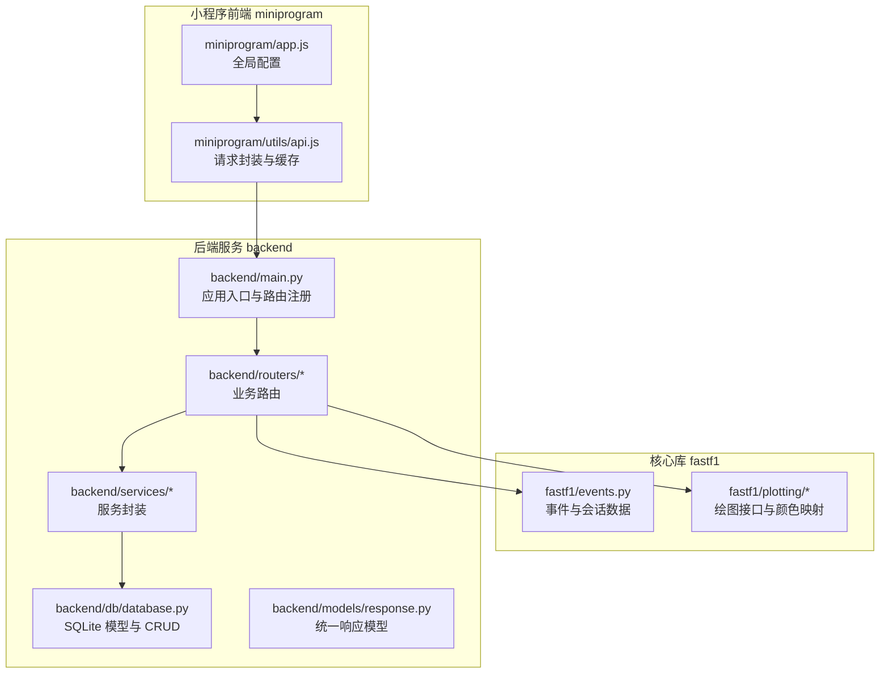
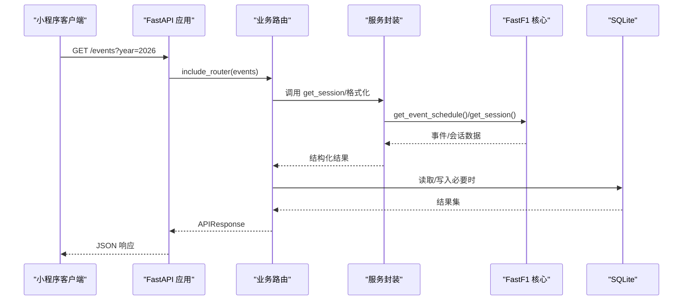
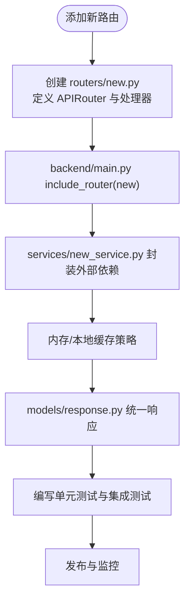
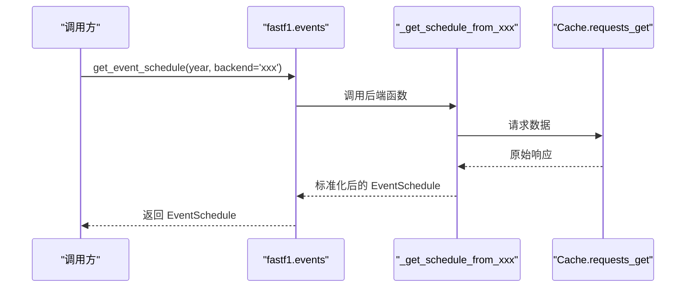
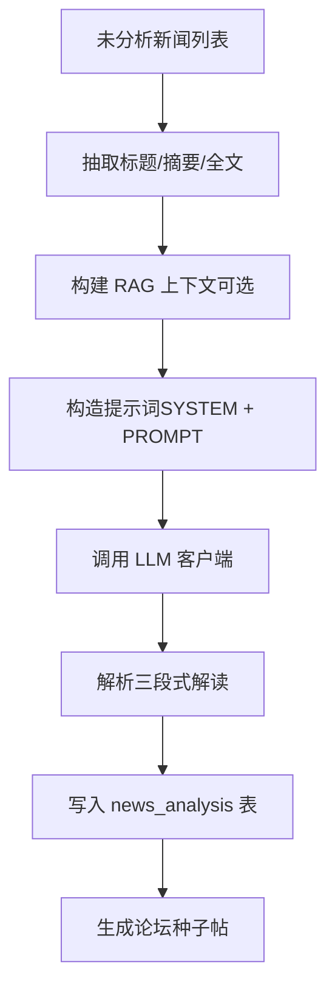
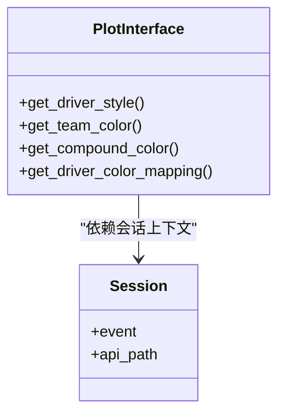
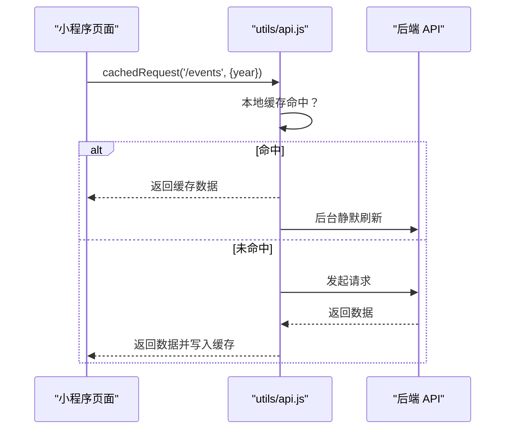
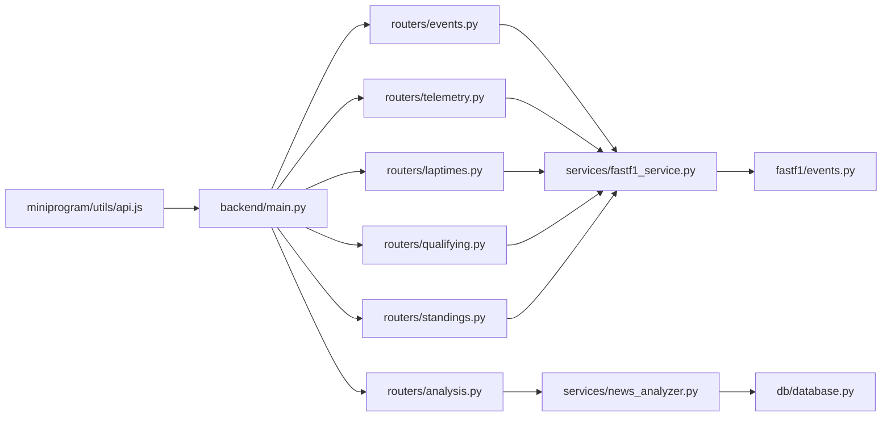

# 扩展开发

<cite>
**本文引用的文件**
- [README.md](file://README.md)
- [pyproject.toml](file://pyproject.toml)
- [backend/main.py](file://backend/main.py)
- [backend/routers/events.py](file://backend/routers/events.py)
- [backend/routers/analysis.py](file://backend/routers/analysis.py)
- [backend/routers/telemetry.py](file://backend/routers/telemetry.py)
- [backend/routers/laptimes.py](file://backend/routers/laptimes.py)
- [backend/routers/qualifying.py](file://backend/routers/qualifying.py)
- [backend/routers/standings.py](file://backend/routers/standings.py)
- [backend/routers/news.py](file://backend/routers/news.py)
- [backend/routers/forum.py](file://backend/routers/forum.py)
- [backend/routers/admin.py](file://backend/routers/admin.py)
- [backend/routers/terms.py](file://backend/routers/terms.py)
- [backend/routers/hot.py](file://backend/routers/hot.py)
- [backend/routers/driver.py](file://backend/routers/driver.py)
- [backend/services/fastf1_service.py](file://backend/services/fastf1_service.py)
- [backend/services/news_analyzer.py](file://backend/services/news_analyzer.py)
- [backend/services/rule_engine.py](file://backend/services/rule_engine.py)
- [backend/services/llm_client.py](file://backend/services/llm_client.py)
- [backend/db/database.py](file://backend/db/database.py)
- [backend/models/response.py](file://backend/models/response.py)
- [fastf1/events.py](file://fastf1/events.py)
- [fastf1/plotting/__init__.py](file://fastf1/plotting/__init__.py)
- [fastf1/plotting/_interface.py](file://fastf1/plotting/_interface.py)
- [miniprogram/app.js](file://miniprogram/app.js)
- [miniprogram/utils/api.js](file://miniprogram/utils/api.js)
</cite>

## 目录
1. [简介](#简介)
2. [项目结构](#项目结构)
3. [核心组件](#核心组件)
4. [架构总览](#架构总览)
5. [详细组件分析](#详细组件分析)
6. [依赖关系分析](#依赖关系分析)
7. [性能考量](#性能考量)
8. [故障排查指南](#故障排查指南)
9. [结论](#结论)
10. [附录](#附录)

## 简介
本指南面向希望为 Fast-F1 生态系统进行扩展开发的工程师与贡献者，覆盖后端 API 扩展、数据分析与可视化扩展、插件与规则引擎扩展、小程序前端扩展以及第三方集成与测试发布的完整流程。文档基于仓库现有实现进行归纳总结，帮助读者快速理解扩展点与最佳实践。

## 项目结构
Fast-F1 项目由三层组成：
- 核心库 fastf1：提供数据获取、解析、可视化与缓存能力
- 后端服务 backend：基于 FastAPI 提供 REST API，封装数据源与业务逻辑
- 小程序前端 miniprogram：基于微信小程序框架的移动端应用

**图表来源**
- [backend/main.py:18-41](file://backend/main.py#L18-L41)
- [backend/routers/events.py:1-506](file://backend/routers/events.py#L1-L506)
- [backend/services/fastf1_service.py:1-64](file://backend/services/fastf1_service.py#L1-L64)
- [backend/db/database.py:1-160](file://backend/db/database.py#L1-L160)
- [fastf1/events.py:285-343](file://fastf1/events.py#L285-L343)
- [fastf1/plotting/__init__.py:1-48](file://fastf1/plotting/__init__.py#L1-L48)
- [miniprogram/app.js:1-23](file://miniprogram/app.js#L1-L23)
- [miniprogram/utils/api.js:1-299](file://miniprogram/utils/api.js#L1-L299)

**章节来源**
- [README.md:1-75](file://README.md#L1-L75)
- [pyproject.toml:1-136](file://pyproject.toml#L1-L136)
- [backend/main.py:1-157](file://backend/main.py#L1-L157)

## 核心组件
- 数据获取与缓存
  - fastf1.events：统一调度多个后端（自研、F1 官方、Ergast），并提供事件/会话/赛程数据的获取与解析
  - backend.services.fastf1_service：对 FastF1 的调用进行进程级内存缓存与通用格式化
- API 层
  - backend.main：集中注册路由、CORS 中间件、启动/关闭钩子与定时任务
  - routers/*：按领域拆分的路由模块，统一返回 APIResponse
- 数据持久化
  - backend.db.database：SQLite DDL、索引与常用 CRUD，覆盖新闻、AI 分析、论坛、术语、车手评分等
- 可视化
  - fastf1.plotting：提供车手/车队颜色、风格映射、复合轮胎颜色等接口
- 小程序前端
  - miniprogram/utils/api：统一封装 wx.request，提供本地缓存、TTL、重试与管理员鉴权头
  - miniprogram/app.js：全局 BASE_URL 与应用生命周期

**章节来源**
- [fastf1/events.py:285-343](file://fastf1/events.py#L285-L343)
- [backend/services/fastf1_service.py:1-64](file://backend/services/fastf1_service.py#L1-L64)
- [backend/main.py:1-157](file://backend/main.py#L1-L157)
- [backend/db/database.py:1-160](file://backend/db/database.py#L1-L160)
- [fastf1/plotting/__init__.py:1-48](file://fastf1/plotting/__init__.py#L1-L48)
- [miniprogram/utils/api.js:1-299](file://miniprogram/utils/api.js#L1-L299)
- [miniprogram/app.js:1-23](file://miniprogram/app.js#L1-L23)

## 架构总览
后端采用“路由-服务-数据源”的分层设计，核心扩展点如下：
- 新数据源集成：在 fastf1.events 中新增后端函数，并在 get_event_schedule 的后端顺序中加入
- 分析算法添加：在 backend.services.rule_engine 中扩展指标计算，或在 news_analyzer 中扩展 RAG 上下文与提示词
- 可视化扩展：在 fastf1/plotting 下新增颜色映射或样式生成器
- 后端服务扩展：在 backend/main.py 注册新路由，编写 routers/* 与 services/*
- 小程序扩展：在 miniprogram/utils/api.js 增加接口封装与缓存 TTL，页面按需新增
- 插件系统：通过 services/* 与 routers/* 的模块化组织，实现规则引擎、LLM 客户端与缓存策略的可插拔

**图表来源**
- [backend/main.py:27-41](file://backend/main.py#L27-L41)
- [backend/routers/events.py:21-53](file://backend/routers/events.py#L21-L53)
- [backend/services/fastf1_service.py:14-21](file://backend/services/fastf1_service.py#L14-L21)
- [fastf1/events.py:285-343](file://fastf1/events.py#L285-L343)
- [backend/db/database.py:221-325](file://backend/db/database.py#L221-L325)

## 详细组件分析

### 后端 API 扩展（新增路由与服务）
- 新增路由步骤
  - 在 backend/main.py 的 include_router 中注册新路由
  - 在 routers/ 下创建新模块，定义 APIRouter 与处理器
  - 使用 models/response.py 的 ok/err 统一响应
- 服务封装建议
  - 对外部依赖（FastF1、数据库、LLM）进行统一封装，便于缓存与错误处理
  - 对热点数据设置内存/本地缓存，控制 TTL
- 中间件与启动流程
  - CORS 已内置，可在 main.py 中扩展认证/限流中间件
  - startup/shutdown 钩子可用于数据库初始化、定时任务与缓存预热

**图表来源**
- [backend/main.py:27-41](file://backend/main.py#L27-L41)
- [backend/models/response.py:1-14](file://backend/models/response.py#L1-L14)

**章节来源**
- [backend/main.py:1-157](file://backend/main.py#L1-L157)
- [backend/models/response.py:1-14](file://backend/models/response.py#L1-L14)

### 新数据源集成（FastF1 后端扩展）
- 扩展点
  - 在 fastf1/events.py 中新增后端函数（如 _get_schedule_from_xxx）
  - 在 get_event_schedule 的后端顺序中加入新后端，或通过参数选择
- 注意事项
  - 保持与现有列名/时间戳格式一致
  - 使用 Cache.requests_get 与统一 User-Agent
  - 对异常进行 soft_exceptions 包裹，避免中断主流程

**图表来源**
- [fastf1/events.py:318-339](file://fastf1/events.py#L318-L339)
- [fastf1/events.py:404-459](file://fastf1/events.py#L404-L459)

**章节来源**
- [fastf1/events.py:285-343](file://fastf1/events.py#L285-L343)
- [fastf1/events.py:404-459](file://fastf1/events.py#L404-L459)

### 分析算法添加（规则引擎与 LLM 集成）
- 规则引擎扩展
  - 在 backend/services/rule_engine.py 中新增分析函数，复用现有指标聚合接口
  - 输入为遥测/圈数据，输出结构化指标，便于 LLM prompt
- LLM 集成与提示词
  - 在 backend/services/news_analyzer.py 中扩展 SYSTEM PROMPT 与模板
  - 通过 RAG 缓存注入实时积分榜等上下文，控制 token 使用
- 自动化与缓存
  - 定时任务扫描未分析新闻，批量处理并写入数据库
  - 分析完成后自动写入论坛种子帖

**图表来源**
- [backend/services/news_analyzer.py:220-298](file://backend/services/news_analyzer.py#L220-L298)
- [backend/services/rule_engine.py:1-146](file://backend/services/rule_engine.py#L1-L146)

**章节来源**
- [backend/services/news_analyzer.py:1-298](file://backend/services/news_analyzer.py#L1-L298)
- [backend/services/rule_engine.py:1-146](file://backend/services/rule_engine.py#L1-L146)

### 可视化扩展（绘图接口与颜色映射）
- 扩展点
  - 在 fastf1/plotting/_interface.py 中新增颜色映射或样式生成逻辑
  - 通过 get_driver_style/get_team_color 等接口对外暴露
- 与后端联动
  - 后端路由返回的数据可直接用于前端绘图组件（如小程序的 ECharts）

**图表来源**
- [fastf1/plotting/_interface.py:31-200](file://fastf1/plotting/_interface.py#L31-L200)
- [fastf1/plotting/__init__.py:1-48](file://fastf1/plotting/__init__.py#L1-L48)

**章节来源**
- [fastf1/plotting/_interface.py:1-800](file://fastf1/plotting/_interface.py#L1-L800)
- [fastf1/plotting/__init__.py:1-48](file://fastf1/plotting/__init__.py#L1-L48)

### 小程序前端扩展（页面、组件与样式）
- 新页面开发
  - 在 miniprogram/pages 下新增目录与文件，配置 json/wxml/wxss/js
  - 在 app.json 的 pages 数组中注册
- 组件封装
  - 在 miniprogram/components 下创建可复用组件，遵循单一职责
- 样式定制
  - 在对应页面 wxss 中覆盖默认样式，或引入公共样式
- 请求与缓存
  - 使用 utils/api.js 的 cachedRequest/request/post 封装，按接口设置 TTL
  - 管理员相关接口使用 adminHeader 注入 X-Admin-Token

**图表来源**
- [miniprogram/utils/api.js:98-120](file://miniprogram/utils/api.js#L98-L120)
- [miniprogram/app.js:1-23](file://miniprogram/app.js#L1-L23)

**章节来源**
- [miniprogram/utils/api.js:1-299](file://miniprogram/utils/api.js#L1-L299)
- [miniprogram/app.js:1-23](file://miniprogram/app.js#L1-L23)

### 插件系统与缓存策略定制
- 规则引擎扩展
  - 在 backend/services/rule_engine.py 中新增分析维度（如轮胎压力、攻防回合统计）
- LLM 集成
  - 在 backend/services/llm_client.py 中抽象客户端，支持多模型切换与限流
- 缓存策略
  - 进程级内存缓存：backend.services.fastf1_service
  - 路由级内存缓存：backend.routers.events
  - 本地磁盘缓存：小程序 utils/api.js 的本地缓存与 TTL
  - 数据库缓存：backend.db.database 的 WAL 模式与索引优化

**章节来源**
- [backend/services/fastf1_service.py:1-64](file://backend/services/fastf1_service.py#L1-L64)
- [backend/routers/events.py:12-20](file://backend/routers/events.py#L12-L20)
- [miniprogram/utils/api.js:26-40](file://miniprogram/utils/api.js#L26-L40)
- [backend/db/database.py:13-19](file://backend/db/database.py#L13-L19)

## 依赖关系分析
- 后端依赖链
  - main.py → routers/* → services/* → fastf1.events / db.database
  - routers/* → models/response.py
- 前端依赖链
  - app.js → utils/api.js → 后端 API

**图表来源**
- [backend/main.py:27-41](file://backend/main.py#L27-L41)
- [backend/routers/events.py:1-506](file://backend/routers/events.py#L1-L506)
- [backend/services/fastf1_service.py:1-64](file://backend/services/fastf1_service.py#L1-L64)
- [backend/services/news_analyzer.py:1-298](file://backend/services/news_analyzer.py#L1-L298)
- [backend/db/database.py:1-160](file://backend/db/database.py#L1-L160)
- [miniprogram/utils/api.js:1-299](file://miniprogram/utils/api.js#L1-L299)

**章节来源**
- [backend/main.py:1-157](file://backend/main.py#L1-L157)

## 性能考量
- 缓存策略
  - 进程级内存缓存：避免重复加载相同 Session
  - 路由级内存缓存：6 小时 TTL 的事件数据
  - 本地缓存：小程序按接口设置 TTL，命中后静默刷新
  - 数据库：WAL 模式提升并发写入性能
- I/O 优化
  - FastF1 请求统一走 Cache.requests_get，减少重复网络请求
  - LLM 调用控制温度与 token 上限，必要时注入 RAG 上下文
- 可视化
  - 使用 fastf1.plotting 的颜色映射与样式生成，减少重复计算

**章节来源**
- [backend/services/fastf1_service.py:11-21](file://backend/services/fastf1_service.py#L11-L21)
- [backend/routers/events.py:12-20](file://backend/routers/events.py#L12-L20)
- [miniprogram/utils/api.js:3-15](file://miniprogram/utils/api.js#L3-L15)
- [backend/db/database.py:17-18](file://backend/db/database.py#L17-L18)

## 故障排查指南
- 后端启动与定时任务
  - 检查 on_startup 是否成功初始化数据库与缓存预热
  - 查看定时任务日志，确认新闻爬取与缓存刷新正常
- API 响应
  - 统一使用 models/response.py 的 ok/err，便于前端判断
  - 如遇异常，查看服务日志与异常捕获
- 数据库
  - 确认 DDL 与索引已创建，必要时执行 init_db
  - WAL 模式下注意并发写入冲突
- 小程序
  - 检查 BASE_URL 与网络权限
  - 使用 cachedRequest 的 TTL 设置，避免频繁请求

**章节来源**
- [backend/main.py:117-136](file://backend/main.py#L117-L136)
- [backend/models/response.py:1-14](file://backend/models/response.py#L1-L14)
- [backend/db/database.py:204-214](file://backend/db/database.py#L204-L214)
- [miniprogram/app.js:1-23](file://miniprogram/app.js#L1-L23)

## 结论
通过以上扩展点与最佳实践，开发者可以在不破坏现有架构的前提下，快速集成新数据源、增强分析算法、扩展可视化能力、完善后端 API 与小程序前端，并实现插件化的规则引擎与 LLM 集成。建议在扩展过程中严格遵循统一响应模型、缓存策略与错误处理规范，确保系统稳定性与可维护性。

## 附录
- 第三方集成最佳实践
  - 外部 API 集成：统一在 services/* 中封装，使用 Cache.requests_get 与异常包裹
  - 数据格式转换：在 routers/* 中进行标准化，避免污染核心库
  - 错误处理：使用统一的 APIResponse，记录日志并降级处理
- 测试与发布
  - 单元测试：针对 routers/* 与 services/* 编写测试用例
  - 集成测试：模拟 FastAPI 路由与数据库交互
  - 发布：遵循 pyproject.toml 中的版本与依赖管理，使用构建工具打包

**章节来源**
- [pyproject.toml:1-136](file://pyproject.toml#L1-L136)