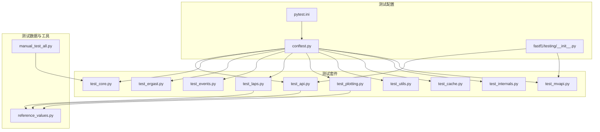
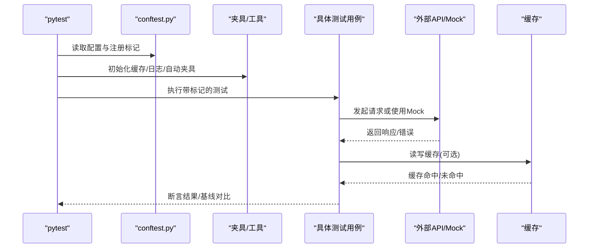
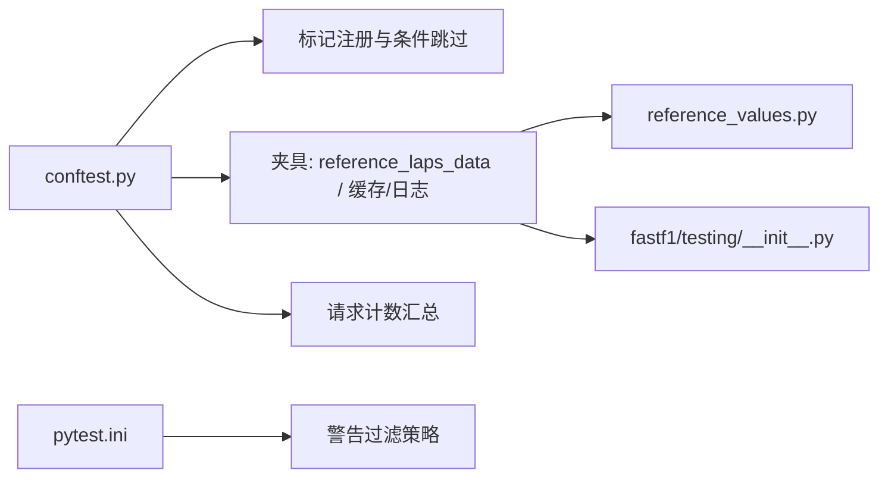

# 测试策略

<cite>
**本文引用的文件**
- [pytest.ini](file://pytest.ini)
- [conftest.py](file://conftest.py)
- [fastf1/testing/__init__.py](file://fastf1/testing/__init__.py)
- [fastf1/tests/test_api.py](file://fastf1/tests/test_api.py)
- [fastf1/tests/test_core.py](file://fastf1/tests/test_core.py)
- [fastf1/tests/test_ergast.py](file://fastf1/tests/test_ergast.py)
- [fastf1/tests/test_events.py](file://fastf1/tests/test_events.py)
- [fastf1/tests/test_laps.py](file://fastf1/tests/test_laps.py)
- [fastf1/tests/test_plotting.py](file://fastf1/tests/test_plotting.py)
- [fastf1/tests/test_utils.py](file://fastf1/tests/test_utils.py)
- [fastf1/tests/test_cache.py](file://fastf1/tests/test_cache.py)
- [fastf1/tests/test_internals.py](file://fastf1/tests/test_internals.py)
- [fastf1/tests/test_mvapi.py](file://fastf1/tests/test_mvapi.py)
- [fastf1/testing/reference_values.py](file://fastf1/testing/reference_values.py)
- [fastf1/testing/manual_test_all.py](file://fastf1/testing/manual_test_all.py)
</cite>

## 目录
1. [引言](#引言)
2. [项目结构](#项目结构)
3. [核心组件](#核心组件)
4. [架构总览](#架构总览)
5. [详细组件分析](#详细组件分析)
6. [依赖分析](#依赖分析)
7. [性能考虑](#性能考虑)
8. [故障排查指南](#故障排查指南)
9. [结论](#结论)
10. [附录](#附录)

## 引言
本测试策略文档面向 Fast-F1 项目，系统化阐述测试金字塔与测试层次结构（单元测试、集成测试、端到端测试）的设计原则与实践方法；详细说明单元测试的编写规范（测试用例设计、Mock 使用、断言策略）、集成测试（API、数据库、外部服务）的实施要点；给出性能测试与基准测试的执行方法（含负载与压力测试配置思路）；明确测试数据管理策略（准备、清理、隔离）；并提供持续集成与自动化测试流程建议（结合现有 pytest 配置与标记体系），以及测试覆盖率与质量门禁建议。

## 项目结构
Fast-F1 的测试组织遵循“按模块分层”的结构：核心功能在 fastf1 子包中，测试集中在 fastf1/tests 下，配套工具位于 fastf1/testing。pytest 配置集中于根目录的 pytest.ini 与 conftest.py，通过标记与命令行参数控制测试集合与运行行为。

图表来源
- [pytest.ini:1-53](file://pytest.ini#L1-L53)
- [conftest.py:1-162](file://conftest.py#L1-L162)
- [fastf1/testing/__init__.py:1-89](file://fastf1/testing/__init__.py#L1-L89)
- [fastf1/tests/test_api.py:1-293](file://fastf1/tests/test_api.py#L1-L293)
- [fastf1/tests/test_core.py:1-217](file://fastf1/tests/test_core.py#L1-L217)
- [fastf1/tests/test_ergast.py:1-755](file://fastf1/tests/test_ergast.py#L1-L755)
- [fastf1/tests/test_events.py:1-357](file://fastf1/tests/test_events.py#L1-L357)
- [fastf1/tests/test_laps.py:1-430](file://fastf1/tests/test_laps.py#L1-L430)
- [fastf1/tests/test_plotting.py:1-588](file://fastf1/tests/test_plotting.py#L1-L588)
- [fastf1/tests/test_utils.py:1-51](file://fastf1/tests/test_utils.py#L1-L51)
- [fastf1/tests/test_cache.py:1-123](file://fastf1/tests/test_cache.py#L1-L123)
- [fastf1/tests/test_internals.py:1-225](file://fastf1/tests/test_internals.py#L1-L225)
- [fastf1/tests/test_mvapi.py:1-43](file://fastf1/tests/test_mvapi.py#L1-L43)
- [fastf1/testing/reference_values.py:1-65](file://fastf1/testing/reference_values.py#L1-L65)
- [fastf1/testing/manual_test_all.py:1-67](file://fastf1/testing/manual_test_all.py#L1-L67)

章节来源
- [pytest.ini:1-53](file://pytest.ini#L1-L53)
- [conftest.py:1-162](file://conftest.py#L1-L162)

## 核心组件
- 测试运行器与配置
  - pytest.ini 定义测试路径、doctest 选项、Matplotlib 基线路径与结果目录、警告过滤策略。
  - conftest.py 注册自定义标记（f1telapi、ergastapi、prjdoc、slow），提供 CLI 选项与条件跳过逻辑，并注入缓存与日志调试设置。
- 测试工具
  - fastf1/testing 提供 run_in_subprocess、capture_log 等工具，用于跨进程测试与日志捕获。
- 测试数据与参考值
  - fastf1/testing/reference_values 提供统一的数据类型断言工具与参考列类型，确保 DataFrame 列类型一致性。
- 手动全量回归脚本
  - fastf1/testing/manual_test_all 提供对历史多场次的全量加载与异常记录，便于回归验证。

章节来源
- [pytest.ini:1-53](file://pytest.ini#L1-L53)
- [conftest.py:14-86](file://conftest.py#L14-L86)
- [fastf1/testing/__init__.py:18-89](file://fastf1/testing/__init__.py#L18-L89)
- [fastf1/testing/reference_values.py:1-65](file://fastf1/testing/reference_values.py#L1-L65)
- [fastf1/testing/manual_test_all.py:1-67](file://fastf1/testing/manual_test_all.py#L1-L67)

## 架构总览
下图展示测试运行时的关键交互：pytest 配置与夹具初始化、测试用例执行、外部 API/Mock 与缓存交互、Matplotlib 基线对比等。

图表来源
- [conftest.py:124-162](file://conftest.py#L124-L162)
- [fastf1/tests/test_cache.py:19-123](file://fastf1/tests/test_cache.py#L19-L123)
- [pytest.ini:14-20](file://pytest.ini#L14-L20)

## 详细组件分析

### 单元测试（Unit Tests）
- 设计原则
  - 小而快：聚焦单一函数/类方法，避免外部依赖。
  - 明确输入输出：使用参数化测试覆盖边界与典型场景。
  - 可重复性：通过固定随机种子、时间戳或 Mock 数据保证可重复。
- 测试用例设计
  - 结构化断言：类型断言、形状断言、列名断言、空值断言、数值近似断言。
  - 参数化：pytest.mark.parametrize 广泛用于多输入组合。
  - 失败路径：显式触发异常或警告，断言日志内容。
- Mock 对象使用
  - requests_mock：对外部 HTTP 请求进行 Mock，确保离线可测与响应可控。
  - caplog/capsys：捕获日志与标准输出，验证警告与错误信息。
  - subprocess：对修改全局常量/状态的测试，使用 run_in_subprocess 隔离副作用。
- 断言策略
  - 类型断言：使用 reference_values 中的列类型表进行统一校验。
  - 结构断言：DataFrame 形状、列名、索引、缺失值分布。
  - 数值断言：pandas.testing.assert_frame_equal、pytest.approx 近似比较。

示例路径
- [test_api.py:12-293](file://fastf1/tests/test_api.py#L12-L293)
- [test_ergast.py:27-200](file://fastf1/tests/test_ergast.py#L27-L200)
- [test_utils.py:9-51](file://fastf1/tests/test_utils.py#L9-L51)
- [test_internals.py:24-225](file://fastf1/tests/test_internals.py#L24-L225)

章节来源
- [fastf1/tests/test_api.py:12-293](file://fastf1/tests/test_api.py#L12-L293)
- [fastf1/tests/test_ergast.py:27-200](file://fastf1/tests/test_ergast.py#L27-L200)
- [fastf1/tests/test_utils.py:9-51](file://fastf1/tests/test_utils.py#L9-L51)
- [fastf1/tests/test_internals.py:24-225](file://fastf1/tests/test_internals.py#L24-L225)
- [fastf1/testing/reference_values.py:4-65](file://fastf1/testing/reference_values.py#L4-L65)

### 集成测试（Integration Tests）
- API 测试
  - Ergast API：验证 URL 构造、分页、自动类型转换、嵌套 JSON 展平与重命名。
  - 多源 API：F1 Telemetry API、MVAPI 等，通过 requests_mock 模拟响应，断言解析结果与警告。
- 数据库/缓存测试
  - 缓存启用、命中、清理：验证 Pickle 文件生成、缓存目录结构、二次加载命中日志。
- 外部服务测试
  - 通过 requests_mock 模拟静态响应，确保不依赖真实网络与外部服务可用性。
  - 对需要真实会话数据的测试，使用标记与条件跳过，避免阻塞 CI。

示例路径
- [test_ergast.py:414-755](file://fastf1/tests/test_ergast.py#L414-L755)
- [test_mvapi.py:15-43](file://fastf1/tests/test_mvapi.py#L15-L43)
- [test_cache.py:19-123](file://fastf1/tests/test_cache.py#L19-L123)

章节来源
- [fastf1/tests/test_ergast.py:414-755](file://fastf1/tests/test_ergast.py#L414-L755)
- [fastf1/tests/test_mvapi.py:15-43](file://fastf1/tests/test_mvapi.py#L15-L43)
- [fastf1/tests/test_cache.py:19-123](file://fastf1/tests/test_cache.py#L19-L123)

### 端到端测试（End-to-End Tests）
- 全量会话加载与处理
  - 使用 get_session + load() 加载真实数据，覆盖事件、车手、圈速、遥测、天气等多模块。
  - manual_test_all 提供对历史多场次的全量回归，记录异常与堆栈。
- Matplotlib 图形基线
  - 通过 --mpl 与基线路径配置，进行图形渲染一致性检查。

示例路径
- [test_core.py:15-217](file://fastf1/tests/test_core.py#L15-L217)
- [test_laps.py:78-430](file://fastf1/tests/test_laps.py#L78-L430)
- [test_plotting.py:20-588](file://fastf1/tests/test_plotting.py#L20-L588)
- [fastf1/testing/manual_test_all.py:1-67](file://fastf1/testing/manual_test_all.py#L1-L67)

章节来源
- [fastf1/tests/test_core.py:15-217](file://fastf1/tests/test_core.py#L15-L217)
- [fastf1/tests/test_laps.py:78-430](file://fastf1/tests/test_laps.py#L78-L430)
- [fastf1/tests/test_plotting.py:20-588](file://fastf1/tests/test_plotting.py#L20-L588)
- [fastf1/testing/manual_test_all.py:1-67](file://fastf1/testing/manual_test_all.py#L1-L67)

### 性能测试与基准测试
- 基准测试（pytest-benchmark）
  - 可在现有测试框架上扩展，针对热点函数（如数据解析、类型转换、DataFrame 构建）添加基准测试。
  - 建议使用 mark.benchmark 标记，分组统计平均耗时与方差。
- 负载与压力测试
  - 通过循环多次调用相同接口，统计请求次数、缓存命中率、内存占用与异常比例。
  - 结合 CI 的 --slow 标记，控制高耗时测试的运行范围。

[本节为通用指导，无需特定文件引用]

### 测试数据管理
- 准备
  - 使用 fastf1/testing/reference_data 中的历史原始数据作为稳定输入，确保断言稳定性。
  - 通过 requests_mock 构造标准化响应，避免真实网络波动。
- 清理
  - 测试结束后清理缓存目录与临时文件，避免污染后续测试。
- 隔离
  - 使用 run_in_subprocess 隔离对全局常量/状态的修改，确保测试间互不干扰。
  - 使用 caplog/capture_log 在子进程中捕获日志，替代 caplog。

示例路径
- [test_cache.py:19-123](file://fastf1/tests/test_cache.py#L19-L123)
- [fastf1/testing/__init__.py:18-89](file://fastf1/testing/__init__.py#L18-L89)

章节来源
- [fastf1/tests/test_cache.py:19-123](file://fastf1/tests/test_cache.py#L19-L123)
- [fastf1/testing/__init__.py:18-89](file://fastf1/testing/__init__.py#L18-L89)

### 持续集成与自动化测试
- 标记与条件执行
  - f1telapi/ergastapi/slow/prjdoc 标记配合 CLI 选项，实现按需跳过或仅运行特定类别测试。
- 日志与请求数统计
  - 终止阶段汇总每个测试的“未缓存请求数”，辅助评估缓存命中与外部依赖开销。
- 基线与图形测试
  - Matplotlib 基线路径与结果目录在 pytest.ini 中配置，CI 中可上传结果目录进行比对。

示例路径
- [conftest.py:35-121](file://conftest.py#L35-L121)
- [pytest.ini:14-20](file://pytest.ini#L14-L20)

章节来源
- [conftest.py:35-121](file://conftest.py#L35-L121)
- [pytest.ini:14-20](file://pytest.ini#L14-L20)

## 依赖分析
- 测试夹具与工具
  - reference_laps_data 提供统一的会话与 Laps 实例，减少重复加载与缓存抖动。
  - run_in_subprocess/capture_log 解决跨进程与日志捕获问题。
- 标记与过滤
  - f1telapi/ergastapi/slow/prjdoc 标记驱动条件跳过与集合筛选。
- 配置与警告策略
  - pytest.ini 的 filterwarnings 将部分外部警告降级或忽略，避免 CI 抖动。

图表来源
- [conftest.py:35-162](file://conftest.py#L35-L162)
- [pytest.ini:22-53](file://pytest.ini#L22-L53)
- [fastf1/testing/reference_values.py:1-65](file://fastf1/testing/reference_values.py#L1-L65)
- [fastf1/testing/__init__.py:1-89](file://fastf1/testing/__init__.py#L1-L89)

章节来源
- [conftest.py:35-162](file://conftest.py#L35-L162)
- [pytest.ini:22-53](file://pytest.ini#L22-L53)

## 性能考虑
- 缓存优先：优先使用本地缓存，减少外部请求；在 CI 中开启缓存并统计未缓存请求数。
- 数据采样：对大体量数据（遥测、天气）采用截断样本，缩短测试时间。
- 并发与隔离：对全局状态修改使用子进程隔离，避免共享状态导致的性能退化。
- 基线与图形：Matplotlib 基线测试可能引入额外 IO，建议在本地开发时启用，在 CI 中按需运行。

[本节为通用指导，无需特定文件引用]

## 故障排查指南
- 外部 API 不可用
  - 使用 requests_mock 模拟响应；对需要真实数据的测试，使用 --no-f1-tel-api 或 --ergast-api 控制运行。
- 缓存命中异常
  - 检查 Cache.enable_cache 与 Cache.clear_cache 的调用顺序；确认缓存目录权限与路径正确。
- 日志与警告
  - 使用 caplog/capture_log 捕获关键日志；关注 FutureWarning/DeprecationWarning 的来源与影响范围。
- 子进程测试失败
  - 检查 run_in_subprocess 的返回码；必要时在本地复现并定位异常。

章节来源
- [conftest.py:56-86](file://conftest.py#L56-L86)
- [fastf1/tests/test_cache.py:19-123](file://fastf1/tests/test_cache.py#L19-L123)
- [fastf1/testing/__init__.py:18-89](file://fastf1/testing/__init__.py#L18-L89)

## 结论
Fast-F1 的测试体系以 pytest 为核心，结合标记、夹具与工具，实现了从单元到端到端的完整覆盖。通过 Mock 与缓存策略，测试具备高稳定性与可重复性；通过 Matplotlib 基线与日志统计，保障图形一致性与外部依赖可视化。建议在现有基础上进一步完善基准测试与压力测试，强化覆盖率与质量门禁，确保在快速迭代中维持高质量交付。

## 附录
- 测试金字塔与层次划分
  - 单元测试：函数/类方法级，快速、稳定、可重复。
  - 集成测试：模块间协作与外部 API，强调 Mock 与离线验证。
  - 端到端测试：真实会话加载与处理，强调回归与图形基线。
- 覆盖率与质量门禁建议
  - 行为覆盖率：核心业务路径（数据解析、类型转换、DataFrame 构建）达到高覆盖率。
  - 外部依赖：通过缓存与 Mock 降低失败率，CI 中统计未缓存请求数作为质量指标。
  - 基线与图形：图形基线测试纳入质量门禁，失败即阻断合并。

[本节为通用指导，无需特定文件引用]