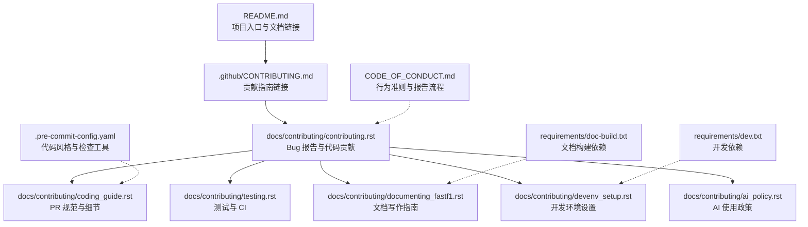
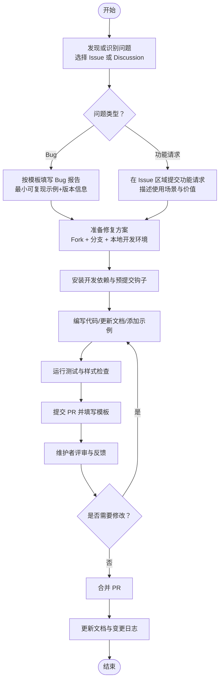
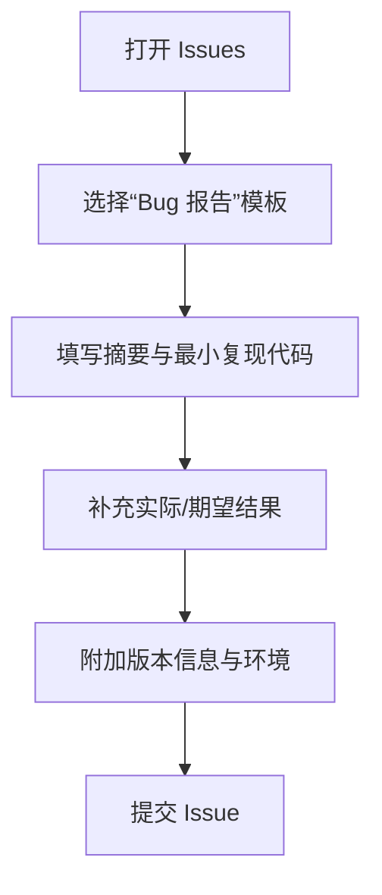
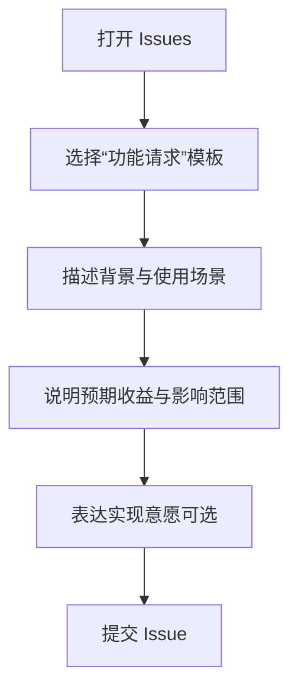
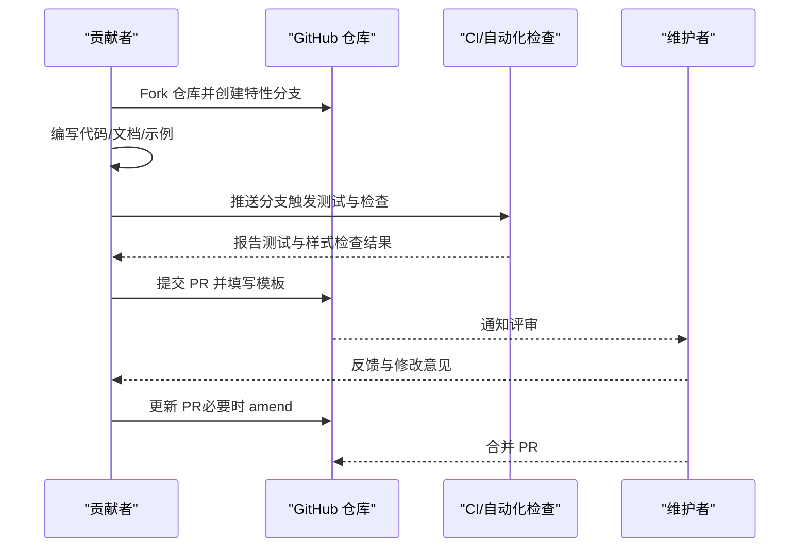
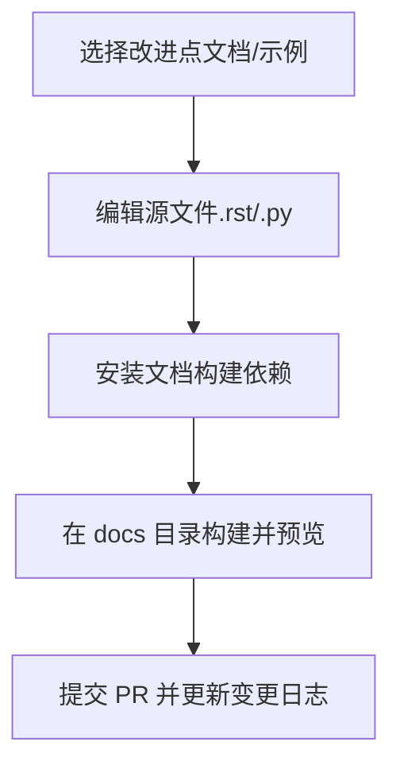
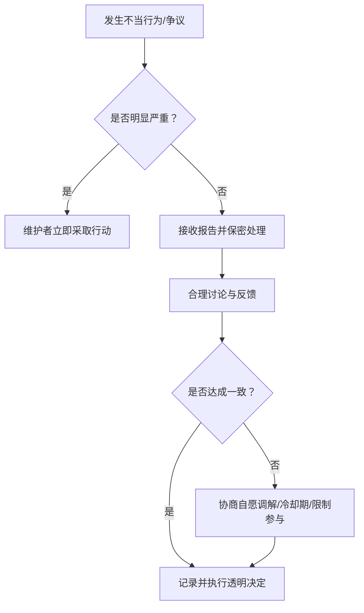
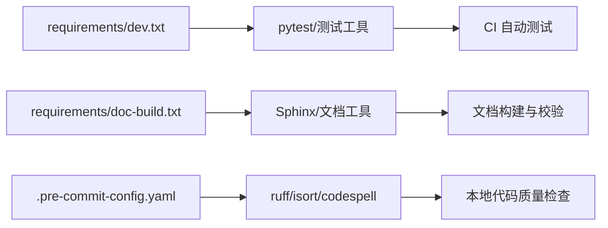

# 贡献流程

<cite>
**本文引用的文件**
- [README.md](file://README.md)
- [.github/CONTRIBUTING.md](file://.github/CONTRIBUTING.md)
- [.github/PULL_REQUEST_TEMPLATE.md](file://.github/PULL_REQUEST_TEMPLATE.md)
- [CODE_OF_CONDUCT.md](file://CODE_OF_CONDUCT.md)
- [docs/contributing/contributing.rst](file://docs/contributing/contributing.rst)
- [docs/contributing/coding_guide.rst](file://docs/contributing/coding_guide.rst)
- [docs/contributing/testing.rst](file://docs/contributing/testing.rst)
- [docs/contributing/documenting_fastf1.rst](file://docs/contributing/documenting_fastf1.rst)
- [docs/contributing/devenv_setup.rst](file://docs/contributing/devenv_setup.rst)
- [docs/contributing/ai_policy.rst](file://docs/contributing/ai_policy.rst)
- [.pre-commit-config.yaml](file://.pre-commit-config.yaml)
- [requirements/dev.txt](file://requirements/dev.txt)
- [requirements/doc-build.txt](file://requirements/doc-build.txt)
</cite>

## 目录
1. [简介](#简介)
2. [项目结构](#项目结构)
3. [核心组件](#核心组件)
4. [架构总览](#架构总览)
5. [详细组件分析](#详细组件分析)
6. [依赖分析](#依赖分析)
7. [性能考虑](#性能考虑)
8. [故障排查指南](#故障排查指南)
9. [结论](#结论)
10. [附录](#附录)

## 简介
本文件面向所有希望参与 Fast-F1 项目的贡献者，系统化地说明以下内容：
- 如何提交 Bug 报告（模板、必要信息、问题分类）
- 功能请求的提交流程（需求描述、使用场景与优先级评估）
- 代码贡献步骤（Fork 仓库、分支管理、提交规范、Pull Request 流程）
- 文档贡献方式（文档改进、示例脚本编写、翻译工作）
- 行为准则与社区参与（沟通礼仪、冲突解决、团队协作）
- 贡献者认可机制与长期贡献者权益

## 项目结构
Fast-F1 的贡献相关资源主要分布在以下位置：
- 官方贡献指南与链接：根目录 README 与 .github/CONTRIBUTING.md
- 拉取请求模板：.github/PULL_REQUEST_TEMPLATE.md
- 社区行为准则：CODE_OF_CONDUCT.md
- 详尽的贡献文档（Bug 报告、代码贡献、测试、文档写作、开发环境、AI 政策等）：docs/contributing/*.rst
- 开发工具与预提交钩子：requirements/* 与 .pre-commit-config.yaml

图表来源
- [README.md:1-75](file://README.md#L1-L75)
- [.github/CONTRIBUTING.md:1-1](file://.github/CONTRIBUTING.md#L1-L1)
- [docs/contributing/contributing.rst:1-431](file://docs/contributing/contributing.rst#L1-L431)
- [docs/contributing/coding_guide.rst:1-85](file://docs/contributing/coding_guide.rst#L1-L85)
- [docs/contributing/testing.rst:1-96](file://docs/contributing/testing.rst#L1-L96)
- [docs/contributing/documenting_fastf1.rst:1-70](file://docs/contributing/documenting_fastf1.rst#L1-L70)
- [docs/contributing/devenv_setup.rst:1-83](file://docs/contributing/devenv_setup.rst#L1-L83)
- [docs/contributing/ai_policy.rst:1-77](file://docs/contributing/ai_policy.rst#L1-L77)
- [.pre-commit-config.yaml:1-20](file://.pre-commit-config.yaml#L1-L20)
- [requirements/dev.txt](file://requirements/dev.txt)
- [requirements/doc-build.txt](file://requirements/doc-build.txt)
- [CODE_OF_CONDUCT.md:1-183](file://CODE_OF_CONDUCT.md#L1-L183)

章节来源
- [README.md:1-75](file://README.md#L1-L75)
- [.github/CONTRIBUTING.md:1-1](file://.github/CONTRIBUTING.md#L1-L1)

## 核心组件
- 贡献指南与入口
  - README 提供官方文档链接与项目概述，便于新贡献者快速定位贡献入口。
  - .github/CONTRIBUTING.md 将用户引导至在线贡献指南页面，确保信息集中且可维护。
- 行为准则
  - CODE_OF_CONDUCT.md 明确社区互动标准、报告流程与执行机制，保障健康协作环境。
- 代码贡献与 PR 流程
  - docs/contributing/contributing.rst 与 docs/contributing/coding_guide.rst 提供从 Fork 到 PR 的完整步骤、规范与最佳实践。
  - .pre-commit-config.yaml 与 requirements/dev.txt 配合，确保代码风格与质量在本地即被检查。
- 文档贡献
  - docs/contributing/documenting_fastf1.rst 与 docs/contributing/devenv_setup.rst 提供文档构建与示例贡献方法。
- 测试与 CI
  - docs/contributing/testing.rst 说明测试运行、CI 行为与跳过策略。
- AI 使用政策
  - docs/contributing/ai_policy.rst 明确 AI 工具使用边界与披露要求。

章节来源
- [README.md:1-75](file://README.md#L1-L75)
- [.github/CONTRIBUTING.md:1-1](file://.github/CONTRIBUTING.md#L1-L1)
- [CODE_OF_CONDUCT.md:1-183](file://CODE_OF_CONDUCT.md#L1-L183)
- [docs/contributing/contributing.rst:1-431](file://docs/contributing/contributing.rst#L1-L431)
- [docs/contributing/coding_guide.rst:1-85](file://docs/contributing/coding_guide.rst#L1-L85)
- [docs/contributing/documenting_fastf1.rst:1-70](file://docs/contributing/documenting_fastf1.rst#L1-L70)
- [docs/contributing/devenv_setup.rst:1-83](file://docs/contributing/devenv_setup.rst#L1-L83)
- [docs/contributing/testing.rst:1-96](file://docs/contributing/testing.rst#L1-L96)
- [docs/contributing/ai_policy.rst:1-77](file://docs/contributing/ai_policy.rst#L1-L77)
- [.pre-commit-config.yaml:1-20](file://.pre-commit-config.yaml#L1-L20)
- [requirements/dev.txt](file://requirements/dev.txt)
- [requirements/doc-build.txt](file://requirements/doc-build.txt)

## 架构总览
下图展示贡献者从发现与报告问题，到实现与评审，再到文档与示例贡献的端到端流程。

图表来源
- [docs/contributing/contributing.rst:15-200](file://docs/contributing/contributing.rst#L15-L200)
- [docs/contributing/coding_guide.rst:11-85](file://docs/contributing/coding_guide.rst#L11-L85)
- [docs/contributing/testing.rst:25-96](file://docs/contributing/testing.rst#L25-L96)
- [docs/contributing/devenv_setup.rst:57-83](file://docs/contributing/devenv_setup.rst#L57-L83)
- [.pre-commit-config.yaml:1-20](file://.pre-commit-config.yaml#L1-L20)

## 详细组件分析

### Bug 报告流程
- 适用场景
  - 代码缺陷、文档错误、API 行为异常、示例失效等。
- 报告入口
  - 在 GitHub Issues 中新建问题；若不确定是否为 Bug，可先发起 Discussion。
- 必要信息清单
  - 简洁的问题摘要（1–2 句）
  - 最小可复现代码片段（便于直接复制粘贴）
  - 实际结果与期望结果
  - FastF1 版本与 Python 版本
- 问题分类
  - 通过标签与标题描述进行分类（由维护者在后续处理中完成）。
- 模板与指引
  - 贡献指南中提供了 Markdown 模板用于组织信息，确保报告完整、聚焦、可描述。

图表来源
- [docs/contributing/contributing.rst:15-60](file://docs/contributing/contributing.rst#L15-L60)

章节来源
- [docs/contributing/contributing.rst:15-60](file://docs/contributing/contributing.rst#L15-L60)

### 功能请求流程
- 适用场景
  - 新增 API、可视化扩展、数据源接入、性能优化建议等。
- 提交流程
  - 在 GitHub Issues 中提交功能请求，描述背景、使用场景与预期收益。
  - 建议同时表达参与实现的意愿，以加速推进。
- 优先级评估
  - 维护者会综合考虑：与项目目标契合度、实现复杂度、对用户的影响范围与成本等。

图表来源
- [docs/contributing/contributing.rst:58-70](file://docs/contributing/contributing.rst#L58-L70)

章节来源
- [docs/contributing/contributing.rst:58-70](file://docs/contributing/contributing.rst#L58-L70)

### 代码贡献步骤
- Fork 与克隆
  - Fork 仓库后克隆到本地，进入目录并安装本地版本以便开发。
- 分支管理
  - 基于 main 分支创建特性分支，避免直接在 main 上工作。
- 编写与提交
  - 遵循 PEP8 风格与 ruff 检查；新增或修改公共 API 需完善 docstring 与示例。
  - 使用预提交钩子自动检查与修复（ruff、isort、codespell）。
- 测试与文档
  - 运行 pytest 并确保所有检查通过；如涉及重大新特性，更新变更日志。
- 提交 PR
  - 在 PR 描述中引用相关 Issue；遵循 PR 模板与 AI 政策披露要求。
- 评审与合并
  - 保持耐心等待反馈；根据评审意见迭代修改；必要时使用 amend 保持历史整洁。

图表来源
- [docs/contributing/contributing.rst:70-180](file://docs/contributing/contributing.rst#L70-L180)
- [docs/contributing/coding_guide.rst:11-85](file://docs/contributing/coding_guide.rst#L11-L85)
- [docs/contributing/testing.rst:75-96](file://docs/contributing/testing.rst#L75-L96)
- [.pre-commit-config.yaml:1-20](file://.pre-commit-config.yaml#L1-L20)

章节来源
- [docs/contributing/contributing.rst:70-180](file://docs/contributing/contributing.rst#L70-L180)
- [docs/contributing/coding_guide.rst:11-85](file://docs/contributing/coding_guide.rst#L11-L85)
- [docs/contributing/testing.rst:75-96](file://docs/contributing/testing.rst#L75-L96)
- [.pre-commit-config.yaml:1-20](file://.pre-commit-config.yaml#L1-L20)

### 文档贡献方式
- 文档改进
  - 修正错别字、改善表述、补充缺失的 API 文档与示例。
- 示例脚本编写
  - 在 examples 目录下新增示例文件，遵循 Sphinx-Gallery 格式，包含标题、分段与说明文本。
- 文档构建与预览
  - 安装文档构建依赖后，在 docs 目录执行构建命令生成 HTML 并预览。
- 写作规范
  - 遵循 Google Docstring 标准与 Sphinx 配置，确保一致性与可读性。

图表来源
- [docs/contributing/documenting_fastf1.rst:18-70](file://docs/contributing/documenting_fastf1.rst#L18-L70)
- [docs/contributing/devenv_setup.rst:59-83](file://docs/contributing/devenv_setup.rst#L59-L83)

章节来源
- [docs/contributing/documenting_fastf1.rst:18-70](file://docs/contributing/documenting_fastf1.rst#L18-L70)
- [docs/contributing/devenv_setup.rst:59-83](file://docs/contributing/devenv_setup.rst#L59-L83)

### 行为准则与社区参与
- 基本原则
  - 开放、同理心、协作、求知、支持、谨慎用词。
- 多样性声明
  - 欢迎来自不同背景的参与者，尊重差异并以英语开展开发沟通。
- 报告与处理
  - 明确报告渠道与保密原则；严重违规可立即采取措施；一般情况按“接收—讨论—调解—透明决策”流程处理。
- 冲突解决
  - 首选私下沟通与公开讨论；必要时由维护者介入并形成记录。

图表来源
- [CODE_OF_CONDUCT.md:89-174](file://CODE_OF_CONDUCT.md#L89-L174)

章节来源
- [CODE_OF_CONDUCT.md:1-183](file://CODE_OF_CONDUCT.md#L1-L183)

### 贡献者认可与长期贡献者权益
- 认可机制
  - 通过变更日志、PR 合并记录与社区公告等形式公开致谢。
- 长期贡献者权益
  - 可能获得更高的权限（如审阅 PR、参与路线规划）与在社区中的权威地位。
- 注意事项
  - 具体机制以项目当前治理为准，建议关注官方公告与讨论区动态。

（本节为概念性说明，不直接分析具体文件）

## 依赖分析
- 开发与测试依赖
  - requirements/dev.txt 提供开发所需依赖，包括测试框架与工具。
  - requirements/doc-build.txt 提供文档构建依赖。
- 预提交钩子
  - .pre-commit-config.yaml 集成 ruff、isort、codespell，确保提交前代码风格与拼写检查通过。
- CI 与测试
  - docs/contributing/testing.rst 说明 CI 行为与跳过策略，保证 PR 质量。

图表来源
- [requirements/dev.txt](file://requirements/dev.txt)
- [requirements/doc-build.txt](file://requirements/doc-build.txt)
- [.pre-commit-config.yaml:1-20](file://.pre-commit-config.yaml#L1-L20)
- [docs/contributing/testing.rst:81-96](file://docs/contributing/testing.rst#L81-L96)

章节来源
- [requirements/dev.txt](file://requirements/dev.txt)
- [requirements/doc-build.txt](file://requirements/doc-build.txt)
- [.pre-commit-config.yaml:1-20](file://.pre-commit-config.yaml#L1-L20)
- [docs/contributing/testing.rst:81-96](file://docs/contributing/testing.rst#L81-L96)

## 性能考虑
- 本地开发
  - 使用虚拟环境隔离依赖，避免全局污染。
  - 安装预提交钩子以减少重复劳动，提升提交效率。
- CI 效率
  - 合理使用跳过指令（如仅跳过特定检查），避免不必要的 CI 时间消耗。
- 文档构建
  - 首次构建需准备缓存目录，后续增量构建更高效。

（本节提供通用建议，不直接分析具体文件）

## 故障排查指南
- PR 被拒或长时间无反馈
  - 检查是否满足 PR 规范（docstring、测试、风格、变更日志）。
  - 在 PR 下方主动留言提醒，保持沟通。
- 本地测试失败
  - 确认已安装开发依赖与文档构建依赖；按测试指南运行单测与并行测试。
- 预提交失败
  - 使用 ruff 与 isort 修复格式问题；codespell 修正拼写错误。
- 行为准则相关问题
  - 遵循报告流程，必要时公开讨论以形成社区共识。

章节来源
- [docs/contributing/coding_guide.rst:11-85](file://docs/contributing/coding_guide.rst#L11-L85)
- [docs/contributing/testing.rst:25-96](file://docs/contributing/testing.rst#L25-L96)
- [.pre-commit-config.yaml:1-20](file://.pre-commit-config.yaml#L1-L20)
- [CODE_OF_CONDUCT.md:89-174](file://CODE_OF_CONDUCT.md#L89-L174)

## 结论
通过遵循上述流程与规范，贡献者可以高效、有序地参与 Fast-F1 的开发与维护。请始终以开放、协作与尊重的态度参与社区建设，并在提交前确保代码质量与文档完整性。

（本节为总结性内容，不直接分析具体文件）

## 附录
- 快速参考
  - 贡献入口：README 与 .github/CONTRIBUTING.md
  - 行为准则：CODE_OF_CONDUCT.md
  - 代码贡献：docs/contributing/contributing.rst 与 docs/contributing/coding_guide.rst
  - 测试与 CI：docs/contributing/testing.rst
  - 文档贡献：docs/contributing/documenting_fastf1.rst 与 docs/contributing/devenv_setup.rst
  - AI 政策：docs/contributing/ai_policy.rst
  - 预提交工具：.pre-commit-config.yaml
  - 开发依赖：requirements/dev.txt、requirements/doc-build.txt

（本节为概览性汇总，不直接分析具体文件）