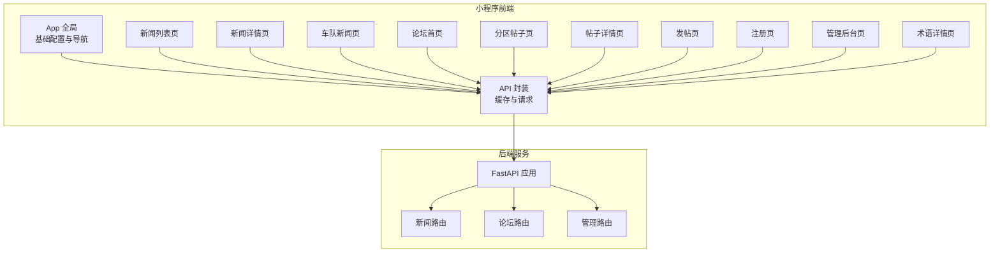
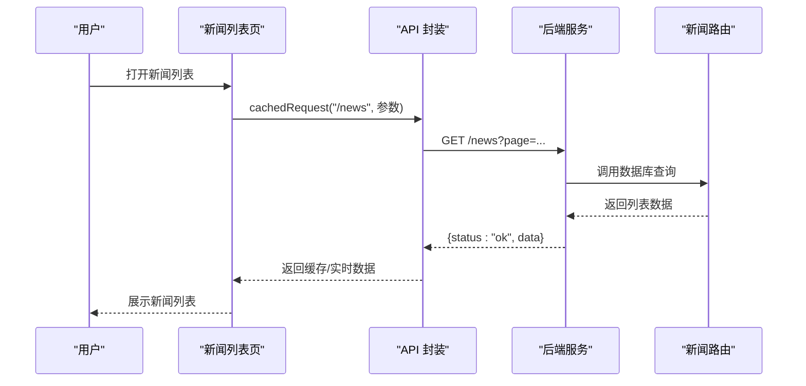
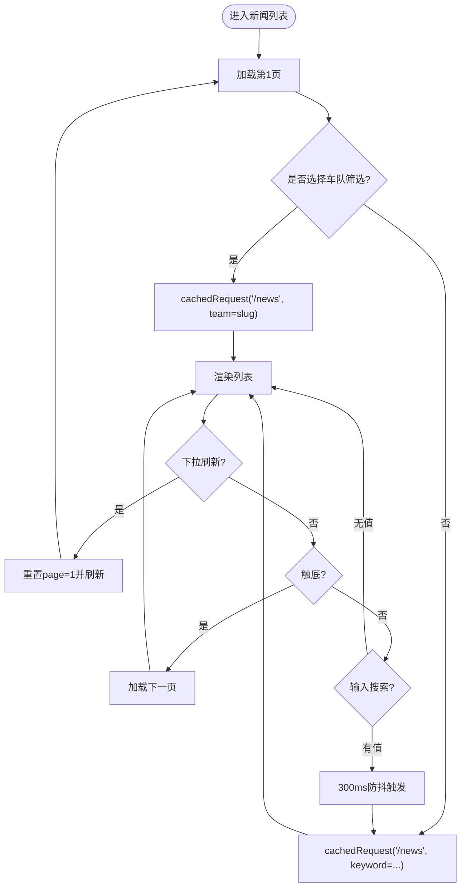
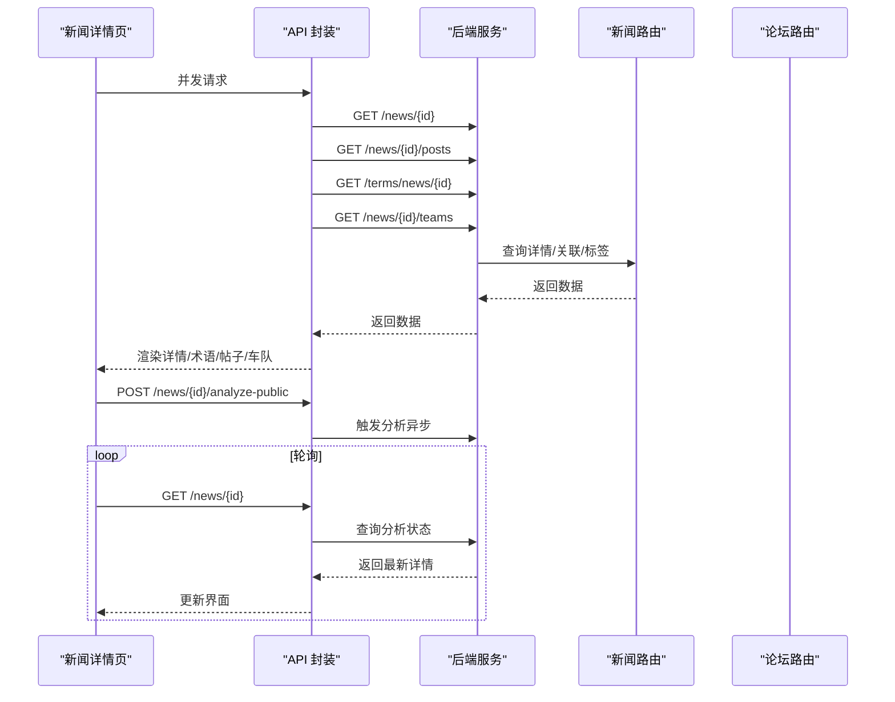
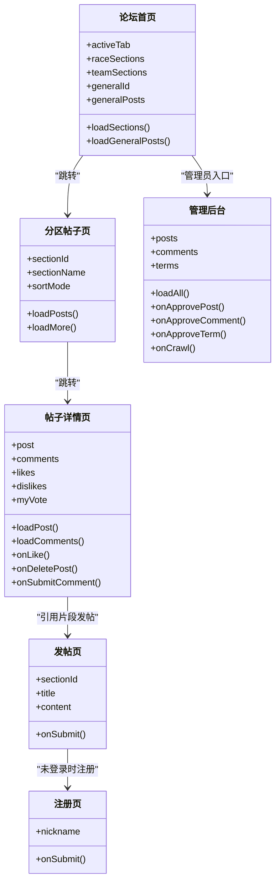
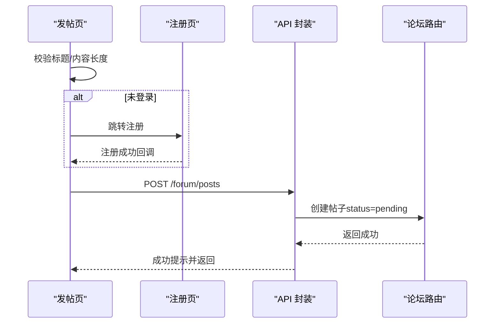
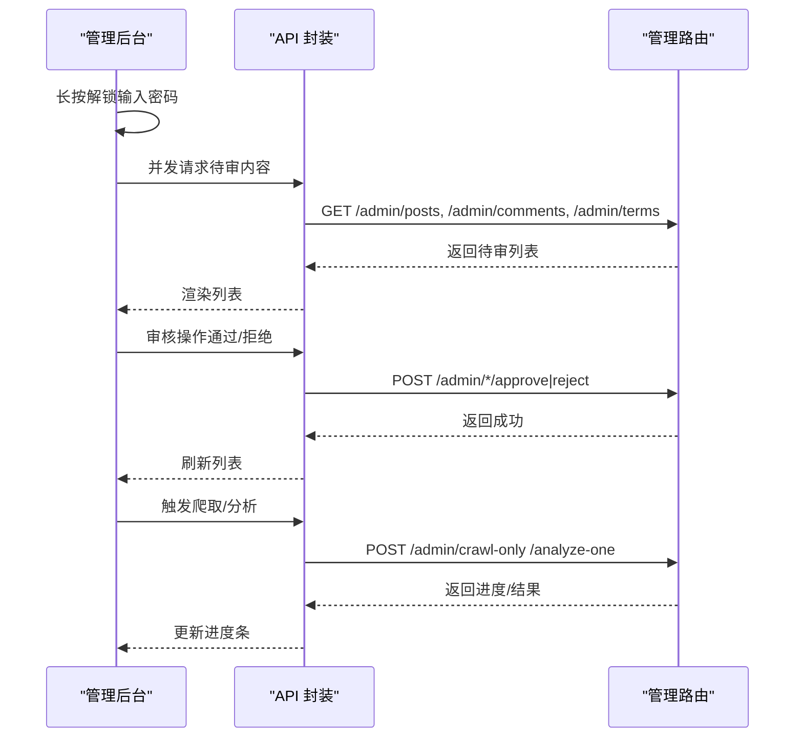
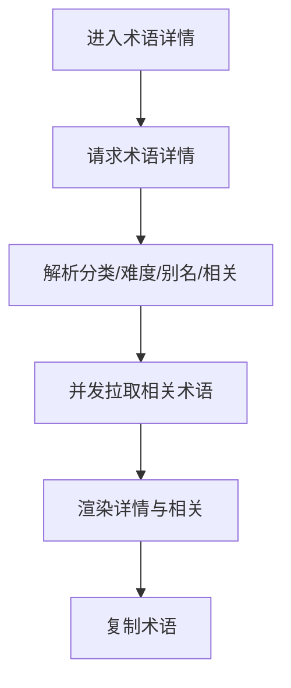
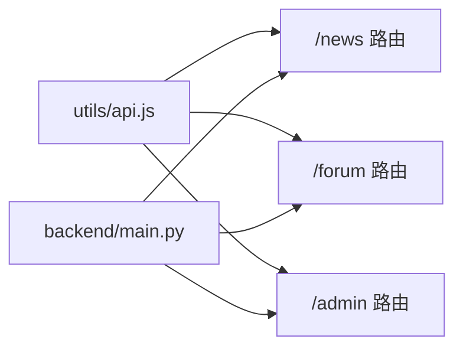

# 内容管理页面

<cite>
**本文档引用的文件**
- [miniprogram/app.js](file://miniprogram/app.js)
- [miniprogram/app.json](file://miniprogram/app.json)
- [miniprogram/utils/api.js](file://miniprogram/utils/api.js)
- [miniprogram/pages/news/news.js](file://miniprogram/pages/news/news.js)
- [miniprogram/pages/news/news.json](file://miniprogram/pages/news/news.json)
- [miniprogram/pages/news-detail/news-detail.js](file://miniprogram/pages/news-detail/news-detail.js)
- [miniprogram/pages/news-team/news-team.js](file://miniprogram/pages/news-team/news-team.js)
- [miniprogram/pages/forum/forum.js](file://miniprogram/pages/forum/forum.js)
- [miniprogram/pages/forum-section/forum-section.js](file://miniprogram/pages/forum-section/forum-section.js)
- [miniprogram/pages/forum-post/forum-post.js](file://miniprogram/pages/forum-post/forum-post.js)
- [miniprogram/pages/forum-create/forum-create.js](file://miniprogram/pages/forum-create/forum-create.js)
- [miniprogram/pages/forum-register/forum-register.js](file://miniprogram/pages/forum-register/forum-register.js)
- [miniprogram/pages/admin/admin.js](file://miniprogram/pages/admin/admin.js)
- [miniprogram/pages/term/term.js](file://miniprogram/pages/term/term.js)
- [backend/main.py](file://backend/main.py)
- [backend/routers/news.py](file://backend/routers/news.py)
- [backend/routers/forum.py](file://backend/routers/forum.py)
- [backend/routers/admin.py](file://backend/routers/admin.py)
</cite>

## 目录
1. [简介](#简介)
2. [项目结构](#项目结构)
3. [核心组件](#核心组件)
4. [架构总览](#架构总览)
5. [详细组件分析](#详细组件分析)
6. [依赖关系分析](#依赖关系分析)
7. [性能考虑](#性能考虑)
8. [故障排查指南](#故障排查指南)
9. [结论](#结论)
10. [附录](#附录)

## 简介
本文件面向 Fast-F1 微信小程序的内容管理页面，系统性梳理以下能力：
- 新闻资讯：列表展示、分类筛选、搜索、内容加载与缓存
- 新闻详情：内容渲染、AI 分析触发与轮询、术语标签、相关帖子、外部链接复制
- 论坛系统：板块管理、帖子列表、评论系统、用户权限与审核流程
- 论坛发帖：内容编辑、用户登录态、发布流程
- 管理后台：内容审核、爬取与分析、术语审核、系统配置
- 缓存策略与离线支持：本地缓存键、TTL、命中即返回与静默刷新
- 内容安全与数据验证：输入校验、权限控制、敏感信息处理

## 项目结构
小程序采用页面级组织，核心页面包括资讯、论坛、管理后台等；后端以 FastAPI 提供 REST 接口，路由按功能模块划分。

图表来源
- [miniprogram/app.json:1-72](file://miniprogram/app.json#L1-L72)
- [miniprogram/utils/api.js:122-296](file://miniprogram/utils/api.js#L122-L296)
- [backend/main.py:1-157](file://backend/main.py#L1-L157)

章节来源
- [miniprogram/app.json:1-72](file://miniprogram/app.json#L1-L72)
- [miniprogram/app.js:1-23](file://miniprogram/app.js#L1-L23)
- [backend/main.py:1-157](file://backend/main.py#L1-L157)

## 核心组件
- 前端缓存与请求封装：统一的 cachedRequest、request、post 封装，内置 TTL 缓存与静默刷新
- 新闻模块：列表、详情、团队筛选、搜索、AI 分析触发与轮询
- 论坛模块：分区、帖子列表、帖子详情、评论、点赞、发帖、注册
- 管理后台：待审内容、爬取与分析、术语审核
- 术语模块：术语详情、相关术语、复制定义

章节来源
- [miniprogram/utils/api.js:3-120](file://miniprogram/utils/api.js#L3-L120)
- [miniprogram/pages/news/news.js:1-163](file://miniprogram/pages/news/news.js#L1-L163)
- [miniprogram/pages/news-detail/news-detail.js:1-305](file://miniprogram/pages/news-detail/news-detail.js#L1-L305)
- [miniprogram/pages/forum/forum.js:1-125](file://miniprogram/pages/forum/forum.js#L1-L125)
- [miniprogram/pages/forum-section/forum-section.js:1-92](file://miniprogram/pages/forum-section/forum-section.js#L1-L92)
- [miniprogram/pages/forum-post/forum-post.js:1-160](file://miniprogram/pages/forum-post/forum-post.js#L1-L160)
- [miniprogram/pages/forum-create/forum-create.js:1-86](file://miniprogram/pages/forum-create/forum-create.js#L1-L86)
- [miniprogram/pages/forum-register/forum-register.js:1-55](file://miniprogram/pages/forum-register/forum-register.js#L1-L55)
- [miniprogram/pages/admin/admin.js:1-199](file://miniprogram/pages/admin/admin.js#L1-L199)
- [miniprogram/pages/term/term.js:1-96](file://miniprogram/pages/term/term.js#L1-L96)

## 架构总览
小程序前端通过 utils/api.js 统一发起请求，后端以 FastAPI 路由提供 REST 接口，新闻、论坛、管理分别对应独立路由模块。

图表来源
- [miniprogram/pages/news/news.js:58-88](file://miniprogram/pages/news/news.js#L58-L88)
- [miniprogram/utils/api.js:98-120](file://miniprogram/utils/api.js#L98-L120)
- [backend/routers/news.py:68-82](file://backend/routers/news.py#L68-L82)

章节来源
- [miniprogram/utils/api.js:98-120](file://miniprogram/utils/api.js#L98-L120)
- [backend/routers/news.py:68-82](file://backend/routers/news.py#L68-L82)

## 详细组件分析

### 新闻资讯页面
- 功能要点
  - 列表分页加载：支持下一页追加
  - 团队筛选：通过 team 参数过滤
  - 搜索：关键词过滤，带 300ms 防抖
  - 下拉刷新：重置页码并刷新
  - 同步 AI 分析状态：首页定时同步已分析标记
- 数据流
  - 列表请求：cachedRequest("/news:{page}:{team}:{keyword}", "/news", ...)
  - 详情请求：request("/news/{id}")，详情页并发拉取术语、车队标签、关联帖子
- 性能与体验
  - 首屏优先：支持预览参数先行渲染，再补全详情
  - 防抖搜索：降低频繁请求
  - 缓存命中即返回，后台静默刷新

图表来源
- [miniprogram/pages/news/news.js:58-88](file://miniprogram/pages/news/news.js#L58-L88)
- [miniprogram/pages/news/news.js:121-138](file://miniprogram/pages/news/news.js#L121-L138)

章节来源
- [miniprogram/pages/news/news.js:1-163](file://miniprogram/pages/news/news.js#L1-L163)
- [miniprogram/pages/news/news.json:1-8](file://miniprogram/pages/news/news.json#L1-L8)

### 新闻详情页面
- 功能要点
  - 预览渲染：支持从上页传递的预览数据先行展示
  - 并发加载：详情、关联帖子、术语标签、车队标签
  - AI 分析：触发分析、轮询检测、重新分析
  - 术语卡片：点击术语弹出卡片，后台补充 full_def
  - 讨论区：跳转至“综合讨论”分区或引用片段发帖
  - 外链复制：复制原文链接到剪贴板
- 数据流
  - 详情：request("/news/{id}")
  - 术语：cachedRequest("/terms_news:{news_id}", "/terms", ...)
  - 车队标签：request("/news/{id}/teams")
  - 关联帖子：request("/news/{id}/posts")

图表来源
- [miniprogram/pages/news-detail/news-detail.js:83-115](file://miniprogram/pages/news-detail/news-detail.js#L83-L115)
- [miniprogram/pages/news-detail/news-detail.js:167-200](file://miniprogram/pages/news-detail/news-detail.js#L167-L200)
- [backend/routers/news.py:105-156](file://backend/routers/news.py#L105-L156)

章节来源
- [miniprogram/pages/news-detail/news-detail.js:1-305](file://miniprogram/pages/news-detail/news-detail.js#L1-L305)
- [backend/routers/news.py:105-156](file://backend/routers/news.py#L105-L156)

### 论坛系统
- 板块管理
  - 分区列表：按 race/team 分组，综合讨论单独处理
  - 综合讨论默认加载，支持切换标签页
- 帖子列表
  - 支持 latest/hot 排序，分页加载
  - 下拉刷新与触底加载
- 帖子详情
  - 帖子与点赞数据并发加载
  - 评论列表加载
  - 作者可删除自己的帖子
  - 点赞/点踩：仅登录用户可操作
- 评论系统
  - 登录态检查，未登录引导注册
  - 评论内容长度限制
- 用户权限
  - 发帖/评论需要已注册用户
  - 管理员审核待审内容

图表来源
- [miniprogram/pages/forum/forum.js:1-125](file://miniprogram/pages/forum/forum.js#L1-L125)
- [miniprogram/pages/forum-section/forum-section.js:1-92](file://miniprogram/pages/forum-section/forum-section.js#L1-L92)
- [miniprogram/pages/forum-post/forum-post.js:1-160](file://miniprogram/pages/forum-post/forum-post.js#L1-L160)
- [miniprogram/pages/forum-create/forum-create.js:1-86](file://miniprogram/pages/forum-create/forum-create.js#L1-L86)
- [miniprogram/pages/forum-register/forum-register.js:1-55](file://miniprogram/pages/forum-register/forum-register.js#L1-L55)
- [miniprogram/pages/admin/admin.js:1-199](file://miniprogram/pages/admin/admin.js#L1-L199)

章节来源
- [miniprogram/pages/forum/forum.js:1-125](file://miniprogram/pages/forum/forum.js#L1-L125)
- [miniprogram/pages/forum-section/forum-section.js:1-92](file://miniprogram/pages/forum-section/forum-section.js#L1-L92)
- [miniprogram/pages/forum-post/forum-post.js:1-160](file://miniprogram/pages/forum-post/forum-post.js#L1-L160)
- [miniprogram/pages/forum-create/forum-create.js:1-86](file://miniprogram/pages/forum-create/forum-create.js#L1-L86)
- [miniprogram/pages/forum-register/forum-register.js:1-55](file://miniprogram/pages/forum-register/forum-register.js#L1-L55)
- [backend/routers/forum.py:125-327](file://backend/routers/forum.py#L125-L327)

### 论坛发帖页面
- 功能要点
  - 预填标题与引用内容（来自新闻详情页）
  - 标题与正文长度校验
  - 登录态缺失时跳转注册页，注册成功回调
  - 提交后返回上一页并提示成功
- 安全与验证
  - 标题 1-50 字，正文 1-2000 字
  - 仅已注册用户可发帖

图表来源
- [miniprogram/pages/forum-create/forum-create.js:69-84](file://miniprogram/pages/forum-create/forum-create.js#L69-L84)
- [miniprogram/pages/forum-register/forum-register.js:16-52](file://miniprogram/pages/forum-register/forum-register.js#L16-L52)
- [backend/routers/forum.py:195-229](file://backend/routers/forum.py#L195-L229)

章节来源
- [miniprogram/pages/forum-create/forum-create.js:1-86](file://miniprogram/pages/forum-create/forum-create.js#L1-L86)
- [miniprogram/pages/forum-register/forum-register.js:1-55](file://miniprogram/pages/forum-register/forum-register.js#L1-L55)
- [backend/routers/forum.py:195-229](file://backend/routers/forum.py#L195-L229)

### 管理后台
- 功能要点
  - 长按解锁：输入固定密码进入管理态
  - 待审内容：帖子、评论、术语三类
  - 审核操作：通过/拒绝
  - 爬取与分析：一键爬取 + 分析，支持进度条
- 安全
  - 管理员 Token 校验，失败返回 403

图表来源
- [miniprogram/pages/admin/admin.js:24-62](file://miniprogram/pages/admin/admin.js#L24-L62)
- [miniprogram/pages/admin/admin.js:132-197](file://miniprogram/pages/admin/admin.js#L132-L197)
- [backend/routers/admin.py:40-81](file://backend/routers/admin.py#L40-L81)
- [backend/routers/admin.py:148-191](file://backend/routers/admin.py#L148-L191)

章节来源
- [miniprogram/pages/admin/admin.js:1-199](file://miniprogram/pages/admin/admin.js#L1-L199)
- [backend/routers/admin.py:1-245](file://backend/routers/admin.py#L1-L245)

### 术语模块
- 功能要点
  - 术语详情：分类、难度、别名、示例、相关术语
  - 深挖模式：展示更完整定义
  - 复制术语：一键复制格式化文本

图表来源
- [miniprogram/pages/term/term.js:35-69](file://miniprogram/pages/term/term.js#L35-L69)

章节来源
- [miniprogram/pages/term/term.js:1-96](file://miniprogram/pages/term/term.js#L1-L96)

## 依赖关系分析
- 前端依赖
  - utils/api.js 作为统一请求层，封装缓存、TTL、重试与管理员头
  - 页面通过 api 封装调用后端路由
- 后端依赖
  - main.py 统一挂载路由，启动定时任务与缓存预热
  - news/forum/admin 路由模块各自处理业务逻辑与权限校验

图表来源
- [miniprogram/utils/api.js:122-296](file://miniprogram/utils/api.js#L122-L296)
- [backend/main.py:35-41](file://backend/main.py#L35-L41)

章节来源
- [miniprogram/utils/api.js:122-296](file://miniprogram/utils/api.js#L122-L296)
- [backend/main.py:35-41](file://backend/main.py#L35-L41)

## 性能考虑
- 本地缓存策略
  - 缓存键：基于路径与参数排序拼接，避免重复请求
  - TTL：不同接口设定不同缓存时长，如新闻 5 分钟、术语 30 分钟
  - 命中即返回，同时后台静默刷新，保证新老数据交替
- 网络与稳定性
  - 请求封装支持失败自动重试一次
  - 超时 20 秒，避免长时间阻塞
- 后台预热
  - 启动后预热 events/standings 缓存与部分会话数据，减少首屏延迟

章节来源
- [miniprogram/utils/api.js:3-120](file://miniprogram/utils/api.js#L3-L120)
- [backend/main.py:99-114](file://backend/main.py#L99-L114)

## 故障排查指南
- 新闻列表加载失败
  - 检查网络状态与超时重试
  - 确认参数 team/keyword 是否正确
- AI 分析未完成
  - 确认已触发分析，前端轮询逻辑正常
  - 管理后台可强制重新分析
- 论坛发帖/评论失败
  - 确认已登录并获取 openid/nickname
  - 检查标题/内容长度限制
- 管理后台无权限
  - 确认 X-Admin-Token 正确
  - 密码输入是否一致

章节来源
- [miniprogram/pages/news-detail/news-detail.js:167-200](file://miniprogram/pages/news-detail/news-detail.js#L167-L200)
- [miniprogram/pages/forum-create/forum-create.js:69-84](file://miniprogram/pages/forum-create/forum-create.js#L69-L84)
- [miniprogram/pages/admin/admin.js:24-38](file://miniprogram/pages/admin/admin.js#L24-L38)
- [backend/routers/admin.py:30-34](file://backend/routers/admin.py#L30-L34)

## 结论
本内容管理页面以清晰的前后端分层实现资讯与论坛两大核心模块，结合本地缓存与后端预热提升性能与稳定性；通过严格的输入校验与权限控制保障内容安全；管理后台提供完善的审核与运维能力，满足日常运营需求。

## 附录
- 关键接口与参数
  - 新闻列表：GET /news?page=&team=&keyword=
  - 新闻详情：GET /news/{id}
  - 车队标签：GET /news/{id}/teams
  - AI 分析：POST /news/{id}/analyze-public
  - 论坛分区：GET /forum/sections
  - 帖子列表：GET /forum/posts?section_id=&page=&sort=
  - 帖子详情：GET /forum/posts/{id}
  - 发帖：POST /forum/posts
  - 评论：GET /forum/posts/{id}/comments, POST /forum/posts/{id}/comments
  - 管理：GET/POST /admin/*，需 X-Admin-Token

章节来源
- [backend/routers/news.py:68-156](file://backend/routers/news.py#L68-L156)
- [backend/routers/forum.py:125-327](file://backend/routers/forum.py#L125-L327)
- [backend/routers/admin.py:40-191](file://backend/routers/admin.py#L40-L191)