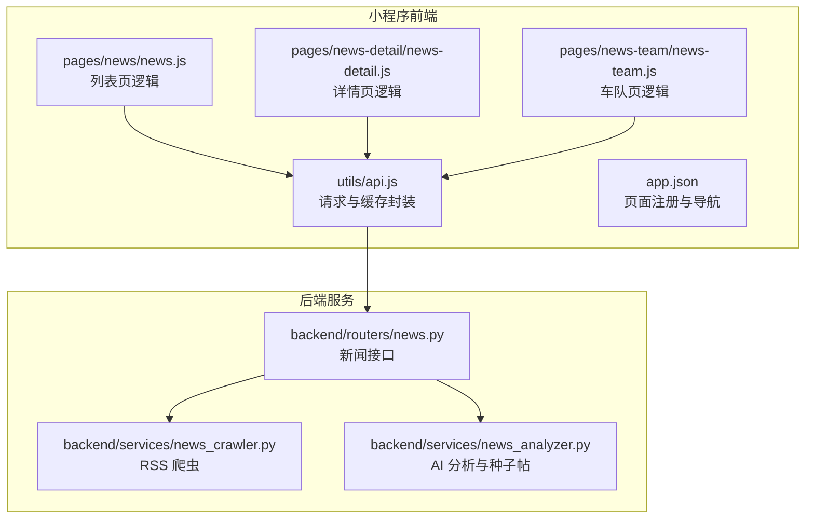
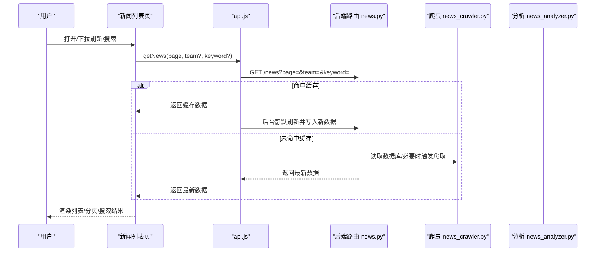
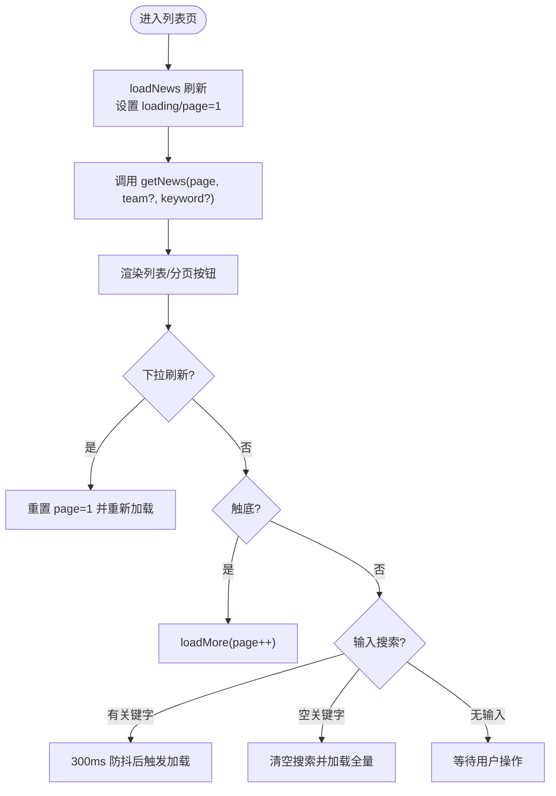
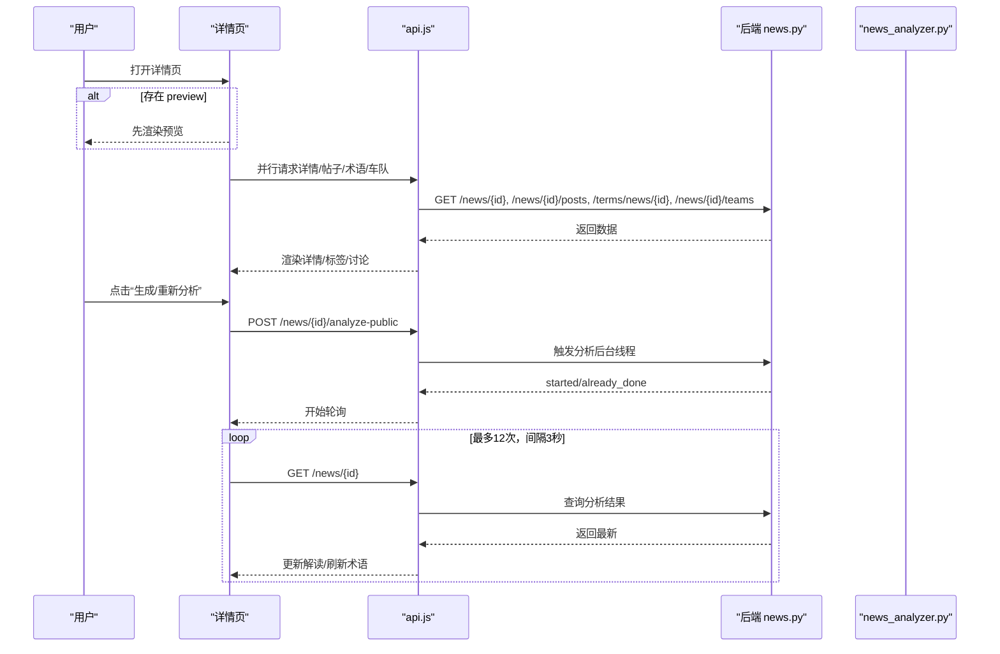
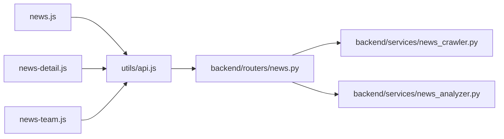

# 新闻系统

<cite>
**本文引用的文件**
- [miniprogram/pages/news/news.js](file://miniprogram/pages/news/news.js)
- [miniprogram/pages/news/news.json](file://miniprogram/pages/news/news.json)
- [miniprogram/pages/news/news.wxml](file://miniprogram/pages/news/news.wxml)
- [miniprogram/pages/news/news.wxs](file://miniprogram/pages/news/news.wxs)
- [miniprogram/pages/news-detail/news-detail.js](file://miniprogram/pages/news-detail/news-detail.js)
- [miniprogram/pages/news-detail/news-detail.wxml](file://miniprogram/pages/news-detail/news-detail.wxml)
- [miniprogram/pages/news-detail/news-detail.wxs](file://miniprogram/pages/news-detail/news-detail.wxs)
- [miniprogram/pages/news-team/news-team.js](file://miniprogram/pages/news-team/news-team.js)
- [miniprogram/pages/news-team/news-team.wxml](file://miniprogram/pages/news-team/news-team.wxml)
- [miniprogram/utils/api.js](file://miniprogram/utils/api.js)
- [miniprogram/app.json](file://miniprogram/app.json)
- [miniprogram/app.js](file://miniprogram/app.js)
- [backend/routers/news.py](file://backend/routers/news.py)
- [backend/services/news_crawler.py](file://backend/services/news_crawler.py)
- [backend/services/news_analyzer.py](file://backend/services/news_analyzer.py)
</cite>

## 目录
1. [简介](#简介)
2. [项目结构](#项目结构)
3. [核心组件](#核心组件)
4. [架构总览](#架构总览)
5. [详细组件分析](#详细组件分析)
6. [依赖关系分析](#依赖关系分析)
7. [性能考虑](#性能考虑)
8. [故障排查指南](#故障排查指南)
9. [结论](#结论)
10. [附录](#附录)

## 简介
本文件面向 Fast-F1 微信小程序的新闻系统，围绕三大页面（新闻列表、新闻详情、新闻团队）展开，系统性说明数据获取、分页加载、分类筛选、搜索、AI 解读、术语标签、讨论区联动、缓存策略、离线可用性、安全过滤与格式化、以及可扩展的推荐与个性化展示方案。目标是帮助开发者快速理解并维护该模块，同时为产品与运营提供清晰的技术背景。

## 项目结构
- 小程序前端位于 miniprogram/pages 下，包含新闻列表、详情、团队三个页面及其样式与 WXS 工具。
- 小程序统一通过 utils/api.js 封装请求与本地缓存，采用“先返回旧数据、后台静默刷新”的策略提升首屏体验。
- 后端位于 backend/routers 与 backend/services，提供新闻列表、详情、AI 分析、爬虫与术语标签等能力。

图表来源
- [miniprogram/pages/news/news.js:1-163](file://miniprogram/pages/news/news.js#L1-L163)
- [miniprogram/pages/news-detail/news-detail.js:1-305](file://miniprogram/pages/news-detail/news-detail.js#L1-L305)
- [miniprogram/pages/news-team/news-team.js:1-68](file://miniprogram/pages/news-team/news-team.js#L1-L68)
- [miniprogram/utils/api.js:1-299](file://miniprogram/utils/api.js#L1-L299)
- [backend/routers/news.py:1-190](file://backend/routers/news.py#L1-L190)
- [backend/services/news_crawler.py:1-148](file://backend/services/news_crawler.py#L1-L148)
- [backend/services/news_analyzer.py:1-298](file://backend/services/news_analyzer.py#L1-L298)

章节来源
- [miniprogram/app.json:1-72](file://miniprogram/app.json#L1-L72)
- [miniprogram/app.js:1-23](file://miniprogram/app.js#L1-L23)

## 核心组件
- 新闻列表页：支持下拉刷新、触底加载、搜索防抖、车队筛选、AI 已解读状态同步。
- 新闻详情页：支持预览渲染、AI 解读触发/轮询、术语标签卡片、讨论区联动、原文章跳转。
- 新闻团队页：按车队 slug 展示相关新闻，支持分页与下拉刷新。
- API 与缓存：统一请求封装、本地缓存 TTL、先旧后新的 SWR 策略、错误重试。
- 后端能力：RSS 爬取、新闻列表/详情、AI 分析（含 RAG 上下文）、车队标签匹配、种子帖生成。

章节来源
- [miniprogram/pages/news/news.js:1-163](file://miniprogram/pages/news/news.js#L1-L163)
- [miniprogram/pages/news-detail/news-detail.js:1-305](file://miniprogram/pages/news-detail/news-detail.js#L1-L305)
- [miniprogram/pages/news-team/news-team.js:1-68](file://miniprogram/pages/news-team/news-team.js#L1-L68)
- [miniprogram/utils/api.js:1-299](file://miniprogram/utils/api.js#L1-L299)
- [backend/routers/news.py:1-190](file://backend/routers/news.py#L1-L190)
- [backend/services/news_crawler.py:1-148](file://backend/services/news_crawler.py#L1-L148)
- [backend/services/news_analyzer.py:1-298](file://backend/services/news_analyzer.py#L1-L298)

## 架构总览
小程序前端通过 utils/api.js 的 cachedRequest 对后端接口进行缓存化请求，后端 news 路由提供列表、详情、AI 分析、车队标签等接口；AI 分析模块结合 RAG 上下文生成三段式解读，并自动写入论坛作为种子帖。

图表来源
- [miniprogram/utils/api.js:98-120](file://miniprogram/utils/api.js#L98-L120)
- [backend/routers/news.py:68-82](file://backend/routers/news.py#L68-L82)
- [backend/services/news_crawler.py:119-129](file://backend/services/news_crawler.py#L119-L129)

## 详细组件分析

### 新闻列表页面（news）
- 数据获取与分页
  - 支持 page 参数与 20 条/页的分页；hasMore 控制是否继续加载。
  - 下拉刷新会重置 page=1 并清空错误状态。
- 分类筛选
  - 通过 team 参数过滤，支持 teamName 解码显示。
- 搜索功能
  - 输入防抖 300ms，空值时清空搜索恢复全量列表。
  - 搜索关键字随请求传递给后端。
- AI 状态同步
  - onShow 时对第一页数据进行“已解读”状态合并，保持 UI 一致性。
- 预览跳转
  - 点击列表项携带预览数据，详情页可先渲染再补全网络数据。

图表来源
- [miniprogram/pages/news/news.js:58-88](file://miniprogram/pages/news/news.js#L58-L88)
- [miniprogram/pages/news/news.js:121-138](file://miniprogram/pages/news/news.js#L121-L138)

章节来源
- [miniprogram/pages/news/news.js:1-163](file://miniprogram/pages/news/news.js#L1-L163)
- [miniprogram/pages/news/news.wxml:1-187](file://miniprogram/pages/news/news.wxml#L1-L187)
- [miniprogram/pages/news/news.wxs:1-28](file://miniprogram/pages/news/news.wxs#L1-L28)
- [miniprogram/pages/news/news.json:1-8](file://miniprogram/pages/news/news.json#L1-L8)

### 新闻详情页面（news-detail）
- 预览渲染与网络回填
  - 若存在 preview 参数，先以预览数据渲染标题/来源/摘要等基础信息，再拉取详情与术语/讨论数据。
- AI 解读流程
  - 支持“生成 AI 解读”和“重新分析”，内置轮询机制，最多轮询 12 次，间隔 3 秒。
  - 成功后自动刷新术语标签，确保标签与解读一致。
- 术语标签与讨论区联动
  - 术语标签点击弹出卡片，支持“去论坛讨论”快捷入口。
  - 展示关联帖子，支持“查看全部”跳转分区。
- 原文跳转
  - 提供复制原文链接提示，引导在浏览器打开。

图表来源
- [miniprogram/pages/news-detail/news-detail.js:83-115](file://miniprogram/pages/news-detail/news-detail.js#L83-L115)
- [miniprogram/pages/news-detail/news-detail.js:167-208](file://miniprogram/pages/news-detail/news-detail.js#L167-L208)
- [miniprogram/pages/news-detail/news-detail.js:211-249](file://miniprogram/pages/news-detail/news-detail.js#L211-L249)
- [backend/routers/news.py:128-156](file://backend/routers/news.py#L128-L156)
- [backend/services/news_analyzer.py:220-256](file://backend/services/news_analyzer.py#L220-L256)

章节来源
- [miniprogram/pages/news-detail/news-detail.js:1-305](file://miniprogram/pages/news-detail/news-detail.js#L1-L305)
- [miniprogram/pages/news-detail/news-detail.wxml:1-247](file://miniprogram/pages/news-detail/news-detail.wxml#L1-L247)
- [miniprogram/pages/news-detail/news-detail.wxs:1-28](file://miniprogram/pages/news-detail/news-detail.wxs#L1-L28)

### 新闻团队页面（news-team）
- 车队筛选
  - 通过 team、teamName、color 参数接收，设置导航标题与头部色条。
- 列表渲染
  - 与列表页一致的分页与加载逻辑，点击跳转详情页。

章节来源
- [miniprogram/pages/news-team/news-team.js:1-68](file://miniprogram/pages/news-team/news-team.js#L1-L68)
- [miniprogram/pages/news-team/news-team.wxml:1-66](file://miniprogram/pages/news-team/news-team.wxml#L1-L66)

### API 与缓存策略
- 缓存键与 TTL
  - 缓存键由 path 与排序后的查询参数组成；不同接口设置不同 TTL。
  - 新闻列表与详情默认 5 分钟，术语词典 30 分钟。
- 请求封装
  - cachedRequest：命中缓存即返回，同时后台静默刷新并写回缓存。
  - request：GET 请求封装，失败自动重试一次；超时 20 秒。
  - post：POST 请求封装，失败自动重试一次。
- 小程序全局配置
  - BASE_URL 在 app.js 中定义，所有接口拼接该前缀。

章节来源
- [miniprogram/utils/api.js:1-299](file://miniprogram/utils/api.js#L1-L299)
- [miniprogram/app.js:1-23](file://miniprogram/app.js#L1-L23)

### 后端能力与数据流
- 新闻接口
  - GET /news：支持 team 与 keyword 过滤，返回 items、page、page_size。
  - GET /news/{id}：返回详情，包含 analyzed 标记。
  - GET /news/{id}/teams：基于标题/摘要匹配车队标签，带 10 分钟内存缓存。
  - POST /news/{id}/analyze-public：任意用户触发 AI 分析（后台线程），返回 started/already_done。
- 爬虫与分析
  - RSS 四源爬取，过滤非 F1 内容，摘要清洗与长度限制。
  - AI 分析：RAG 注入 2026 赛季积分上下文，三段式解读，自动写入论坛种子帖。

章节来源
- [backend/routers/news.py:1-190](file://backend/routers/news.py#L1-L190)
- [backend/services/news_crawler.py:1-148](file://backend/services/news_crawler.py#L1-L148)
- [backend/services/news_analyzer.py:1-298](file://backend/services/news_analyzer.py#L1-L298)

## 依赖关系分析
- 页面到工具
  - news.js、news-detail.js、news-team.js 均依赖 utils/api.js。
- 工具到后端
  - api.js 的 getNews/getNewsDetail/getNewsPosts 等方法映射到后端路由。
- 后端内部
  - news.py 依赖数据库查询与爬虫/分析服务；分析模块依赖 LLM 客户端与 Ergast 数据。

图表来源
- [miniprogram/pages/news/news.js:1-2](file://miniprogram/pages/news/news.js#L1-L2)
- [miniprogram/pages/news-detail/news-detail.js:1-2](file://miniprogram/pages/news-detail/news-detail.js#L1-L2)
- [miniprogram/pages/news-team/news-team.js:1-2](file://miniprogram/pages/news-team/news-team.js#L1-L2)
- [miniprogram/utils/api.js:154-162](file://miniprogram/utils/api.js#L154-L162)
- [backend/routers/news.py:1-10](file://backend/routers/news.py#L1-L10)

章节来源
- [miniprogram/utils/api.js:154-162](file://miniprogram/utils/api.js#L154-L162)
- [backend/routers/news.py:68-101](file://backend/routers/news.py#L68-L101)

## 性能考虑
- 首屏体验
  - cachedRequest 采用“先旧后新”策略，保证首屏秒开；同时后台静默刷新，提升数据新鲜度。
- 网络健壮性
  - request/post 默认失败自动重试一次，超时 20 秒，降低弱网失败率。
- 列表渲染
  - 使用 scroll-view + 触底加载，避免一次性渲染大量节点；Skeleton 骨架屏减少白屏感知。
- AI 轮询
  - 轮询最大次数与间隔可控，避免过度请求；成功后及时停止轮询。
- RAG 上下文缓存
  - 2026 赛季积分上下文 30 分钟缓存，减少重复拉取与 token 消耗。

章节来源
- [miniprogram/utils/api.js:98-120](file://miniprogram/utils/api.js#L98-L120)
- [miniprogram/pages/news/news.wxml:63-69](file://miniprogram/pages/news/news.wxml#L63-L69)
- [miniprogram/pages/news-detail/news-detail.js:167-208](file://miniprogram/pages/news-detail/news-detail.js#L167-L208)
- [backend/services/news_analyzer.py:20-22](file://backend/services/news_analyzer.py#L20-L22)

## 故障排查指南
- 列表加载失败
  - 检查错误状态渲染与“重试”按钮；确认网络状态与 BASE_URL 是否正确。
- 搜索无结果
  - 确认搜索关键字是否为空；空关键字应恢复全量列表。
- AI 解读未出现
  - 点击“生成 AI 解读”或“重新分析”，观察轮询状态；若 already_done，说明已生成。
- 术语卡片未显示详细释义
  - 首次弹出仅展示简要释义，后台异步拉取 full_def；检查网络与接口返回。
- 原文链接无法打开
  - 复制链接后在浏览器打开，确认外链有效性。

章节来源
- [miniprogram/pages/news/news.js:67-69](file://miniprogram/pages/news/news.js#L67-L69)
- [miniprogram/pages/news-detail/news-detail.js:109-114](file://miniprogram/pages/news-detail/news-detail.js#L109-L114)
- [miniprogram/pages/news-detail/news-detail.js:132-141](file://miniprogram/pages/news-detail/news-detail.js#L132-L141)
- [miniprogram/pages/news-detail/news-detail.js:294-299](file://miniprogram/pages/news-detail/news-detail.js#L294-L299)

## 结论
该新闻系统以“先旧后新”的缓存策略与完善的前后端协作，实现了快速首屏、稳定的数据流与良好的用户体验。列表页的搜索与筛选、详情页的 AI 解读与术语联动、团队页的专项展示，共同构成了完整的资讯生态。建议在现有基础上进一步完善推荐与个性化展示，以提升用户粘性与信息密度。

## 附录

### 数据安全过滤与格式化
- RSS 摘要清洗
  - 去除 HTML 标签、清理常见截断词、限制长度，避免注入与超长文本。
- 非 F1 内容过滤
  - 通过关键词集合过滤 Formula E、IndyCar、MotoGP 等非 F1 内容。
- 时间与来源格式化
  - WXS 模块统一时间与来源显示，增强可读性。

章节来源
- [backend/services/news_crawler.py:39-87](file://backend/services/news_crawler.py#L39-L87)
- [backend/services/news_crawler.py:48-56](file://backend/services/news_crawler.py#L48-L56)
- [miniprogram/pages/news/news.wxs:14-26](file://miniprogram/pages/news/news.wxs#L14-L26)
- [miniprogram/pages/news-detail/news-detail.wxs:14-26](file://miniprogram/pages/news-detail/news-detail.wxs#L14-L26)

### 新闻推荐与个性化展示方案
- 基于历史行为的协同过滤
  - 收集用户阅读/收藏/讨论行为，构建用户-新闻交互矩阵，进行相似用户/相似新闻推荐。
- 基于内容的关键词匹配
  - 以新闻标题/摘要关键词与用户历史偏好匹配，计算相似度权重。
- RAG 增强的上下文推荐
  - 结合当前赛季积分、车手/车队状态，动态注入上下文，提升推荐时效性。
- 个性化展示策略
  - 首屏展示热门/热点，次屏插入“可能感兴趣”；按用户偏好调整来源权重（如更倾向 The Race 或 Motorsport）。
- A/B 实验与评估
  - 通过曝光/点击/停留时长等指标评估推荐效果，持续迭代模型与特征。

[本节为概念性方案说明，不直接分析具体代码文件]