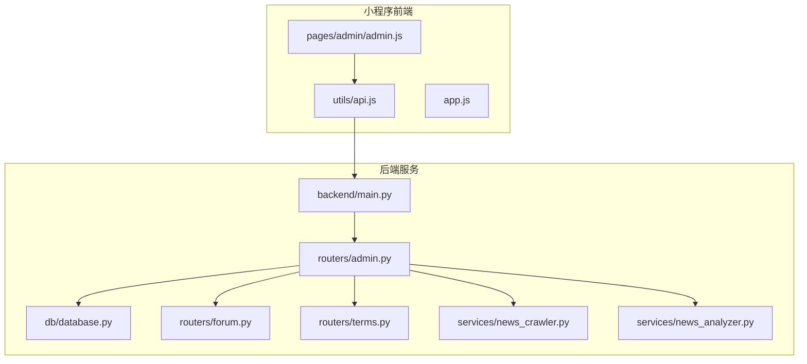
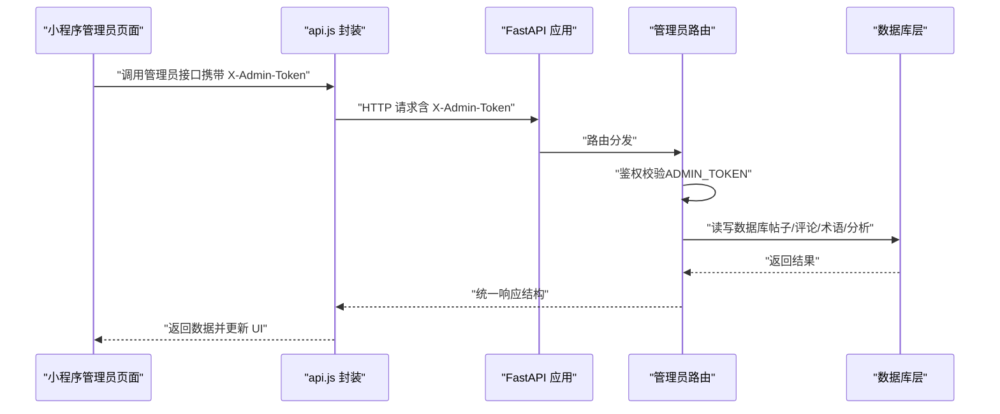
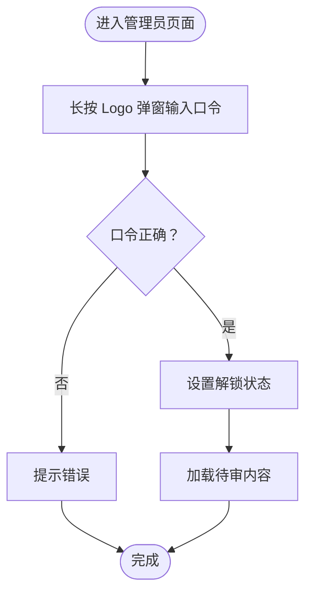
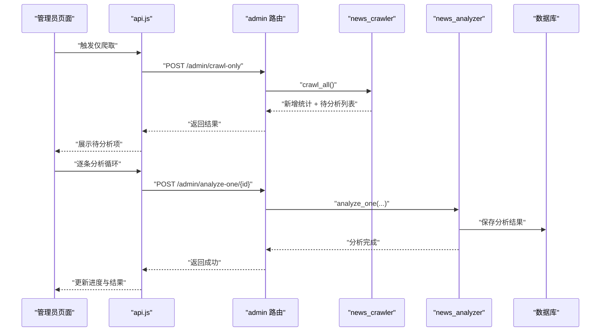
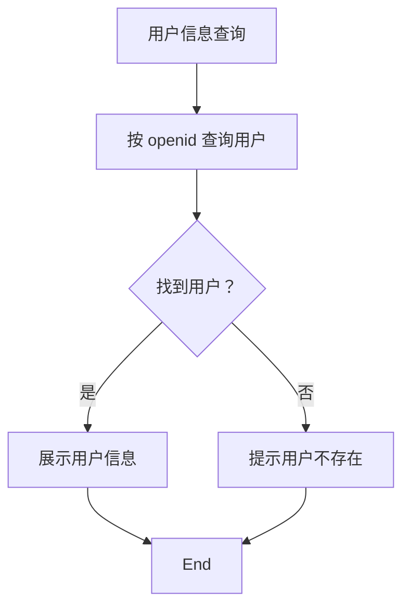
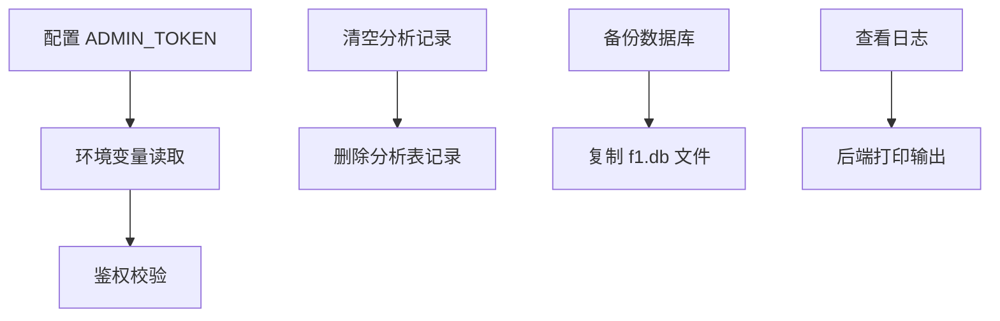
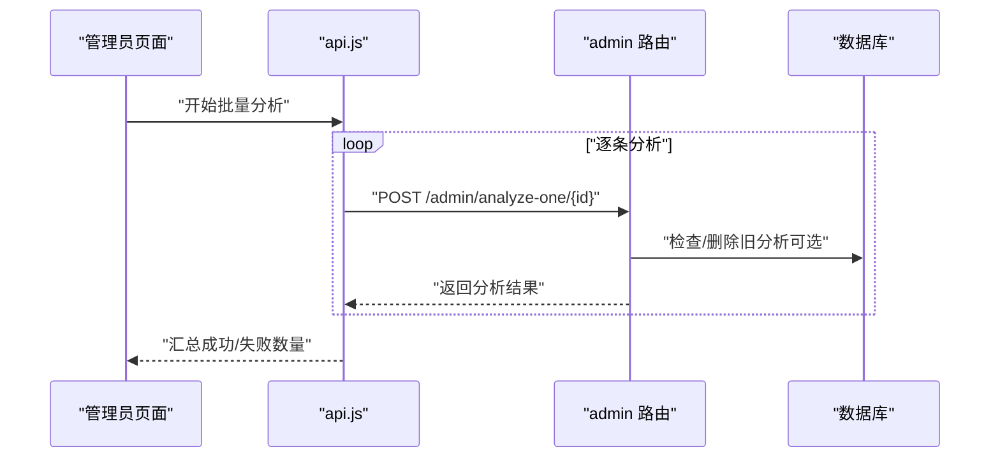
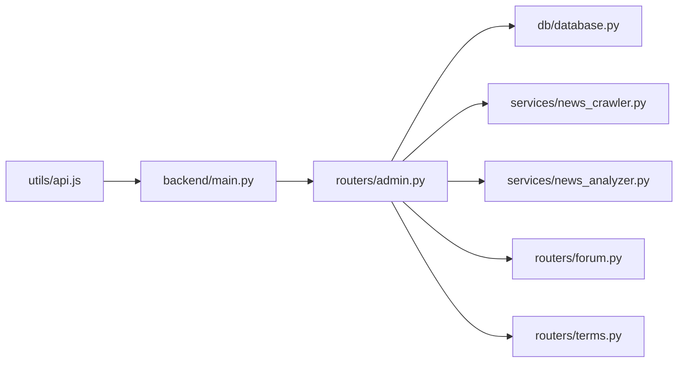

# 管理员后台

<cite>
**本文引用的文件**
- [miniprogram/pages/admin/admin.js](file://miniprogram/pages/admin/admin.js)
- [miniprogram/pages/admin/admin.json](file://miniprogram/pages/admin/admin.json)
- [miniprogram/utils/api.js](file://miniprogram/utils/api.js)
- [backend/routers/admin.py](file://backend/routers/admin.py)
- [backend/main.py](file://backend/main.py)
- [backend/db/database.py](file://backend/db/database.py)
- [backend/models/response.py](file://backend/models/response.py)
- [backend/services/news_crawler.py](file://backend/services/news_crawler.py)
- [backend/services/news_analyzer.py](file://backend/services/news_analyzer.py)
- [backend/routers/forum.py](file://backend/routers/forum.py)
- [backend/routers/terms.py](file://backend/routers/terms.py)
- [miniprogram/app.js](file://miniprogram/app.js)
- [memory/architecture.md](file://memory/architecture.md)
- [F1_miniprogram_design.md](file://F1_miniprogram_design.md)
</cite>

## 目录
1. [简介](#简介)
2. [项目结构](#项目结构)
3. [核心组件](#核心组件)
4. [架构总览](#架构总览)
5. [详细组件分析](#详细组件分析)
6. [依赖关系分析](#依赖关系分析)
7. [性能考量](#性能考量)
8. [故障排查指南](#故障排查指南)
9. [结论](#结论)
10. [附录](#附录)

## 简介
本文件面向 Fast-F1 微信小程序的管理员后台，系统性梳理管理员登录认证、内容管理、用户管理、系统配置与审计、批量处理与数据导出等能力的实现方案。文档以“可落地”的方式呈现，既覆盖代码级细节，又兼顾非技术读者的理解需求。

## 项目结构
- 小程序前端位于 miniprogram，管理员入口位于 pages/admin，通过 utils/api.js 统一封装请求与缓存。
- 后端位于 backend，FastAPI 应用在 main.py 中注册路由，管理员相关接口集中在 routers/admin.py。
- 数据层在 backend/db/database.py，采用 SQLite 存储论坛、新闻、术语等数据。
- AI 分析与爬虫分别在 services/news_crawler.py 与 services/news_analyzer.py，支撑资讯的采集与解读。
- 产品与技术架构文档在 memory/architecture.md 与 F1_miniprogram_design.md，提供整体设计背景。

**图表来源**
- [miniprogram/pages/admin/admin.js:1-199](file://miniprogram/pages/admin/admin.js#L1-L199)
- [miniprogram/utils/api.js:1-299](file://miniprogram/utils/api.js#L1-L299)
- [backend/main.py:1-157](file://backend/main.py#L1-L157)
- [backend/routers/admin.py:1-245](file://backend/routers/admin.py#L1-L245)
- [backend/db/database.py:1-800](file://backend/db/database.py#L1-L800)
- [backend/services/news_crawler.py:1-148](file://backend/services/news_crawler.py#L1-L148)
- [backend/services/news_analyzer.py:1-298](file://backend/services/news_analyzer.py#L1-L298)
- [backend/routers/forum.py:1-327](file://backend/routers/forum.py#L1-L327)
- [backend/routers/terms.py:1-92](file://backend/routers/terms.py#L1-L92)

**章节来源**
- [miniprogram/pages/admin/admin.js:1-199](file://miniprogram/pages/admin/admin.js#L1-L199)
- [miniprogram/utils/api.js:1-299](file://miniprogram/utils/api.js#L1-L299)
- [backend/main.py:1-157](file://backend/main.py#L1-L157)

## 核心组件
- 管理员认证与鉴权
  - 小程序端：长按 Logo 弹窗输入固定口令，匹配成功后解锁后台并加载待审内容。
  - 后端：通过请求头 X-Admin-Token 校验，失败返回 403。
- 内容管理
  - 帖子审核：待审列表、通过/拒绝。
  - 评论审核：待审列表、通过/拒绝。
  - 术语审核：待审术语列表、通过/拒绝。
  - 爬虫与 AI 分析：支持“仅爬取”和“逐条分析”，并提供一键清空分析记录的能力。
- 用户管理
  - 用户信息查看：通过用户 openid 查询用户信息。
  - 权限与封禁：当前代码未暴露封禁接口，可在后续扩展。
  - 数据统计：可基于现有接口聚合统计（如热帖、热门资讯等）。
- 系统配置与运维
  - 参数设置：通过环境变量 ADMIN_TOKEN 控制管理员令牌。
  - 缓存清理：提供清空 AI 分析记录的接口，便于重新触发分析。
  - 日志查看：后端打印定时任务与异常日志，便于运维排查。
- 审计与批量处理
  - 审计：后端接口统一返回统一结构，便于前端记录操作日志。
  - 批量处理：后端提供“仅爬取 + 逐条分析”流程，前端展示进度。
- 数据导出
  - 当前未提供专用导出接口，可通过现有列表接口二次导出。

**章节来源**
- [backend/routers/admin.py:1-245](file://backend/routers/admin.py#L1-L245)
- [miniprogram/pages/admin/admin.js:1-199](file://miniprogram/pages/admin/admin.js#L1-L199)
- [miniprogram/utils/api.js:226-299](file://miniprogram/utils/api.js#L226-L299)
- [backend/db/database.py:1-800](file://backend/db/database.py#L1-L800)

## 架构总览
管理员后台采用“小程序前端 + FastAPI 后端 + SQLite 数据库”的三层架构。前端通过 utils/api.js 封装请求与缓存，后端通过 routers/admin.py 提供管理员专用接口，数据持久化在 SQLite，AI 分析与爬虫作为服务模块集成。

**图表来源**
- [miniprogram/utils/api.js:87-90](file://miniprogram/utils/api.js#L87-L90)
- [backend/routers/admin.py:27-34](file://backend/routers/admin.py#L27-L34)
- [backend/models/response.py:1-14](file://backend/models/response.py#L1-L14)
- [backend/db/database.py:1-800](file://backend/db/database.py#L1-L800)

## 详细组件分析

### 管理员登录认证与权限控制
- 小程序端解锁流程
  - 长按 Logo 弹窗输入固定口令，匹配成功后设置解锁状态并加载待审内容。
  - 解锁后，前端通过 api.js 的 adminHeader() 自动附加 X-Admin-Token 请求头。
- 后端鉴权
  - 所有 /admin 路由均要求 X-Admin-Token，与环境变量 ADMIN_TOKEN 对比，不一致返回 403。
- 安全建议
  - 建议将口令改为随机令牌并通过安全渠道下发，避免硬编码。
  - 建议在后端增加登录态有效期与失败次数限制。

**图表来源**
- [miniprogram/pages/admin/admin.js:24-38](file://miniprogram/pages/admin/admin.js#L24-L38)

**章节来源**
- [miniprogram/pages/admin/admin.js:4-38](file://miniprogram/pages/admin/admin.js#L4-L38)
- [miniprogram/utils/api.js:87-90](file://miniprogram/utils/api.js#L87-L90)
- [backend/routers/admin.py:27-34](file://backend/routers/admin.py#L27-L34)

### 内容管理：新闻、帖子、评论与术语审核
- 新闻爬取与 AI 分析
  - “仅爬取”接口返回新增条数与待分析列表；“逐条分析”接口支持强制重新分析。
  - 后端提供清空所有分析记录的接口，便于批量重算。
- 帖子与评论审核
  - 待审列表按分页返回；通过/拒绝接口更新状态。
  - 评论审核通过后同步更新帖子评论计数。
- 术语审核
  - 待审术语列表与通过/拒绝接口，支持术语状态变更。

**图表来源**
- [backend/routers/admin.py:148-192](file://backend/routers/admin.py#L148-L192)
- [backend/services/news_crawler.py:119-148](file://backend/services/news_crawler.py#L119-L148)
- [backend/services/news_analyzer.py:220-257](file://backend/services/news_analyzer.py#L220-L257)
- [backend/db/database.py:302-325](file://backend/db/database.py#L302-L325)

**章节来源**
- [backend/routers/admin.py:134-192](file://backend/routers/admin.py#L134-L192)
- [backend/services/news_crawler.py:1-148](file://backend/services/news_crawler.py#L1-L148)
- [backend/services/news_analyzer.py:1-298](file://backend/services/news_analyzer.py#L1-L298)
- [backend/db/database.py:302-325](file://backend/db/database.py#L302-L325)

### 用户管理：信息查看与权限分配
- 用户信息查看
  - 通过 openid 查询用户信息，用于审核与溯源。
- 权限与封禁
  - 当前未提供封禁接口，可在后续扩展（如新增用户状态字段与封禁接口）。
- 数据统计
  - 可基于现有接口聚合统计，如热帖、热门资讯等。

**图表来源**
- [backend/routers/forum.py:112-119](file://backend/routers/forum.py#L112-L119)
- [backend/db/database.py:344-365](file://backend/db/database.py#L344-L365)

**章节来源**
- [backend/routers/forum.py:112-119](file://backend/routers/forum.py#L112-L119)
- [backend/db/database.py:344-365](file://backend/db/database.py#L344-L365)

### 系统配置管理：参数、缓存、备份与日志
- 参数设置
  - ADMIN_TOKEN 通过环境变量配置，后端读取并用于鉴权。
- 缓存清理
  - 提供清空 AI 分析记录的接口，便于重新触发分析。
- 数据备份
  - SQLite 文件可定期复制备份；建议在运维层面实现自动化备份策略。
- 日志查看
  - 后端定时任务与异常日志打印，便于排查问题。

**图表来源**
- [backend/routers/admin.py:27-28](file://backend/routers/admin.py#L27-L28)
- [backend/routers/admin.py:194-208](file://backend/routers/admin.py#L194-L208)
- [backend/main.py:44-53](file://backend/main.py#L44-L53)

**章节来源**
- [backend/routers/admin.py:27-28](file://backend/routers/admin.py#L27-L28)
- [backend/routers/admin.py:194-208](file://backend/routers/admin.py#L194-L208)
- [backend/main.py:44-53](file://backend/main.py#L44-L53)

### 管理员操作审计与批量处理
- 审计
  - 后端统一返回统一结构，便于前端记录操作日志（如时间、操作类型、结果）。
- 批量处理
  - 前端提供“仅爬取 + 逐条分析”流程，展示进度与结果统计。

**图表来源**
- [miniprogram/pages/admin/admin.js:133-197](file://miniprogram/pages/admin/admin.js#L133-L197)
- [backend/routers/admin.py:167-192](file://backend/routers/admin.py#L167-L192)

**章节来源**
- [miniprogram/pages/admin/admin.js:133-197](file://miniprogram/pages/admin/admin.js#L133-L197)
- [backend/routers/admin.py:167-192](file://backend/routers/admin.py#L167-L192)

### 数据导出（实现建议）
- 当前未提供专用导出接口，建议在后端新增导出接口（如导出待审列表、分析记录等），前端可触发下载。
- 导出格式可采用 CSV/JSON，便于第三方工具处理。

[本节为实现建议，不直接分析具体文件]

## 依赖关系分析
- 前端依赖
  - utils/api.js 封装请求与缓存，统一附加 X-Admin-Token。
  - app.js 提供全局 BASE_URL。
- 后端依赖
  - main.py 注册管理员路由与定时任务。
  - admin.py 依赖数据库层与服务层。
  - forum.py 与 terms.py 提供用户与术语相关接口，支撑内容管理。

**图表来源**
- [miniprogram/utils/api.js:1-299](file://miniprogram/utils/api.js#L1-L299)
- [backend/main.py:1-157](file://backend/main.py#L1-L157)
- [backend/routers/admin.py:1-245](file://backend/routers/admin.py#L1-L245)
- [backend/db/database.py:1-800](file://backend/db/database.py#L1-L800)
- [backend/services/news_crawler.py:1-148](file://backend/services/news_crawler.py#L1-L148)
- [backend/services/news_analyzer.py:1-298](file://backend/services/news_analyzer.py#L1-L298)
- [backend/routers/forum.py:1-327](file://backend/routers/forum.py#L1-L327)
- [backend/routers/terms.py:1-92](file://backend/routers/terms.py#L1-L92)

**章节来源**
- [miniprogram/utils/api.js:1-299](file://miniprogram/utils/api.js#L1-L299)
- [backend/main.py:1-157](file://backend/main.py#L1-L157)
- [backend/routers/admin.py:1-245](file://backend/routers/admin.py#L1-L245)

## 性能考量
- 前端缓存
  - api.js 提供带 TTL 的本地缓存，命中后立即返回旧数据并静默刷新，显著降低请求延迟。
- 后端缓存
  - 部分接口采用内存 TTL 缓存，减少重复计算。
- 爬取与分析
  - 定时任务每小时执行爬取，分析由用户触发，避免高峰时段压力。

**章节来源**
- [miniprogram/utils/api.js:17-120](file://miniprogram/utils/api.js#L17-L120)
- [memory/architecture.md:115-129](file://memory/architecture.md#L115-L129)
- [backend/main.py:44-53](file://backend/main.py#L44-L53)

## 故障排查指南
- 管理员鉴权失败
  - 检查 X-Admin-Token 是否正确传递，确认 ADMIN_TOKEN 与前端口令一致。
- 爬取失败
  - 查看后端日志，确认 RSS 源可访问；必要时调整解析逻辑。
- 分析失败
  - 检查 LLM 客户端可用性与网络；查看分析日志定位问题。
- 数据库异常
  - 检查 f1.db 文件是否存在与可写；必要时重建数据库。

**章节来源**
- [backend/routers/admin.py:27-34](file://backend/routers/admin.py#L27-L34)
- [backend/services/news_crawler.py:90-117](file://backend/services/news_crawler.py#L90-L117)
- [backend/services/news_analyzer.py:220-257](file://backend/services/news_analyzer.py#L220-L257)
- [backend/db/database.py:1-800](file://backend/db/database.py#L1-L800)

## 结论
管理员后台以简洁的“口令解锁 + 请求头鉴权”为基础，围绕内容审核、爬取分析、用户信息与术语管理构建了完整的管理闭环。通过前后端分离与模块化设计，具备良好的可扩展性。建议后续完善封禁管理、导出接口与审计日志，进一步提升管理效率与合规性。

## 附录
- 界面与交互建议
  - 管理员页面采用标签页切换（帖子/评论/术语），提升操作效率。
  - 审核操作提供一键通过/拒绝，减少重复点击。
  - 进度条与统计信息直观展示批量处理结果。
- 运维建议
  - 定期备份 f1.db，监控后端日志与定时任务执行情况。
  - 对 ADMIN_TOKEN 进行轮换与安全存储，避免泄露。

[本节为通用建议，不直接分析具体文件]