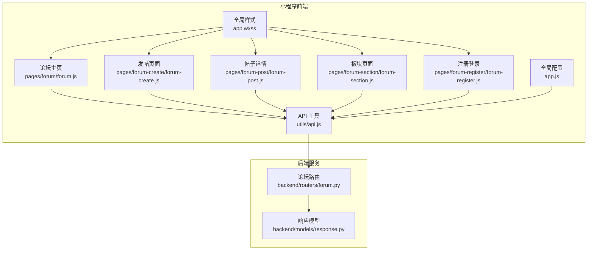
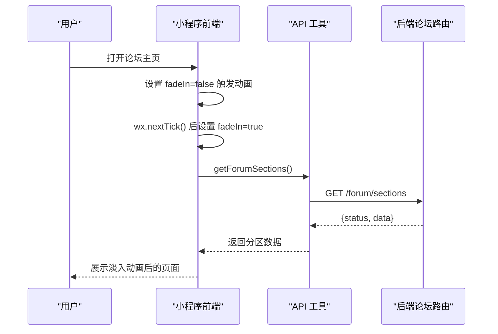
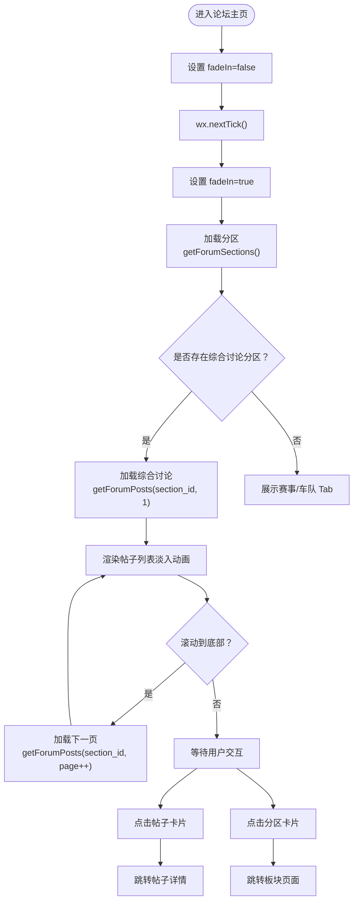
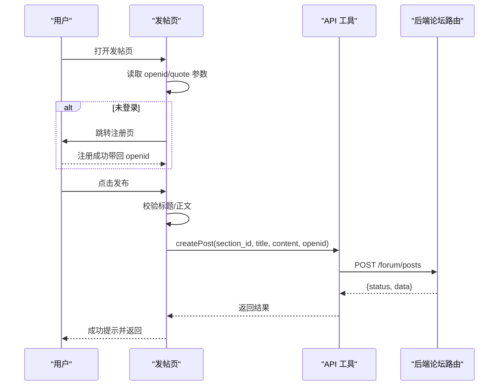
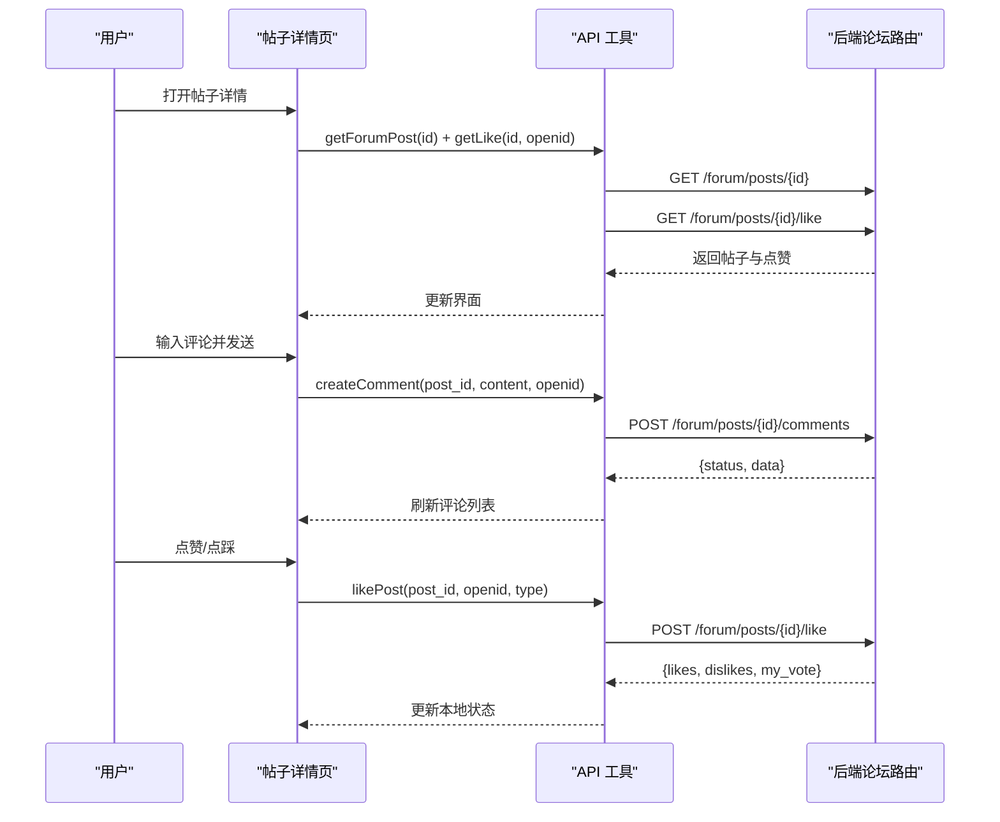
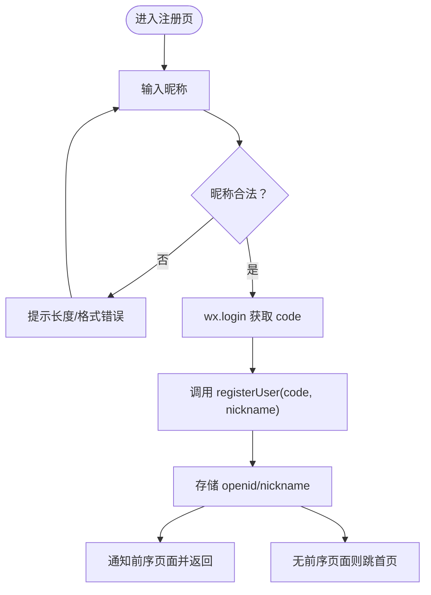
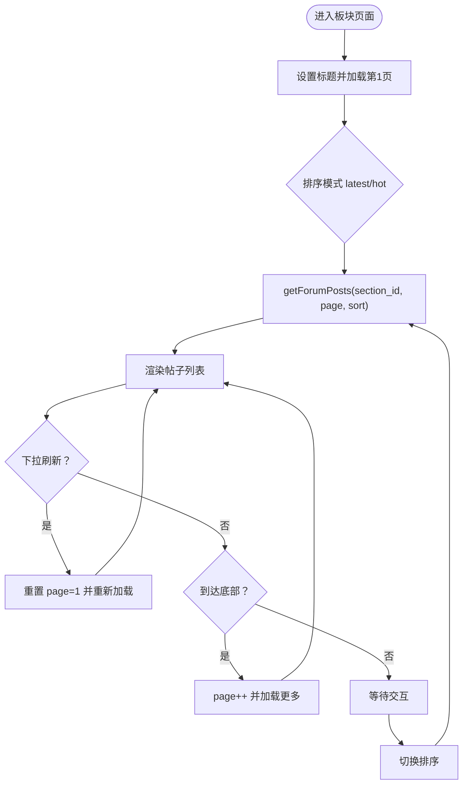
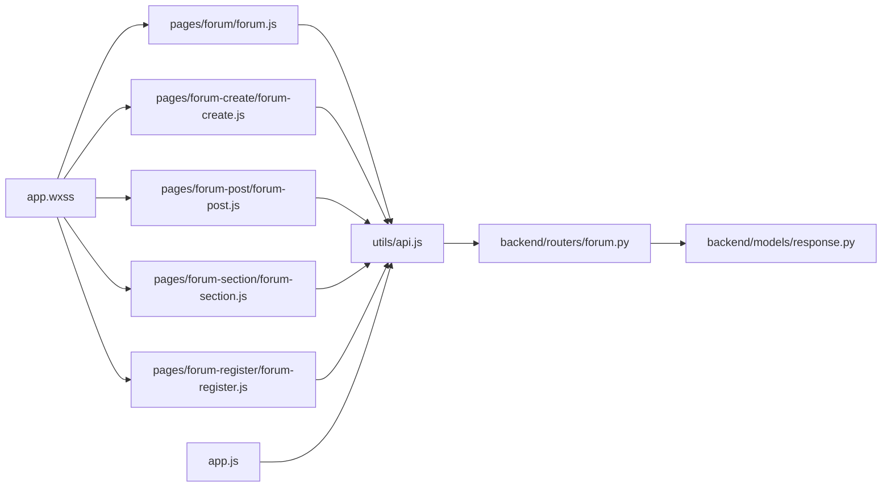

# 论坛系统

<cite>
**本文档引用的文件**
- [miniprogram/pages/forum/forum.js](file://miniprogram/pages/forum/forum.js)
- [miniprogram/pages/forum/forum.wxml](file://miniprogram/pages/forum/forum.wxml)
- [miniprogram/pages/forum/forum.wxss](file://miniprogram/pages/forum/forum.wxss)
- [miniprogram/pages/forum-create/forum-create.js](file://miniprogram/pages/forum-create/forum-create.js)
- [miniprogram/pages/forum-create/forum-create.wxml](file://miniprogram/pages/forum-create/forum-create.wxml)
- [miniprogram/pages/forum-create/forum-create.wxss](file://miniprogram/pages/forum-create/forum-create.wxss)
- [miniprogram/pages/forum-post/forum-post.js](file://miniprogram/pages/forum-post/forum-post.js)
- [miniprogram/pages/forum-post/forum-post.wxml](file://miniprogram/pages/forum-post/forum-post.wxml)
- [miniprogram/pages/forum-post/forum-post.wxss](file://miniprogram/pages/forum-post/forum-post.wxss)
- [miniprogram/pages/forum-section/forum-section.js](file://miniprogram/pages/forum-section/forum-section.js)
- [miniprogram/pages/forum-section/forum-section.wxml](file://miniprogram/pages/forum-section/forum-section.wxml)
- [miniprogram/pages/forum-section/forum-section.wxss](file://miniprogram/pages/forum-section/forum-section.wxss)
- [miniprogram/pages/forum-register/forum-register.js](file://miniprogram/pages/forum-register/forum-register.js)
- [miniprogram/pages/forum-register/forum-register.wxml](file://miniprogram/pages/forum-register/forum-register.wxml)
- [miniprogram/pages/forum-register/forum-register.wxss](file://miniprogram/pages/forum-register/forum-register.wxss)
- [miniprogram/utils/api.js](file://miniprogram/utils/api.js)
- [miniprogram/app.js](file://miniprogram/app.js)
- [miniprogram/app.wxss](file://miniprogram/app.wxss)
- [backend/routers/forum.py](file://backend/routers/forum.py)
- [backend/models/response.py](file://backend/models/response.py)
</cite>

## 更新摘要
**变更内容**
- 新增淡入过渡动画系统：论坛系统页面实现了统一的 fadeIn 动画机制
- 更新页面显示效果：通过 CSS transition 和 JavaScript 状态管理提供平滑的页面显示体验
- 扩展动画应用范围：多个页面采用相同的淡入动画模式，包括论坛主页、术语词典、新闻、积分榜等

## 目录
1. [简介](#简介)
2. [项目结构](#项目结构)
3. [核心组件](#核心组件)
4. [架构总览](#架构总览)
5. [详细组件分析](#详细组件分析)
6. [淡入过渡动画系统](#淡入过渡动画系统)
7. [依赖分析](#依赖分析)
8. [性能考虑](#性能考虑)
9. [故障排查指南](#故障排查指南)
10. [结论](#结论)
11. [附录](#附录)

## 简介
本文件面向 Fast-F1 微信小程序论坛系统，围绕以下目标进行系统化文档化：
- 论坛主页：板块导航、热门话题展示与用户状态管理
- 论坛发帖页面：富文本编辑器、图片上传、标签选择与发布流程
- 帖子详情页面：内容渲染、评论系统、点赞功能与用户互动
- 论坛注册登录页面：用户认证、权限管理与安全验证
- 论坛板块页面：分类浏览与内容排序
- 用户权限控制、内容审核与举报机制的实现方案
- **新增** 淡入过渡动画系统：统一的页面显示动画机制，提供流畅的用户体验

本系统采用"小程序前端 + FastAPI 后端"的前后端分离架构，前端通过统一 API 工具封装与后端交互，后端提供用户、分区、帖子、评论等完整接口，并内置内容审核与管理员能力。

## 项目结构
- 小程序前端位于 miniprogram 目录，按页面拆分 JS/WXML/WXSS，统一通过 utils/api.js 调用后端接口
- 后端位于 backend 目录，采用 FastAPI 路由模块化组织，接口集中在 routers/forum.py，响应模型定义于 models/response.py
- **新增** 全局动画系统：app.wxss 提供页面入场动画，各页面通过 fadeIn 状态控制淡入效果



**图表来源**
- [miniprogram/pages/forum/forum.js:1-143](file://miniprogram/pages/forum/forum.js#L1-L143)
- [miniprogram/pages/forum-create/forum-create.js:1-89](file://miniprogram/pages/forum-create/forum-create.js#L1-L89)
- [miniprogram/pages/forum-post/forum-post.js:1-160](file://miniprogram/pages/forum-post/forum-post.js#L1-L160)
- [miniprogram/pages/forum-section/forum-section.js:1-111](file://miniprogram/pages/forum-section/forum-section.js#L1-L111)
- [miniprogram/pages/forum-register/forum-register.js:1-55](file://miniprogram/pages/forum-register/forum-register.js#L1-L55)
- [miniprogram/utils/api.js:1-299](file://miniprogram/utils/api.js#L1-L299)
- [miniprogram/app.js:1-23](file://miniprogram/app.js#L1-L23)
- [miniprogram/app.wxss:1-128](file://miniprogram/app.wxss#L1-L128)
- [backend/routers/forum.py:1-327](file://backend/routers/forum.py#L1-L327)
- [backend/models/response.py:1-14](file://backend/models/response.py#L1-L14)

**章节来源**
- [miniprogram/pages/forum/forum.js:1-143](file://miniprogram/pages/forum/forum.js#L1-L143)
- [miniprogram/pages/forum-create/forum-create.js:1-89](file://miniprogram/pages/forum-create/forum-create.js#L1-L89)
- [miniprogram/pages/forum-post/forum-post.js:1-160](file://miniprogram/pages/forum-post/forum-post.js#L1-L160)
- [miniprogram/pages/forum-section/forum-section.js:1-111](file://miniprogram/pages/forum-section/forum-section.js#L1-L111)
- [miniprogram/pages/forum-register/forum-register.js:1-55](file://miniprogram/pages/forum-register/forum-register.js#L1-L55)
- [miniprogram/utils/api.js:1-299](file://miniprogram/utils/api.js#L1-L299)
- [miniprogram/app.js:1-23](file://miniprogram/app.js#L1-L23)
- [miniprogram/app.wxss:1-128](file://miniprogram/app.wxss#L1-L128)
- [backend/routers/forum.py:1-327](file://backend/routers/forum.py#L1-L327)
- [backend/models/response.py:1-14](file://backend/models/response.py#L1-L14)

## 核心组件
- 论坛主页：负责加载分区、默认展示综合讨论区、支持切换赛事/车队分区、加载综合讨论帖子列表与分页
- 发帖页面：负责标题/正文输入、用户鉴权、提交发帖、引用内容预填
- 帖子详情：负责加载帖子与点赞统计、加载评论、点赞/点踩、删除本人帖子、评论输入与提交
- 板块页面：负责按分区加载帖子、支持最新/最热排序、上拉加载更多
- 注册登录：负责微信登录换取 openid、设置昵称、存储用户态并回传给前序页面
- **新增** 淡入动画系统：统一的页面显示动画机制，通过 CSS transition 和 JavaScript 状态管理
- API 工具：统一封装 GET/POST 请求、带缓存策略、失败重试、管理员头信息
- 后端路由：提供用户、分区、帖子、评论、点赞、审核等接口

**章节来源**
- [miniprogram/pages/forum/forum.js:1-143](file://miniprogram/pages/forum/forum.js#L1-L143)
- [miniprogram/pages/forum-create/forum-create.js:1-89](file://miniprogram/pages/forum-create/forum-create.js#L1-L89)
- [miniprogram/pages/forum-post/forum-post.js:1-160](file://miniprogram/pages/forum-post/forum-post.js#L1-L160)
- [miniprogram/pages/forum-section/forum-section.js:1-111](file://miniprogram/pages/forum-section/forum-section.js#L1-L111)
- [miniprogram/pages/forum-register/forum-register.js:1-55](file://miniprogram/pages/forum-register/forum-register.js#L1-L55)
- [miniprogram/utils/api.js:1-299](file://miniprogram/utils/api.js#L1-L299)
- [backend/routers/forum.py:1-327](file://backend/routers/forum.py#L1-L327)

## 架构总览
小程序前端通过 utils/api.js 统一访问后端接口，后端以 FastAPI 路由集中管理业务逻辑。整体交互遵循"鉴权前置、状态持久化、接口幂等"的设计原则。



**图表来源**
- [miniprogram/pages/forum/forum.js:28-44](file://miniprogram/pages/forum/forum.js#L28-L44)
- [miniprogram/pages/forum/forum.wxml:3](file://miniprogram/pages/forum/forum.wxml#L3)
- [miniprogram/pages/forum/forum.wxss:1-4](file://miniprogram/pages/forum/forum.wxss#L1-L4)

## 详细组件分析

### 论坛主页（板块导航、热门话题、用户状态）
- 功能要点
  - 加载分区：调用 getForumSections() 获取 race/team 分区，并提取 slug=general 的综合讨论分区
  - 默认展示：若存在综合讨论分区，自动加载其帖子列表（第1页）
  - 切换 Tab：支持 general/race/team 三类 Tab，点击切换 activeTab
  - 综合讨论分页：滚动到底部触发加载下一页，支持 loading/hasMore 控制
  - 进入详情：点击任意帖子卡片跳转至帖子详情页
  - 发帖入口：综合讨论 Tab 下方悬浮按钮跳转至发帖页（携带 sectionId/sectionName）
  - **新增** 淡入动画：页面显示时自动触发动画效果

- 数据流与交互
  - 页面初始化：onLoad 调用 loadSections
  - 页面显示：onShow 在必要时刷新综合讨论列表并触发动画
  - 加载综合讨论：loadGeneralPosts/ loadGeneralMore 支持刷新与分页
  - 区域跳转：onTapSection 跳转至板块页面



**图表来源**
- [miniprogram/pages/forum/forum.js:28-44](file://miniprogram/pages/forum/forum.js#L28-L44)
- [miniprogram/pages/forum/forum.wxml:3](file://miniprogram/pages/forum/forum.wxml#L3)
- [miniprogram/pages/forum/forum.wxss:1-4](file://miniprogram/pages/forum/forum.wxss#L1-L4)

**章节来源**
- [miniprogram/pages/forum/forum.js:1-143](file://miniprogram/pages/forum/forum.js#L1-L143)
- [miniprogram/pages/forum/forum.wxml:1-118](file://miniprogram/pages/forum/forum.wxml#L1-L118)
- [miniprogram/pages/forum/forum.wxss:1-101](file://miniprogram/pages/forum/forum.wxss#L1-L101)

### 论坛发帖页面（富文本编辑器、图片上传、标签选择、发布流程）
- 功能要点
  - 输入校验：标题长度限制、正文长度限制
  - 用户鉴权：若未登录，跳转注册页；注册成功后回传 openid
  - 发布流程：调用 createPost，成功后返回上一页
  - 引用预填：支持从其他页面传递 quote 参数，自动拼接引用内容

- 交互流程
  - onLoad：解析参数、读取本地存储的 openid、处理引用内容
  - 提交：onSubmit 校验后调用 createPost，成功提示并延时返回
  - 注册回调：注册页通过事件回传 openid，写入当前页面



**图表来源**
- [miniprogram/pages/forum-create/forum-create.js:20-52](file://miniprogram/pages/forum-create/forum-create.js#L20-L52)
- [miniprogram/utils/api.js:189-190](file://miniprogram/utils/api.js#L189-L190)
- [backend/routers/forum.py:195-229](file://backend/routers/forum.py#L195-L229)

**章节来源**
- [miniprogram/pages/forum-create/forum-create.js:1-89](file://miniprogram/pages/forum-create/forum-create.js#L1-L89)
- [miniprogram/pages/forum-create/forum-create.wxml:1-62](file://miniprogram/pages/forum-create/forum-create.wxml#L1-L62)
- [miniprogram/pages/forum-create/forum-create.wxss:1-64](file://miniprogram/pages/forum-create/forum-create.wxss#L1-L64)

### 帖子详情页面（内容渲染、评论系统、点赞功能、用户互动）
- 功能要点
  - 加载帖子与点赞：Promise 并行加载帖子详情与点赞统计
  - 评论系统：加载评论列表，支持底部输入框提交评论
  - 点赞/点踩：支持登录后点赞/点踩，支持取消与切换
  - 删除本人帖子：作者可删除自己的帖子
  - 互动入口：可跳转到关联新闻详情

- 交互流程
  - onLoad：读取 openid/nickname，加载帖子与点赞
  - 评论：onSubmitComment 提交评论，本地预插入并异步刷新
  - 点赞：onLike 调用 likePost，更新本地点赞计数与我的投票状态
  - 删除：onDeletePost 弹窗确认后调用 deletePost



**图表来源**
- [miniprogram/pages/forum-post/forum-post.js:18-144](file://miniprogram/pages/forum-post/forum-post.js#L18-L144)
- [miniprogram/utils/api.js:207-224](file://miniprogram/utils/api.js#L207-L224)
- [backend/routers/forum.py:181-193](file://backend/routers/forum.py#L181-L193)
- [backend/routers/forum.py:255-273](file://backend/routers/forum.py#L255-L273)
- [backend/routers/forum.py:295-326](file://backend/routers/forum.py#L295-L326)

**章节来源**
- [miniprogram/pages/forum-post/forum-post.js:1-160](file://miniprogram/pages/forum-post/forum-post.js#L1-L160)
- [miniprogram/pages/forum-post/forum-post.wxml:1-113](file://miniprogram/pages/forum-post/forum-post.wxml#L1-L113)
- [miniprogram/pages/forum-post/forum-post.wxss:1-138](file://miniprogram/pages/forum-post/forum-post.wxss#L1-L138)

### 论坛注册登录页面（用户认证、权限管理、安全验证）
- 功能要点
  - 昵称校验：2-12 字符，不含特殊字符
  - 微信登录：wx.login 获取 code，提交后端换取 openid
  - 用户态：存储 openid 与 nickname，供后续页面使用
  - 回调机制：注册成功后通过事件回传给前序页面，否则返回首页

- 流程图
  - 输入昵称并提交
  - wx.login 获取 code
  - 调用 registerUser(code, nickname)
  - 存储 openid/nickname
  - 通知前序页面并返回或跳转首页



**图表来源**
- [miniprogram/pages/forum-register/forum-register.js:16-53](file://miniprogram/pages/forum-register/forum-register.js#L16-L53)
- [miniprogram/utils/api.js:172-176](file://miniprogram/utils/api.js#L172-L176)
- [backend/routers/forum.py:95-109](file://backend/routers/forum.py#L95-L109)

**章节来源**
- [miniprogram/pages/forum-register/forum-register.js:1-55](file://miniprogram/pages/forum-register/forum-register.js#L1-L55)
- [miniprogram/pages/forum-register/forum-register.wxml:1-36](file://miniprogram/pages/forum-register/forum-register.wxml#L1-L36)
- [miniprogram/pages/forum-register/forum-register.wxss:1-38](file://miniprogram/pages/forum-register/forum-register.wxss#L1-L38)

### 论坛板块页面（分类浏览、内容排序）
- 功能要点
  - 加载分区帖子：支持最新/最热两种排序模式
  - 上拉加载：滚动到底部触发下一页加载
  - 下拉刷新：支持下拉刷新列表
  - 发帖入口：悬浮按钮跳转至发帖页

- 交互流程
  - onLoad：设置标题、加载第1页
  - onShow：非首次进入时刷新
  - onPullDownRefresh：清空页码并重新加载
  - onReachBottom：页码+1并加载更多
  - onSwitchSort：切换排序模式并重新加载



**图表来源**
- [miniprogram/pages/forum-section/forum-section.js:19-45](file://miniprogram/pages/forum-section/forum-section.js#L19-L45)
- [miniprogram/utils/api.js:183-184](file://miniprogram/utils/api.js#L183-L184)
- [backend/routers/forum.py:153-178](file://backend/routers/forum.py#L153-L178)

**章节来源**
- [miniprogram/pages/forum-section/forum-section.js:1-111](file://miniprogram/pages/forum-section/forum-section.js#L1-L111)
- [miniprogram/pages/forum-section/forum-section.wxml:1-72](file://miniprogram/pages/forum-section/forum-section.wxml#L1-L72)
- [miniprogram/pages/forum-section/forum-section.wxss:1-213](file://miniprogram/pages/forum-section/forum-section.wxss#L1-L213)

### 用户权限控制、内容审核与举报机制（实现方案）
- 用户权限
  - 登录态：所有需要身份的操作均需 openid（注册页与发帖页、评论页、点赞页均有判断）
  - 作者权限：仅作者本人可删除自己的帖子
- 内容审核
  - 发帖/评论默认状态为 pending，待审核通过后可见
  - 后端提供管理员接口 approve/reject，支持对帖子与评论进行审核
- 举报机制
  - 建议在现有评论/帖子接口基础上扩展"举报"字段与状态字段，并在管理员后台进行处理
  - 可复用现有管理员接口风格，新增 /admin/reports 列表与 /admin/reports/{id}/handle

**章节来源**
- [backend/routers/forum.py:195-229](file://backend/routers/forum.py#L195-L229)
- [backend/routers/forum.py:295-326](file://backend/routers/forum.py#L295-L326)
- [backend/routers/forum.py:226-247](file://backend/routers/forum.py#L226-L247)

## 淡入过渡动画系统

### 系统概述
论坛系统实现了统一的淡入过渡动画机制，通过 CSS transition 和 JavaScript 状态管理提供平滑的页面显示效果。该系统应用于多个页面，包括论坛主页、术语词典、新闻、积分榜等。

### 技术实现

#### CSS 动画定义
全局动画通过 app.wxss 定义，每个页面通过容器类名控制动画状态：

```css
/* 页面入场动画（所有页面通用） */
@keyframes pageEnter {
  from { opacity: 0; transform: translateY(22rpx) scale(0.992); }
  to   { opacity: 1; transform: translateY(0); }
}

.container {
  animation: pageEnter 0.28s cubic-bezier(0.25, 0.46, 0.45, 0.94) both;
}

/* 页面容器基础样式 */
.container { 
  min-height: 100vh; 
  background: #0f0f0f; 
  display: flex; 
  flex-direction: column; 
  opacity: 0; 
  transition: opacity 0.25s ease; 
}

.container.fade-in { 
  opacity: 1; 
}
```

#### JavaScript 状态管理
页面通过 `fadeIn` 数据属性控制动画状态：

```javascript
// 页面显示时触发动画
onShow() {
  if (this._hasShown) {
    this.setData({ fadeIn: false })
    wx.nextTick(() => this.setData({ fadeIn: true }))
  }
  this._hasShown = true
}
```

#### WXML 模板绑定
模板中通过条件绑定控制动画类名：

```html
<view class="container {{fadeIn ? 'fade-in' : ''}}">
  <!-- 页面内容 -->
</view>
```

### 动画特点
- **平滑过渡**：0.25秒的渐变过渡时间，提供舒适的视觉体验
- **性能优化**：使用 GPU 加速的 transform 和 opacity 属性
- **一致性**：所有页面采用相同的动画时序和缓动函数
- **可维护性**：统一的状态管理方式，便于扩展和修改

### 应用范围
目前应用到以下页面：
- 论坛主页（forum）
- 术语词典（glossary）
- 新闻页面（news）
- 积分榜页面（standings）
- 论坛发帖页面（forum-create）
- 帖子详情页面（forum-post）
- 板块页面（forum-section）
- 注册登录页面（forum-register）

**章节来源**
- [miniprogram/app.wxss:8-16](file://miniprogram/app.wxss#L8-L16)
- [miniprogram/pages/forum/forum.js:28-44](file://miniprogram/pages/forum/forum.js#L28-L44)
- [miniprogram/pages/forum/forum.wxml:3](file://miniprogram/pages/forum/forum.wxml#L3)
- [miniprogram/pages/forum/forum.wxss:1-4](file://miniprogram/pages/forum/forum.wxss#L1-L4)

## 依赖分析
- 前端依赖
  - utils/api.js：封装请求、缓存、重试、管理员头
  - app.js：全局 BASE_URL 配置
  - **新增** app.wxss：全局动画样式和页面基础样式
- 后端依赖
  - FastAPI 路由：集中管理用户、分区、帖子、评论、点赞、审核
  - models/response.py：统一响应结构



**图表来源**
- [miniprogram/utils/api.js:1-299](file://miniprogram/utils/api.js#L1-L299)
- [miniprogram/app.js:1-23](file://miniprogram/app.js#L1-L23)
- [miniprogram/app.wxss:1-128](file://miniprogram/app.wxss#L1-L128)
- [backend/routers/forum.py:1-327](file://backend/routers/forum.py#L1-L327)
- [backend/models/response.py:1-14](file://backend/models/response.py#L1-L14)

**章节来源**
- [miniprogram/utils/api.js:1-299](file://miniprogram/utils/api.js#L1-L299)
- [miniprogram/app.js:1-23](file://miniprogram/app.js#L1-L23)
- [miniprogram/app.wxss:1-128](file://miniprogram/app.wxss#L1-L128)
- [backend/routers/forum.py:1-327](file://backend/routers/forum.py#L1-L327)
- [backend/models/response.py:1-14](file://backend/models/response.py#L1-L14)

## 性能考虑
- 请求缓存：API 工具对部分接口设置缓存 TTL，命中缓存后立即返回并在后台静默刷新，减少重复请求
- 并发加载：帖子详情页并发请求帖子与点赞数据，缩短首屏等待
- 分页加载：主页与板块页均采用分页加载，避免一次性传输大量数据
- 骨架屏：在加载阶段使用骨架屏提升感知性能
- 本地存储：用户 openid/nickname 使用本地存储，避免频繁登录态校验
- **新增** 动画性能：使用 transform 和 opacity 属性，避免布局重排，确保动画流畅性

**章节来源**
- [miniprogram/utils/api.js:4-120](file://miniprogram/utils/api.js#L4-L120)
- [miniprogram/pages/forum-post/forum-post.js:40-43](file://miniprogram/pages/forum-post/forum-post.js#L40-L43)
- [miniprogram/pages/forum/forum.wxml:29-34](file://miniprogram/pages/forum/forum.wxml#L29-L34)
- [miniprogram/pages/forum-section/forum-section.wxml:36-51](file://miniprogram/pages/forum-section/forum-section.wxml#L36-L51)
- [miniprogram/app.wxss:8-16](file://miniprogram/app.wxss#L8-L16)

## 故障排查指南
- 网络错误与失败重试
  - API 工具对请求失败自动重试一次，若仍失败，返回错误信息
- 常见问题定位
  - 注册失败：检查 wx.login 是否成功、昵称是否符合规则、后端是否返回 openid
  - 发帖失败：检查标题/正文长度、是否已登录、是否传入正确 openid
  - 评论失败：检查评论内容长度、是否已登录、帖子是否存在
  - 点赞失败：检查 openid 是否有效、type 是否为 like 或 dislike
- 日志与提示
  - 页面内使用 wx.showToast 提示错误信息，便于快速定位问题
- **新增** 动画问题排查
  - 检查 fadeIn 状态是否正确设置
  - 确认 CSS 类名绑定是否正确
  - 验证 wx.nextTick() 是否正确执行
  - 检查页面容器是否正确应用动画样式

**章节来源**
- [miniprogram/utils/api.js:45-85](file://miniprogram/utils/api.js#L45-L85)
- [miniprogram/pages/forum-register/forum-register.js:43-52](file://miniprogram/pages/forum-register/forum-register.js#L43-L52)
- [miniprogram/pages/forum-create/forum-create.js:79-83](file://miniprogram/pages/forum-create/forum-create.js#L79-L83)
- [miniprogram/pages/forum-post/forum-post.js:140-143](file://miniprogram/pages/forum-post/forum-post.js#L140-L143)
- [miniprogram/pages/forum-post/forum-post.js:81-83](file://miniprogram/pages/forum-post/forum-post.js#L81-L83)
- [miniprogram/pages/forum/forum.js:28-44](file://miniprogram/pages/forum/forum.js#L28-L44)

## 结论
本系统通过清晰的页面职责划分与统一的 API 工具，实现了从注册登录到发帖、评论、点赞、板块浏览的完整论坛闭环。后端提供完善的用户、分区、帖子、评论与审核能力，前端注重用户体验与性能优化。

**新增的淡入过渡动画系统**进一步提升了用户体验，通过统一的动画机制为用户提供了流畅、一致的页面切换体验。该系统采用高性能的 CSS 属性，确保动画在各种设备上都能流畅运行。

建议后续补充举报机制与更细粒度的权限控制，以进一步完善社区治理。

## 附录
- 接口一览（前端调用）
  - 用户：registerUser、getMe
  - 分区：getForumSections
  - 帖子：getForumPosts、getForumPost、createPost、deletePost、likePost、getLike
  - 评论：getForumComments、createComment
  - 管理：adminGetPosts、adminApprovePost、adminRejectPost、adminGetComments、adminApproveComment、adminRejectComment

**章节来源**
- [miniprogram/utils/api.js:171-296](file://miniprogram/utils/api.js#L171-L296)