# 微信小程序前端

<cite>
**本文档引用的文件**
- [miniprogram/app.js](file://miniprogram/app.js)
- [miniprogram/app.json](file://miniprogram/app.json)
- [miniprogram/app.wxss](file://miniprogram/app.wxss)
- [miniprogram/utils/api.js](file://miniprogram/utils/api.js)
- [miniprogram/utils/circuit_paths.js](file://miniprogram/utils/circuit_paths.js)
- [miniprogram/components/ec-canvas/ec-canvas.js](file://miniprogram/components/ec-canvas/ec-canvas.js)
- [miniprogram/pages/index/index.js](file://miniprogram/pages/index/index.js)
- [miniprogram/pages/standings/standings.js](file://miniprogram/pages/standings/standings.js)
- [miniprogram/pages/telemetry/telemetry.js](file://miniprogram/pages/telemetry/telemetry.js)
- [miniprogram/pages/analysis/analysis.js](file://miniprogram/pages/analysis/analysis.js)
- [miniprogram/pages/event/event.js](file://miniprogram/pages/event/event.js)
- [miniprogram/pages/news/news.js](file://miniprogram/pages/news/news.js)
- [miniprogram/pages/forum/forum.js](file://miniprogram/pages/forum/forum.js)
- [miniprogram/pages/admin/admin.js](file://miniprogram/pages/admin/admin.js)
- [miniprogram/pages/curated-detail/curated-detail.js](file://miniprogram/pages/curated-detail/curated-detail.js)
- [miniprogram/pages/curated-submit/curated-submit.js](file://miniprogram/pages/curated-submit/curated-submit.js)
- [miniprogram/pages/driver/driver.js](file://miniprogram/pages/driver/driver.js)
- [miniprogram/pages/chatroom/chatroom.js](file://miniprogram/pages/chatroom/chatroom.js)
- [miniprogram/pages/forum-create/forum-create.js](file://miniprogram/pages/forum-create/forum-create.js)
- [miniprogram/pages/forum-post/forum-post.js](file://miniprogram/pages/forum-post/forum-post.js)
- [miniprogram/pages/forum-section/forum-section.js](file://miniprogram/pages/forum-section/forum-section.js)
- [miniprogram/pages/forum-register/forum-register.js](file://miniprogram/pages/forum-register/forum-register.js)
- [miniprogram/pages/news-detail/news-detail.js](file://miniprogram/pages/news-detail/news-detail.js)
- [miniprogram/pages/news-team/news-team.js](file://miniprogram/pages/news-team/news-team.js)
- [generate_icons.py](file://generate_icons.py)
</cite>

## 更新摘要
**所做更改**
- 新增统一淡入过渡动画系统，所有核心页面实现fadeIn动画机制
- 新增图标生成工具generate_icons.py，用于生成专业的F1主题标签栏图标
- 新增管理员后台页面及完整管理功能
- 新增精选内容管理系统，包含投稿、审核、AI分析
- 新增车手个人页面，支持评分、评论、趋势分析
- 新增匿名聊天室功能，支持实时消息轮询
- 新增论坛完整生态，包含分区、帖子、评论、用户系统
- 新增新闻团队专题页面，支持车队资讯筛选
- 大幅增强API封装，新增多个专用接口
- 扩展页面路由，新增20+个页面
- 增强缓存策略，支持内存缓存和目录缓存

## 目录
1. [简介](#简介)
2. [项目结构](#项目结构)
3. [核心组件](#核心组件)
4. [架构总览](#架构总览)
5. [详细组件分析](#详细组件分析)
6. [依赖关系分析](#依赖关系分析)
7. [性能考虑](#性能考虑)
8. [故障排除指南](#故障排除指南)
9. [结论](#结论)
10. [附录](#附录)

## 简介
本项目是 Fast-F1 微信小程序前端，围绕 Formula 1 赛事数据提供赛历、积分榜、赛事详情、遥测对比、圈时分析、资讯与论坛等全方位功能。前端采用原生小程序框架，结合本地缓存与 ECharts 图表组件，实现高性能的数据可视化与流畅的用户体验。经过完全重构后，现已支持管理员后台、精选内容管理、车手个人中心、匿名聊天室等高级功能。**新增统一淡入过渡动画系统**和**专业图标生成工具**进一步提升了用户体验和开发效率。

## 项目结构
小程序前端位于 miniprogram 目录，经过重构后形成了完整的功能体系，主要分为以下层次：
- 应用入口与全局配置：app.js、app.json、app.wxss
- 页面层：pages 下的完整业务页面（新增管理员后台、精选内容、车手中心、聊天室等）
- 组件层：components 下的通用组件（如 ECharts 封装 ec-canvas）
- 工具与数据：utils 下的 API 封装与静态资源（如赛道 SVG 路径）
- **新增**：图标生成工具 generate_icons.py，用于自动化生成F1主题标签栏图标

```mermaid
graph TB
subgraph "应用层"
APP["App 全局<br/>app.js / app.json / app.wxss"]
end
subgraph "页面层"
IDX["首页 index"]
STAND["积分榜 standings"]
EVENT["赛事详情 event"]
TEL["遥测 telemetry"]
ANA["圈时分析 analysis"]
NEWS["资讯 news"]
FORUM["论坛 forum"]
ADMIN["管理员后台 admin"]
CURATED["精选内容 curated"]
DRIVER["车手中心 driver"]
CHAT["聊天室 chatroom"]
END
subgraph "组件层"
ECHARTS["ECharts 组件<br/>ec-canvas"]
end
subgraph "工具层"
API["API 封装<br/>utils/api.js"]
PATHS["赛道路径<br/>utils/circuit_paths.js"]
ICONS["图标生成工具<br/>generate_icons.py"]
end
APP --> IDX
APP --> STAND
APP --> EVENT
APP --> TEL
APP --> ANA
APP --> NEWS
APP --> FORUM
APP --> ADMIN
APP --> CURATED
APP --> DRIVER
APP --> CHAT
IDX --> API
STAND --> API
EVENT --> API
TEL --> API
ANA --> API
NEWS --> API
FORUM --> API
ADMIN --> API
CURATED --> API
DRIVER --> API
CHAT --> API
STAND --> ECHARTS
TEL --> ECHARTS
EVENT --> ECHARTS
IDX --> PATHS
ICONS --> APP
```

**图表来源**
- [miniprogram/app.js:1-23](file://miniprogram/app.js#L1-L23)
- [miniprogram/app.json:1-75](file://miniprogram/app.json#L1-L75)
- [miniprogram/utils/api.js:1-376](file://miniprogram/utils/api.js#L1-L376)
- [miniprogram/utils/circuit_paths.js:1-119](file://miniprogram/utils/circuit_paths.js#L1-L119)
- [miniprogram/components/ec-canvas/ec-canvas.js:1-292](file://miniprogram/components/ec-canvas/ec-canvas.js#L1-L292)
- [generate_icons.py:1-177](file://generate_icons.py#L1-L177)

**章节来源**
- [miniprogram/app.js:1-23](file://miniprogram/app.js#L1-L23)
- [miniprogram/app.json:1-75](file://miniprogram/app.json#L1-L75)
- [miniprogram/app.wxss:1-118](file://miniprogram/app.wxss#L1-L118)

## 核心组件
- API 封装模块：统一处理请求、重试、超时、缓存与错误提示，支持 GET/POST，并内置管理员鉴权头。新增精选内容、车手中心、聊天室等专用接口。
- ECharts 组件：封装 ec-canvas，兼容新旧 Canvas 版本，提供初始化、事件绑定、截图导出能力。
- 赛道路径数据：提供各分站的 SVG 路径与视窗，用于首页地图绘制。
- 管理员后台：完整的后台管理系统，支持内容审核、爬虫调度、AI分析监控。
- **新增**：统一淡入过渡动画系统：所有核心页面实现fadeIn动画机制，提供流畅的页面切换体验。
- **新增**：图标生成工具：generate_icons.py 自动生成专业的F1主题标签栏图标，支持选中和非选中状态。

**章节来源**
- [miniprogram/utils/api.js:1-376](file://miniprogram/utils/api.js#L1-L376)
- [miniprogram/components/ec-canvas/ec-canvas.js:1-292](file://miniprogram/components/ec-canvas/ec-canvas.js#L1-L292)
- [miniprogram/utils/circuit_paths.js:1-119](file://miniprogram/utils/circuit_paths.js#L1-L119)
- [generate_icons.py:1-177](file://generate_icons.py#L1-L177)

## 架构总览
小程序前端通过页面路由组织功能，页面间通过参数传递进行导航；数据通过 API 模块统一获取，结合本地缓存提升性能；图表通过 ECharts 组件渲染，支持多种交互操作。经过重构后，系统支持完整的前后端交互流程。**新增的统一动画系统**确保所有页面切换都具有平滑一致的视觉效果。

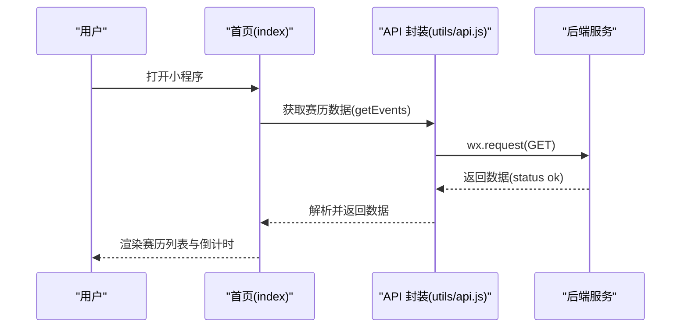

**图表来源**
- [miniprogram/pages/index/index.js:125-173](file://miniprogram/pages/index/index.js#L125-L173)
- [miniprogram/utils/api.js:158-159](file://miniprogram/utils/api.js#L158-L159)

## 详细组件分析

### 首页：赛历与倒计时
- 功能要点
  - 加载年度赛历，过滤有效轮次，展示下一场比赛倒计时。
  - 使用本地缓存策略减少重复请求。
  - 绘制各分站 SVG 地图，基于预置路径数据与 Canvas 绘制。
  - 提供热门推荐（帖子与新闻）与快捷跳转。
  - **新增**：统一淡入动画系统，在页面显示时自动触发动画效果。
- 关键流程
  - 页面加载时拉取赛历与热门数据。
  - 选择下一场未开始的比赛，启动每秒更新的倒计时。
  - 赛事结束后自动切换下一场。
  - 使用选择器查询 Canvas 节点，计算缩放与偏移，绘制路径。
  - **新增**：onShow生命周期中调用fadeIn动画机制。

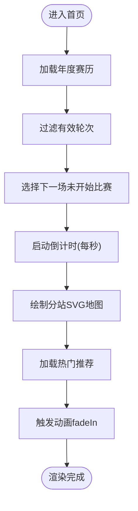

**图表来源**
- [miniprogram/pages/index/index.js:125-173](file://miniprogram/pages/index/index.js#L125-L173)
- [miniprogram/utils/circuit_paths.js:6-119](file://miniprogram/utils/circuit_paths.js#L6-L119)

**章节来源**
- [miniprogram/pages/index/index.js:1-255](file://miniprogram/pages/index/index.js#L1-L255)

### 积分榜：驱动/车队趋势图
- 功能要点
  - 展示车手与车队积分趋势，支持切换 driver/constructor。
  - 使用 ECharts 组件渲染折线图，自定义网格、坐标轴、图例与样式。
  - 通过 ec-canvas 组件懒加载初始化，避免时序问题。
  - **新增**：统一淡入动画系统，图表初始化时自动触发动画。
- 关键流程
  - 页面加载时根据年份请求积分数据。
  - 构建趋势图 Option 并初始化图表实例。
  - 点击车手项跳转至车手详情页。

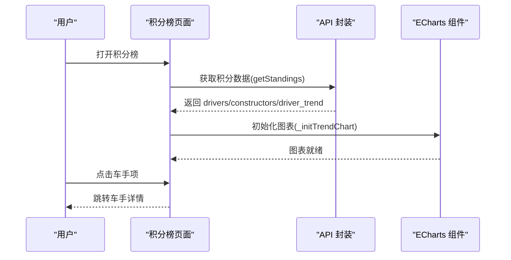

**图表来源**
- [miniprogram/pages/standings/standings.js:74-121](file://miniprogram/pages/standings/standings.js#L74-L121)
- [miniprogram/utils/api.js:170-171](file://miniprogram/utils/api.js#L170-L171)

**章节来源**
- [miniprogram/pages/standings/standings.js:1-123](file://miniprogram/pages/standings/standings.js#L1-L123)

### 赛事详情：排位与正赛数据
- 功能要点
  - 根据是否已发生正赛决定是否加载正赛数据。
  - 排位赛：展示车手列表，支持遥测对比跳转。
  - 正赛：按最终排名构建车手列表，绘制名次变化折线图，支持进站标记与标签。
  - 车手选择器：多选车手，动态更新图表与数据卡片。
- 关键流程
  - Tab 切换时按需加载排位或正赛数据。
  - 初始化正赛图表，构建 Option 并设置数据。
  - 车手选择变更时，重新计算选中集合与卡片数据。

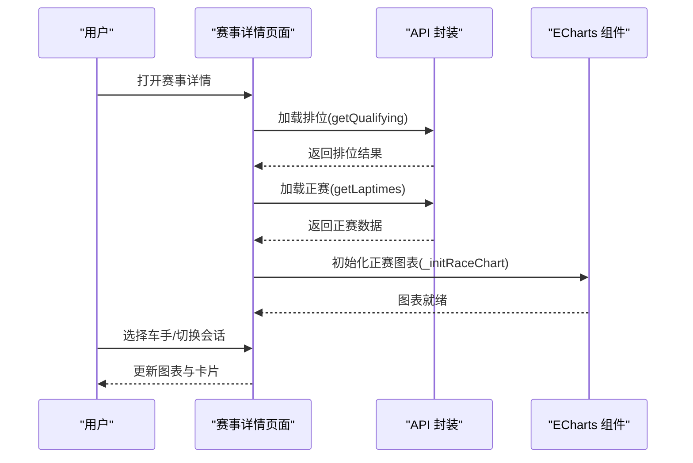

**图表来源**
- [miniprogram/pages/event/event.js:261-299](file://miniprogram/pages/event/event.js#L261-L299)
- [miniprogram/utils/api.js:161-162](file://miniprogram/utils/api.js#L161-L162)

**章节来源**
- [miniprogram/pages/event/event.js:1-381](file://miniprogram/pages/event/event.js#L1-L381)

### 遥测对比：通道与图表切换
- 功能要点
  - 支持速度、油门、刹车、档位四个通道的对比曲线。
  - 基于拐弯点标注，辅助分析驾驶风格与策略。
  - 通过 ec-canvas 组件手动初始化，避免 setData 时序问题。
- 关键流程
  - 页面加载时根据年、轮次、车手与会话请求遥测数据。
  - 初始化图表并绘制默认通道（速度）。
  - 切换通道时重新构建 Option 并更新图表。

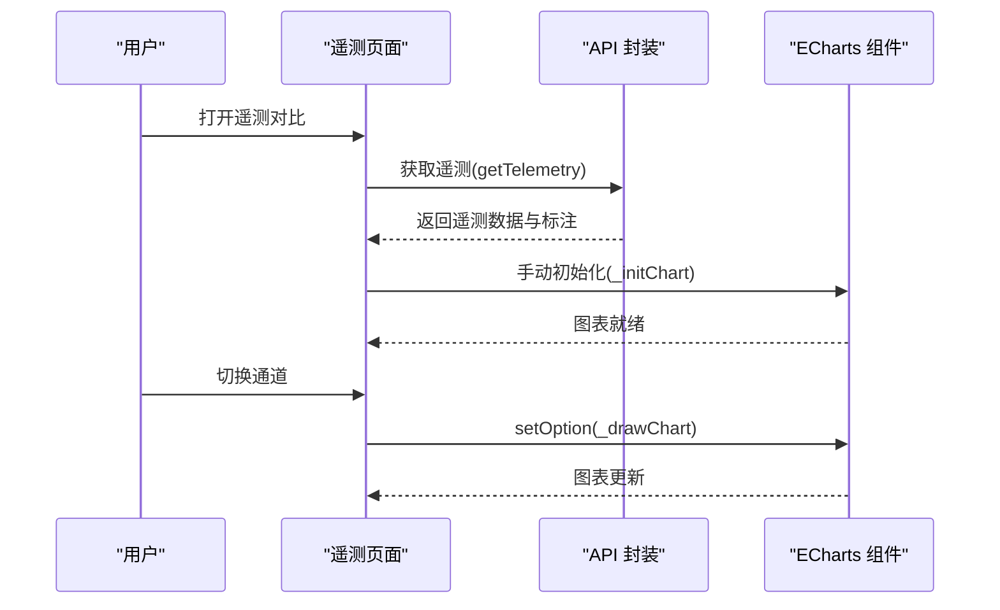

**图表来源**
- [miniprogram/pages/telemetry/telemetry.js:98-147](file://miniprogram/pages/telemetry/telemetry.js#L98-L147)
- [miniprogram/utils/api.js:167-168](file://miniprogram/utils/api.js#L167-L168)

**章节来源**
- [miniprogram/pages/telemetry/telemetry.js:1-156](file://miniprogram/pages/telemetry/telemetry.js#L1-L156)

### 圈时分析：AI 报告与指标
- 功能要点
  - 请求 AI 分析报告与指标，支持强制刷新。
  - 将报告按二级标题拆分为段落，便于折叠展开查看。
  - 展示缓存状态，支持手动刷新。
- 关键流程
  - 页面加载时请求分析数据。
  - 解析报告文本为段落结构，设置展开状态。
  - 提供刷新按钮，强制绕过缓存重新请求。

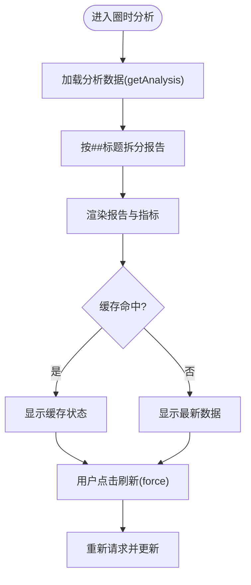

**图表来源**
- [miniprogram/pages/analysis/analysis.js:36-54](file://miniprogram/pages/analysis/analysis.js#L36-L54)

**章节来源**
- [miniprogram/pages/analysis/analysis.js:1-85](file://miniprogram/pages/analysis/analysis.js#L1-L85)

### 管理员后台：内容审核与分析管理
- 功能要点
  - 管理员密码解锁，支持长按解锁。
  - 管理帖子、评论、术语的审核流程。
  - 支持爬虫调度和AI分析的进度监控。
  - 实时显示分析进度，支持批量操作。
- 关键流程
  - 长按logo触发解锁流程，验证管理员密码。
  - 并行加载所有待审核内容，支持分页显示。
  - 执行审核操作时的异步处理与状态更新。
  - 爬取和分析流程的进度跟踪与错误处理。

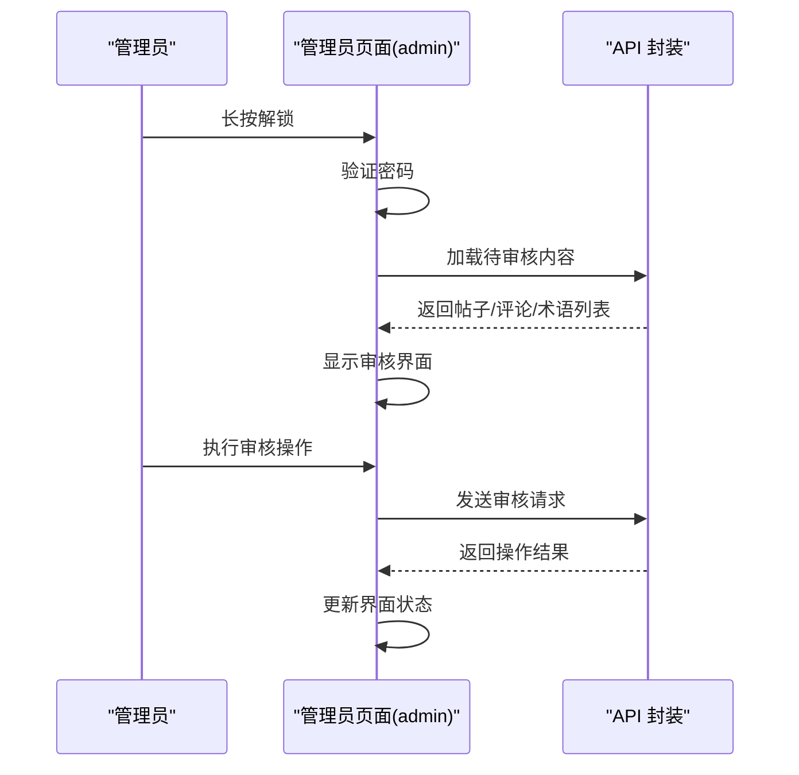

**图表来源**
- [miniprogram/pages/admin/admin.js:24-62](file://miniprogram/pages/admin/admin.js#L24-L62)
- [miniprogram/utils/api.js:263-288](file://miniprogram/utils/api.js#L263-L288)

**章节来源**
- [miniprogram/pages/admin/admin.js:1-199](file://miniprogram/pages/admin/admin.js#L1-L199)

### 精选内容：投稿与AI分析
- 功能要点
  - 支持链接投稿和手动投稿两种模式。
  - 平台识别与URL提取，支持抖音、微博等平台。
  - 标签系统，支持技术分析、赛车策略等分类。
  - AI分析触发与轮询，支持重新分析。
- 关键流程
  - 选择投稿模式，填写相关信息。
  - 提交后显示预览结果，支持返回修改。
  - 后台AI分析完成后，支持轮询更新。
  - 用户可触发重新分析或讨论区关联。

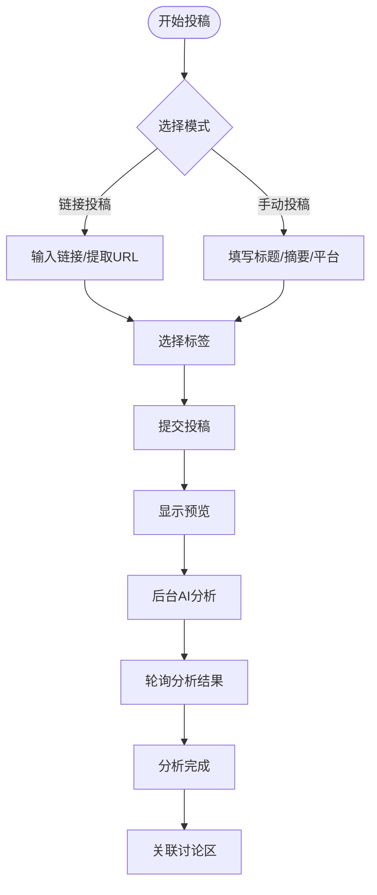

**图表来源**
- [miniprogram/pages/curated-submit/curated-submit.js:95-183](file://miniprogram/pages/curated-submit/curated-submit.js#L95-L183)
- [miniprogram/pages/curated-detail/curated-detail.js:204-270](file://miniprogram/pages/curated-detail/curated-detail.js#L204-L270)

**章节来源**
- [miniprogram/pages/curated-submit/curated-submit.js:1-185](file://miniprogram/pages/curated-submit/curated-submit.js#L1-L185)
- [miniprogram/pages/curated-detail/curated-detail.js:1-272](file://miniprogram/pages/curated-detail/curated-detail.js#L1-L272)

### 车手中心：评分、评论与趋势
- 功能要点
  - 车手基本信息展示，支持年龄计算。
  - 社区评分系统，支持多维度评分。
  - 评论系统，支持点赞和回复。
  - 积分趋势分析，支持历史数据展示。
- 关键流程
  - 页面加载时获取车手信息和趋势数据。
  - 评分系统支持匿名ID，离线回退机制。
  - 评论系统支持分页加载和实时更新。
  - 趋势图表支持动态更新和交互。

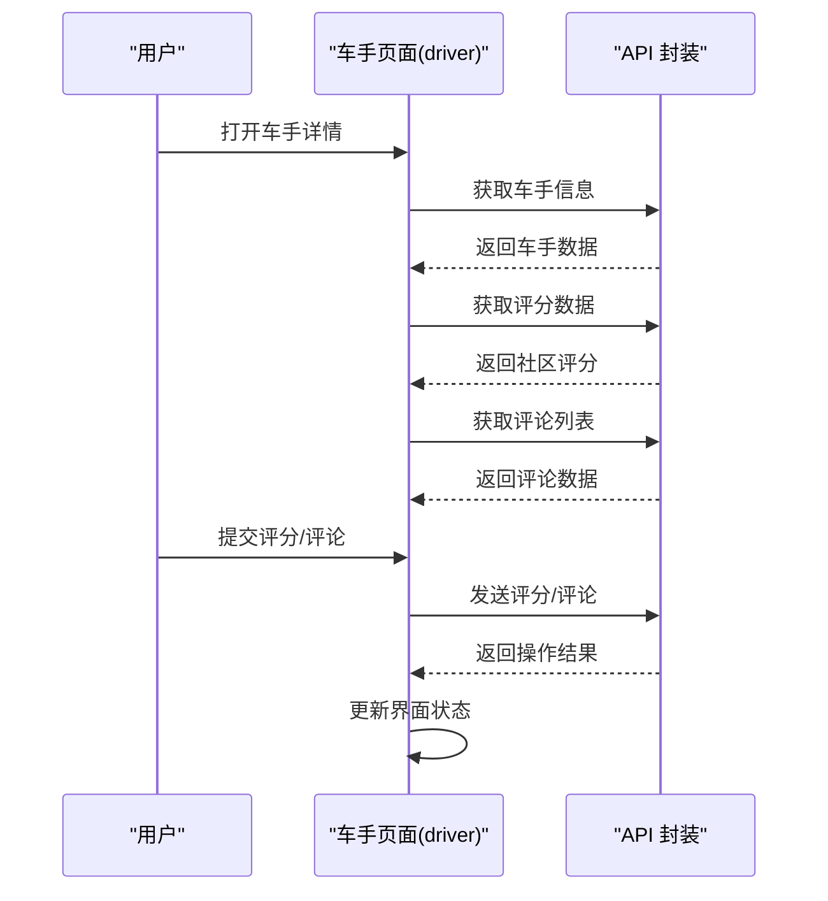

**图表来源**
- [miniprogram/pages/driver/driver.js:298-332](file://miniprogram/pages/driver/driver.js#L298-L332)
- [miniprogram/utils/api.js:335-349](file://miniprogram/utils/api.js#L335-L349)

**章节来源**
- [miniprogram/pages/driver/driver.js:1-478](file://miniprogram/pages/driver/driver.js#L1-L478)

### 匿名聊天室：实时消息系统
- 功能要点
  - 匿名用户系统，支持随机昵称生成。
  - 实时消息轮询，4秒间隔自动刷新。
  - 消息历史保存，最多保留200条。
  - 用户状态管理，支持昵称修改。
- 关键流程
  - 页面加载时初始化用户昵称。
  - 启动定时轮询获取新消息。
  - 支持手动发送消息和自动滚动。
  - 页面隐藏时停止轮询，显示时重启。

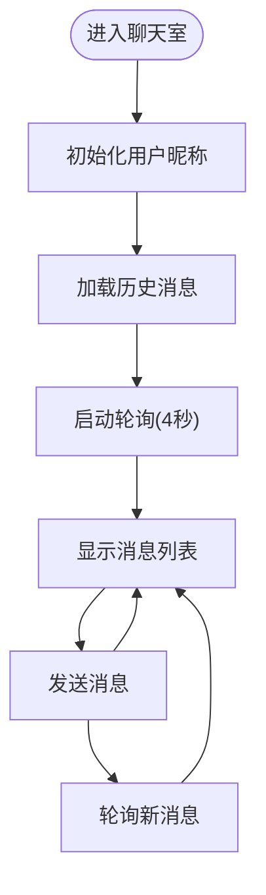

**图表来源**
- [miniprogram/pages/chatroom/chatroom.js:13-35](file://miniprogram/pages/chatroom/chatroom.js#L13-L35)
- [miniprogram/utils/api.js:365-372](file://miniprogram/utils/api.js#L365-L372)

**章节来源**
- [miniprogram/pages/chatroom/chatroom.js:1-140](file://miniprogram/pages/chatroom/chatroom.js#L1-L140)

### 论坛系统：完整社区生态
- 功能要点
  - 分区管理，支持赛车、车队、综合讨论等分区。
  - 帖子管理，支持最新、最热排序。
  - 评论系统，支持点赞、回复、删除。
  - 用户系统，支持微信授权登录。
- 关键流程
  - 加载分区列表，分离综合讨论分区。
  - 默认加载综合讨论分区的帖子列表。
  - 支持发帖、评论、点赞等交互操作。
  - 用户状态管理，支持注册和登录。

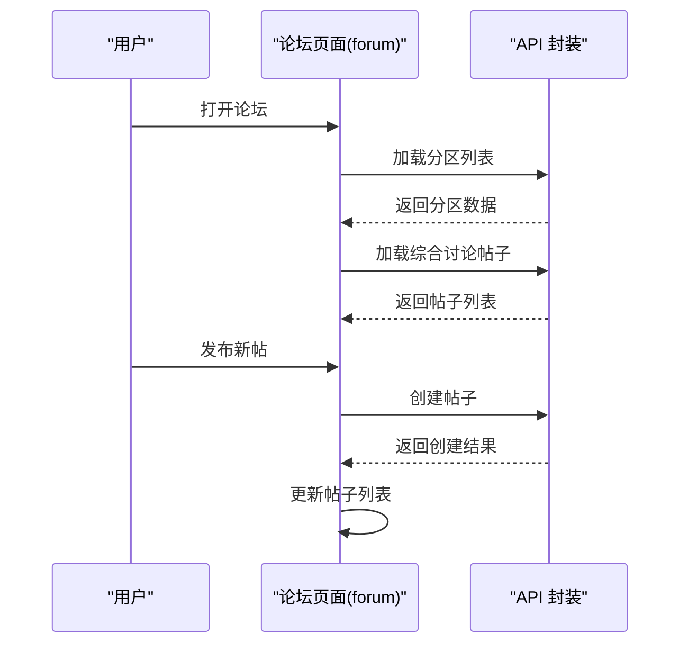

**图表来源**
- [miniprogram/pages/forum/forum.js:40-63](file://miniprogram/pages/forum/forum.js#L40-L63)
- [miniprogram/utils/api.js:212-223](file://miniprogram/utils/api.js#L212-L223)

**章节来源**
- [miniprogram/pages/forum/forum.js:1-137](file://miniprogram/pages/forum/forum.js#L1-L137)
- [miniprogram/pages/forum-create/forum-create.js:1-89](file://miniprogram/pages/forum-create/forum-create.js#L1-L89)
- [miniprogram/pages/forum-post/forum-post.js:1-160](file://miniprogram/pages/forum-post/forum-post.js#L1-L160)
- [miniprogram/pages/forum-section/forum-section.js:1-111](file://miniprogram/pages/forum-section/forum-section.js#L1-L111)
- [miniprogram/pages/forum-register/forum-register.js:1-55](file://miniprogram/pages/forum-register/forum-register.js#L1-L55)

### 资讯：分页、搜索与同步
- 功能要点
  - 支持分页加载、下拉刷新、搜索关键词与车队筛选。
  - 首屏加载时同步最新分析状态，静默失败不影响体验。
  - 提供路线图弹窗与反馈邮箱复制。
  - 新增精选内容展示，支持投稿入口。
- 关键流程
  - 首次加载时根据页码与筛选条件请求资讯列表。
  - 输入框输入时使用防抖，300ms 后触发搜索。
  - 底部触底加载更多，合并新旧数据。
  - 精选内容支持分页加载和图片懒加载。

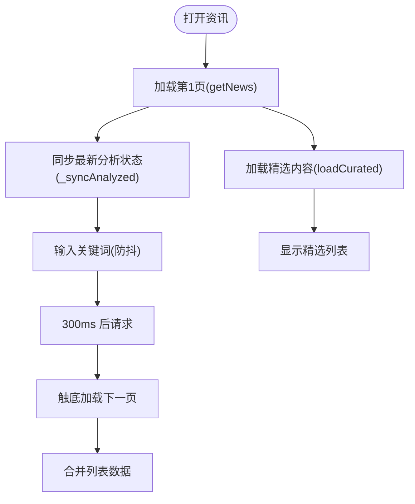

**图表来源**
- [miniprogram/pages/news/news.js:37-88](file://miniprogram/pages/news/news.js#L37-L88)
- [miniprogram/pages/news/news.js:209-241](file://miniprogram/pages/news/news.js#L209-L241)

**章节来源**
- [miniprogram/pages/news/news.js:1-263](file://miniprogram/pages/news/news.js#L1-L263)

### 资讯详情：AI分析与术语系统
- 功能要点
  - 支持AI分析触发和轮询，解析置信度标记。
  - 术语标签系统，支持点击查看详情。
  - 讨论区关联，支持快速发帖。
  - 车队标签跳转，支持车队资讯筛选。
- 关键流程
  - 页面加载时并行请求详情、帖子、术语、车队数据。
  - AI分析完成后解析置信度并更新界面。
  - 支持重新分析和引用内容发帖功能。
  - 术语卡片支持延迟加载完整定义。

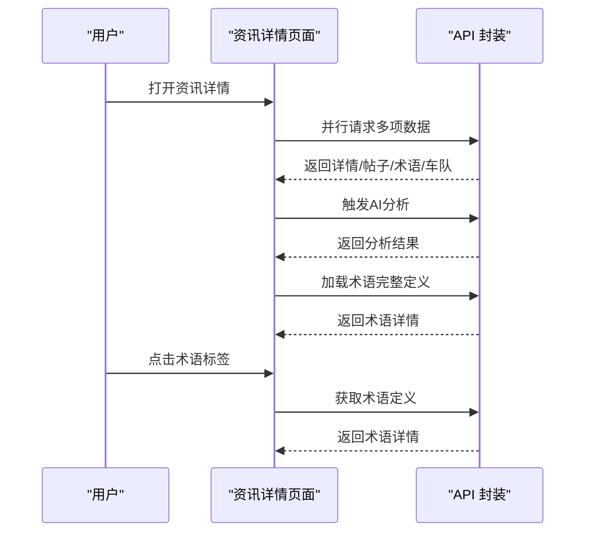

**图表来源**
- [miniprogram/pages/news-detail/news-detail.js:91-123](file://miniprogram/pages/news-detail/news-detail.js#L91-L123)
- [miniprogram/utils/api.js:252-253](file://miniprogram/utils/api.js#L252-L253)

**章节来源**
- [miniprogram/pages/news-detail/news-detail.js:1-372](file://miniprogram/pages/news-detail/news-detail.js#L1-L372)

### 车队资讯：专题页面
- 功能要点
  - 支持按车队筛选资讯，显示车队颜色标识。
  - 分页加载车队相关资讯。
  - 支持下拉刷新和触底加载。
- 关键流程
  - 页面加载时根据车队参数请求资讯。
  - 支持分页加载和刷新操作。
  - 点击资讯跳转到详情页面。

**章节来源**
- [miniprogram/pages/news-team/news-team.js:1-68](file://miniprogram/pages/news-team/news-team.js#L1-L68)

### ECharts 组件：跨版本兼容与手势
- 功能要点
  - 自动检测基础库版本，兼容新旧 Canvas 初始化路径。
  - 注册预处理器禁用渐进绘制，适配小程序 Canvas 限制。
  - 提供触摸事件映射，支持鼠标与手势交互。
  - 支持截图导出与懒加载初始化。
- 关键流程
  - 组件 ready 时注册预处理器与版本判断。
  - 根据版本选择新/旧初始化路径，获取 Canvas 节点与上下文。
  - 触摸事件映射到 ECharts ZRender 处理器。

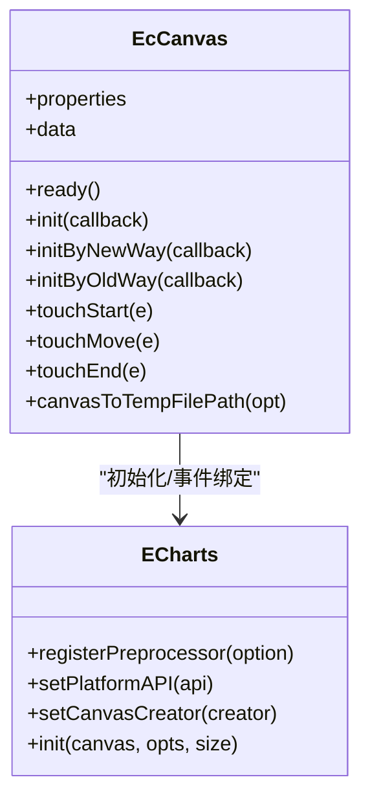

**图表来源**
- [miniprogram/components/ec-canvas/ec-canvas.js:31-292](file://miniprogram/components/ec-canvas/ec-canvas.js#L31-L292)

**章节来源**
- [miniprogram/components/ec-canvas/ec-canvas.js:1-292](file://miniprogram/components/ec-canvas/ec-canvas.js#L1-L292)

### 统一淡入过渡动画系统
- **新增功能**：所有核心页面实现统一的fadeIn动画机制
- 功能要点
  - 全局CSS动画定义，使用cubic-bezier缓动函数
  - 页面级容器元素应用动画效果
  - 支持骨架屏闪烁动画
  - 与小程序生命周期完美集成
- 关键实现
  - app.wxss中定义pageEnter关键帧动画
  - 各页面data中添加fadeIn状态
  - onShow生命周期中触发动画切换
  - wx.showTabBar({ animation: false })防止tabBar动画冲突

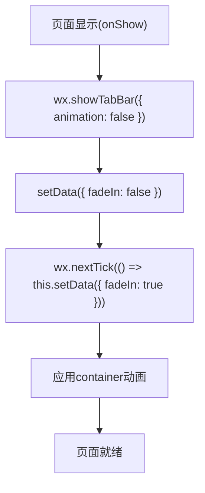

**图表来源**
- [miniprogram/pages/index/index.js:132-140](file://miniprogram/pages/index/index.js#L132-L140)
- [miniprogram/pages/standings/standings.js:75-85](file://miniprogram/pages/standings/standings.js#L75-L85)
- [miniprogram/pages/forum/forum.js:28-44](file://miniprogram/pages/forum/forum.js#L28-L44)

**章节来源**
- [miniprogram/app.wxss:8-28](file://miniprogram/app.wxss#L8-L28)
- [miniprogram/pages/index/index.js:116-140](file://miniprogram/pages/index/index.js#L116-L140)
- [miniprogram/pages/standings/standings.js:59-85](file://miniprogram/pages/standings/standings.js#L59-L85)
- [miniprogram/pages/forum/forum.js:8-44](file://miniprogram/pages/forum/forum.js#L8-L44)

### 图标生成工具：专业F1主题标签栏图标
- **新增功能**：generate_icons.py自动化生成F1主题图标
- 功能要点
  - 54x54px标准尺寸，2.5px描边宽度
  - F1品牌红(#e10600)与灰色(#999999)配色方案
  - 自动生成选中与非选中状态图标
  - 支持赛历、积分榜、词典、资讯、论坛五种类型
- 关键实现
  - 使用PIL库创建PNG图像
  - 支持圆形、矩形、弧形、线条等基本图形
  - 输出到miniprogram/assets/icons目录
  - 自动处理透明背景与抗锯齿

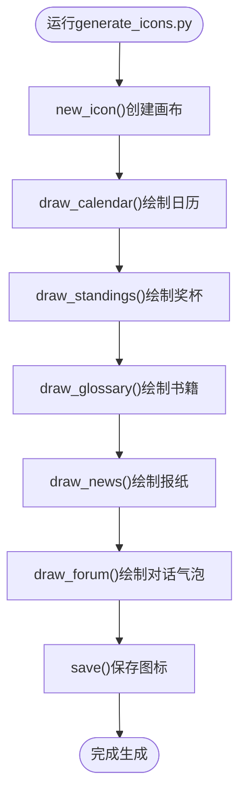

**图表来源**
- [generate_icons.py:161-177](file://generate_icons.py#L161-L177)

**章节来源**
- [generate_icons.py:1-177](file://generate_icons.py#L1-L177)

## 依赖关系分析
- 页面到 API：各页面均通过 utils/api.js 进行数据请求，统一处理缓存与错误。新增管理员、精选内容、车手中心、聊天室等专用接口。
- 页面到组件：积分榜、遥测、赛事详情等页面依赖 ec-canvas 组件进行图表渲染。
- 页面到工具：首页使用 utils/circuit_paths.js 提供的 SVG 路径绘制地图。
- 全局配置：app.js 提供 BASE_URL 与全局数据，app.json 定义页面与 tabBar。
- **新增**：图标生成工具依赖PIL库，生成的图标文件被app.json引用作为tabBar图标。

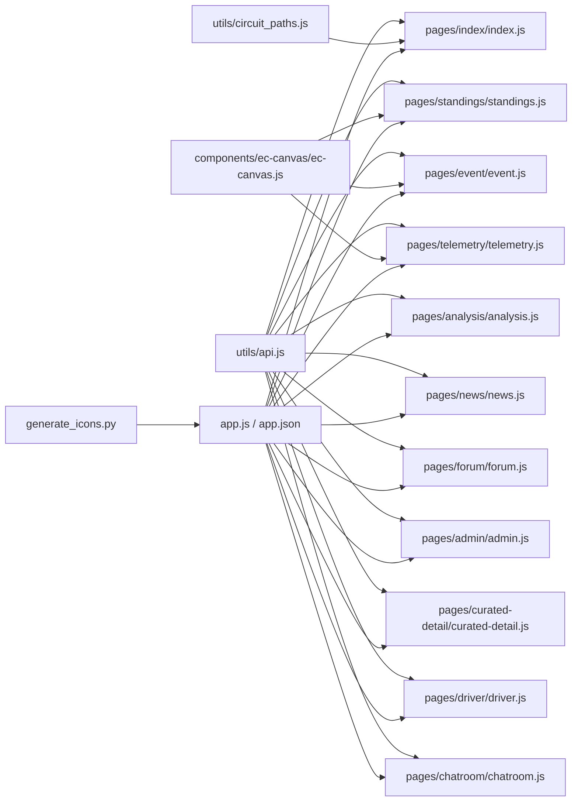

**图表来源**
- [miniprogram/utils/api.js:1-376](file://miniprogram/utils/api.js#L1-L376)
- [miniprogram/components/ec-canvas/ec-canvas.js:1-292](file://miniprogram/components/ec-canvas/ec-canvas.js#L1-L292)
- [miniprogram/utils/circuit_paths.js:1-119](file://miniprogram/utils/circuit_paths.js#L1-L119)
- [miniprogram/app.js:1-23](file://miniprogram/app.js#L1-L23)
- [miniprogram/app.json:1-75](file://miniprogram/app.json#L1-L75)
- [generate_icons.py:1-177](file://generate_icons.py#L1-L177)

**章节来源**
- [miniprogram/utils/api.js:1-376](file://miniprogram/utils/api.js#L1-L376)
- [miniprogram/components/ec-canvas/ec-canvas.js:1-292](file://miniprogram/components/ec-canvas/ec-canvas.js#L1-L292)
- [miniprogram/utils/circuit_paths.js:1-119](file://miniprogram/utils/circuit_paths.js#L1-L119)
- [miniprogram/app.js:1-23](file://miniprogram/app.js#L1-L23)
- [miniprogram/app.json:1-75](file://miniprogram/app.json#L1-L75)
- [generate_icons.py:1-177](file://generate_icons.py#L1-L177)

## 性能考虑
- 本地缓存：API 封装内置缓存策略，不同接口设置不同 TTL，命中缓存时后台静默刷新，显著降低网络请求与首屏延迟。新增内存缓存和目录缓存支持。
- 懒加载图表：积分榜与遥测页面通过 ec-canvas 的 lazyLoad 与手动初始化，避免 setData 时序导致的初始化失败与重绘。
- Canvas 绘制优化：首页地图绘制前进行点集缩放与偏移计算，仅在节点可用时执行绘制，减少无效操作。
- 防抖与分页：资讯页面对搜索输入进行防抖，分页加载避免一次性渲染过多数据。
- **新增**：统一淡入动画系统：使用cubic-bezier缓动函数，0.28秒时长，确保动画流畅且不阻塞页面渲染。
- **新增**：图标生成工具：通过Python脚本批量生成标准化图标，减少手动设计成本和一致性问题。
- 并行请求：论坛页面支持并行加载多个数据源，提升响应速度。
- 轮询优化：聊天室采用4秒轮询间隔，避免频繁请求影响性能。

## 故障排除指南
- 网络请求失败
  - 现象：页面显示"加载失败/请求失败"等提示。
  - 排查：检查 API 封装中的错误分支与重试逻辑，确认后端返回 status 是否为 ok。
  - 参考
    - [miniprogram/utils/api.js:53-84](file://miniprogram/utils/api.js#L53-L84)
- 缓存异常
  - 现象：数据长时间未更新或显示过期。
  - 排查：确认缓存 TTL 设置与 key 生成规则，必要时强制刷新。
  - 参考
    - [miniprogram/utils/api.js:106-153](file://miniprogram/utils/api.js#L106-L153)
- 图表初始化失败
  - 现象：图表空白或报错。
  - 排查：确认 ec-canvas 组件版本兼容性与懒加载初始化时机，确保 Canvas 节点已渲染。
  - 参考
    - [miniprogram/components/ec-canvas/ec-canvas.js:74-111](file://miniprogram/components/ec-canvas/ec-canvas.js#L74-L111)
- 页面跳转参数缺失
  - 现象：跳转后数据为空或报错。
  - 排查：核对页面间传参与解码逻辑，确保必填参数存在。
  - 参考
    - [miniprogram/pages/index/index.js:247-253](file://miniprogram/pages/index/index.js#L247-L253)
    - [miniprogram/pages/event/event.js:229-238](file://miniprogram/pages/event/event.js#L229-L238)
- 管理员权限问题
  - 现象：无法访问管理员功能。
  - 排查：确认管理员密码正确，检查 X-Admin-Token 头部设置。
  - 参考
    - [miniprogram/pages/admin/admin.js:24-38](file://miniprogram/pages/admin/admin.js#L24-L38)
    - [miniprogram/utils/api.js:96-97](file://miniprogram/utils/api.js#L96-L97)
- 精选内容分析失败
  - 现象：AI分析长时间未完成。
  - 排查：检查轮询逻辑，确认分析进度，必要时重新触发分析。
  - 参考
    - [miniprogram/pages/curated-detail/curated-detail.js:152-201](file://miniprogram/pages/curated-detail/curated-detail.js#L152-L201)
- **新增**：动画系统问题
  - 现象：页面切换无动画效果或动画异常。
  - 排查：检查app.wxss中的pageEnter动画定义，确认页面data中fadeIn状态设置，验证wx.showTabBar动画参数。
  - 参考
    - [miniprogram/app.wxss:8-28](file://miniprogram/app.wxss#L8-L28)
    - [miniprogram/pages/index/index.js:132-140](file://miniprogram/pages/index/index.js#L132-L140)
- **新增**：图标显示问题
  - 现象：tabBar图标不显示或显示异常。
  - 排查：确认generate_icons.py已正确生成图标文件，检查app.json中的iconPath配置，验证图标文件格式与尺寸。
  - 参考
    - [generate_icons.py:161-177](file://generate_icons.py#L161-L177)
    - [miniprogram/app.json:37-68](file://miniprogram/app.json#L37-L68)

**章节来源**
- [miniprogram/utils/api.js:53-84](file://miniprogram/utils/api.js#L53-L84)
- [miniprogram/utils/api.js:106-153](file://miniprogram/utils/api.js#L106-L153)
- [miniprogram/components/ec-canvas/ec-canvas.js:74-111](file://miniprogram/components/ec-canvas/ec-canvas.js#L74-L111)
- [miniprogram/pages/index/index.js:247-253](file://miniprogram/pages/index/index.js#L247-L253)
- [miniprogram/pages/event/event.js:229-238](file://miniprogram/pages/event/event.js#L229-L238)
- [miniprogram/pages/admin/admin.js:24-38](file://miniprogram/pages/admin/admin.js#L24-L38)
- [miniprogram/utils/api.js:96-97](file://miniprogram/utils/api.js#L96-L97)
- [miniprogram/pages/curated-detail/curated-detail.js:152-201](file://miniprogram/pages/curated-detail/curated-detail.js#L152-L201)
- [miniprogram/app.wxss:8-28](file://miniprogram/app.wxss#L8-L28)
- [miniprogram/pages/index/index.js:132-140](file://miniprogram/pages/index/index.js#L132-L140)
- [generate_icons.py:161-177](file://generate_icons.py#L161-L177)
- [miniprogram/app.json:37-68](file://miniprogram/app.json#L37-L68)

## 结论
本小程序前端经过完全重构后，形成了完整的 F1 数据生态平台，包含赛历、积分榜、赛事详情、遥测分析、资讯、论坛、管理员后台、精选内容、车手中心、聊天室等20+个页面。通过统一的 API 封装与合理的生命周期管理，实现了高性能、可维护的 F1 数据可视化体验。**新增的统一淡入过渡动画系统**提供了流畅一致的页面切换体验，**专业的图标生成工具**确保了UI设计的一致性和开发效率。新增的管理员功能、精选内容系统、车手个人中心等特性，大大增强了平台的实用性和社区互动性。后续可在主题扩展、图表交互增强与数据预取策略方面持续优化。

## 附录
- 页面与路由
  - 首页、积分榜、赛事详情、遥测、圈时分析、资讯、论坛、管理员后台、精选内容、车手中心、聊天室等20+页面均已注册在 app.json 中。
- 样式与主题
  - 全局暗色主题与通用卡片、按钮、工具类样式，配合页面级动画与骨架屏提升体验。
  - **新增**：统一淡入动画系统，所有页面共享相同的动画效果和时序。
- 数据流
  - 页面通过 API 模块发起请求，解析后更新页面数据，图表组件负责渲染与交互。
- 新增功能
  - 管理员后台：内容审核、爬虫调度、AI分析监控
  - 精选内容：投稿、审核、AI分析、讨论区关联
  - 车手中心：评分系统、评论系统、趋势分析
  - 匿名聊天室：实时消息轮询、用户管理
  - 完整论坛生态：分区管理、帖子评论、用户系统
  - **新增**：统一淡入动画系统：所有核心页面实现一致的页面切换动画
  - **新增**：图标生成工具：自动化生成专业的F1主题标签栏图标

**章节来源**
- [miniprogram/app.json:1-75](file://miniprogram/app.json#L1-L75)
- [miniprogram/app.wxss:1-118](file://miniprogram/app.wxss#L1-L118)
- [miniprogram/utils/api.js:156-373](file://miniprogram/utils/api.js#L156-L373)
- [generate_icons.py:1-177](file://generate_icons.py#L1-L177)