# 样式管理与主题

<cite>
**本文引用的文件**
- [miniprogram/app.wxss](file://miniprogram/app.wxss)
- [miniprogram/app.json](file://miniprogram/app.json)
- [miniprogram/pages/index/index.wxss](file://miniprogram/pages/index/index.wxss)
- [miniprogram/pages/index/index.js](file://miniprogram/pages/index/index.js)
- [miniprogram/pages/admin/admin.wxss](file://miniprogram/pages/admin/admin.wxss)
- [miniprogram/pages/analysis/analysis.wxss](file://miniprogram/pages/analysis/analysis.wxss)
- [miniprogram/pages/forum/forum.wxss](file://miniprogram/pages/forum/forum.wxss)
- [miniprogram/pages/forum/forum.js](file://miniprogram/pages/forum/forum.js)
- [miniprogram/pages/news/news.wxss](file://miniprogram/pages/news/news.wxss)
- [miniprogram/pages/news/news.js](file://miniprogram/pages/news/news.js)
- [miniprogram/pages/news-detail/news-detail.wxss](file://miniprogram/pages/news-detail/news-detail.wxss)
- [miniprogram/pages/forum-post/forum-post.wxss](file://miniprogram/pages/forum-post/forum-post.wxss)
- [miniprogram/pages/standings/standings.wxss](file://miniprogram/pages/standings/standings.wxss)
- [miniprogram/pages/standings/standings.js](file://miniprogram/pages/standings/standings.js)
- [miniprogram/pages/glossary/glossary.wxss](file://miniprogram/pages/glossary/glossary.wxss)
- [miniprogram/pages/glossary/glossary.js](file://miniprogram/pages/glossary/glossary.js)
- [miniprogram/components/ec-canvas/ec-canvas.wxss](file://miniprogram/components/ec-canvas/ec-canvas.wxss)
</cite>

## 更新摘要
**变更内容**
- 统一淡入过渡动画系统：所有五个标签页（首页、积分榜、词典、资讯、论坛）都实现了0.25秒ease过渡效果
- 骨架屏动画改进：统一的渐变闪光效果实现，提升加载态视觉体验
- 交互反馈机制增强：全面的 CSS 激活状态（:active）实现，提供更丰富的触控反馈
- 事件状态可视化改进：状态类样式优化，增强用户对界面状态的理解

## 目录
1. [引言](#引言)
2. [项目结构](#项目结构)
3. [核心组件](#核心组件)
4. [架构总览](#架构总览)
5. [详细组件分析](#详细组件分析)
6. [依赖分析](#依赖分析)
7. [性能考虑](#性能考虑)
8. [故障排查指南](#故障排查指南)
9. [结论](#结论)
10. [附录](#附录)

## 引言
本文件面向 Fast-F1 微信小程序的样式管理与主题系统，系统性阐述全局样式的设计原则与组织结构、页面级样式的作用域与隔离策略、主题系统（颜色、字体、尺寸）、响应式适配（屏幕与横竖屏）、动画与交互效果、性能优化与最佳实践，以及自定义主题开发与调试方法。目标是帮助开发者在不深入代码的前提下理解整体样式体系，并提供可操作的落地建议。

## 项目结构
小程序采用"全局样式 + 页面样式 + 组件样式"的分层组织方式：
- 全局样式：app.wxss 定义全局基础样式、通用工具类、动画与主题色，作为所有页面的样式基线。
- 页面样式：各页面独立 wxss 文件，按页面职责定义局部样式，遵循全局工具类与主题变量，避免样式冲突。
- 组件样式：如图表组件 ec-canvas 的样式，限定组件内部尺寸与布局，确保复用一致性。
- 配置文件：app.json 控制导航栏、tabBar、深浅色模式开关等全局外观与行为。

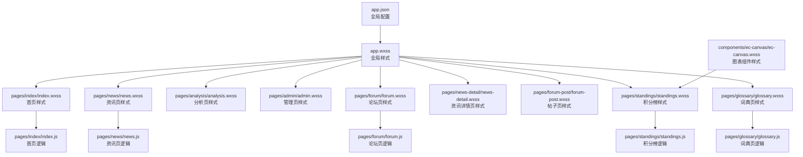

**图表来源**
- [miniprogram/app.json:1-75](file://miniprogram/app.json#L1-L75)
- [miniprogram/app.wxss:1-128](file://miniprogram/app.wxss#L1-L128)
- [miniprogram/pages/index/index.wxss:1-83](file://miniprogram/pages/index/index.wxss#L1-L83)
- [miniprogram/pages/news/news.wxss:1-944](file://miniprogram/pages/news/news.wxss#L1-L944)
- [miniprogram/pages/analysis/analysis.wxss:1-84](file://miniprogram/pages/analysis/analysis.wxss#L1-L84)
- [miniprogram/pages/admin/admin.wxss:1-218](file://miniprogram/pages/admin/admin.wxss#L1-L218)
- [miniprogram/pages/forum/forum.wxss:1-101](file://miniprogram/pages/forum/forum.wxss#L1-L101)
- [miniprogram/pages/news-detail/news-detail.wxss:1-627](file://miniprogram/pages/news-detail/news-detail.wxss#L1-L627)
- [miniprogram/pages/forum-post/forum-post.wxss:1-138](file://miniprogram/pages/forum-post/forum-post.wxss#L1-L138)
- [miniprogram/pages/standings/standings.wxss:1-152](file://miniprogram/pages/standings/standings.wxss#L1-L152)
- [miniprogram/pages/glossary/glossary.wxss:1-534](file://miniprogram/pages/glossary/glossary.wxss#L1-L534)
- [miniprogram/components/ec-canvas/ec-canvas.wxss:1-5](file://miniprogram/components/ec-canvas/ec-canvas.wxss#L1-L5)

**章节来源**
- [miniprogram/app.json:1-75](file://miniprogram/app.json#L1-L75)
- [miniprogram/app.wxss:1-128](file://miniprogram/app.wxss#L1-L128)

## 核心组件
- 全局样式与主题基线
  - 设计原则：统一暗色主题、明确主色（品牌红）、清晰的字体层级与尺寸体系、一致的间距与圆角规范；通过通用工具类提升复用性与开发效率。
  - 关键点：页面根元素、通用卡片、按钮、颜色与字体工具类、Flex 布局工具类、加载态与骨架屏、团队色块等。
- 页面级样式
  - 作用域：每个页面 wxss 仅影响对应页面结构，避免跨页污染；通过局部选择器与类名前缀降低耦合。
  - 隔离策略：使用页面容器类名限定作用域；优先复用全局工具类；必要时使用更具体的选择器或组合类名。
- 主题系统
  - 颜色变量：以品牌红为主色，辅以中性灰构建背景、边框、文字与状态色；通过工具类快速应用。
  - 字体规范：提供多级字号工具类，配合行高与字重，保证信息层级清晰。
  - 尺寸标准：广泛使用 rpx 单位，结合 Flex 布局与固定间距，确保在不同设备上保持相对一致的视觉比例。
- 动画与交互
  - 页面淡入过渡：统一的0.25秒ease过渡效果，通过fadeIn状态管理实现平滑的页面切换体验
  - 页面入场动画、按钮与卡片的按下反馈、骨架屏闪光、下拉刷新/加载更多等场景均有动画与过渡效果，增强交互体验。
- 响应式与适配
  - 屏幕适配：统一使用 rpx，结合 Flex 与百分比布局，满足不同宽度设备显示需求。
  - 横竖屏：页面样式未显式区分横竖屏，但整体布局基于 Flex 与相对单位，具备较好的自适应能力；如需精细适配，可在页面逻辑中检测方向并切换布局类名。
- 性能优化
  - 减少复杂选择器与深层嵌套，避免过度重绘与回流。
  - 合理使用动画属性（如 transform/opacity），减少对布局与绘制的影响。
  - 使用骨架屏与懒加载策略，改善首屏与滚动性能。
- 自定义主题与调试
  - 自定义主题：通过修改全局颜色变量与工具类，即可实现主题切换；建议集中维护变量并在全局样式中统一引用。
  - 调试方法：利用微信开发者工具的样式面板检查层级与覆盖关系；使用伪类 :active 验证交互反馈；通过骨架屏与占位符定位渲染问题。

**章节来源**
- [miniprogram/app.wxss:1-128](file://miniprogram/app.wxss#L1-L128)
- [miniprogram/app.json:22-66](file://miniprogram/app.json#L22-L66)

## 架构总览
全局样式作为"样式内核"，页面样式作为"功能扩展层"，组件样式作为"原子能力层"。页面样式通过类名与全局工具类协作，形成统一且可扩展的样式体系。

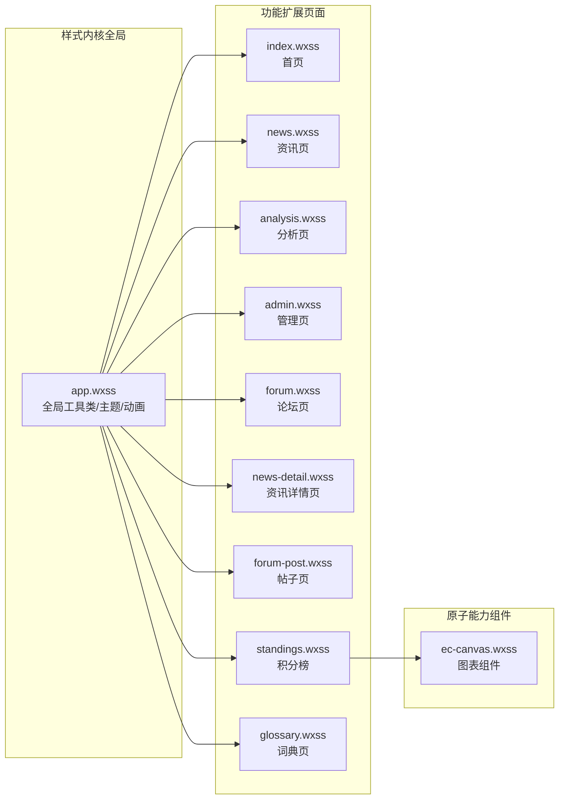

**图表来源**
- [miniprogram/app.wxss:1-128](file://miniprogram/app.wxss#L1-L128)
- [miniprogram/pages/index/index.wxss:1-83](file://miniprogram/pages/index/index.wxss#L1-L83)
- [miniprogram/pages/news/news.wxss:1-944](file://miniprogram/pages/news/news.wxss#L1-L944)
- [miniprogram/pages/analysis/analysis.wxss:1-84](file://miniprogram/pages/analysis/analysis.wxss#L1-L84)
- [miniprogram/pages/admin/admin.wxss:1-218](file://miniprogram/pages/admin/admin.wxss#L1-L218)
- [miniprogram/pages/forum/forum.wxss:1-101](file://miniprogram/pages/forum/forum.wxss#L1-L101)
- [miniprogram/pages/news-detail/news-detail.wxss:1-627](file://miniprogram/pages/news-detail/news-detail.wxss#L1-L627)
- [miniprogram/pages/forum-post/forum-post.wxss:1-138](file://miniprogram/pages/forum-post/forum-post.wxss#L1-L138)
- [miniprogram/pages/standings/standings.wxss:1-152](file://miniprogram/pages/standings/standings.wxss#L1-L152)
- [miniprogram/pages/glossary/glossary.wxss:1-534](file://miniprogram/pages/glossary/glossary.wxss#L1-L534)
- [miniprogram/components/ec-canvas/ec-canvas.wxss:1-5](file://miniprogram/components/ec-canvas/ec-canvas.wxss#L1-L5)

## 详细组件分析

### 全局样式与主题系统（app.wxss）
- 设计原则
  - 暗色主题：页面背景与导航栏背景采用深色，强调科技感与夜间友好。
  - 主色统一：品牌红用于强调、按钮与选中态，确保品牌识别度。
  - 工具类优先：提供颜色、字号、Flex 布局、加载态等通用类，减少重复定义。
- 关键模块
  - 页面入场动画：统一的页面进入动效，提升转场体验。
  - 骨架屏：通过渐变与动画模拟加载过程，改善感知性能。
  - 通用卡片与按钮：提供点击反馈与过渡，增强交互真实感。
  - 工具类：颜色、字号、Flex 布局、分割线、团队色块等，便于快速搭建页面。
- 主题变量与规范
  - 颜色：背景、卡片、边框、文字、主色等，均以十六进制值定义，便于替换与扩展。
  - 字号：提供多级字号工具类，配合行高与字重，保证信息层级。
  - 尺寸：统一使用 rpx，结合圆角、间距与阴影，形成一致的视觉节奏。

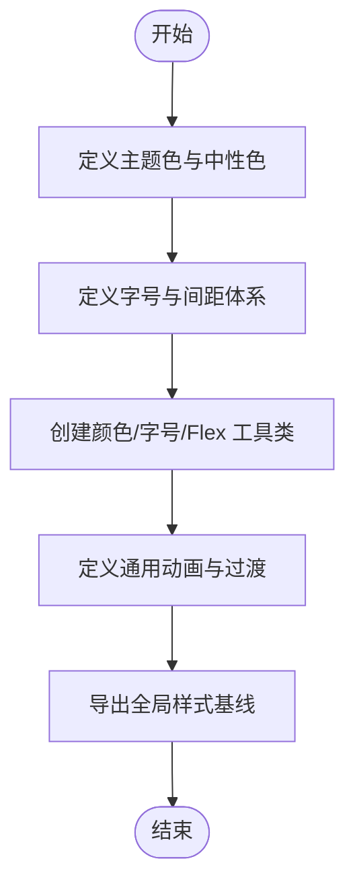

**章节来源**
- [miniprogram/app.wxss:1-128](file://miniprogram/app.wxss#L1-L128)

### 统一淡入过渡动画系统
**更新** 所有五个标签页（首页、积分榜、词典、资讯、论坛）都实现了统一的0.25秒ease过渡效果，通过fadeIn状态管理和CSS transition实现平滑的页面切换体验。

- 动画实现原理
  - 使用CSS transition属性实现0.25秒的ease缓动过渡
  - 通过JavaScript控制fadeIn状态，在页面显示时动态添加fade-in类
  - 所有标签页采用相同的动画时序和缓动函数，确保用户体验一致性
- 状态管理机制
  - 页面逻辑中维护fadeIn状态，默认为true
  - 在onShow生命周期中，先将fadeIn设为false，再使用wx.nextTick设为true
  - 通过nextTick确保DOM更新顺序，避免动画闪烁
- 动画触发时机
  - 页面首次显示时：fadeIn默认为true，无需额外处理
  - 页面切换返回时：通过状态切换触发动画
  - 避免tabBar动画干扰：在页面逻辑中调用wx.showTabBar({ animation: false })

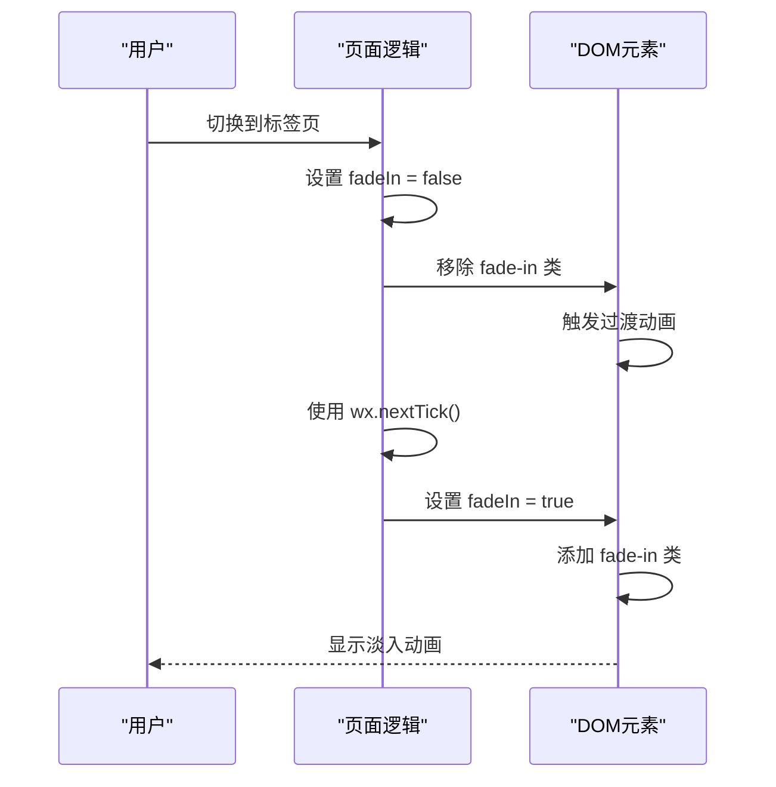

**图表来源**
- [miniprogram/pages/index/index.js:132-138](file://miniprogram/pages/index/index.js#L132-L138)
- [miniprogram/pages/standings/standings.js:75-81](file://miniprogram/pages/standings/standings.js#L75-L81)
- [miniprogram/pages/glossary/glossary.js:66-72](file://miniprogram/pages/glossary/glossary.js#L66-L72)
- [miniprogram/pages/news/news.js:50-56](file://miniprogram/pages/news/news.js#L50-L56)
- [miniprogram/pages/forum/forum.js:28-35](file://miniprogram/pages/forum/forum.js#L28-L35)

**章节来源**
- [miniprogram/pages/index/index.wxss:1-12](file://miniprogram/pages/index/index.wxss#L1-L12)
- [miniprogram/pages/standings/standings.wxss:1-8](file://miniprogram/pages/standings/standings.wxss#L1-L8)
- [miniprogram/pages/glossary/glossary.wxss:3-14](file://miniprogram/pages/glossary/glossary.wxss#L3-L14)
- [miniprogram/pages/news/news.wxss:1-12](file://miniprogram/pages/news/news.wxss#L1-L12)
- [miniprogram/pages/forum/forum.wxss:1-4](file://miniprogram/pages/forum/forum.wxss#L1-L4)

### 骨架屏动画改进（渐变闪光效果）
**更新** 骨架屏动画已进行全面改进，采用统一的渐变闪光效果实现，显著提升加载态的视觉体验。

- 渐变闪光动画实现
  - 使用 `@keyframes shimmer` 定义闪光动画，通过 `background-position` 实现从右到左的渐变移动效果
  - 支持多种尺寸的骨架屏元素，包括线条、卡片、表格行等
  - 动画时长统一为 1.4 秒，使用 ease 缓动函数，确保流畅的视觉效果
- 统一的骨架屏样式
  - `.sk-line`：通用线条骨架屏，支持短、中、长三种宽度
  - `.sk-event-item`：赛事列表骨架屏
  - `.sk-row`：积分榜表格骨架屏
  - `.sk-card`：通用卡片骨架屏
- 颜色与渐变优化
  - 使用 `linear-gradient(90deg, #2a2a2a 25%, #333 50%, #2a2a2a 75%)` 实现平滑的渐变效果
  - 背景大小设置为 `400% 100%`，确保渐变在动画过程中完整显示
  - 支持不同页面的骨架屏颜色差异化（如新闻详情页使用 `#252525`）

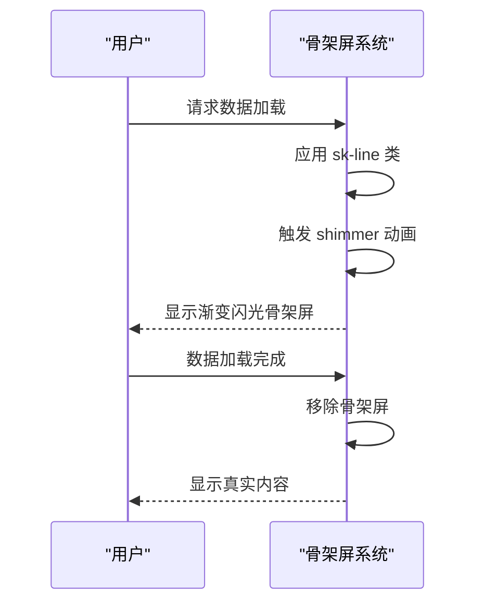

**图表来源**
- [miniprogram/app.wxss:18-28](file://miniprogram/app.wxss#L18-L28)
- [miniprogram/pages/index/index.wxss:340-381](file://miniprogram/pages/index/index.wxss#L340-L381)
- [miniprogram/pages/standings/standings.wxss:86-142](file://miniprogram/pages/standings/standings.wxss#L86-L142)
- [miniprogram/pages/news/news.wxss:138-162](file://miniprogram/pages/news/news.wxss#L138-L162)

**章节来源**
- [miniprogram/app.wxss:18-28](file://miniprogram/app.wxss#L18-L28)
- [miniprogram/pages/index/index.wxss:340-381](file://miniprogram/pages/index/index.wxss#L340-L381)
- [miniprogram/pages/standings/standings.wxss:86-142](file://miniprogram/pages/standings/standings.wxss#L86-L142)
- [miniprogram/pages/news/news.wxss:138-162](file://miniprogram/pages/news/news.wxss#L138-L162)

### 交互反馈机制增强（CSS激活状态）
**更新** 所有可交互元素均已实现完整的 CSS 激活状态（:active），提供丰富的触控反馈体验。

- 按钮激活状态
  - 主要按钮：`.btn-primary` 和 `.btn-secondary` 均实现激活状态
  - 激活时的视觉变化：缩放（scale 0.972-0.982）、透明度降低（opacity 0.94）、阴影变化
  - 特殊按钮：如 AI 触发按钮、发送按钮等均有独特的激活反馈
- 卡片激活状态
  - 通用卡片：`.card` 实现缩放与透明度变化
  - 新闻卡片：`.news-card`、`.post-card`、`.curated-card-h` 等均实现激活反馈
  - 积分榜行：`.standings-row` 实现半透明效果
- 导航与标签
  - Tab 栏：`.tab`、`.tab-active` 实现激活状态
  - 语言筛选：`.lang-tab`、`.lang-tab-active` 实现激活反馈
- 专用激活效果
  - 路线图按钮：`.roadmap-btn` 实现发光与缩放双重效果
  - 回退按钮：`.back-btn` 实现透明度变化
  - 操作按钮：点赞按钮、删除按钮等实现独特的激活反馈

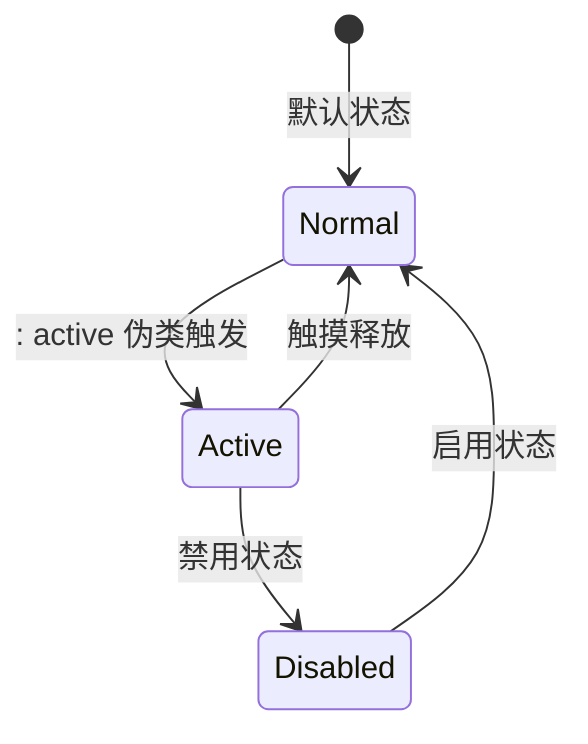

**图表来源**
- [miniprogram/app.wxss:43-84](file://miniprogram/app.wxss#L43-L84)
- [miniprogram/pages/index/index.wxss:129-132](file://miniprogram/pages/index/index.wxss#L129-L132)
- [miniprogram/pages/news/news.wxss:338-342](file://miniprogram/pages/news/news.wxss#L338-L342)
- [miniprogram/pages/forum/forum.wxss:59-62](file://miniprogram/pages/forum/forum.wxss#L59-L62)

**章节来源**
- [miniprogram/app.wxss:43-84](file://miniprogram/app.wxss#L43-L84)
- [miniprogram/pages/index/index.wxss:129-132](file://miniprogram/pages/index/index.wxss#L129-L132)
- [miniprogram/pages/news/news.wxss:338-342](file://miniprogram/pages/news/news.wxss#L338-L342)
- [miniprogram/pages/forum/forum.wxss:59-62](file://miniprogram/pages/forum/forum.wxss#L59-L62)

### 事件状态可视化改进
**更新** 事件状态的可视化已得到显著改进，通过状态类样式增强用户对界面状态的理解。

- 状态类样式优化
  - 完整的状态容器：`.state-wrap`、`.state-center` 提供统一的状态显示框架
  - 错误状态：`.error-text` 实现醒目的错误提示
  - 空状态：`.empty-search`、`.empty-comment` 等提供友好的空状态提示
- 事件状态分类
  - 已完成事件：`.event-completed` 实现半透明与灰色文字效果
  - 下一个事件：`.event-next` 实现高亮显示与徽章效果
  - 活跃状态：通过 `:active` 状态实现即时反馈
- 状态指示器
  - 完成状态：`.done-label`、`.done-dot` 实现绿色标识
  - 计划状态：`.plan-label`、`.plan-dot` 实现橙色标识
  - AI 状态：`.ai-label`、`.ai-dot` 实现紫色标识
- 交互状态反馈
  - 按钮状态：`.retry-btn`、`.reanalyze-btn` 等实现禁用与启用状态
  - 操作状态：`.action-row` 中的按钮实现不同的激活效果

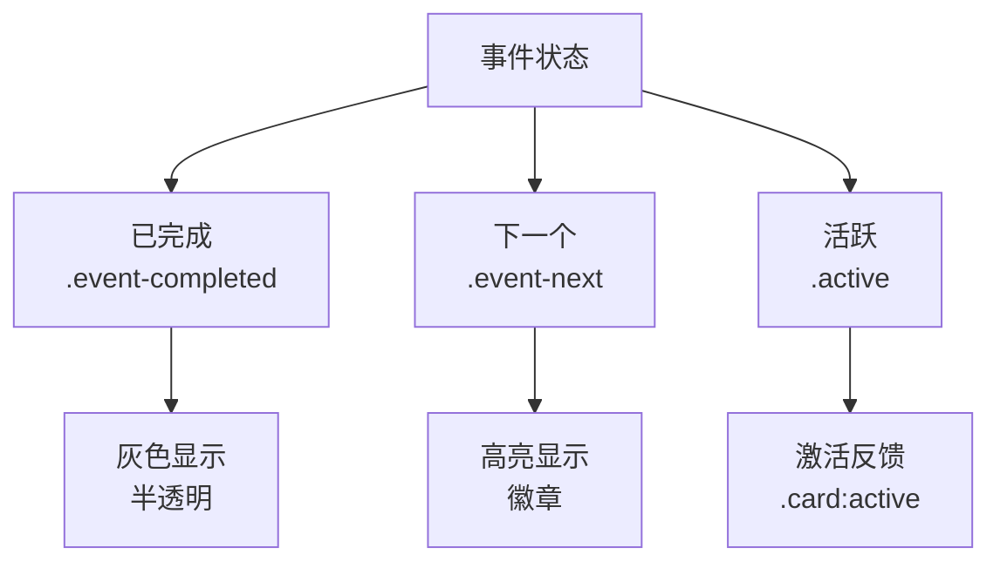

**图表来源**
- [miniprogram/pages/index/index.wxss:210-244](file://miniprogram/pages/index/index.wxss#L210-L244)
- [miniprogram/pages/news-detail/news-detail.wxss:168-177](file://miniprogram/pages/news-detail/news-detail.wxss#L168-L177)
- [miniprogram/pages/forum-post/forum-post.wxss:69-78](file://miniprogram/pages/forum-post/forum-post.wxss#L69-L78)

**章节来源**
- [miniprogram/pages/index/index.wxss:210-244](file://miniprogram/pages/index/index.wxss#L210-L244)
- [miniprogram/pages/news-detail/news-detail.wxss:168-177](file://miniprogram/pages/news-detail/news-detail.wxss#L168-L177)
- [miniprogram/pages/forum-post/forum-post.wxss:69-78](file://miniprogram/pages/forum-post/forum-post.wxss#L69-L78)

### 页面级样式管理（页面级隔离与作用域）
- 隔离策略
  - 每个页面的 wxss 仅作用于该页面结构，避免跨页污染。
  - 通过页面容器类名限定作用域，优先使用局部类名与全局工具类组合。
- 作用域控制
  - 使用更具体的选择器或组合类名，避免全局工具类的无意覆盖。
  - 对于需要跨组件共享的样式，建议抽象到全局工具类或页面公共类。
- 示例要点
  - 首页：倒计时卡片、事件列表、热门推荐等模块化样式，均在页面 wxss 内定义。
  - 资讯页：搜索栏、新闻卡片、骨架屏、底部弹窗等，均在页面 wxss 内定义。
  - 管理页：锁屏、Tab 栏、审核卡片、进度条等，均在页面 wxss 内定义。

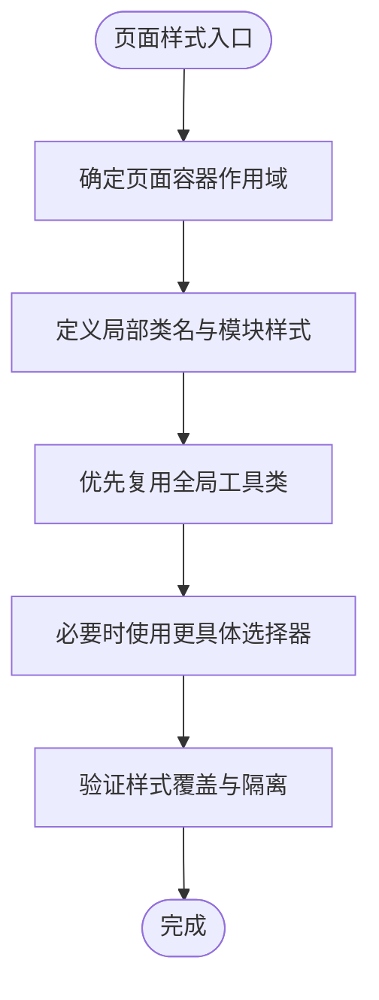

**章节来源**
- [miniprogram/pages/index/index.wxss:1-382](file://miniprogram/pages/index/index.wxss#L1-L382)
- [miniprogram/pages/news/news.wxss:1-944](file://miniprogram/pages/news/news.wxss#L1-L944)
- [miniprogram/pages/admin/admin.wxss:1-218](file://miniprogram/pages/admin/admin.wxss#L1-L218)

### 主题系统实现（颜色、字体、尺寸）
- 颜色变量
  - 主色：品牌红，用于按钮、选中态、强调信息。
  - 中性色：背景、卡片、边框、文字等，形成稳定的视觉层次。
  - 状态色：成功、警告、错误等，通过工具类快速应用。
- 字体规范
  - 多级字号工具类，配合行高与字重，保证信息层级清晰。
  - 数字类文本使用等宽数字，提升可读性。
- 尺寸标准
  - 圆角、间距、阴影等尺寸统一，确保视觉节奏一致。
  - 使用 rpx 适配不同屏幕密度。

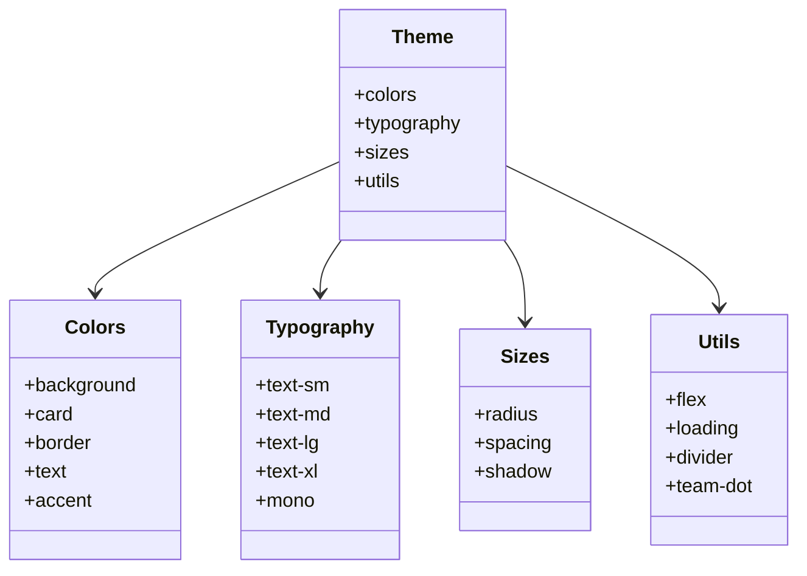

**图表来源**
- [miniprogram/app.wxss:86-128](file://miniprogram/app.wxss#L86-L128)

**章节来源**
- [miniprogram/app.wxss:86-128](file://miniprogram/app.wxss#L86-L128)

### 响应式设计与适配策略
- 屏幕适配
  - 统一使用 rpx，结合 Flex 布局与百分比，保证在不同宽度设备上的相对一致性。
  - 列表与卡片采用统一的内边距与外边距，确保在小屏与大屏上都有良好的阅读体验。
- 横竖屏切换
  - 页面样式未显式区分横竖屏，但整体布局基于 Flex 与相对单位，具备较好的自适应能力。
  - 如需精细适配，可在页面逻辑中检测方向并切换布局类名或调整容器尺寸。

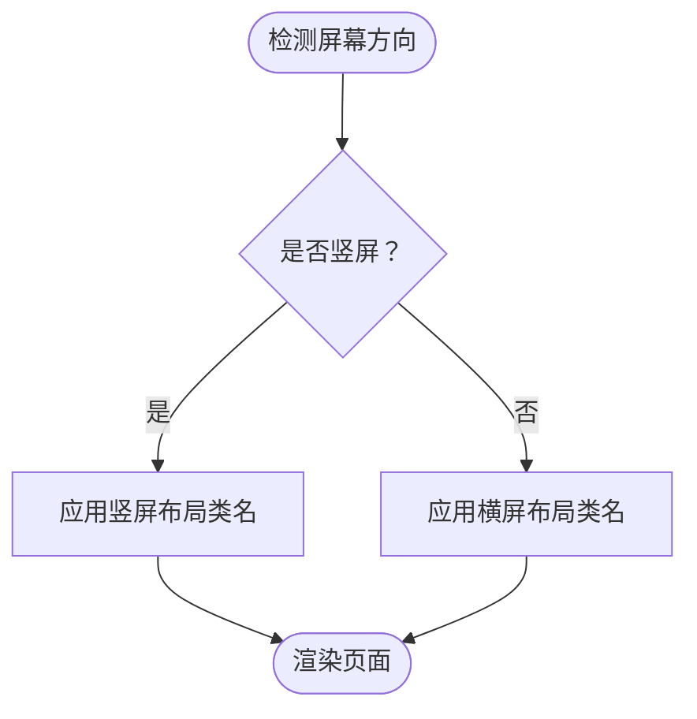

**章节来源**
- [miniprogram/pages/news/news.wxss:86-89](file://miniprogram/pages/news/news.wxss#L86-L89)
- [miniprogram/pages/news-detail/news-detail.wxss:8-10](file://miniprogram/pages/news-detail/news-detail.wxss#L8-L10)

### 动画与交互动画
- 页面淡入过渡：统一的0.25秒ease过渡效果，通过fadeIn状态管理实现平滑的页面切换体验
- 页面入场动画：统一的页面进入动效，提升转场体验。
- 按钮与卡片反馈：通过 :active 伪类实现按下缩放与透明度变化，增强触控反馈。
- 骨架屏：通过渐变与动画模拟加载过程，改善感知性能。
- 其他动画：如资讯页的引导按钮发光与图标弹跳、底部弹窗的滑入动画等，丰富交互细节。

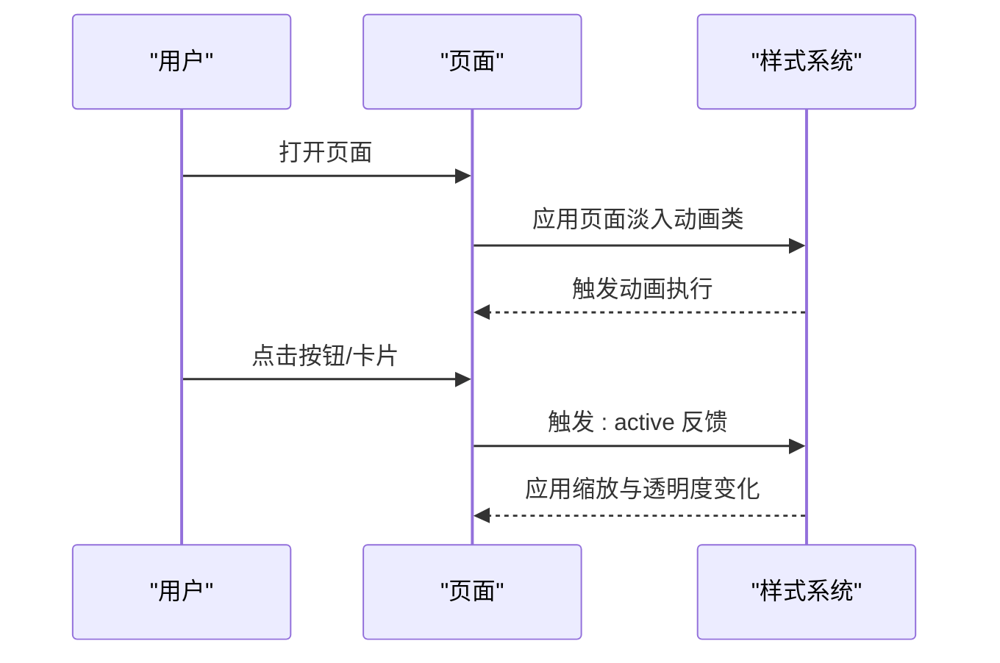

**图表来源**
- [miniprogram/app.wxss:8-28](file://miniprogram/app.wxss#L8-L28)
- [miniprogram/pages/index/index.wxss:93-96](file://miniprogram/pages/index/index.wxss#L93-L96)
- [miniprogram/pages/news/news.wxss:51-69](file://miniprogram/pages/news/news.wxss#L51-L69)

**章节来源**
- [miniprogram/app.wxss:8-28](file://miniprogram/app.wxss#L8-L28)
- [miniprogram/pages/index/index.wxss:93-96](file://miniprogram/pages/index/index.wxss#L93-L96)
- [miniprogram/pages/news/news.wxss:51-69](file://miniprogram/pages/news/news.wxss#L51-L69)

### 组件样式与图表集成
- 图表组件样式：ec-canvas 组件通过简单尺寸类确保图表区域占满容器，避免外部样式干扰。
- 页面与组件协作：积分榜页面通过 ec-canvas 组件展示趋势图，样式上保持统一的背景与边框风格。

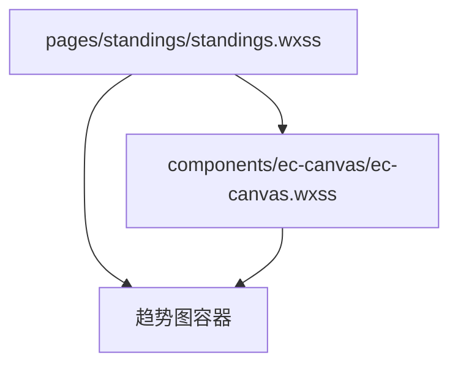

**图表来源**
- [miniprogram/pages/standings/standings.wxss:27-38](file://miniprogram/pages/standings/standings.wxss#L27-L38)
- [miniprogram/components/ec-canvas/ec-canvas.wxss:1-5](file://miniprogram/components/ec-canvas/ec-canvas.wxss#L1-L5)

**章节来源**
- [miniprogram/pages/standings/standings.wxss:27-38](file://miniprogram/pages/standings/standings.wxss#L27-L38)
- [miniprogram/components/ec-canvas/ec-canvas.wxss:1-5](file://miniprogram/components/ec-canvas/ec-canvas.wxss#L1-L5)

## 依赖分析
- 全局依赖：所有页面样式均依赖 app.wxss 提供的工具类与主题基线。
- 页面依赖：页面样式之间相互独立，不直接互相依赖。
- 组件依赖：页面样式可能依赖组件样式（如图表组件），但组件样式不反向依赖页面。

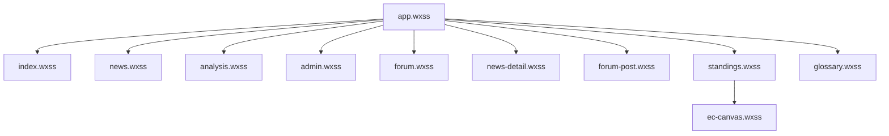

**图表来源**
- [miniprogram/app.wxss:1-128](file://miniprogram/app.wxss#L1-L128)
- [miniprogram/pages/index/index.wxss:1-382](file://miniprogram/pages/index/index.wxss#L1-L382)
- [miniprogram/pages/news/news.wxss:1-944](file://miniprogram/pages/news/news.wxss#L1-L944)
- [miniprogram/pages/analysis/analysis.wxss:1-84](file://miniprogram/pages/analysis/analysis.wxss#L1-L84)
- [miniprogram/pages/admin/admin.wxss:1-218](file://miniprogram/pages/admin/admin.wxss#L1-L218)
- [miniprogram/pages/forum/forum.wxss:1-99](file://miniprogram/pages/forum/forum.wxss#L1-L99)
- [miniprogram/pages/news-detail/news-detail.wxss:1-627](file://miniprogram/pages/news-detail/news-detail.wxss#L1-L627)
- [miniprogram/pages/forum-post/forum-post.wxss:1-138](file://miniprogram/pages/forum-post/forum-post.wxss#L1-L138)
- [miniprogram/pages/standings/standings.wxss:1-143](file://miniprogram/pages/standings/standings.wxss#L1-L143)
- [miniprogram/pages/glossary/glossary.wxss:1-534](file://miniprogram/pages/glossary/glossary.wxss#L1-L534)
- [miniprogram/components/ec-canvas/ec-canvas.wxss:1-5](file://miniprogram/components/ec-canvas/ec-canvas.wxss#L1-L5)

**章节来源**
- [miniprogram/app.wxss:1-128](file://miniprogram/app.wxss#L1-L128)
- [miniprogram/pages/standings/standings.wxss:27-38](file://miniprogram/pages/standings/standings.wxss#L27-L38)

## 性能考虑
- 选择器优化：避免深层嵌套与复杂选择器，减少匹配成本。
- 动画优化：优先使用 transform 与 opacity，避免频繁触发布局与绘制。
- 骨架屏与懒加载：在长列表与异步数据场景中使用骨架屏与懒加载，提升感知性能。
- rpx 适配：统一使用 rpx，减少像素计算与重排。
- 工具类复用：通过全局工具类减少重复定义，降低样式体积与维护成本。
- 激活状态优化：合理使用 :active 伪类，避免过度复杂的激活效果影响性能。
- 过渡动画优化：统一的0.25秒过渡时长确保动画性能与用户体验的平衡。

## 故障排查指南
- 样式覆盖问题
  - 现象：局部样式被全局工具类覆盖。
  - 排查：检查选择器优先级与类名顺序；必要时使用更具体的选择器或组合类名。
- 动画异常
  - 现象：动画卡顿或不生效。
  - 排查：确认动画属性是否为可合成属性；检查关键帧定义与播放时长；在 :active 中验证反馈。
- 交互反馈缺失
  - 现象：按钮或卡片无按下反馈。
  - 排查：确认 :active 类是否正确应用；检查 transition 设置与触摸事件绑定。
- 骨架屏闪烁
  - 现象：骨架屏与真实内容切换时出现闪烁。
  - 排查：确认骨架屏动画与真实数据加载时机；检查背景色与渐变位置设置。
- 激活状态不一致
  - 现象：不同页面的激活效果不一致。
  - 排查：检查是否正确实现了 :active 伪类；确认激活状态的颜色、缩放、透明度参数是否统一。
- 过渡动画问题
  - 现象：页面切换时没有淡入效果或动画闪烁。
  - 排查：确认fadeIn状态管理逻辑；检查CSS transition属性；验证wx.nextTick的使用时机。
- 调试方法
  - 使用微信开发者工具的"调试样式"面板，查看层级与覆盖关系。
  - 在页面中临时添加占位类名，定位渲染问题。
  - 通过伪类 :active 快速验证交互反馈。
  - 检查页面逻辑中的fadeIn状态切换时机。

**章节来源**
- [miniprogram/app.wxss:38-42](file://miniprogram/app.wxss#L38-L42)
- [miniprogram/pages/index/index.wxss:93-96](file://miniprogram/pages/index/index.wxss#L93-L96)
- [miniprogram/pages/news/news.wxss:114-138](file://miniprogram/pages/news/news.wxss#L114-L138)

## 结论
Fast-F1 微信小程序的样式体系以全局样式为核心，通过工具类与主题变量实现统一的视觉语言；页面级样式负责功能扩展，遵循作用域与隔离策略；组件样式专注于原子能力，确保复用与一致性。整体采用 rpx 与 Flex 布局实现良好适配，配合动画与骨架屏提升交互与感知性能。

**最新改进总结**：
- 统一淡入过渡动画系统已全面部署：所有五个标签页都实现了0.25秒ease过渡效果，通过fadeIn状态管理和CSS transition实现平滑的页面切换体验
- 骨架屏动画已全面升级为统一的渐变闪光效果，显著提升加载态的视觉体验
- 所有可交互元素均实现完整的 CSS 激活状态，提供丰富的触控反馈
- 事件状态可视化得到显著改进，通过状态类样式增强用户对界面状态的理解

建议在后续迭代中进一步标准化主题变量与命名规范，完善横竖屏适配策略，并持续优化动画与交互细节。

## 附录
- 自定义主题开发指南
  - 步骤：在全局样式中集中维护颜色、字号、尺寸等变量；通过工具类快速应用；在页面中按需覆盖局部样式。
  - 注意：避免在页面中硬编码颜色值，统一通过工具类或变量引用。
- 最佳实践清单
  - 使用 rpx 进行尺寸定义。
  - 优先复用全局工具类。
  - 控制选择器复杂度，避免深层嵌套。
  - 使用 transform/opacity 实现动画。
  - 在长列表与异步场景中使用骨架屏与懒加载。
  - 通过 :active 验证交互反馈。
  - 使用微信开发者工具进行样式调试与覆盖检查。
  - 统一管理fadeIn状态，确保页面切换动画的一致性。
- 骨架屏使用指南
  - 选择合适的骨架屏类型：线条、卡片、表格行等
  - 确保动画时长与页面加载时间匹配
  - 使用统一的颜色方案保持视觉一致性
- 激活状态设计指南
  - 保持激活效果的一致性：相同的缩放、透明度、阴影变化
  - 考虑不同设备的触摸反馈差异
  - 避免过度复杂的激活效果影响性能
- 过渡动画设计指南
  - 统一过渡时长与缓动函数，确保用户体验一致性
  - 使用fadeIn状态管理实现平滑的页面切换
  - 避免tabBar动画干扰，确保页面切换流畅性