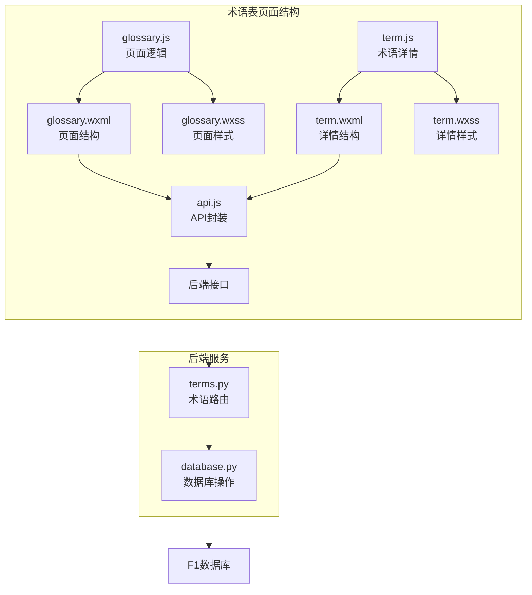
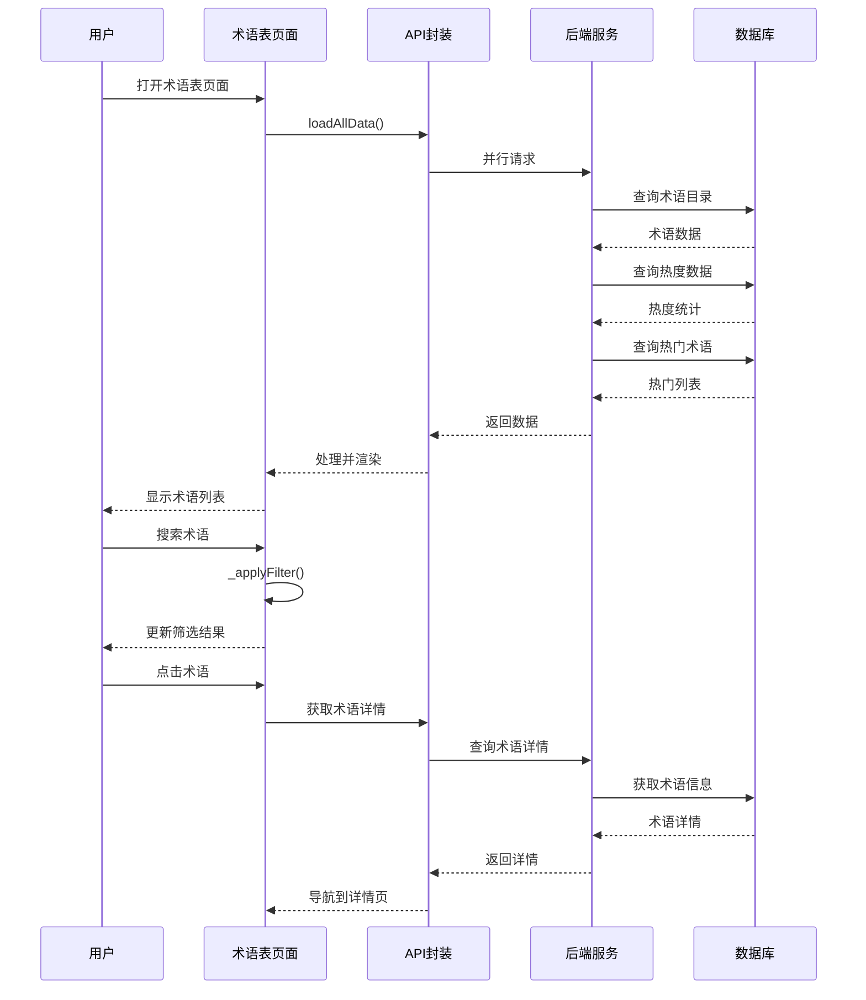
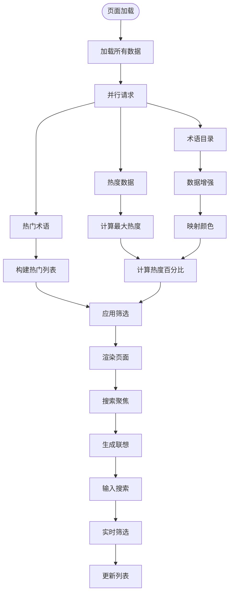
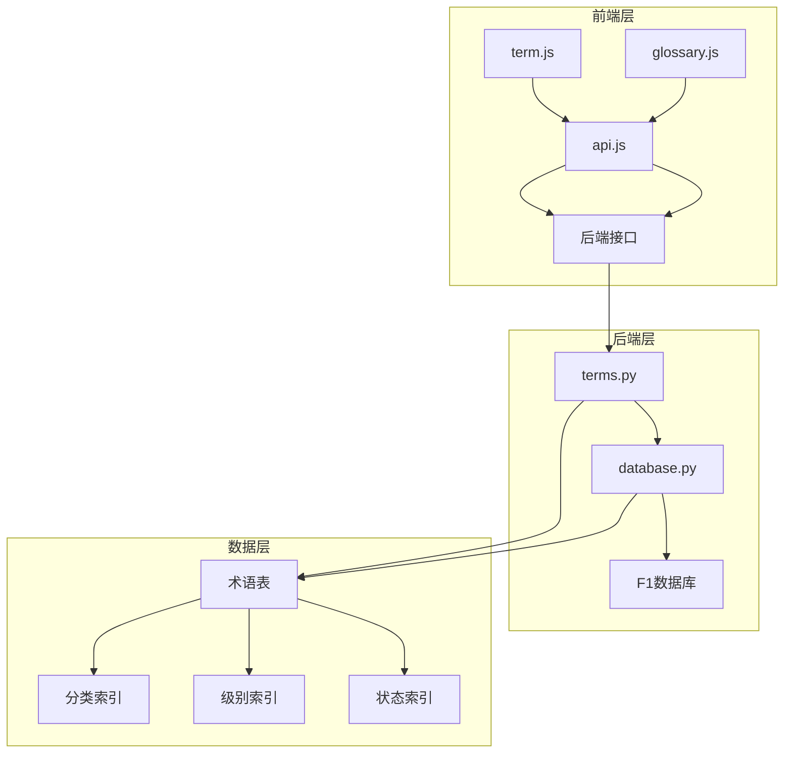

# 术语表页面

<cite>
**本文档引用的文件**
- [glossary.js](file://miniprogram/pages/glossary/glossary.js)
- [glossary.json](file://miniprogram/pages/glossary/glossary.json)
- [glossary.wxml](file://miniprogram/pages/glossary/glossary.wxml)
- [glossary.wxss](file://miniprogram/pages/glossary/glossary.wxss)
- [api.js](file://miniprogram/utils/api.js)
- [terms.py](file://backend/routers/terms.py)
- [database.py](file://backend/db/database.py)
- [term.js](file://miniprogram/pages/term/term.js)
- [term.wxml](file://miniprogram/pages/term/term.wxml)
- [term.wxss](file://miniprogram/pages/term/term.wxss)
</cite>

## 目录
1. [简介](#简介)
2. [项目结构](#项目结构)
3. [核心组件](#核心组件)
4. [架构概览](#架构概览)
5. [详细组件分析](#详细组件分析)
6. [依赖关系分析](#依赖关系分析)
7. [性能考虑](#性能考虑)
8. [故障排除指南](#故障排除指南)
9. [结论](#结论)

## 简介

术语表页面是 Fast-F1 项目中的一个核心功能模块，为用户提供了一个完整的 F1 赛车术语学习和查询系统。该页面提供了术语的分类浏览、搜索功能、热度展示、用户交互以及术语详情查看等功能。

Fast-F1 是一个基于微信小程序的 F1 赛车数据分析平台，术语表页面作为其知识体系的重要组成部分，帮助用户理解和掌握 F1 赛车运动中的专业术语和概念。

## 项目结构

术语表页面采用典型的微信小程序页面结构，包含以下核心文件：

**图表来源**
- [glossary.js:1-325](file://miniprogram/pages/glossary/glossary.js#L1-L325)
- [api.js:1-376](file://miniprogram/utils/api.js#L1-L376)
- [terms.py:1-126](file://backend/routers/terms.py#L1-L126)

**章节来源**
- [glossary.js:1-325](file://miniprogram/pages/glossary/glossary.js#L1-L325)
- [glossary.json:1-7](file://miniprogram/pages/glossary/glossary.json#L1-L7)
- [glossary.wxml:1-200](file://miniprogram/pages/glossary/glossary.wxml#L1-L200)
- [glossary.wxss:1-528](file://miniprogram/pages/glossary/glossary.wxss#L1-L528)

## 核心组件

术语表页面由多个相互协作的组件构成，每个组件都有明确的职责分工：

### 页面数据结构
页面使用响应式数据管理，包含以下主要状态：

- **加载状态**: `loading` - 控制页面加载指示器
- **术语数据**: `allTerms` - 所有术语的完整列表
- **筛选结果**: `filtered` - 当前筛选后的术语列表
- **分类状态**: `activeCategory` - 当前激活的分类
- **搜索状态**: `searchVal` - 搜索关键词
- **热门数据**: `hotMap`, `maxHot`, `popularTerms`, `hotTop3`

### 分类系统
术语表支持两种分类视图模式：

1. **技术分类** (`tech`): 动力单元、空气动力、轮胎、策略、规则、驾驶技术
2. **场景分类** (`scene`): 比赛常用、解说热词、2026必知

每种分类都有对应的颜色标识和标签显示。

**章节来源**
- [glossary.js:4-30](file://miniprogram/pages/glossary/glossary.js#L4-L30)
- [glossary.js:39-59](file://miniprogram/pages/glossary/glossary.js#L39-L59)

## 架构概览

术语表页面采用前后端分离的架构设计，实现了清晰的职责划分：

**图表来源**
- [glossary.js:70-126](file://miniprogram/pages/glossary/glossary.js#L70-L126)
- [api.js:294-309](file://miniprogram/utils/api.js#L294-L309)
- [terms.py:47-102](file://backend/routers/terms.py#L47-L102)

## 详细组件分析

### 术语表页面组件

术语表页面是整个术语系统的核心入口，提供了丰富的交互功能：

#### 主要功能特性

1. **多维度筛选**
   - 支持技术分类和场景分类切换
   - 实时搜索功能，支持中英文关键词
   - 热度排序和等级标识

2. **智能搜索**
   - 搜索联想功能，提供热门术语建议
   - 支持别名和关键词匹配
   - 最近搜索历史记录

3. **用户体验优化**
   - 响应式布局适配不同屏幕尺寸
   - 热词展示和流行度可视化
   - 新术语标识和特殊年份标注

#### 数据处理流程

**图表来源**
- [glossary.js:70-126](file://miniprogram/pages/glossary/glossary.js#L70-L126)
- [glossary.js:172-197](file://miniprogram/pages/glossary/glossary.js#L172-L197)
- [glossary.js:249-274](file://miniprogram/pages/glossary/glossary.js#L249-L274)

**章节来源**
- [glossary.js:70-126](file://miniprogram/pages/glossary/glossary.js#L70-L126)
- [glossary.wxml:1-200](file://miniprogram/pages/glossary/glossary.wxml#L1-L200)
- [glossary.wxss:1-528](file://miniprogram/pages/glossary/glossary.wxss#L1-L528)

### API 接口封装

API 封装层提供了统一的接口调用方式，支持缓存机制和错误处理：

#### 核心接口功能

1. **缓存机制**
   - 内存缓存和本地存储双重缓存
   - 不同接口不同的缓存策略
   - 缓存失效和更新机制

2. **请求封装**
   - 统一的请求头和参数处理
   - 自动重试机制
   - 错误状态码处理

3. **术语相关接口**
   - `getTermsCatalog`: 获取术语目录
   - `getTermsHot`: 获取热度数据
   - `getTermsPopular`: 获取热门术语
   - `submitTerm`: 提交新术语

**章节来源**
- [api.js:106-153](file://miniprogram/utils/api.js#L106-L153)
- [api.js:294-309](file://miniprogram/utils/api.js#L294-L309)

### 后端服务架构

后端服务采用 FastAPI 框架，提供了完整的术语管理功能：

#### 数据模型设计

术语表使用 SQLite 数据库存储，包含以下关键字段：

- **基础信息**: slug、name_zh、name_en、aliases
- **内容信息**: short_def、full_def、example、why_important、data_ref
- **分类信息**: category、level、scene_tags、spec_year
- **状态管理**: status、submitted_by、created_at

#### 缓存策略

后端实现了多层缓存机制：

1. **术语目录缓存**: 10分钟TTL
2. **新闻术语缓存**: 10分钟TTL  
3. **热度统计缓存**: 1小时TTL

**章节来源**
- [database.py:118-141](file://backend/db/database.py#L118-L141)
- [terms.py:22-44](file://backend/routers/terms.py#L22-L44)

### 术语详情页面

术语详情页面提供了术语的深度展示和交互功能：

#### 页面特色功能

1. **术语关系图**
   - 基于相关术语的辐射状布局
   - 动态计算节点位置
   - 相关术语快速导航

2. **面包屑导航**
   - 显示术语浏览路径
   - 支持快速返回上一级
   - 最多显示3个层级

3. **深度解析功能**
   - AI深度解析占位功能
   - 术语内容一键复制
   - 格式化的复制内容

**章节来源**
- [term.js:43-84](file://miniprogram/pages/term/term.js#L43-L84)
- [term.wxml:93-114](file://miniprogram/pages/term/term.wxml#L93-L114)
- [term.wxss:228-298](file://miniprogram/pages/term/term.wxss#L228-L298)

## 依赖关系分析

术语表页面的依赖关系体现了清晰的分层架构：

**图表来源**
- [glossary.js:1-2](file://miniprogram/pages/glossary/glossary.js#L1-L2)
- [term.js:1-2](file://miniprogram/pages/term/term.js#L1-L2)
- [api.js:1-1](file://miniprogram/utils/api.js#L1-L1)

### 组件耦合度分析

术语表页面展现了良好的内聚性和低耦合性：

- **页面与逻辑分离**: wxml/wxss 专注于展示，js 专注逻辑
- **API 层抽象**: 统一的接口封装减少页面复杂度
- **后端服务解耦**: 路由层与数据层分离，便于维护

### 外部依赖

- **微信小程序框架**: 基于原生小程序组件和 API
- **FastAPI 框架**: 后端服务的基础框架
- **SQLite 数据库**: 轻量级本地数据库

**章节来源**
- [glossary.js:1-325](file://miniprogram/pages/glossary/glossary.js#L1-L325)
- [api.js:1-376](file://miniprogram/utils/api.js#L1-L376)
- [terms.py:1-126](file://backend/routers/terms.py#L1-L126)

## 性能考虑

术语表页面在设计时充分考虑了性能优化：

### 前端性能优化

1. **数据预加载**
   - 使用 Promise.all 并行加载多个数据源
   - 减少页面加载等待时间

2. **虚拟滚动**
   - 长列表使用滚动视图优化渲染性能
   - 滚动区域外的内容懒加载

3. **缓存策略**
   - 本地存储热门术语和搜索历史
   - 减少重复网络请求

### 后端性能优化

1. **数据库索引**
   - 为常用查询字段建立索引
   - 优化术语查询性能

2. **缓存机制**
   - 多层缓存减少数据库压力
   - 合理的缓存失效策略

3. **API 优化**
   - 分页查询避免大数据量传输
   - 条件查询精确匹配

## 故障排除指南

### 常见问题及解决方案

#### 页面加载失败
**症状**: 术语表页面长时间显示加载状态
**可能原因**:
- 网络连接异常
- 后端服务不可用
- 缓存数据损坏

**解决方法**:
1. 检查网络连接状态
2. 清除小程序缓存数据
3. 重启后端服务

#### 搜索无结果
**症状**: 输入关键词后无任何搜索结果
**可能原因**:
- 搜索关键词过短
- 术语数据未完全加载
- 搜索算法问题

**解决方法**:
1. 确认搜索关键词长度
2. 刷新页面重新加载数据
3. 检查术语数据完整性

#### 术语详情加载失败
**症状**: 点击术语后无法打开详情页面
**可能原因**:
- 术语 slug 不存在
- 数据库连接异常
- 页面导航参数错误

**解决方法**:
1. 验证术语 slug 的正确性
2. 检查数据库连接状态
3. 重新启动小程序

**章节来源**
- [glossary.js:122-125](file://miniprogram/pages/glossary/glossary.js#L122-L125)
- [term.js:151-153](file://miniprogram/pages/term/term.js#L151-L153)

## 结论

术语表页面作为 Fast-F1 项目的核心功能模块，展现了优秀的架构设计和用户体验。通过前后端分离的设计、多层缓存机制、智能搜索功能和友好的界面设计，为用户提供了完整的 F1 术语学习和查询体验。

该页面的成功实现体现了现代小程序开发的最佳实践，包括：
- 清晰的分层架构和职责分离
- 高效的性能优化策略
- 完善的错误处理和故障排除机制
- 优秀的用户体验设计

未来可以进一步优化的方向包括：
- 增强 AI 深度解析功能
- 扩展术语分类和标签系统
- 添加术语学习进度跟踪
- 优化移动端交互体验