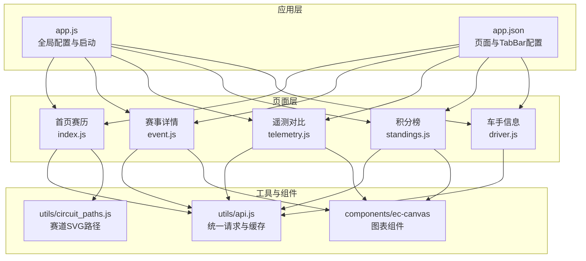
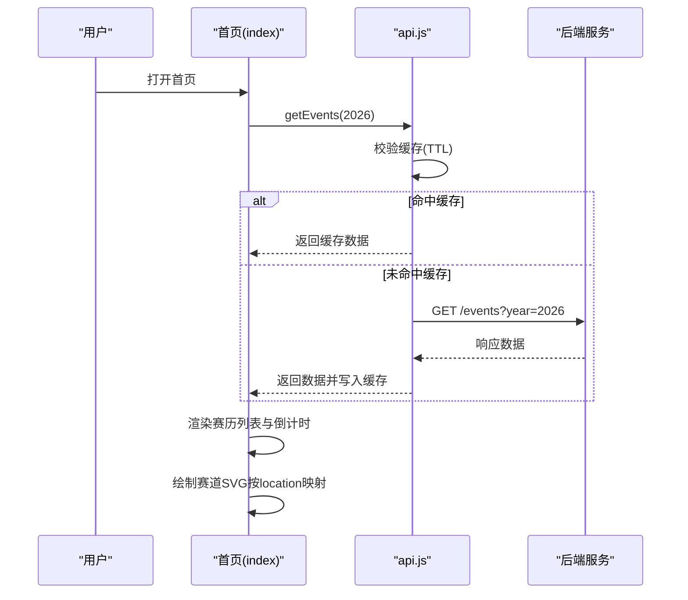
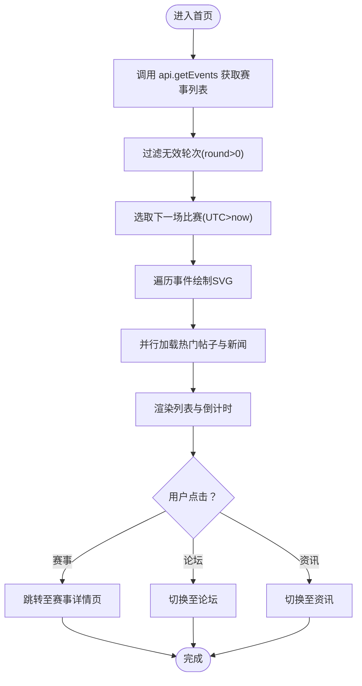
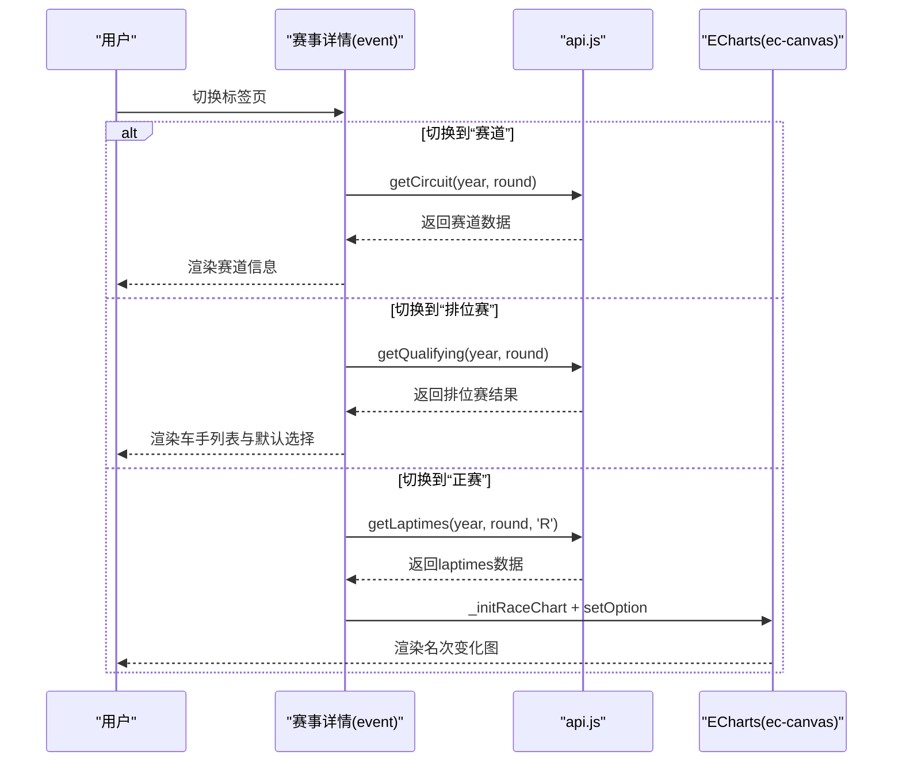
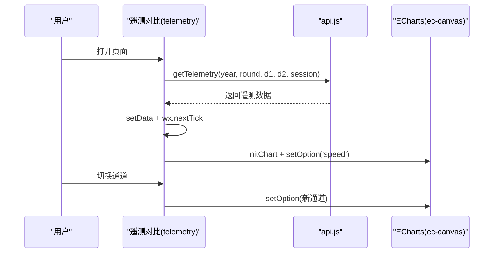
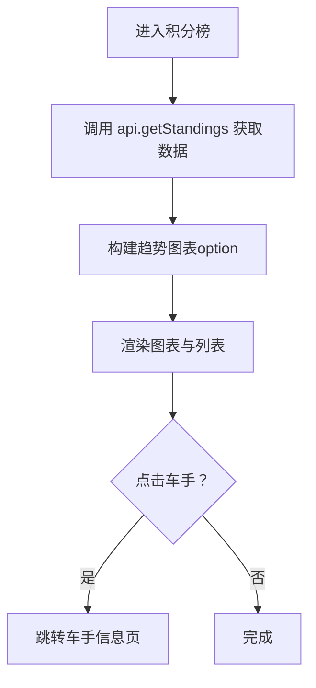
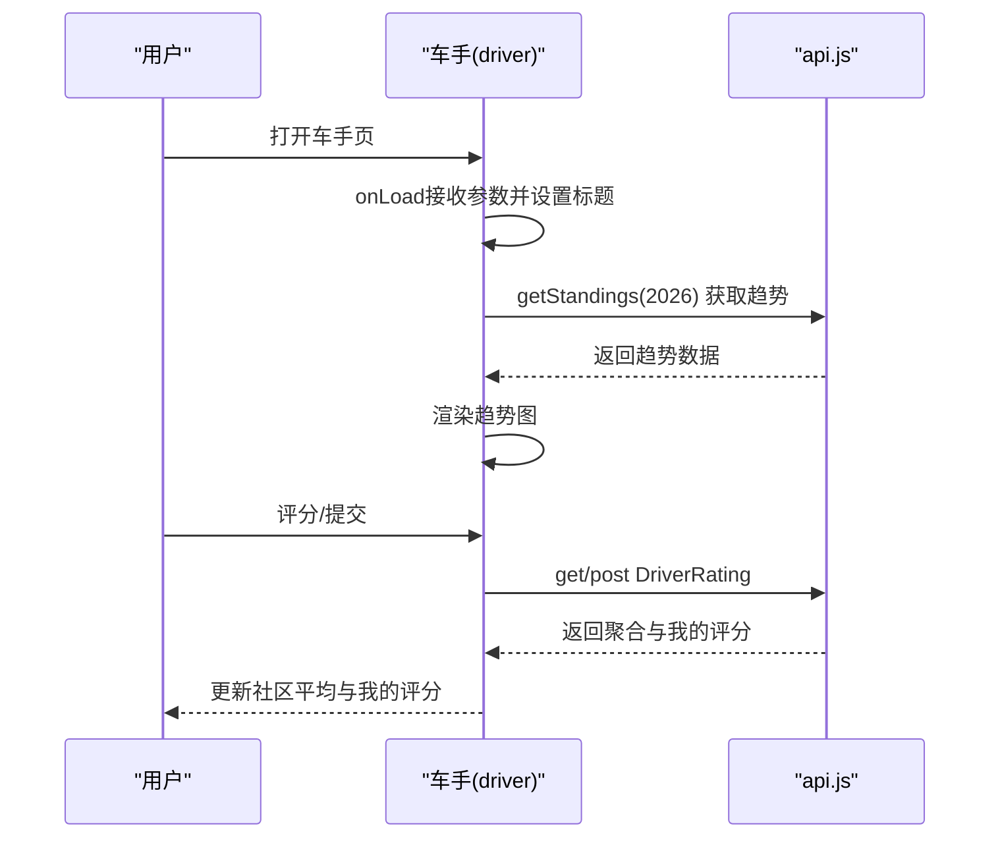
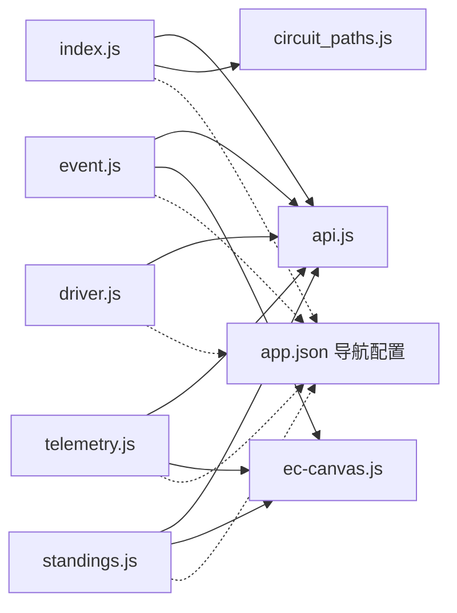

# 核心页面功能

<cite>
**本文档引用的文件**
- [miniprogram/pages/index/index.js](file://miniprogram/pages/index/index.js)
- [miniprogram/pages/event/event.js](file://miniprogram/pages/event/event.js)
- [miniprogram/pages/telemetry/telemetry.js](file://miniprogram/pages/telemetry/telemetry.js)
- [miniprogram/pages/standings/standings.js](file://miniprogram/pages/standings/standings.js)
- [miniprogram/pages/driver/driver.js](file://miniprogram/pages/driver/driver.js)
- [miniprogram/utils/api.js](file://miniprogram/utils/api.js)
- [miniprogram/utils/circuit_paths.js](file://miniprogram/utils/circuit_paths.js)
- [miniprogram/components/ec-canvas/ec-canvas.js](file://miniprogram/components/ec-canvas/ec-canvas.js)
- [miniprogram/app.js](file://miniprogram/app.js)
- [miniprogram/app.json](file://miniprogram/app.json)
- [miniprogram/pages/index/index.json](file://miniprogram/pages/index/index.json)
- [miniprogram/pages/event/event.json](file://miniprogram/pages/event/event.json)
- [miniprogram/pages/standings/standings.json](file://miniprogram/pages/standings/standings.json)
- [miniprogram/pages/telemetry/telemetry.json](file://miniprogram/pages/telemetry/telemetry.json)
- [miniprogram/pages/driver/driver.json](file://miniprogram/pages/driver/driver.json)
</cite>

## 目录
1. [简介](#简介)
2. [项目结构](#项目结构)
3. [核心组件](#核心组件)
4. [架构总览](#架构总览)
5. [详细组件分析](#详细组件分析)
6. [依赖关系分析](#依赖关系分析)
7. [性能考虑](#性能考虑)
8. [故障排除指南](#故障排除指南)
9. [结论](#结论)
10. [附录](#附录)

## 简介
本文件面向 Fast-F1 微信小程序的核心页面功能，系统性梳理首页赛历、赛事详情、遥测对比、积分榜与车手页面的设计与实现，覆盖数据获取、列表渲染、图表渲染、用户交互、页面导航与数据传递、缓存策略与性能优化等方面。文档旨在帮助开发者快速理解代码结构与实现细节，并为后续迭代提供参考。

## 项目结构
小程序采用按页面组织的目录结构，核心页面位于 miniprogram/pages 下，通用工具与组件位于 utils 与 components 中。应用级全局配置与入口在 app.js 与 app.json 中定义。

**图表来源**
- [miniprogram/app.js:1-23](file://miniprogram/app.js#L1-L23)
- [miniprogram/app.json:1-72](file://miniprogram/app.json#L1-L72)
- [miniprogram/pages/index/index.js:1-255](file://miniprogram/pages/index/index.js#L1-L255)
- [miniprogram/pages/event/event.js:1-381](file://miniprogram/pages/event/event.js#L1-L381)
- [miniprogram/pages/telemetry/telemetry.js:1-156](file://miniprogram/pages/telemetry/telemetry.js#L1-L156)
- [miniprogram/pages/standings/standings.js:1-123](file://miniprogram/pages/standings/standings.js#L1-L123)
- [miniprogram/pages/driver/driver.js:1-469](file://miniprogram/pages/driver/driver.js#L1-L469)
- [miniprogram/utils/api.js:1-299](file://miniprogram/utils/api.js#L1-L299)
- [miniprogram/utils/circuit_paths.js:1-119](file://miniprogram/utils/circuit_paths.js#L1-L119)
- [miniprogram/components/ec-canvas/ec-canvas.js:1-292](file://miniprogram/components/ec-canvas/ec-canvas.js#L1-L292)

**章节来源**
- [miniprogram/app.json:1-72](file://miniprogram/app.json#L1-L72)
- [miniprogram/app.js:1-23](file://miniprogram/app.js#L1-L23)

## 核心组件
- 页面控制器：每个页面通过 Page({}) 定义生命周期、数据与事件处理，负责数据获取、渲染与交互。
- 图表组件：基于 ec-canvas 封装，支持新旧 Canvas 初始化路径，适配不同微信基础库版本。
- 请求与缓存：统一的 api.js 提供带 TTL 的缓存请求封装，减少重复网络请求与后端压力。
- 赛道路径：circuit_paths.js 提供多条 F1 赛道的 SVG 路径，用于首页赛历的可视化绘制。

**章节来源**
- [miniprogram/pages/index/index.js:92-255](file://miniprogram/pages/index/index.js#L92-L255)
- [miniprogram/pages/event/event.js:193-381](file://miniprogram/pages/event/event.js#L193-L381)
- [miniprogram/pages/telemetry/telemetry.js:71-156](file://miniprogram/pages/telemetry/telemetry.js#L71-L156)
- [miniprogram/pages/standings/standings.js:54-123](file://miniprogram/pages/standings/standings.js#L54-L123)
- [miniprogram/pages/driver/driver.js:273-469](file://miniprogram/pages/driver/driver.js#L273-L469)
- [miniprogram/components/ec-canvas/ec-canvas.js:31-292](file://miniprogram/components/ec-canvas/ec-canvas.js#L31-L292)
- [miniprogram/utils/api.js:42-120](file://miniprogram/utils/api.js#L42-L120)
- [miniprogram/utils/circuit_paths.js:6-119](file://miniprogram/utils/circuit_paths.js#L6-L119)

## 架构总览
小程序前端通过页面控制器发起请求，经由 api.js 的统一封装与缓存策略，访问后端服务；图表类页面使用 ec-canvas 组件渲染 ECharts 图表；首页赛历页面结合 circuit_paths.js 的 SVG 路径进行轻量绘制。

**图表来源**
- [miniprogram/pages/index/index.js:125-153](file://miniprogram/pages/index/index.js#L125-L153)
- [miniprogram/utils/api.js:98-120](file://miniprogram/utils/api.js#L98-L120)

**章节来源**
- [miniprogram/pages/index/index.js:125-212](file://miniprogram/pages/index/index.js#L125-L212)
- [miniprogram/utils/api.js:98-120](file://miniprogram/utils/api.js#L98-L120)

## 详细组件分析

### 首页赛历页面（index）
- 数据获取与过滤
  - 调用 api.getEvents 获取指定年份的赛事列表，过滤掉 round<=0 的无效轮次。
  - 设置 loading 与 error 状态，渲染事件列表。
- 倒计时与下一场比赛
  - 通过 _pickNextRace 选取 UTC 时间晚于当前时间的下一场作为“下一场比赛”，计算北京时间显示与倒计时。
  - 使用定时器每秒更新倒计时，结束后自动重选下一场。
- 赛道SVG绘制
  - 通过 LOCATION_TO_CIRCUIT 将 location 映射到 circuit_paths 中的 key。
  - 使用 parsePath 与 fitPoints 解析并缩放 SVG 路径，绘制到对应 canvas 上。
- 热门推荐
  - 并行请求热门帖子与新闻，渲染到首页。
- 用户交互
  - 赛事点击跳转至赛事详情页，传递 round、name、year 与 race_time_utc。
  - 论坛与资讯 Tab 切换。

**图表来源**
- [miniprogram/pages/index/index.js:125-253](file://miniprogram/pages/index/index.js#L125-L253)
- [miniprogram/utils/circuit_paths.js:6-119](file://miniprogram/utils/circuit_paths.js#L6-L119)

**章节来源**
- [miniprogram/pages/index/index.js:92-255](file://miniprogram/pages/index/index.js#L92-L255)
- [miniprogram/utils/circuit_paths.js:6-119](file://miniprogram/utils/circuit_paths.js#L6-L119)

### 赛事详情页面（event）
- 页面结构与状态
  - 包含“赛道”“排位赛”“正赛”三个标签页，按需懒加载数据。
  - 赛道信息、排位赛结果、正赛圈times与图表等状态集中管理。
- 数据获取
  - 赛道：getCircuit(year, round)
  - 排位赛：getQualifying(year, round)，构建车手列表与默认选择。
  - 正赛：getLaptimes(year, round, 'R')，构建车手列表与默认选前三名，生成数据卡片。
- 图表渲染（ECharts）
  - buildPositionOption 构建名次变化折线图，支持进站标记、末端标签、tooltip 等。
  - _initRaceChart 在 ec-canvas 初始化后设置 option。
- 用户交互
  - 车手选择：点击车手卡片切换选中状态，动态更新图表与数据卡片。
  - 车手选择器：Picker 选择 d1/d2，默认来自排位赛结果。
  - 导航：跳转至遥测对比与分析页面，携带 year、round、d1、d2、session 参数。

**图表来源**
- [miniprogram/pages/event/event.js:240-299](file://miniprogram/pages/event/event.js#L240-L299)
- [miniprogram/utils/api.js:128-135](file://miniprogram/utils/api.js#L128-L135)

**章节来源**
- [miniprogram/pages/event/event.js:193-381](file://miniprogram/pages/event/event.js#L193-L381)
- [miniprogram/utils/api.js:128-135](file://miniprogram/utils/api.js#L128-L135)

### 遥测对比页面（telemetry）
- 数据获取
  - 调用 api.getTelemetry(year, round, d1, d2, session='Q') 获取遥测数据。
  - 数据包含两条车手的通道数据（如速度、油门、刹车、档位）与赛道弯角标注。
- 图表渲染
  - buildOption 构建单通道图表，支持多车线叠加、弯角标记线、legend 等。
  - _initChart 在 ec-canvas 组件就绪后初始化 ECharts 实例并 setOption。
- 用户交互
  - 通道切换：点击 speed/throttle/brake/gear 切换图表。
  - 导航：跳转至分析页面。

**图表来源**
- [miniprogram/pages/telemetry/telemetry.js:98-147](file://miniprogram/pages/telemetry/telemetry.js#L98-L147)
- [miniprogram/utils/api.js:134-135](file://miniprogram/utils/api.js#L134-L135)

**章节来源**
- [miniprogram/pages/telemetry/telemetry.js:71-156](file://miniprogram/pages/telemetry/telemetry.js#L71-L156)
- [miniprogram/utils/api.js:134-135](file://miniprogram/utils/api.js#L134-L135)

### 积分榜页面（standings）
- 数据获取与渲染
  - 调用 api.getStandings 获取车手与车队积分、趋势数据。
  - 构建 driverTrendOption，渲染趋势折线图。
- 用户交互
  - Tab 切换 driver/constructor。
  - 车手点击跳转至车手信息页，传递 code、color、team、points、position、wins。

**图表来源**
- [miniprogram/pages/standings/standings.js:74-101](file://miniprogram/pages/standings/standings.js#L74-L101)

**章节来源**
- [miniprogram/pages/standings/standings.js:54-123](file://miniprogram/pages/standings/standings.js#L54-L123)

### 车手页面（driver）
- 数据与展示
  - 接收来自上一页的 code、color、team、points、position、wins。
  - 展示车手基本信息、生涯统计、赛季趋势折线图。
- 评分与评论
  - 评分维度：单圈速度、稳定性、防守、雨战、心理素质。
  - 评分提交与社区平均值展示，支持匿名与注册用户两种模式。
  - 评论加载、点赞、分页加载更多。
- 用户态
  - 登录态检测与引导注册。

**图表来源**
- [miniprogram/pages/driver/driver.js:298-332](file://miniprogram/pages/driver/driver.js#L298-L332)
- [miniprogram/utils/api.js:291-295](file://miniprogram/utils/api.js#L291-L295)

**章节来源**
- [miniprogram/pages/driver/driver.js:273-469](file://miniprogram/pages/driver/driver.js#L273-L469)
- [miniprogram/utils/api.js:291-295](file://miniprogram/utils/api.js#L291-L295)

## 依赖关系分析
- 页面到工具
  - index/event/telemetry/standings/driver 均依赖 utils/api.js 进行网络请求与缓存。
  - index 依赖 utils/circuit_paths.js 进行 SVG 绘制。
  - event/telemetry/standings 依赖 components/ec-canvas 进行图表渲染。
- 页面到页面
  - 首页 -> 赛事详情：传递 round/name/year/race_time_utc。
  - 赛事详情 -> 遥测对比/分析：传递 year/round/d1/d2/session。
  - 积分榜 -> 车手信息：传递 code/color/team/points/position/wins。
  - 车手信息 -> 论坛注册：引导注册。
- 应用级配置
  - app.json 定义页面与 TabBar，统一导航栏样式。

**图表来源**
- [miniprogram/pages/index/index.js:1-5](file://miniprogram/pages/index/index.js#L1-L5)
- [miniprogram/pages/event/event.js:1-2](file://miniprogram/pages/event/event.js#L1-L2)
- [miniprogram/pages/telemetry/telemetry.js:1-2](file://miniprogram/pages/telemetry/telemetry.js#L1-L2)
- [miniprogram/pages/standings/standings.js:1-2](file://miniprogram/pages/standings/standings.js#L1-L2)
- [miniprogram/pages/driver/driver.js](file://miniprogram/pages/driver/driver.js#L1)
- [miniprogram/utils/api.js:1-2](file://miniprogram/utils/api.js#L1-L2)
- [miniprogram/utils/circuit_paths.js:1-5](file://miniprogram/utils/circuit_paths.js#L1-L5)
- [miniprogram/components/ec-canvas/ec-canvas.js:1-5](file://miniprogram/components/ec-canvas/ec-canvas.js#L1-L5)
- [miniprogram/app.json:29-66](file://miniprogram/app.json#L29-L66)

**章节来源**
- [miniprogram/app.json:29-66](file://miniprogram/app.json#L29-L66)

## 性能考虑
- 请求缓存
  - api.js 为不同接口设置不同 TTL，优先读取缓存并异步刷新，降低网络与后端压力。
- 图表渲染
  - ec-canvas 在新旧 Canvas 初始化路径下均禁用 progressive，避免不兼容问题；图表 option 关闭动画提升首屏渲染速度。
- 首页SVG绘制
  - parsePath/fitPoints 对 SVG 路径进行解析与缩放，仅在数据就绪后批量绘制，避免阻塞主线程。
- 懒加载与按需渲染
  - 赛事详情标签页按需加载数据；遥测对比与积分榜图表在数据就绪后初始化，减少无意义渲染。
- 优化建议
  - 对高频接口（如 events、standings）可考虑预取未来几周数据。
  - 图表数据量较大时，可分页或采样渲染。
  - 首页SVG绘制可延迟到页面可见区域，或使用更轻量的占位图。

**章节来源**
- [miniprogram/utils/api.js:3-15](file://miniprogram/utils/api.js#L3-L15)
- [miniprogram/utils/api.js:98-120](file://miniprogram/utils/api.js#L98-L120)
- [miniprogram/components/ec-canvas/ec-canvas.js:52-77](file://miniprogram/components/ec-canvas/ec-canvas.js#L52-L77)
- [miniprogram/pages/index/index.js:175-212](file://miniprogram/pages/index/index.js#L175-L212)

## 故障排除指南
- 网络请求失败
  - api.js 内部已做失败重试一次，若仍失败会返回 note 或网络错误提示。
  - 建议检查 BASE_URL 与网络权限，确认后端接口可用。
- 图表初始化异常
  - ec-canvas 会在未绑定 ec 或基础库版本过低时输出警告/错误，请升级微信基础库版本。
  - 确保在数据就绪后调用 setOption，必要时使用 wx.nextTick。
- 首页SVG绘制空白
  - 检查 location 与 circuit_paths 的映射是否正确，确认 canvas 节点存在且尺寸有效。
- 缓存失效
  - 若需强制刷新，可清除对应缓存键或在调用时传入强制刷新参数（如 analysis 的 force）。

**章节来源**
- [miniprogram/utils/api.js:45-85](file://miniprogram/utils/api.js#L45-L85)
- [miniprogram/components/ec-canvas/ec-canvas.js:98-109](file://miniprogram/components/ec-canvas/ec-canvas.js#L98-L109)
- [miniprogram/pages/index/index.js:175-212](file://miniprogram/pages/index/index.js#L175-L212)

## 结论
本项目通过清晰的页面职责划分、统一的请求与缓存策略、以及可扩展的图表组件，实现了 F1 赛历、赛事详情、遥测对比、积分榜与车手信息等核心功能。页面间通过明确的参数传递与导航实现良好联动，配合缓存与懒加载策略，在保证体验的同时降低了后端压力。后续可在数据预取、图表采样与首屏优化方面进一步提升性能与稳定性。

## 附录
- 页面配置示例
  - 首页导航标题：F1 2026 赛历
  - 赛事详情、遥测对比、积分榜、车手信息页面均引入 ec-canvas 组件
- 全局配置
  - TabBar 包含“赛历”“积分榜”“词典”“资讯”“论坛”五个入口，统一导航栏背景与文字颜色

**章节来源**
- [miniprogram/pages/index/index.json:1-4](file://miniprogram/pages/index/index.json#L1-L4)
- [miniprogram/pages/event/event.json:1-10](file://miniprogram/pages/event/event.json#L1-L10)
- [miniprogram/pages/telemetry/telemetry.json:1-10](file://miniprogram/pages/telemetry/telemetry.json#L1-L10)
- [miniprogram/pages/standings/standings.json:1-10](file://miniprogram/pages/standings/standings.json#L1-L10)
- [miniprogram/pages/driver/driver.json:1-7](file://miniprogram/pages/driver/driver.json#L1-L7)
- [miniprogram/app.json:29-66](file://miniprogram/app.json#L29-L66)