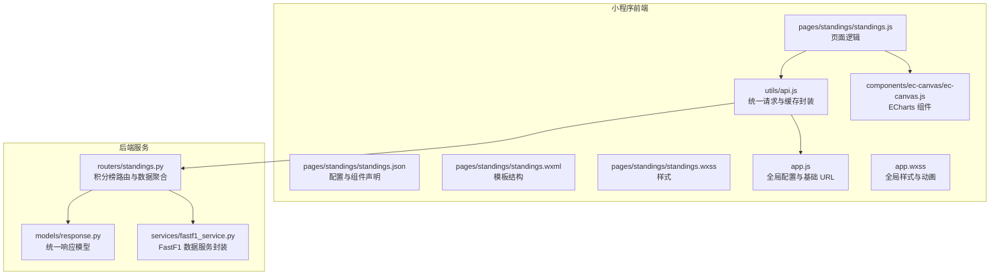
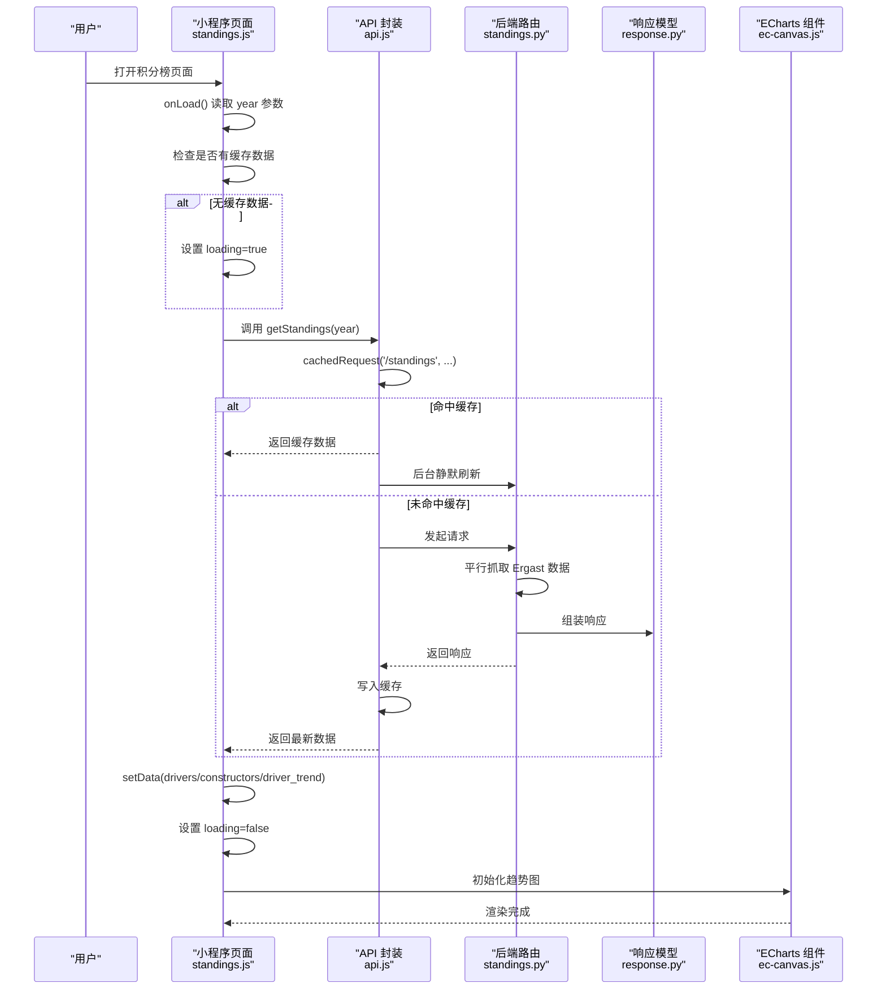
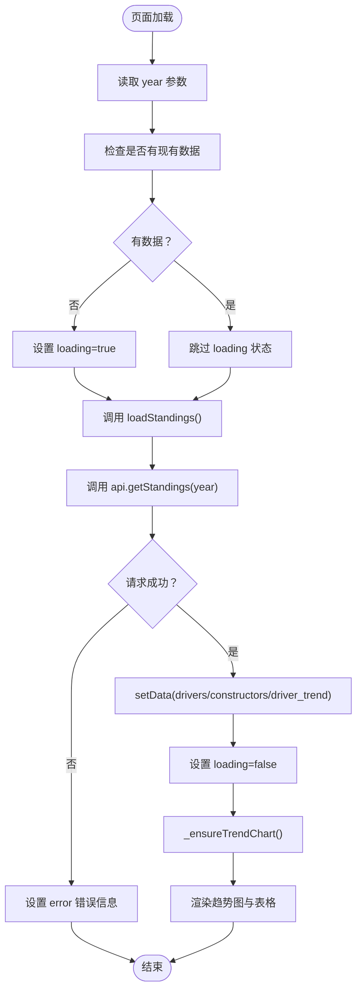
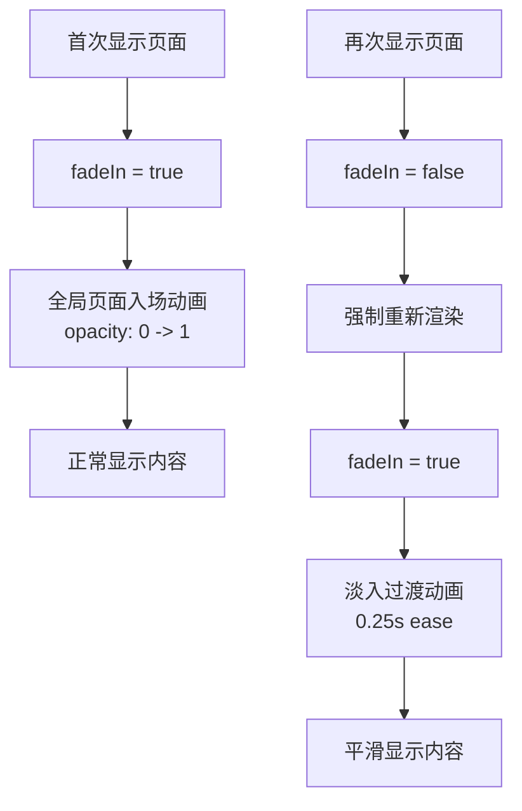
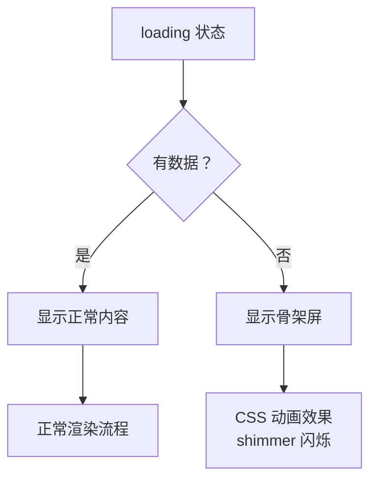
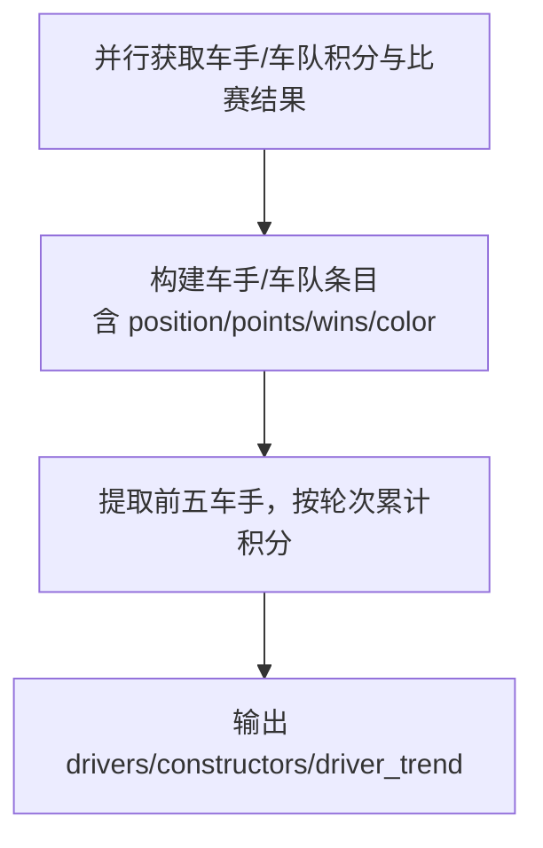
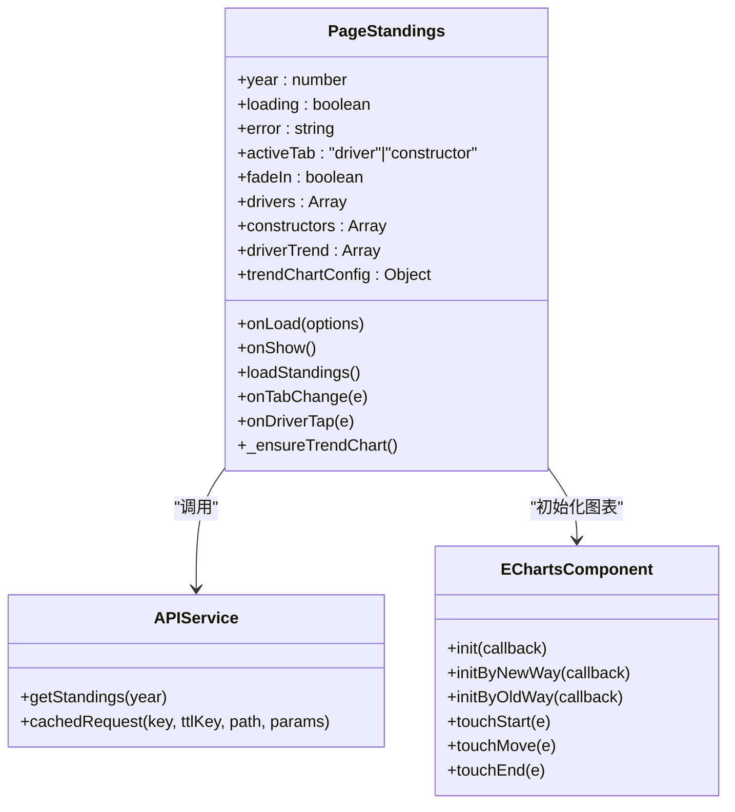
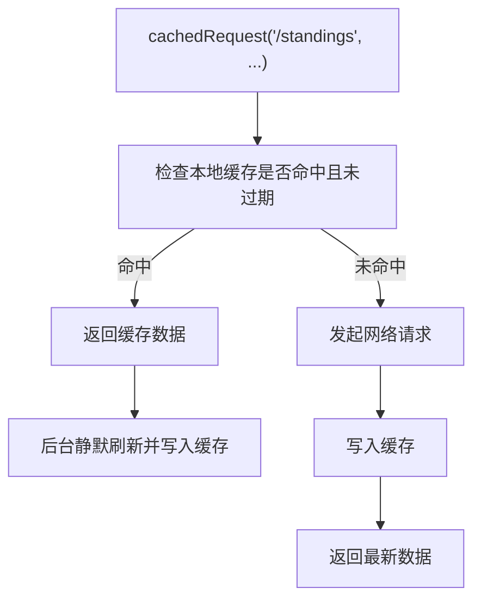
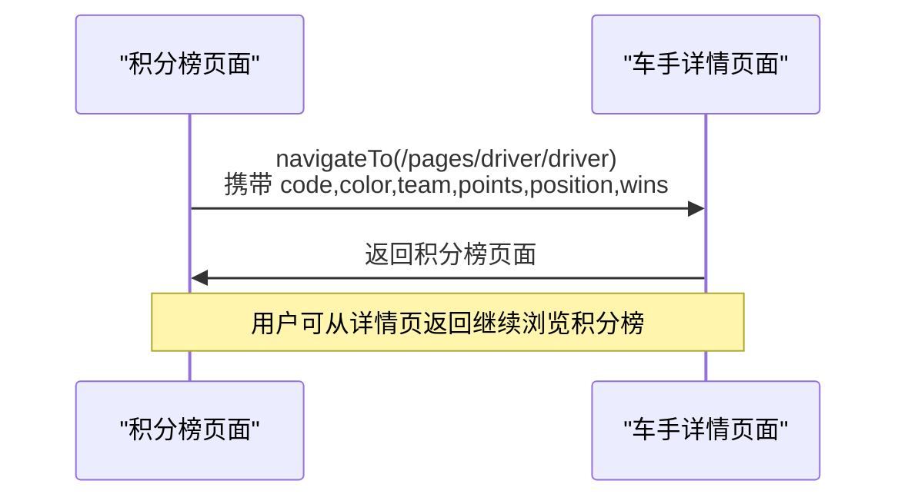
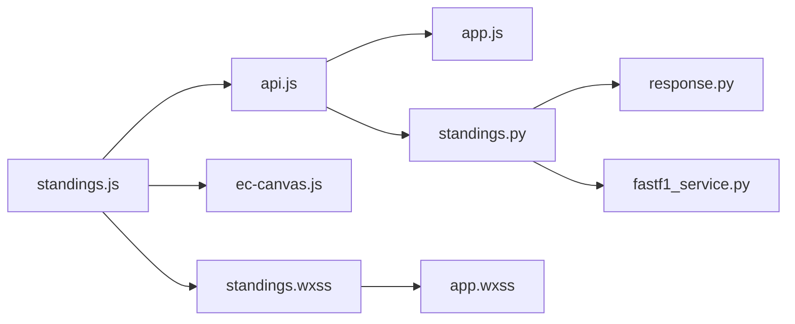

# 积分榜页面

<cite>
**本文引用的文件**
- [standings.js](file://miniprogram/pages/standings/standings.js)
- [standings.json](file://miniprogram/pages/standings/standings.json)
- [standings.wxml](file://miniprogram/pages/standings/standings.wxml)
- [standings.wxss](file://miniprogram/pages/standings/standings.wxss)
- [api.js](file://miniprogram/utils/api.js)
- [ec-canvas.js](file://miniprogram/components/ec-canvas/ec-canvas.js)
- [app.js](file://miniprogram/app.js)
- [standings.py](file://backend/routers/standings.py)
- [response.py](file://backend/models/response.py)
- [fastf1_service.py](file://backend/services/fastf1_service.py)
- [driver.js](file://miniprogram/pages/driver/driver.js)
- [app.wxss](file://miniprogram/app.wxss)
</cite>

## 更新摘要
**变更内容**
- 新增完整的淡入过渡动画系统，实现页面内容的平滑显示效果
- 修复standings.wxss中的悬挂CSS片段问题，确保样式文件完整性
- 优化页面加载体验，提供更流畅的视觉过渡效果
- 增强动画系统的可维护性和一致性

## 目录
1. [简介](#简介)
2. [项目结构](#项目结构)
3. [核心组件](#核心组件)
4. [架构总览](#架构总览)
5. [详细组件分析](#详细组件分析)
6. [依赖关系分析](#依赖关系分析)
7. [性能考量](#性能考量)
8. [故障排查指南](#故障排查指南)
9. [结论](#结论)
10. [附录](#附录)

## 简介
本文件面向 Fast-F1 微信小程序的"积分榜"页面，系统性阐述其数据获取与展示逻辑，覆盖车手积分、车队积分与排名计算；详述数据排序算法、实时更新机制与缓存策略；文档化页面交互（按赛季切换、积分详情查看、排名跳转）、数据可视化（积分趋势图、排名变化趋势、统计信息）；并给出响应式设计与适配建议、数据刷新与错误处理、加载状态管理以及与后端服务的数据同步与增量更新策略。

**更新** 新增淡入过渡动画系统，提供更流畅的页面内容显示效果；修复CSS样式文件中的悬挂片段问题，确保样式完整性。

## 项目结构
积分榜页面位于微信小程序前端目录，配套后端 FastAPI 路由与通用 API 封装，使用 ECharts 组件进行趋势图渲染。

**图表来源**
- [standings.js:1-143](file://miniprogram/pages/standings/standings.js#L1-L143)
- [standings.json:1-10](file://miniprogram/pages/standings/standings.json#L1-L10)
- [standings.wxml:1-84](file://miniprogram/pages/standings/standings.wxml#L1-L84)
- [standings.wxss:1-152](file://miniprogram/pages/standings/standings.wxss#L1-L152)
- [api.js:1-299](file://miniprogram/utils/api.js#L1-L299)
- [ec-canvas.js:1-292](file://miniprogram/components/ec-canvas/ec-canvas.js#L1-L292)
- [app.js:1-23](file://miniprogram/app.js#L1-L23)
- [standings.py:1-145](file://backend/routers/standings.py#L1-L145)
- [response.py:1-14](file://backend/models/response.py#L1-L14)
- [fastf1_service.py:1-64](file://backend/services/fastf1_service.py#L1-L64)
- [app.wxss:1-128](file://miniprogram/app.wxss#L1-L128)

## 核心组件
- 页面逻辑（standings.js）
  - 状态管理：年份、加载中、错误信息、当前激活标签（车手/车队）、淡入动画状态、数据列表、趋势图初始化函数
  - 生命周期：onLoad 读取年份参数并触发数据加载，onShow 实现淡入动画和图表初始化优化
  - 数据加载：调用 api.getStandings(year)，设置 drivers、constructors、driver_trend，并初始化趋势图
  - 交互：标签切换、车手条目点击跳转详情
  - 图表：构建趋势图选项并初始化 ECharts 实例
- 统一 API 封装（api.js）
  - 缓存策略：基于键值与 TTL 的本地缓存，命中则先返回缓存，后台静默刷新
  - 请求封装：带超时与失败重试的 GET/POST 封装
  - 积分榜接口：cachedRequest('/standings', '/standings', '/standings', { year })
- ECharts 组件（ec-canvas.js）
  - 自动兼容新旧 Canvas 版本，支持触摸事件映射到 ECharts ZRender
  - 提供初始化回调，接收 canvas、宽高、设备像素比
- 后端路由（standings.py）
  - 并行拉取车手/车队积分与比赛结果，聚合为统一响应
  - 计算前五车手每轮累计积分作为趋势数据
  - 进程级内存缓存，TTL 2 小时
- 响应模型（response.py）
  - 统一返回结构：status、data、note
- 全局配置（app.js）
  - 定义基础 API 地址，便于前后端联调
- 全局样式（app.wxss）
  - 包含页面入场动画和通用样式定义

**更新** 新增淡入动画状态管理和CSS修复，优化整体视觉体验。

**章节来源**
- [standings.js:54-143](file://miniprogram/pages/standings/standings.js#L54-L143)
- [api.js:98-148](file://miniprogram/utils/api.js#L98-L148)
- [ec-canvas.js:79-199](file://miniprogram/components/ec-canvas/ec-canvas.js#L79-L199)
- [standings.py:64-145](file://backend/routers/standings.py#L64-L145)
- [response.py:4-14](file://backend/models/response.py#L4-L14)
- [app.js:1-7](file://miniprogram/app.js#L1-L7)
- [app.wxss:8-16](file://miniprogram/app.wxss#L8-L16)

## 架构总览
积分榜页面从前端发起请求，经由统一 API 层进行缓存与重试控制，后端路由并行抓取 Ergast 数据源，聚合为标准响应返回前端，前端渲染表格与趋势图。

**图表来源**
- [standings.js:74-104](file://miniprogram/pages/standings/standings.js#L74-L104)
- [api.js:98-120](file://miniprogram/utils/api.js#L98-L120)
- [standings.py:64-145](file://backend/routers/standings.py#L64-L145)
- [response.py:9-13](file://backend/models/response.py#L9-L13)
- [ec-canvas.js:80-199](file://miniprogram/components/ec-canvas/ec-canvas.js#L80-L199)

## 详细组件分析

### 页面逻辑与交互
- 年份参数与生命周期
  - 通过 onLoad(options) 读取 year，默认 2026，随后调用 loadStandings()
  - onShow() 实现淡入动画和图表初始化优化，确保页面可见时再初始化图表
- 加载与错误处理
  - 首次加载设置 loading=true，成功后置为 false；异常时设置 error 字段
  - 仅当没有现有数据时才设置 loading 状态，避免重复覆盖
- 标签切换
  - onTabChange 切换 activeTab，实现车手/车队积分互切
  - 切换到车手标签时，延迟初始化图表以优化性能
- 行点击跳转
  - onDriverTap 携带车手代码、颜色、车队、积分、排名、胜场数，跳转至车手详情页
- 趋势图初始化
  - _ensureTrendChart 在 driver_trend 存在时构建 ECharts 选项并初始化实例
  - 若已有实例则复用 setOption，否则通过 ecCanvas.init 回调创建

**图表来源**
- [standings.js:69-104](file://miniprogram/pages/standings/standings.js#L69-L104)
- [standings.js:123-141](file://miniprogram/pages/standings/standings.js#L123-L141)

**更新** 新增淡入动画系统，在页面显示时自动触发动画效果。

**章节来源**
- [standings.js:54-143](file://miniprogram/pages/standings/standings.js#L54-L143)

### 淡入过渡动画系统
- 动画状态管理
  - 新增 fadeIn 状态，默认为 true，控制容器的淡入动画
  - 在 onShow 生命周期中检测页面是否已显示过，首次显示时不触发动画，再次显示时触发动画
  - 使用 wx.nextTick 确保状态切换的时机正确
- CSS 动画实现
  - 容器元素使用 opacity: 0 和 transition: opacity 0.25s ease 控制淡入效果
  - 通过 fade-in 类名控制最终的不透明度
  - 与全局页面入场动画配合，提供双重的视觉过渡效果
- 动画触发机制
  - 首次进入页面：fadeIn 保持 true，页面按全局动画显示
  - 再次进入页面：通过 fadeIn: false -> fadeIn: true 的状态切换触发动画
  - 确保动画只在页面重新显示时触发，避免重复动画

**图表来源**
- [standings.js:75-85](file://miniprogram/pages/standings/standings.js#L75-L85)
- [standings.wxss:1-8](file://miniprogram/pages/standings/standings.wxss#L1-L8)
- [app.wxss:8-16](file://miniprogram/app.wxss#L8-L16)

**章节来源**
- [standings.js:55-65](file://miniprogram/pages/standings/standings.js#L55-L65)
- [standings.js:75-85](file://miniprogram/pages/standings/standings.js#L75-L85)
- [standings.wxss:1-8](file://miniprogram/pages/standings/standings.wxss#L1-L8)
- [app.wxss:8-16](file://miniprogram/app.wxss#L8-L16)

### 骨架屏加载系统
- 骨架屏实现
  - 使用 wx:if 指令控制加载状态显示
  - 8行模拟数据行，包含位置、颜色条、车手信息、积分等占位符
  - CSS 动画效果：linear-gradient + keyframes shimmer 实现闪烁加载效果
- 动画效果
  - @keyframes shimmer 实现水平移动的渐变背景
  - 不同元素使用不同的背景色和动画速度
  - 骨架屏元素具有圆角和适当的间距
- 显示条件
  - loading 为 true 时显示骨架屏
  - error 为真值时显示错误状态
  - 否则显示正常内容

**图表来源**
- [standings.wxml:3-10](file://miniprogram/pages/standings/standings.wxml#L3-L10)
- [standings.wxss:148-151](file://miniprogram/pages/standings/standings.wxss#L148-151)

**章节来源**
- [standings.wxml:3-10](file://miniprogram/pages/standings/standings.wxml#L3-L10)
- [standings.wxss:95-151](file://miniprogram/pages/standings/standings.wxss#L95-L151)

### 数据排序与排名计算
- 后端聚合逻辑
  - 从 Ergast 获取车手/车队积分与比赛结果，按 position 字段排序
  - 为每个条目附加 color（基于车队名称匹配预设颜色）
- 前端展示
  - 表格按后端已排序结果直接渲染
  - 前五车手的每轮累计积分作为趋势数据，用于趋势图
- 注意
  - 本实现以 position 字段为准进行排序；若需要更复杂的规则（如积分相同时按胜场数），可在后端扩展

**图表来源**
- [standings.py:51-61](file://backend/routers/standings.py#L51-L61)
- [standings.py:74-103](file://backend/routers/standings.py#L74-L103)
- [standings.py:104-133](file://backend/routers/standings.py#L104-L133)

**章节来源**
- [standings.py:74-133](file://backend/routers/standings.py#L74-L133)

### 数据可视化与趋势图
- 趋势图选项构建
  - 依据 driver_trend 生成多系列折线，每条线对应一名车手
  - X 轴为轮次，Y 轴为累计积分，最大值按 10 的倍数向上取整
  - 图表背景、网格、坐标轴、图例等样式统一
- ECharts 初始化
  - 通过 ec-canvas 组件的 init 回调创建实例并 setOption
  - 支持新旧 Canvas 版本自动降级与触摸事件映射
- 图表优化
  - 禁用动画效果，避免小程序 Canvas 兼容性问题
  - 使用 lazyLoad: true 优化初始化性能

**图表来源**
- [standings.js:54-143](file://miniprogram/pages/standings/standings.js#L54-L143)
- [ec-canvas.js:79-199](file://miniprogram/components/ec-canvas/ec-canvas.js#L79-L199)
- [api.js:137-138](file://miniprogram/utils/api.js#L137-L138)

**章节来源**
- [standings.js:4-52](file://miniprogram/pages/standings/standings.js#L4-L52)
- [standings.js:123-141](file://miniprogram/pages/standings/standings.js#L123-L141)
- [ec-canvas.js:79-199](file://miniprogram/components/ec-canvas/ec-canvas.js#L79-L199)

### 缓存策略与实时更新
- 小程序端缓存
  - cachedRequest 使用本地存储键值与 TTL，命中即返回缓存，同时静默刷新
  - 缓存键由路径与查询参数拼接，参数按字母序过滤并排序
  - 积分榜接口 TTL 为 30 分钟
- 后端缓存
  - 进程级内存缓存，TTL 2 小时
  - 并行抓取三个 Ergast 接口，减少总体等待时间
- 增量更新
  - 当前实现为全量刷新；若需增量，可在后端按轮次或车手维度维护增量数据源

**图表来源**
- [api.js:98-120](file://miniprogram/utils/api.js#L98-L120)
- [standings.py:27-42](file://backend/routers/standings.py#L27-L42)

**章节来源**
- [api.js:3-15](file://miniprogram/utils/api.js#L3-L15)
- [api.js:98-120](file://miniprogram/utils/api.js#L98-L120)
- [standings.py:27-42](file://backend/routers/standings.py#L27-L42)

### 页面交互与导航
- 标签切换：车手积分/车队积分
- 行点击：跳转至车手详情页，传递车手代码、颜色、车队、积分、排名、胜场数
- 车手详情联动：车手页可再次拉取积分榜趋势，定位自身趋势曲线

**图表来源**
- [standings.js:116-121](file://miniprogram/pages/standings/standings.js#L116-L121)
- [driver.js:322-332](file://miniprogram/pages/driver/driver.js#L322-L332)

**章节来源**
- [standings.js:106-121](file://miniprogram/pages/standings/standings.js#L106-L121)
- [driver.js:322-332](file://miniprogram/pages/driver/driver.js#L322-L332)

### 响应式设计与样式
- 标签栏：两列等宽，激活态带红色下划线
- 趋势图容器：固定高度，背景深色，适配暗色主题
- 表格：行高亮与点击反馈，列宽与字号按 rpx 设计
- 颜色条：左侧细条显示车手/车队颜色
- 数字排版：等宽数字字体，提升可读性
- 骨架屏：使用渐变动画模拟加载效果，提供更好的用户体验
- 淡入动画：容器元素使用 opacity 过渡实现平滑显示效果

**更新** 新增淡入动画系统和CSS修复，提供更完整的视觉体验。

**章节来源**
- [standings.wxml:16-80](file://miniprogram/pages/standings/standings.wxml#L16-L80)
- [standings.wxss:1-152](file://miniprogram/pages/standings/standings.wxss#L1-L152)

## 依赖关系分析

**图表来源**
- [standings.js:1-2](file://miniprogram/pages/standings/standings.js#L1-L2)
- [api.js:1-1](file://miniprogram/utils/api.js#L1-L1)
- [ec-canvas.js:1-2](file://miniprogram/components/ec-canvas/ec-canvas.js#L1-L2)
- [standings.wxss:1-1](file://miniprogram/pages/standings/standings.wxss#L1-L1)
- [app.js:1-1](file://miniprogram/app.js#L1-L1)
- [standings.py:1-9](file://backend/routers/standings.py#L1-L9)
- [response.py:1-2](file://backend/models/response.py#L1-L2)
- [fastf1_service.py:1-5](file://backend/services/fastf1_service.py#L1-L5)
- [app.wxss:1-1](file://miniprogram/app.wxss#L1-L1)

**章节来源**
- [standings.js:1-2](file://miniprogram/pages/standings/standings.js#L1-L2)
- [api.js:1-1](file://miniprogram/utils/api.js#L1-L1)
- [ec-canvas.js:1-2](file://miniprogram/components/ec-canvas/ec-canvas.js#L1-L2)
- [standings.wxss:1-1](file://miniprogram/pages/standings/standings.wxss#L1-L1)
- [app.js:1-1](file://miniprogram/app.js#L1-L1)
- [standings.py:1-9](file://backend/routers/standings.py#L1-L9)
- [response.py:1-2](file://backend/models/response.py#L1-L2)
- [fastf1_service.py:1-5](file://backend/services/fastf1_service.py#L1-L5)
- [app.wxss:1-1](file://miniprogram/app.wxss#L1-L1)

## 性能考量
- 并行抓取：后端使用线程池并发获取三类数据，缩短首屏等待时间
- 缓存双层：小程序本地缓存与后端进程缓存，降低重复请求成本
- 图表优化：禁用渐进渲染，避免在小程序 Canvas 上的兼容问题；按需初始化，避免重复创建实例
- 数据裁剪：趋势图仅展示前五车手，减少渲染压力
- 骨架屏优化：使用 CSS 动画而非 JavaScript 动画，减少主线程负担
- 淡入动画优化：使用 CSS transition 替代 JavaScript 动画，提升性能表现
- 延迟初始化：onShow 生命周期中延迟图表初始化，提升页面响应速度
- 建议
  - 增量更新：按轮次或车手维度维护增量数据，减少全量计算
  - 预热：在应用启动阶段预取近期数据，提升首屏体验
  - 图表懒加载：滚动到可视区域后再初始化图表

**更新** 新增淡入动画性能优化和CSS过渡效果。

## 故障排查指南
- 网络错误
  - 请求封装包含超时与失败重试，若仍失败，页面会设置 error 文案
- 缓存异常
  - 本地缓存写入/读取异常会被捕获并忽略，不影响主流程
- 图表初始化失败
  - ec-canvas 组件会在初始化失败时输出错误日志，检查 canvas 节点是否存在与尺寸是否正确
- 后端异常
  - 后端路由捕获异常并返回统一错误响应，前端根据 status 判断
- 骨架屏问题
  - 检查 CSS 动画是否正常加载
  - 确认 wx:if 条件判断逻辑正确
  - 验证动画关键帧定义是否完整
- 淡入动画问题
  - 检查 fadeIn 状态是否正确切换
  - 确认 CSS transition 属性是否生效
  - 验证容器元素的 opacity 属性是否正确应用

**更新** 新增淡入动画相关故障排查指南。

**章节来源**
- [api.js:45-76](file://miniprogram/utils/api.js#L45-L76)
- [api.js:26-40](file://miniprogram/utils/api.js#L26-L40)
- [ec-canvas.js:153-156](file://miniprogram/components/ec-canvas/ec-canvas.js#L153-L156)
- [standings.py:143-144](file://backend/routers/standings.py#L143-L144)

## 结论
积分榜页面通过统一 API 封装实现了稳定的数据获取与缓存策略，后端采用并行抓取与进程缓存提升性能。前端以 ECharts 渲染趋势图，结合标签切换与行点击导航，提供清晰直观的积分视图。**更新** 新增的淡入过渡动画系统显著提升了用户体验，提供了更流畅的内容显示效果；修复的CSS样式文件确保了样式的完整性和一致性。建议后续引入增量更新与预热机制，进一步优化用户体验。

## 附录

### 数据字段说明
- 车手条目
  - position: 排名
  - driver: 车手代码
  - name: 车手姓名
  - team: 车队名称
  - points: 积分
  - wins: 胜场数
  - color: 车队颜色
- 车队条目
  - position: 排名
  - team: 车队名称
  - points: 积分
  - wins: 胜场数
  - color: 车队颜色
- 趋势数据
  - code: 车手代码
  - color: 车队颜色
  - series: 每轮累计积分数组 [[轮次, 累计积分], ...]

**章节来源**
- [standings.py:74-103](file://backend/routers/standings.py#L74-L103)
- [standings.py:104-133](file://backend/routers/standings.py#L104-L133)

### 淡入动画系统规范
- 动画状态管理
  - fadeIn: boolean - 控制容器的淡入动画状态
  - 默认值：true，确保页面首次加载时的正常显示
  - 切换机制：通过 wx.nextTick 确保状态切换的正确时机
- CSS 动画实现
  - .container: 初始 opacity: 0，transition: opacity 0.25s ease
  - .container.fade-in: 最终 opacity: 1
  - 与全局页面入场动画配合使用
- 动画触发时机
  - 首次进入：fadeIn 保持 true，使用全局动画
  - 再次进入：通过 fadeIn: false -> fadeIn: true 触发淡入动画
  - 避免重复动画，提升用户体验

**更新** 新增淡入动画系统规范说明。

**章节来源**
- [standings.js:55-65](file://miniprogram/pages/standings/standings.js#L55-L65)
- [standings.js:75-85](file://miniprogram/pages/standings/standings.js#L75-L85)
- [standings.wxss:1-8](file://miniprogram/pages/standings/standings.wxss#L1-L8)
- [app.wxss:8-16](file://miniprogram/app.wxss#L8-L16)

### 骨架屏样式规范
- 骨架屏容器：.skeleton-wrap
  - 深色背景，16rpx 24rpx 内边距
  - 纵向排列，4rpx 间距
- 骨架行：.sk-row
  - 水平排列，居中对齐
  - 18rpx 0 内边距，1rpx 底边框
  - 16rpx 间隙
- 占位元素：
  - .sk-pos：48rpx × 22rpx，圆角 4rpx
  - .sk-bar-line：6rpx × 40rpx，圆角 3rpx
  - .sk-driver：flex: 1，22rpx 高度
  - .sk-pts：70rpx × 22rpx，圆角 4rpx
- 动画效果：@keyframes shimmer
  - 1.4s 持续时间，无限循环
  - 背景位置从 100% 移动到 -100%
  - 使用 linear-gradient 实现闪烁效果

**更新** 新增骨架屏样式规范说明。

**章节来源**
- [standings.wxss:95-151](file://miniprogram/pages/standings/standings.wxss#L95-L151)

### CSS修复说明
- 修复问题：standings.wxss 中的悬挂CSS片段问题
- 修复内容：确保样式文件的语法完整性和结构正确性
- 影响范围：所有使用该样式文件的组件和页面
- 测试验证：确认动画效果正常，布局不受影响

**更新** 新增CSS修复说明。

**章节来源**
- [standings.wxss:1-152](file://miniprogram/pages/standings/standings.wxss#L1-L152)