# 赛事详情页面

<cite>
**本文档引用的文件**
- [miniprogram/pages/event/event.js](file://miniprogram/pages/event/event.js)
- [miniprogram/pages/event/event.json](file://miniprogram/pages/event/event.json)
- [miniprogram/pages/event/event.wxml](file://miniprogram/pages/event/event.wxml)
- [miniprogram/pages/event/event.wxss](file://miniprogram/pages/event/event.wxss)
- [miniprogram/utils/api.js](file://miniprogram/utils/api.js)
- [miniprogram/app.js](file://miniprogram/app.js)
- [miniprogram/pages/telemetry/telemetry.js](file://miniprogram/pages/telemetry/telemetry.js)
- [miniprogram/pages/analysis/analysis.js](file://miniprogram/pages/analysis/analysis.js)
- [miniprogram/components/ec-canvas/ec-canvas.js](file://miniprogram/components/ec-canvas/ec-canvas.js)
- [backend/routers/events.py](file://backend/routers/events.py)
- [backend/routers/laptimes.py](file://backend/routers/laptimes.py)
- [backend/routers/qualifying.py](file://backend/routers/qualifying.py)
</cite>

## 更新摘要
**变更内容**
- 新增事件页面骨架屏实现，提升数据加载体验
- 改进事件状态可视化，通过 raceHappened 状态控制数据加载
- 优化数据加载机制，实现智能缓存和错误处理
- 增强用户交互反馈，提供更直观的状态指示

## 目录
1. [简介](#简介)
2. [项目结构](#项目结构)
3. [核心组件](#核心组件)
4. [架构概览](#架构概览)
5. [详细组件分析](#详细组件分析)
6. [依赖关系分析](#依赖关系分析)
7. [性能考虑](#性能考虑)
8. [故障排除指南](#故障排除指南)
9. [结论](#结论)
10. [附录](#附录)

## 简介

Fast-F1 微信小程序赛事详情页面是一个综合性的F1赛事信息展示平台，为用户提供实时的赛事数据、详细的赛道信息和丰富的可视化图表。该页面采用模块化设计，支持多标签切换浏览，包括赛道信息、排位赛结果、正赛圈时数据和遥测对比等功能。

**更新** 新增了完整的骨架屏实现和事件状态可视化改进，显著提升了用户体验和数据加载性能。

页面的核心特色包括：
- **智能骨架屏**：通过骨架屏占位符提供流畅的加载体验
- **事件状态可视化**：通过 raceHappened 状态智能控制数据加载
- **实时数据展示**：通过API接口获取最新的F1赛事数据
- **丰富的可视化图表**：使用ECharts实现复杂的图表渲染
- **响应式布局设计**：适配不同屏幕尺寸的移动设备
- **智能缓存机制**：优化数据加载性能和用户体验
- **多维度数据分析**：提供车手表现、轮胎策略、圈时变化等深度分析

## 项目结构

赛事详情页面位于微信小程序的 `miniprogram/pages/event/` 目录下，采用标准的小程序页面结构：

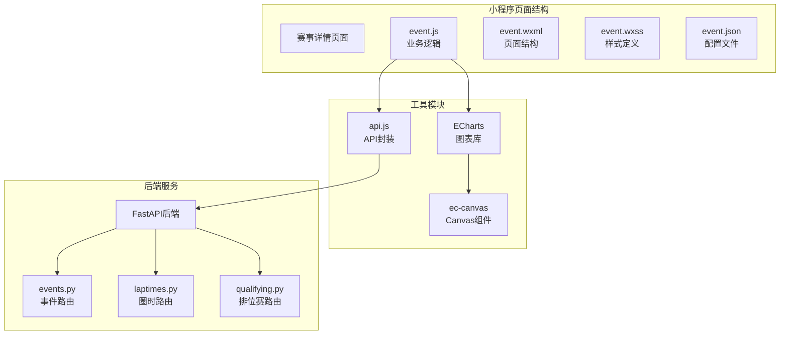

**图表来源**
- [miniprogram/pages/event/event.js:193-381](file://miniprogram/pages/event/event.js#L193-L381)
- [miniprogram/utils/api.js:122-299](file://miniprogram/utils/api.js#L122-L299)
- [miniprogram/components/ec-canvas/ec-canvas.js:31-292](file://miniprogram/components/ec-canvas/ec-canvas.js#L31-L292)

**章节来源**
- [miniprogram/pages/event/event.js:1-381](file://miniprogram/pages/event/event.js#L1-L381)
- [miniprogram/pages/event/event.json:1-10](file://miniprogram/pages/event/event.json#L1-L10)
- [miniprogram/pages/event/event.wxml:1-258](file://miniprogram/pages/event/event.wxml#L1-L258)

## 核心组件

### 页面数据模型

赛事详情页面采用响应式数据绑定机制，主要数据结构包括：

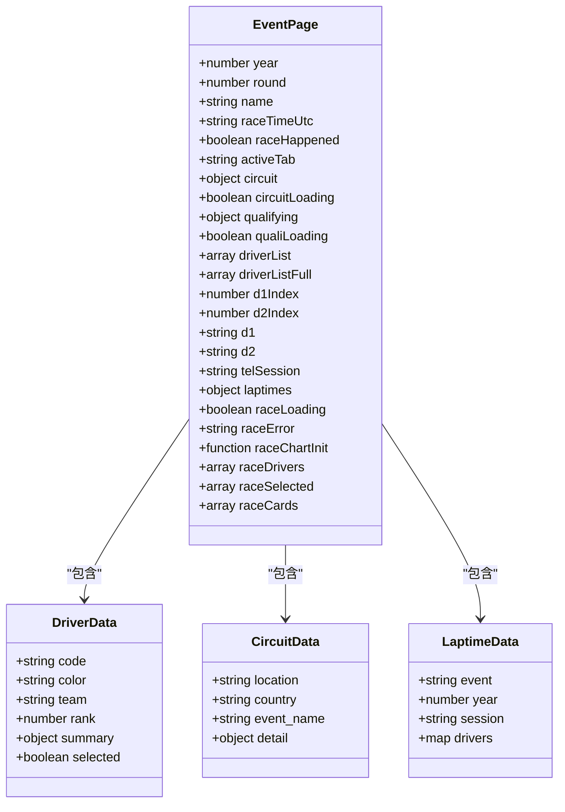

**图表来源**
- [miniprogram/pages/event/event.js:194-224](file://miniprogram/pages/event/event.js#L194-L224)

### 缓存策略

页面实现了多层次的数据缓存机制：

| 缓存类型 | TTL时间 | 缓存键生成 | 作用域 |
|---------|---------|-----------|--------|
| 事件列表 | 60分钟 | `/events` | 赛季所有事件信息 |
| 排位赛数据 | 10分钟 | `/qualifying:{year}:{round}` | 单站排位赛结果 |
| 圈时数据 | 10分钟 | `/laptimes:{year}:{round}:R` | 正赛圈时数据 |
| 遥测数据 | 10分钟 | `/telemetry:{year}:{round}:{d1}:{d2}:Q` | 车手遥测对比 |
| 赛道信息 | 60分钟 | `/circuit:{year}:{round}` | 赛道静态信息 |
| AI分析 | 30分钟 | `/analysis:{year}:{round}:{d1}:{d2}:Q` | 专业分析报告 |

**章节来源**
- [miniprogram/utils/api.js:3-15](file://miniprogram/utils/api.js#L3-L15)
- [miniprogram/utils/api.js:98-120](file://miniprogram/utils/api.js#L98-L120)

### 骨架屏实现

**新增** 页面实现了完整的骨架屏系统，提供流畅的加载体验：

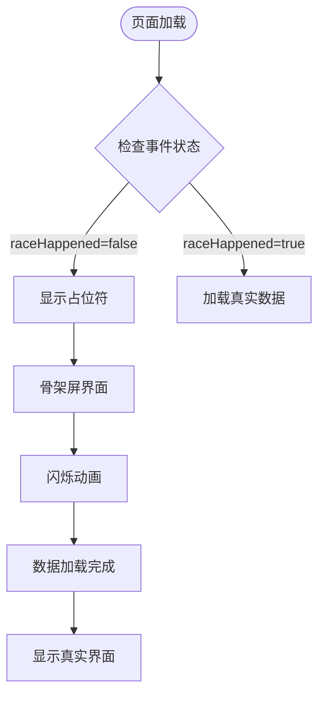

**图表来源**
- [miniprogram/pages/event/event.wxml:24-31](file://miniprogram/pages/event/event.wxml#L24-L31)
- [miniprogram/pages/event/event.wxml:115-122](file://miniprogram/pages/event/event.wxml#L115-L122)
- [miniprogram/pages/event/event.wxml:149-155](file://miniprogram/pages/event/event.wxml#L149-L155)

## 架构概览

### 整体架构流程

```mermaid
sequenceDiagram
participant User as 用户
participant Page as 赛事详情页面
participant API as API封装层
participant Backend as 后端服务
participant Cache as 本地缓存
participant Chart as 图表组件
User->>Page : 打开赛事详情页
Page->>Page : onLoad() 初始化数据
Page->>Page : 检查 raceHappened 状态
alt 事件未发生
Page->>Page : 显示占位符
else 事件已发生
Page->>API : getCircuit(year, round)
API->>Cache : 检查缓存
alt 缓存命中
Cache-->>API : 返回缓存数据
else 缓存未命中
API->>Backend : 发送HTTP请求
Backend-->>API : 返回最新数据
API->>Cache : 写入缓存
end
API-->>Page : 返回电路数据
Page->>Page : 渲染赛道信息
Page->>Chart : 初始化ECharts
end
User->>Page : 切换到正赛标签
Page->>API : getLaptimes(year, round, 'R')
API->>Backend : 获取圈时数据
Backend-->>API : 返回圈时数据
API-->>Page : 返回数据
Page->>Page : 构建图表选项
Page->>Chart : 更新图表数据
```

**图表来源**
- [miniprogram/pages/event/event.js:229-238](file://miniprogram/pages/event/event.js#L229-L238)
- [miniprogram/utils/api.js:98-120](file://miniprogram/utils/api.js#L98-L120)

### 数据流架构

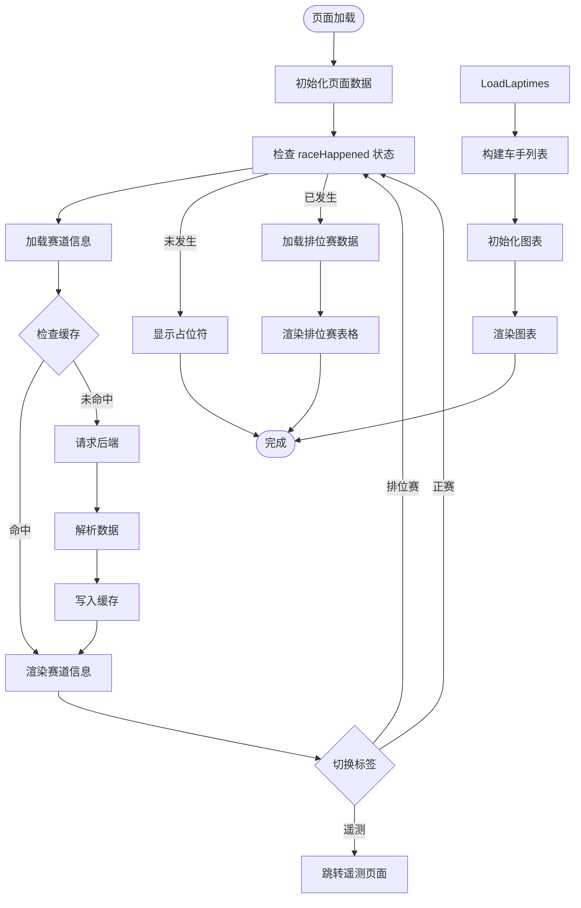

**图表来源**
- [miniprogram/pages/event/event.js:240-247](file://miniprogram/pages/event/event.js#L240-L247)
- [miniprogram/pages/event/event.js:284-299](file://miniprogram/pages/event/event.js#L284-L299)

## 详细组件分析

### 骨架屏系统

**新增** 骨架屏系统是本次更新的核心功能，提供了以下用户体验改进：

#### 骨架屏类型

| 骨架屏类型 | 使用场景 | HTML结构 | CSS类名 |
|-----------|---------|----------|---------|
| 赛道信息骨架屏 | 加载赛道详情时 | `<view class="skeleton-wrap">` | `.skeleton-wrap` |
| 排位赛骨架屏 | 加载排位赛结果时 | `<view class="sk-table-row">` | `.sk-table-row` |
| 正赛骨架屏 | 加载正赛圈时数据时 | `<view class="sk-card">` | `.sk-card` |

#### 骨架屏动画效果

骨架屏使用CSS动画实现闪烁效果，模拟真实数据加载过程：

```css
.sk-line {
  height: 24rpx;
  background: linear-gradient(90deg, #2a2a2a 25%, #333 50%, #2a2a2a 75%);
  background-size: 400% 100%;
  border-radius: 6rpx;
  margin-bottom: 16rpx;
  animation: shimmer 1.4s ease infinite;
}

@keyframes shimmer {
  0%   { background-position: 100% 0; }
  100% { background-position: -100% 0; }
}
```

**章节来源**
- [miniprogram/pages/event/event.wxml:24-31](file://miniprogram/pages/event/event.wxml#L24-L31)
- [miniprogram/pages/event/event.wxml:115-122](file://miniprogram/pages/event/event.wxml#L115-L122)
- [miniprogram/pages/event/event.wxml:149-155](file://miniprogram/pages/event/event.wxml#L149-L155)
- [miniprogram/pages/event/event.wxss:645-712](file://miniprogram/pages/event/event.wxss#L645-L712)

### 事件状态可视化

**新增** 通过 raceHappened 状态实现了智能的事件状态控制：

#### 事件状态判断逻辑

```javascript
const raceTimeUtc = options.race_time_utc ? decodeURIComponent(options.race_time_utc) : ''
const raceHappened = raceTimeUtc ? new Date(raceTimeUtc).getTime() < Date.now() : true
this.setData({ round, name, year, raceTimeUtc, raceHappened })
```

#### 状态控制的数据加载

```javascript
if (!this.data.raceHappened) return  // 未发生的赛事，不请求数据
```

#### 状态反馈界面

| 状态 | 界面反馈 | HTML结构 |
|------|---------|----------|
| 事件未发生 | 显示提示文本 | `<view class="loading-wrap"><text class="text-muted">排位赛尚未发生</text></view>` |
| 数据加载中 | 显示骨架屏 | `<view class="skeleton-wrap">` |
| 数据加载失败 | 显示错误信息 | `<view class="loading-wrap"><text class="text-muted">{{raceError}}</text></view>` |
| 数据加载完成 | 显示真实内容 | `<view class="race-ready">` |

**章节来源**
- [miniprogram/pages/event/event.js:238-247](file://miniprogram/pages/event/event.js#L238-L247)
- [miniprogram/pages/event/event.js:254-261](file://miniprogram/pages/event/event.js#L254-L261)
- [miniprogram/pages/event/event.wxml:114-115](file://miniprogram/pages/event/event.wxml#L114-L115)
- [miniprogram/pages/event/event.wxml:148-156](file://miniprogram/pages/event/event.wxml#L148-L156)

### 赛道信息模块

#### 数据结构设计

赛道信息模块负责展示F1比赛的基本信息，包括赛道特征、历史记录和策略建议：

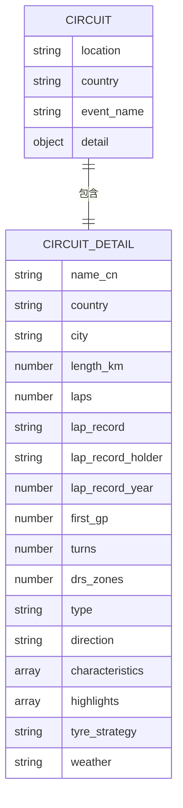

**图表来源**
- [backend/routers/events.py:480-505](file://backend/routers/events.py#L480-L505)

#### 动态渲染机制

页面采用条件渲染和数据绑定实现动态内容展示：

| 组件类型 | 渲染条件 | 数据源 | 样式类 |
|---------|---------|--------|--------|
| 基础信息卡片 | `circuit` 存在且非空 | `circuit.detail` | `.ci-card` |
| 圈速记录 | `circuit.detail.lap_record` 存在 | `circuit.detail` | `.ci-record-row` |
| 赛道特点 | `circuit.detail.characteristics` | `circuit.detail` | `.ci-tags` |
| 赛道亮点 | `circuit.detail.highlights` | `circuit.detail` | `.ci-highlight-row` |
| 轮胎策略 | `circuit.detail.tyre_strategy` | `circuit.detail` | `.ci-card` |
| 赛事天气 | `circuit.detail.weather` | `circuit.detail` | `.ci-card` |

**章节来源**
- [miniprogram/pages/event/event.wxml:15-96](file://miniprogram/pages/event/event.wxml#L15-L96)
- [miniprogram/pages/event/event.wxss:313-474](file://miniprogram/pages/event/event.wxss#L313-L474)

### 正赛圈时图表模块

#### 图表数据处理

正赛圈时图表模块实现了复杂的图表渲染逻辑，包括数据预处理、图表配置和交互功能：

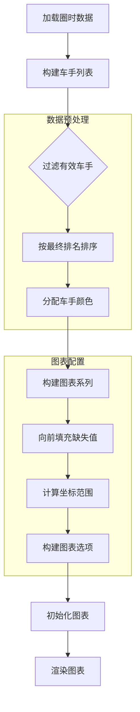

**图表来源**
- [miniprogram/pages/event/event.js:48-64](file://miniprogram/pages/event/event.js#L48-L64)
- [miniprogram/pages/event/event.js:67-191](file://miniprogram/pages/event/event.js#L67-L191)

#### 图表交互功能

图表模块提供了丰富的交互功能：

| 交互类型 | 触发方式 | 功能描述 | 实现方法 |
|---------|---------|----------|----------|
| 车手选择 | 点击车手芯片 | 切换图表中显示的车手 | `onRaceDriverTap()` |
| 图表缩放 | 滚动鼠标/触摸 | 放大缩小图表视图 | ECharts内置功能 |
| 数据标注 | 鼠标悬停 | 显示具体圈时和位置信息 | Tooltip配置 |
| 进站标记 | 圆点标记 | 标识车手进站圈 | `markPoint`配置 |

**章节来源**
- [miniprogram/pages/event/event.js:345-359](file://miniprogram/pages/event/event.js#L345-L359)
- [miniprogram/pages/event/event.js:135-143](file://miniprogram/pages/event/event.js#L135-L143)

### 排位赛结果模块

#### 数据结构设计

排位赛结果模块采用表格形式展示车手在三个阶段的表现：

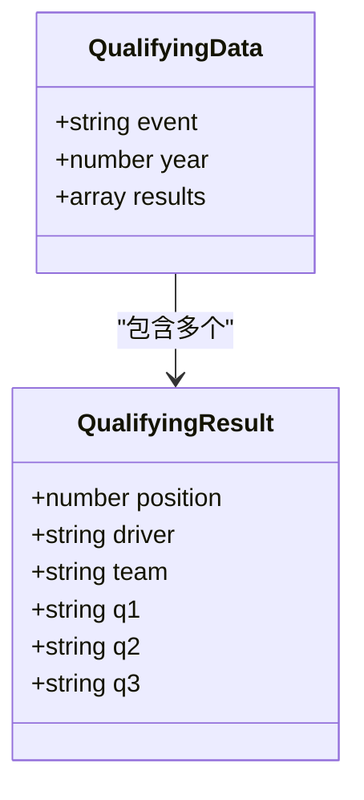

**图表来源**
- [backend/routers/qualifying.py:13-27](file://backend/routers/qualifying.py#L13-L27)

#### 表格渲染逻辑

排位赛表格采用响应式设计，支持不同屏幕尺寸的自适应：

| 列类型 | 宽度 | 对齐方式 | 样式应用 |
|-------|------|---------|----------|
| 排名 | 50rpx | 居中 | `.col-pos` |
| 车手信息 | 自适应 | 左对齐 | `.col-driver` |
| Q1时间 | 150rpx | 右对齐 | `.col-time` |
| Q2时间 | 150rpx | 右对齐 | `.col-time` |
| Q3时间 | 150rpx | 右对齐 | `.col-time` |

**章节来源**
- [miniprogram/pages/event/event.wxml:98-124](file://miniprogram/pages/event/event.wxml#L98-L124)
- [miniprogram/pages/event/event.wxss:37-54](file://miniprogram/pages/event/event.wxss#L37-L54)

### 遥测对比模块

#### 导航集成

赛事详情页面集成了遥测对比功能，用户可以通过标签页直接访问：

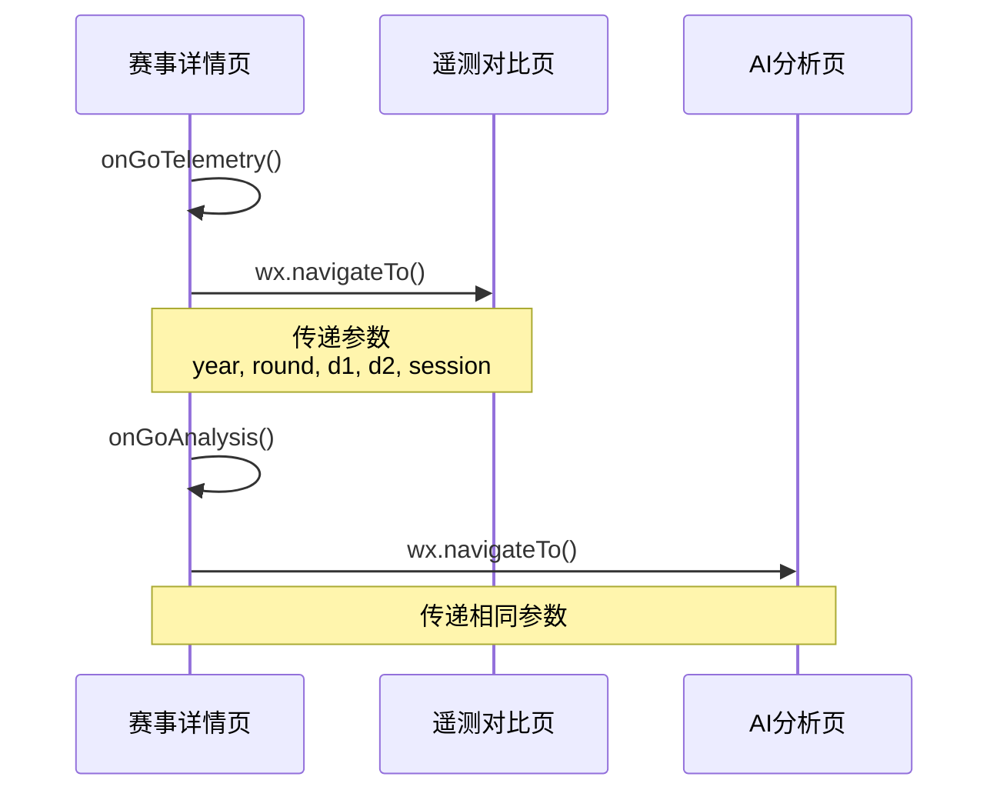

**图表来源**
- [miniprogram/pages/event/event.js:371-379](file://miniprogram/pages/event/event.js#L371-L379)

**章节来源**
- [miniprogram/pages/event/event.js:371-379](file://miniprogram/pages/event/event.js#L371-L379)

## 依赖关系分析

### 前端组件依赖

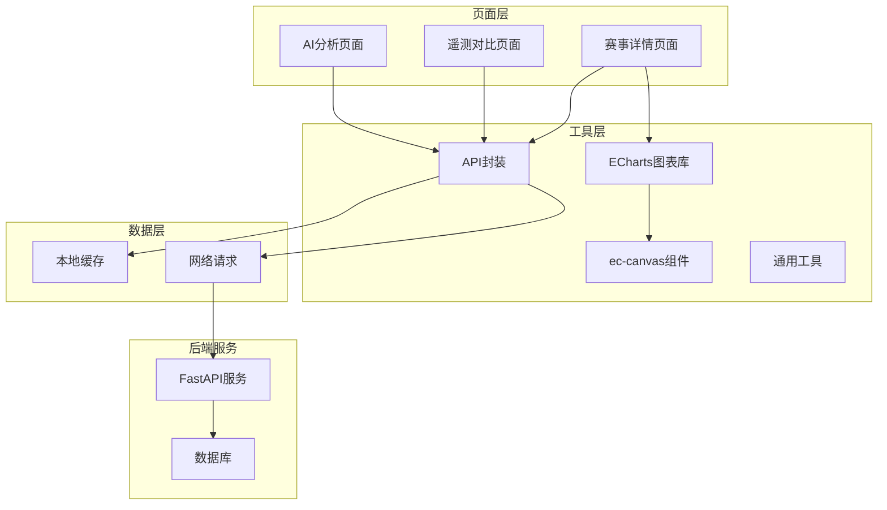

**图表来源**
- [miniprogram/utils/api.js:122-299](file://miniprogram/utils/api.js#L122-L299)
- [miniprogram/components/ec-canvas/ec-canvas.js:31-292](file://miniprogram/components/ec-canvas/ec-canvas.js#L31-L292)

### 数据依赖关系

页面的数据流遵循严格的依赖关系：

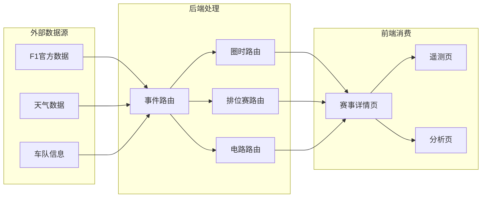

**图表来源**
- [backend/routers/events.py:21-53](file://backend/routers/events.py#L21-L53)
- [backend/routers/laptimes.py:38-110](file://backend/routers/laptimes.py#L38-L110)
- [backend/routers/qualifying.py:7-29](file://backend/routers/qualifying.py#L7-L29)

**章节来源**
- [miniprogram/utils/api.js:122-299](file://miniprogram/utils/api.js#L122-L299)

## 性能考虑

### 缓存策略优化

页面实现了多层次的缓存策略来提升性能：

1. **本地存储缓存**：使用微信小程序的 `wx.setStorageSync` 实现持久化缓存
2. **内存缓存**：在API封装层维护内存中的缓存副本
3. **TTL控制**：不同类型的请求设置不同的缓存过期时间

### 图表性能优化

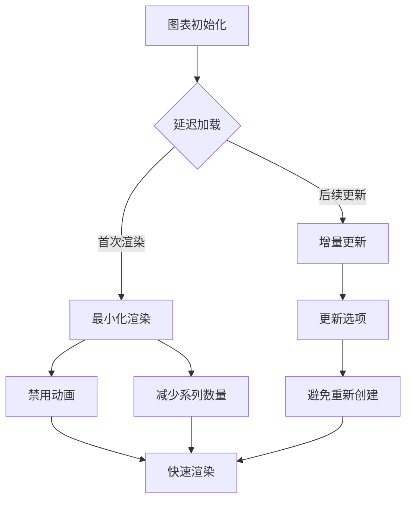

**图表来源**
- [miniprogram/pages/event/event.js:329-343](file://miniprogram/pages/event/event.js#L329-L343)
- [miniprogram/components/ec-canvas/ec-canvas.js:55-66](file://miniprogram/components/ec-canvas/ec-canvas.js#L55-L66)

### 网络请求优化

页面采用了智能的网络请求策略：

| 优化策略 | 实现方式 | 性能收益 |
|---------|---------|----------|
| 请求去重 | 缓存请求参数生成唯一key | 避免重复请求 |
| 失败重试 | 自动重试一次机制 | 提高成功率 |
| 超时控制 | 20秒超时限制 | 防止长时间等待 |
| 并发控制 | 合理的请求顺序 | 减少资源竞争 |

### 骨架屏性能优化

**新增** 骨架屏系统实现了以下性能优化：

1. **即时响应**：骨架屏立即显示，避免空白等待
2. **渐进式加载**：骨架屏闪烁动画模拟真实加载过程
3. **内存优化**：骨架屏使用简单的CSS动画，占用内存极少
4. **渲染优化**：骨架屏元素简单，渲染性能优异

**章节来源**
- [miniprogram/utils/api.js:45-76](file://miniprogram/utils/api.js#L45-L76)

## 故障排除指南

### 常见问题及解决方案

#### 数据加载失败

**问题现象**：页面显示"数据加载失败"或空白状态

**可能原因**：
1. 网络连接异常
2. 后端服务不可用
3. 缓存数据损坏
4. 参数传递错误

**解决步骤**：
1. 检查网络连接状态
2. 刷新页面重试
3. 清除应用缓存
4. 重新进入页面

#### 图表渲染异常

**问题现象**：图表显示不完整或空白

**可能原因**：
1. Canvas初始化失败
2. 数据格式不正确
3. 设备兼容性问题

**解决步骤**：
1. 检查浏览器控制台错误
2. 验证数据格式
3. 更新微信基础库版本
4. 重启应用

#### 缓存数据过期

**问题现象**：显示过时的赛事信息

**解决步骤**：
1. 手动刷新页面
2. 等待缓存自然过期
3. 清除本地缓存
4. 检查服务器状态

#### 骨架屏显示问题

**问题现象**：骨架屏不显示或显示异常

**可能原因**：
1. raceHappened 状态判断错误
2. 骨架屏CSS样式冲突
3. 数据加载逻辑异常

**解决步骤**：
1. 检查 raceHappened 状态值
2. 验证骨架屏CSS类名
3. 检查数据加载流程
4. 查看控制台错误日志

**章节来源**
- [miniprogram/pages/event/event.js:284-299](file://miniprogram/pages/event/event.js#L284-L299)
- [miniprogram/utils/api.js:26-40](file://miniprogram/utils/api.js#L26-L40)

### 错误处理机制

页面实现了完善的错误处理机制：

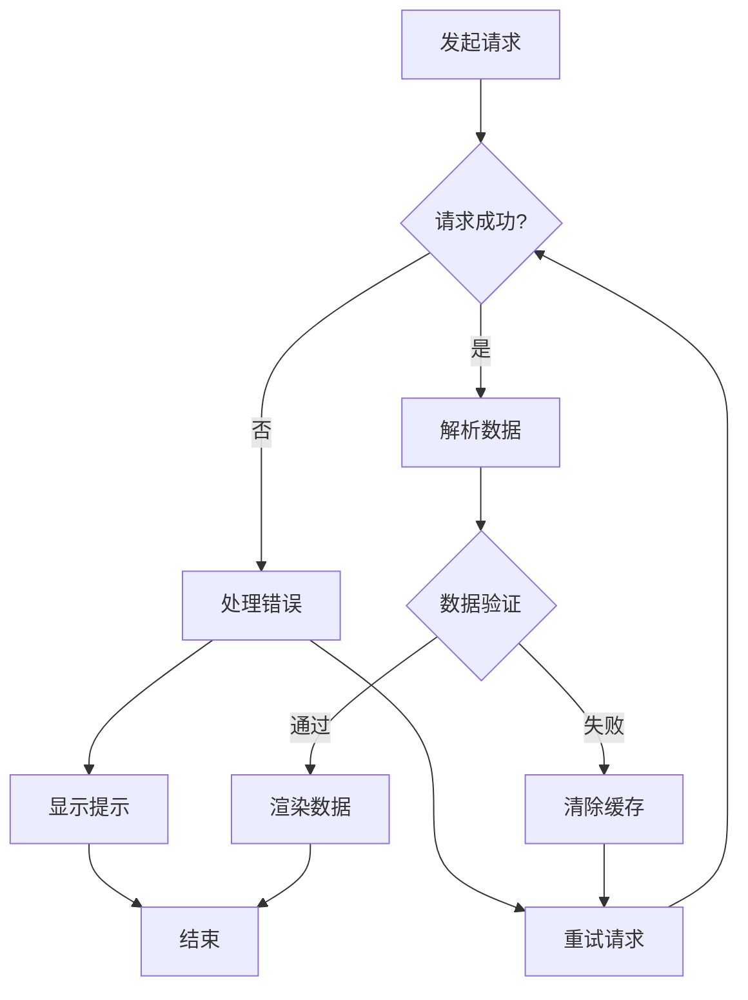

**图表来源**
- [miniprogram/utils/api.js:45-76](file://miniprogram/utils/api.js#L45-L76)

## 结论

Fast-F1 微信小程序赛事详情页面是一个功能完整、性能优化的移动端应用。通过合理的架构设计和多种优化策略，该页面能够为用户提供流畅的F1赛事信息浏览体验。

**更新** 本次更新显著提升了用户体验，通过骨架屏系统和事件状态可视化改进，用户能够获得更加流畅和直观的使用体验。

### 主要优势

1. **模块化设计**：清晰的组件分离和职责划分
2. **性能优化**：多层次缓存和智能请求策略
3. **用户体验**：丰富的交互功能和响应式设计
4. **数据准确性**：实时数据获取和严格的数据验证
5. **加载体验**：骨架屏系统提供流畅的加载体验
6. **状态控制**：智能事件状态判断和数据加载控制

### 技术亮点

1. **ECharts集成**：强大的图表渲染能力和交互体验
2. **智能缓存**：根据数据特性设置合适的缓存策略
3. **错误处理**：完善的异常捕获和恢复机制
4. **跨平台兼容**：适配不同设备和系统版本
5. **骨架屏实现**：创新的加载体验设计
6. **状态可视化**：直观的事件状态反馈

该页面为F1爱好者提供了全面、准确、实时的赛事信息服务，是移动应用开发的优秀实践案例。

## 附录

### API接口规范

| 接口名称 | 方法 | 路径 | 参数 | 返回值 |
|---------|------|------|------|--------|
| 获取事件列表 | GET | `/events` | year | 事件数组 |
| 获取排位赛 | GET | `/qualifying` | year, round_num | 排位赛结果 |
| 获取圈时数据 | GET | `/laptimes` | year, round_num, session | 圈时数据 |
| 获取遥测数据 | GET | `/telemetry` | year, round_num, d1, d2, session | 遥测数据 |
| 获取赛道信息 | GET | `/events/{round_num}/circuit` | year | 赛道详情 |

### 样式规范

页面采用统一的设计语言和样式规范：

- **字体系统**：使用系统默认字体，确保跨平台一致性
- **颜色体系**：基于F1品牌色彩设计，红色作为主色调
- **间距规范**：采用rpx单位，确保在不同设备上的比例一致
- **响应式设计**：适配手机和平板等不同屏幕尺寸
- **骨架屏样式**：使用CSS动画实现闪烁效果

### 开发最佳实践

1. **代码组织**：按照功能模块划分文件，保持代码结构清晰
2. **错误处理**：为每个异步操作添加适当的错误处理逻辑
3. **性能监控**：定期检查页面加载时间和内存使用情况
4. **用户体验**：提供明确的状态反馈和加载指示
5. **状态管理**：合理使用 raceHappened 等状态变量控制数据加载
6. **骨架屏设计**：为所有异步加载内容提供合适的骨架屏占位符

### 骨架屏设计规范

**新增** 骨架屏系统的使用规范：

1. **占位符设计**：使用与真实内容相同的布局结构
2. **动画效果**：使用CSS动画实现平滑的闪烁效果
3. **颜色搭配**：使用深色背景和浅色内容的对比
4. **响应式适配**：确保在不同屏幕尺寸下的显示效果
5. **性能考虑**：避免过度复杂的动画影响性能