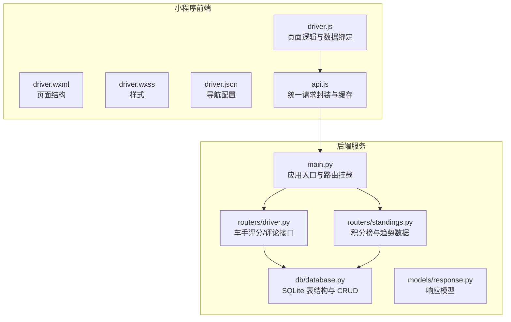
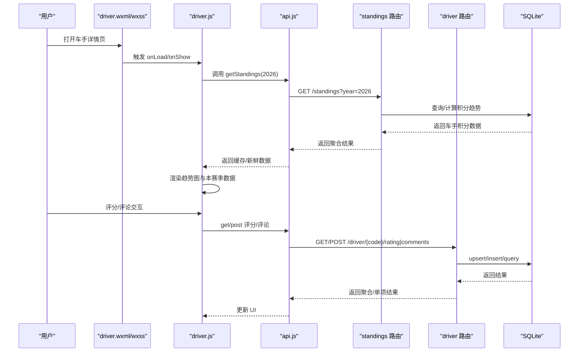
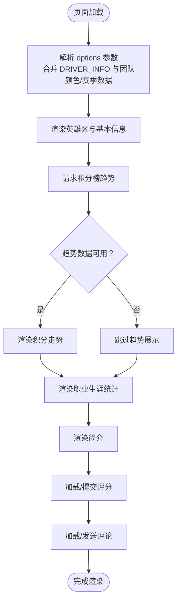
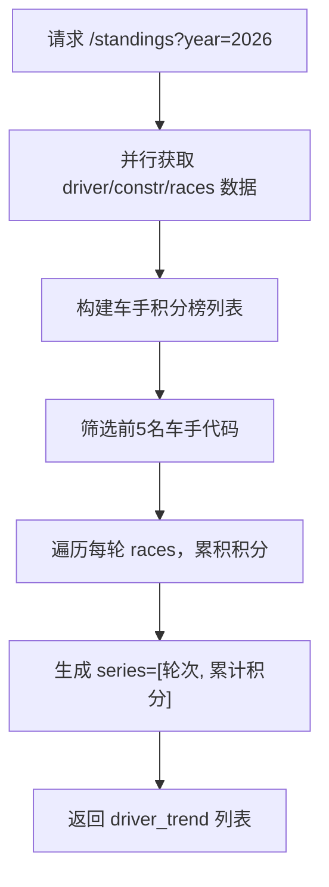
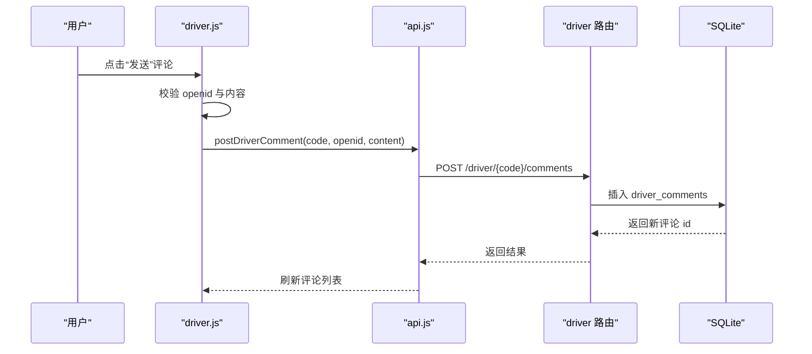
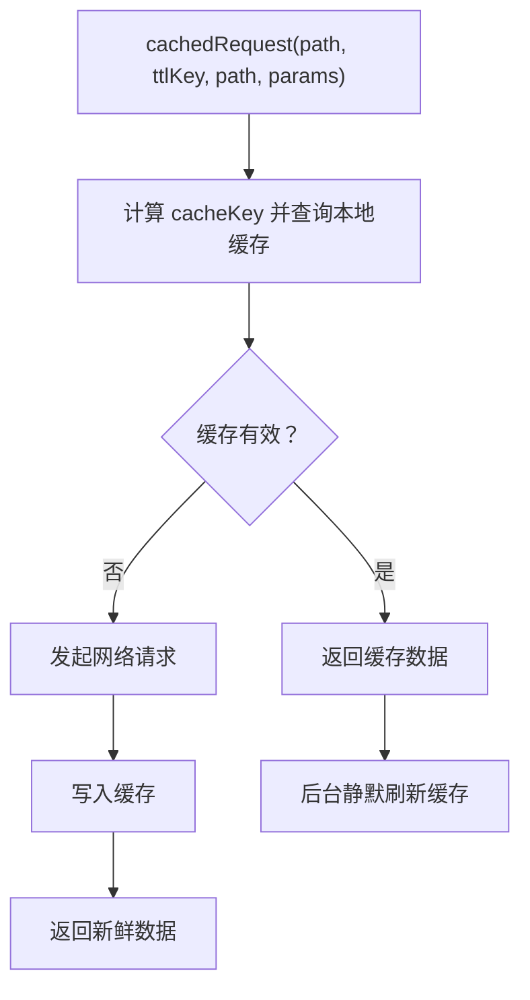
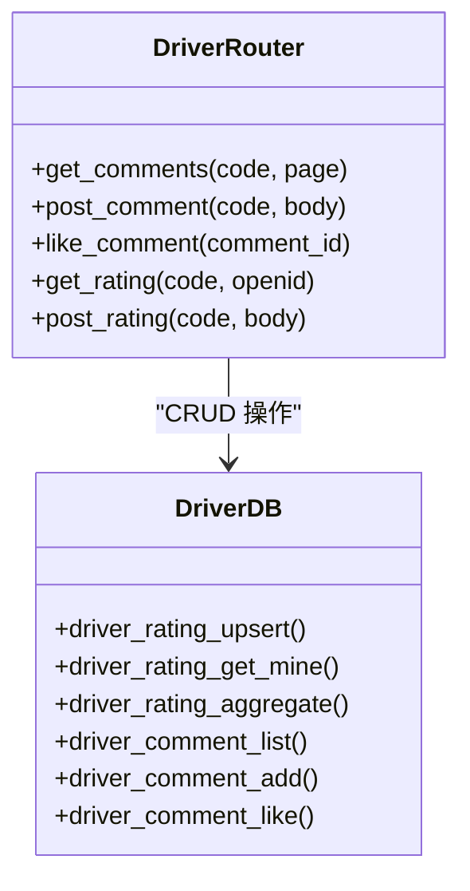
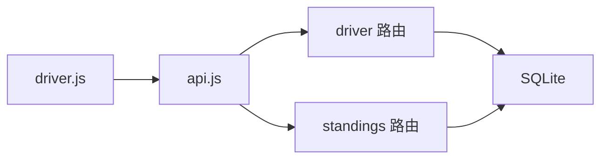

# 车手详情页面

<cite>
**本文引用的文件**
- [miniprogram/pages/driver/driver.js](file://miniprogram/pages/driver/driver.js)
- [miniprogram/pages/driver/driver.json](file://miniprogram/pages/driver/driver.json)
- [miniprogram/pages/driver/driver.wxml](file://miniprogram/pages/driver/driver.wxml)
- [miniprogram/pages/driver/driver.wxss](file://miniprogram/pages/driver/driver.wxss)
- [miniprogram/utils/api.js](file://miniprogram/utils/api.js)
- [backend/routers/driver.py](file://backend/routers/driver.py)
- [backend/routers/standings.py](file://backend/routers/standings.py)
- [backend/db/database.py](file://backend/db/database.py)
- [backend/models/response.py](file://backend/models/response.py)
- [backend/main.py](file://backend/main.py)
</cite>

## 目录
1. [简介](#简介)
2. [项目结构](#项目结构)
3. [核心组件](#核心组件)
4. [架构总览](#架构总览)
5. [详细组件分析](#详细组件分析)
6. [依赖分析](#依赖分析)
7. [性能考虑](#性能考虑)
8. [故障排查指南](#故障排查指南)
9. [结论](#结论)
10. [附录](#附录)

## 简介
本文件面向 Fast-F1 微信小程序的“车手详情”页面，系统性阐述页面的数据结构、展示逻辑、交互流程与后端集成方式。重点覆盖以下方面：
- 个人资料与头像/背景素材的个性化展示
- 职业生涯统计与成就记录（赛季数、参赛场次、领奖台、杆位、最快圈）
- 积分走势的动态呈现与计算逻辑
- 评分与评论的社区互动功能
- 数据动态更新、缓存策略与离线显示
- 页面导航、参数传递与与其它页面的关联
- 与后端 API 的数据获取与车手数据完整性校验

## 项目结构
车手详情页面位于小程序前端目录，配套的后端接口集中在 FastAPI 服务中，数据持久化采用 SQLite。

**图表来源**
- [miniprogram/pages/driver/driver.js:1-469](file://miniprogram/pages/driver/driver.js#L1-L469)
- [miniprogram/utils/api.js:1-299](file://miniprogram/utils/api.js#L1-L299)
- [backend/main.py:1-157](file://backend/main.py#L1-L157)
- [backend/routers/standings.py:1-145](file://backend/routers/standings.py#L1-L145)
- [backend/routers/driver.py:1-116](file://backend/routers/driver.py#L1-L116)
- [backend/db/database.py:1-200](file://backend/db/database.py#L1-L200)
- [backend/models/response.py:1-14](file://backend/models/response.py#L1-L14)

**章节来源**
- [miniprogram/pages/driver/driver.js:298-315](file://miniprogram/pages/driver/driver.js#L298-L315)
- [miniprogram/utils/api.js:122-138](file://miniprogram/utils/api.js#L122-L138)
- [backend/routers/standings.py:64-145](file://backend/routers/standings.py#L64-L145)
- [backend/routers/driver.py:44-116](file://backend/routers/driver.py#L44-L116)
- [backend/db/database.py:133-159](file://backend/db/database.py#L133-L159)

## 核心组件
- 页面容器与数据绑定：通过 driver.js 的 Page 对象管理页面状态，包括车手基础信息、本赛季数据、积分趋势、评分与评论等。
- 结构化展示：driver.wxml 定义英雄区、本赛季数据、积分走势、职业生涯、简介、评分与评论等区块。
- 样式与主题：driver.wxss 提供深色主题与品牌色（如 #e10600）的视觉规范；driver.json 控制导航栏外观。
- 请求与缓存：api.js 封装 wx.request，提供带 TTL 的本地缓存与二次回源刷新能力；统一暴露 driver 与 standings 相关接口。
- 后端接口：standings 路由负责积分榜与趋势数据；driver 路由负责评分与评论的增删查改。

**章节来源**
- [miniprogram/pages/driver/driver.js:273-296](file://miniprogram/pages/driver/driver.js#L273-L296)
- [miniprogram/pages/driver/driver.wxml:1-188](file://miniprogram/pages/driver/driver.wxml#L1-L188)
- [miniprogram/pages/driver/driver.wxss:1-461](file://miniprogram/pages/driver/driver.wxss#L1-L461)
- [miniprogram/pages/driver/driver.json:1-7](file://miniprogram/pages/driver/driver.json#L1-L7)
- [miniprogram/utils/api.js:17-120](file://miniprogram/utils/api.js#L17-L120)

## 架构总览
车手详情页面从前端到后端的数据流如下：

**图表来源**
- [miniprogram/pages/driver/driver.js:298-332](file://miniprogram/pages/driver/driver.js#L298-L332)
- [miniprogram/utils/api.js:137-138](file://miniprogram/utils/api.js#L137-L138)
- [backend/routers/standings.py:64-145](file://backend/routers/standings.py#L64-L145)
- [backend/routers/driver.py:44-116](file://backend/routers/driver.py#L44-L116)
- [backend/db/database.py:133-159](file://backend/db/database.py#L133-L159)

## 详细组件分析

### 页面结构与展示逻辑
- 英雄区：展示车号、中文名、英文名、国旗、国籍、所属车队与品牌色边框。
- 本赛季数据：显示当前排名、积分、分站冠军数量与年龄（基于出生日期动态计算）。
- 积分走势：以柱状图模拟折线趋势，按轮次累计积分，最高值决定柱高比例。
- 职业生涯统计：赛季数、参赛场次、领奖台、杆位、最快圈速。
- 简介：车手个人介绍文本。
- 车迷评分：支持 5 维度打分（单星制 1-5），提交后展示社区平均分与各维度占比。
- 车迷留言：分页加载评论，支持点赞与发送（需注册论坛昵称）。

**图表来源**
- [miniprogram/pages/driver/driver.js:298-315](file://miniprogram/pages/driver/driver.js#L298-L315)
- [miniprogram/pages/driver/driver.js:322-332](file://miniprogram/pages/driver/driver.js#L322-L332)
- [miniprogram/pages/driver/driver.wxml:3-91](file://miniprogram/pages/driver/driver.wxml#L3-L91)

**章节来源**
- [miniprogram/pages/driver/driver.wxml:3-188](file://miniprogram/pages/driver/driver.wxml#L3-L188)
- [miniprogram/pages/driver/driver.wxss:6-194](file://miniprogram/pages/driver/driver.wxss#L6-L194)

### 统计数据与计算逻辑
- 年龄计算：根据出生日期与当前日期计算精确年龄，考虑月份与日。
- 职业生涯统计：来源于前端内置 DRIVER_INFO 中的 careerStats 字段，包含赛季数、参赛场次、领奖台、杆位、最快圈速。
- 积分走势：后端通过并行拉取车手积分榜、车队积分榜与轮次结果，预计算前 5 名车手每轮累计积分序列；页面仅展示目标车手的趋势数据。

**图表来源**
- [backend/routers/standings.py:51-61](file://backend/routers/standings.py#L51-L61)
- [backend/routers/standings.py:104-132](file://backend/routers/standings.py#L104-L132)

**章节来源**
- [miniprogram/pages/driver/driver.js:264-271](file://miniprogram/pages/driver/driver.js#L264-L271)
- [miniprogram/pages/driver/driver.js:3-254](file://miniprogram/pages/driver/driver.js#L3-L254)
- [backend/routers/standings.py:64-145](file://backend/routers/standings.py#L64-L145)

### 个性化展示：头像、照片与背景素材
- 头像：评论区使用作者昵称首字母作为占位头像，无实际头像字段。
- 背景与品牌色：英雄区边框与关键数值采用品牌色（如 #e10600），由传入 color 参数控制。
- 车号与姓名：英雄区突出显示车号与中文名，英文名与国籍/旗帜增强识别度。

**章节来源**
- [miniprogram/pages/driver/driver.wxml:6-18](file://miniprogram/pages/driver/driver.wxml#L6-L18)
- [miniprogram/pages/driver/driver.wxml:143-151](file://miniprogram/pages/driver/driver.wxml#L143-L151)
- [miniprogram/pages/driver/driver.wxss:16-56](file://miniprogram/pages/driver/driver.wxss#L16-L56)

### 用户交互功能
- 查看历史：通过“加载更多”分页加载评论。
- 比较数据：积分走势以柱状图直观对比不同轮次累计积分。
- 关注车手：页面未提供“关注”按钮，后续可扩展至 driver_follow 表与接口。
- 登录态：未登录用户无法发送评论，引导前往注册页。

**图表来源**
- [miniprogram/pages/driver/driver.js:438-449](file://miniprogram/pages/driver/driver.js#L438-L449)
- [miniprogram/utils/api.js:281-288](file://miniprogram/utils/api.js#L281-L288)
- [backend/routers/driver.py:65-82](file://backend/routers/driver.py#L65-L82)
- [backend/db/database.py:148-159](file://backend/db/database.py#L148-L159)

**章节来源**
- [miniprogram/pages/driver/driver.js:417-463](file://miniprogram/pages/driver/driver.js#L417-L463)
- [miniprogram/pages/driver/driver.wxml:139-178](file://miniprogram/pages/driver/driver.wxml#L139-L178)

### 数据动态更新、缓存策略与离线显示
- 前端缓存：api.js 提供带 TTL 的本地缓存，命中缓存后立即返回，同时静默刷新缓存，保证离线可用与快速响应。
- 后端缓存：standings 路由使用内存缓存（TTL 2 小时），减少频繁拉取 Ergast 数据。
- 离线显示：当网络异常时，页面仍可展示 DRIVER_INFO 与本地评分缓存（匿名用户）。

**图表来源**
- [miniprogram/utils/api.js:98-120](file://miniprogram/utils/api.js#L98-L120)
- [backend/routers/standings.py:27-42](file://backend/routers/standings.py#L27-L42)

**章节来源**
- [miniprogram/utils/api.js:3-15](file://miniprogram/utils/api.js#L3-L15)
- [miniprogram/utils/api.js:26-41](file://miniprogram/utils/api.js#L26-L41)
- [backend/routers/standings.py:64-70](file://backend/routers/standings.py#L64-L70)

### 导航逻辑、参数传递与页面关联
- 参数来源：onLoad 从 options 解析 code、color、team、points、position、wins 等，用于渲染页面标题与赛季数据。
- 页面标题：根据 info.nameCn 设置导航栏标题。
- 关联页面：未见“车手历史”独立页面；可通过评论区与论坛模块间接关联相关内容。

**章节来源**
- [miniprogram/pages/driver/driver.js:298-315](file://miniprogram/pages/driver/driver.js#L298-L315)
- [miniprogram/pages/driver/driver.json:1-7](file://miniprogram/pages/driver/driver.json#L1-L7)

### 与后端 API 的数据获取与数据完整性验证
- 评分接口：支持获取社区聚合与我的评分，提交评分时进行 1-5 的范围校验。
- 评论接口：校验 openid 存在与内容长度，返回格式化的时间字符串。
- 数据完整性：后端对车手代码进行白名单校验，防止非法访问。

**图表来源**
- [backend/routers/driver.py:44-116](file://backend/routers/driver.py#L44-L116)
- [backend/db/database.py:133-159](file://backend/db/database.py#L133-L159)

**章节来源**
- [backend/routers/driver.py:30-42](file://backend/routers/driver.py#L30-L42)
- [backend/routers/driver.py:91-116](file://backend/routers/driver.py#L91-L116)
- [backend/db/database.py:133-159](file://backend/db/database.py#L133-L159)

## 依赖分析
- 前端依赖：driver.js 依赖 api.js；api.js 依赖 app.globalData.BASE_URL 与缓存工具。
- 后端依赖：driver 路由依赖 db 层；standings 路由依赖 fastf1.ergast 并行抓取数据。
- 数据一致性：评分与评论均以 openid 唯一约束，确保用户对同一车手仅能提交一次评分/评论。

**图表来源**
- [miniprogram/pages/driver/driver.js:1-2](file://miniprogram/pages/driver/driver.js#L1-L2)
- [miniprogram/utils/api.js:122-148](file://miniprogram/utils/api.js#L122-L148)
- [backend/routers/standings.py:1-145](file://backend/routers/standings.py#L1-L145)
- [backend/routers/driver.py:1-116](file://backend/routers/driver.py#L1-L116)
- [backend/db/database.py:133-159](file://backend/db/database.py#L133-L159)

**章节来源**
- [backend/main.py:40-41](file://backend/main.py#L40-L41)
- [backend/db/database.py:133-159](file://backend/db/database.py#L133-L159)

## 性能考虑
- 前端缓存：合理设置 CACHE_TTL，平衡实时性与性能；命中缓存时优先返回，后台异步刷新。
- 后端并发：standings 并行拉取三个 Ergast 接口，显著降低延迟。
- 图表渲染：积分走势使用纯视图元素绘制，避免引入重型图表库，提升首屏性能。
- 网络重试：请求封装包含失败自动重试一次，提高稳定性。

[本节为通用建议，无需特定文件引用]

## 故障排查指南
- 无法加载积分走势：检查 /standings 接口是否返回 driver_trend；确认车手是否在前 5 名。
- 评分提交失败：检查 openid 是否存在；确认评分值在 1-5 范围内。
- 评论发送失败：确认用户已注册论坛昵称；检查内容长度与空值。
- 缓存未更新：尝试强制刷新（后端支持 force 参数的分析接口），或等待 TTL 过期。

**章节来源**
- [miniprogram/utils/api.js:140-148](file://miniprogram/utils/api.js#L140-L148)
- [backend/routers/driver.py:102-108](file://backend/routers/driver.py#L102-L108)
- [backend/routers/driver.py:65-82](file://backend/routers/driver.py#L65-L82)

## 结论
车手详情页面以简洁清晰的信息层级与品牌化视觉设计为核心，结合前后端缓存与并发优化，实现了稳定高效的用户体验。评分与评论体系完善，便于社区互动；积分走势直观展示车手竞技状态。后续可在“关注车手”“车手历史”等方面进一步扩展，以增强用户粘性与数据深度。

[本节为总结性内容，无需特定文件引用]

## 附录
- 页面生命周期：onLoad 解析参数并初始化数据；onShow 用于刷新登录态。
- 主题色：通过 color 参数注入，贯穿英雄区边框、关键数值与评分星标。
- 本地评分缓存：匿名用户评分会持久化到本地存储，避免重复提交。

**章节来源**
- [miniprogram/pages/driver/driver.js:298-320](file://miniprogram/pages/driver/driver.js#L298-L320)
- [miniprogram/pages/driver/driver.js:337-362](file://miniprogram/pages/driver/driver.js#L337-L362)
- [miniprogram/pages/driver/driver.wxss:242-247](file://miniprogram/pages/driver/driver.wxss#L242-L247)