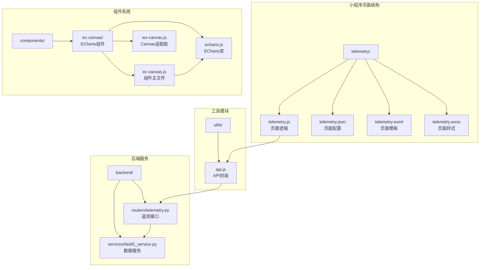
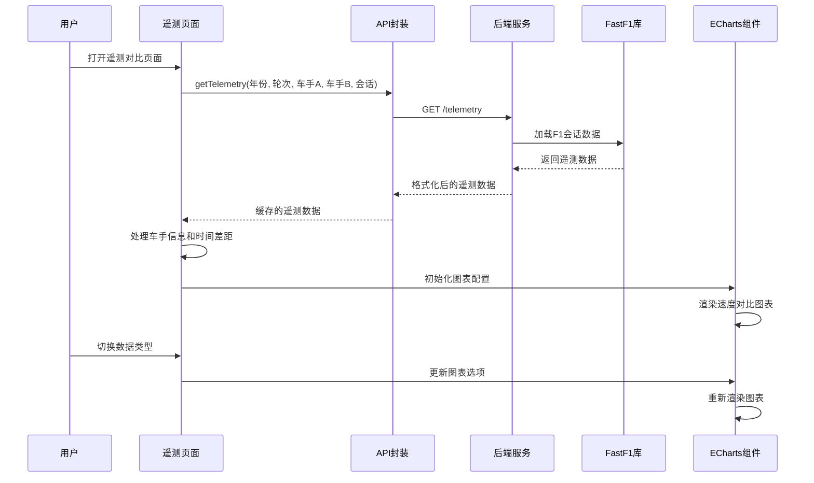
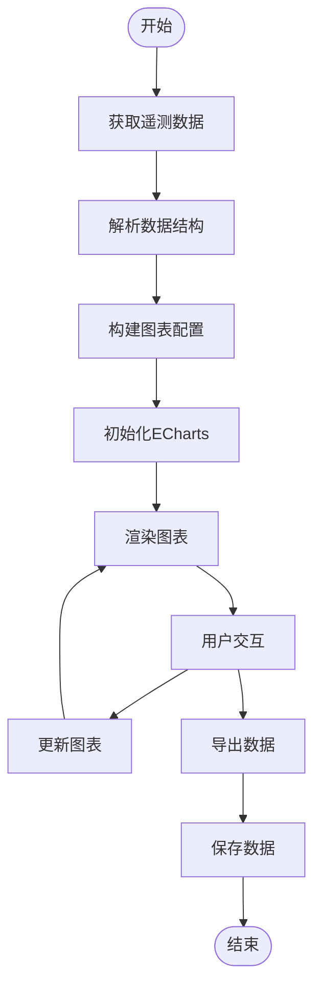
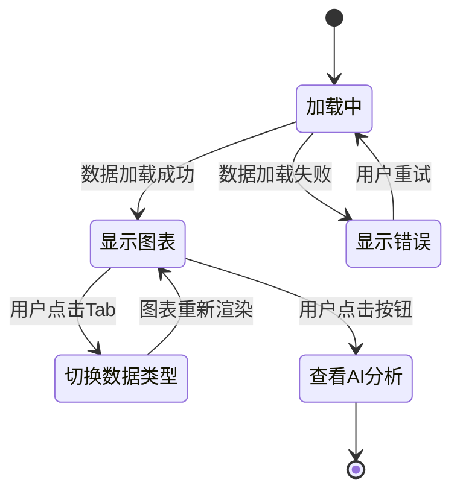
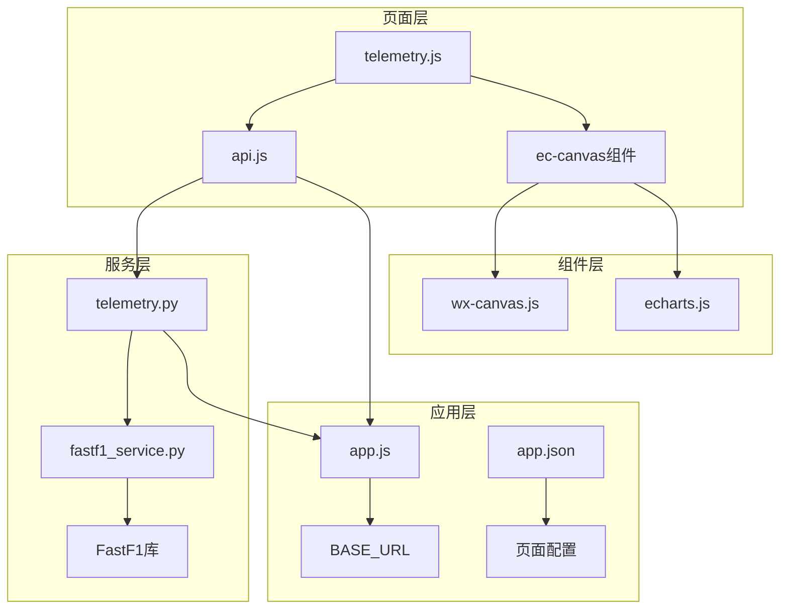

# 遥测对比页面

<cite>
**本文档引用的文件**
- [telemetry.js](file://miniprogram/pages/telemetry/telemetry.js)
- [telemetry.json](file://miniprogram/pages/telemetry/telemetry.json)
- [telemetry.wxml](file://miniprogram/pages/telemetry/telemetry.wxml)
- [telemetry.wxss](file://miniprogram/pages/telemetry/telemetry.wxss)
- [api.js](file://miniprogram/utils/api.js)
- [app.js](file://miniprogram/app.js)
- [app.json](file://miniprogram/app.json)
- [ec-canvas.js](file://miniprogram/components/ec-canvas/ec-canvas.js)
- [wx-canvas.js](file://miniprogram/components/ec-canvas/wx-canvas.js)
- [echarts.js](file://miniprogram/components/ec-canvas/echarts.js)
- [telemetry.py](file://backend/routers/telemetry.py)
- [fastf1_service.py](file://backend/services/fastf1_service.py)
- [analysis.js](file://miniprogram/pages/analysis/analysis.js)
</cite>

## 目录
1. [简介](#简介)
2. [项目结构](#项目结构)
3. [核心组件](#核心组件)
4. [架构概览](#架构概览)
5. [详细组件分析](#详细组件分析)
6. [依赖关系分析](#依赖关系分析)
7. [性能考虑](#性能考虑)
8. [故障排除指南](#故障排除指南)
9. [结论](#结论)

## 简介

Fast-F1 微信小程序遥测对比页面是一个专门用于比较两位车手在同一场比赛中的遥测数据的可视化界面。该页面实现了多车手数据对比的核心功能，包括实时遥测数据的获取、处理和可视化展示。

该页面基于 ECharts 图表库，在微信小程序环境中提供了高性能的图表渲染能力。用户可以通过简单的界面操作来选择不同的车手、数据类型和时间范围，实时查看两辆赛车的遥测数据对比。

## 项目结构

遥测对比页面位于小程序的 `miniprogram/pages/telemetry/` 目录下，采用标准的小程序页面结构：

**图表来源**
- [telemetry.js:1-156](file://miniprogram/pages/telemetry/telemetry.js#L1-L156)
- [telemetry.json:1-10](file://miniprogram/pages/telemetry/telemetry.json#L1-L10)
- [ec-canvas.js:1-292](file://miniprogram/components/ec-canvas/ec-canvas.js#L1-L292)

**章节来源**
- [telemetry.js:1-156](file://miniprogram/pages/telemetry/telemetry.js#L1-L156)
- [telemetry.json:1-10](file://miniprogram/pages/telemetry/telemetry.json#L1-L10)
- [telemetry.wxml:1-74](file://miniprogram/pages/telemetry/telemetry.wxml#L1-L74)
- [telemetry.wxss:1-124](file://miniprogram/pages/telemetry/telemetry.wxss#L1-L124)

## 核心组件

### 页面控制器 (telemetry.js)

页面控制器是遥测对比功能的核心，负责数据获取、图表渲染和用户交互处理。

**主要功能特性：**
- **数据获取与处理**：通过 API 接口获取遥测数据，处理车手信息、时间差距和数据质量提示
- **图表渲染**：集成 ECharts 实现多车手数据对比可视化
- **用户交互**：支持车手选择、数据类型切换和时间范围选择
- **性能优化**：实现懒加载和内存管理策略

**关键数据结构：**
- 支持的数据通道：速度、油门、刹车、档位
- Y轴配置：每个数据类型的最小值、最大值和单位
- 车手信息：包括车号、车队、颜色和最快圈速

**章节来源**
- [telemetry.js:1-156](file://miniprogram/pages/telemetry/telemetry.js#L1-L156)

### ECharts 组件集成

ECharts 组件是页面的核心可视化引擎，提供了丰富的图表类型和交互功能。

**组件特性：**
- **双版本兼容**：支持新旧版本的微信 Canvas API
- **触摸事件处理**：完整的手势识别和事件分发
- **性能优化**：禁用渐进渲染以提升小程序环境下的性能
- **懒加载支持**：避免不必要的初始化开销

**图表配置：**
- 背景主题：深色模式适配
- 坐标轴：自定义样式和标签
- 图例：车手名称和颜色标识
- 标记线：弯角位置标注

**章节来源**
- [ec-canvas.js:1-292](file://miniprogram/components/ec-canvas/ec-canvas.js#L1-L292)
- [wx-canvas.js:1-112](file://miniprogram/components/ec-canvas/wx-canvas.js#L1-L112)

### API 服务封装

API 服务提供了统一的数据访问接口，实现了智能缓存和错误处理机制。

**缓存策略：**
- **TTL 缓存**：不同接口设置不同的缓存过期时间
- **本地存储**：使用微信本地存储实现持久化缓存
- **并发控制**：避免重复请求相同数据

**请求特性：**
- **超时控制**：20秒超时限制
- **自动重试**：网络失败时自动重试一次
- **错误处理**：统一的错误响应格式

**章节来源**
- [api.js:1-299](file://miniprogram/utils/api.js#L1-L299)

## 架构概览

遥测对比页面采用前后端分离的架构设计，实现了清晰的职责分离和高效的性能表现。

**图表来源**
- [telemetry.js:98-120](file://miniprogram/pages/telemetry/telemetry.js#L98-L120)
- [api.js:134-135](file://miniprogram/utils/api.js#L134-L135)
- [telemetry.py:11-79](file://backend/routers/telemetry.py#L11-L79)

**章节来源**
- [telemetry.js:71-156](file://miniprogram/pages/telemetry/telemetry.js#L71-L156)
- [api.js:67-120](file://miniprogram/utils/api.js#L67-L120)
- [telemetry.py:20-79](file://backend/routers/telemetry.py#L20-L79)

## 详细组件分析

### 数据处理与可视化流程

遥测数据从获取到可视化的完整流程如下：

**图表来源**
- [telemetry.js:13-69](file://miniprogram/pages/telemetry/telemetry.js#L13-L69)
- [telemetry.js:135-140](file://miniprogram/pages/telemetry/telemetry.js#L135-L140)

### 多车手数据对比实现

页面支持同时显示两位车手的遥测数据，实现真正的对比分析：

**数据结构设计：**
- 每位车手的数据独立存储
- 共享距离轴坐标系
- 独立的颜色和样式配置

**对比功能：**
- 实时时间差距计算和显示
- 车队颜色标识
- 最快圈速对比

**章节来源**
- [telemetry.js:13-69](file://miniprogram/pages/telemetry/telemetry.js#L13-L69)
- [telemetry.js:105-112](file://miniprogram/pages/telemetry/telemetry.js#L105-L112)

### ECharts 图表配置详解

图表组件提供了高度定制化的配置选项：

**样式配置：**
- 深色主题适配
- 自定义坐标轴样式
- 图例位置和样式
- 标记线配置

**交互配置：**
- 触摸事件映射
- 手势识别
- 事件分发机制

**性能配置：**
- 禁用渐进渲染
- 优化绘制性能
- 内存管理

**章节来源**
- [ec-canvas.js:52-66](file://miniprogram/components/ec-canvas/ec-canvas.js#L52-L66)
- [ec-canvas.js:223-280](file://miniprogram/components/ec-canvas/ec-canvas.js#L223-L280)

### 用户交互逻辑

页面实现了直观的用户交互体验：

**图表来源**
- [telemetry.wxml:3-11](file://miniprogram/pages/telemetry/telemetry.wxml#L3-L11)
- [telemetry.js:142-147](file://miniprogram/pages/telemetry/telemetry.js#L142-L147)

**章节来源**
- [telemetry.wxml:40-49](file://miniprogram/pages/telemetry/telemetry.wxml#L40-L49)
- [telemetry.js:149-154](file://miniprogram/pages/telemetry/telemetry.js#L149-L154)

## 依赖关系分析

遥测对比页面的依赖关系体现了清晰的模块化设计：

**图表来源**
- [telemetry.js:1-2](file://miniprogram/pages/telemetry/telemetry.js#L1-L2)
- [api.js:1-299](file://miniprogram/utils/api.js#L1-L299)
- [telemetry.py:1-79](file://backend/routers/telemetry.py#L1-L79)

**章节来源**
- [telemetry.js:1-3](file://miniprogram/pages/telemetry/telemetry.js#L1-L3)
- [api.js:1-10](file://miniprogram/utils/api.js#L1-L10)
- [telemetry.py:1-9](file://backend/routers/telemetry.py#L1-L9)

## 性能考虑

### 数据加载优化

**缓存策略：**
- 不同接口设置不同的缓存过期时间
- 使用本地存储实现持久化缓存
- 后台静默刷新机制

**网络优化：**
- 20秒超时限制防止长时间等待
- 自动重试机制提升成功率
- 请求去重避免重复网络请求

### 图表性能调优

**渲染优化：**
- 禁用 ECharts 渐进渲染提升性能
- 懒加载避免不必要的初始化
- 内存管理减少资源占用

**交互优化：**
- 触摸事件优化处理
- 手势识别算法优化
- 事件分发机制优化

### 内存管理策略

**对象生命周期管理：**
- 及时清理图表实例
- 避免内存泄漏
- 合理的垃圾回收策略

**数据结构优化：**
- 数组和对象的高效存储
- 减少不必要的数据复制
- 优化数据访问模式

**章节来源**
- [api.js:4-15](file://miniprogram/utils/api.js#L4-L15)
- [api.js:98-120](file://miniprogram/utils/api.js#L98-L120)
- [ec-canvas.js:52-66](file://miniprogram/components/ec-canvas/ec-canvas.js#L52-L66)

## 故障排除指南

### 常见问题及解决方案

**数据加载失败：**
- 检查网络连接状态
- 验证 API 端点可用性
- 查看错误日志信息

**图表渲染异常：**
- 确认 ECharts 库正确加载
- 检查 Canvas 上下文初始化
- 验证数据格式正确性

**性能问题：**
- 检查缓存配置
- 监控内存使用情况
- 优化数据处理逻辑

### 调试技巧

**开发工具使用：**
- 利用微信开发者工具
- 启用调试模式
- 监控网络请求

**日志记录：**
- 添加详细的错误日志
- 记录关键数据流
- 监控性能指标

**章节来源**
- [telemetry.js:117-119](file://miniprogram/pages/telemetry/telemetry.js#L117-L119)
- [api.js:45-76](file://miniprogram/utils/api.js#L45-L76)

## 结论

Fast-F1 微信小程序遥测对比页面是一个功能完善、性能优异的移动端数据可视化应用。通过精心设计的架构和优化的实现，该页面成功地将复杂的 F1 遥测数据转化为直观易懂的可视化图表。

**主要优势：**
- **高性能渲染**：基于 ECharts 的高效图表渲染
- **智能缓存**：合理的缓存策略提升用户体验
- **用户友好**：简洁直观的操作界面
- **扩展性强**：模块化设计便于功能扩展

**技术亮点：**
- 双版本 Canvas 兼容性处理
- 深色主题适配和优化
- 懒加载和内存管理策略
- 完整的错误处理机制

该页面为 F1 数据分析提供了强大的工具，不仅满足了专业用户的需求，也为普通用户提供了便捷的数据可视化体验。通过持续的优化和改进，该页面将继续为 F1 数据分析领域提供价值。