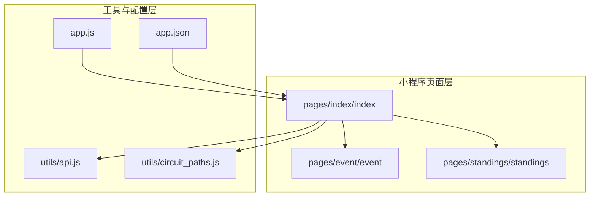
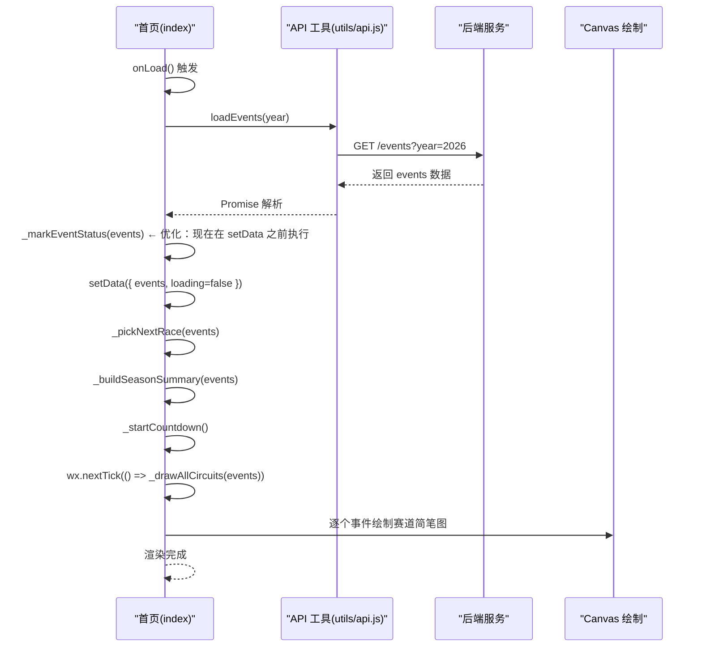
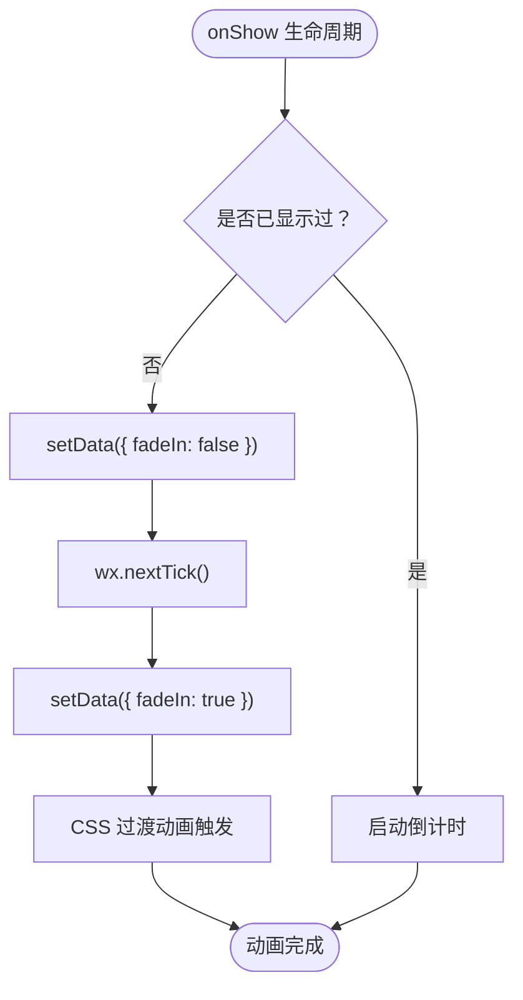
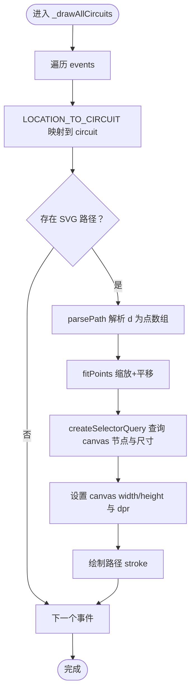
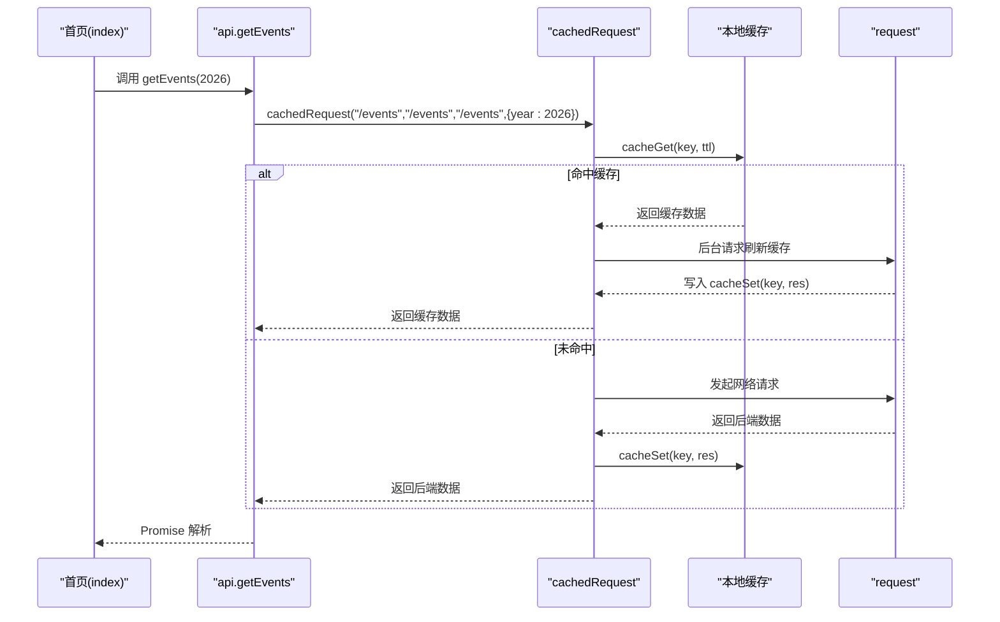
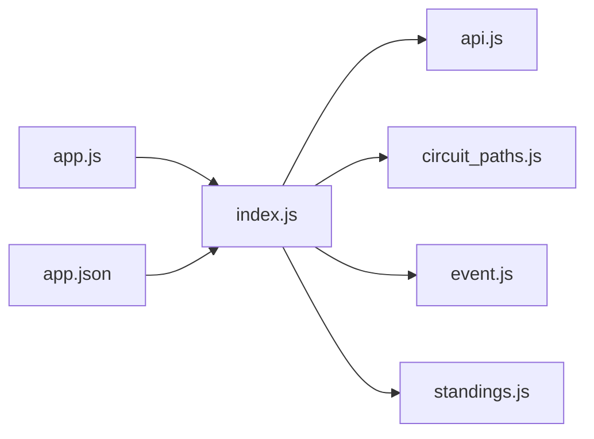

# 首页赛历页面

<cite>
**本文引用的文件**
- [miniprogram/pages/index/index.js](file://miniprogram/pages/index/index.js)
- [miniprogram/pages/index/index.json](file://miniprogram/pages/index/index.json)
- [miniprogram/pages/index/index.wxml](file://miniprogram/pages/index/index.wxml)
- [miniprogram/pages/index/index.wxss](file://miniprogram/pages/index/index.wxss)
- [miniprogram/utils/api.js](file://miniprogram/utils/api.js)
- [miniprogram/utils/circuit_paths.js](file://miniprogram/utils/circuit_paths.js)
- [miniprogram/app.js](file://miniprogram/app.js)
- [miniprogram/app.json](file://miniprogram/app.json)
- [miniprogram/pages/event/event.js](file://miniprogram/pages/event/event.js)
- [miniprogram/pages/standings/standings.js](file://miniprogram/pages/standings/standings.js)
</cite>

## 更新摘要
**变更内容**
- 优化了事件状态标记的执行顺序，确保 _markEventStatus 在 setData 之前执行，提升视图同步性和用户体验
- 新增动态'最新数据'条目系统替代静态'最新比赛'卡片
- 实现事件状态标记功能（已完成/下一站/未来站）
- 改进骨架屏实现，提供更好的加载体验
- 新增快速操作卡片系统，提升用户导航效率
- 优化倒计时显示逻辑，增强用户体验
- **新增** 淡入过渡动画系统：通过 fadeIn 状态管理和 wx.nextTick() 确保 DOM 更新后再触发动画，提供平滑的页面切换体验

## 目录
1. [简介](#简介)
2. [项目结构](#项目结构)
3. [核心组件](#核心组件)
4. [架构总览](#架构总览)
5. [详细组件分析](#详细组件分析)
6. [依赖关系分析](#依赖关系分析)
7. [性能考量](#性能考量)
8. [故障排查指南](#故障排查指南)
9. [结论](#结论)
10. [附录](#附录)

## 简介
本文件面向 Fast-F1 微信小程序"首页赛历"页面，系统性梳理其设计理念、布局结构、数据获取与展示逻辑、列表渲染机制、数据绑定与交互、生命周期管理、数据加载策略与缓存机制、下拉刷新与上拉加载优化、样式与主题设计、性能优化建议以及与后端 API 的交互与错误处理。文档旨在帮助开发者快速理解并维护该页面，同时为非技术读者提供可读性强的说明。

**更新** 本次更新反映了应用的重大变更：从静态'最新比赛'卡片改为动态'最新数据'条目系统，新增事件状态标记功能，改进骨架屏实现，**新增** 淡入过渡动画系统。特别重要的是，事件状态标记的执行顺序已优化，确保 _markEventStatus 在 setData 之前执行，从而提升视图同步性和用户体验。淡入过渡动画通过 fadeIn 状态管理和 wx.nextTick() 确保 DOM 更新后再触发动画，提供平滑的页面切换体验。

## 项目结构
首页赛历页面位于微信小程序目录 miniprogram 的 pages/index 子目录，采用标准的 WXML + WXSS + JS 结构，并通过 utils 中的 API 工具与后端服务交互。页面依赖全局应用配置与主题样式，同时与事件详情页、积分榜等页面形成导航联动。

**章节来源**
- [miniprogram/pages/index/index.js:1-276](file://miniprogram/pages/index/index.js#L1-L276)
- [miniprogram/pages/index/index.json:1-4](file://miniprogram/pages/index/index.json#L1-L4)
- [miniprogram/pages/index/index.wxml:1-107](file://miniprogram/pages/index/index.wxml#L1-L107)
- [miniprogram/pages/index/index.wxss:1-388](file://miniprogram/pages/index/index.wxss#L1-L388)
- [miniprogram/utils/api.js:1-376](file://miniprogram/utils/api.js#L1-L376)
- [miniprogram/utils/circuit_paths.js:1-119](file://miniprogram/utils/circuit_paths.js#L1-L119)
- [miniprogram/app.js:1-23](file://miniprogram/app.js#L1-L23)
- [miniprogram/app.json:1-75](file://miniprogram/app.json#L1-L75)

## 核心组件
- 页面容器与模板：WXML 定义页面结构，WXSS 提供样式，JS 控制逻辑与交互。
- 数据模型：
  - 年份 year：默认 2026。
  - 赛历 events：按轮次过滤后的有效事件列表，包含状态标记。
  - 下一站倒计时 nextRace 与 countdown：基于 UTC 时间计算的北京时间显示与倒计时。
  - 赛季摘要 seasonSummary：包含已完成、待进行、总分站数量。
  - 最新数据条目 latestRaceEntry：动态显示最新完成的赛站数据。
  - 快速操作 quickActions：便捷导航到积分榜、资讯、术语、论坛。
  - 加载状态 loading 与错误状态 error。
  - **新增** 过渡动画状态 fadeIn：控制页面淡入动画的显示与隐藏。
- 渲染与交互：
  - 列表渲染：事件列表、热门推荐列表。
  - 画布渲染：每个事件项绘制对应赛道的简笔图。
  - 导航：点击事件项跳转到事件详情页；点击热门推荐跳转到相应详情或列表页；点击"查看更多"跳转到对应 Tab。

**更新** 新增了季节摘要统计、最新数据条目和快速操作卡片系统，以及淡入过渡动画状态。事件状态标记现在在 setData 之前执行，确保视图同步性。

**章节来源**
- [miniprogram/pages/index/index.js:112-124](file://miniprogram/pages/index/index.js#L112-L124)
- [miniprogram/pages/index/index.wxml:20-56](file://miniprogram/pages/index/index.wxml#L20-L56)
- [miniprogram/pages/index/index.wxss:89-203](file://miniprogram/pages/index/index.wxss#L89-L203)

## 架构总览
首页赛历页面的控制流从生命周期开始，加载数据并进行倒计时初始化，随后渲染事件列表与热门推荐卡片。事件列表中的每个条目在下一帧中触发画布渲染，将 SVG 赛道路径转换为 Canvas 绘制图形。页面还提供导航能力，连接到事件详情与积分榜等页面。**新增** 淡入过渡动画系统通过 onShow 生命周期中的 fadeIn 状态管理，确保页面切换时的平滑过渡效果。

**更新** 事件状态标记现在在 setData 之前执行，确保视图同步性和用户体验。新增了淡入过渡动画系统，通过 onShow 生命周期中的 fadeIn 状态管理实现平滑页面切换。

**图表来源**
- [miniprogram/pages/index/index.js:144-166](file://miniprogram/pages/index/index.js#L144-L166)
- [miniprogram/utils/api.js:158-159](file://miniprogram/utils/api.js#L158-L159)
- [miniprogram/utils/circuit_paths.js:6-119](file://miniprogram/utils/circuit_paths.js#L6-L119)

**章节来源**
- [miniprogram/pages/index/index.js:144-166](file://miniprogram/pages/index/index.js#L144-L166)
- [miniprogram/utils/api.js:158-159](file://miniprogram/utils/api.js#L158-L159)
- [miniprogram/utils/circuit_paths.js:6-119](file://miniprogram/utils/circuit_paths.js#L6-L119)

## 详细组件分析

### 页面结构与布局
- 顶部标题区域：包含年份与副标题。
- 下一站倒计时卡片：展示下一场正赛名称、北京时间与倒计时。
- **新增** 季节摘要舱：显示已完成、待进行、总分站数量统计。
- **新增** 最新数据卡片：动态显示最新完成的赛站数据，支持点击跳转。
- **新增** 快速操作卡片：提供积分榜、资讯、术语、论坛的快捷入口。
- 加载与错误状态：根据 loading 与 error 动态显示。
- 赛历列表：每项包含轮次徽标、名称与地点日期，右侧为 Canvas 赛道简笔图。
- **新增** 淡入过渡容器：通过 fade-in 类名控制页面整体透明度动画。

**更新** 新增了季节摘要舱、最新数据卡片、快速操作卡片系统和淡入过渡容器。淡入过渡容器通过 {{fadeIn ? 'fade-in' : ''}} 动态绑定类名，实现平滑的页面切换效果。

**章节来源**
- [miniprogram/pages/index/index.wxml:1-107](file://miniprogram/pages/index/index.wxml#L1-L107)
- [miniprogram/pages/index/index.wxss:1-388](file://miniprogram/pages/index/index.wxss#L1-L388)

### 数据模型与绑定
- 页面 data：year、events、loading、error、fadeIn、nextRace、countdown、seasonSummary、latestRaceEntry、quickActions。
- 列表渲染：
  - 赛历列表：wx:for="{{events}}"，key 使用 round。
  - 热门推荐：分别使用 hotPosts 与 hotNews 的 wx:for。
- 事件绑定：
  - 事件项 tap：onEventTap，传递当前事件对象。
  - **新增** 最新数据卡片 tap：onLatestRaceTap，跳转到最新完成的赛站详情。
  - **新增** 快速操作卡片 tap：onQuickActionTap，支持 switchTab 或 navigateTo。
  - 热门讨论/资讯 tap：onPostTap/onNewsTap，传递 id。
  - 头部"查看更多" tap：goToForum/goToNews，切换 Tab。

**更新** 新增了最新数据条目和快速操作卡片的数据绑定，以及 fadeIn 状态的数据模型。

**章节来源**
- [miniprogram/pages/index/index.js:112-124](file://miniprogram/pages/index/index.js#L112-L124)
- [miniprogram/pages/index/index.wxml:35-56](file://miniprogram/pages/index/index.wxml#L35-L56)

### 生命周期与状态管理
- onLoad：初始化加载赛历与热门数据。
- onShow/onHide/onUnload：倒计时定时器的启动与清理，避免后台占用。
- **新增** 淡入过渡动画：onShow 中通过 fadeIn 状态管理实现页面切换动画
- _startCountdown/_stopCountdown：基于 nextRace.race_time_utc 的每秒更新，倒计时结束自动重选下一场。
- _pickNextRace：筛选未来最近的一场正赛，生成短名称与北京时间显示。
- **新增** _markEventStatus：为每站标记状态（已完成/下一站/未来站）。**更新** 现在在 setData 之前执行，确保视图同步性。
- **新增** _buildSeasonSummary：构建赛季摘要，统计已完成、待进行、总分站数量。
- **新增** _buildLatestRaceEntry：从已完成事件中提取最新赛站数据。

**更新** 新增了淡入过渡动画系统，通过 onShow 生命周期中的 fadeIn 状态管理实现平滑页面切换。事件状态标记现在在 setData 之前执行，提升视图同步性和用户体验。

**章节来源**
- [miniprogram/pages/index/index.js:132-148](file://miniprogram/pages/index/index.js#L132-L148)
- [miniprogram/pages/index/index.js:168-221](file://miniprogram/pages/index/index.js#L168-L221)

### 淡入过渡动画系统
- **新增** fadeIn 状态管理：在 data 中定义 fadeIn: true，控制页面整体透明度。
- **新增** onShow 生命周期动画：当页面从后台切换到前台时，通过 setData({ fadeIn: false }) 触发 CSS 过渡，然后使用 wx.nextTick() 在下一帧中重新设置 fadeIn: true，确保 DOM 更新后再触发动画。
- **新增** CSS 过渡样式：.container 和 .container.fade-in 类定义了 0.25s 的 ease 过渡动画，从透明到不透明的平滑变化。
- **新增** 动画触发时机：仅在页面首次显示时执行完整动画，后续切换到前台时只触发动画，不重新加载数据。

**图表来源**
- [miniprogram/pages/index/index.js:132-148](file://miniprogram/pages/index/index.js#L132-L148)
- [miniprogram/pages/index/index.wxss:1-12](file://miniprogram/pages/index/index.wxss#L1-L12)

**章节来源**
- [miniprogram/pages/index/index.js:132-148](file://miniprogram/pages/index/index.js#L132-L148)
- [miniprogram/pages/index/index.wxss:1-12](file://miniprogram/pages/index/index.wxss#L1-L12)

### 列表渲染与画布绘制
- 列表渲染：事件列表使用 wx:for，key 为 round；热门推荐列表使用 wx:for，key 为 id。
- 画布绘制：
  - 通过 LOCATION_TO_CIRCUIT 将事件 location 映射到 CIRCUIT_PATHS 中的 SVG 路径。
  - parsePath 解析 d 属性为点数组；fitPoints 将点缩放并平移到 Canvas 尺寸内。
  - 在 wx.nextTick 中批量执行绘制，避免阻塞主线程。
  - 每个事件项使用独立的 canvas id（circuit-{{index}}）进行选择器查询与绘制。

**图表来源**
- [miniprogram/pages/index/index.js:175-212](file://miniprogram/pages/index/index.js#L175-L212)
- [miniprogram/utils/circuit_paths.js:6-119](file://miniprogram/utils/circuit_paths.js#L6-L119)

**章节来源**
- [miniprogram/pages/index/index.js:175-212](file://miniprogram/pages/index/index.js#L175-L212)
- [miniprogram/utils/circuit_paths.js:6-119](file://miniprogram/utils/circuit_paths.js#L6-L119)

### 数据加载策略与缓存机制
- 赛历数据：通过 api.getEvents(year) 获取，内部使用 cachedRequest 带缓存的请求封装。
- 缓存策略：
  - CACHE_TTL 定义不同接口的缓存时长（如 /events 为 1 小时）。
  - cacheKey 生成稳定键，cacheGet/cacheSet 基于本地存储实现。
  - cachedRequest：先读取缓存，若命中则立即返回缓存数据，同时静默发起后台请求以刷新缓存；未命中则请求后写入缓存。
- 热门数据：并发请求热门帖子与资讯，Promise.all 并行提升加载效率。

**图表来源**
- [miniprogram/utils/api.js:106-128](file://miniprogram/utils/api.js#L106-L128)
- [miniprogram/utils/api.js:26-40](file://miniprogram/utils/api.js#L26-L40)
- [miniprogram/utils/api.js:67-76](file://miniprogram/utils/api.js#L67-L76)

**章节来源**
- [miniprogram/utils/api.js:3-15](file://miniprogram/utils/api.js#L3-L15)
- [miniprogram/utils/api.js:106-128](file://miniprogram/utils/api.js#L106-L128)
- [miniprogram/utils/api.js:158-159](file://miniprogram/utils/api.js#L158-L159)

### 用户交互与导航
- 事件项点击：onEventTap，携带 round、name、year、race_time_utc 参数跳转到事件详情页。
- **新增** 最新数据卡片点击：onLatestRaceTap，跳转到最后完成的赛站详情页。
- **新增** 快速操作点击：onQuickActionTap，支持 switchTab 或 navigateTo 不同类型的页面。
- 热门讨论/资讯点击：onPostTap/onNewsTap，跳转到对应详情页。
- "查看更多"点击：goToForum/goToNews，切换到论坛/资讯 Tab。
- 事件详情页联动：事件页根据 round/year/race_time_utc 等参数加载排位、正赛、遥测与分析等数据。

**更新** 新增了最新数据卡片和快速操作卡片的交互功能，以及淡入过渡动画的用户体验优化。

**章节来源**
- [miniprogram/pages/index/index.js:243-275](file://miniprogram/pages/index/index.js#L243-L275)
- [miniprogram/pages/event/event.js:193-200](file://miniprogram/pages/event/event.js#L193-L200)

### 样式设计与主题
- 主题色：红色 #e10600 作为强调色，深灰背景(#0f0f0f/#1a1a1a)营造赛车风格。
- 倒计时卡片：渐变背景与边框，突出下一站信息。
- **新增** 季节摘要舱：简洁的统计卡片，显示已完成、待进行、总分站数量。
- **新增** 最新数据卡片：带有渐变背景和强调色的卡片，突出最新数据。
- **新增** 快速操作卡片：网格布局的快捷入口，提供良好的触控反馈。
- **新增** 淡入过渡动画：.container 和 .container.fade-in 类定义了 0.25s 的透明度过渡效果。
- 列表项：圆角背景、悬停缩放反馈，增强触控体验。
- 热门卡片：阴影与分隔线，清晰区分模块。
- 文字层级：标题、副标题、元信息分层，保证可读性。

**更新** 新增了季节摘要舱、最新数据卡片、快速操作卡片和淡入过渡动画的主题样式。淡入过渡动画通过 CSS 过渡实现平滑的页面切换效果。

**章节来源**
- [miniprogram/pages/index/index.wxss:1-388](file://miniprogram/pages/index/index.wxss#L1-L388)
- [miniprogram/app.json:22-28](file://miniprogram/app.json#L22-L28)

### 事件状态标记与动态数据系统
- **新增** 事件状态标记：_markEventStatus 函数为每个事件标记状态，包括：
  - completed：已完成（过去已完成的正赛）
  - next：下一站（未来最近的一场正赛）
  - upcoming：未来站（其他未来的正赛）
- **新增** 动态最新数据系统：_buildSeasonSummary 和 _buildLatestRaceEntry 提供实时的赛季统计和最新数据。
- **新增** 快速操作系统：QUICK_ACTIONS 数组定义了四个快捷入口，支持 switchTab 导航到 Tab 页面。
- **更新** 执行顺序优化：_markEventStatus 现在在 setData 之前执行，确保视图同步性和用户体验。

**更新** 新增了完整的事件状态标记和动态数据系统，并优化了执行顺序。这些功能都与淡入过渡动画系统协同工作，提供流畅的用户体验。

**章节来源**
- [miniprogram/pages/index/index.js:206-221](file://miniprogram/pages/index/index.js#L206-L221)
- [miniprogram/pages/index/index.js:185-204](file://miniprogram/pages/index/index.js#L185-L204)
- [miniprogram/pages/index/index.js:58-63](file://miniprogram/pages/index/index.js#L58-L63)

### 骨架屏实现改进
- **新增** 骨架屏：在加载过程中显示占位符动画，提升用户体验。
- 骨架屏元素：包含轮次徽标占位符和文本行占位符，使用渐变动画效果。
- 条件渲染：通过 wx:if="{{loading}}" 控制骨架屏显示，loading 为 false 时显示真实内容。

**更新** 新增了改进的骨架屏实现，与淡入过渡动画系统配合，提供更好的加载体验。

**章节来源**
- [miniprogram/pages/index/index.wxml:60-69](file://miniprogram/pages/index/index.wxml#L60-L69)
- [miniprogram/pages/index/index.wxss:332-388](file://miniprogram/pages/index/index.wxss#L332-L388)

### 与后端 API 的交互模式与错误处理
- 交互模式：
  - request 封装 wx.request，统一超时与重试逻辑。
  - cachedRequest 带缓存的请求封装，支持强制刷新。
  - 并发请求热门数据，提升首屏速度。
- 错误处理：
  - 页面在加载失败时设置 error 字段，WXML 条件渲染错误提示。
  - API 层对网络错误与业务错误进行分类处理，返回统一格式。

**章节来源**
- [miniprogram/utils/api.js:53-84](file://miniprogram/utils/api.js#L53-L84)
- [miniprogram/pages/index/index.js:164](file://miniprogram/pages/index/index.js#L164)

## 依赖关系分析
- 页面依赖：
  - utils/api.js：提供带缓存的网络请求封装。
  - utils/circuit_paths.js：提供 SVG 赛道路径数据。
  - app.js/app.json：提供全局 BASE_URL 与主题配置。
- 页面间依赖：
  - 首页 -> 事件详情页：传递 round/name/year/race_time_utc。
  - 首页 -> 积分榜页：通过 Tab 切换。

**图表来源**
- [miniprogram/pages/index/index.js:1-4](file://miniprogram/pages/index/index.js#L1-L4)
- [miniprogram/utils/api.js:1-376](file://miniprogram/utils/api.js#L1-L376)
- [miniprogram/utils/circuit_paths.js:1-119](file://miniprogram/utils/circuit_paths.js#L1-L119)
- [miniprogram/app.js:1-23](file://miniprogram/app.js#L1-L23)
- [miniprogram/app.json:1-75](file://miniprogram/app.json#L1-L75)

**章节来源**
- [miniprogram/pages/index/index.js:1-4](file://miniprogram/pages/index/index.js#L1-L4)
- [miniprogram/utils/api.js:1-376](file://miniprogram/utils/api.js#L1-L376)
- [miniprogram/utils/circuit_paths.js:1-119](file://miniprogram/utils/circuit_paths.js#L1-L119)
- [miniprogram/app.js:1-23](file://miniprogram/app.js#L1-L23)
- [miniprogram/app.json:1-75](file://miniprogram/app.json#L1-L75)

## 性能考量
- 列表渲染优化：
  - 使用 wx:for 与合适的 wx:key（轮次/ID）减少重排。
  - 事件项点击后跳转到详情页，避免在首页维持大量复杂 DOM。
- 画布绘制优化：
  - 使用 wx.nextTick 在下一帧批量绘制，降低主线程阻塞。
  - fitPoints 对 SVG 路径进行缩放与平移，避免过度计算。
- 缓存与并发：
  - cachedRequest 命中即返回，后台静默刷新，显著降低重复请求成本。
  - Promise.all 并发热门数据请求，缩短首屏等待时间。
- **新增** 事件状态标记优化：
  - 一次性遍历标记所有事件状态，避免重复计算。
  - 使用状态类名控制样式，减少条件判断开销。
  - **更新** 现在在 setData 之前执行，确保视图同步性。
- **新增** 淡入过渡动画优化：
  - 通过 wx.nextTick() 确保 DOM 更新后再触发动画，避免动画闪烁。
  - CSS 过渡动画使用硬件加速，性能开销最小化。
  - 仅在页面首次显示时执行完整动画，后续切换到前台时只触发动画。
- **新增** 骨架屏优化：
  - 使用 CSS 动画而非 JavaScript 动画，减少主线程压力。
  - 骨架屏元素数量适中，避免过多 DOM 节点影响性能。
- 主题与样式：
  - 使用 rpx 单位适配多设备，减少重绘。
  - 合理的阴影与圆角在视觉上更友好，但需注意 Canvas 绘制开销。

**更新** 新增了淡入过渡动画和骨架屏的性能优化考量，特别是执行顺序优化带来的视图同步性提升。淡入过渡动画通过 wx.nextTick() 确保 DOM 更新后再触发动画，避免动画闪烁。

## 故障排查指南
- 加载失败：
  - 检查 API 层返回的状态字段与 note，确认网络错误或业务错误类型。
  - 页面在 catch 中设置 error，可在 WXML 中条件渲染错误文本。
- 倒计时异常：
  - 确认 race_time_utc 是否为合法 UTC ISO 字符串。
  - 检查 _startCountdown 是否在 onShow 时启动，在 onHide/onUnload 时停止。
- 赛道简笔图不显示：
  - 确认 LOCATION_TO_CIRCUIT 是否覆盖当前事件 location。
  - 检查 parsePath/fitPoints 是否正确解析与缩放。
  - 确认 Canvas 查询与 dpr 设置是否成功。
- **新增** 事件状态标记异常：
  - 检查 _markEventStatus 函数中的时间比较逻辑。
  - 确认事件对象是否包含 race_time_utc 字段。
  - **更新** 确认 _markEventStatus 是否在 setData 之前执行。
- **新增** 最新数据条目为空：
  - 检查 _buildSeasonSummary 是否正确识别已完成事件。
  - 确认 events 数组是否按时间顺序排列。
- **新增** 骨架屏不显示：
  - 检查 loading 状态是否正确设置为 true。
  - 确认 wx:if 条件渲染逻辑。
- **新增** 淡入过渡动画异常：
  - 检查 fadeIn 状态是否正确初始化为 true。
  - 确认 onShow 生命周期中的动画逻辑是否执行。
  - 检查 CSS 过渡样式是否正确应用。
  - 确认 wx.nextTick() 是否在 DOM 更新后执行。
- 导航问题：
  - 确认传参 round/name/year/race_time_utc 是否正确编码与解码。
  - 检查事件详情页对 race_time_utc 的判断逻辑。

**更新** 新增了淡入过渡动画、事件状态标记、最新数据条目和骨架屏的故障排查指南，特别关注执行顺序和动画触发时机问题。

**章节来源**
- [miniprogram/pages/index/index.js:164](file://miniprogram/pages/index/index.js#L164)
- [miniprogram/pages/index/index.js:223-241](file://miniprogram/pages/index/index.js#L223-L241)
- [miniprogram/pages/index/index.js:206-221](file://miniprogram/pages/index/index.js#L206-L221)
- [miniprogram/pages/index/index.js:185-204](file://miniprogram/pages/index/index.js#L185-L204)
- [miniprogram/pages/index/index.js:243-275](file://miniprogram/pages/index/index.js#L243-L275)
- [miniprogram/utils/api.js:53-84](file://miniprogram/utils/api.js#L53-L84)

## 结论
首页赛历页面以清晰的模块划分与稳健的数据流为核心，结合本地缓存与并发请求提升性能，通过 Canvas 简笔图增强视觉表现，配合倒计时与热门推荐提升用户粘性。**更新** 新版本引入了动态'最新数据'条目系统、事件状态标记功能、改进的骨架屏实现和**新增的淡入过渡动画系统**，显著提升了用户体验和信息呈现效率。**特别重要的是，事件状态标记的执行顺序已优化，确保在 setData 之前执行，从而提升视图同步性和用户体验。淡入过渡动画通过 fadeIn 状态管理和 wx.nextTick() 确保 DOM 更新后再触发动画，提供平滑的页面切换体验。**建议在后续迭代中引入虚拟滚动与懒加载策略，进一步优化长列表场景下的内存与渲染性能，并完善下拉刷新与上拉加载的交互细节，以满足更复杂的业务需求。

## 附录
- 与事件详情页联动：事件页根据 round/year/race_time_utc 加载排位、正赛、遥测与分析数据，形成完整的数据链路。
- 与积分榜页联动：通过 Tab 切换访问积分榜与趋势图，延续页面主题与交互风格。

**章节来源**
- [miniprogram/pages/event/event.js:193-200](file://miniprogram/pages/event/event.js#L193-L200)
- [miniprogram/pages/standings/standings.js:68-90](file://miniprogram/pages/standings/standings.js#L68-L90)