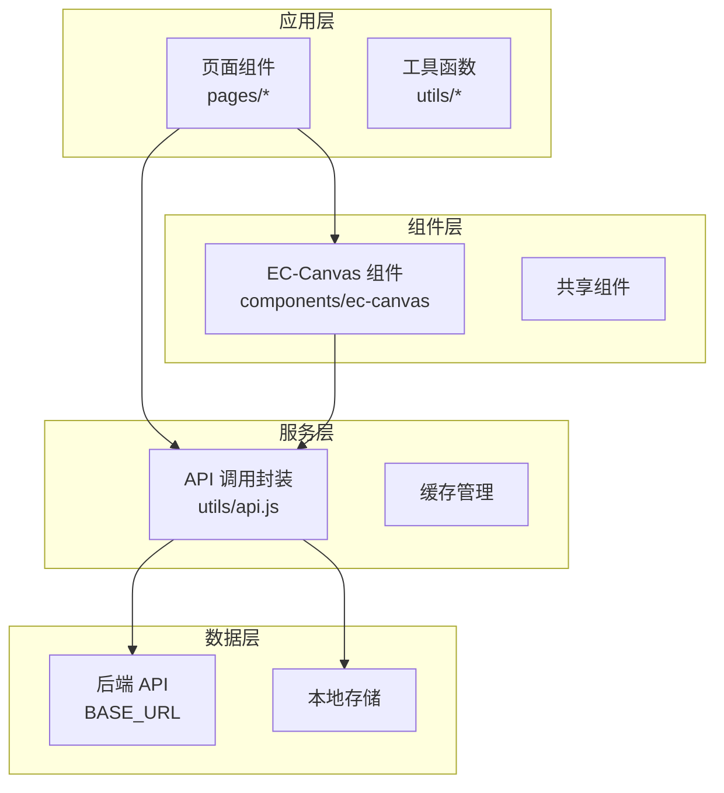
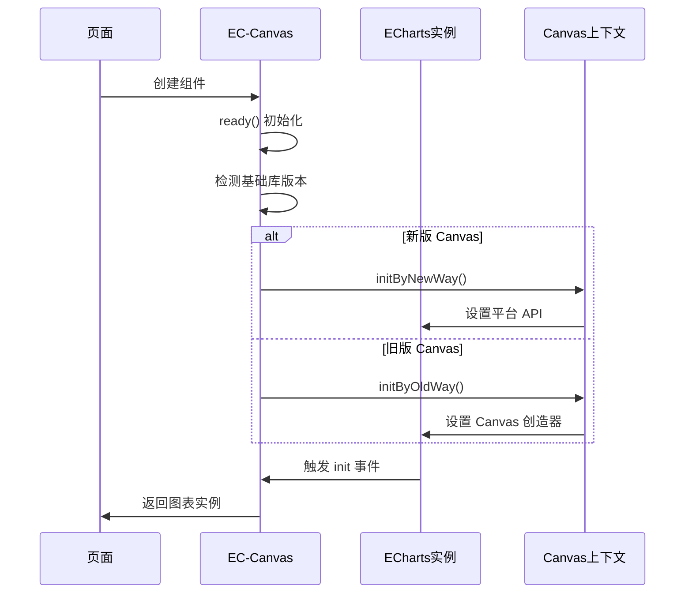
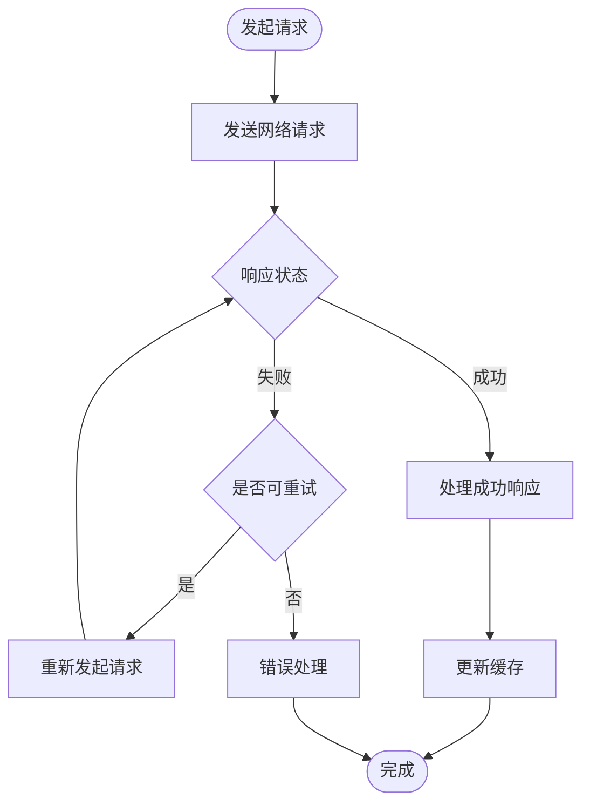
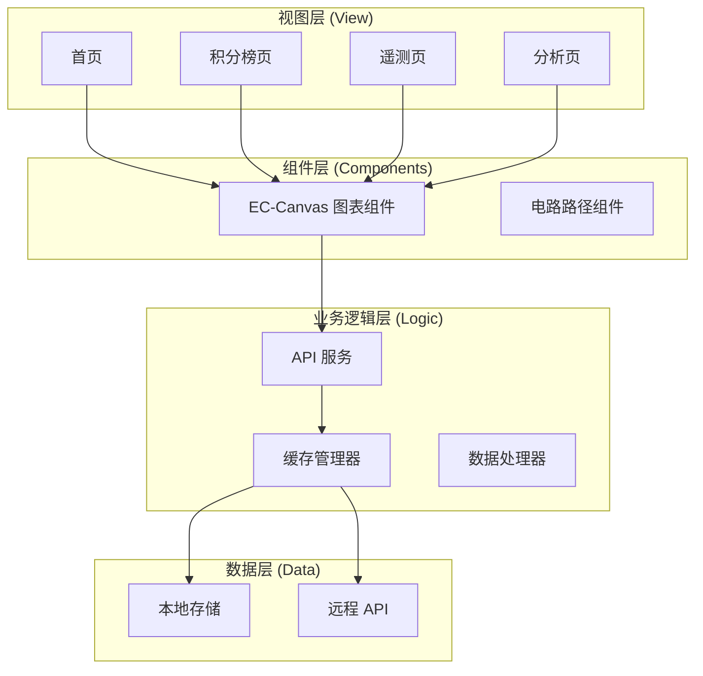
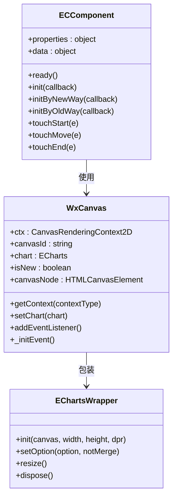
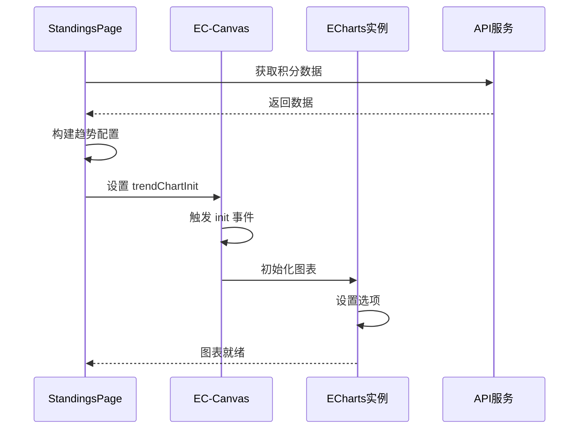
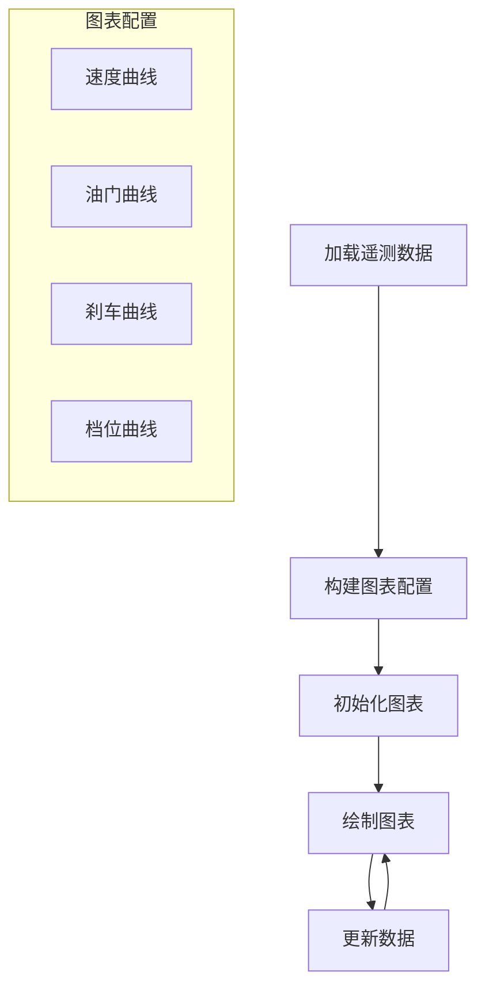
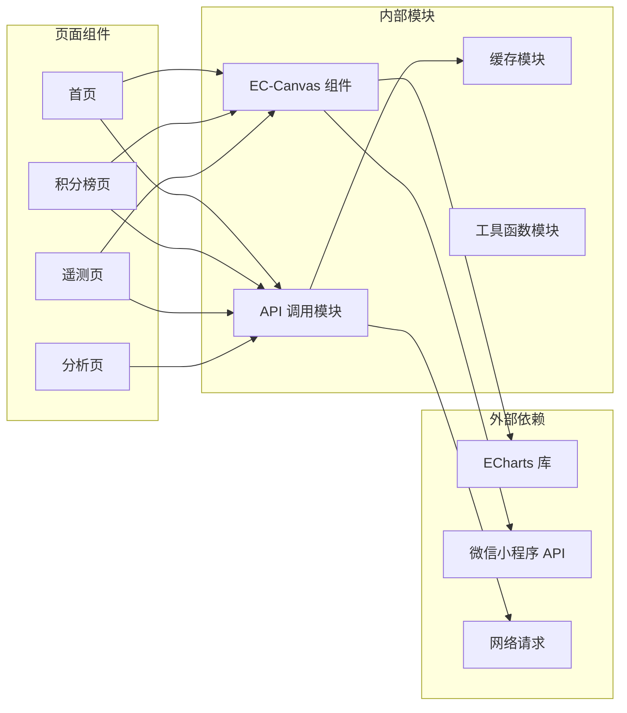

# 组件系统设计

<cite>
**本文档引用的文件**
- [miniprogram/components/ec-canvas/ec-canvas.js](file://miniprogram/components/ec-canvas/ec-canvas.js)
- [miniprogram/components/ec-canvas/ec-canvas.json](file://miniprogram/components/ec-canvas/ec-canvas.json)
- [miniprogram/components/ec-canvas/ec-canvas.wxml](file://miniprogram/components/ec-canvas/ec-canvas.wxml)
- [miniprogram/components/ec-canvas/ec-canvas.wxss](file://miniprogram/components/ec-canvas/ec-canvas.wxss)
- [miniprogram/components/ec-canvas/echarts.js](file://miniprogram/components/ec-canvas/echarts.js)
- [miniprogram/components/ec-canvas/wx-canvas.js](file://miniprogram/components/ec-canvas/wx-canvas.js)
- [miniprogram/utils/api.js](file://miniprogram/utils/api.js)
- [miniprogram/utils/circuit_paths.js](file://miniprogram/utils/circuit_paths.js)
- [miniprogram/app.js](file://miniprogram/app.js)
- [miniprogram/app.json](file://miniprogram/app.json)
- [miniprogram/pages/index/index.js](file://miniprogram/pages/index/index.js)
- [miniprogram/pages/standings/standings.js](file://miniprogram/pages/standings/standings.js)
- [miniprogram/pages/telemetry/telemetry.js](file://miniprogram/pages/telemetry/telemetry.js)
- [miniprogram/pages/analysis/analysis.js](file://miniprogram/pages/analysis/analysis.js)
</cite>

## 目录
1. [简介](#简介)
2. [项目结构](#项目结构)
3. [核心组件](#核心组件)
4. [架构概览](#架构概览)
5. [详细组件分析](#详细组件分析)
6. [依赖关系分析](#依赖关系分析)
7. [性能考虑](#性能考虑)
8. [故障排除指南](#故障排除指南)
9. [结论](#结论)

## 简介

Fast-F1 微信小程序组件系统是一个专为一级方程式数据分析而设计的高性能可视化平台。该系统采用模块化架构，通过自定义 ECharts 图表组件、API 调用封装和电路路径工具组件，为用户提供丰富的赛车数据分析和可视化体验。

系统的核心特色包括：
- **ECharts 图表组件**：支持 Canvas 渲染、数据绑定和交互处理
- **智能缓存机制**：基于本地存储的智能缓存策略
- **响应式设计**：适配不同屏幕尺寸和设备像素比
- **实时数据更新**：支持动态数据刷新和状态同步
- **组件复用策略**：高度模块化的组件设计

## 项目结构

项目采用清晰的分层架构，主要分为以下几个层次：



**图表来源**
- [app.json:1-72](file://miniprogram/app.json#L1-L72)
- [app.js:1-23](file://miniprogram/app.js#L1-L23)

**章节来源**
- [app.json:1-72](file://miniprogram/app.json#L1-L72)
- [app.js:1-23](file://miniprogram/app.js#L1-L23)

## 核心组件

### EC-Canvas 图表组件

EC-Canvas 是整个组件系统的核心，它封装了 ECharts 在微信小程序中的使用，提供了完整的图表渲染解决方案。

#### 主要特性
- **双版本兼容**：支持新旧两种 Canvas API
- **智能初始化**：根据基础库版本自动选择最优渲染方式
- **事件处理**：完整的触摸事件映射到 ECharts 交互
- **数据绑定**：支持动态数据更新和配置变更

#### 组件属性
| 属性名 | 类型 | 默认值 | 描述 |
|--------|------|--------|------|
| canvasId | String | 'ec-canvas' | Canvas 元素 ID |
| ec | Object | - | ECharts 配置对象 |
| forceUseOldCanvas | Boolean | false | 强制使用旧版 Canvas |

#### 生命周期管理
组件通过微信小程序的生命周期钩子实现完整的生命周期管理：



**图表来源**
- [ec-canvas.js:52-111](file://miniprogram/components/ec-canvas/ec-canvas.js#L52-L111)

**章节来源**
- [ec-canvas.js:31-111](file://miniprogram/components/ec-canvas/ec-canvas.js#L31-L111)
- [ec-canvas.json:1-4](file://miniprogram/components/ec-canvas/ec-canvas.json#L1-L4)

### API 调用封装

API 模块提供了统一的网络请求接口，实现了智能缓存、错误处理和重试机制。

#### 缓存策略
系统采用多级缓存策略，通过不同的 TTL（生存时间）管理不同类型的数据：

| 接口类型 | 缓存 TTL | 缓存键格式 |
|----------|----------|------------|
| 赛事信息 | 60 分钟 | `/events` |
| 排位赛 | 10 分钟 | `/qualifying` |
| 赛段时间 | 10 分钟 | `/laptimes` |
| 传感器数据 | 10 分钟 | `/telemetry` |
| 积分榜 | 30 分钟 | `/standings` |
| AI 分析 | 30 分钟 | `/analysis` |
| 电路信息 | 60 分钟 | `/circuit` |
| 资讯 | 5 分钟 | `/news` |

#### 错误处理机制
API 调用实现了完善的错误处理和重试机制：



**图表来源**
- [api.js:45-76](file://miniprogram/utils/api.js#L45-L76)

**章节来源**
- [api.js:1-299](file://miniprogram/utils/api.js#L1-L299)

### 电路路径工具组件

电路路径工具提供了 F1 赛道的 SVG 路径数据，用于在首页展示赛道布局。

#### 支持的赛道
系统内置了 20 个主要 F1 赛道的 SVG 路径数据，每个赛道包含：
- **viewBox**：SVG 视口定义
- **d**：路径数据字符串
- **坐标系**：标准化到 500px 最大尺寸

#### 使用场景
电路路径主要用于首页的赛历展示，通过算法将 SVG 路径转换为 Canvas 绘制指令，实现轻量级的赛道可视化。

**章节来源**
- [circuit_paths.js:1-119](file://miniprogram/utils/circuit_paths.js#L1-L119)

## 架构概览

系统采用 MVVM 架构模式，结合微信小程序的组件化开发理念：



**图表来源**
- [index.js:125-136](file://miniprogram/pages/index/index.js#L125-L136)
- [standings.js:74-90](file://miniprogram/pages/standings/standings.js#L74-L90)

## 详细组件分析

### ECharts 图表组件实现

#### Canvas 渲染机制

EC-Canvas 组件实现了两种 Canvas 渲染模式：



**图表来源**
- [wx-canvas.js:1-112](file://miniprogram/components/ec-canvas/wx-canvas.js#L1-L112)
- [ec-canvas.js:79-111](file://miniprogram/components/ec-canvas/ec-canvas.js#L79-L111)

#### 数据绑定和状态同步

图表组件通过以下机制实现数据绑定和状态同步：

1. **属性绑定**：通过 `ec` 属性接收 ECharts 配置
2. **懒加载机制**：支持 `lazyLoad` 属性控制初始化时机
3. **事件驱动**：通过 `init` 事件回调获取图表实例
4. **动态更新**：通过 `setOption` 方法更新图表配置

#### 交互处理机制

组件实现了完整的触摸事件映射：

| 微信事件 | ECharts 事件 | 功能描述 |
|----------|--------------|----------|
| touchStart | mousedown | 鼠标按下事件 |
| touchMove | mousemove | 鼠标移动事件 |
| touchEnd | mouseup | 鼠标抬起事件 |
| touchEnd | click | 点击事件 |

**章节来源**
- [ec-canvas.js:223-281](file://miniprogram/components/ec-canvas/ec-canvas.js#L223-L281)
- [wx-canvas.js:65-92](file://miniprogram/components/ec-canvas/wx-canvas.js#L65-L92)

### 页面组件集成

#### 积分榜页面集成

积分榜页面展示了如何集成 EC-Canvas 组件进行数据可视化：



**图表来源**
- [standings.js:103-121](file://miniprogram/pages/standings/standings.js#L103-L121)

#### 遥测页面集成

遥测页面展示了复杂图表的实现方式：



**图表来源**
- [telemetry.js:135-147](file://miniprogram/pages/telemetry/telemetry.js#L135-L147)

**章节来源**
- [standings.js:1-123](file://miniprogram/pages/standings/standings.js#L1-L123)
- [telemetry.js:1-156](file://miniprogram/pages/telemetry/telemetry.js#L1-L156)

### 组件间通信机制

系统采用多种组件间通信方式：

#### 1. 父子组件通信
通过属性传递和事件回调实现父子组件通信：

```javascript
// 父组件向子组件传递数据
<ec-canvas ec="{{ trendChartInit }}"></ec-canvas>

// 子组件向父组件发送事件
this.triggerEvent('init', { canvas, width, height, dpr });
```

#### 2. 页面间导航
通过微信小程序的路由系统实现页面间数据传递：

```javascript
wx.navigateTo({
  url: `/pages/event/event?round=${event.round}&name=${encodeURIComponent(event.name)}`
})
```

#### 3. 全局状态管理
通过 App 实例的 globalData 实现全局状态共享：

```javascript
const app = getApp()
console.log(app.globalData.BASE_URL)
```

**章节来源**
- [index.js:247-253](file://miniprogram/pages/index/index.js#L247-L253)
- [app.js:1-23](file://miniprogram/app.js#L1-L23)

## 依赖关系分析

系统的主要依赖关系如下：



**图表来源**
- [ec-canvas.js:1-2](file://miniprogram/components/ec-canvas/ec-canvas.js#L1-L2)
- [api.js:1-299](file://miniprogram/utils/api.js#L1-L299)

**章节来源**
- [ec-canvas.js:1-2](file://miniprogram/components/ec-canvas/ec-canvas.js#L1-L2)
- [api.js:1-299](file://miniprogram/utils/api.js#L1-L299)

## 性能考虑

### 1. 渲染性能优化

#### Canvas 选择策略
组件根据微信基础库版本自动选择最优的 Canvas 渲染方式：

- **新版 Canvas (2.9.0+)**
  - 使用 `type="2d"` Canvas
  - 支持 `createImage()` API
  - 更好的性能表现

- **旧版 Canvas (1.9.91-2.9.0)**
  - 使用传统 Canvas API
  - 兼容性更好
  - 性能略逊色

#### 设备像素比处理
组件正确处理高 DPI 设备的像素比，确保图表清晰度：

```javascript
const dpr = wx.getSystemInfoSync().pixelRatio
const canvas = new WxCanvas(ctx, canvasId, true, canvasNode)
```

### 2. 内存管理

#### 图表实例管理
页面组件中实现了图表实例的生命周期管理：

```javascript
// 创建时
_chart = echarts.init(canvas, null, { width, height, devicePixelRatio: dpr })

// 更新时
_chart.setOption(option, true)

// 销毁时
_chart.dispose()
```

#### 缓存策略优化
API 模块实现了智能缓存策略，减少不必要的网络请求：

- **TTL 管理**：不同接口设置不同的缓存时间
- **并发请求**：使用 `Promise.all` 并发加载多个数据源
- **缓存失效**：支持强制刷新和缓存清理

### 3. 网络性能优化

#### 请求重试机制
API 调用实现了自动重试机制：

```javascript
function _doRequest(fullUrl, method, data, headers) {
  return new Promise((resolve, reject) => {
    wx.request({
      // ... 请求配置
      success(res) {
        if (res.data && res.data.status === 'ok') {
          resolve(res.data)
        } else {
          reject(res.data?.note || '请求失败')
        }
      },
      fail(err) {
        reject(err.errMsg || '网络错误')
      }
    })
  })
}
```

#### 错误恢复策略
系统实现了多层次的错误处理和恢复机制：

- **网络错误重试**：自动重试一次失败的请求
- **降级策略**：缓存数据回退到本地存储
- **用户反馈**：友好的错误提示和恢复选项

**章节来源**
- [ec-canvas.js:80-111](file://miniprogram/components/ec-canvas/ec-canvas.js#L80-L111)
- [api.js:45-76](file://miniprogram/utils/api.js#L45-L76)

## 故障排除指南

### 常见问题及解决方案

#### 1. 图表不显示或空白

**可能原因**：
- Canvas 初始化未完成
- 数据为空或格式不正确
- 设备像素比计算错误

**解决步骤**：
1. 检查 `ready` 事件是否触发
2. 验证数据格式和完整性
3. 确认 `wx.nextTick()` 的使用

#### 2. 图表渲染性能问题

**优化建议**：
- 启用 `animation: false` 减少动画开销
- 使用 `notMerge: true` 控制更新策略
- 合理设置 `devicePixelRatio`

#### 3. 缓存数据过期

**检查步骤**：
1. 验证 `CACHE_TTL` 配置
2. 检查本地存储键值
3. 确认缓存时间戳有效性

#### 4. 网络请求失败

**调试方法**：
1. 查看网络请求日志
2. 检查 API 响应状态
3. 验证重试机制是否正常工作

**章节来源**
- [api.js:26-40](file://miniprogram/utils/api.js#L26-L40)
- [ec-canvas.js:125-143](file://miniprogram/components/ec-canvas/ec-canvas.js#L125-L143)

## 结论

Fast-F1 微信小程序组件系统通过精心设计的架构和实现，为用户提供了一个功能完整、性能优异的赛车数据分析平台。系统的主要优势包括：

### 技术亮点
- **模块化设计**：清晰的组件分层和职责分离
- **性能优化**：智能缓存、Canvas 优化和内存管理
- **用户体验**：流畅的交互和及时的数据更新
- **可维护性**：规范的代码结构和完善的错误处理

### 架构优势
- **可扩展性**：易于添加新的图表类型和数据源
- **可复用性**：组件化设计支持跨页面复用
- **可测试性**：清晰的接口定义便于单元测试
- **可维护性**：文档齐全，代码注释详细

### 未来发展方向
1. **增强实时性**：引入 WebSocket 实现实时数据推送
2. **提升交互性**：增加更多图表交互功能
3. **优化移动端体验**：针对不同设备优化界面布局
4. **扩展数据源**：支持更多类型的赛车数据

该组件系统为类似的数据可视化应用提供了一个优秀的参考实现，其设计理念和最佳实践值得在其他项目中借鉴和应用。