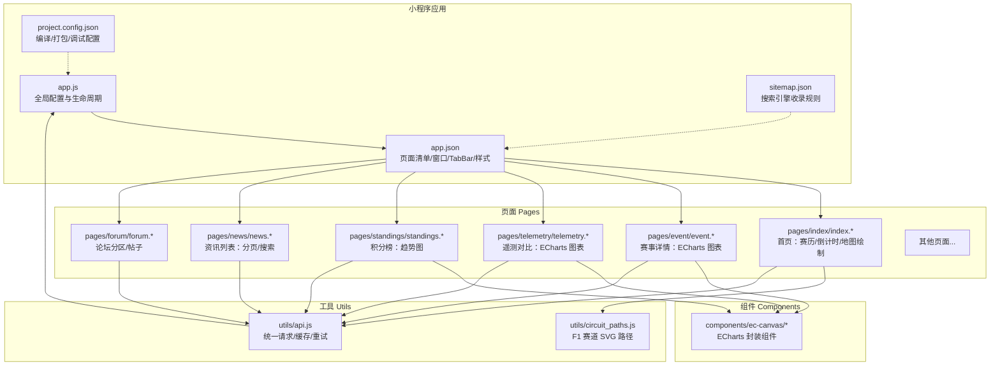
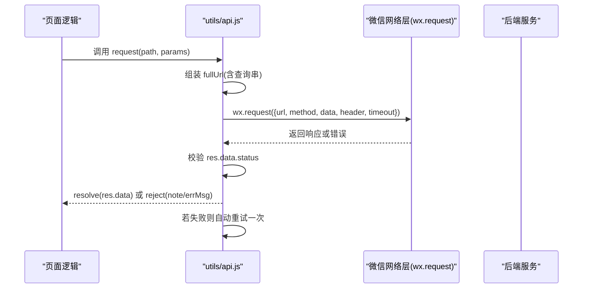
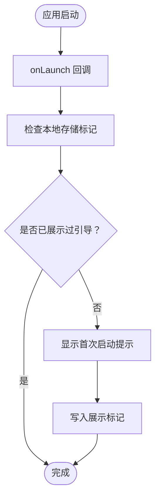
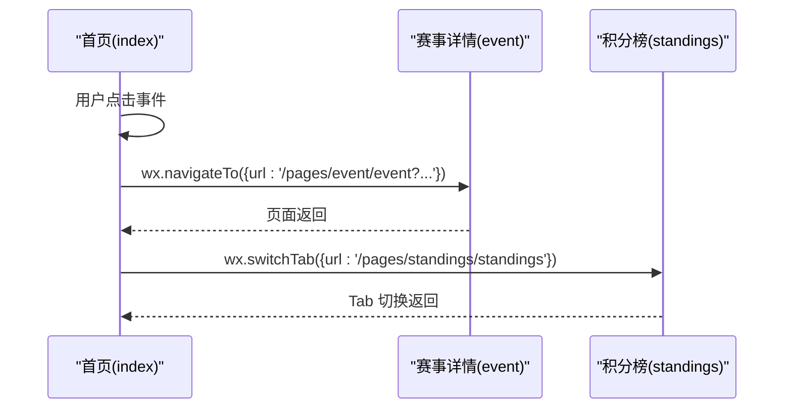
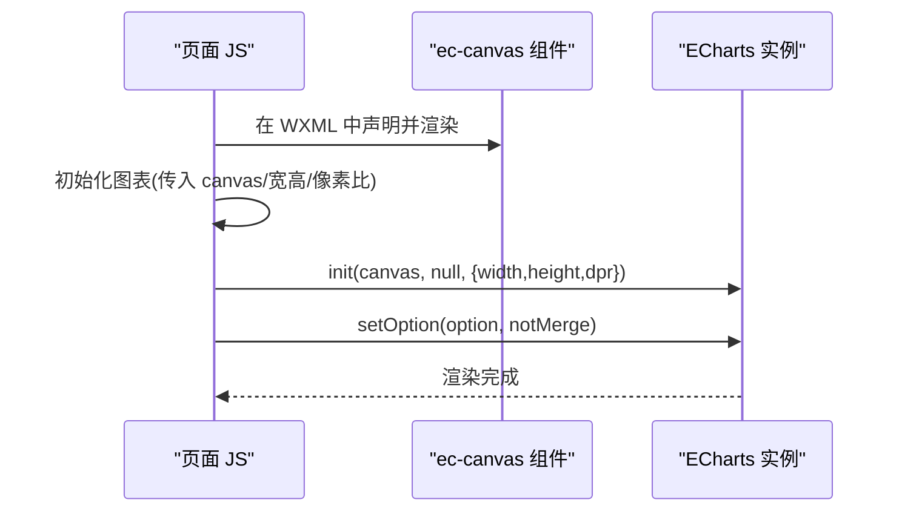
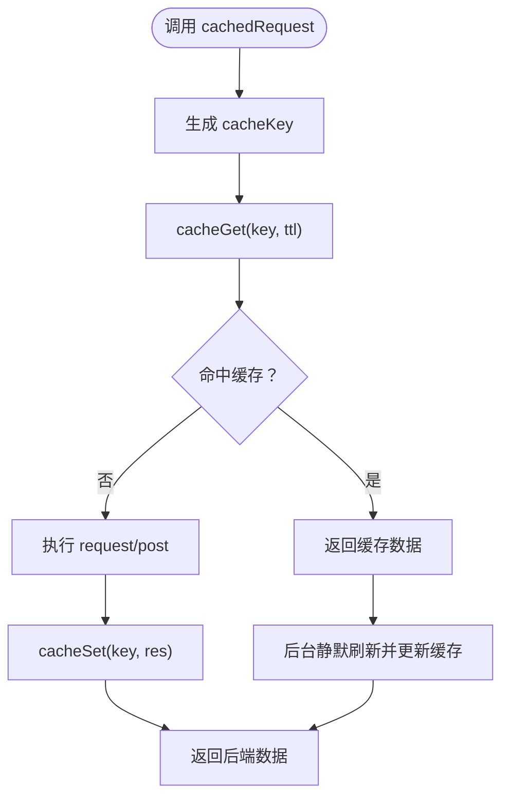
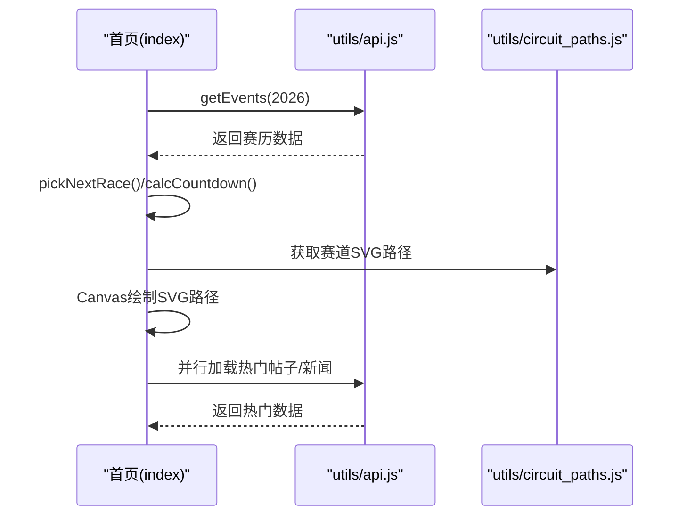
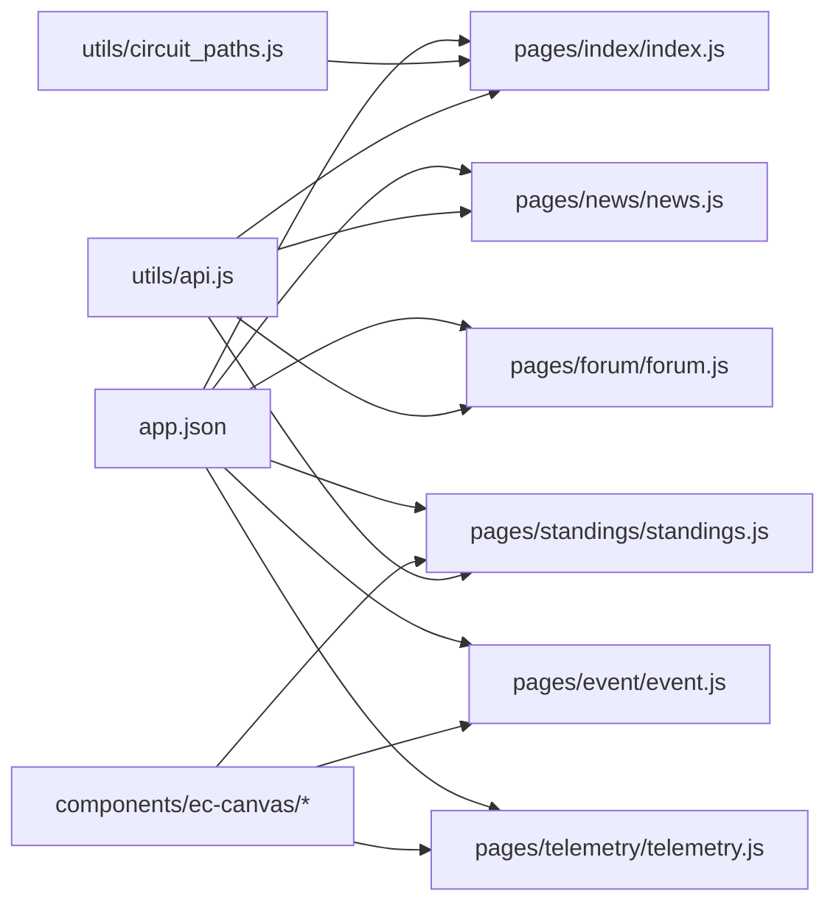

# 项目结构与配置

<cite>
**本文档引用的文件**
- [app.js](file://miniprogram/app.js)
- [app.json](file://miniprogram/app.json)
- [project.config.json](file://miniprogram/project.config.json)
- [sitemap.json](file://miniprogram/sitemap.json)
- [api.js](file://miniprogram/utils/api.js)
- [index.js](file://miniprogram/pages/index/index.js)
- [standings.js](file://miniprogram/pages/standings/standings.js)
- [news.js](file://miniprogram/pages/news/news.js)
- [forum.js](file://miniprogram/pages/forum/forum.js)
- [index.json](file://miniprogram/pages/index/index.json)
- [event.json](file://miniprogram/pages/event/event.json)
- [telemetry.json](file://miniprogram/pages/telemetry/telemetry.json)
- [standings.json](file://miniprogram/pages/standings/standings.json)
- [ec-canvas.json](file://miniprogram/components/ec-canvas/ec-canvas.json)
- [circuit_paths.js](file://miniprogram/utils/circuit_paths.js)
</cite>

## 目录
1. [简介](#简介)
2. [项目结构](#项目结构)
3. [核心组件](#核心组件)
4. [架构总览](#架构总览)
5. [详细组件分析](#详细组件分析)
6. [依赖关系分析](#依赖关系分析)
7. [性能考虑](#性能考虑)
8. [故障排查指南](#故障排查指南)
9. [结论](#结论)
10. [附录](#附录)

## 简介
本文件面向 Fast-F1 微信小程序项目，系统性梳理其整体架构、配置文件、生命周期管理、路由与导航机制、目录组织原则与命名规范，并提供配置最佳实践与常见问题解决方案。文档以“可读性优先”的原则，既覆盖技术细节，也便于非专业读者理解。

## 项目结构
小程序采用“页面-组件-工具函数”分层组织方式，核心入口为 app.js 与 app.json；页面位于 pages 目录，通用组件位于 components 目录，业务工具位于 utils 目录；项目级构建配置由 project.config.json 提供；sitemap.json 控制搜索引擎收录策略。

图表来源
- [app.js:1-23](file://miniprogram/app.js#L1-L23)
- [app.json:1-72](file://miniprogram/app.json#L1-L72)
- [sitemap.json:1-5](file://miniprogram/sitemap.json#L1-L5)
- [project.config.json:1-40](file://miniprogram/project.config.json#L1-L40)
- [api.js:1-299](file://miniprogram/utils/api.js#L1-L299)
- [circuit_paths.js:1-119](file://miniprogram/utils/circuit_paths.js#L1-L119)
- [index.js:1-255](file://miniprogram/pages/index/index.js#L1-L255)
- [standings.js:1-123](file://miniprogram/pages/standings/standings.js#L1-L123)
- [news.js:1-163](file://miniprogram/pages/news/news.js#L1-L163)
- [forum.js:1-125](file://miniprogram/pages/forum/forum.js#L1-L125)
- [event.json:1-10](file://miniprogram/pages/event/event.json#L1-L10)
- [telemetry.json:1-10](file://miniprogram/pages/telemetry/telemetry.json#L1-L10)
- [standings.json:1-10](file://miniprogram/pages/standings/standings.json#L1-L10)
- [ec-canvas.json:1-4](file://miniprogram/components/ec-canvas/ec-canvas.json#L1-L4)

章节来源
- [app.js:1-23](file://miniprogram/app.js#L1-L23)
- [app.json:1-72](file://miniprogram/app.json#L1-L72)
- [project.config.json:1-40](file://miniprogram/project.config.json#L1-L40)
- [sitemap.json:1-5](file://miniprogram/sitemap.json#L1-L5)

## 核心组件
- 应用入口与全局状态
  - app.js 定义全局常量（如 BASE_URL）、当前年份等，并在 onLaunch 中执行首次启动提示逻辑。
- 页面与导航
  - app.json 声明页面清单、窗口样式、TabBar 导航、深色模式开关、懒加载策略等。
  - 各页面通过 wx.navigateTo/wx.switchTab 等 API 进行页面间跳转。
- 组件化开发
  - components/ec-canvas 封装 ECharts，页面通过 usingComponents 引入并在 WXML 中使用。
- 工具与缓存
  - utils/api.js 提供统一请求封装、本地缓存、TTL 策略、失败重试、管理员鉴权头等。
  - utils/circuit_paths.js 提供 F1 赛道 SVG 路径数据，用于首页地图绘制。

章节来源
- [app.js:1-23](file://miniprogram/app.js#L1-L23)
- [app.json:1-72](file://miniprogram/app.json#L1-L72)
- [api.js:1-299](file://miniprogram/utils/api.js#L1-L299)
- [circuit_paths.js:1-119](file://miniprogram/utils/circuit_paths.js#L1-L119)
- [ec-canvas.json:1-4](file://miniprogram/components/ec-canvas/ec-canvas.json#L1-L4)

## 架构总览
小程序前端与后端通过统一的 BASE_URL 接口进行交互，所有请求经 api.js 统一封装，支持：
- GET/POST 请求
- 参数过滤与排序
- 查询串编码
- 超时控制（默认 20 秒）
- 失败自动重试一次
- 本地缓存（按接口维度设置 TTL）

图表来源
- [api.js:45-85](file://miniprogram/utils/api.js#L45-L85)

章节来源
- [api.js:1-299](file://miniprogram/utils/api.js#L1-L299)

## 详细组件分析

### 应用生命周期与全局配置
- 生命周期
  - onLaunch：应用启动时执行，弹出首次启动提示并写入本地存储标记。
- 全局数据
  - globalData：存放 BASE_URL、currentYear 等跨页面共享数据。
- 配置要点
  - app.json 的 pages 列表决定可访问页面集合。
  - window 配置统一导航栏样式与背景色。
  - tabBar 定义底部导航项、图标与选中态颜色。
  - style: "v2" 开启新版样式系统。
  - darkmode: false 关闭深色模式。
  - sitemapLocation 指定 sitemap 文件位置。
  - lazyCodeLoading: "requiredComponents" 启用按需加载策略。

图表来源
- [app.js:9-21](file://miniprogram/app.js#L9-L21)

章节来源
- [app.js:1-23](file://miniprogram/app.js#L1-L23)
- [app.json:1-72](file://miniprogram/app.json#L1-L72)

### 页面路由与导航机制
- 页面清单与 TabBar
  - app.json 的 pages 数组声明所有页面路径，TabBar.list 指定底部导航项及其图标。
- 页面内导航
  - 首页 index.js 使用 wx.navigateTo 跳转至赛事详情、论坛、资讯等页面。
  - 积分榜 standings.js 使用 wx.switchTab 在 TabBar 页面间切换。
  - 资讯 news.js 支持下拉刷新与触底加载，使用 wx.navigateTo 跳转详情。
  - 论坛 forum.js 支持分区跳转与发帖入口。
- 页面标题
  - 各页面 json 中通过 navigationBarTitleText 设置标题文本。

图表来源
- [index.js:247-253](file://miniprogram/pages/index/index.js#L247-L253)
- [standings.js:96-101](file://miniprogram/pages/standings/standings.js#L96-L101)
- [news.js:94-104](file://miniprogram/pages/news/news.js#L94-L104)
- [forum.js:118-123](file://miniprogram/pages/forum/forum.js#L118-L123)
- [index.json:1-4](file://miniprogram/pages/index/index.json#L1-L4)
- [event.json:1-10](file://miniprogram/pages/event/event.json#L1-L10)
- [telemetry.json:1-10](file://miniprogram/pages/telemetry/telemetry.json#L1-L10)
- [standings.json:1-10](file://miniprogram/pages/standings/standings.json#L1-L10)

章节来源
- [index.js:1-255](file://miniprogram/pages/index/index.js#L1-L255)
- [standings.js:1-123](file://miniprogram/pages/standings/standings.js#L1-L123)
- [news.js:1-163](file://miniprogram/pages/news/news.js#L1-L163)
- [forum.js:1-125](file://miniprogram/pages/forum/forum.js#L1-L125)
- [index.json:1-4](file://miniprogram/pages/index/index.json#L1-L4)
- [event.json:1-10](file://miniprogram/pages/event/event.json#L1-L10)
- [telemetry.json:1-10](file://miniprogram/pages/telemetry/telemetry.json#L1-L10)
- [standings.json:1-10](file://miniprogram/pages/standings/standings.json#L1-L10)

### 组件：ECharts 封装（ec-canvas）
- 组件声明
  - components/ec-canvas/ec-canvas.json 中声明 component: true，并在页面 json 中通过 usingComponents 引入。
- 页面使用
  - event/telemetry/standings 页面在 json 中引入 ec-canvas，并在 WXML 中以自定义标签使用。
- 初始化流程
  - 页面在 JS 中初始化图表实例，传入 canvas、尺寸与设备像素比，随后 setOption 渲染。

图表来源
- [ec-canvas.json:1-4](file://miniprogram/components/ec-canvas/ec-canvas.json#L1-L4)
- [event.json:1-10](file://miniprogram/pages/event/event.json#L1-L10)
- [telemetry.json:1-10](file://miniprogram/pages/telemetry/telemetry.json#L1-L10)
- [standings.json:1-10](file://miniprogram/pages/standings/standings.json#L1-L10)
- [standings.js:103-121](file://miniprogram/pages/standings/standings.js#L103-L121)

章节来源
- [ec-canvas.json:1-4](file://miniprogram/components/ec-canvas/ec-canvas.json#L1-L4)
- [event.json:1-10](file://miniprogram/pages/event/event.json#L1-L10)
- [telemetry.json:1-10](file://miniprogram/pages/telemetry/telemetry.json#L1-L10)
- [standings.json:1-10](file://miniprogram/pages/standings/standings.json#L1-L10)
- [standings.js:1-123](file://miniprogram/pages/standings/standings.js#L1-L123)

### 工具：统一请求与缓存（utils/api.js）
- 缓存策略
  - CACHE_TTL：不同接口设置不同的缓存过期时间（分钟级）。
  - cacheKey：基于路径与参数生成稳定键名。
  - cacheGet/cacheSet：基于本地存储实现缓存读取与写入。
- 请求封装
  - request/post：统一封装 wx.request，支持 GET/POST、超时、失败重试。
  - _doRequest：内部实现，成功校验 status 字段，失败抛出 note 或 errMsg。
- 接口封装
  - 提供 getEvents/getStandings/getAnalysis 等高层接口，内部复用 cachedRequest/request。
  - 管理员相关接口携带固定 X-Admin-Token 头。
- 强制刷新
  - getAnalysis 支持 force 参数，删除本地缓存键后直连后端。

图表来源
- [api.js:98-120](file://miniprogram/utils/api.js#L98-L120)
- [api.js:140-148](file://miniprogram/utils/api.js#L140-L148)

章节来源
- [api.js:1-299](file://miniprogram/utils/api.js#L1-L299)

### 首页：赛历与倒计时（pages/index/index.js）
- 功能概览
  - 加载 2026 年 F1 赛历，过滤有效轮次，计算下一场比赛倒计时。
  - 使用 utils/circuit_paths.js 中的 SVG 路径在 Canvas 上绘制各赛道轮廓。
  - 并行加载热门帖子与新闻，提升首屏体验。
- 生命周期
  - onLoad：加载数据与热门内容。
  - onShow/onHide/onUnload：启动/停止倒计时定时器，避免内存泄漏。
- 导航
  - 点击事件通过 wx.navigateTo 跳转至赛事详情、论坛、资讯等页面。

图表来源
- [index.js:125-136](file://miniprogram/pages/index/index.js#L125-L136)
- [index.js:175-212](file://miniprogram/pages/index/index.js#L175-L212)
- [index.js:214-227](file://miniprogram/pages/index/index.js#L214-L227)
- [circuit_paths.js:1-119](file://miniprogram/utils/circuit_paths.js#L1-L119)
- [api.js:125-127](file://miniprogram/utils/api.js#L125-L127)

章节来源
- [index.js:1-255](file://miniprogram/pages/index/index.js#L1-L255)
- [circuit_paths.js:1-119](file://miniprogram/utils/circuit_paths.js#L1-L119)
- [api.js:1-299](file://miniprogram/utils/api.js#L1-L299)

### 积分榜：趋势图（pages/standings/standings.js）
- 功能概览
  - 加载车手与车队积分数据，构建折线图选项，使用 ec-canvas 渲染。
  - 支持车手卡片点击跳转至车手详情页面。
- 图表构建
  - buildTrendOption：根据 driver_trend 生成 ECharts 选项，包含网格、坐标轴、图例与系列配置。
- 初始化
  - 首次渲染时创建图表实例并 setOption；后续更新直接 setOption 即可。

章节来源
- [standings.js:1-123](file://miniprogram/pages/standings/standings.js#L1-L123)
- [standings.json:1-10](file://miniprogram/pages/standings/standings.json#L1-L10)

### 资讯：分页与搜索（pages/news/news.js）
- 功能概览
  - 支持分页加载、关键词搜索（防抖 300ms）、下拉刷新、团队筛选。
  - 顶部导航标题可动态变更（如按车队筛选时）。
- 同步机制
  - onShow 时与第一页数据对比，合并分析状态，保持界面一致性。

章节来源
- [news.js:1-163](file://miniprogram/pages/news/news.js#L1-L163)

### 论坛：分区与帖子（pages/forum/forum.js）
- 功能概览
  - 加载论坛分区（综合讨论、车赛、车队），默认加载综合讨论列表。
  - 支持切换标签页、加载更多、跳转至帖子详情与发帖页。

章节来源
- [forum.js:1-125](file://miniprogram/pages/forum/forum.js#L1-L125)

## 依赖关系分析
- 页面到工具
  - index/standings/news/forum 均依赖 utils/api.js 进行数据请求。
- 页面到组件
  - event/telemetry/standings 依赖 ec-canvas 组件进行图表渲染。
- 页面到数据
  - index 依赖 utils/circuit_paths.js 提供的 SVG 路径数据。
- 配置到运行
  - app.json 决定页面可达性与 TabBar 行为；sitemap.json 影响 SEO 收录。

图表来源
- [api.js:1-299](file://miniprogram/utils/api.js#L1-L299)
- [circuit_paths.js:1-119](file://miniprogram/utils/circuit_paths.js#L1-L119)
- [index.js:1-255](file://miniprogram/pages/index/index.js#L1-L255)
- [standings.js:1-123](file://miniprogram/pages/standings/standings.js#L1-L123)
- [news.js:1-163](file://miniprogram/pages/news/news.js#L1-L163)
- [forum.js:1-125](file://miniprogram/pages/forum/forum.js#L1-L125)
- [event.json:1-10](file://miniprogram/pages/event/event.json#L1-L10)
- [telemetry.json:1-10](file://miniprogram/pages/telemetry/telemetry.json#L1-L10)
- [standings.json:1-10](file://miniprogram/pages/standings/standings.json#L1-L10)
- [app.json:1-72](file://miniprogram/app.json#L1-L72)

章节来源
- [api.js:1-299](file://miniprogram/utils/api.js#L1-L299)
- [circuit_paths.js:1-119](file://miniprogram/utils/circuit_paths.js#L1-L119)
- [index.js:1-255](file://miniprogram/pages/index/index.js#L1-L255)
- [standings.js:1-123](file://miniprogram/pages/standings/standings.js#L1-L123)
- [news.js:1-163](file://miniprogram/pages/news/news.js#L1-L163)
- [forum.js:1-125](file://miniprogram/pages/forum/forum.js#L1-L125)
- [event.json:1-10](file://miniprogram/pages/event/event.json#L1-L10)
- [telemetry.json:1-10](file://miniprogram/pages/telemetry/telemetry.json#L1-L10)
- [standings.json:1-10](file://miniprogram/pages/standings/standings.json#L1-L10)
- [app.json:1-72](file://miniprogram/app.json#L1-L72)

## 性能考虑
- 懒加载与按需组件
  - app.json 中启用 lazyCodeLoading: "requiredComponents"，减少初始包体与首屏加载压力。
- 图表渲染优化
  - ECharts 初始化仅在需要时创建实例，避免重复初始化造成资源浪费。
- 缓存策略
  - 不同接口设置差异化 TTL，热点数据（如积分榜、赛历）缓存时间较长，冷门接口（如分析报告）缓存较短，兼顾时效性与性能。
- 首屏体验
  - 首页并行加载热门内容，缩短感知等待时间；Canvas 绘制前先计算缩放与偏移，避免多次重绘。

章节来源
- [app.json:67-71](file://miniprogram/app.json#L67-L71)
- [api.js:3-15](file://miniprogram/utils/api.js#L3-L15)
- [index.js:214-227](file://miniprogram/pages/index/index.js#L214-L227)
- [standings.js:103-121](file://miniprogram/pages/standings/standings.js#L103-L121)

## 故障排查指南
- 网络请求失败
  - 现象：页面报错或无数据。
  - 排查：确认 BASE_URL 正确、网络权限、域名白名单；查看 api.js 的 _doRequest 成功/失败分支与重试逻辑。
- 缓存未更新
  - 现象：数据陈旧。
  - 排查：检查 CACHE_TTL 是否合理；强制刷新时确认删除了对应缓存键。
- 图表不渲染
  - 现象：空白或渲染异常。
  - 排查：确认 ec-canvas 组件已在页面 json 中注册；检查初始化时传入的 canvas/尺寸/dpr；确保 setOption 被正确调用。
- 首次启动提示未出现
  - 现象：引导提示缺失。
  - 排查：检查本地存储标记是否被清理；确认 onLaunch 流程执行。

章节来源
- [api.js:45-85](file://miniprogram/utils/api.js#L45-L85)
- [api.js:98-120](file://miniprogram/utils/api.js#L98-L120)
- [ec-canvas.json:1-4](file://miniprogram/components/ec-canvas/ec-canvas.json#L1-L4)
- [standings.js:103-121](file://miniprogram/pages/standings/standings.js#L103-L121)
- [app.js:9-21](file://miniprogram/app.js#L9-L21)

## 结论
Fast-F1 小程序通过清晰的分层结构与统一的请求/缓存体系，实现了高性能、可维护的前端架构。app.json 与页面配置共同定义了导航与可见性；ec-canvas 组件提升了数据可视化的开发效率；api.js 的缓存与重试机制增强了用户体验。建议在后续迭代中持续优化缓存策略与图表渲染性能，并完善错误监控与埋点统计。

## 附录

### 目录结构组织原则与命名规范
- pages 下每个页面以目录形式组织，包含 js/json/wxml/wxss/wxs（如有）。
- components 下组件以目录形式组织，包含组件自身的 js/json/wxml/wxss。
- utils 下放置通用工具模块，如 api、路径数据等。
- app.json 统一声明页面清单与全局样式/导航/TabBar。
- sitemap.json 控制搜索引擎收录范围。

章节来源
- [app.json:1-72](file://miniprogram/app.json#L1-L72)
- [sitemap.json:1-5](file://miniprogram/sitemap.json#L1-L5)

### 配置文件作用与参数说明
- app.js
  - 全局常量与生命周期：BASE_URL、currentYear、onLaunch。
- app.json
  - pages：页面路径清单。
  - window：导航栏与背景样式。
  - tabBar：底部导航项、图标与选中态。
  - style：样式系统版本。
  - darkmode：深色模式开关。
  - sitemapLocation：sitemap 文件路径。
  - lazyCodeLoading：懒加载策略。
- project.config.json
  - appid/projectname：小程序标识与名称。
  - setting：编译/压缩/混淆等工程化配置。
  - compileType/libVersion：编译类型与基础库版本。
- sitemap.json
  - desc：描述链接。
  - rules：收录规则（示例允许所有页面）。

章节来源
- [app.js:1-23](file://miniprogram/app.js#L1-L23)
- [app.json:1-72](file://miniprogram/app.json#L1-L72)
- [project.config.json:1-40](file://miniprogram/project.config.json#L1-L40)
- [sitemap.json:1-5](file://miniprogram/sitemap.json#L1-L5)

### 最佳实践
- 请求层
  - 对高频接口设置合理 TTL，对实时性强的数据提供强制刷新能力。
  - 统一错误处理与重试策略，避免重复请求。
- 图表层
  - 按需初始化图表实例，避免重复创建；在页面隐藏时及时清理定时器与实例。
- 导航层
  - TabBar 页面使用 switchTab，普通页面使用 navigateTo；避免深层嵌套导致栈溢出。
- 构建层
  - 启用懒加载与压缩，控制包体大小；合理拆分页面与组件，减少不必要的依赖。

章节来源
- [api.js:1-299](file://miniprogram/utils/api.js#L1-L299)
- [standings.js:103-121](file://miniprogram/pages/standings/standings.js#L103-L121)
- [app.json:67-71](file://miniprogram/app.json#L67-L71)