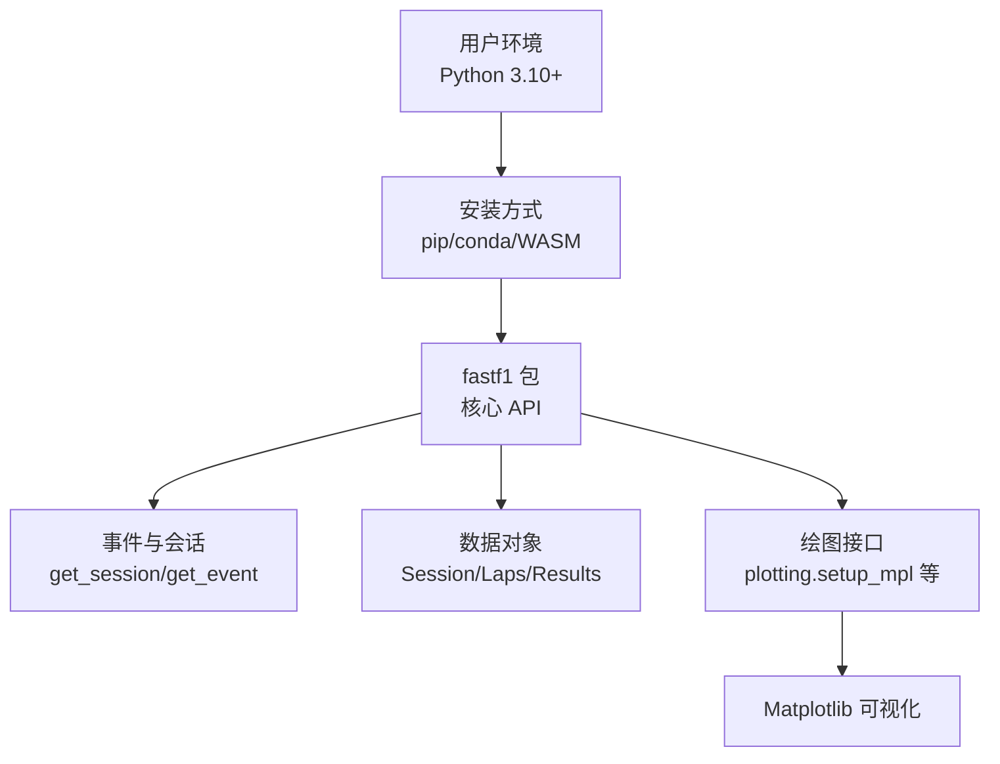
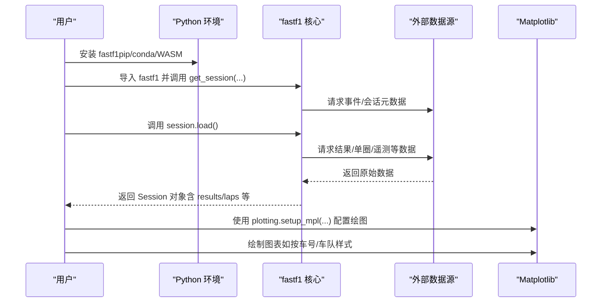
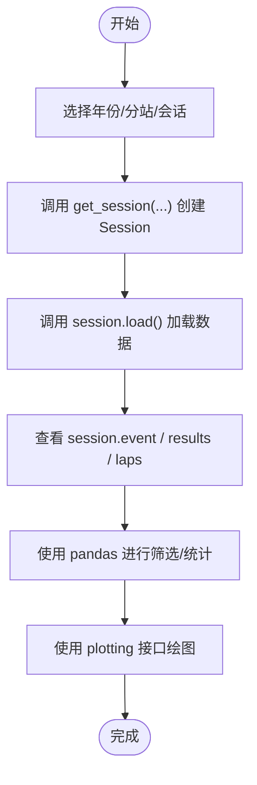
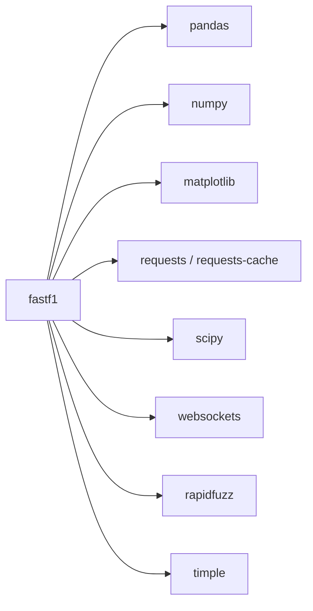

# 快速开始

<cite>
**本文引用的文件**
- [README.md](file://README.md)
- [docs/getting_started/installation.rst](file://docs/getting_started/installation.rst)
- [docs/getting_started/basics.rst](file://docs/getting_started/basics.rst)
- [docs/getting_started/index.rst](file://docs/getting_started/index.rst)
- [pyproject.toml](file://pyproject.toml)
- [requirements/minver.txt](file://requirements/minver.txt)
- [requirements/dev.txt](file://requirements/dev.txt)
- [fastf1/__init__.py](file://fastf1/__init__.py)
- [fastf1/events.py](file://fastf1/events.py)
- [fastf1/core.py](file://fastf1/core.py)
- [fastf1/plotting/__init__.py](file://fastf1/plotting/__init__.py)
- [examples/general/plot_driver_styling.py](file://examples/general/plot_driver_styling.py)
- [backend/requirements.txt](file://backend/requirements.txt)
</cite>

## 目录
1. [简介](#简介)
2. [项目结构](#项目结构)
3. [核心组件](#核心组件)
4. [架构总览](#架构总览)
5. [详细组件分析](#详细组件分析)
6. [依赖分析](#依赖分析)
7. [性能考虑](#性能考虑)
8. [故障排除指南](#故障排除指南)
9. [结论](#结论)
10. [附录](#附录)

## 简介
本指南面向初学者，帮助你在最短时间内安装并运行 Fast-F1，获取 F1 数据、创建会话对象，并进行基础的数据分析与可视化。你将学会：
- 使用 pip 与 conda 安装
- 在 Pyodide、JupyterLite 等 WASM 环境中的特殊安装步骤
- 基本的导入语句与数据访问模式
- 获取会话、加载结果与单圈数据、进行简单统计与绘图
- 常见问题排查与最佳实践

## 项目结构
本仓库包含文档、核心库、示例与后端服务等部分。与“快速开始”直接相关的关键位置如下：
- 文档：docs/getting_started 下的安装与基础入门
- 核心库：fastf1 包含事件加载、会话对象、绘图接口等
- 示例：examples/general 展示了绘图与样式设置的基础用法
- 后端：backend 提供基于 FastF1 的服务依赖清单（便于理解生态）

图表来源
- [docs/getting_started/installation.rst:1-27](file://docs/getting_started/installation.rst#L1-L27)
- [pyproject.toml:29-45](file://pyproject.toml#L29-L45)
- [fastf1/events.py:50-139](file://fastf1/events.py#L50-L139)
- [fastf1/plotting/__init__.py:1-48](file://fastf1/plotting/__init__.py#L1-L48)

章节来源
- [docs/getting_started/index.rst:1-13](file://docs/getting_started/index.rst#L1-L13)
- [docs/getting_started/installation.rst:1-27](file://docs/getting_started/installation.rst#L1-L27)
- [pyproject.toml:1-136](file://pyproject.toml#L1-L136)

## 核心组件
- 事件与会话加载：通过 get_session、get_event、get_event_schedule 等函数加载指定年份、分站或测试周的数据。
- 会话对象：Session 是一切分析的核心，包含 event、results、laps 等属性；需要调用 load() 加载具体数据。
- 数据结构：结果与单圈数据均以扩展的 pandas DataFrame/Series 形式提供，便于直接使用 pandas 进行筛选、聚合与统计。
- 绘图接口：plotting 模块提供颜色、样式、图例排序等工具，配合 Matplotlib 实现快速可视化。

章节来源
- [fastf1/events.py:50-139](file://fastf1/events.py#L50-L139)
- [fastf1/core.py:64-200](file://fastf1/core.py#L64-L200)
- [fastf1/plotting/__init__.py:1-48](file://fastf1/plotting/__init__.py#L1-L48)

## 架构总览
下图展示了从安装到数据加载与可视化的整体流程。

图表来源
- [docs/getting_started/basics.rst:11-111](file://docs/getting_started/basics.rst#L11-L111)
- [docs/getting_started/basics.rst:213-340](file://docs/getting_started/basics.rst#L213-L340)
- [fastf1/events.py:50-139](file://fastf1/events.py#L50-L139)
- [fastf1/plotting/__init__.py:1-48](file://fastf1/plotting/__init__.py#L1-L48)

## 详细组件分析

### 安装与环境要求
- Python 版本：要求 Python 3.10 或更高版本。
- 推荐安装方式：
  - pip 安装：使用 pip 安装官方包。
  - conda 安装：通过 conda-forge 通道安装。
  - PyPI 源码/轮子：可直接从 PyPI 下载并安装。
- WASM 环境（Pyodide/JupyterLite）：在这些基于 WebAssembly 的环境中，FastF1 大体兼容，但需要额外步骤。请参考 README 中提供的外部仓库与讨论链接获取详细指引。

章节来源
- [docs/getting_started/installation.rst:1-27](file://docs/getting_started/installation.rst#L1-L27)
- [README.md:20-44](file://README.md#L20-L44)
- [pyproject.toml:27](file://pyproject.toml#L27)

### 基础使用：导入与常用 API
- 常用导入语句（来自包导出）：
  - from fastf1 import get_session, get_event, get_event_schedule, set_log_level, Cache
  - from fastf1.plotting import setup_mpl, get_driver_style, add_sorted_driver_legend 等
- 入门流程：
  - 使用 get_session 加载指定年份、分站与会话类型（练习/排位/冲刺/正赛等）。
  - 调用 session.load() 加载具体数据（结果、单圈、遥测等）。
  - 通过 session.results 与 session.laps 访问 pandas DataFrame，进行筛选与统计。
  - 使用 plotting.setup_mpl(...) 配置绘图支持（如 timedelta 显示），再绘制图表。

章节来源
- [fastf1/__init__.py:17-26](file://fastf1/__init__.py#L17-L26)
- [docs/getting_started/basics.rst:11-111](file://docs/getting_started/basics.rst#L11-L111)
- [docs/getting_started/basics.rst:213-340](file://docs/getting_started/basics.rst#L213-L340)

### 事件与会话加载
- get_session(year, gp, identifier, ...)：根据年份、分站（名称或轮次）、会话标识（名称缩写或编号）创建 Session 对象。
- get_event(year, gp, ...)：直接获取 Event 对象，再通过其方法选择对应会话。
- get_testing_session(...)：用于测试周的会话加载。
- 会话对象属性：
  - session.event：事件信息（国家、地点、各会话时间等）
  - session.results：结果数据（包含车号、车手、排位、Q1/Q2/Q3、时间、状态等）
  - session.laps：单圈数据（包含每圈时间、节速、轮胎、进站等）

图表来源
- [fastf1/events.py:50-139](file://fastf1/events.py#L50-L139)
- [docs/getting_started/basics.rst:11-111](file://docs/getting_started/basics.rst#L11-L111)
- [docs/getting_started/basics.rst:213-340](file://docs/getting_started/basics.rst#L213-L340)

章节来源
- [fastf1/events.py:50-139](file://fastf1/events.py#L50-L139)
- [docs/getting_started/basics.rst:11-111](file://docs/getting_started/basics.rst#L11-L111)

### 数据访问与分析模式
- 结果数据（session.results）：以 DataFrame 形式提供，包含车手、车队、排位、Q1/Q2/Q3、时间、状态、积分等列，可直接用 pandas 进行筛选与排序。
- 单圈数据（session.laps）：包含每圈时间、节速、轮胎、进站、位置变化等列，适合做分布统计、最快圈、节速分析等。
- 会话日程（get_event_schedule）：返回包含全年分站信息的 DataFrame，可用于筛选特定分站或轮次。

章节来源
- [docs/getting_started/basics.rst:213-340](file://docs/getting_started/basics.rst#L213-L340)

### 绘图与样式
- 绘图准备：调用 plotting.setup_mpl(...) 启用对 timedelta 的支持并加载主题色。
- 车手样式：使用 plotting.get_driver_style(...) 获取车手颜色/线型等样式参数，结合 pandas 数据绘制多车对比图。
- 图例排序：使用 plotting.add_sorted_driver_legend(...) 自动按车手/车队顺序排列图例。
- 示例参考：examples/general/plot_driver_styling.py 展示了完整的绘图流程与样式定制。

章节来源
- [fastf1/plotting/__init__.py:1-48](file://fastf1/plotting/__init__.py#L1-L48)
- [examples/general/plot_driver_styling.py:1-108](file://examples/general/plot_driver_styling.py#L1-L108)

## 依赖分析
- 最低 Python 版本：3.10
- 关键依赖（来自 pyproject.toml）：pandas、numpy、matplotlib、requests、requests-cache、scipy、websockets、rapidfuzz、timple 等
- 开发依赖（requirements/dev.txt）：pytest、ruff、isort、xdoctest 等
- 后端服务依赖（backend/requirements.txt）：FastAPI、Uvicorn、OpenAI、APScheduler 等（用于服务侧集成）

图表来源
- [pyproject.toml:29-45](file://pyproject.toml#L29-L45)

章节来源
- [pyproject.toml:29-45](file://pyproject.toml#L29-L45)
- [requirements/minver.txt:1-8](file://requirements/minver.txt#L1-L8)
- [requirements/dev.txt:1-10](file://requirements/dev.txt#L1-L10)
- [backend/requirements.txt:1-15](file://backend/requirements.txt#L1-L15)

## 性能考虑
- 使用缓存：FastF1 内置缓存机制，建议首次加载后复用，避免重复请求外部 API。
- 数据量控制：在绘图前先筛选“快圈”或去除异常慢圈，有助于提升可视化效果与性能。
- 依赖版本：遵循最低版本要求，确保兼容性与稳定性。

## 故障排除指南
- Python 版本过低：请升级至 Python 3.10 或更高版本。
- 安装失败（WASM 环境）：在 Pyodide/JupyterLite 中，需参考 README 提供的外部仓库与讨论链接进行额外配置。
- 数据未加载：确保调用 session.load() 以拉取实际数据；若网络受限，检查缓存是否生效。
- 绘图报错（timedelta）：在绘图前调用 plotting.setup_mpl(...) 以启用 timedelta 支持。
- 会话/事件名模糊匹配：当使用字符串名称时，FastF1 采用模糊匹配，必要时提供更精确的名称或使用轮次号。

章节来源
- [docs/getting_started/installation.rst:19-27](file://docs/getting_started/installation.rst#L19-L27)
- [README.md:36-44](file://README.md#L36-L44)
- [docs/getting_started/basics.rst:213-340](file://docs/getting_started/basics.rst#L213-L340)

## 结论
通过本指南，你已掌握：
- 安装与环境准备（pip/conda/WASM）
- 基本导入与数据访问模式
- 事件/会话加载与数据加载流程
- 简单的结果与单圈数据分析
- 使用 plotting 接口进行可视化

建议下一步：
- 阅读 docs/getting_started/basics.rst 的完整示例
- 查看 examples/general/plot_driver_styling.py 的绘图实战
- 尝试使用 get_event_schedule() 获取全年日程并筛选目标分站

## 附录
- 常用 API 快查
  - get_session(year, gp, identifier)
  - get_event(year, gp)
  - get_event_schedule(year)
  - session.load()
  - plotting.setup_mpl(...)
  - plotting.get_driver_style(...)
  - plotting.add_sorted_driver_legend(...)

章节来源
- [docs/getting_started/basics.rst:11-111](file://docs/getting_started/basics.rst#L11-L111)
- [docs/getting_started/basics.rst:213-340](file://docs/getting_started/basics.rst#L213-L340)
- [fastf1/plotting/__init__.py:1-48](file://fastf1/plotting/__init__.py#L1-L48)