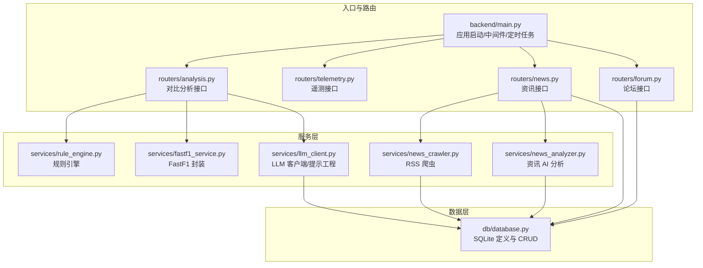
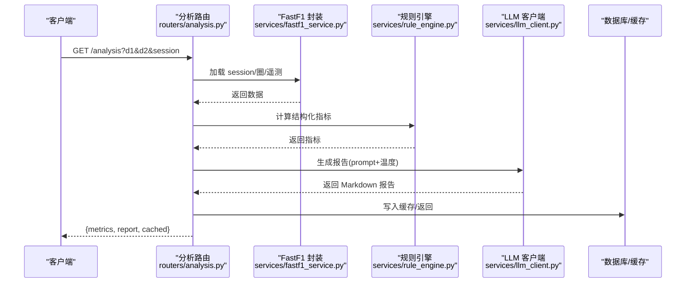
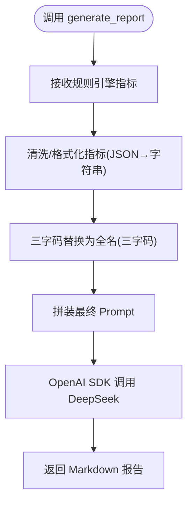
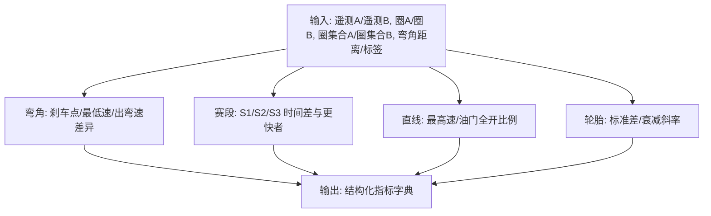
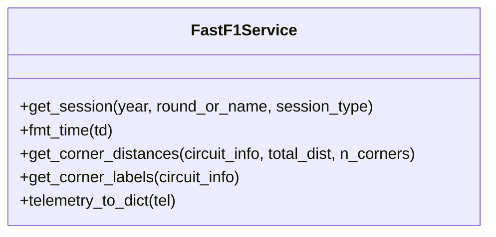
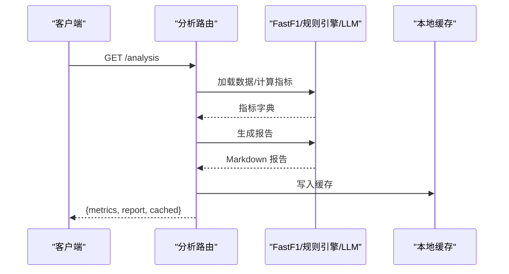
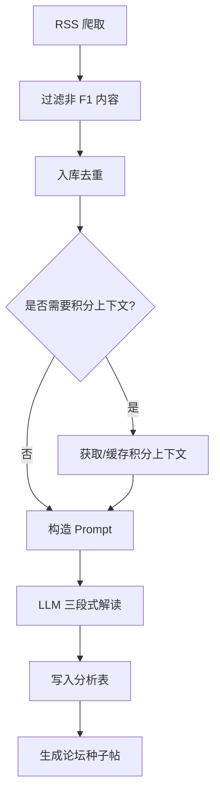
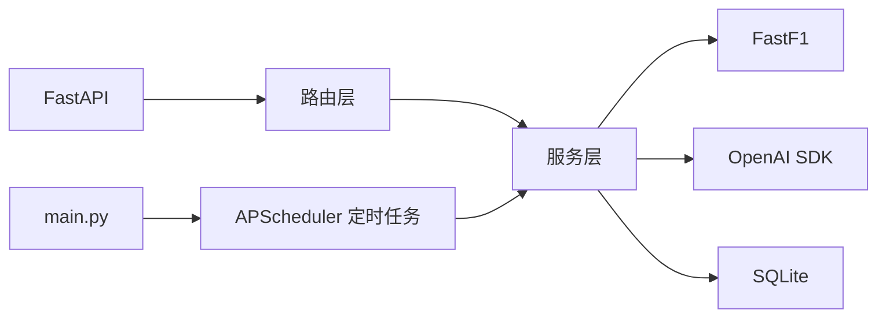

# AI 分析报告

<cite>
**本文档引用的文件**
- [backend/main.py](file://backend/main.py)
- [backend/routers/analysis.py](file://backend/routers/analysis.py)
- [backend/routers/telemetry.py](file://backend/routers/telemetry.py)
- [backend/routers/news.py](file://backend/routers/news.py)
- [backend/routers/forum.py](file://backend/routers/forum.py)
- [backend/services/llm_client.py](file://backend/services/llm_client.py)
- [backend/services/rule_engine.py](file://backend/services/rule_engine.py)
- [backend/services/fastf1_service.py](file://backend/services/fastf1_service.py)
- [backend/services/news_analyzer.py](file://backend/services/news_analyzer.py)
- [backend/services/news_crawler.py](file://backend/services/news_crawler.py)
- [backend/db/database.py](file://backend/db/database.py)
- [backend/models/response.py](file://backend/models/response.py)
- [backend/requirements.txt](file://backend/requirements.txt)
- [backend/start.sh](file://backend/start.sh)
- [memory/llm_api.md](file://memory/llm_api.md)
</cite>

## 目录
1. [简介](#简介)
2. [项目结构](#项目结构)
3. [核心组件](#核心组件)
4. [架构总览](#架构总览)
5. [详细组件分析](#详细组件分析)
6. [依赖关系分析](#依赖关系分析)
7. [性能考量](#性能考量)
8. [故障排除指南](#故障排除指南)
9. [结论](#结论)
10. [附录](#附录)

## 简介
本项目为 Fast-F1 AI 分析报告系统，围绕“数据采集—规则引擎—LLM 提示工程—报告生成”的完整链路构建。系统提供两类 AI 分析能力：
- 赛事对比分析：基于 FastF1 遥测与圈数据，通过规则引擎提取结构化指标，交由 LLM 生成中文分析报告。
- 资讯 AI 解读：对 F1 新闻进行三段式解读（技术要点/通俗解释/赛况影响），并自动生成论坛种子帖。

系统采用 FastAPI 提供 REST 接口，内置 SQLite 数据库承载资讯、分析结果、论坛内容与用户体系，并通过定时任务实现数据爬取与缓存预热。

## 项目结构
后端采用按功能模块划分的组织方式：
- 路由层：按业务域拆分，如分析、遥测、新闻、论坛等。
- 服务层：封装 LLM 客户端、规则引擎、FastF1 封装、新闻爬取与分析等。
- 数据层：SQLite 模式定义与 CRUD 实现。
- 入口与启动：FastAPI 应用、CORS、定时任务与缓存预热。



图表来源
- [backend/main.py:18-41](file://backend/main.py#L18-L41)
- [backend/routers/analysis.py:10-121](file://backend/routers/analysis.py#L10-L121)
- [backend/routers/telemetry.py:9-79](file://backend/routers/telemetry.py#L9-L79)
- [backend/routers/news.py:20-190](file://backend/routers/news.py#L20-L190)
- [backend/routers/forum.py:33-327](file://backend/routers/forum.py#L33-L327)
- [backend/services/llm_client.py:1-136](file://backend/services/llm_client.py#L1-L136)
- [backend/services/rule_engine.py:1-146](file://backend/services/rule_engine.py#L1-L146)
- [backend/services/fastf1_service.py:1-64](file://backend/services/fastf1_service.py#L1-L64)
- [backend/services/news_crawler.py:1-148](file://backend/services/news_crawler.py#L1-L148)
- [backend/services/news_analyzer.py:1-298](file://backend/services/news_analyzer.py#L1-L298)
- [backend/db/database.py:1-160](file://backend/db/database.py#L1-L160)

章节来源
- [backend/main.py:18-157](file://backend/main.py#L18-L157)
- [backend/requirements.txt:1-15](file://backend/requirements.txt#L1-L15)
- [backend/start.sh:1-25](file://backend/start.sh#L1-L25)

## 核心组件
- LLM 客户端与提示工程
  - 通过 OpenAI 兼容 SDK 调用 DeepSeek API，封装客户端实例与统一提示模板，支持温度与最大 token 控制。
  - 对规则引擎输出的 JSON 指标进行清洗与格式化，将三字码替换为全名，保证 LLM 输出一致性。
- 规则引擎
  - 针对弯角、赛段、直线/油门、轮胎稳定性四个维度，计算差异与统计特征，输出结构化指标。
- FastF1 数据服务
  - 统一封装 session 加载、时间格式化、弯角距离与标签提取、遥测序列化等。
- 资讯爬取与分析
  - RSS 爬取、去噪与入库；按需注入 2026 赛季积分上下文；三段式解读与论坛种子帖生成。
- 数据库与模型
  - 定义资讯、分析结果、分区、用户、帖子、评论、术语等表结构，提供 CRUD 与索引。
- API 路由
  - 对外暴露分析、遥测、资讯、论坛等接口，统一响应模型。

章节来源
- [backend/services/llm_client.py:13-136](file://backend/services/llm_client.py#L13-L136)
- [backend/services/rule_engine.py:10-146](file://backend/services/rule_engine.py#L10-L146)
- [backend/services/fastf1_service.py:14-64](file://backend/services/fastf1_service.py#L14-L64)
- [backend/services/news_analyzer.py:25-298](file://backend/services/news_analyzer.py#L25-L298)
- [backend/services/news_crawler.py:15-148](file://backend/services/news_crawler.py#L15-L148)
- [backend/db/database.py:26-160](file://backend/db/database.py#L26-L160)
- [backend/models/response.py:4-14](file://backend/models/response.py#L4-L14)

## 架构总览
系统采用“路由 → 服务 → 数据库”的分层设计，核心流程如下：
- 对比分析：路由接收参数 → 加载 FastF1 数据 → 规则引擎计算指标 → LLM 生成报告 → 结果缓存与返回。
- 资讯分析：路由触发 → 爬取 RSS → 入库 → 选择性注入积分上下文 → LLM 三段式解读 → 写入分析表并生成种子帖。



图表来源
- [backend/routers/analysis.py:35-121](file://backend/routers/analysis.py#L35-L121)
- [backend/services/fastf1_service.py:14-64](file://backend/services/fastf1_service.py#L14-L64)
- [backend/services/rule_engine.py:136-146](file://backend/services/rule_engine.py#L136-L146)
- [backend/services/llm_client.py:77-136](file://backend/services/llm_client.py#L77-L136)

## 详细组件分析

### LLM 客户端与提示工程
- 客户端初始化
  - 单例客户端，基于环境变量加载 API Key 与 DeepSeek Base URL。
- 提示工程
  - 严格限定输出格式（Markdown）、车手身份映射、指标精简文本化、三字码替换为“全名(三字码)”。
  - 温度与 token 限制，兼顾稳定性和成本控制。
- 调用流程
  - 由分析路由组装 prompt，调用 chat.completions 接口，返回内容即为报告正文。



图表来源
- [backend/services/llm_client.py:77-136](file://backend/services/llm_client.py#L77-L136)

章节来源
- [backend/services/llm_client.py:13-136](file://backend/services/llm_client.py#L13-L136)
- [memory/llm_api.md:1-39](file://memory/llm_api.md#L1-L39)

### 规则引擎：指标计算与执行逻辑
- 弯角分析
  - 以每个弯角为中心±一定距离窗口，提取刹车点、最低速、出弯速差异，标注刹车点相对优劣。
- 赛段分析
  - 计算 S1/S2/S3 圈时间差与更快车手，处理缺失值与类型兼容。
- 直线与油门效率
  - 最高速与油门全开比例，比较两位车手表现。
- 轮胎稳定性
  - 圈时标准差与线性衰减斜率，评估稳定性与退化趋势。
- 汇总输出
  - 将四类指标整合为统一字典，供 LLM 提示工程使用。



图表来源
- [backend/services/rule_engine.py:10-146](file://backend/services/rule_engine.py#L10-L146)

章节来源
- [backend/services/rule_engine.py:10-146](file://backend/services/rule_engine.py#L10-L146)

### FastF1 数据服务：统一封装与缓存
- Session 缓存
  - 进程内缓存同一 session，避免重复加载。
- 时间格式化
  - 将 timedelta 转换为“分:秒.毫秒”字符串，处理 NaN 与切片。
- 弯角信息
  - 当电路信息中的弯角距离为 NaN 时，按总距离等间距回退。
- 遥测序列化
  - 将 DataFrame 转为可 JSON 序列化的字典，处理 NaN。



图表来源
- [backend/services/fastf1_service.py:14-64](file://backend/services/fastf1_service.py#L14-L64)

章节来源
- [backend/services/fastf1_service.py:14-64](file://backend/services/fastf1_service.py#L14-L64)

### 对比分析流程：从数据到报告
- 输入参数
  - 年份、轮次/事件、两位车手、会话类型、是否强制刷新缓存。
- 数据获取
  - 加载 session，提取最快圈与全量圈，构造遥测并计算弯角距离与标签。
- 指标计算
  - 调用规则引擎，得到结构化指标。
- 报告生成
  - 调用 LLM 客户端，返回 Markdown 报告。
- 缓存与返回
  - 写入本地 JSON 缓存目录，返回统一响应模型。



图表来源
- [backend/routers/analysis.py:35-121](file://backend/routers/analysis.py#L35-L121)
- [backend/services/llm_client.py:77-136](file://backend/services/llm_client.py#L77-L136)
- [backend/services/rule_engine.py:136-146](file://backend/services/rule_engine.py#L136-L146)
- [backend/services/fastf1_service.py:14-64](file://backend/services/fastf1_service.py#L14-L64)

章节来源
- [backend/routers/analysis.py:35-121](file://backend/routers/analysis.py#L35-L121)

### 资讯 AI 分析：爬取、上下文与解读
- 爬取
  - 多源 RSS 解析，过滤非 F1 内容，入库去重。
- 上下文注入
  - 仅对涉及积分/排名/冠军的新闻注入 2026 赛季积分上下文，30 分钟 TTL。
- 解读
  - 三段式输出（技术要点/通俗解释/赛况影响），解析器按标题分段。
- 种子帖
  - 自动在论坛分区生成 AI 种子帖，便于社区传播。



图表来源
- [backend/services/news_crawler.py:90-148](file://backend/services/news_crawler.py#L90-L148)
- [backend/services/news_analyzer.py:25-298](file://backend/services/news_analyzer.py#L25-L298)

章节来源
- [backend/services/news_crawler.py:1-148](file://backend/services/news_crawler.py#L1-L148)
- [backend/services/news_analyzer.py:1-298](file://backend/services/news_analyzer.py#L1-L298)

### 数据库与模型：表结构与关系
- 主要表
  - 资讯 news、资讯分析 news_analysis、分区 sections、用户 users、帖子 posts、评论 comments、术语 terms、车手评分 driver_ratings、车手评论 driver_comments。
- 关键关系
  - news 与 news_analysis 1:1；posts 与 sections、users 多对一；comments 与 posts 多对一；driver_ratings/comments 与 driver_code 唯一约束。
- 索引
  - 为热点查询建立索引，提升分页与筛选性能。

```mermaid
erDiagram
NEWS {
int id PK
text title
text summary
text url UK
text source
int published_at
int created_at
}
NEWS_ANALYSIS {
int id PK
int news_id UK FK
text tech_points
text plain_explain
text race_impact
text raw_report
int created_at
}
SECTIONS {
int id PK
text type
text name
text slug UK
int sort_order
}
USERS {
text openid PK
text nickname
text avatar_url
int created_at
}
POSTS {
int id PK
int section_id FK
int news_id FK
text title
text content
text author_openid FK
text author_nickname
text status
int is_seeded
int view_count
int comment_count
int created_at
int updated_at
}
COMMENTS {
int id PK
int post_id FK
text content
text author_openid
text author_nickname
text status
int created_at
}
TERMS {
int id PK
text slug UK
text name_zh
text name_en
text aliases
text short_def
text full_def
text example
text category
int level
text related_slugs
int spec_year
text status
text submitted_by
int created_at
}
DRIVER_RATINGS {
int id PK
text driver_code
text openid
int speed
int consist
int defend
int wet
int mental
int created_at
UK (driver_code, openid)
}
DRIVER_COMMENTS {
int id PK
text driver_code
text content
text author_openid
text author_nickname
int likes
int created_at
}
NEWS ||--|| NEWS_ANALYSIS : "1:1"
SECTIONS ||--o{ POSTS : "1:N"
USERS ||--o{ POSTS : "1:N"
USERS ||--o{ COMMENTS : "1:N"
POSTS ||--o{ COMMENTS : "1:N"
NEWS ||--o{ POSTS : "1:N"
```

图表来源
- [backend/db/database.py:26-160](file://backend/db/database.py#L26-L160)

章节来源
- [backend/db/database.py:1-160](file://backend/db/database.py#L1-L160)

### API 与使用示例
- 对比分析
  - GET /analysis?year=2026&event=日本大奖赛&d1=ALB&d2=ALO&session=Q
  - 返回包含指标与报告的 JSON，支持 force=true 强制刷新缓存。
- 遥测导出
  - GET /telemetry?event=日本大奖赛&d1=ALB&d2=ALO&session=Q
  - 返回车手基本信息、弯角标签、遥测序列化数据与缺口提示。
- 资讯与论坛
  - GET /news 列表、GET /news/{id} 详情、POST /news/{id}/analyze-public 触发分析。
  - GET /forum/posts 列表、POST /forum/posts 发帖、POST /forum/posts/{id}/comments 评论。

章节来源
- [backend/routers/analysis.py:35-121](file://backend/routers/analysis.py#L35-L121)
- [backend/routers/telemetry.py:11-79](file://backend/routers/telemetry.py#L11-L79)
- [backend/routers/news.py:68-190](file://backend/routers/news.py#L68-L190)
- [backend/routers/forum.py:153-327](file://backend/routers/forum.py#L153-L327)

## 依赖关系分析
- 外部依赖
  - FastAPI、FastF1、OpenAI SDK、NumPy、Pandas、SciPy、feedparser、trafilatura、APScheduler 等。
- 内部耦合
  - 分析路由依赖 FastF1 封装、规则引擎与 LLM 客户端；资讯路由依赖爬虫与分析服务；论坛路由依赖数据库。
- 缓存与定时
  - 启动时进行 session 与 API 缓存预热；定时任务每小时爬取新闻并触发分析。



图表来源
- [backend/requirements.txt:1-15](file://backend/requirements.txt#L1-L15)
- [backend/main.py:117-137](file://backend/main.py#L117-L137)

章节来源
- [backend/requirements.txt:1-15](file://backend/requirements.txt#L1-L15)
- [backend/main.py:117-137](file://backend/main.py#L117-L137)

## 性能考量
- 缓存策略
  - FastF1 session 进程内缓存，避免重复加载；分析结果本地 JSON 缓存；资讯标签与分区内存缓存。
  - 启动时后台线程预热 session 与常用 API 缓存，缩短首次响应时间。
- 数据处理
  - 规则引擎使用向量化计算（NumPy/SciPy/Pandas），减少 Python 循环开销。
- LLM 调用
  - 控制温度与 token，合理裁剪指标 JSON，降低成本与延迟。
- I/O 与并发
  - SQLite WAL 模式提升并发写入稳定性；APScheduler 后台任务避免阻塞主请求。

章节来源
- [backend/main.py:55-115](file://backend/main.py#L55-L115)
- [backend/services/rule_engine.py:5-8](file://backend/services/rule_engine.py#L5-L8)
- [backend/services/llm_client.py:130-134](file://backend/services/llm_client.py#L130-L134)
- [backend/db/database.py:17-18](file://backend/db/database.py#L17-L18)

## 故障排除指南
- LLM 调用失败
  - 检查 DEEPSEEK_API_KEY 是否正确加载；确认 base_url 与网络连通；查看响应状态与错误信息。
- FastF1 数据缺失
  - 遥测数据可能因数据包丢失导致长度不足，路由会返回提示；可尝试更换车手或会话。
- 资讯分析异常
  - RSS 解析失败或内容为空时会降级使用摘要；检查网络与 RSS 源可用性。
- 权限与认证
  - 管理员操作需携带 ADMIN_TOKEN；微信登录需正确配置 AppID/Secret。
- 数据库问题
  - 确认数据库文件存在与权限；必要时重建表结构（幂等初始化）。

章节来源
- [backend/services/llm_client.py:13-20](file://backend/services/llm_client.py#L13-L20)
- [backend/routers/telemetry.py:36-44](file://backend/routers/telemetry.py#L36-L44)
- [backend/services/news_crawler.py:90-117](file://backend/services/news_crawler.py#L90-L117)
- [backend/routers/news.py:159-190](file://backend/routers/news.py#L159-L190)
- [backend/db/database.py:204-214](file://backend/db/database.py#L204-L214)

## 结论
本系统以规则引擎与 LLM 提示工程为核心，实现了从结构化指标到中文分析报告的自动化流程，并配套资讯爬取与解读能力。通过缓存与定时任务优化性能，借助 SQLite 承载轻量业务数据，满足移动端与 Web 的使用场景。后续可在模型选择、提示模板迭代与可视化展示方面持续增强。

## 附录

### 使用示例与配置
- 环境准备
  - 安装依赖：pip install -r backend/requirements.txt
  - 设置 .env（包含 DEEPSEEK_API_KEY 等），启动脚本会自动加载。
- 启动服务
  - bash backend/start.sh，监听 0.0.0.0:8000。
- 常用接口
  - 对比分析：GET /analysis?event=日本大奖赛&d1=ALB&d2=ALO&session=Q
  - 遥测导出：GET /telemetry?event=日本大奖赛&d1=ALB&d2=ALO&session=Q
  - 资讯分析：POST /news/{id}/analyze-public

章节来源
- [backend/start.sh:16-25](file://backend/start.sh#L16-L25)
- [backend/routers/analysis.py:35-121](file://backend/routers/analysis.py#L35-L121)
- [backend/routers/telemetry.py:11-79](file://backend/routers/telemetry.py#L11-L79)
- [backend/routers/news.py:128-157](file://backend/routers/news.py#L128-L157)

### 模型选择与调优策略
- 模型接入
  - 使用 OpenAI 兼容 SDK，更换 base_url 与 API Key 即可切换供应商。
- 温度与 token
  - 分析报告：temperature=0.4，max_tokens=1500；资讯解读：temperature=0.3，max_tokens=900。
- 上下文控制
  - 仅在涉及积分/排名时注入积分上下文，减少 token 消耗。

章节来源
- [backend/services/llm_client.py:130-134](file://backend/services/llm_client.py#L130-L134)
- [backend/services/news_analyzer.py:236-244](file://backend/services/news_analyzer.py#L236-L244)
- [memory/llm_api.md:12-39](file://memory/llm_api.md#L12-L39)

### 与传统分析方法的结合
- 结构化指标
  - 规则引擎提供客观、可复现的差异与统计特征，作为 LLM 的高质量输入。
- 专家经验
  - 将领域知识固化为提示模板与输出约束，提升报告的专业性与一致性。
- 可视化与交互
  - 遥测接口输出可用于前端可视化，结合报告形成“数据—洞察—呈现”的闭环。

章节来源
- [backend/services/rule_engine.py:10-146](file://backend/services/rule_engine.py#L10-L146)
- [backend/routers/telemetry.py:66-76](file://backend/routers/telemetry.py#L66-L76)

### 安全与隐私
- API 访问控制
  - 管理员接口需携带 ADMIN_TOKEN；微信登录通过后端换取 openid，避免泄露 AppSecret。
- 数据最小化
  - 仅在必要时注入积分上下文；对 RSS 摘要进行清理与截断。
- 存储与传输
  - SQLite 文件权限控制；HTTPS 传输；敏感字段（如用户头像）按需存储。

章节来源
- [backend/routers/news.py:22-65](file://backend/routers/news.py#L22-L65)
- [backend/routers/forum.py:57-73](file://backend/routers/forum.py#L57-L73)
- [backend/services/news_crawler.py:64-72](file://backend/services/news_crawler.py#L64-L72)