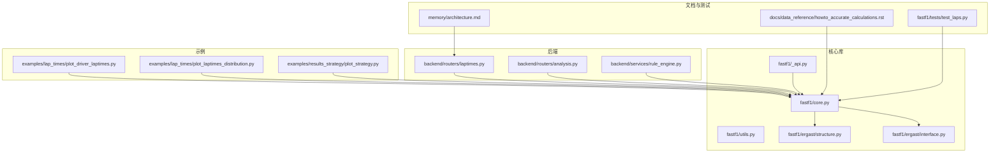
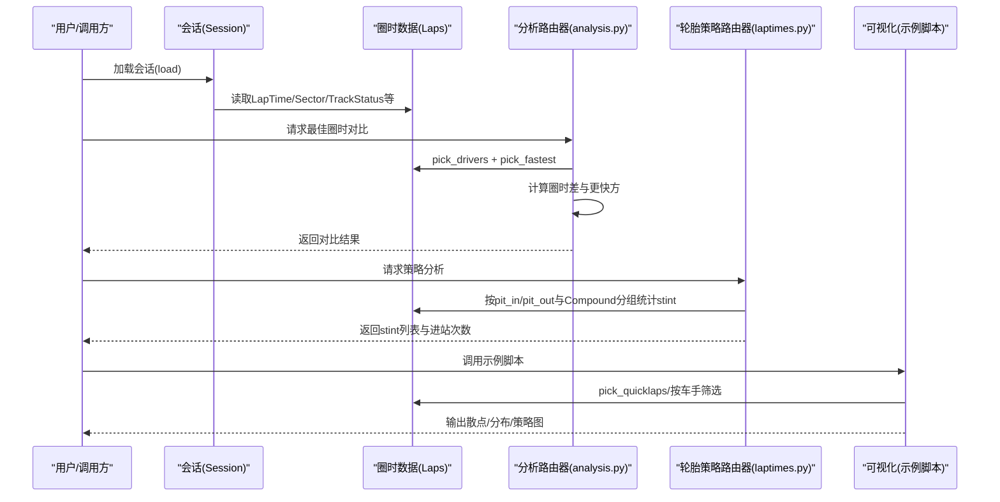
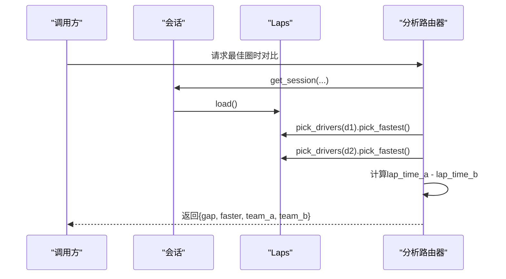
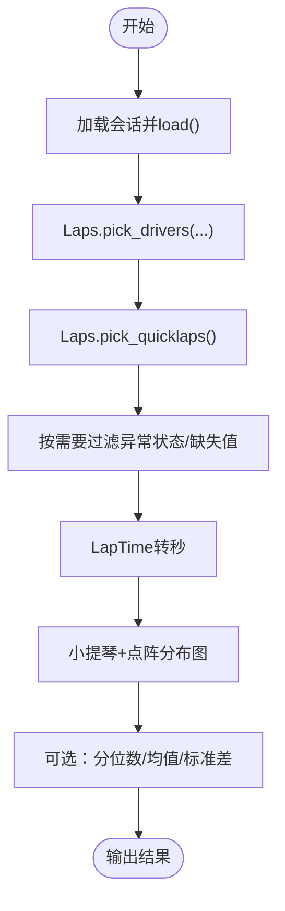
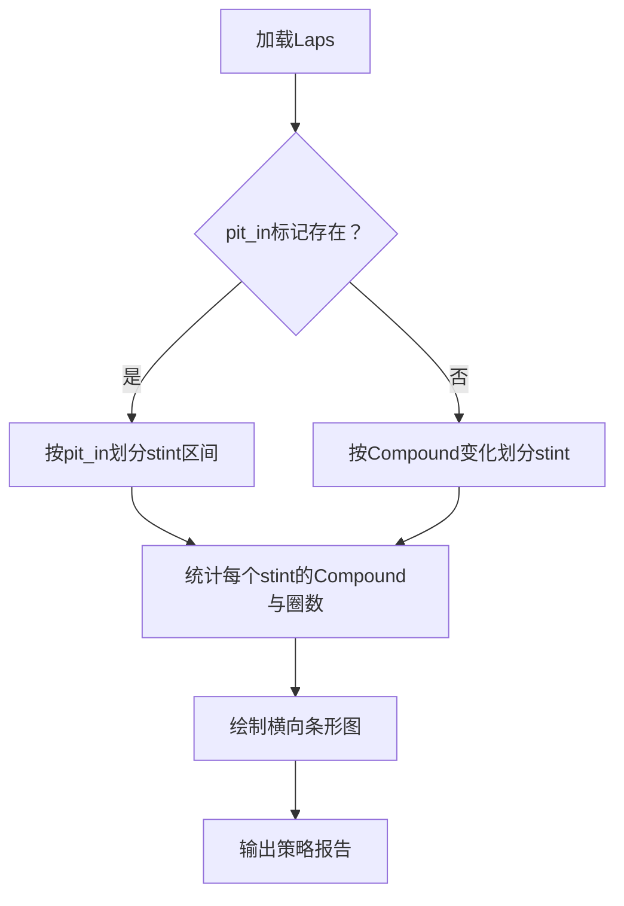
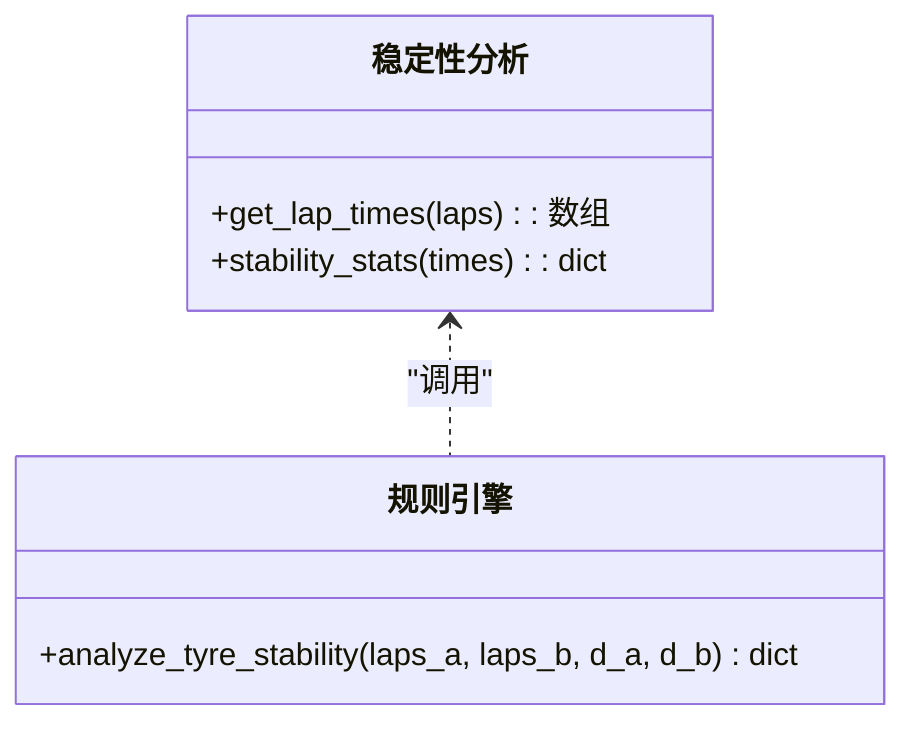
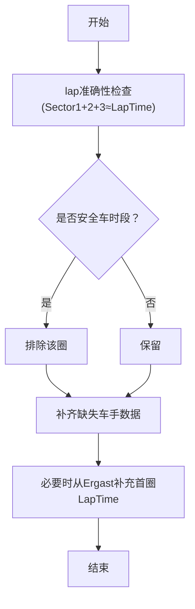
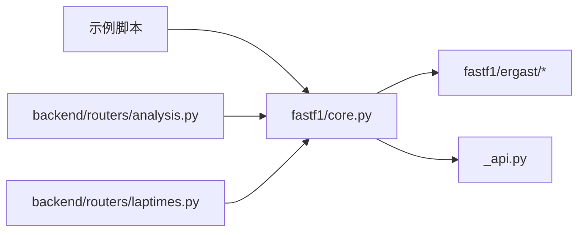

# 圈时分析

<cite>
**本文引用的文件**
- [examples/lap_times/plot_driver_laptimes.py](file://examples/lap_times/plot_driver_laptimes.py)
- [examples/lap_times/plot_laptimes_distribution.py](file://examples/lap_times/plot_laptimes_distribution.py)
- [examples/results_strategy/plot_strategy.py](file://examples/results_strategy/plot_strategy.py)
- [backend/routers/laptimes.py](file://backend/routers/laptimes.py)
- [backend/services/rule_engine.py](file://backend/services/rule_engine.py)
- [backend/routers/analysis.py](file://backend/routers/analysis.py)
- [fastf1/core.py](file://fastf1/core.py)
- [fastf1/utils.py](file://fastf1/utils.py)
- [fastf1/_api.py](file://fastf1/_api.py)
- [fastf1/events.py](file://fastf1/events.py)
- [fastf1/ergast/structure.py](file://fastf1/ergast/structure.py)
- [fastf1/ergast/interface.py](file://fastf1/ergast/interface.py)
- [docs/data_reference/howto_accurate_calculations.rst](file://docs/data_reference/howto_accurate_calculations.rst)
- [memory/architecture.md](file://memory/architecture.md)
- [fastf1/tests/test_laps.py](file://fastf1/tests/test_laps.py)
</cite>

## 目录
1. [简介](#简介)
2. [项目结构](#项目结构)
3. [核心组件](#核心组件)
4. [架构总览](#架构总览)
5. [详细组件分析](#详细组件分析)
6. [依赖分析](#依赖分析)
7. [性能考虑](#性能考虑)
8. [故障排查指南](#故障排查指南)
9. [结论](#结论)
10. [附录](#附录)

## 简介
本文件围绕 Fast-F1 的圈时分析能力，系统化梳理“最佳圈时对比”“圈时分布分析”“策略分析（进站时机、轮胎策略、燃油策略）”“数据聚合与统计（平均、标准差、趋势）”等主题，并结合仓库中的示例与后端分析模块，给出可操作的实现路径、可视化方案、数据预处理与清洗策略、排位赛与正赛数据差异处理方式，以及面向大数据量的性能优化建议。

## 项目结构
- 示例层：examples/lap_times 提供散点与分布两类圈时可视化；examples/results_strategy 提供正赛轮胎策略条形图。
- 后端层：backend/routers 提供分析接口；backend/services 提供规则引擎与指标计算。
- 核心库：fastf1/core.py 提供会话、圈时、轮胎信息、准确性校验等；fastf1/utils.py 提供通用工具；fastf1/_api.py 处理原始数据拼接与补全；fastf1/ergast/* 定义数据结构与映射。
- 文档与测试：docs/data_reference 提供准确计算指南；memory/architecture.md 提供后端性能优化模式；fastf1/tests/test_laps.py 提供数据类型与行为验证。

**图表来源**
- [examples/lap_times/plot_driver_laptimes.py:1-66](file://examples/lap_times/plot_driver_laptimes.py#L1-L66)
- [examples/lap_times/plot_laptimes_distribution.py:1-81](file://examples/lap_times/plot_laptimes_distribution.py#L1-L81)
- [examples/results_strategy/plot_strategy.py:1-91](file://examples/results_strategy/plot_strategy.py#L1-L91)
- [backend/routers/laptimes.py:69-94](file://backend/routers/laptimes.py#L69-L94)
- [backend/routers/analysis.py:54-81](file://backend/routers/analysis.py#L54-L81)
- [backend/services/rule_engine.py:88-145](file://backend/services/rule_engine.py#L88-L145)
- [fastf1/core.py:1-200](file://fastf1/core.py#L1-L200)
- [fastf1/utils.py:1-200](file://fastf1/utils.py#L1-L200)
- [fastf1/_api.py:1056-1083](file://fastf1/_api.py#L1056-L1083)
- [fastf1/ergast/structure.py:321-489](file://fastf1/ergast/structure.py#L321-L489)
- [docs/data_reference/howto_accurate_calculations.rst:1-106](file://docs/data_reference/howto_accurate_calculations.rst#L1-L106)
- [memory/architecture.md:131-189](file://memory/architecture.md#L131-L189)
- [fastf1/tests/test_laps.py:1-200](file://fastf1/tests/test_laps.py#L1-L200)

**章节来源**
- [examples/lap_times/plot_driver_laptimes.py:1-66](file://examples/lap_times/plot_driver_laptimes.py#L1-L66)
- [examples/lap_times/plot_laptimes_distribution.py:1-81](file://examples/lap_times/plot_laptimes_distribution.py#L1-L81)
- [examples/results_strategy/plot_strategy.py:1-91](file://examples/results_strategy/plot_strategy.py#L1-L91)
- [backend/routers/laptimes.py:69-94](file://backend/routers/laptimes.py#L69-L94)
- [backend/routers/analysis.py:54-81](file://backend/routers/analysis.py#L54-L81)
- [backend/services/rule_engine.py:88-145](file://backend/services/rule_engine.py#L88-L145)
- [fastf1/core.py:1-200](file://fastf1/core.py#L1-L200)
- [fastf1/utils.py:1-200](file://fastf1/utils.py#L1-L200)
- [fastf1/_api.py:1056-1083](file://fastf1/_api.py#L1056-L1083)
- [fastf1/ergast/structure.py:321-489](file://fastf1/ergast/structure.py#L321-L489)
- [docs/data_reference/howto_accurate_calculations.rst:1-106](file://docs/data_reference/howto_accurate_calculations.rst#L1-L106)
- [memory/architecture.md:131-189](file://memory/architecture.md#L131-L189)
- [fastf1/tests/test_laps.py:1-200](file://fastf1/tests/test_laps.py#L1-L200)

## 核心组件
- 圈时数据结构与加载
  - 通过会话对象加载圈时数据，支持按车手、快速圈过滤，提供 LapTime、Sector 时间、TrackStatus 等字段，用于后续对比与分布分析。
  - 正赛首圈圈时可通过 Ergast 补充，以保证完整性。
- 轮胎策略与进站信息
  - 基于 PitIn/PitOut 标记与 Stint 计数，自动修复错误的轮胎 stint 编号，并按 stint 分组统计 Compound 使用与圈数。
- 最佳圈时对比
  - 取两位车手各自最快圈，计算圈时差值与更快方，支持团队信息标注。
- 圈时分布与稳定性
  - 将 LapTime 转换为秒级数值，绘制小提琴+点阵分布；基于标准差与线性回归斜率评估轮胎稳定性。
- 数据准确性校验
  - 对 Sector 之和与 LapTime 的一致性进行容差校验，排除 SC 下等异常时段的影响。
- 可视化与输出
  - 示例脚本提供散点、分布、策略条形图等，便于快速验证与展示。

**章节来源**
- [fastf1/core.py:2000-2500](file://fastf1/core.py#L2000-L2500)
- [fastf1/_api.py:490-515](file://fastf1/_api.py#L490-L515)
- [fastf1/_api.py:1056-1083](file://fastf1/_api.py#L1056-L1083)
- [backend/routers/analysis.py:54-81](file://backend/routers/analysis.py#L54-L81)
- [backend/services/rule_engine.py:88-145](file://backend/services/rule_engine.py#L88-L145)
- [examples/lap_times/plot_driver_laptimes.py:1-66](file://examples/lap_times/plot_driver_laptimes.py#L1-L66)
- [examples/lap_times/plot_laptimes_distribution.py:1-81](file://examples/lap_times/plot_laptimes_distribution.py#L1-L81)
- [examples/results_strategy/plot_strategy.py:1-91](file://examples/results_strategy/plot_strategy.py#L1-L91)

## 架构总览
下图展示了从会话加载到分析与可视化的整体流程，涵盖数据来源、关键处理节点与输出形态。

**图表来源**
- [backend/routers/analysis.py:54-81](file://backend/routers/analysis.py#L54-L81)
- [backend/routers/laptimes.py:69-94](file://backend/routers/laptimes.py#L69-L94)
- [examples/lap_times/plot_driver_laptimes.py:1-66](file://examples/lap_times/plot_driver_laptimes.py#L1-L66)
- [examples/lap_times/plot_laptimes_distribution.py:1-81](file://examples/lap_times/plot_laptimes_distribution.py#L1-L81)
- [examples/results_strategy/plot_strategy.py:1-91](file://examples/results_strategy/plot_strategy.py#L1-L91)

## 详细组件分析

### 组件A：最佳圈时对比分析
- 功能要点
  - 选取两位车手各自最快圈，提取 LapTime、Team 等字段。
  - 计算圈时差值（秒），标注更快方与差距格式化字符串。
- 实现路径
  - 使用会话的 Laps 过滤与 pick_fastest 获取最快圈。
  - 通过 utils 工具函数进行时间转换与差值计算。
- 可视化建议
  - 结合示例脚本的散点/分布图，叠加两位车手的最快圈作为参考线。

**图表来源**
- [backend/routers/analysis.py:54-81](file://backend/routers/analysis.py#L54-L81)
- [fastf1/utils.py:16-108](file://fastf1/utils.py#L16-L108)

**章节来源**
- [backend/routers/analysis.py:54-81](file://backend/routers/analysis.py#L54-L81)
- [fastf1/utils.py:16-108](file://fastf1/utils.py#L16-L108)

### 组件B：圈时分布分析
- 功能要点
  - 过滤“快速圈”（pick_quicklaps）以避免黄旗、安全车等异常圈干扰。
  - 将 LapTime 转换为秒级数值，绘制小提琴图与点阵图，按 Compound 着色。
- 统计分析
  - 可扩展：计算分位数、均值、标准差、偏度/峰度等描述性统计。
  - 异常值检测：基于 IQR 或 Z-score 方法识别异常圈时。
- 可视化
  - 示例脚本已提供完成的分布图模板，可直接复用。

**图表来源**
- [examples/lap_times/plot_laptimes_distribution.py:1-81](file://examples/lap_times/plot_laptimes_distribution.py#L1-L81)
- [fastf1/core.py:2000-2500](file://fastf1/core.py#L2000-L2500)

**章节来源**
- [examples/lap_times/plot_laptimes_distribution.py:1-81](file://examples/lap_times/plot_laptimes_distribution.py#L1-L81)
- [fastf1/core.py:2000-2500](file://fastf1/core.py#L2000-L2500)

### 组件C：策略分析（进站时机、轮胎策略、燃油策略）
- 进站时机分析
  - 基于 PitIn/PitOut 标记，统计进站次数与每次进站的起止时间窗口。
- 轮胎策略评估
  - 依据 Compound 与 Stint 分组统计各段使用长度，绘制横向条形图。
  - 自动修复错误的 Stint 编号，确保策略分组正确。
- 燃油策略优化（概念性）
  - 可结合节气门/油门占比、平均速度等指标评估燃油效率（与轮胎稳定性指标协同）。
- 可视化
  - 示例脚本提供策略条形图模板，可直接复用。

**图表来源**
- [backend/routers/laptimes.py:69-94](file://backend/routers/laptimes.py#L69-L94)
- [fastf1/core.py:2130-2218](file://fastf1/core.py#L2130-L2218)
- [examples/results_strategy/plot_strategy.py:1-91](file://examples/results_strategy/plot_strategy.py#L1-L91)

**章节来源**
- [backend/routers/laptimes.py:69-94](file://backend/routers/laptimes.py#L69-L94)
- [fastf1/core.py:2130-2218](file://fastf1/core.py#L2130-L2218)
- [examples/results_strategy/plot_strategy.py:1-91](file://examples/results_strategy/plot_strategy.py#L1-L91)

### 组件D：数据聚合与统计计算
- 平均圈时
  - 对某车手/全体车手的 LapTime 求均值；可按位置/圈号分组计算移动平均。
- 标准差分析
  - 评估圈时稳定性；与轮胎策略结合，识别衰减趋势。
- 趋势预测
  - 使用线性回归拟合圈时随圈数的变化趋势；对异常拐点进行标注。
- 轮胎稳定性指标
  - 规则引擎提供标准差与斜率指标，作为稳定性量化。

**图表来源**
- [backend/services/rule_engine.py:111-133](file://backend/services/rule_engine.py#L111-L133)

**章节来源**
- [backend/services/rule_engine.py:111-133](file://backend/services/rule_engine.py#L111-L133)

### 组件E：数据预处理与清洗策略
- 圈时准确性检查
  - 校验 Sector 之和与 LapTime 的一致性（容差 3ms）。
  - 排除安全车时段等异常状态下的数据。
- 原始数据补全
  - 对不完整车手数据进行外连接与排序，补齐缺失时间戳。
  - 将非布尔刹车值转换为整型，确保数值通道类型一致。
- 首圈圈时补充
  - 正赛首圈圈时由 Ergast 补充，避免缺失。

**图表来源**
- [fastf1/core.py:2220-2318](file://fastf1/core.py#L2220-L2318)
- [fastf1/_api.py:1056-1083](file://fastf1/_api.py#L1056-L1083)
- [fastf1/_api.py:490-515](file://fastf1/_api.py#L490-L515)

**章节来源**
- [fastf1/core.py:2220-2318](file://fastf1/core.py#L2220-L2318)
- [fastf1/_api.py:1056-1083](file://fastf1/_api.py#L1056-L1083)
- [fastf1/_api.py:490-515](file://fastf1/_api.py#L490-L515)

### 组件F：排位赛与正赛数据差异处理
- 数据来源差异
  - 正赛：LapTime 可由 Ergast 补充首圈；TrackStatus 更丰富，支持准确性检查。
  - 排位赛：主要来源于 Ergast Qualifying 结果，包含 Q1/Q2/Q3 时间。
- 会话格式适配
  - 事件模块支持 Sprint、Sprint Shootout 等格式，正赛与排位赛的会话名称与时间轴不同。
- 结果映射
  - Ergast 结构定义了 QualifyingResults、RaceResults 等，确保字段命名与类型一致。

**章节来源**
- [fastf1/events.py:575-609](file://fastf1/events.py#L575-L609)
- [fastf1/ergast/structure.py:462-489](file://fastf1/ergast/structure.py#L462-L489)
- [fastf1/ergast/interface.py:1131-1154](file://fastf1/ergast/interface.py#L1131-L1154)

## 依赖分析
- 组件耦合
  - 示例脚本依赖 fastf1.core 与 plotting 工具链，形成“数据→可视化”的清晰链路。
  - 后端分析路由依赖会话与 Laps，策略路由依赖 Laps 的分组与聚合逻辑。
- 外部依赖
  - Ergast 提供结果与首圈 LapTime；API 层负责原始数据拼接与类型转换。
- 潜在循环依赖
  - 当前结构以 fastf1.core 为核心，示例与后端模块均通过其暴露的接口访问数据，未见循环导入迹象。

**图表来源**
- [examples/lap_times/plot_driver_laptimes.py:1-66](file://examples/lap_times/plot_driver_laptimes.py#L1-L66)
- [examples/lap_times/plot_laptimes_distribution.py:1-81](file://examples/lap_times/plot_laptimes_distribution.py#L1-L81)
- [examples/results_strategy/plot_strategy.py:1-91](file://examples/results_strategy/plot_strategy.py#L1-L91)
- [backend/routers/analysis.py:54-81](file://backend/routers/analysis.py#L54-L81)
- [backend/routers/laptimes.py:69-94](file://backend/routers/laptimes.py#L69-L94)
- [fastf1/core.py:1-200](file://fastf1/core.py#L1-L200)
- [fastf1/_api.py:1056-1083](file://fastf1/_api.py#L1056-L1083)
- [fastf1/ergast/structure.py:321-489](file://fastf1/ergast/structure.py#L321-L489)

**章节来源**
- [examples/lap_times/plot_driver_laptimes.py:1-66](file://examples/lap_times/plot_driver_laptimes.py#L1-L66)
- [examples/lap_times/plot_laptimes_distribution.py:1-81](file://examples/lap_times/plot_laptimes_distribution.py#L1-L81)
- [examples/results_strategy/plot_strategy.py:1-91](file://examples/results_strategy/plot_strategy.py#L1-L91)
- [backend/routers/analysis.py:54-81](file://backend/routers/analysis.py#L54-L81)
- [backend/routers/laptimes.py:69-94](file://backend/routers/laptimes.py#L69-L94)
- [fastf1/core.py:1-200](file://fastf1/core.py#L1-L200)
- [fastf1/_api.py:1056-1083](file://fastf1/_api.py#L1056-L1083)
- [fastf1/ergast/structure.py:321-489](file://fastf1/ergast/structure.py#L321-L489)

## 性能考虑
- 服务端缓存（TTL）
  - 对不需要实时更新的数据（如积分榜、赛程）启用 TTL 缓存，命中响应时间小于 50ms。
- 并行请求
  - 使用线程池并发调用多个外部 API（如 Ergast），显著缩短总耗时。
- 避免嵌套循环
  - 预计算字典映射，减少多维遍历带来的复杂度。
- 内部性能优化
  - 使用 unsafe 快速 DataFrame 创建路径（仅内部代码使用），跳过不必要的校验以提升吞吐。

**章节来源**
- [memory/architecture.md:131-189](file://memory/architecture.md#L131-L189)
- [fastf1/internals/pandas_extensions.py:79-119](file://fastf1/internals/pandas_extensions.py#L79-L119)

## 故障排查指南
- 圈时准确性问题
  - 使用 Sector 之和与 LapTime 的一致性校验（容差 3ms）定位异常。
  - 排除安全车时段数据，避免异常波动影响。
- 数据类型与缺失
  - 确认刹车值布尔化、数值通道类型转换；对外连接补齐缺失时间戳。
- 首圈缺失
  - 正赛首圈 LapTime 由 Ergast 补充；若失败，检查会话状态与数据可用性。
- 可视化异常
  - LapTime 需要 timedelta 支持；确保绘图前完成单位转换与轴方向调整。

**章节来源**
- [docs/data_reference/howto_accurate_calculations.rst:21-41](file://docs/data_reference/howto_accurate_calculations.rst#L21-L41)
- [fastf1/core.py:2220-2318](file://fastf1/core.py#L2220-L2318)
- [fastf1/_api.py:1056-1083](file://fastf1/_api.py#L1056-L1083)
- [examples/lap_times/plot_driver_laptimes.py:14-16](file://examples/lap_times/plot_driver_laptimes.py#L14-L16)

## 结论
本文件基于仓库现有示例与后端分析模块，系统化梳理了 Fast-F1 的圈时分析能力：从数据加载与清洗、最佳圈时对比、圈时分布与稳定性、策略分析，到可视化与性能优化。建议在实际应用中优先采用示例脚本模板，结合后端分析路由与规则引擎指标，构建稳定可靠的分析流水线，并针对大数据量场景引入缓存与并行策略以提升响应性能。

## 附录
- 数据类型与行为验证
  - 测试覆盖 Laps/Telemetry 的列名、形状与缺失值处理，确保分析前数据质量。
- 准确计算指南
  - 提供自校验与逻辑校验方法，指导如何在有限采样率下进行可靠计算。

**章节来源**
- [fastf1/tests/test_laps.py:1-200](file://fastf1/tests/test_laps.py#L1-L200)
- [docs/data_reference/howto_accurate_calculations.rst:1-106](file://docs/data_reference/howto_accurate_calculations.rst#L1-L106)