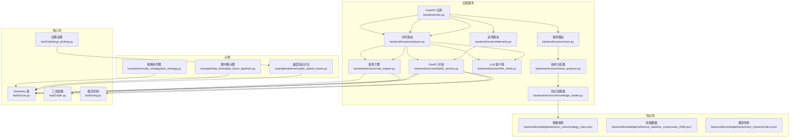
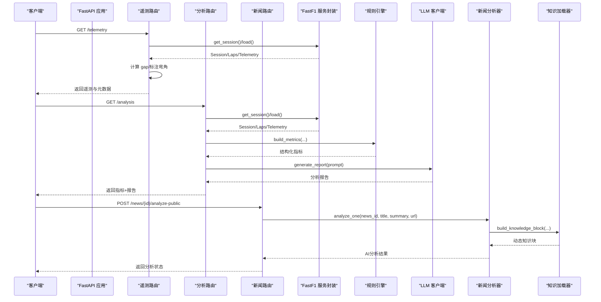
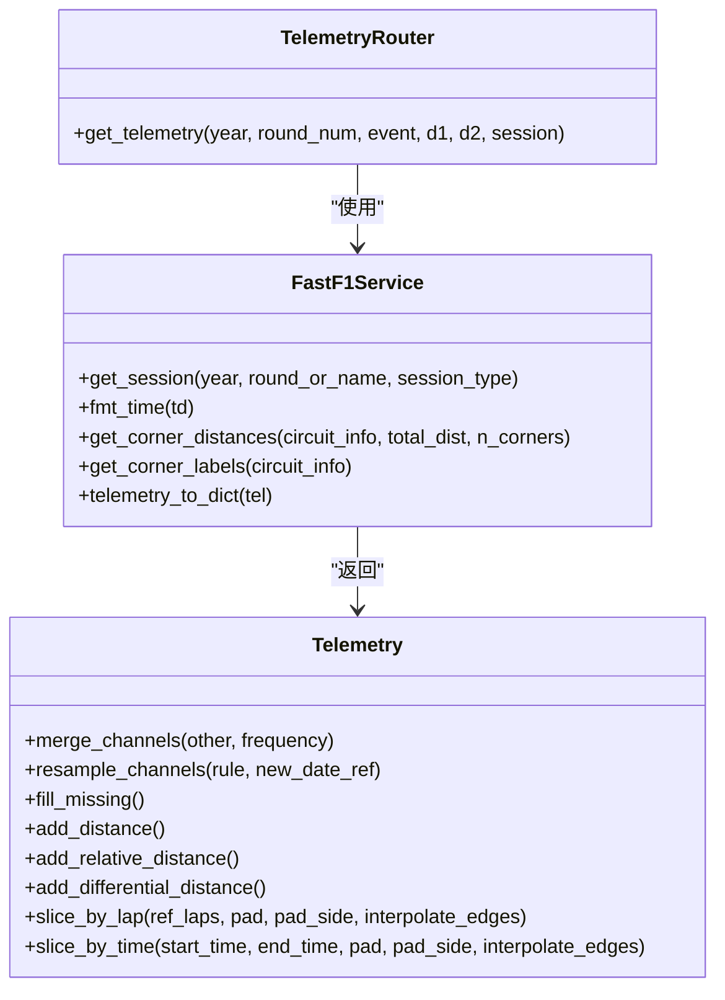
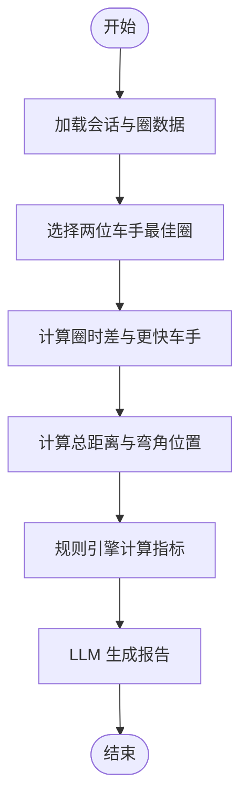
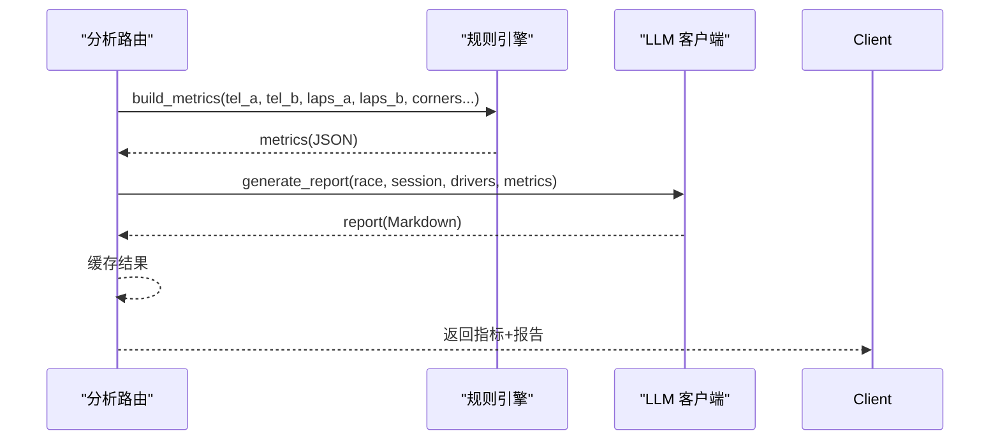
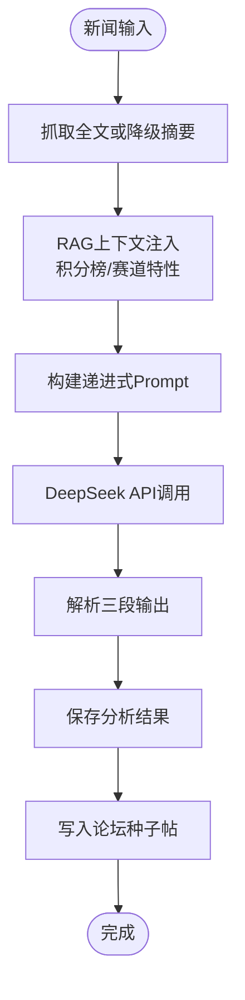
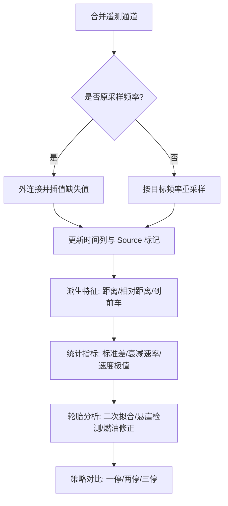
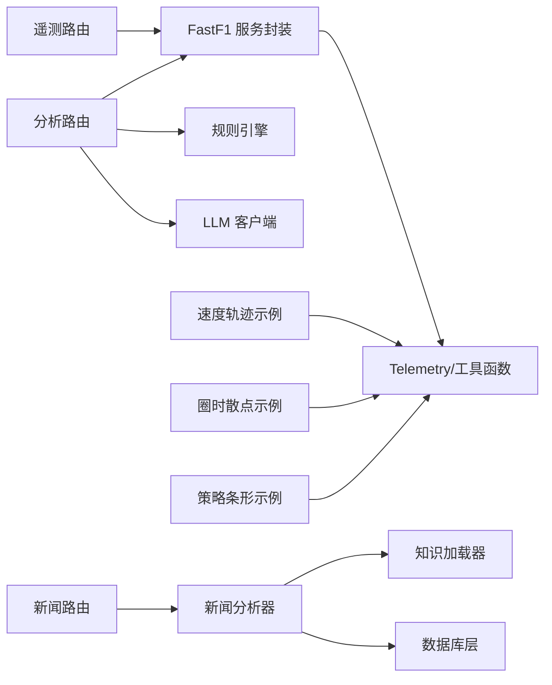

# 数据分析功能

<cite>
**本文档引用的文件**
- [fastf1/core.py](file://fastf1/core.py)
- [fastf1/utils.py](file://fastf1/utils.py)
- [backend/main.py](file://backend/main.py)
- [backend/services/fastf1_service.py](file://backend/services/fastf1_service.py)
- [backend/routers/telemetry.py](file://backend/routers/telemetry.py)
- [backend/routers/analysis.py](file://backend/routers/analysis.py)
- [backend/services/llm_client.py](file://backend/services/llm_client.py)
- [backend/services/rule_engine.py](file://backend/services/rule_engine.py)
- [backend/services/news_analyzer.py](file://backend/services/news_analyzer.py)
- [backend/services/knowledge_loader.py](file://backend/services/knowledge_loader.py)
- [backend/routers/news.py](file://backend/routers/news.py)
- [backend/db/database.py](file://backend/db/database.py)
- [backend/knowledge/decision_rules/strategy_rules.json](file://backend/knowledge/decision_rules/strategy_rules.json)
- [backend/knowledge/reference_data/tire_compounds_2026.json](file://backend/knowledge/reference_data/tire_compounds_2026.json)
- [backend/knowledge/tracks/track_characteristics.json](file://backend/knowledge/tracks/track_characteristics.json)
- [examples/telemetry/plot_speed_traces.py](file://examples/telemetry/plot_speed_traces.py)
- [examples/lap_times/plot_driver_laptimes.py](file://examples/lap_times/plot_driver_laptimes.py)
- [examples/results_strategy/plot_strategy.py](file://examples/results_strategy/plot_strategy.py)
- [fastf1/plotting/_plotting.py](file://fastf1/plotting/_plotting.py)
- [fastf1/req.py](file://fastf1/req.py)
- [memory/architecture.md](file://memory/architecture.md)
</cite>

## 目录
1. [简介](#简介)
2. [项目结构](#项目结构)
3. [核心组件](#核心组件)
4. [架构总览](#架构总览)
5. [详细组件分析](#详细组件分析)
6. [依赖关系分析](#依赖关系分析)
7. [性能考虑](#性能考虑)
8. [故障排除指南](#故障排除指南)
9. [结论](#结论)
10. [附录](#附录)

## 简介
本文件面向 Fast-F1 数据分析功能，系统化阐述以下能力与实现：
- 遥测数据分析：马达数据对比、速度分析、换挡/档位分析
- 圈时分析：最佳圈时对比、圈时分布、策略分析
- AI 分析报告系统：大模型集成、规则引擎与报告生成流程
- 新闻智能分析系统：基于LLM的资讯解读与策略影响评估
- 数据处理管道与算法实现：时间轴对齐、插值、统计指标计算
- 具体分析示例与代码路径指引
- 性能优化与大数据处理策略
- 与其他分析工具的集成方式
- 故障排除与常见问题

## 项目结构
后端采用 FastAPI 提供 REST 接口，核心分析逻辑位于 backend 服务层，数据来源通过 fastf1 库加载并缓存。系统包含两个主要分析分支：传统的遥测分析和AI驱动的智能分析。示例代码位于 examples 目录，展示如何进行可视化与进一步分析。

**图表来源**
- [backend/main.py:18-41](file://backend/main.py#L18-L41)
- [backend/routers/telemetry.py:11-78](file://backend/routers/telemetry.py#L11-L78)
- [backend/routers/analysis.py:35-120](file://backend/routers/analysis.py#L35-L120)
- [backend/routers/news.py:1-205](file://backend/routers/news.py#L1-L205)
- [backend/services/fastf1_service.py:14-63](file://backend/services/fastf1_service.py#L14-L63)
- [backend/services/rule_engine.py:10-145](file://backend/services/rule_engine.py#L10-L145)
- [backend/services/llm_client.py:77-135](file://backend/services/llm_client.py#L77-L135)
- [backend/services/news_analyzer.py:1-586](file://backend/services/news_analyzer.py#L1-L586)
- [backend/services/knowledge_loader.py:1-483](file://backend/services/knowledge_loader.py#L1-L483)
- [backend/knowledge/decision_rules/strategy_rules.json:1-186](file://backend/knowledge/decision_rules/strategy_rules.json#L1-L186)
- [backend/knowledge/reference_data/tire_compounds_2026.json:1-81](file://backend/knowledge/reference_data/tire_compounds_2026.json#L1-L81)
- [backend/knowledge/tracks/track_characteristics.json:1-795](file://backend/knowledge/tracks/track_characteristics.json#L1-L795)

**章节来源**
- [backend/main.py:18-41](file://backend/main.py#L18-L41)
- [backend/routers/telemetry.py:11-78](file://backend/routers/telemetry.py#L11-L78)
- [backend/routers/analysis.py:35-120](file://backend/routers/analysis.py#L35-L120)
- [backend/routers/news.py:1-205](file://backend/routers/news.py#L1-L205)
- [backend/services/fastf1_service.py:14-63](file://backend/services/fastf1_service.py#L14-L63)
- [backend/services/rule_engine.py:10-145](file://backend/services/rule_engine.py#L10-L145)
- [backend/services/llm_client.py:77-135](file://backend/services/llm_client.py#L77-L135)
- [backend/services/news_analyzer.py:1-586](file://backend/services/news_analyzer.py#L1-L586)
- [backend/services/knowledge_loader.py:1-483](file://backend/services/knowledge_loader.py#L1-L483)
- [backend/knowledge/decision_rules/strategy_rules.json:1-186](file://backend/knowledge/decision_rules/strategy_rules.json#L1-L186)
- [backend/knowledge/reference_data/tire_compounds_2026.json:1-81](file://backend/knowledge/reference_data/tire_compounds_2026.json#L1-L81)
- [backend/knowledge/tracks/track_characteristics.json:1-795](file://backend/knowledge/tracks/track_characteristics.json#L1-L795)

## 核心组件
- Telemetry 对象：多通道时间序列遥测数据容器，支持合并、重采样、插值与派生特征（距离、相对距离、到前车距离等），是所有分析的基础数据结构。
- 规则引擎：基于遥测与圈时数据，计算弯角差异、赛段时间差、直线效率、轮胎稳定性等结构化指标。
- LLM 客户端：封装 DeepSeek API，将规则引擎输出转化为可读性强的中文分析报告。
- 新闻分析器：基于LLM的智能资讯解读系统，支持递进式三段分析（事实摘要/深度解读/专业判断）。
- 知识加载器：动态加载和组装赛道特性、轮胎数据、策略规则等知识库内容。
- FastF1 服务封装：统一 session 加载、缓存、格式化与序列化，避免重复 IO 与解析。
- 绘图与可视化：提供时间轴与单位补丁、颜色方案等，便于将分析结果可视化。

**章节来源**
- [fastf1/core.py:64-800](file://fastf1/core.py#L64-L800)
- [backend/services/rule_engine.py:10-145](file://backend/services/rule_engine.py#L10-L145)
- [backend/services/llm_client.py:77-135](file://backend/services/llm_client.py#L77-L135)
- [backend/services/news_analyzer.py:1-586](file://backend/services/news_analyzer.py#L1-L586)
- [backend/services/knowledge_loader.py:1-483](file://backend/services/knowledge_loader.py#L1-L483)
- [backend/services/fastf1_service.py:14-63](file://backend/services/fastf1_service.py#L14-L63)
- [fastf1/plotting/_plotting.py:29-106](file://fastf1/plotting/_plotting.py#L29-L106)

## 架构总览
后端以 FastAPI 路由为入口，遥测与分析路由均通过服务封装访问 FastF1 数据，分析路由再调用规则引擎与 LLM 客户端生成报告。新闻分析路由则通过新闻分析器处理资讯，结合知识库动态注入上下文信息。整体流程如下：

**图表来源**
- [backend/main.py:18-41](file://backend/main.py#L18-L41)
- [backend/routers/telemetry.py:11-78](file://backend/routers/telemetry.py#L11-L78)
- [backend/routers/analysis.py:35-120](file://backend/routers/analysis.py#L35-L120)
- [backend/routers/news.py:131-160](file://backend/routers/news.py#L131-L160)
- [backend/services/fastf1_service.py:14-63](file://backend/services/fastf1_service.py#L14-L63)
- [backend/services/rule_engine.py:136-145](file://backend/services/rule_engine.py#L136-L145)
- [backend/services/llm_client.py:77-135](file://backend/services/llm_client.py#L77-L135)
- [backend/services/news_analyzer.py:401-448](file://backend/services/news_analyzer.py#L401-L448)
- [backend/services/knowledge_loader.py:432-483](file://backend/services/knowledge_loader.py#L432-L483)

## 详细组件分析

### 遥测数据分析：马达数据对比、速度分析、换挡分析
- 马达数据对比（RPM、Throttle、Brake、nGear）
  - 通过 Telemetry 对象获取车号与团队颜色，叠加绘制速度与档位曲线，对比油门与刹车使用差异。
  - 示例路径：[examples/telemetry/plot_speed_traces.py:1-53](file://examples/telemetry/plot_speed_traces.py#L1-L53)
- 速度分析（Speed）
  - 在 Telemetry 上添加 Distance，按距离轴对齐两条最快圈的速度曲线，便于直观比较。
  - 示例路径：[examples/telemetry/plot_speed_traces.py:1-53](file://examples/telemetry/plot_speed_traces.py#L1-L53)
- 换挡/档位分析（nGear）
  - 通过档位变化识别换挡时机，结合刹车点与出弯速度评估换挡策略。
  - 实现参考：Telemetry 的档位列与派生特征（见下节"Telemetry 类"）

**图表来源**
- [fastf1/core.py:64-800](file://fastf1/core.py#L64-L800)
- [backend/services/fastf1_service.py:14-63](file://backend/services/fastf1_service.py#L14-L63)
- [backend/routers/telemetry.py:11-78](file://backend/routers/telemetry.py#L11-L78)

**章节来源**
- [fastf1/core.py:64-800](file://fastf1/core.py#L64-L800)
- [backend/services/fastf1_service.py:14-63](file://backend/services/fastf1_service.py#L14-L63)
- [backend/routers/telemetry.py:11-78](file://backend/routers/telemetry.py#L11-L78)
- [examples/telemetry/plot_speed_traces.py:1-53](file://examples/telemetry/plot_speed_traces.py#L1-L53)

### 圈时分析：最佳圈时对比、圈时分布、策略分析
- 最佳圈时对比
  - 从 Laps 中挑选两位车手的最佳圈，计算圈时差与更快车手标识。
  - 示例路径：[examples/lap_times/plot_driver_laptimes.py:1-66](file://examples/lap_times/plot_driver_laptimes.py#L1-L66)
- 圈时分布
  - 使用散点图展示单圈圈时随圈数变化，按复合类型着色，突出轮胎性能与策略影响。
  - 示例路径：[examples/lap_times/plot_driver_laptimes.py:1-66](file://examples/lap_times/plot_driver_laptimes.py#L1-L66)
- 策略分析
  - 基于 Laps 分组统计每车次进站与复合使用长度，绘制横向条形图展示策略。
  - 示例路径：[examples/results_strategy/plot_strategy.py:1-91](file://examples/results_strategy/plot_strategy.py#L1-L91)

**图表来源**
- [backend/routers/analysis.py:35-120](file://backend/routers/analysis.py#L35-L120)
- [backend/services/rule_engine.py:136-145](file://backend/services/rule_engine.py#L136-L145)
- [backend/services/llm_client.py:77-135](file://backend/services/llm_client.py#L77-L135)

**章节来源**
- [backend/routers/analysis.py:35-120](file://backend/routers/analysis.py#L35-L120)
- [backend/services/rule_engine.py:136-145](file://backend/services/rule_engine.py#L136-L145)
- [backend/services/llm_client.py:77-135](file://backend/services/llm_client.py#L77-L135)
- [examples/lap_times/plot_driver_laptimes.py:1-66](file://examples/lap_times/plot_driver_laptimes.py#L1-L66)
- [examples/results_strategy/plot_strategy.py:1-91](file://examples/results_strategy/plot_strategy.py#L1-L91)

### AI 分析报告系统：LLM 集成、规则引擎与报告生成
- 规则引擎
  - 指标维度：弯角差异（刹车点、最低速、出弯速）、赛段时间差（S1/S2/S3）、直线效率（最高速、油门全开比例）、轮胎稳定性（标准差、衰减速率）。
  - 输出结构化 JSON，供 LLM prompt 使用。
- LLM 客户端
  - 使用 DeepSeek API，模板严格约束输出格式与术语，确保报告可读性与一致性。
  - 对指标中的三字码进行全名替换，避免模型误认。
- 分析路由
  - 组合规则引擎与 LLM，支持缓存与强制刷新，提升响应速度与一致性。

**图表来源**
- [backend/routers/analysis.py:35-120](file://backend/routers/analysis.py#L35-L120)
- [backend/services/rule_engine.py:10-145](file://backend/services/rule_engine.py#L10-L145)
- [backend/services/llm_client.py:77-135](file://backend/services/llm_client.py#L77-L135)

**章节来源**
- [backend/services/rule_engine.py:10-145](file://backend/services/rule_engine.py#L10-L145)
- [backend/services/llm_client.py:77-135](file://backend/services/llm_client.py#L77-L135)
- [backend/routers/analysis.py:35-120](file://backend/routers/analysis.py#L35-L120)

### 新闻智能分析系统：递进式三段解读与策略影响评估
- 递进式分析框架
  - 事实摘要（80-120字）：客观提炼核心事实，不添加主观判断
  - 深度解读（100-200字）：分析技术机制或产业逻辑
  - 专业判断（100-200字）：给出量化预测和可验证结论
- RAG（检索增强生成）集成
  - 选择性注入积分榜数据（仅涉及积分/排名时）
  - 动态加载赛道特性知识
  - 2026赛季强制上下文注入
- 自动化流程
  - 异步分析执行，支持强制刷新
  - 自动写入论坛作为种子帖
  - 智能内容截断与缓存

**图表来源**
- [backend/services/news_analyzer.py:401-448](file://backend/services/news_analyzer.py#L401-L448)
- [backend/routers/news.py:131-160](file://backend/routers/news.py#L131-L160)
- [backend/services/knowledge_loader.py:432-483](file://backend/services/knowledge_loader.py#L432-L483)

**章节来源**
- [backend/services/news_analyzer.py:1-586](file://backend/services/news_analyzer.py#L1-L586)
- [backend/routers/news.py:1-205](file://backend/routers/news.py#L1-L205)
- [backend/services/knowledge_loader.py:1-483](file://backend/services/knowledge_loader.py#L1-L483)

### 数据处理管道与算法实现
- 时间轴对齐与插值
  - 合并不同来源的遥测通道，自动插值缺失值，保持 Source 标记与时间列一致性。
  - 支持"原采样频率"与自定义频率重采样，避免多次重采样导致精度损失。
- 派生特征
  - 距离：累计微分距离积分得到；相对距离：归一化至首点。
  - 到前车距离：基于位置数据计算最近对手距离与车号。
- 统计与回归
  - 轮胎稳定性：标准差与线性回归衰减速率，用于评估一致性与退化趋势。
  - 赛段时间差：逐段计算 S1/S2/S3 差异与更快车手。
- 增强版轮胎分析
  - 二次拟合检测加速退化
  - 燃油修正退化估算
  - 轮胎悬崖检测
  - 策略类型标注

**图表来源**
- [fastf1/core.py:391-569](file://fastf1/core.py#L391-L569)
- [fastf1/core.py:624-690](file://fastf1/core.py#L624-L690)
- [backend/services/rule_engine.py:111-133](file://backend/services/rule_engine.py#L111-L133)
- [backend/services/rule_engine.py:597-752](file://backend/services/rule_engine.py#L597-L752)

**章节来源**
- [fastf1/core.py:391-569](file://fastf1/core.py#L391-L569)
- [fastf1/core.py:624-690](file://fastf1/core.py#L624-L690)
- [backend/services/rule_engine.py:111-133](file://backend/services/rule_engine.py#L111-L133)
- [backend/services/rule_engine.py:597-752](file://backend/services/rule_engine.py#L597-L752)

### 具体分析示例与代码演示
- 遥测对比（速度轨迹叠加）
  - 示例路径：[examples/telemetry/plot_speed_traces.py:1-53](file://examples/telemetry/plot_speed_traces.py#L1-L53)
- 圈时分布（散点图）
  - 示例路径：[examples/lap_times/plot_driver_laptimes.py:1-66](file://examples/lap_times/plot_driver_laptimes.py#L1-L66)
- 策略分析（横向条形图）
  - 示例路径：[examples/results_strategy/plot_strategy.py:1-91](file://examples/results_strategy/plot_strategy.py#L1-L91)

**章节来源**
- [examples/telemetry/plot_speed_traces.py:1-53](file://examples/telemetry/plot_speed_traces.py#L1-L53)
- [examples/lap_times/plot_driver_laptimes.py:1-66](file://examples/lap_times/plot_driver_laptimes.py#L1-L66)
- [examples/results_strategy/plot_strategy.py:1-91](file://examples/results_strategy/plot_strategy.py#L1-L91)

## 依赖关系分析
- 路由依赖服务封装，服务封装依赖 FastF1 核心对象与工具函数。
- 规则引擎与 LLM 客户端被分析路由组合调用。
- 新闻分析器依赖知识加载器和数据库层。
- 绘图模块为示例与二次开发提供颜色与时间轴支持。

**图表来源**
- [backend/routers/telemetry.py:11-78](file://backend/routers/telemetry.py#L11-L78)
- [backend/routers/analysis.py:35-120](file://backend/routers/analysis.py#L35-L120)
- [backend/routers/news.py:1-205](file://backend/routers/news.py#L1-L205)
- [backend/services/fastf1_service.py:14-63](file://backend/services/fastf1_service.py#L14-L63)
- [backend/services/rule_engine.py:136-145](file://backend/services/rule_engine.py#L136-L145)
- [backend/services/llm_client.py:77-135](file://backend/services/llm_client.py#L77-L135)
- [backend/services/news_analyzer.py:1-586](file://backend/services/news_analyzer.py#L1-L586)
- [backend/services/knowledge_loader.py:1-483](file://backend/services/knowledge_loader.py#L1-L483)
- [backend/db/database.py:1-200](file://backend/db/database.py#L1-L200)
- [fastf1/core.py:64-800](file://fastf1/core.py#L64-L800)
- [examples/telemetry/plot_speed_traces.py:1-53](file://examples/telemetry/plot_speed_traces.py#L1-L53)
- [examples/lap_times/plot_driver_laptimes.py:1-66](file://examples/lap_times/plot_driver_laptimes.py#L1-L66)
- [examples/results_strategy/plot_strategy.py:1-91](file://examples/results_strategy/plot_strategy.py#L1-L91)

**章节来源**
- [backend/routers/telemetry.py:11-78](file://backend/routers/telemetry.py#L11-L78)
- [backend/routers/analysis.py:35-120](file://backend/routers/analysis.py#L35-L120)
- [backend/routers/news.py:1-205](file://backend/routers/news.py#L1-L205)
- [backend/services/fastf1_service.py:14-63](file://backend/services/fastf1_service.py#L14-L63)
- [backend/services/rule_engine.py:136-145](file://backend/services/rule_engine.py#L136-L145)
- [backend/services/llm_client.py:77-135](file://backend/services/llm_client.py#L77-L135)
- [backend/services/news_analyzer.py:1-586](file://backend/services/news_analyzer.py#L1-L586)
- [backend/services/knowledge_loader.py:1-483](file://backend/services/knowledge_loader.py#L1-L483)
- [backend/db/database.py:1-200](file://backend/db/database.py#L1-L200)
- [fastf1/core.py:64-800](file://fastf1/core.py#L64-L800)
- [examples/telemetry/plot_speed_traces.py:1-53](file://examples/telemetry/plot_speed_traces.py#L1-L53)
- [examples/lap_times/plot_driver_laptimes.py:1-66](file://examples/lap_times/plot_driver_laptimes.py#L1-L66)
- [examples/results_strategy/plot_strategy.py:1-91](file://examples/results_strategy/plot_strategy.py#L1-L91)

## 性能考虑
- 缓存策略
  - 进程级内存缓存：同一 session 只 load 一次，避免重复 IO。
  - 文件级缓存：FastF1 内置 pickle 缓存，启用后自动复用。
  - 后台预热：启动时批量加载历史缓存的 session，减少首次请求延迟。
  - 分析结果缓存：分析路由支持本地缓存，避免重复计算。
- 并发与批处理
  - 使用线程池并发请求多个外部 API，缩短等待时间。
  - 新闻分析采用异步线程执行，不阻塞主线程。
  - 避免嵌套循环，一次性预计算聚合结构，降低时间复杂度。
- 数据处理优化
  - 合理使用向量化操作与内置插值方法，避免逐行迭代。
  - 仅在必要时重采样，尽量基于原始时间基合并与插值。
  - 知识库内容缓存：RAG上下文缓存30分钟，避免重复API调用。
- 可视化与前端
  - 使用 FastF1 绘图设置与颜色方案，保证渲染性能与一致性。

**章节来源**
- [backend/services/fastf1_service.py:14-21](file://backend/services/fastf1_service.py#L14-L21)
- [fastf1/req.py:413-643](file://fastf1/req.py#L413-L643)
- [backend/main.py:55-96](file://backend/main.py#L55-L96)
- [backend/routers/analysis.py:16-33](file://backend/routers/analysis.py#L16-L33)
- [backend/services/news_analyzer.py:21-24](file://backend/services/news_analyzer.py#L21-L24)
- [memory/architecture.md:131-189](file://memory/architecture.md#L131-L189)

## 故障排除指南
- 遥测数据截断或缺失
  - 现象：某车遥测末尾距离明显小于赛道全长，提示数据包丢失。
  - 处理：检查 F1 API 数据质量，必要时使用插值或更换参考圈。
  - 参考：[backend/routers/telemetry.py:36-44](file://backend/routers/telemetry.py#L36-L44)
- LLM 输出异常或格式不符
  - 现象：报告格式不符合模板要求或出现三字码误用。
  - 处理：确认 prompt 模板与三字码替换逻辑，检查环境变量配置。
  - 参考：[backend/services/llm_client.py:77-135](file://backend/services/llm_client.py#L77-L135)
- 新闻分析失败
  - 现象：AI分析失败或内容截断。
  - 处理：检查网络连接、API密钥配置，查看服务端日志。
  - 参考：[backend/services/news_analyzer.py:446-448](file://backend/services/news_analyzer.py#L446-L448)
- 缓存失效或版本不匹配
  - 现象：缓存文件损坏或版本不兼容导致下载失败。
  - 处理：清理缓存目录或禁用缓存进行调试，确认 API 版本。
  - 参考：[fastf1/req.py:413-643](file://fastf1/req.py#L413-L643)
- 绘图显示异常
  - 现象：时间轴刻度未正确显示或颜色不生效。
  - 处理：启用 matplotlib 时间补丁与 FastF1 颜色方案。
  - 参考：[fastf1/plotting/_plotting.py:29-106](file://fastf1/plotting/_plotting.py#L29-L106)

**章节来源**
- [backend/routers/telemetry.py:36-44](file://backend/routers/telemetry.py#L36-L44)
- [backend/services/llm_client.py:77-135](file://backend/services/llm_client.py#L77-L135)
- [backend/services/news_analyzer.py:446-448](file://backend/services/news_analyzer.py#L446-L448)
- [fastf1/req.py:413-643](file://fastf1/req.py#L413-L643)
- [fastf1/plotting/_plotting.py:29-106](file://fastf1/plotting/_plotting.py#L29-L106)

## 结论
本项目以 FastF1 为核心，构建了从遥测到圈时再到 AI 报告的完整分析链路。通过 Telemetry 的高扩展性与规则引擎的结构化指标，结合 LLM 的自然语言生成，实现了专业、可读、可复用的数据洞察。新增的新闻智能分析系统进一步扩展了分析能力，支持递进式三段解读和策略影响评估。通过缓存、预热与并发优化，系统在性能与稳定性方面具备良好表现。建议在生产环境中持续监控缓存命中率与 LLM 调用成本，并定期评估规则引擎指标的有效性。

## 附录
- 快速开始（示例）
  - 遥测对比：[examples/telemetry/plot_speed_traces.py:1-53](file://examples/telemetry/plot_speed_traces.py#L1-L53)
  - 圈时分布：[examples/lap_times/plot_driver_laptimes.py:1-66](file://examples/lap_times/plot_driver_laptimes.py#L1-L66)
  - 策略分析：[examples/results_strategy/plot_strategy.py:1-91](file://examples/results_strategy/plot_strategy.py#L1-L91)
- 接口与实现
  - 遥测接口：[backend/routers/telemetry.py:11-78](file://backend/routers/telemetry.py#L11-L78)
  - 分析接口：[backend/routers/analysis.py:35-120](file://backend/routers/analysis.py#L35-L120)
  - 新闻分析接口：[backend/routers/news.py:131-160](file://backend/routers/news.py#L131-L160)
  - 规则引擎：[backend/services/rule_engine.py:10-145](file://backend/services/rule_engine.py#L10-L145)
  - LLM 客户端：[backend/services/llm_client.py:77-135](file://backend/services/llm_client.py#L77-L135)
  - 新闻分析器：[backend/services/news_analyzer.py:401-448](file://backend/services/news_analyzer.py#L401-L448)
  - 知识加载器：[backend/services/knowledge_loader.py:432-483](file://backend/services/knowledge_loader.py#L432-L483)
  - Telemetry 类：[fastf1/core.py:64-800](file://fastf1/core.py#L64-L800)