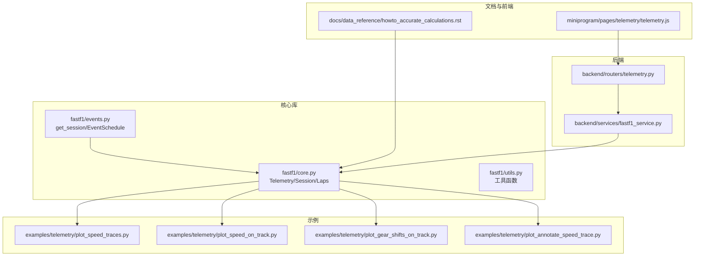
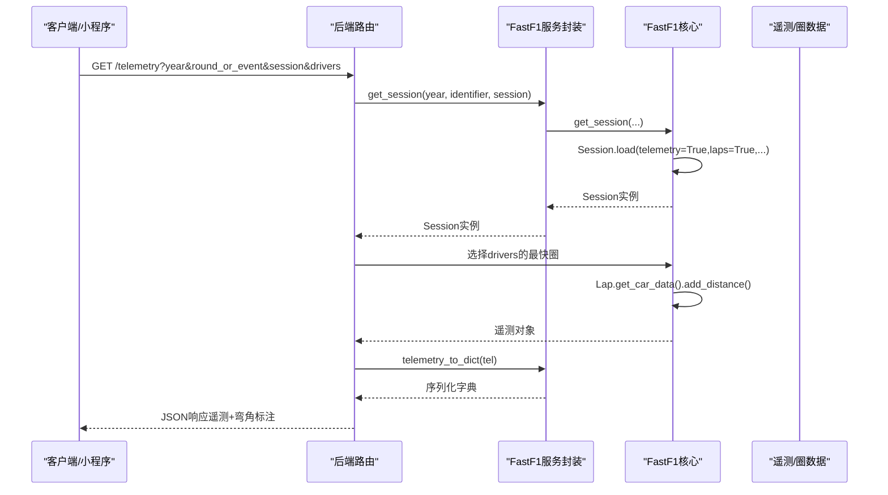
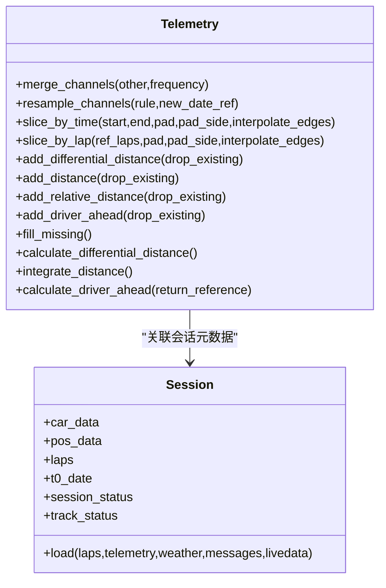
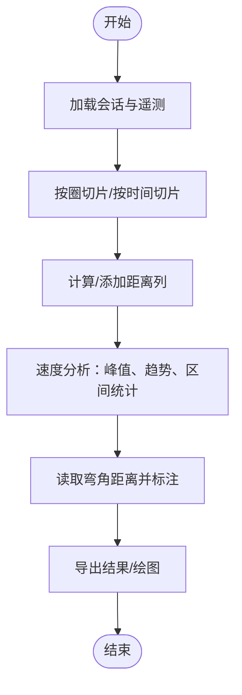
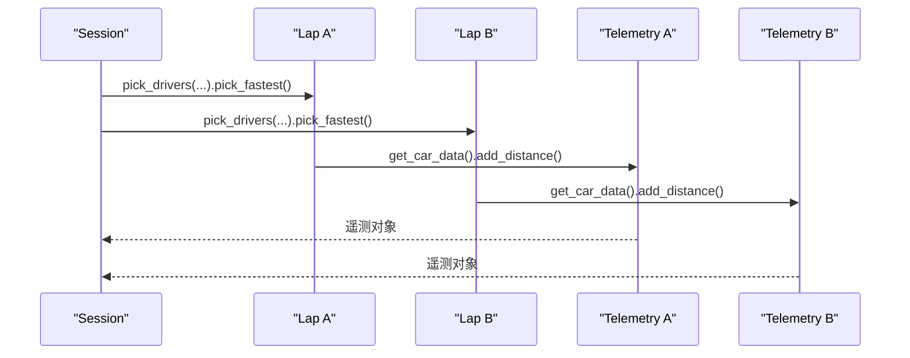
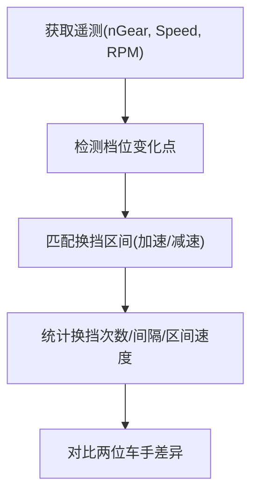
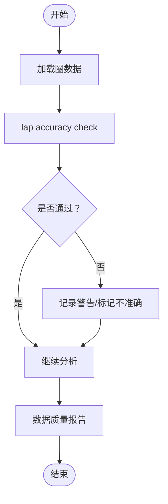
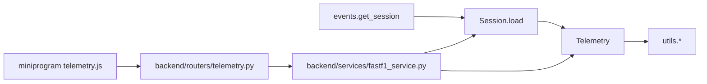

# 遥测数据分析

<cite>
**本文引用的文件**
- [fastf1/core.py](file://fastf1/core.py)
- [fastf1/events.py](file://fastf1/events.py)
- [fastf1/utils.py](file://fastf1/utils.py)
- [examples/telemetry/plot_speed_traces.py](file://examples/telemetry/plot_speed_traces.py)
- [examples/telemetry/plot_speed_on_track.py](file://examples/telemetry/plot_speed_on_track.py)
- [examples/telemetry/plot_gear_shifts_on_track.py](file://examples/telemetry/plot_gear_shifts_on_track.py)
- [examples/telemetry/plot_annotate_speed_trace.py](file://examples/telemetry/plot_annotate_speed_trace.py)
- [backend/routers/telemetry.py](file://backend/routers/telemetry.py)
- [backend/services/fastf1_service.py](file://backend/services/fastf1_service.py)
- [docs/data_reference/howto_accurate_calculations.rst](file://docs/data_reference/howto_accurate_calculations.rst)
- [miniprogram/pages/telemetry/telemetry.js](file://miniprogram/pages/telemetry/telemetry.js)
</cite>

## 目录
1. [简介](#简介)
2. [项目结构](#项目结构)
3. [核心组件](#核心组件)
4. [架构总览](#架构总览)
5. [详细组件分析](#详细组件分析)
6. [依赖关系分析](#依赖关系分析)
7. [性能考虑](#性能考虑)
8. [故障排查指南](#故障排查指南)
9. [结论](#结论)
10. [附录](#附录)

## 简介
本文件系统性阐述 Fast-F1 遥测数据分析能力，重点覆盖以下方面：
- 马达数据对比分析：速度、加速度、刹车压力、油门等参数的获取与处理
- 速度分析：最高速度点识别、速度变化趋势分析、赛道特定区域的速度特征
- 换挡分析：换挡时机分析、换挡效率评估、变速箱性能对比
- 数据质量检查：完整性验证与异常值处理
- 性能优化与大数据处理策略
- 与 F1 官方遥测数据源的集成与数据格式转换

## 项目结构
围绕遥测分析的关键模块与文件如下：
- 核心库 fastf1：会话加载、遥测对象、距离与位置计算、数据合并与插值
- 示例脚本 examples/telemetry：速度轨迹叠加、赛道可视化、换挡可视化、弯角标注
- 后端服务 backend：FastF1 封装、API 路由、遥测数据序列化
- 文档 docs：准确计算指南（避免插值误差）
- 小程序前端 miniprogram：遥测图表渲染配置

图示来源
- [fastf1/core.py](file://fastf1/core.py)
- [fastf1/events.py](file://fastf1/events.py)
- [examples/telemetry/plot_speed_traces.py](file://examples/telemetry/plot_speed_traces.py)
- [examples/telemetry/plot_speed_on_track.py](file://examples/telemetry/plot_speed_on_track.py)
- [examples/telemetry/plot_gear_shifts_on_track.py](file://examples/telemetry/plot_gear_shifts_on_track.py)
- [examples/telemetry/plot_annotate_speed_trace.py](file://examples/telemetry/plot_annotate_speed_trace.py)
- [backend/routers/telemetry.py](file://backend/routers/telemetry.py)
- [backend/services/fastf1_service.py](file://backend/services/fastf1_service.py)
- [docs/data_reference/howto_accurate_calculations.rst](file://docs/data_reference/howto_accurate_calculations.rst)
- [miniprogram/pages/telemetry/telemetry.js](file://miniprogram/pages/telemetry/telemetry.js)

章节来源
- [fastf1/core.py](file://fastf1/core.py)
- [fastf1/events.py](file://fastf1/events.py)
- [examples/telemetry/plot_speed_traces.py](file://examples/telemetry/plot_speed_traces.py)
- [examples/telemetry/plot_speed_on_track.py](file://examples/telemetry/plot_speed_on_track.py)
- [examples/telemetry/plot_gear_shifts_on_track.py](file://examples/telemetry/plot_gear_shifts_on_track.py)
- [examples/telemetry/plot_annotate_speed_trace.py](file://examples/telemetry/plot_annotate_speed_trace.py)
- [backend/routers/telemetry.py](file://backend/routers/telemetry.py)
- [backend/services/fastf1_service.py](file://backend/services/fastf1_service.py)
- [docs/data_reference/howto_accurate_calculations.rst](file://docs/data_reference/howto_accurate_calculations.rst)
- [miniprogram/pages/telemetry/telemetry.js](file://miniprogram/pages/telemetry/telemetry.js)

## 核心组件
- Telemetry 对象：多通道时间序列遥测数据容器，支持按时间切片、合并不同通道、差分/积分距离、添加相对位置、车号前车信息等
- Session 对象：会话入口，负责从官方 API 加载车速、位置、天气、消息等数据，并提供统一的数据访问接口
- 工具函数：如距离差分、速度积分、时间字符串解析等
- 后端服务：封装 get_session、缓存、遥测序列化、弯角距离与标签生成
- 示例脚本：展示速度轨迹叠加、赛道速度可视化、换挡可视化、弯角标注等典型分析流程

章节来源
- [fastf1/core.py](file://fastf1/core.py)
- [fastf1/events.py](file://fastf1/events.py)
- [fastf1/utils.py](file://fastf1/utils.py)
- [backend/services/fastf1_service.py](file://backend/services/fastf1_service.py)

## 架构总览
Fast-F1 遥测分析的端到端流程如下：
- 通过事件与会话接口定位目标周末与会话
- 加载会话数据（含遥测、圈数据、状态等）
- 获取目标车手最快圈或指定圈次的遥测数据
- 计算/派生分析指标（距离、速度、加速度、换挡时机等）
- 可视化与导出（API 返回、前端渲染）

图示来源
- [backend/routers/telemetry.py](file://backend/routers/telemetry.py)
- [backend/services/fastf1_service.py](file://backend/services/fastf1_service.py)
- [fastf1/events.py](file://fastf1/events.py)
- [fastf1/core.py](file://fastf1/core.py)

## 详细组件分析

### Telemetry 类与遥测通道
Telemetry 是多通道时间序列数据容器，默认支持的通道类型与插值策略如下：
- 连续信号（quadratic/index）：Speed、RPM、Throttle、Distance、RelativeDistance、DifferentialDistance、DistanceToDriverAhead
- 离散信号（pad/backfill）：nGear、Brake、DRS、Status
- 特殊字段：Date/Time/SessionTime/Source 等

关键方法与用途：
- 合并与重采样：merge_channels/resample_channels，支持“原始频率”不重采样，仅插值缺失值
- 时间切片：slice_by_time/slice_by_lap，支持前后填充与边界插值
- 距离派生：add_differential_distance/integrate_distance/add_distance/add_relative_distance
- 车辆前车信息：add_driver_ahead/calculate_driver_ahead
- 缺失值处理：fill_missing，按通道类型采用不同插值策略

图示来源
- [fastf1/core.py](file://fastf1/core.py)

章节来源
- [fastf1/core.py](file://fastf1/core.py)

### 速度分析：最高速度点、趋势与赛道特征
- 最高速度点识别：在速度通道上寻找峰值；可结合 add_distance 或 RelativeDistance 进行横向对比
- 速度变化趋势：对速度进行差分（单位时间变化率）或平滑后求导；注意原始数据采样率低，插值可能引入误差
- 赛道特定区域特征：结合弯角距离标注（Corner Distances），在特定弯角区段提取速度统计（均值、最大、最小、标准差）

图示来源
- [fastf1/core.py](file://fastf1/core.py)
- [examples/telemetry/plot_annotate_speed_trace.py](file://examples/telemetry/plot_annotate_speed_trace.py)

章节来源
- [fastf1/core.py](file://fastf1/core.py)
- [examples/telemetry/plot_annotate_speed_trace.py](file://examples/telemetry/plot_annotate_speed_trace.py)

### 马达数据对比分析：速度、加速度、刹车压力、油门
- 速度对比：对两条最快圈分别添加距离列，按相同距离轴对齐绘制速度曲线
- 加速度：基于速度差分计算；注意原始采样率与插值误差累积
- 刹车压力：使用 Brake 通道（布尔）或 Throttle 通道的反向趋势辅助判断制动阶段
- 油门：Throttle 通道百分比，结合速度与档位分析动力输出

图示来源
- [backend/routers/telemetry.py](file://backend/routers/telemetry.py)
- [examples/telemetry/plot_speed_traces.py](file://examples/telemetry/plot_speed_traces.py)

章节来源
- [backend/routers/telemetry.py](file://backend/routers/telemetry.py)
- [examples/telemetry/plot_speed_traces.py](file://examples/telemetry/plot_speed_traces.py)

### 换挡分析：时机、效率与变速箱对比
- 换挡时机：基于 nGear 通道的时间序列，检测档位变化点；结合速度与曲轴转速（RPM）判断换挡合理性
- 换挡效率：通过加速阶段的档位保持情况、速度曲线连续性评估；可结合 DifferentialDistance 与积分距离进行长距离一致性分析
- 变速箱性能对比：对两位车手的档位变化时序进行对齐比较，统计换挡次数、平均换挡间隔、换挡区间速度范围

图示来源
- [examples/telemetry/plot_gear_shifts_on_track.py](file://examples/telemetry/plot_gear_shifts_on_track.py)
- [fastf1/core.py](file://fastf1/core.py)

章节来源
- [examples/telemetry/plot_gear_shifts_on_track.py](file://examples/telemetry/plot_gear_shifts_on_track.py)
- [fastf1/core.py](file://fastf1/core.py)

### 数据质量检查：完整性验证与异常值处理
- 完整性验证：lap accuracy check 通过多条件组合校验（扇区时间之和与单圈时间接近、安全车期间的特殊规则、时间戳一致性等）
- 异常值处理：fill_missing 按通道类型采用线性/前向/边界插值；对未知通道跳过插值
- API 数据截断检测：后端根据最大距离阈值判断是否存在数据包丢失

图示来源
- [fastf1/core.py](file://fastf1/core.py)
- [backend/routers/telemetry.py](file://backend/routers/telemetry.py)

章节来源
- [fastf1/core.py](file://fastf1/core.py)
- [backend/routers/telemetry.py](file://backend/routers/telemetry.py)

### 与官方数据源的集成与格式转换
- 会话加载：get_session → Session.load，按需加载遥测、圈、天气、消息等
- 数据源：F1 官方 Livetiming API、Ergast（历史/补充）、FastF1 自有缓存
- 格式转换：后端将 Telemetry 转为字典（处理 NaN），包含 distance/speed/throttle/brake/gear 等键

章节来源
- [fastf1/events.py](file://fastf1/events.py)
- [backend/services/fastf1_service.py](file://backend/services/fastf1_service.py)

## 依赖关系分析
- 事件与会话：events.get_session 提供统一入口，Session 负责数据加载与聚合
- 遥测与分析：core.Telemetry 提供基础数据结构与派生能力；utils 提供通用工具
- 后端与前端：routers/telemetry.py 调用 services.fastf1_service，后者封装 fastf1 调用与缓存；小程序前端接收并渲染遥测数据

图示来源
- [fastf1/events.py](file://fastf1/events.py)
- [fastf1/core.py](file://fastf1/core.py)
- [fastf1/utils.py](file://fastf1/utils.py)
- [backend/routers/telemetry.py](file://backend/routers/telemetry.py)
- [backend/services/fastf1_service.py](file://backend/services/fastf1_service.py)
- [miniprogram/pages/telemetry/telemetry.js](file://miniprogram/pages/telemetry/telemetry.js)

章节来源
- [fastf1/events.py](file://fastf1/events.py)
- [fastf1/core.py](file://fastf1/core.py)
- [fastf1/utils.py](file://fastf1/utils.py)
- [backend/routers/telemetry.py](file://backend/routers/telemetry.py)
- [backend/services/fastf1_service.py](file://backend/services/fastf1_service.py)
- [miniprogram/pages/telemetry/telemetry.js](file://miniprogram/pages/telemetry/telemetry.js)

## 性能考虑
- 避免插值误差：尽量在原始时间基上进行分析，不要对输入数据进行重采样；仅在最终结果合并时再进行插值
- 积分误差控制：距离积分误差会随长度累积，建议仅对单圈或少量连续圈进行积分派生
- 缓存策略：后端服务对同一会话进行进程内缓存，减少重复加载
- 大数据处理：优先使用向量化操作（pandas/numpy），避免逐行循环；必要时分批处理长片段

章节来源
- [docs/data_reference/howto_accurate_calculations.rst](file://docs/data_reference/howto_accurate_calculations.rst)
- [backend/services/fastf1_service.py](file://backend/services/fastf1_service.py)
- [fastf1/core.py](file://fastf1/core.py)

## 故障排查指南
- 数据未加载：确保调用 Session.load 并启用 telemetry 参数
- 插值异常：检查通道类型与插值方法；对离散信号使用前向/后向填充
- 距离积分异常：确认仅对短片段进行积分；必要时重新切片
- API 截断：后端已做截断检测与提示，关注 note 字段
- 前车信息缺失：calculate_driver_ahead 在长距离会引入积分误差，建议按圈处理并合并

章节来源
- [fastf1/core.py](file://fastf1/core.py)
- [backend/routers/telemetry.py](file://backend/routers/telemetry.py)

## 结论
Fast-F1 提供了从数据加载、遥测派生、质量检查到可视化的完整链路。通过 Telemetry 的多通道与插值能力，结合 Session 的统一数据访问，可以高效完成马达数据对比、速度与换挡分析，并在保证数据质量的前提下输出可解释的结果。遵循“避免插值、谨慎积分”的原则，配合缓存与分批处理策略，可在大数据场景下获得稳定且高性能的分析体验。

## 附录
- 使用示例参考：
  - [速度轨迹叠加](file://examples/telemetry/plot_speed_traces.py)
  - [赛道速度可视化](file://examples/telemetry/plot_speed_on_track.py)
  - [换挡可视化](file://examples/telemetry/plot_gear_shifts_on_track.py)
  - [弯角标注速度轨迹](file://examples/telemetry/plot_annotate_speed_trace.py)
- 接口与封装参考：
  - [后端遥测路由](file://backend/routers/telemetry.py)
  - [FastF1 服务封装](file://backend/services/fastf1_service.py)
  - [事件与会话接口](file://fastf1/events.py)
  - [核心遥测类](file://fastf1/core.py)
  - [工具函数](file://fastf1/utils.py)
  - [准确计算指南](file://docs/data_reference/howto_accurate_calculations.rst)
  - [小程序遥测渲染](file://miniprogram/pages/telemetry/telemetry.js)