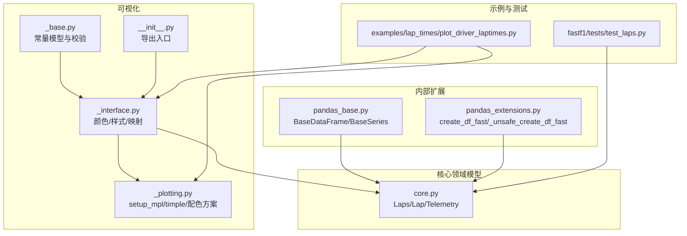
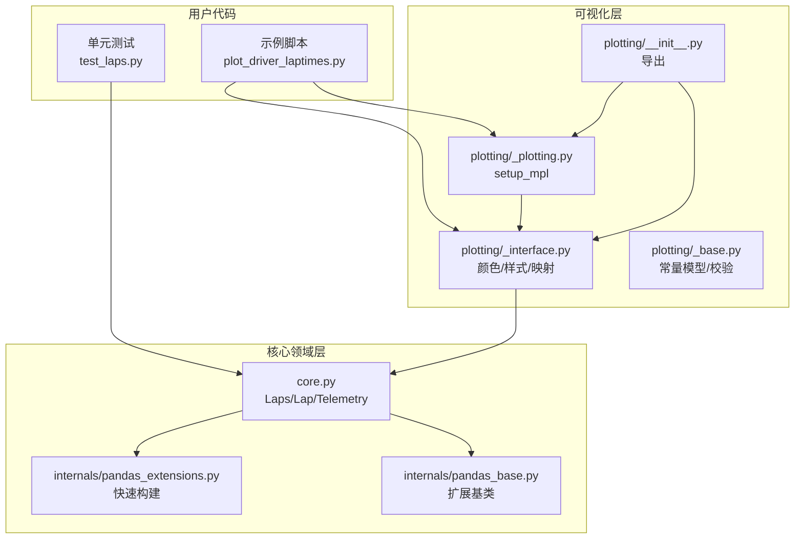
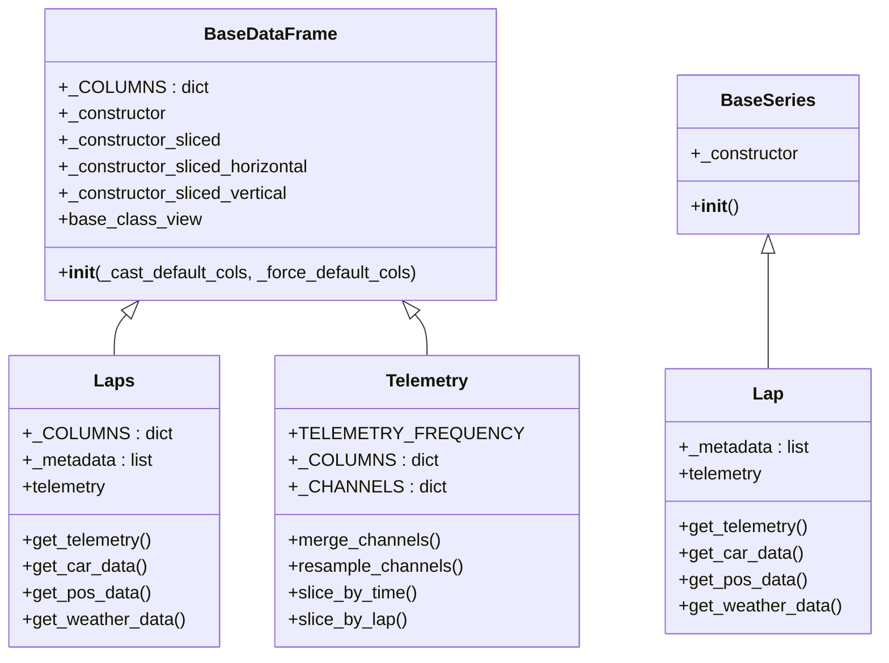
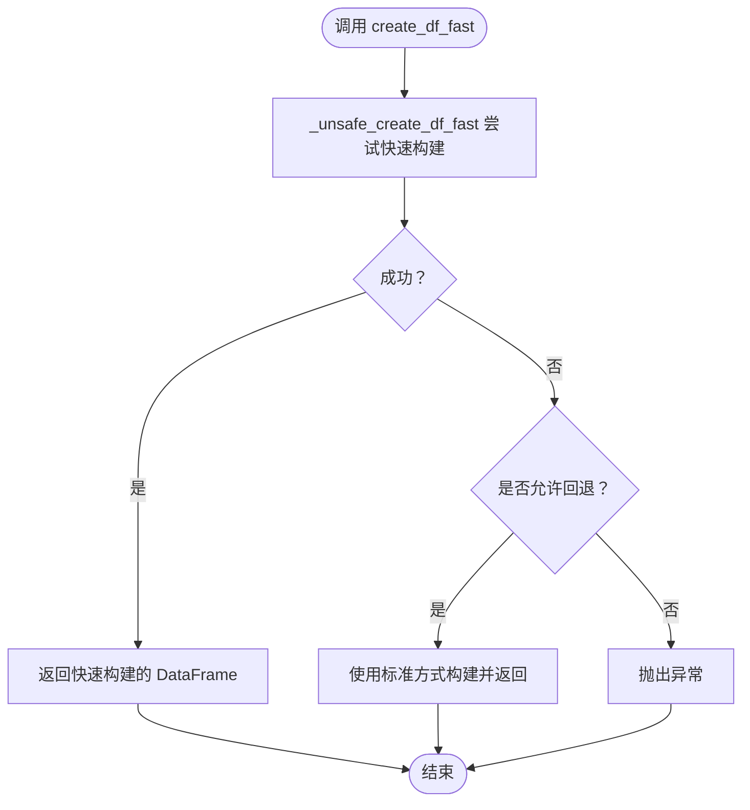
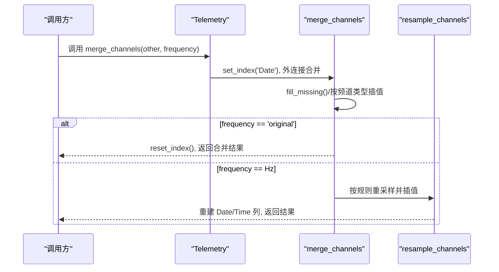
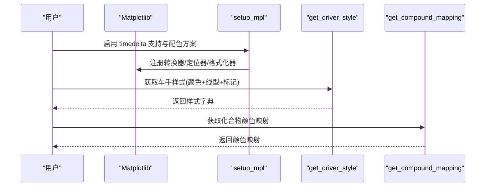
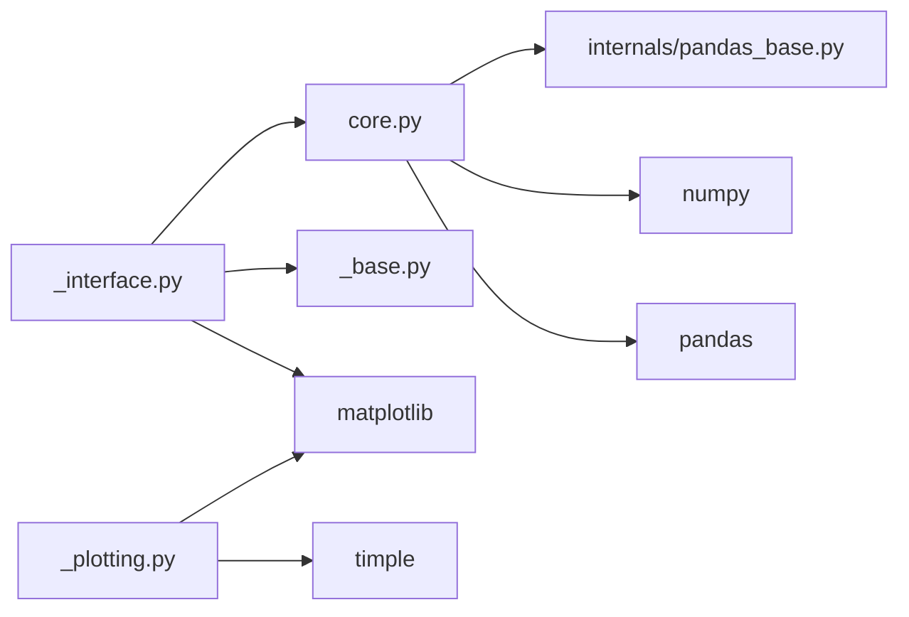

# Pandas 集成

<cite>
**本文引用的文件**
- [pandas_extensions.py](file://fastf1/internals/pandas_extensions.py)
- [pandas_base.py](file://fastf1/internals/pandas_base.py)
- [core.py](file://fastf1/core.py)
- [plotting/_interface.py](file://fastf1/plotting/_interface.py)
- [plotting/_plotting.py](file://fastf1/plotting/_plotting.py)
- [plotting/_base.py](file://fastf1/plotting/_base.py)
- [plotting/__init__.py](file://fastf1/plotting/__init__.py)
- [examples/lap_times/plot_driver_laptimes.py](file://examples/lap_times/plot_driver_laptimes.py)
- [fastf1/tests/test_laps.py](file://fastf1/tests/test_laps.py)
</cite>

## 目录
1. [简介](#简介)
2. [项目结构](#项目结构)
3. [核心组件](#核心组件)
4. [架构总览](#架构总览)
5. [详细组件分析](#详细组件分析)
6. [依赖分析](#依赖分析)
7. [性能考虑](#性能考虑)
8. [故障排查指南](#故障排查指南)
9. [结论](#结论)
10. [附录](#附录)

## 简介
本文件系统性阐述 Fast-F1 对 Pandas 的深度集成，重点覆盖以下方面：
- 扩展的 DataFrame/Series 基类与默认列类型管理机制
- 时间序列数据处理：时间戳解析、会话时间对齐、频率重采样与插值
- 统计分析增强：滚动窗口、聚合与分组分析在实际场景中的应用
- 数据可视化准备：颜色映射、样式定制与图表数据格式转换
- 性能优化与最佳实践：快速 DataFrame 构建、内核兼容性与缓存策略

## 项目结构
围绕 Pandas 集成的关键模块分布如下：
- 内部扩展层：提供高性能 DataFrame 构建与通用基类（internals）
- 核心领域模型：Laps/Lap/Telemetry 等继承自扩展基类，具备默认列类型与元数据传播
- 可视化接口：颜色映射、样式生成与 Matplotlib 设置工具
- 示例与测试：演示如何在真实场景中使用扩展能力

图示来源
- [pandas_base.py:29-201](file://fastf1/internals/pandas_base.py#L29-L201)
- [pandas_extensions.py:34-120](file://fastf1/internals/pandas_extensions.py#L34-L120)
- [core.py:64-200](file://fastf1/core.py#L64-L200)
- [plotting/_interface.py:1-100](file://fastf1/plotting/_interface.py#L1-L100)
- [plotting/_plotting.py:29-106](file://fastf1/plotting/_plotting.py#L29-L106)
- [plotting/_base.py:65-148](file://fastf1/plotting/_base.py#L65-L148)
- [plotting/__init__.py:1-48](file://fastf1/plotting/__init__.py#L1-L48)
- [examples/lap_times/plot_driver_laptimes.py:1-66](file://examples/lap_times/plot_driver_laptimes.py#L1-L66)
- [fastf1/tests/test_laps.py:1-200](file://fastf1/tests/test_laps.py#L1-L200)

章节来源
- [pandas_base.py:29-201](file://fastf1/internals/pandas_base.py#L29-L201)
- [pandas_extensions.py:34-120](file://fastf1/internals/pandas_extensions.py#L34-L120)
- [core.py:64-200](file://fastf1/core.py#L64-L200)
- [plotting/_interface.py:1-100](file://fastf1/plotting/_interface.py#L1-L100)
- [plotting/_plotting.py:29-106](file://fastf1/plotting/_plotting.py#L29-L106)
- [plotting/_base.py:65-148](file://fastf1/plotting/_base.py#L65-L148)
- [plotting/__init__.py:1-48](file://fastf1/plotting/__init__.py#L1-L48)
- [examples/lap_times/plot_driver_laptimes.py:1-66](file://examples/lap_times/plot_driver_laptimes.py#L1-L66)
- [fastf1/tests/test_laps.py:1-200](file://fastf1/tests/test_laps.py#L1-L200)

## 核心组件
- 扩展基类
  - BaseDataFrame：为继承者提供默认列类型强制、构造器定制、切片返回类型控制与调试视图
  - BaseSeries：保持同维切片类型一致性
- 快速 DataFrame 构建
  - create_df_fast：在满足条件时跳过部分 Pandas 内部验证以提升构建速度，失败时回退到标准路径
- 领域模型
  - Laps/Lap/Telemetry：继承自 BaseDataFrame/BaseSeries，内置默认列类型字典与元数据传播
  - 提供时间切片、合并通道、重采样与插值等时间序列处理能力
- 可视化接口
  - get_driver_style/get_compound_color 等：基于会话数据生成颜色与样式
  - setup_mpl：启用 timedelta 支持与 FastF1 配色方案

章节来源
- [pandas_base.py:29-201](file://fastf1/internals/pandas_base.py#L29-L201)
- [pandas_extensions.py:34-120](file://fastf1/internals/pandas_extensions.py#L34-L120)
- [core.py:64-200](file://fastf1/core.py#L64-L200)
- [plotting/_interface.py:489-704](file://fastf1/plotting/_interface.py#L489-L704)
- [plotting/_plotting.py:29-106](file://fastf1/plotting/_plotting.py#L29-L106)

## 架构总览
下图展示了 Pandas 集成在系统中的位置与交互关系。

图示来源
- [plotting/_interface.py:1-100](file://fastf1/plotting/_interface.py#L1-L100)
- [plotting/_plotting.py:29-106](file://fastf1/plotting/_plotting.py#L29-L106)
- [plotting/_base.py:65-148](file://fastf1/plotting/_base.py#L65-L148)
- [plotting/__init__.py:1-48](file://fastf1/plotting/__init__.py#L1-L48)
- [core.py:64-200](file://fastf1/core.py#L64-L200)
- [pandas_extensions.py:34-120](file://fastf1/internals/pandas_extensions.py#L34-L120)
- [pandas_base.py:29-201](file://fastf1/internals/pandas_base.py#L29-L201)
- [examples/lap_times/plot_driver_laptimes.py:1-66](file://examples/lap_times/plot_driver_laptimes.py#L1-L66)
- [fastf1/tests/test_laps.py:1-200](file://fastf1/tests/test_laps.py#L1-L200)

## 详细组件分析

### 扩展基类与默认列类型
- BaseDataFrame
  - 默认列类型：通过 _COLUMNS 定义列名与类型；支持字符串类型与 typing 可选类型
  - 列类型强制：初始化时按需将列转换为指定类型，空列按类型特性设置合适 NA 表示
  - 构造器定制：_constructor 指向自身，确保派生对象构造保持类型一致
  - 切片行为：_constructor_sliced 返回动态构造器，结合 _constructor_sliced_horizontal/_vertical 控制水平/垂直切片返回类型
  - 调试视图：base_class_view 便于在 IDE 中查看底层 DataFrame
- BaseSeries
  - 保持 Series 同维切片类型一致，避免被 Pandas 默认 Series 替换

图示来源
- [pandas_base.py:29-201](file://fastf1/internals/pandas_base.py#L29-L201)
- [core.py:64-200](file://fastf1/core.py#L64-L200)
- [core.py:2730-3484](file://fastf1/core.py#L2730-L3484)
- [core.py:3487-3661](file://fastf1/core.py#L3487-L3661)
- [core.py:64-200](file://fastf1/core.py#L64-L200)

章节来源
- [pandas_base.py:29-201](file://fastf1/internals/pandas_base.py#L29-L201)
- [core.py:64-200](file://fastf1/core.py#L64-L200)
- [core.py:2730-3484](file://fastf1/core.py#L2730-L3484)
- [core.py:3487-3661](file://fastf1/core.py#L3487-L3661)

### 快速 DataFrame 构建
- create_df_fast：尝试直接构造块管理器以绕过部分 Pandas 内部步骤，显著提升大数据集构建速度
- 回退机制：当内部步骤失败或不支持时，自动回退到标准 DataFrame 构造
- 内部导入保护：对 pandas 内部 API 的导入进行异常捕获与日志警告，保证兼容性

图示来源
- [pandas_extensions.py:34-120](file://fastf1/internals/pandas_extensions.py#L34-L120)

章节来源
- [pandas_extensions.py:34-120](file://fastf1/internals/pandas_extensions.py#L34-L120)

### 时间序列处理与重采样
- Telemetry.merge_channels：合并不同来源的时间序列数据，支持原频率合并与按指定频率重采样
  - 原始频率：合并后进行缺失值插值，保留所有时间戳
  - 指定频率：按秒分频重采样，连续信号采用插值，离散信号采用前向/后向填充
- Telemetry.resample_channels：提供两种重采样方式
  - 规则驱动：沿用 pandas resample 语义，基于 Date/SessionTime 重采样
  - 自定义日期参考：传入新的日期参考序列，将现有数据重采样到新时间轴
- 时间切片
  - slice_by_time：基于 SessionTime 进行时间窗切片，可选插值边界
  - slice_by_lap：基于 Lap/Laps 的起止时间切片，支持 pad 边界与插值

图示来源
- [core.py:400-600](file://fastf1/core.py#L400-L600)

章节来源
- [core.py:400-600](file://fastf1/core.py#L400-L600)

### 统计分析增强与分组
- Laps/Lap/Telemetry 继承自扩展基类，天然具备 Pandas 的分组、聚合与滚动窗口能力
- 实战要点
  - 分组：按 Driver/Team/Compound 等列进行 groupby，再对数值列执行聚合（如 mean/median/std）
  - 滚动：对 LapTime/Speed 等列使用 rolling 窗口计算趋势与稳定性指标
  - 过滤：pick_fastest/pick_quicklaps/pick_compounds 等方法用于筛选子集
  - 元数据传播：join/merge 后保留 session 等元信息，便于后续分析链路复用

章节来源
- [core.py:2730-3484](file://fastf1/core.py#L2730-L3484)
- [core.py:3487-3661](file://fastf1/core.py#L3487-L3661)
- [fastf1/tests/test_laps.py:1-200](file://fastf1/tests/test_laps.py#L1-L200)

### 可视化准备与样式定制
- setup_mpl：启用 timedelta tick 格式化（timple）与 FastF1 配色方案
- get_compound_color/get_compound_mapping：按年份与化合物类型返回颜色映射
- get_driver_style：为同一车队的不同车手生成差异化线型/标记样式，支持“魔法”颜色占位符自动替换为车队颜色
- get_driver_color_mapping：按会话生成车手缩写到颜色的映射

图示来源
- [plotting/_plotting.py:29-106](file://fastf1/plotting/_plotting.py#L29-L106)
- [plotting/_interface.py:489-704](file://fastf1/plotting/_interface.py#L489-L704)
- [plotting/_interface.py:723-737](file://fastf1/plotting/_interface.py#L723-L737)

章节来源
- [plotting/_plotting.py:29-106](file://fastf1/plotting/_plotting.py#L29-L106)
- [plotting/_interface.py:489-704](file://fastf1/plotting/_interface.py#L489-L704)
- [plotting/_interface.py:723-737](file://fastf1/plotting/_interface.py#L723-L737)

### 示例：使用扩展进行数据分析
- 示例脚本展示了如何加载会话、筛选单个车手的快圈、绘制散点图并应用化合物颜色映射
- 关键步骤
  - 启用 setup_mpl 以支持 timedelta 可视化
  - 使用 race.laps.pick_drivers 与 pick_quicklaps 过滤数据
  - 通过 get_compound_mapping 获取颜色映射并传递给绘图库

章节来源
- [examples/lap_times/plot_driver_laptimes.py:1-66](file://examples/lap_times/plot_driver_laptimes.py#L1-L66)
- [plotting/_plotting.py:29-106](file://fastf1/plotting/_plotting.py#L29-L106)
- [plotting/_interface.py:723-737](file://fastf1/plotting/_interface.py#L723-L737)

## 依赖分析
- 内部依赖
  - core.py 依赖 internals/pandas_base.py（扩展基类）、utils.to_timedelta、Session 等
  - plotting/_interface.py 依赖 core.Session、plotting/_base 的常量模型与模糊匹配
  - plotting/_plotting.py 依赖 matplotlib/timple 并维护颜色循环
- 外部依赖
  - pandas：DataFrame/Series、resample、merge、外连接更新等
  - numpy：数组与数值计算
  - pydantic：可视化常量模型的反序列化与校验

图示来源
- [core.py:1-50](file://fastf1/core.py#L1-L50)
- [pandas_base.py:1-20](file://fastf1/internals/pandas_base.py#L1-L20)
- [plotting/_interface.py:1-30](file://fastf1/plotting/_interface.py#L1-L30)
- [plotting/_plotting.py:1-20](file://fastf1/plotting/_plotting.py#L1-L20)
- [plotting/_base.py:1-20](file://fastf1/plotting/_base.py#L1-L20)

章节来源
- [core.py:1-50](file://fastf1/core.py#L1-L50)
- [pandas_base.py:1-20](file://fastf1/internals/pandas_base.py#L1-L20)
- [plotting/_interface.py:1-30](file://fastf1/plotting/_interface.py#L1-L30)
- [plotting/_plotting.py:1-20](file://fastf1/plotting/_plotting.py#L1-L20)
- [plotting/_base.py:1-20](file://fastf1/plotting/_base.py#L1-L20)

## 性能考虑
- 快速 DataFrame 构建
  - 在满足前提条件下，create_df_fast 可显著降低大规模数据构建开销
  - 若遇到不兼容版本的 Pandas，将自动回退并记录警告
- 时间序列处理
  - 优先使用原始频率合并，避免多次重采样导致的精度损失
  - 对连续信号采用插值、离散信号采用前/后向填充，减少数据失真
- 缓存与元数据传播
  - Laps/Lap/Telemetry 提供 cached_property 与元数据传播，减少重复计算与状态丢失
- 可视化
  - setup_mpl 启用 timple 以避免手动格式化开销；统一颜色方案减少样式计算成本

章节来源
- [pandas_extensions.py:34-120](file://fastf1/internals/pandas_extensions.py#L34-L120)
- [core.py:400-600](file://fastf1/core.py#L400-L600)
- [plotting/_plotting.py:29-106](file://fastf1/plotting/_plotting.py#L29-L106)

## 故障排查指南
- 导入 Pandas 内部 API 失败
  - 现象：出现导入错误与警告，性能降级
  - 处理：检查 Pandas 版本兼容性；必要时降级 Pandas 或等待兼容修复
- 合并多车数据时报错
  - 现象：合并时提示无法合并多车数据
  - 处理：确保 Laps/Lap 来自同一车手，或先按车手拆分再合并
- 重采样失败
  - 现象：提示没有有效时间数据或无法重采样
  - 处理：确认数据包含有效的 Date/SessionTime 列；检查时间戳是否连续
- 可视化异常
  - 现象：timedelta 未正确显示或颜色不生效
  - 处理：确保已调用 setup_mpl；检查颜色映射名称与会话年份是否匹配

章节来源
- [pandas_extensions.py:25-31](file://fastf1/internals/pandas_extensions.py#L25-L31)
- [core.py:470-479](file://fastf1/core.py#L470-L479)
- [plotting/_plotting.py:68-83](file://fastf1/plotting/_plotting.py#L68-L83)

## 结论
Fast-F1 通过扩展基类、快速 DataFrame 构建与领域模型，实现了对 Pandas 的深度集成。该集成在时间序列处理、统计分析与可视化方面提供了强大且易用的能力，同时兼顾性能与可维护性。建议在实际项目中遵循“原频率合并优先、避免重复重采样、合理使用缓存与元数据传播”的原则，以获得最佳效果。

## 附录
- API 一览（与 Pandas 的关键差异）
  - 默认列类型：通过 _COLUMNS 在构造阶段强制类型，减少后续清洗成本
  - 切片返回类型：水平切片返回 Lap，垂直切片返回 Series，保持类型一致性
  - 元数据传播：join/merge 后保留 session 等元信息
  - 时间序列：merge_channels/resample_channels 提供灵活的重采样与插值策略
  - 可视化：get_driver_style/get_compound_color 简化样式与颜色映射生成

章节来源
- [pandas_base.py:29-201](file://fastf1/internals/pandas_base.py#L29-L201)
- [core.py:2730-3484](file://fastf1/core.py#L2730-L3484)
- [core.py:3487-3661](file://fastf1/core.py#L3487-L3661)
- [plotting/_interface.py:489-704](file://fastf1/plotting/_interface.py#L489-L704)
- [plotting/_plotting.py:29-106](file://fastf1/plotting/_plotting.py#L29-L106)