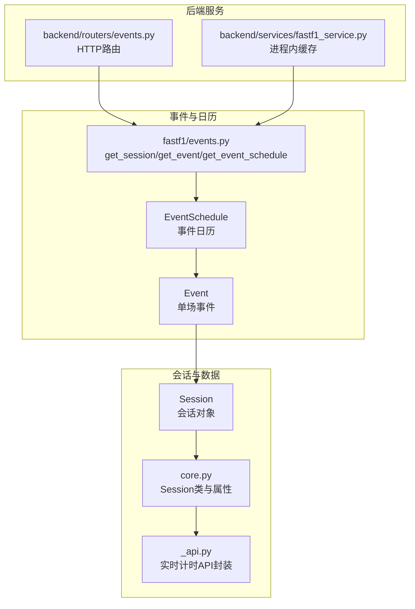
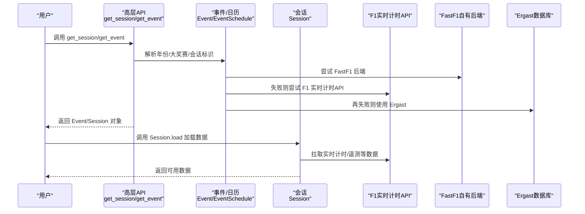
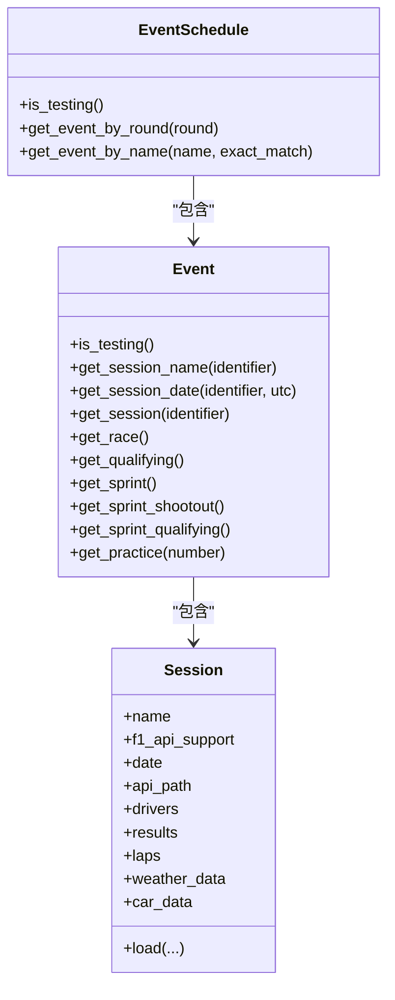
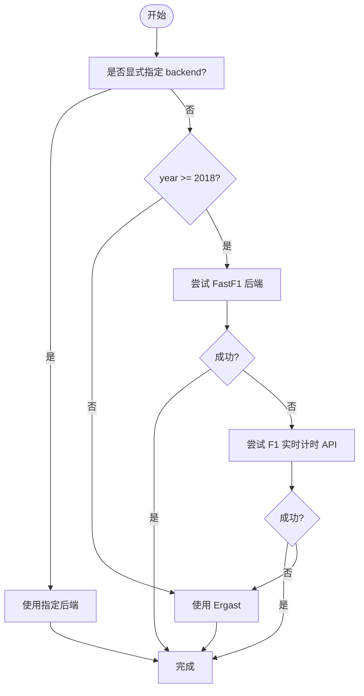
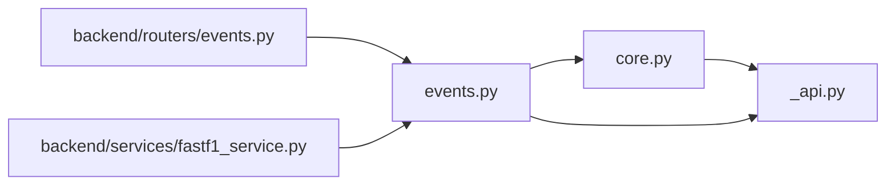

# 事件管理

<cite>
**本文引用的文件**   
- [fastf1/events.py](file://fastf1/events.py)
- [fastf1/core.py](file://fastf1/core.py)
- [fastf1/_api.py](file://fastf1/_api.py)
- [fastf1/exceptions.py](file://fastf1/exceptions.py)
- [docs/api_reference/events.rst](file://docs/api_reference/events.rst)
- [backend/routers/events.py](file://backend/routers/events.py)
- [backend/services/fastf1_service.py](file://backend/services/fastf1_service.py)
</cite>

## 目录
1. [简介](#简介)
2. [项目结构](#项目结构)
3. [核心组件](#核心组件)
4. [架构总览](#架构总览)
5. [详细组件分析](#详细组件分析)
6. [依赖分析](#依赖分析)
7. [性能考虑](#性能考虑)
8. [故障排查指南](#故障排查指南)
9. [结论](#结论)
10. [附录](#附录)

## 简介
本文件面向 Fast-F1 事件管理系统，聚焦于事件与会话的查询与访问接口，系统性梳理以下内容：
- 核心 API：get_session、get_event、get_event_schedule 的使用方法与参数说明
- 赛事查询机制：年份、大奖赛名称/轮次、会话类型标识的指定方式
- 后端选择机制：FastF1 自有后端、F1 实时计时 API、Ergast 数据库的回退策略
- 事件对象与会话对象：Event、EventSchedule、Session 的属性与方法
- 错误处理与异常：典型错误场景与建议的处理方式
- 示例与最佳实践：如何获取不同类型的赛事数据

## 项目结构
事件管理相关的核心代码位于 fastf1/events.py，围绕事件日历、事件与会话对象展开；会话数据加载与解析由 fastf1/core.py 与 fastf1/_api.py 协作完成；后端服务层在 backend/routers/events.py 与 backend/services/fastf1_service.py 提供 HTTP 接口与缓存封装。

图示来源
- [fastf1/events.py:50-342](file://fastf1/events.py#L50-L342)
- [fastf1/core.py:1152-1300](file://fastf1/core.py#L1152-L1300)
- [fastf1/_api.py:106-248](file://fastf1/_api.py#L106-L248)
- [backend/routers/events.py:21-53](file://backend/routers/events.py#L21-L53)
- [backend/services/fastf1_service.py:14-21](file://backend/services/fastf1_service.py#L14-L21)

章节来源
- [fastf1/events.py:50-342](file://fastf1/events.py#L50-L342)
- [backend/routers/events.py:21-53](file://backend/routers/events.py#L21-L53)
- [backend/services/fastf1_service.py:14-21](file://backend/services/fastf1_service.py#L14-L21)

## 核心组件
- get_session(year, gp, identifier, backend=None, exact_match=False)
  - 返回 Session 对象，用于后续加载 lap timing、telemetry 等数据
  - identifier 支持缩写、全称、序号（1-5）
- get_event(year, gp, backend=None, exact_match=False)
  - 返回 Event 对象，包含该周末的多会话信息
- get_event_schedule(year, include_testing=True, backend=None)
  - 返回 EventSchedule，按赛季组织的事件日历
- get_testing_session/year/test_number/session_number
  - 获取测试赛会话（不支持 Ergast）
- EventSchedule/Event/Session
  - 事件日历、事件与会话对象，提供会话日期、格式、名称等属性与方法

章节来源
- [fastf1/events.py:50-342](file://fastf1/events.py#L50-L342)
- [docs/api_reference/events.rst:1-166](file://docs/api_reference/events.rst#L1-L166)

## 架构总览
事件管理的调用链从高层 API 到底层数据源，遵循“默认 FastF1 后端 + F1 实时计时 API + Ergast”的回退顺序；会话对象在加载前仅持有元信息，加载后才具备 lap、telemetry、天气等数据。

图示来源
- [fastf1/events.py:285-342](file://fastf1/events.py#L285-L342)
- [fastf1/_api.py:106-248](file://fastf1/_api.py#L106-L248)
- [fastf1/core.py:1152-1300](file://fastf1/core.py#L1152-L1300)

## 详细组件分析

### get_session / get_event / get_event_schedule
- 参数与行为要点
  - 年份 year：整数，指定锦标赛年份
  - 大奖赛 gp：字符串（模糊匹配）、国家/地点关键词，或整数轮次
  - identifier：会话标识，支持缩写（如 FP1/FP2/FP3/Q/S/SQ/SS/R）、全称（Practice 1/2/3、Qualifying、Sprint、Sprint Qualifying、Sprint Shootout、Race）与序号（1-5）
  - backend：显式指定后端（'fastf1'/'f1timing'/'ergast'），或留空以启用默认回退策略
  - exact_match：精确匹配模式，避免模糊搜索
- 默认回退策略
  - 默认优先 FastF1 后端；若不可用，回退到 F1 实时计时 API；再失败则使用 Ergast
  - 早于 2018 年强制使用 Ergast
- 返回对象
  - get_session → Session
  - get_event → Event
  - get_event_schedule → EventSchedule

章节来源
- [fastf1/events.py:50-138](file://fastf1/events.py#L50-L138)
- [fastf1/events.py:175-243](file://fastf1/events.py#L175-L243)
- [fastf1/events.py:285-342](file://fastf1/events.py#L285-L342)
- [docs/api_reference/events.rst:140-166](file://docs/api_reference/events.rst#L140-L166)

### EventSchedule 与 Event
- EventSchedule
  - 行为：按赛季组织事件，支持筛选测试赛、按轮次/名称查找事件
  - 关键方法：is_testing、get_event_by_round、get_event_by_name（支持严格/模糊）
- Event
  - 行为：代表单个周末（含多会话或测试）
  - 关键方法：get_session_name（解析 identifier）、get_session_date（本地/UTC 时间）、get_session（返回 Session）、get_race/get_qualifying/get_sprint/get_sprint_shootout/get_sprint_qualifying/get_practice

图示来源
- [fastf1/events.py:640-830](file://fastf1/events.py#L640-L830)
- [fastf1/events.py:831-1011](file://fastf1/events.py#L831-L1011)
- [fastf1/core.py:1152-1300](file://fastf1/core.py#L1152-L1300)

章节来源
- [fastf1/events.py:640-1011](file://fastf1/events.py#L640-L1011)
- [docs/api_reference/events.rst:31-79](file://docs/api_reference/events.rst#L31-L79)

### 会话数据加载与实时计时 API
- Session.load
  - 按需加载：laps、telemetry、weather 等数据
  - 依赖 fastf1/_api.py 中的实时计时 API 封装（timing_data、car_data、weather_data 等）
- API 路径生成
  - 使用 api.make_path 生成会话 API 基础路径，结合 Event 的 EventName、EventDate、Session 名称与本地时间
- 数据可用性
  - f1_api_support 为 True 时，方可加载实时计时与遥测数据

章节来源
- [fastf1/core.py:1152-1300](file://fastf1/core.py#L1152-L1300)
- [fastf1/_api.py:60-90](file://fastf1/_api.py#L60-L90)
- [fastf1/_api.py:106-248](file://fastf1/_api.py#L106-L248)

### 后端选择机制与回退流程
- 回退顺序
  - 显式指定 backend：仅使用该后端
  - 未指定且 year ≥ 2018：FastF1 → F1 实时计时 API → Ergast
  - 早于 2018：强制 Ergast
- 各后端能力
  - FastF1：提供完整的本地时间与时序数据，支持 2018 至当前
  - F1 实时计时 API：提供部分会话的计时与遥测数据，支持 2018 至当前
  - Ergast：提供历史数据（1950 至当前），但不提供本地时间与时序数据

图示来源
- [fastf1/events.py:285-342](file://fastf1/events.py#L285-L342)

章节来源
- [fastf1/events.py:285-342](file://fastf1/events.py#L285-L342)
- [docs/api_reference/events.rst:81-103](file://docs/api_reference/events.rst#L81-L103)

### 后端服务层（FastF1 事件 API）
- HTTP 路由
  - GET /events：返回指定年份的事件列表（含轮次、名称、国家、位置、日期、格式、UTC 赛事时间）
  - GET /{round}/circuit：返回指定轮次的赛道信息（基于 Event.Location 映射）
- 缓存策略
  - 进程内内存缓存，6 小时 TTL
- 服务封装
  - backend/services/fastf1_service.py 提供进程级 Session 缓存与通用数据格式化工具（如时间格式化、遥测序列化）

章节来源
- [backend/routers/events.py:21-53](file://backend/routers/events.py#L21-L53)
- [backend/routers/events.py:480-505](file://backend/routers/events.py#L480-L505)
- [backend/services/fastf1_service.py:14-21](file://backend/services/fastf1_service.py#L14-L21)

## 依赖分析
- 组件耦合
  - 事件层（events.py）依赖 pandas（BaseDataFrame/BaseSeries）、内部工具（to_datetime/to_timedelta）、模糊匹配器
  - 会话层（core.py）依赖事件层（Event）、实时计时 API（_api.py）、Ergast
  - 后端服务层（backend/routers/events.py）依赖 fastf1 高层 API
- 外部依赖
  - F1 实时计时 API（基础地址、页面映射）
  - FastF1 自有后端（schedule_{year}.json）
  - Ergast 数据库（历史季节数据）

图示来源
- [fastf1/events.py:1-30](file://fastf1/events.py#L1-L30)
- [fastf1/core.py:19-38](file://fastf1/core.py#L19-L38)
- [fastf1/_api.py:24-56](file://fastf1/_api.py#L24-L56)
- [backend/routers/events.py:1-7](file://backend/routers/events.py#L1-L7)
- [backend/services/fastf1_service.py:5-8](file://backend/services/fastf1_service.py#L5-L8)

章节来源
- [fastf1/events.py:1-30](file://fastf1/events.py#L1-L30)
- [fastf1/core.py:19-38](file://fastf1/core.py#L19-L38)
- [fastf1/_api.py:24-56](file://fastf1/_api.py#L24-L56)
- [backend/routers/events.py:1-7](file://backend/routers/events.py#L1-L7)
- [backend/services/fastf1_service.py:5-8](file://backend/services/fastf1_service.py#L5-L8)

## 性能考虑
- 进程内缓存
  - backend/services/fastf1_service.py 对 Session 进行进程级缓存，避免重复 load
- HTTP 层缓存
  - backend/routers/events.py 对事件列表与赛道信息设置 6 小时缓存
- 数据加载策略
  - Session.load 按需加载，避免一次性拉取全部数据
- 后端选择
  - 优先 FastF1 后端，减少跨 API 查询成本

章节来源
- [backend/services/fastf1_service.py:14-21](file://backend/services/fastf1_service.py#L14-L21)
- [backend/routers/events.py:12-19](file://backend/routers/events.py#L12-L19)

## 故障排查指南
- 常见异常与原因
  - FuzzyMatchError：模糊匹配置信度不足或输入过短
  - ValueError：无效的大奖赛名称/轮次、无效的会话标识、测试事件不支持 Ergast
  - KeyError：严格匹配模式下无精确结果
  - DataNotLoadedError：访问尚未加载的数据（如 laps、telemetry）
  - RateLimitExceededError：超出硬性速率限制
- 定位与处理建议
  - 明确 backend：在需要时显式指定 'fastf1'/'f1timing'/'ergast'
  - 使用 exact_match=True 精确匹配，避免模糊误判
  - 检查 f1_api_support：非官方 API 支持的会话无法加载实时数据
  - 检查时间戳可用性：某些后端不提供本地时间，UTC 可用
  - 在后端服务层启用缓存，降低重复请求压力

章节来源
- [fastf1/exceptions.py:40-104](file://fastf1/exceptions.py#L40-L104)
- [fastf1/events.py:120-136](file://fastf1/events.py#L120-L136)
- [fastf1/core.py:1227-1233](file://fastf1/core.py#L1227-L1233)

## 结论
Fast-F1 事件管理系统通过清晰的 API 分层与稳健的后端回退策略，为用户提供了灵活、可靠地查询与加载赛事数据的能力。结合进程内与 HTTP 层缓存，可在保证数据时效性的同时提升整体性能。建议在生产环境中：
- 明确指定 backend 以稳定数据来源
- 使用 exact_match 与严格的 identifier 规范
- 仅在需要时调用 Session.load，按需加载数据
- 利用后端服务层缓存与进程内缓存降低请求开销

## 附录

### API 使用示例（步骤说明）
- 获取某年的完整事件日历
  - 步骤：调用 get_event_schedule(year, include_testing=True/False, backend=None)
  - 说明：返回 EventSchedule，可进一步筛选测试赛或按轮次/名称查找
- 获取某大奖赛的 Event
  - 步骤：get_event(year, gp, backend=None, exact_match=False/True)
  - 说明：gp 可为字符串（模糊/精确）、轮次整数
- 获取某会话的 Session
  - 步骤：get_session(year, gp, identifier, backend=None, exact_match=False)
  - 说明：identifier 支持缩写、全称、序号
- 加载会话数据
  - 步骤：Session.load(laps=True/False, telemetry=True/False, weather=True/False)
  - 说明：仅在 f1_api_support 为 True 时可加载实时数据

章节来源
- [fastf1/events.py:50-138](file://fastf1/events.py#L50-L138)
- [fastf1/events.py:175-243](file://fastf1/events.py#L175-L243)
- [fastf1/events.py:285-342](file://fastf1/events.py#L285-L342)
- [fastf1/core.py:1152-1300](file://fastf1/core.py#L1152-L1300)