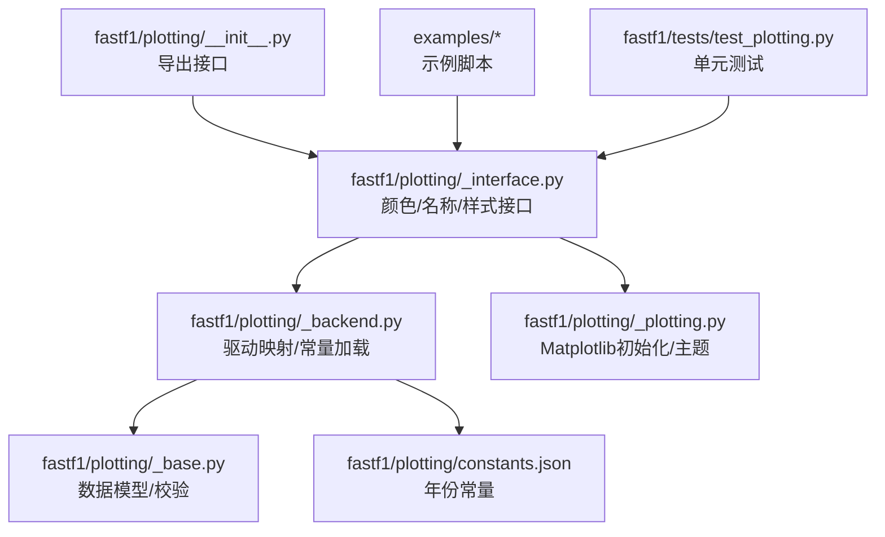
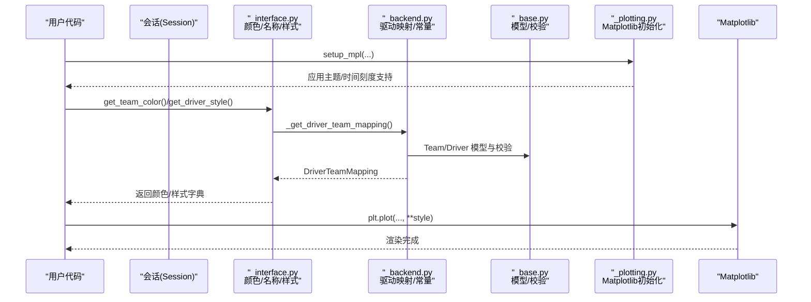
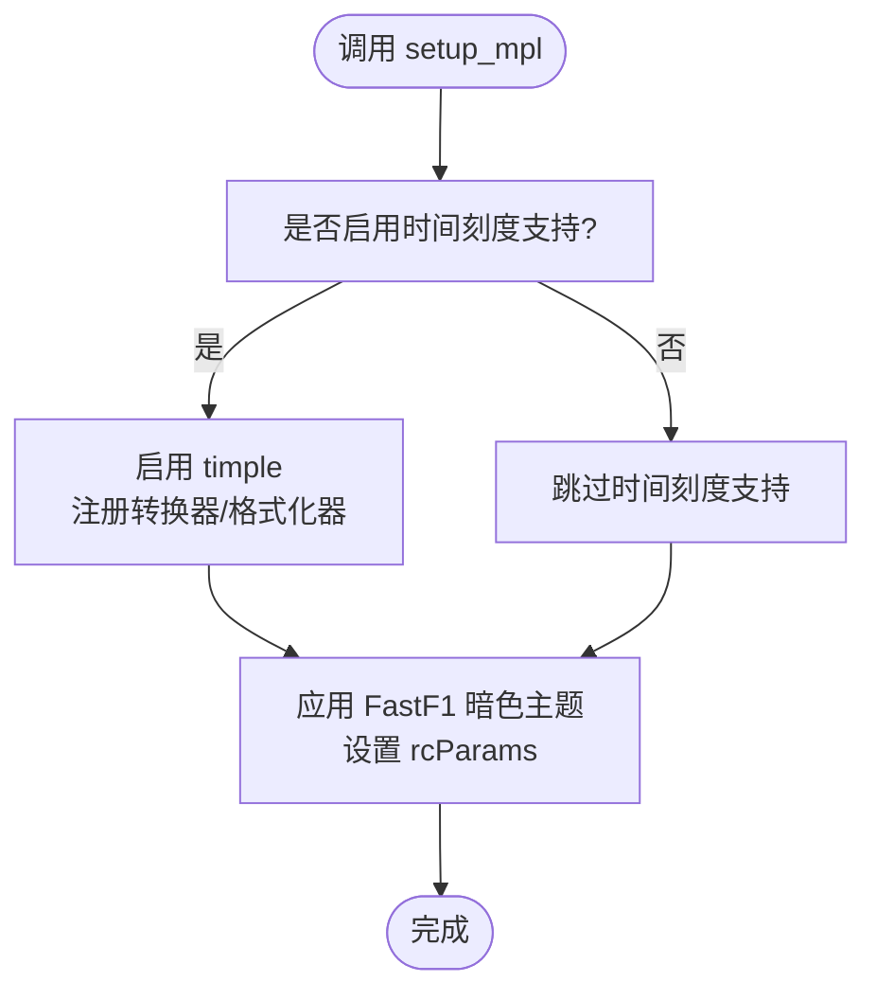
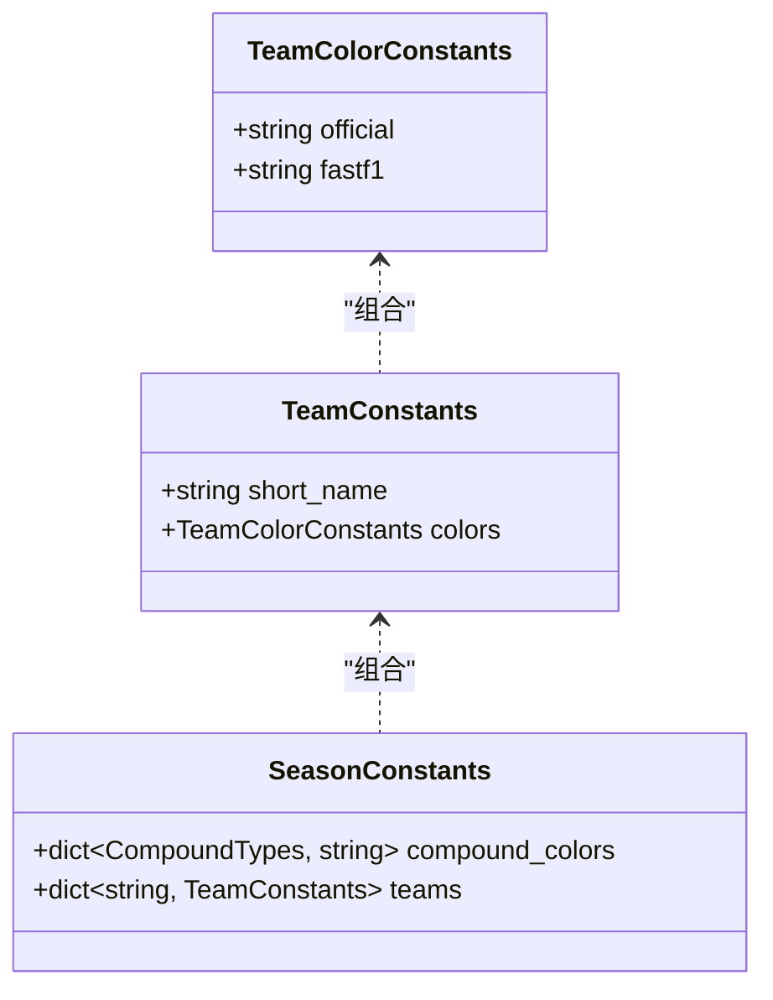
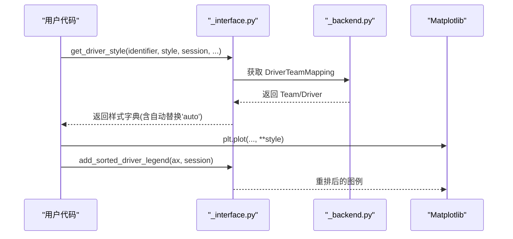
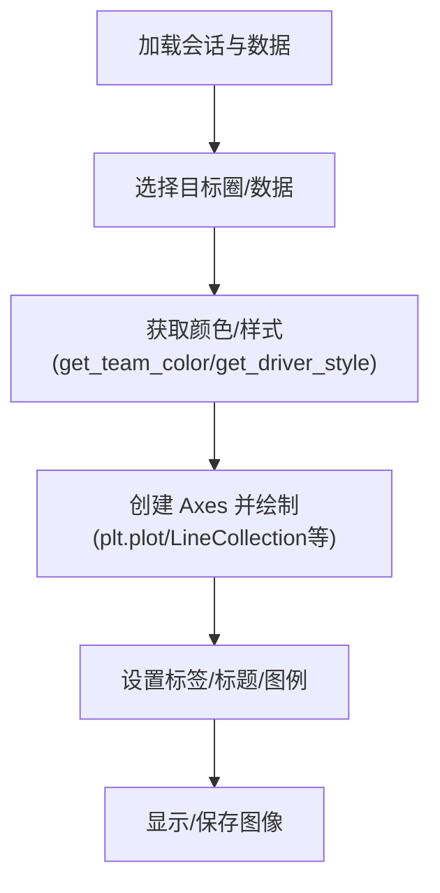
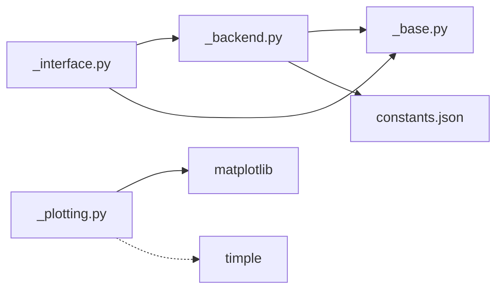

# 可视化支持

<cite>
**本文引用的文件**
- [fastf1/plotting/__init__.py](file://fastf1/plotting/__init__.py)
- [fastf1/plotting/_backend.py](file://fastf1/plotting/_backend.py)
- [fastf1/plotting/_base.py](file://fastf1/plotting/_base.py)
- [fastf1/plotting/_interface.py](file://fastf1/plotting/_interface.py)
- [fastf1/plotting/_plotting.py](file://fastf1/plotting/_plotting.py)
- [fastf1/plotting/constants.json](file://fastf1/plotting/constants.json)
- [examples/telemetry/plot_speed_traces.py](file://examples/telemetry/plot_speed_traces.py)
- [examples/results_strategy/plot_position_changes.py](file://examples/results_strategy/plot_position_changes.py)
- [examples/telemetry/plot_speed_on_track.py](file://examples/telemetry/plot_speed_on_track.py)
- [examples/general/plot_driver_styling.py](file://examples/general/plot_driver_styling.py)
- [docs/api_reference/plotting_colormaps.rst](file://docs/api_reference/plotting_colormaps.rst)
- [docs/api_reference/plotting_data.rst](file://docs/api_reference/plotting_data.rst)
- [docs/_plots/colormap_overview.py](file://docs/_plots/colormap_overview.py)
- [fastf1/tests/test_plotting.py](file://fastf1/tests/test_plotting.py)
</cite>

## 目录
1. [简介](#简介)
2. [项目结构](#项目结构)
3. [核心组件](#核心组件)
4. [架构总览](#架构总览)
5. [详细组件分析](#详细组件分析)
6. [依赖分析](#依赖分析)
7. [性能考量](#性能考量)
8. [故障排查指南](#故障排查指南)
9. [结论](#结论)
10. [附录](#附录)

## 简介
本文件面向 Fast-F1 的可视化支持能力，系统性说明其与 Matplotlib 的集成机制、颜色体系（车队/车手/复合胎）、图表类型支持、样式定制与布局管理、以及示例与最佳实践。文档同时提供可直接定位到源码的路径引用，便于深入学习与二次开发。

## 项目结构
可视化子模块位于 fastf1/plotting 下，主要由以下文件构成：
- 导出入口：__init__.py
- 后端常量与驱动映射：_backend.py
- 数据模型与校验：_base.py
- 接口函数与样式生成：_interface.py
- Matplotlib 初始化与主题：_plotting.py
- 季节性常量（JSON）：constants.json
- 示例与测试：examples/* 与 fastf1/tests/test_plotting.py

**图表来源**
- [fastf1/plotting/__init__.py:1-48](file://fastf1/plotting/__init__.py#L1-L48)
- [fastf1/plotting/_interface.py:1-120](file://fastf1/plotting/_interface.py#L1-L120)
- [fastf1/plotting/_backend.py:1-133](file://fastf1/plotting/_backend.py#L1-L133)
- [fastf1/plotting/_base.py:1-148](file://fastf1/plotting/_base.py#L1-L148)
- [fastf1/plotting/_plotting.py:1-106](file://fastf1/plotting/_plotting.py#L1-L106)
- [fastf1/plotting/constants.json:1-768](file://fastf1/plotting/constants.json#L1-L768)

**章节来源**
- [fastf1/plotting/__init__.py:1-48](file://fastf1/plotting/__init__.py#L1-L48)
- [fastf1/plotting/_backend.py:1-133](file://fastf1/plotting/_backend.py#L1-L133)
- [fastf1/plotting/_base.py:1-148](file://fastf1/plotting/_base.py#L1-L148)
- [fastf1/plotting/_interface.py:1-120](file://fastf1/plotting/_interface.py#L1-L120)
- [fastf1/plotting/_plotting.py:1-106](file://fastf1/plotting/_plotting.py#L1-L106)
- [fastf1/plotting/constants.json:1-768](file://fastf1/plotting/constants.json#L1-L768)

## 核心组件
- 颜色与名称查询：get_team_color、get_driver_color、get_team_name、get_driver_name、get_compound_color 等
- 样式生成：get_driver_style（基于“主色+线型/标记”区分同队不同车手）
- 图例排序：add_sorted_driver_legend（按车队与车手顺序重排）
- 默认配色切换：set_default_colormap
- 常量覆盖：override_team_constants（仅当前会话生效）
- Matplotlib 集成：setup_mpl（时间刻度扩展、主题配色）

**章节来源**
- [fastf1/plotting/_interface.py:279-464](file://fastf1/plotting/_interface.py#L279-L464)
- [fastf1/plotting/_interface.py:489-704](file://fastf1/plotting/_interface.py#L489-L704)
- [fastf1/plotting/_interface.py:814-895](file://fastf1/plotting/_interface.py#L814-L895)
- [fastf1/plotting/_interface.py:898-908](file://fastf1/plotting/_interface.py#L898-L908)
- [fastf1/plotting/_interface.py:911-945](file://fastf1/plotting/_interface.py#L911-L945)
- [fastf1/plotting/_plotting.py:29-106](file://fastf1/plotting/_plotting.py#L29-L106)

## 架构总览
下图展示从会话对象到颜色/样式查询、再到 Matplotlib 绘图的整体流程。

**图表来源**
- [fastf1/plotting/_plotting.py:29-106](file://fastf1/plotting/_plotting.py#L29-L106)
- [fastf1/plotting/_interface.py:31-46](file://fastf1/plotting/_interface.py#L31-L46)
- [fastf1/plotting/_backend.py:25-98](file://fastf1/plotting/_backend.py#L25-L98)
- [fastf1/plotting/_base.py:65-148](file://fastf1/plotting/_base.py#L65-L148)

## 详细组件分析

### Matplotlib 集成与主题
- setup_mpl 提供两方面增强：
  - 时间刻度支持：通过外部库 timple 注册转换器/格式化器，提升对 timedelta 的可读性
  - 主题配色：内置“FastF1 暗色系”，设置背景、坐标轴、文字、图例等 rcParams
- 依赖导入保护：未安装可选依赖时发出警告，避免阻断运行

**图表来源**
- [fastf1/plotting/_plotting.py:29-106](file://fastf1/plotting/_plotting.py#L29-L106)

**章节来源**
- [fastf1/plotting/_plotting.py:29-106](file://fastf1/plotting/_plotting.py#L29-L106)

### 颜色方案与常量
- 车队颜色：每支车队在“官方”和“默认”两种配色之间切换；默认可通过 set_default_colormap 全局设定
- 复合胎颜色：按赛季维护，返回对应十六进制颜色
- 年度常量：constants.json 中包含多赛季的车队短名、官方/默认颜色与复合胎颜色

**图表来源**
- [fastf1/plotting/_base.py:65-92](file://fastf1/plotting/_base.py#L65-L92)
- [fastf1/plotting/constants.json:1-768](file://fastf1/plotting/constants.json#L1-L768)

**章节来源**
- [fastf1/plotting/_interface.py:279-315](file://fastf1/plotting/_interface.py#L279-L315)
- [fastf1/plotting/_interface.py:707-721](file://fastf1/plotting/_interface.py#L707-L721)
- [fastf1/plotting/_base.py:65-92](file://fastf1/plotting/_base.py#L65-L92)
- [fastf1/plotting/constants.json:1-768](file://fastf1/plotting/constants.json#L1-L768)

### 驱动样式与图例排序
- get_driver_style：为同一车队的不同车手生成差异化样式（主色来自车队，辅以线型/标记），或使用自定义样式模板
- add_sorted_driver_legend：根据车队与车手编号顺序重排图例标签，提升可读性

**图表来源**
- [fastf1/plotting/_interface.py:489-704](file://fastf1/plotting/_interface.py#L489-L704)
- [fastf1/plotting/_interface.py:814-895](file://fastf1/plotting/_interface.py#L814-L895)
- [fastf1/plotting/_backend.py:25-98](file://fastf1/plotting/_backend.py#L25-L98)

**章节来源**
- [fastf1/plotting/_interface.py:489-704](file://fastf1/plotting/_interface.py#L489-L704)
- [fastf1/plotting/_interface.py:814-895](file://fastf1/plotting/_interface.py#L814-L895)

### 图表类型支持与示例
- 速度图（叠加最快圈）：示例展示了如何使用 get_team_color 为不同车手分配颜色并叠加两条速度曲线
- 位置变化图（排位/正赛）：示例演示了按车手生成样式并在拥挤场景下将图例置于图外
- 轨迹速度可视化：示例展示了如何基于轨迹点构建折线集合并使用颜色映射呈现速度梯度
- 驱动样式综合示例：涵盖默认样式、图例排序、自定义样式与“auto”颜色替换

**图表来源**
- [examples/telemetry/plot_speed_traces.py:1-53](file://examples/telemetry/plot_speed_traces.py#L1-L53)
- [examples/results_strategy/plot_position_changes.py:1-56](file://examples/results_strategy/plot_position_changes.py#L1-L56)
- [examples/telemetry/plot_speed_on_track.py:1-84](file://examples/telemetry/plot_speed_on_track.py#L1-L84)
- [examples/general/plot_driver_styling.py:1-108](file://examples/general/plot_driver_styling.py#L1-L108)

**章节来源**
- [examples/telemetry/plot_speed_traces.py:1-53](file://examples/telemetry/plot_speed_traces.py#L1-L53)
- [examples/results_strategy/plot_position_changes.py:1-56](file://examples/results_strategy/plot_position_changes.py#L1-L56)
- [examples/telemetry/plot_speed_on_track.py:1-84](file://examples/telemetry/plot_speed_on_track.py#L1-L84)
- [examples/general/plot_driver_styling.py:1-108](file://examples/general/plot_driver_styling.py#L1-L108)

### 自定义样式与主题定制
- 默认配色：set_default_colormap 支持在全局切换“fastf1”或“official”
- 常量覆盖：override_team_constants 可在当前会话内修改车队短名与颜色（不影响其他会话）
- 主题参数：setup_mpl 的 color_scheme 参数可启用内置暗色主题；如需字体等进一步定制，可在调用后自行修改 rcParams

**章节来源**
- [fastf1/plotting/_interface.py:898-908](file://fastf1/plotting/_interface.py#L898-L908)
- [fastf1/plotting/_interface.py:911-945](file://fastf1/plotting/_interface.py#L911-L945)
- [fastf1/plotting/_plotting.py:29-106](file://fastf1/plotting/_plotting.py#L29-L106)

## 依赖分析
- 内部耦合
  - _interface.py 依赖 _backend.py 生成 DriverTeamMapping，并通过 _base.py 的模型进行数据校验
  - _plotting.py 依赖 matplotlib 与可选 timple，用于时间刻度与主题
  - constants.json 作为只读常量源，被 _backend.py 与 _interface.py 使用
- 外部依赖
  - matplotlib（核心绘图库）
  - timple（时间刻度增强）
  - pydantic（模型与校验）

**图表来源**
- [fastf1/plotting/_interface.py:1-25](file://fastf1/plotting/_interface.py#L1-L25)
- [fastf1/plotting/_backend.py:1-13](file://fastf1/plotting/_backend.py#L1-L13)
- [fastf1/plotting/_base.py:1-12](file://fastf1/plotting/_base.py#L1-L12)
- [fastf1/plotting/_plotting.py:4-16](file://fastf1/plotting/_plotting.py#L4-L16)
- [fastf1/plotting/constants.json:1-3](file://fastf1/plotting/constants.json#L1-L3)

**章节来源**
- [fastf1/plotting/_interface.py:1-25](file://fastf1/plotting/_interface.py#L1-L25)
- [fastf1/plotting/_backend.py:1-13](file://fastf1/plotting/_backend.py#L1-L13)
- [fastf1/plotting/_base.py:1-12](file://fastf1/plotting/_base.py#L1-L12)
- [fastf1/plotting/_plotting.py:4-16](file://fastf1/plotting/_plotting.py#L4-L16)
- [fastf1/plotting/constants.json:1-3](file://fastf1/plotting/constants.json#L1-L3)

## 性能考量
- 驱动映射缓存：同一会话内的 DriverTeamMapping 会被缓存，避免重复拉取与解析，提高多次查询效率
- 常量加载：constants.json 在首次访问时解析并缓存到内存中，后续直接使用
- 样式生成：get_driver_style 对于字符串样式列表采用预设映射，复杂度低；自定义样式递归替换“auto”颜色时注意层级深度
- Matplotlib 初始化：setup_mpl 仅在首次调用时注册转换器/格式化器，后续调用开销极小

**章节来源**
- [fastf1/plotting/_interface.py:31-46](file://fastf1/plotting/_interface.py#L31-L46)
- [fastf1/plotting/_backend.py:21-23](file://fastf1/plotting/_backend.py#L21-L23)
- [fastf1/plotting/_plotting.py:68-83](file://fastf1/plotting/_plotting.py#L68-L83)

## 故障排查指南
- 颜色映射异常
  - 若传入 colormap 非“fastf1”或“official”，将抛出错误；请使用 set_default_colormap 或在调用时指定有效值
- 模糊匹配失败
  - 当无法通过模糊匹配识别车手/车队名称时，会抛出特定异常；可改用精确匹配或检查输入文本
- 未安装可选依赖
  - 未安装 matplotlib 或 timple 时，将发出警告；请按需安装以获得完整功能
- 自定义样式不足
  - 自定义样式列表长度需覆盖同一车队的所有车手；否则会报错提示变体数量不足
- 常量覆盖范围
  - override_team_constants 仅影响当前会话；若期望全局生效，请在每个会话中显式调用

**章节来源**
- [fastf1/plotting/_interface.py:113-148](file://fastf1/plotting/_interface.py#L113-L148)
- [fastf1/plotting/_interface.py:181-200](file://fastf1/plotting/_interface.py#L181-L200)
- [fastf1/plotting/_plotting.py:7-16](file://fastf1/plotting/_plotting.py#L7-L16)
- [fastf1/plotting/_interface.py:682-693](file://fastf1/plotting/_interface.py#L682-L693)
- [fastf1/plotting/_interface.py:911-945](file://fastf1/plotting/_interface.py#L911-L945)

## 结论
Fast-F1 的可视化子模块围绕“会话—颜色/名称—样式—绘图”的链路设计，既保证了与 Matplotlib 的无缝集成，又提供了统一的颜色与样式策略。通过常量化的车队/复合胎颜色、可配置的默认配色、以及灵活的样式生成与图例排序工具，用户可以快速构建高质量的 F1 数据可视化图表。建议在大型图表中优先启用图例排序与主题配色，并结合示例脚本进行二次开发。

## 附录
- 团队配色概览文档：参见 plotting_colormaps.rst 与 colormap_overview.py 生成的可视化
- API 概览：参见 plotting_data.rst 的自动生成摘要
- 测试参考：单元测试覆盖颜色、样式、图例排序、常量覆盖等关键行为

**章节来源**
- [docs/api_reference/plotting_colormaps.rst:1-20](file://docs/api_reference/plotting_colormaps.rst#L1-L20)
- [docs/api_reference/plotting_data.rst:1-125](file://docs/api_reference/plotting_data.rst#L1-L125)
- [docs/_plots/colormap_overview.py:1-78](file://docs/_plots/colormap_overview.py#L1-L78)
- [fastf1/tests/test_plotting.py:1-588](file://fastf1/tests/test_plotting.py#L1-L588)