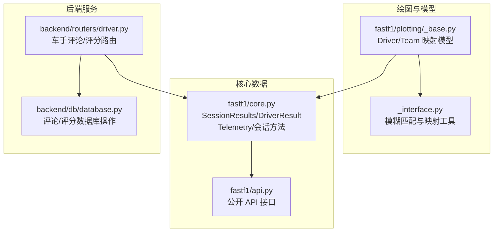
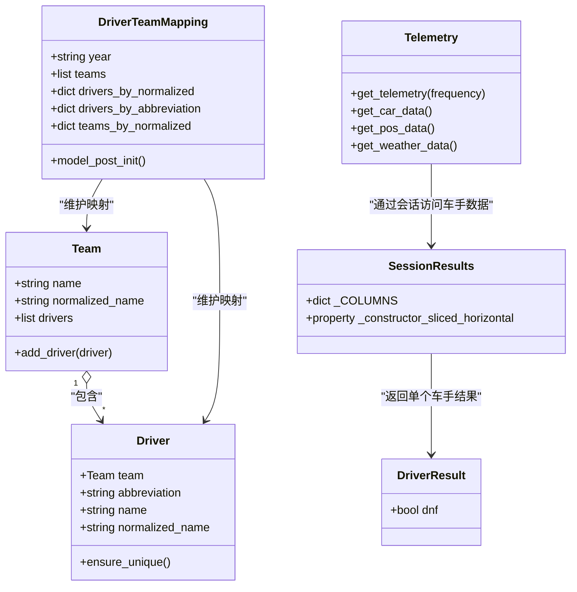
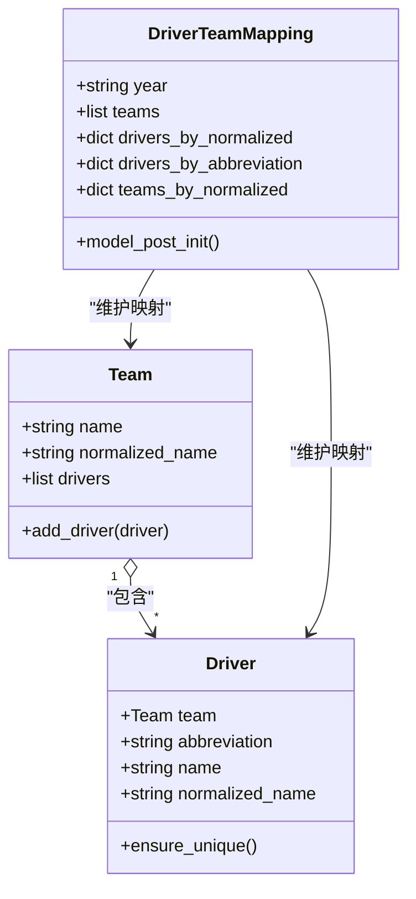
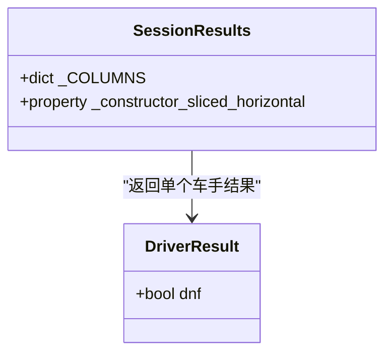
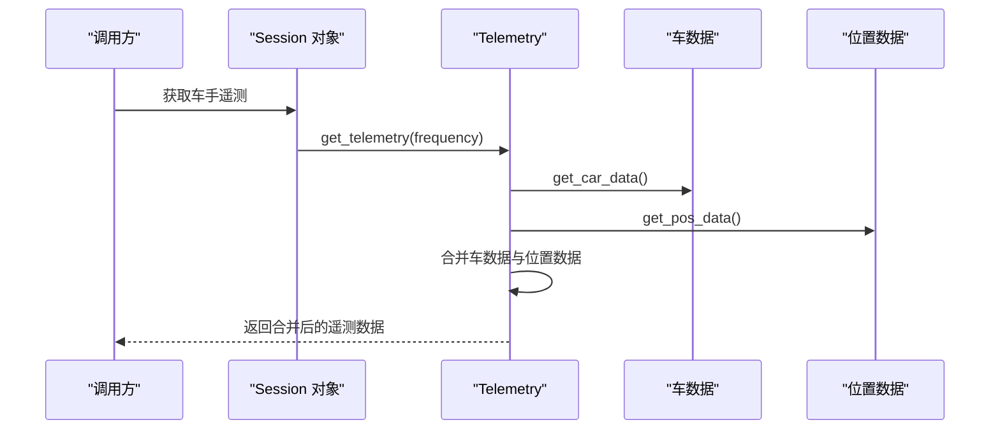
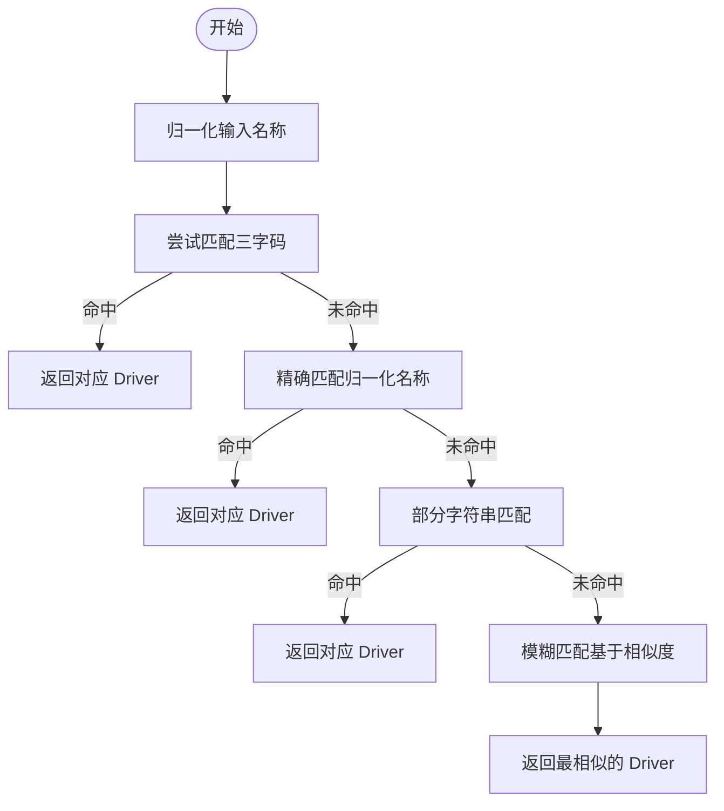
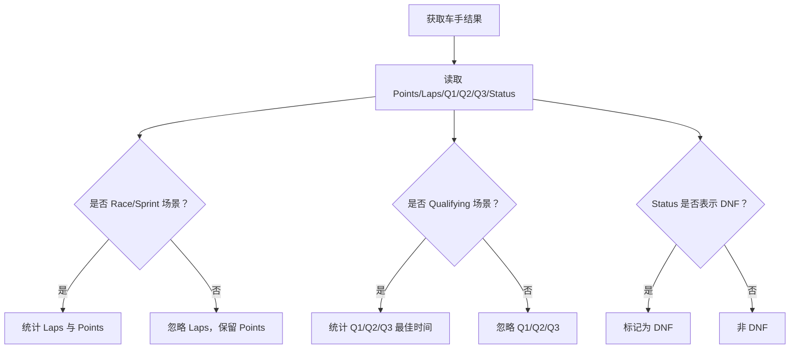
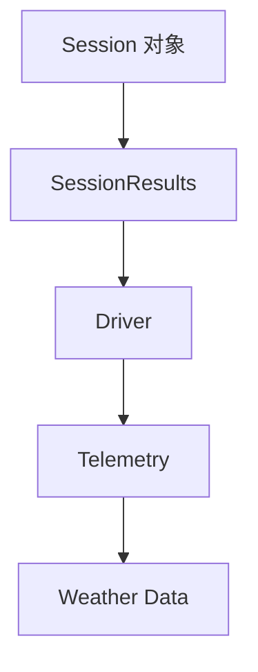
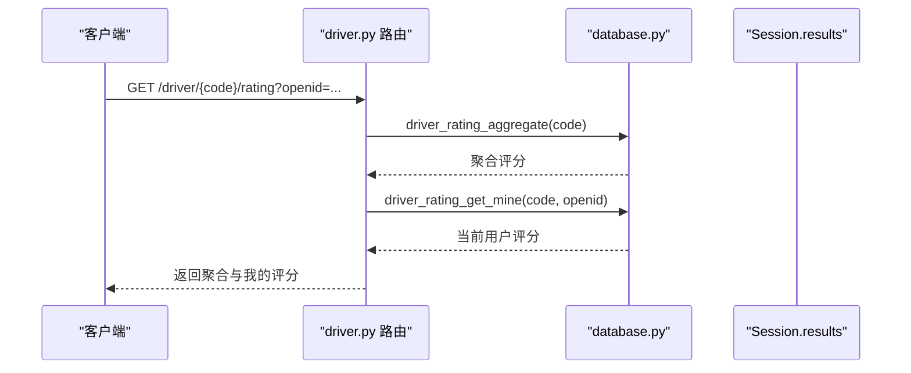
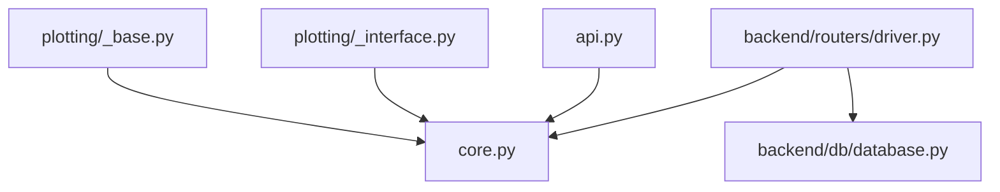

# Driver 车手类

<cite>
**本文引用的文件**
- [fastf1/core.py](file://fastf1/core.py)
- [fastf1/plotting/_base.py](file://fastf1/plotting/_base.py)
- [fastf1/plotting/_interface.py](file://fastf1/plotting/_interface.py)
- [fastf1/api.py](file://fastf1/api.py)
- [backend/routers/driver.py](file://backend/routers/driver.py)
- [backend/db/database.py](file://backend/db/database.py)
</cite>

## 目录
1. [简介](#简介)
2. [项目结构](#项目结构)
3. [核心组件](#核心组件)
4. [架构总览](#架构总览)
5. [详细组件分析](#详细组件分析)
6. [依赖分析](#依赖分析)
7. [性能考虑](#性能考虑)
8. [故障排查指南](#故障排查指南)
9. [结论](#结论)
10. [附录](#附录)

## 简介
本文件为 Fast-F1 项目中的 Driver 车手类提供全面的 API 文档。Driver 在不同模块中承担不同职责：
- 在绘图常量模型中，Driver 是一个 Pydantic 模型，用于描述车手的基本信息（如所属车队、三字码、全名、归一化名称等），并参与车手与车队映射。
- 在核心数据结构中，存在与“车手结果”相关的数据容器（如 SessionResults 和 DriverResult），用于承载会话结果、积分、完赛状态等统计信息。
- 在遥测与会话上下文中，Driver 与会话、成绩、遥测数据存在紧密关联：通过会话对象可获取车手的遥测数据、天气数据以及结果信息。

本文件将系统性地说明 Driver 的数据结构、与会话/成绩/遥测的关系、数据获取方法（如按车手编号或名称获取）、统计指标（积分、完赛次数、杆位数等）的计算方式，并提供可直接定位到源码位置的路径指引，帮助读者快速查阅实现细节。

## 项目结构
围绕 Driver 的相关文件分布如下：
- 绘图常量与模型：包含 Driver 基本信息模型及其与 Team 的关系
- 核心数据结构：包含会话结果与车手结果的数据容器
- 遥测与接口：包含从会话中获取车手遥测数据的方法
- 后端接口：包含基于车手代码的社区评论与评分接口（与 Driver 数据的业务层集成）

**图表来源**
- [fastf1/plotting/_base.py:110-148](file://fastf1/plotting/_base.py#L110-L148)
- [fastf1/plotting/_interface.py:57-92](file://fastf1/plotting/_interface.py#L57-L92)
- [fastf1/core.py:3664-3841](file://fastf1/core.py#L3664-L3841)
- [fastf1/api.py:1-34](file://fastf1/api.py#L1-L34)
- [backend/routers/driver.py:1-116](file://backend/routers/driver.py#L1-L116)
- [backend/db/database.py:1323-1393](file://backend/db/database.py#L1323-L1393)

**章节来源**
- [fastf1/plotting/_base.py:110-148](file://fastf1/plotting/_base.py#L110-L148)
- [fastf1/core.py:3664-3841](file://fastf1/core.py#L3664-L3841)
- [fastf1/plotting/_interface.py:57-92](file://fastf1/plotting/_interface.py#L57-L92)
- [fastf1/api.py:1-34](file://fastf1/api.py#L1-L34)
- [backend/routers/driver.py:1-116](file://backend/routers/driver.py#L1-L116)
- [backend/db/database.py:1323-1393](file://backend/db/database.py#L1323-L1393)

## 核心组件
- 绘图模型中的 Driver
  - 字段：team（Team）、abbreviation（三字码）、name（全名）、normalized_name（归一化名称）
  - 校验：确保同一车队内三字码唯一
- 绘图模型中的 DriverTeamMapping
  - 维护 drivers_by_normalized、drivers_by_abbreviation、teams_by_normalized 等映射
- 核心数据结构中的 SessionResults/DriverResult
  - 提供车手在会话中的结果列（如 DriverNumber、FullName、Abbreviation、TeamName、Position、Points、Laps 等）
- 遥测与会话方法
  - 通过会话对象可获取车手的遥测数据、天气数据及结果信息

**章节来源**
- [fastf1/plotting/_base.py:110-148](file://fastf1/plotting/_base.py#L110-L148)
- [fastf1/core.py:3664-3841](file://fastf1/core.py#L3664-L3841)

## 架构总览
Driver 在系统中的角色与交互如下：
- 绘图常量模型负责车手基础信息与映射
- 核心数据结构承载会话结果与统计
- 遥测模块通过会话访问车手的遥测数据
- 后端接口以车手代码为入口，提供社区评论与评分功能

**图表来源**
- [fastf1/plotting/_base.py:98-148](file://fastf1/plotting/_base.py#L98-L148)
- [fastf1/core.py:3664-3841](file://fastf1/core.py#L3664-L3841)

## 详细组件分析

### 组件一：绘图模型中的 Driver 与 DriverTeamMapping
- Driver 模型字段与校验逻辑
  - team：所属车队对象
  - abbreviation/name/normalized_name：三字码、全名、归一化名称
  - ensure_unique：确保同一车队内三字码唯一
- DriverTeamMapping
  - 维护 drivers_by_normalized、drivers_by_abbreviation、teams_by_normalized 映射
  - model_post_init：初始化时填充映射表

**图表来源**
- [fastf1/plotting/_base.py:98-148](file://fastf1/plotting/_base.py#L98-L148)

**章节来源**
- [fastf1/plotting/_base.py:110-148](file://fastf1/plotting/_base.py#L110-L148)

### 组件二：会话结果与车手结果（SessionResults 与 DriverResult）
- SessionResults
  - 提供车手在会话中的结果列，包括 DriverNumber、FullName、Abbreviation、TeamName、Position、Points、Laps 等
  - 默认按车手号码索引并按完赛位置排序
- DriverResult
  - 单个车手的结果视图，dnf 属性用于判断是否未完赛

**图表来源**
- [fastf1/core.py:3664-3841](file://fastf1/core.py#L3664-L3841)

**章节来源**
- [fastf1/core.py:3664-3841](file://fastf1/core.py#L3664-L3841)

### 组件三：遥测与会话中的车手数据获取
- Telemetry.get_telemetry
  - 合并车数据与位置数据，计算距离、相对距离、与前车的距离等
  - 支持频率参数覆盖默认采样频率
- Telemetry.get_car_data / get_pos_data
  - 分别从会话的车数据与位置数据中切片出指定车手的遥测片段
- Telemetry.get_weather_data
  - 返回会话中与该圈对应的天气数据点

**图表来源**
- [fastf1/core.py:3523-3604](file://fastf1/core.py#L3523-L3604)

**章节来源**
- [fastf1/core.py:3523-3604](file://fastf1/core.py#L3523-L3604)

### 组件四：车手数据获取方法（按编号与名称）
- 按车手编号获取
  - 通过会话结果（SessionResults）按 DriverNumber 或 Abbreviation 进行筛选
  - 示例路径：[按三字码获取 FullName 的辅助函数:83-94](file://backend/routers/analysis.py#L83-L94)
- 按车手名称获取
  - 使用模糊匹配工具根据归一化名称与三字码进行查找
  - 示例路径：[模糊匹配实现:57-92](file://fastf1/plotting/_interface.py#L57-L92)

**图表来源**
- [fastf1/plotting/_interface.py:57-92](file://fastf1/plotting/_interface.py#L57-L92)

**章节来源**
- [fastf1/plotting/_interface.py:57-92](file://fastf1/plotting/_interface.py#L57-L92)
- [backend/routers/analysis.py:83-94](file://backend/routers/analysis.py#L83-L94)

### 组件五：车手统计信息与历史记录
- 积分（Points）
  - 来源于 SessionResults 的 Points 列，通常由会话结果推导
  - 示例路径：[SessionResults 列定义:3782-3805](file://fastf1/core.py#L3782-L3805)
- 完赛次数（Laps）
  - 来源于 SessionResults 的 Laps 列，仅在 Race/Sprint 场景有效
  - 示例路径：[SessionResults 列定义:3782-3805](file://fastf1/core.py#L3782-L3805)
- 杆位数（Q1/Q2/Q3 最佳时间）
  - 来源于 SessionResults 的 Q1/Q2/Q3 列，仅在 Qualifying/Sprint Shootout 场景有效
  - 示例路径：[SessionResults 列定义:3782-3805](file://fastf1/core.py#L3782-L3805)
- 未完赛（DNF）
  - 通过 DriverResult.dnf 判断，依据 Status 列值判定
  - 示例路径：[dnf 属性实现:3837-3841](file://fastf1/core.py#L3837-L3841)

**图表来源**
- [fastf1/core.py:3782-3805](file://fastf1/core.py#L3782-L3805)
- [fastf1/core.py:3837-3841](file://fastf1/core.py#L3837-L3841)

**章节来源**
- [fastf1/core.py:3782-3805](file://fastf1/core.py#L3782-L3805)
- [fastf1/core.py:3837-3841](file://fastf1/core.py#L3837-L3841)

### 组件六：车手与会话、成绩、遥测的关系
- 会话结果（SessionResults）提供车手在会话中的最终结果与统计
- 遥测（Telemetry）提供车手在特定圈次或时间段内的动态数据
- 天气数据（Telemetry.get_weather_data）提供与圈次时间窗口匹配的天气观测点

**图表来源**
- [fastf1/core.py:3664-3841](file://fastf1/core.py#L3664-L3841)
- [fastf1/core.py:3523-3604](file://fastf1/core.py#L3523-L3604)

**章节来源**
- [fastf1/core.py:3664-3841](file://fastf1/core.py#L3664-L3841)
- [fastf1/core.py:3523-3604](file://fastf1/core.py#L3523-L3604)

### 组件七：后端接口与车手数据的业务集成
- 路由层
  - GET /driver/{code}/comments：获取车手评论列表
  - POST /driver/{code}/comments：发布评论（需 openid 与 nickname）
  - POST /driver/comments/{id}/like：点赞评论
  - GET /driver/{code}/rating：获取社区评分聚合与我的评分
  - POST /driver/{code}/rating：提交/更新评分
- 数据层
  - 评论 CRUD：driver_comment_list、driver_comment_add、driver_comment_like
  - 评分 CRUD：driver_rating_upsert、driver_rating_get_mine、driver_rating_aggregate

**图表来源**
- [backend/routers/driver.py:91-115](file://backend/routers/driver.py#L91-L115)
- [backend/db/database.py:1367-1393](file://backend/db/database.py#L1367-L1393)

**章节来源**
- [backend/routers/driver.py:1-116](file://backend/routers/driver.py#L1-L116)
- [backend/db/database.py:1323-1393](file://backend/db/database.py#L1323-L1393)

## 依赖分析
- 绘图模型依赖
  - Driver 依赖 Team；DriverTeamMapping 维护多组映射，便于按名称/三字码快速定位 Driver
- 核心数据结构依赖
  - SessionResults/DriverResult 依赖 pandas DataFrame/Series 的扩展基类
- 遥测依赖
  - Telemetry 依赖会话对象提供的车数据与位置数据，并通过合并与插值生成综合遥测
- 后端依赖
  - 路由依赖数据库层的评论与评分 CRUD 方法

**图表来源**
- [fastf1/plotting/_base.py:110-148](file://fastf1/plotting/_base.py#L110-L148)
- [fastf1/plotting/_interface.py:57-92](file://fastf1/plotting/_interface.py#L57-L92)
- [fastf1/core.py:3664-3841](file://fastf1/core.py#L3664-L3841)
- [fastf1/api.py:1-34](file://fastf1/api.py#L1-L34)
- [backend/routers/driver.py:1-116](file://backend/routers/driver.py#L1-L116)
- [backend/db/database.py:1323-1393](file://backend/db/database.py#L1323-L1393)

**章节来源**
- [fastf1/plotting/_base.py:110-148](file://fastf1/plotting/_base.py#L110-L148)
- [fastf1/plotting/_interface.py:57-92](file://fastf1/plotting/_interface.py#L57-L92)
- [fastf1/core.py:3664-3841](file://fastf1/core.py#L3664-L3841)
- [fastf1/api.py:1-34](file://fastf1/api.py#L1-L34)
- [backend/routers/driver.py:1-116](file://backend/routers/driver.py#L1-L116)
- [backend/db/database.py:1323-1393](file://backend/db/database.py#L1323-L1393)

## 性能考虑
- 遥测合并与插值
  - 合并车数据与位置数据时会进行插值，建议仅在必要时使用 get_telemetry，若只需单一来源数据，优先使用 get_car_data 或 get_pos_data
- 频率设置
  - get_telemetry 支持频率参数，避免不必要的重采样可减少计算开销
- 结果筛选
  - 使用 SessionResults 的列（如 Points、Laps、Q1/Q2/Q3）进行统计时，尽量利用现有列，避免重复计算

[本节为通用指导，不直接分析具体文件]

## 故障排查指南
- 未找到车手
  - 检查三字码是否正确，或使用模糊匹配工具进行容错查找
  - 参考路径：[模糊匹配实现:57-92](file://fastf1/plotting/_interface.py#L57-L92)
- 会话结果列缺失
  - 确认当前会话类型（Race/Sprint/Qualifying 等）是否支持相应列（如 Laps、Q1/Q2/Q3）
  - 参考路径：[SessionResults 列定义:3782-3805](file://fastf1/core.py#L3782-L3805)
- 遥测为空
  - 确认会话已加载遥测数据，且目标车手在该会话中有数据
  - 参考路径：[Telemetry.get_telemetry 实现:3523-3604](file://fastf1/core.py#L3523-3604)
- 评分范围错误
  - 后端接口要求评分在 1-5 之间，超出范围将被拒绝
  - 参考路径：[评分校验:106-108](file://backend/routers/driver.py#L106-L108)

**章节来源**
- [fastf1/plotting/_interface.py:57-92](file://fastf1/plotting/_interface.py#L57-L92)
- [fastf1/core.py:3782-3805](file://fastf1/core.py#L3782-L3805)
- [fastf1/core.py:3523-3604](file://fastf1/core.py#L3523-L3604)
- [backend/routers/driver.py:106-108](file://backend/routers/driver.py#L106-L108)

## 结论
Driver 在 Fast-F1 中既承担绘图常量模型中的基础信息角色，也与会话结果、遥测数据形成紧密关联。通过 SessionResults/DriverResult 可获得车手的统计信息（积分、完赛次数、杆位等），通过 Telemetry 可获取动态遥测与天气数据。后端接口以车手代码为入口，提供社区互动能力。理解这些组件之间的关系与数据流，有助于高效地进行车手数据分析与可视化。

[本节为总结性内容，不直接分析具体文件]

## 附录
- 快速定位参考
  - 绘图模型 Driver/Team 映射：[文件路径:110-148](file://fastf1/plotting/_base.py#L110-L148)
  - 会话结果与车手结果：[文件路径:3664-3841](file://fastf1/core.py#L3664-L3841)
  - 遥测数据获取：[文件路径:3523-3604](file://fastf1/core.py#L3523-L3604)
  - 按名称模糊匹配：[文件路径:57-92](file://fastf1/plotting/_interface.py#L57-L92)
  - 后端车手评论/评分接口：[文件路径:1-116](file://backend/routers/driver.py#L1-L116)
  - 数据库评论/评分操作：[文件路径:1323-1393](file://backend/db/database.py#L1323-L1393)

[本节为补充导航，不直接分析具体文件]