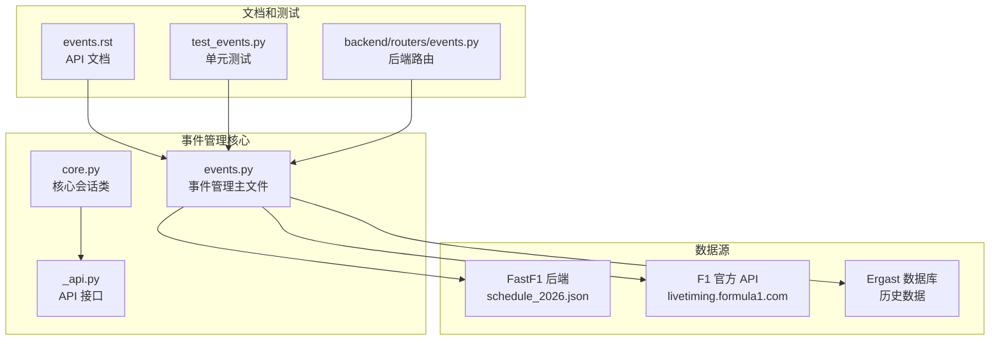
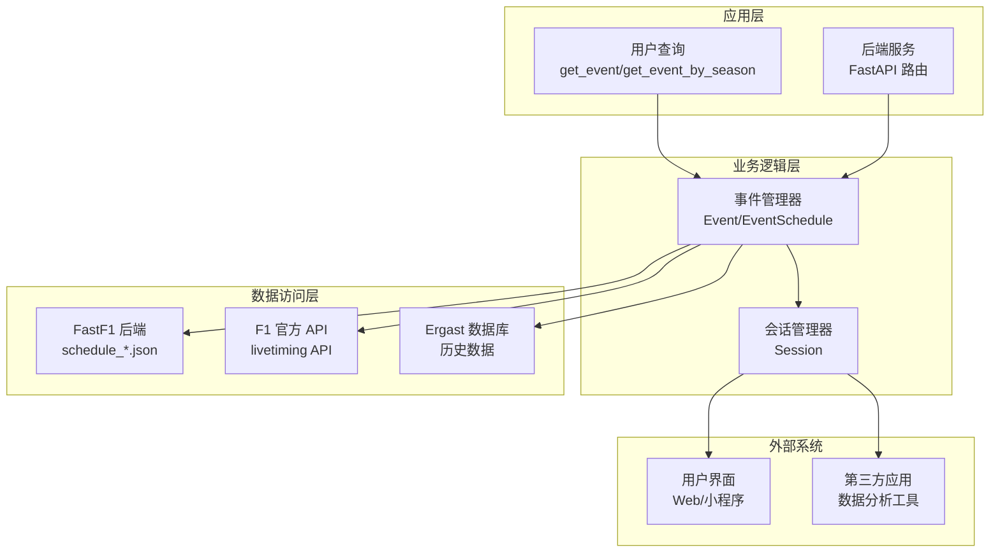
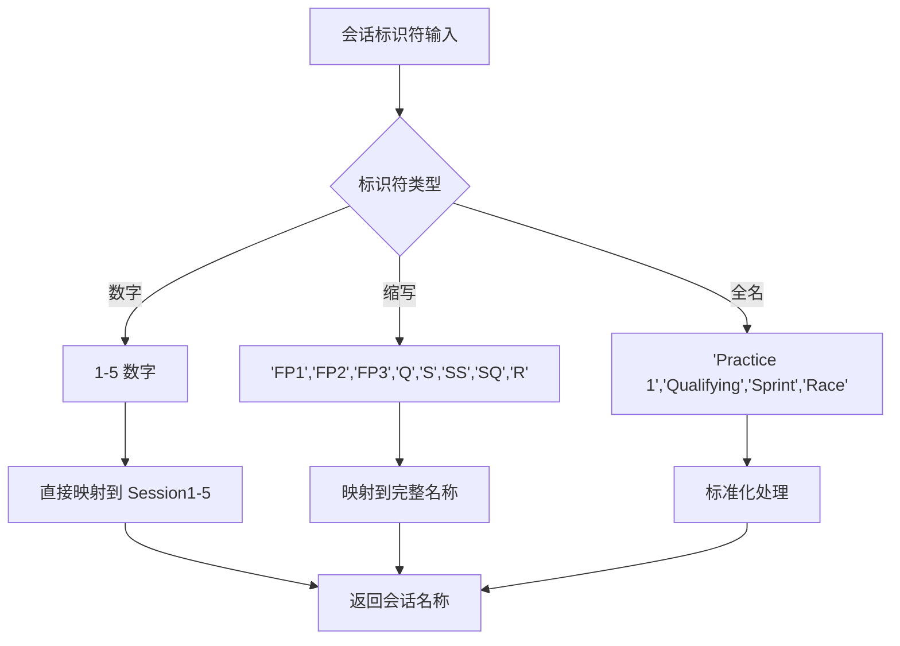
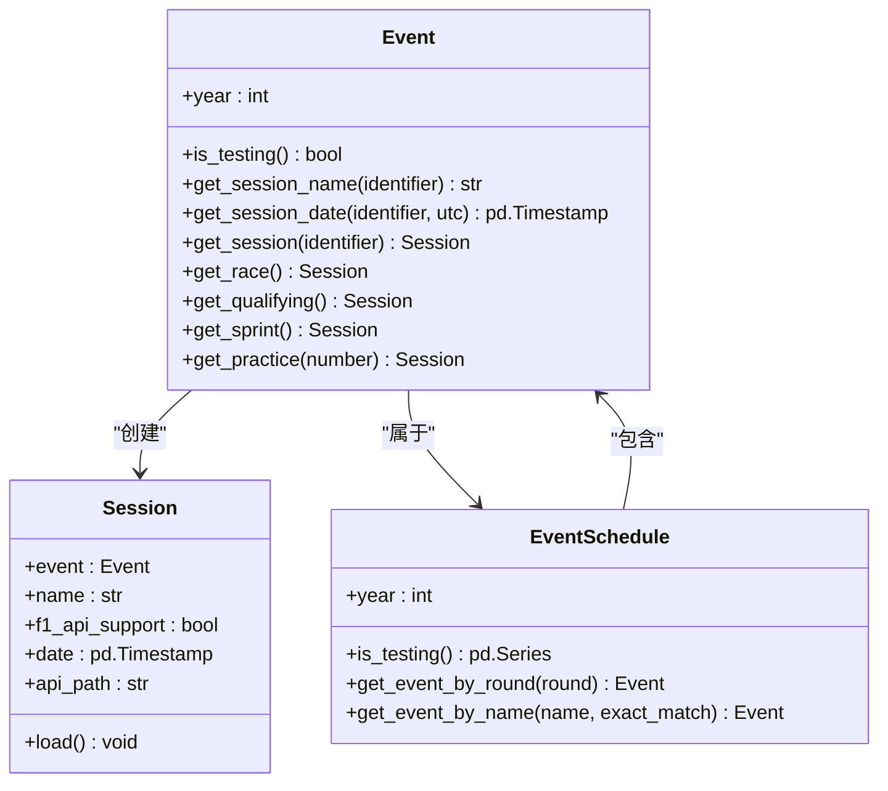
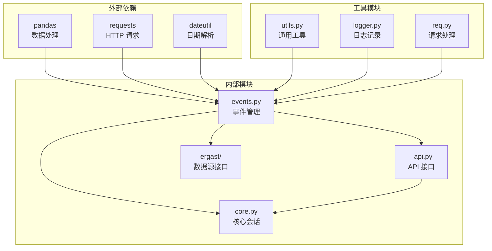

# Event 赛事类

<cite>
**本文档引用的文件**
- [events.py](file://fastf1/events.py)
- [core.py](file://fastf1/core.py)
- [_api.py](file://fastf1/_api.py)
- [events.rst](file://docs/api_reference/events.rst)
- [test_events.py](file://fastf1/tests/test_events.py)
- [events.py](file://backend/routers/events.py)
</cite>

## 目录
1. [简介](#简介)
2. [项目结构](#项目结构)
3. [核心组件](#核心组件)
4. [架构概览](#架构概览)
5. [详细组件分析](#详细组件分析)
6. [依赖关系分析](#依赖关系分析)
7. [性能考虑](#性能考虑)
8. [故障排除指南](#故障排除指南)
9. [结论](#结论)

## 简介

Event 赛事类是 FastF1 项目中 F1 赛事信息管理的核心数据结构，负责管理和查询 Formula 1 赛季的赛事信息。该类提供了完整的赛事数据访问接口，包括赛季年份、赛道信息、比赛日期和会话安排的管理。

FastF1 项目通过多种数据源集成来提供准确的赛事信息，包括 FastF1 自有后端、F1 官方 API 和 Ergast 数据库。Event 类不仅管理单个赛事的所有相关信息，还提供了便捷的方法来获取特定的会话（练习赛、排位赛、冲刺赛、正赛等）信息。

## 项目结构

FastF1 项目的事件管理系统主要由以下核心文件组成：

**图表来源**
- [events.py:1-1011](file://fastf1/events.py#L1-1011)
- [core.py:1152-1300](file://fastf1/core.py#L1152-1300)
- [events.rst:1-166](file://docs/api_reference/events.rst#L1-166)

**章节来源**
- [events.py:1-1011](file://fastf1/events.py#L1-1011)
- [core.py:1152-1300](file://fastf1/core.py#L1152-1300)

## 核心组件

### Event 类概述

Event 类是 `pandas.Series` 的子类，专门用于表示单个 F1 赛事。它继承了 pandas 的强大功能，同时添加了专门的赛事管理方法。

**主要特性：**
- 继承 pandas Series 的所有功能
- 提供赛事特定的数据访问方法
- 支持多种会话类型（练习赛、排位赛、冲刺赛、正赛）
- 集成多种数据源支持
- 提供模糊匹配功能以支持多种输入格式

### EventSchedule 类

EventSchedule 类是 `pandas.DataFrame` 的子类，用于管理整个赛季的赛事日程。每个行代表一个独立的赛事，列包含该赛事的所有相关信息。

**关键属性：**
- `year`: 赛季年份
- `_constructor_sliced_horizontal`: 水平切片时返回 Event 对象
- `_COLUMNS`: 定义标准的列结构和数据类型

**章节来源**
- [events.py:640-830](file://fastf1/events.py#L640-830)

## 架构概览

FastF1 的事件管理系统采用多层架构设计，确保数据的准确性、可靠性和可扩展性：

**图表来源**
- [events.py:285-402](file://fastf1/events.py#L285-402)
- [core.py:1152-1226](file://fastf1/core.py#L1152-1226)

## 详细组件分析

### Event 类详细分析

Event 类是整个事件管理系统的核心，提供了丰富的功能来管理单个赛事的所有信息。

#### 属性和方法

**基础属性：**
- `year`: 赛事所属的赛季年份
- `is_testing()`: 判断是否为测试赛事
- `EventFormat`: 赛事格式（传统、冲刺、测试等）

**会话管理方法：**
- `get_session_name(identifier)`: 获取会话的完整名称
- `get_session_date(identifier, utc=False)`: 获取会话的日期时间
- `get_session(identifier)`: 获取指定会话的对象
- `get_race()`, `get_qualifying()`, `get_sprint()`: 快速获取特定会话

#### 会话标识符支持

Event 类支持多种会话标识符格式：

**图表来源**
- [events.py:858-920](file://fastf1/events.py#L858-920)

**章节来源**
- [events.py:832-1011](file://fastf1/events.py#L832-1011)

### 事件查询方法详解

#### get_event 方法

get_event 方法是获取特定赛事的主要入口点，支持多种查询方式：

**参数配置：**
- `year`: 赛季年份（必需）
- `gp`: 赛事标识符，可以是名称或轮次号
- `backend`: 数据源选择（'fastf1'、'f1timing'、'ergast'）
- `exact_match`: 是否启用精确匹配模式

**返回值：**
- 返回 `Event` 对象，包含指定赛事的完整信息

**章节来源**
- [events.py:175-243](file://fastf1/events.py#L175-243)

#### get_event_by_season 方法

虽然在提供的代码中没有直接找到 `get_event_by_season` 函数，但可以通过 `get_event_schedule` 方法实现相同的功能：

**功能特点：**
- 获取指定赛季的所有赛事
- 支持包含或排除测试赛事
- 支持多种数据源选择
- 返回 `EventSchedule` 对象

**章节来源**
- [events.py:285-342](file://fastf1/events.py#L285-342)

### 数据源集成

FastF1 项目集成了三个主要的数据源来确保数据的准确性和完整性：

#### FastF1 自有后端

使用 GitHub 上的 `f1schedule` 仓库提供的 JSON 数据：

**优势：**
- 包含完整的会话时间和日期信息
- 支持时区转换
- 提供 UTC 和本地时间戳
- 支持最新的赛事格式

**数据结构：**
- `schedule_{year}.json` 文件
- 包含所有会话的详细时间信息
- GMT 偏移量支持

#### F1 官方 API

通过 `livetiming.formula1.com` 获取实时数据：

**优势：**
- 最权威的官方数据源
- 实时更新能力
- 与实际赛事同步

**限制：**
- 仅支持 2018 年及以后的赛季
- 某些历史数据不可用

#### Ergast 数据库

提供历史数据支持：

**优势：**
- 支持 1950 年至今的所有数据
- 免费且可靠的历史数据
- 标准化的数据格式

**限制：**
- 不包含会话的具体时间信息
- 仅能提供基本的赛事信息

**章节来源**
- [events.py:407-637](file://fastf1/events.py#L407-637)

### 会话管理机制

Event 类提供了完整的会话管理功能，支持各种类型的 F1 会话：

**图表来源**
- [events.py:832-1011](file://fastf1/events.py#L832-1011)
- [core.py:1152-1226](file://fastf1/core.py#L1152-1226)

**章节来源**
- [events.py:832-1011](file://fastf1/events.py#L832-1011)
- [core.py:1152-1226](file://fastf1/core.py#L1152-1226)

## 依赖关系分析

FastF1 的事件管理系统具有清晰的依赖层次结构：

**图表来源**
- [events.py:1-27](file://fastf1/events.py#L1-27)
- [core.py:1-39](file://fastf1/core.py#L1-39)

**章节来源**
- [events.py:1-27](file://fastf1/events.py#L1-27)
- [core.py:1-39](file://fastf1/core.py#L1-39)

## 性能考虑

### 缓存策略

FastF1 实现了多层次的缓存机制来优化性能：

1. **内存缓存**: 在进程内缓存已获取的赛事数据
2. **HTTP 缓存**: 使用 HTTP 头部控制缓存过期时间
3. **文件缓存**: 将常用数据持久化到本地文件

### 异步处理

对于大量数据的获取，系统支持异步处理模式：

- **批量查询**: 支持一次性获取多个赛事信息
- **并行处理**: 可以并行处理多个数据源请求
- **增量更新**: 仅更新发生变化的数据

### 内存优化

- **延迟加载**: 仅在需要时才加载完整的赛事数据
- **数据压缩**: 对传输的数据进行压缩
- **资源清理**: 及时释放不再使用的内存资源

## 故障排除指南

### 常见问题和解决方案

#### 数据源连接失败

**症状：** 无法从任何数据源获取赛事信息

**可能原因：**
- 网络连接问题
- 数据源暂时不可用
- API 密钥或认证问题

**解决步骤：**
1. 检查网络连接状态
2. 验证数据源 URL 可访问性
3. 查看错误日志获取详细信息
4. 尝试切换到其他数据源

#### 赛事数据不完整

**症状：** 获取的赛事信息缺少某些字段

**可能原因：**
- 使用的 API 版本不支持某些字段
- 数据源提供有限的信息
- 网络传输过程中数据损坏

**解决步骤：**
1. 检查所选数据源的支持范围
2. 更新到最新版本的 FastF1
3. 验证数据源的可用性
4. 联系数据源提供商

#### 查询结果不符合预期

**症状：** get_event 或 get_event_by_name 返回的结果不正确

**可能原因：**
- 输入参数格式不正确
- 模糊匹配算法未找到合适的匹配
- 赛事名称在不同数据源间存在差异

**解决步骤：**
1. 检查输入参数的格式和有效性
2. 尝试使用 `exact_match=True` 参数
3. 使用更精确的赛事名称
4. 检查不同数据源间的差异

**章节来源**
- [test_events.py:182-224](file://fastf1/tests/test_events.py#L182-224)

## 结论

FastF1 的 Event 赛事类为 F1 赛事信息管理提供了一个强大而灵活的解决方案。通过集成多个数据源、提供多种查询方式和完善的错误处理机制，该系统能够满足从个人用户到专业分析师的各种需求。

**主要优势：**
- **多数据源支持**: 确保数据的准确性和完整性
- **灵活的查询接口**: 支持多种输入格式和查询方式
- **强大的扩展性**: 易于添加新的数据源和功能
- **完善的错误处理**: 提供详细的错误信息和恢复机制

**未来发展方向：**
- 进一步优化性能和响应速度
- 扩展对更多数据源的支持
- 增强实时数据更新能力
- 改进用户界面和交互体验

通过持续的改进和优化，FastF1 的 Event 赛事类将继续为 F1 数据分析和应用开发提供坚实的基础。