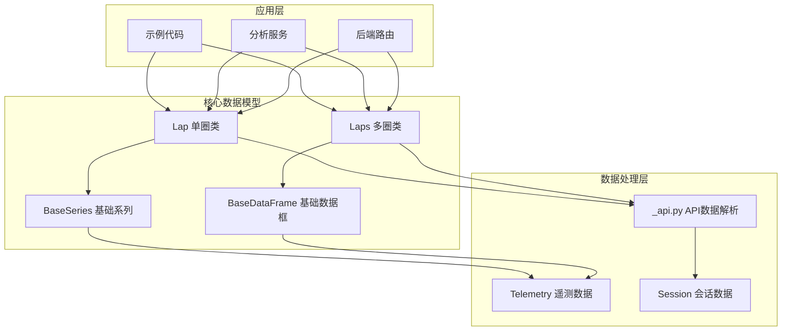
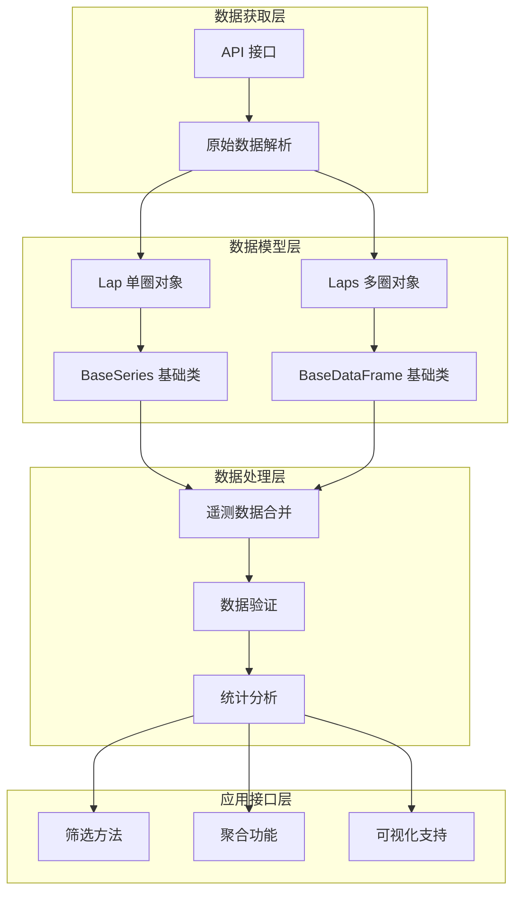
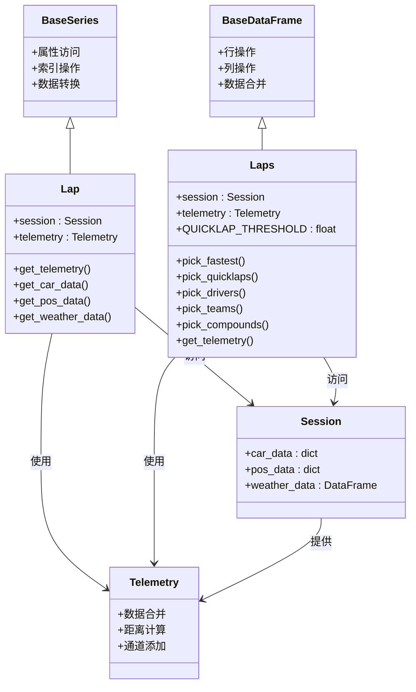
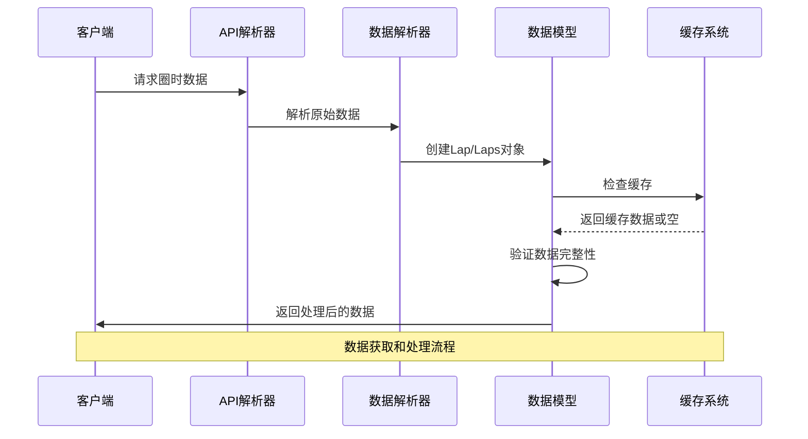
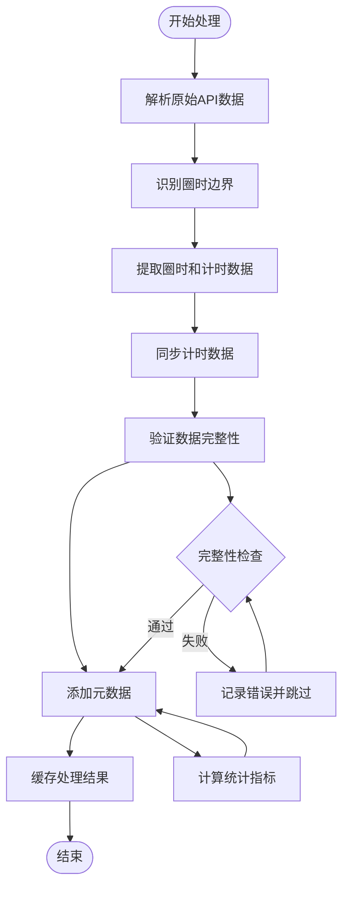
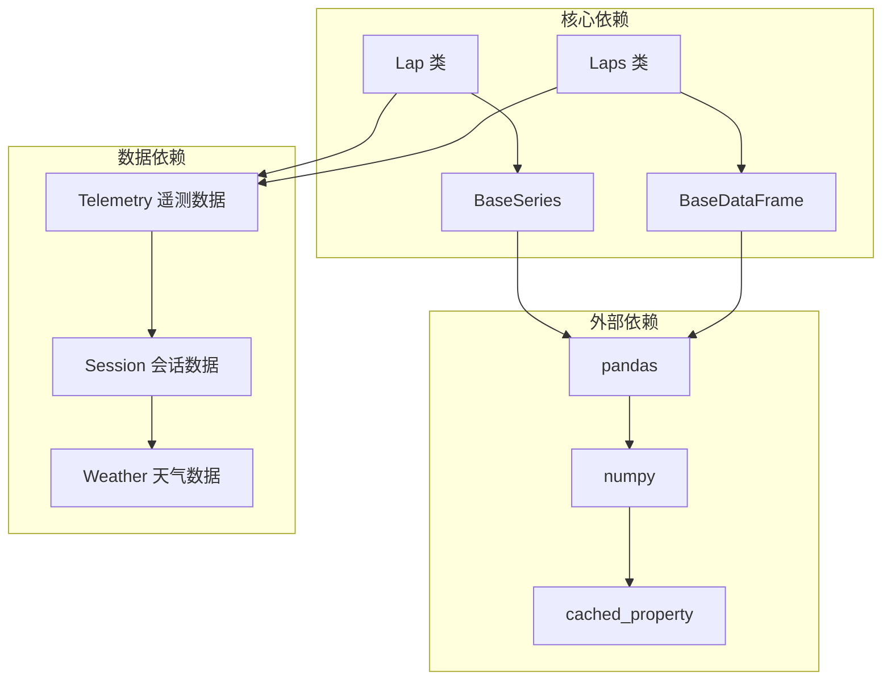
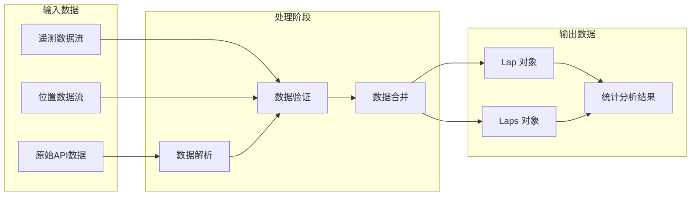

# Lap 圈时数据模型

<cite>
**本文档引用的文件**
- [fastf1/core.py](file://fastf1/core.py)
- [fastf1/_api.py](file://fastf1/_api.py)
- [fastf1/tests/test_laps.py](file://fastf1/tests/test_laps.py)
- [examples/lap_times/plot_driver_laptimes.py](file://examples/lap_times/plot_driver_laptimes.py)
- [examples/lap_times/plot_laptimes_distribution.py](file://examples/lap_times/plot_laptimes_distribution.py)
- [backend/routers/analysis.py](file://backend/routers/analysis.py)
- [backend/services/rule_engine.py](file://backend/services/rule_engine.py)
</cite>

## 目录
1. [简介](#简介)
2. [项目结构](#项目结构)
3. [核心组件](#核心组件)
4. [架构概览](#架构概览)
5. [详细组件分析](#详细组件分析)
6. [依赖分析](#依赖分析)
7. [性能考虑](#性能考虑)
8. [故障排除指南](#故障排除指南)
9. [结论](#结论)
10. [附录](#附录)

## 简介

Lap 圈时数据模型是 Fast-F1 项目中用于管理和分析赛车圈时数据的核心抽象。该模型通过两个主要类来实现：Lap（单圈数据）和 Laps（多圈数据）。这些类提供了丰富的功能来获取、处理和分析赛车的圈时信息，包括圈时长、进站信息、套圈数、车手位置等关键字段。

本项目专注于提供准确、可靠且高性能的圈时数据分析能力，支持从遥测数据中提取圈时信息，并提供统计分析方法来评估车手的驾驶表现。

## 项目结构

Fast-F1 项目的圈时数据模型主要分布在以下模块中：



**图表来源**
- [fastf1/core.py:2730-3528](file://fastf1/core.py#L2730-L3528)
- [fastf1/_api.py:360-800](file://fastf1/_api.py#L360-L800)

**章节来源**
- [fastf1/core.py:2730-3528](file://fastf1/core.py#L2730-L3528)
- [fastf1/_api.py:360-800](file://fastf1/_api.py#L360-L800)

## 核心组件

### Lap 类（单圈数据）

Lap 类是围绕 pandas Series 的包装器，专门用于访问单圈的定时数据。它提供了额外的功能来访问与特定圈相关的遥测数据。

**主要特性：**
- 继承自 BaseSeries，提供 pandas Series 的所有功能
- 包含额外的遥测数据访问功能
- 支持缓存机制以提高性能
- 提供多种数据获取方法

**关键属性：**
- `session`: 关联的会话对象
- `telemetry`: 缓存的遥测数据属性

**核心方法：**
- `get_telemetry()`: 获取该圈的遥测数据
- `get_car_data()`: 获取该圈的车辆数据
- `get_pos_data()`: 获取该圈的位置数据
- `get_weather_data()`: 获取该圈的天气数据

### Laps 类（多圈数据）

Laps 类是围绕 pandas DataFrame 的包装器，专门用于访问多个圈的定时数据。它实现了比普通 pandas DataFrame 更多的功能。

**主要特性：**
- 继承自 BaseDataFrame，提供 pandas DataFrame 的所有功能
- 包含额外的筛选和分析功能
- 支持缓存机制以提高性能
- 提供丰富的数据筛选方法

**关键属性：**
- `_COLUMNS`: 定义了所有可用的列及其数据类型
- `session`: 关联的会话对象
- `telemetry`: 缓存的遥测数据属性
- `QUICKLAP_THRESHOLD`: 快速圈阈值（默认 107% 规则）

**核心方法：**
- `pick_fastest()`: 获取最快圈时
- `pick_quicklaps()`: 获取快速圈时
- `pick_drivers()`: 按车手筛选
- `pick_teams()`: 按车队筛选
- `pick_compounds()`: 按轮胎配方筛选
- `get_telemetry()`: 获取多圈的遥测数据

**章节来源**
- [fastf1/core.py:2730-3528](file://fastf1/core.py#L2730-L3528)
- [fastf1/core.py:3487-3661](file://fastf1/core.py#L3487-L3661)

## 架构概览

圈时数据模型采用分层架构设计，确保了清晰的职责分离和良好的可扩展性：



**图表来源**
- [fastf1/core.py:2730-3528](file://fastf1/core.py#L2730-L3528)
- [fastf1/_api.py:360-800](file://fastf1/_api.py#L360-L800)

## 详细组件分析

### 数据模型类图



**图表来源**
- [fastf1/core.py:2730-3528](file://fastf1/core.py#L2730-L3528)
- [fastf1/core.py:3487-3661](file://fastf1/core.py#L3487-L3661)

### 圈时数据获取流程



**图表来源**
- [fastf1/_api.py:360-800](file://fastf1/_api.py#L360-L800)
- [fastf1/core.py:2730-3528](file://fastf1/core.py#L2730-L3528)

### 圈时数据处理算法



**图表来源**
- [fastf1/_api.py:360-800](file://fastf1/_api.py#L360-L800)

### 数据筛选和聚合功能

Laps 类提供了丰富的筛选和聚合功能来分析圈时数据：

**筛选功能：**
- `pick_fastest()`: 获取最快圈时（默认基于个人最佳）
- `pick_quicklaps()`: 获取快速圈时（默认阈值为最快圈时的 107%）
- `pick_drivers()`: 按车手标识符筛选
- `pick_teams()`: 按车队名称筛选
- `pick_compounds()`: 按轮胎配方筛选
- `pick_track_status()`: 按赛道状态筛选

**聚合功能：**
- 平均圈时计算
- 最快圈时识别
- 圈时分布统计
- 轮胎配方使用分析

**章节来源**
- [fastf1/core.py:3198-3437](file://fastf1/core.py#L3198-L3437)

## 依赖分析

### 内部依赖关系



**图表来源**
- [fastf1/core.py:2730-3528](file://fastf1/core.py#L2730-L3528)

### 数据流依赖



**图表来源**
- [fastf1/_api.py:360-800](file://fastf1/_api.py#L360-L800)
- [fastf1/core.py:2730-3528](file://fastf1/core.py#L2730-L3528)

**章节来源**
- [fastf1/core.py:2730-3528](file://fastf1/core.py#L2730-L3528)
- [fastf1/_api.py:360-800](file://fastf1/_api.py#L360-L800)

## 性能考虑

### 缓存策略

Lap 和 Laps 类都实现了缓存机制来提高性能：

- `cached_property` 装饰器用于缓存昂贵的操作结果
- 遥测数据的重复访问会被缓存
- 数据验证结果可以被缓存以避免重复计算

### 内存优化

- 使用 pandas 的高效数据结构存储大量时间序列数据
- 支持按需加载和延迟计算
- 提供数据切片功能以减少内存占用

### 并行处理

- 支持多车手数据的并行处理
- 可以同时处理多个会话的数据
- 提供批量数据处理功能

## 故障排除指南

### 常见问题和解决方案

**问题：无法获取遥测数据**
- 检查是否正确加载了会话数据
- 确认车手数据和位置数据都已加载
- 验证数据完整性检查是否通过

**问题：圈时数据不准确**
- 检查数据验证标志（IsAccurate）
- 确认没有被删除的圈时数据
- 验证计时数据的同步状态

**问题：筛选结果为空**
- 检查筛选条件是否合理
- 确认数据中确实存在符合条件的记录
- 验证数据加载状态

**章节来源**
- [fastf1/core.py:3361-3381](file://fastf1/core.py#L3361-L3381)

## 结论

Fast-F1 的 Lap 圈时数据模型提供了一个强大而灵活的框架来处理和分析赛车圈时数据。通过 Lap 和 Laps 两个核心类，用户可以轻松地获取、筛选和分析圈时信息，支持从简单的圈时比较到复杂的统计分析。

该模型的设计充分考虑了性能、可扩展性和易用性，为赛车数据分析提供了坚实的基础。无论是用于比赛分析、车手表现评估还是技术策略制定，这个数据模型都能提供准确可靠的支持。

## 附录

### API 使用示例

以下是一些常见的使用模式和代码示例路径：

**获取单个车手的最快圈时：**
```python
# 示例路径: examples/lap_times/plot_driver_laptimes.py
session = fastf1.get_session(2023, "Azerbaijan", 'R')
session.load()
fastest_lap = session.laps.pick_drivers("ALO").pick_fastest()
```

**获取车手的圈时分布：**
```python
# 示例路径: examples/lap_times/plot_laptimes_distribution.py
driver_laps = race.laps.pick_drivers(point_finishers).pick_quicklaps()
```

**比较两位车手的圈时表现：**
```python
# 示例路径: backend/routers/analysis.py
lap_a = s.laps.pick_drivers(d1).pick_fastest()
lap_b = s.laps.pick_drivers(d2).pick_fastest()
```

**轮胎稳定性分析：**
```python
# 示例路径: backend/services/rule_engine.py
def analyze_tyre_stability(laps_a, laps_b, driver_a: str, driver_b: str)
```

这些示例展示了如何使用 Lap 和 Laps 类来解决实际的赛车数据分析问题，包括数据获取、筛选、比较和统计分析等常见任务。