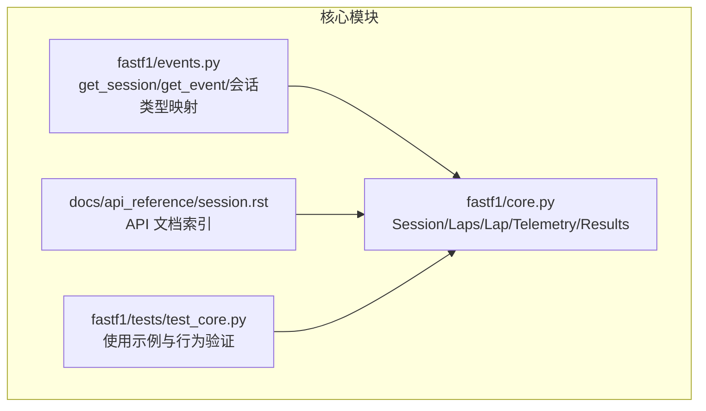
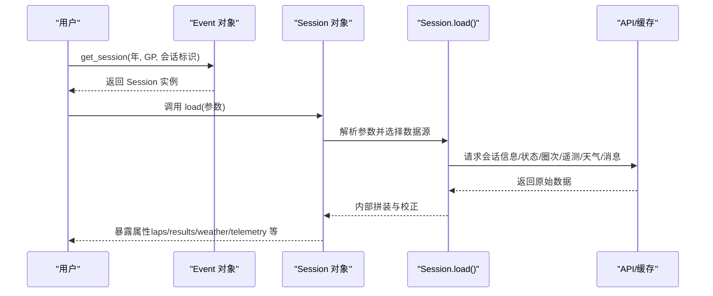
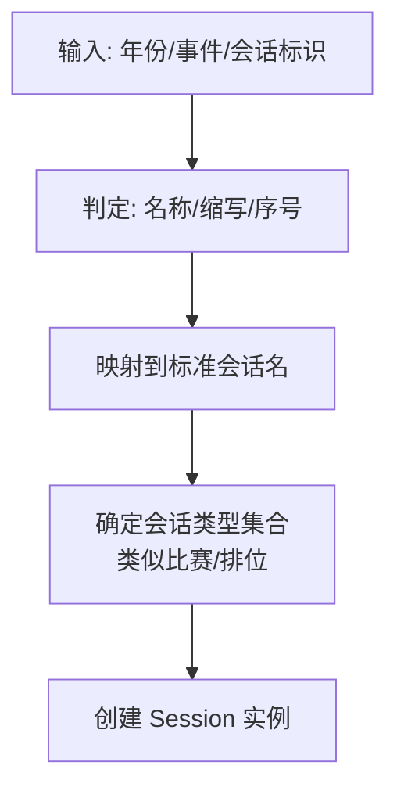
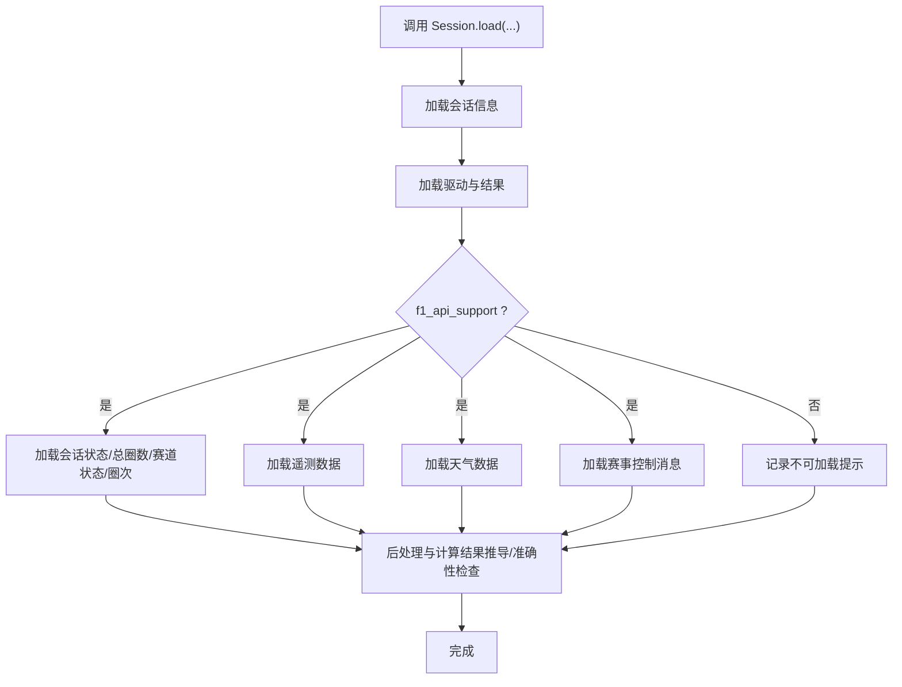
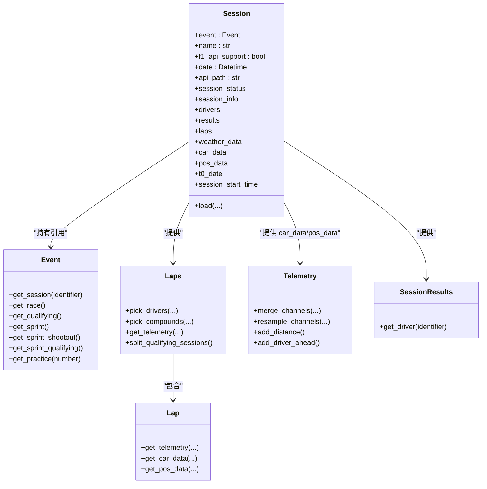
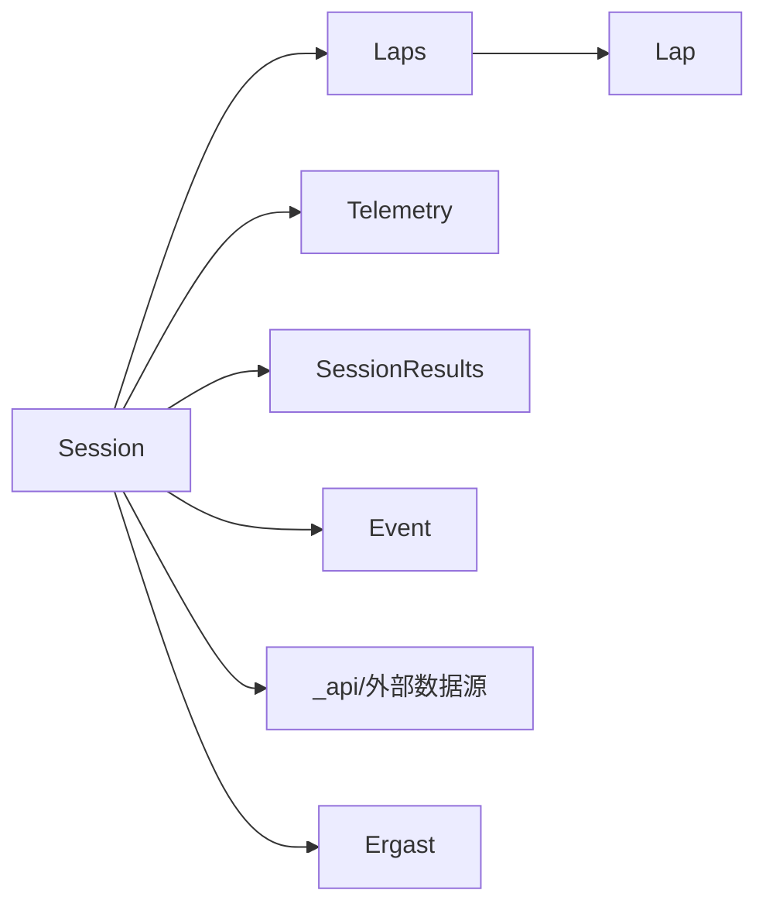

# Session 会话类

<cite>
**本文引用的文件**
- [fastf1/core.py](file://fastf1/core.py)
- [fastf1/events.py](file://fastf1/events.py)
- [docs/api_reference/session.rst](file://docs/api_reference/session.rst)
- [fastf1/tests/test_core.py](file://fastf1/tests/test_core.py)
</cite>

## 目录
1. [简介](#简介)
2. [项目结构](#项目结构)
3. [核心组件](#核心组件)
4. [架构总览](#架构总览)
5. [详细组件分析](#详细组件分析)
6. [依赖关系分析](#依赖关系分析)
7. [性能考虑](#性能考虑)
8. [故障排查指南](#故障排查指南)
9. [结论](#结论)
10. [附录](#附录)

## 简介
本文件为 FastF1 中 Session 会话类的全面 API 文档。Session 是访问 F1 赛事数据的入口对象，代表一次具体的比赛、排位、冲刺赛或练习赛等会话，并通过它可获取该会话相关的所有数据。本文将系统阐述：
- 会话类型识别与处理（Practice、Qualifying、Race、Sprint 及其变体）
- 数据加载方法 load 与 get_session_data 的参数配置、数据源选择与错误处理
- 会话状态管理（session_status、session_info）的实现与使用
- 会话与数据模型的关系（Event、Lap、Driver 等）
- 实际使用示例：创建会话实例、加载数据与基础操作

## 项目结构
围绕 Session 的关键模块与文件如下：
- fastf1/core.py：包含 Session、Laps、Lap、Telemetry、SessionResults 等核心数据结构与方法
- fastf1/events.py：事件与会话的创建入口（get_session、get_event 等），并定义会话类型映射
- docs/api_reference/session.rst：官方 Session 类 API 文档索引
- fastf1/tests/test_core.py：对 Session/Laps 行为的测试用例，体现典型使用模式

**图表来源**
- [fastf1/core.py](file://fastf1/core.py)
- [fastf1/events.py](file://fastf1/events.py)
- [docs/api_reference/session.rst](file://docs/api_reference/session.rst)
- [fastf1/tests/test_core.py](file://fastf1/tests/test_core.py)

**章节来源**
- [fastf1/core.py](file://fastf1/core.py)
- [fastf1/events.py](file://fastf1/events.py)
- [docs/api_reference/session.rst](file://docs/api_reference/session.rst)
- [fastf1/tests/test_core.py](file://fastf1/tests/test_core.py)

## 核心组件
- Session：会话对象，封装事件信息、会话元数据、会话状态、结果、圈次、天气、遥测等，并提供统一的数据加载接口 load
- Laps/Lap：围绕一圈次时间数据的容器，支持按车手、复合胎、进站、准确度等筛选与合并遥测
- Telemetry：多通道时间序列遥测数据，支持合并、重采样、插值与派生通道计算
- SessionResults/DriverResult：会话结果与单个车手结果的结构化数据框

这些组件共同构成会话数据的完整模型，支撑从事件到圈次、从结果到遥测的全链路访问。

**章节来源**
- [fastf1/core.py](file://fastf1/core.py)

## 架构总览
Session 作为核心入口，通过事件对象（Event）与会话标识（名称/编号/缩写）定位具体会话；随后根据会话类型与可用性决定数据源（F1 官方 API 或 Ergast），并加载会话信息、状态、圈次、遥测、天气与控制消息等。

**图表来源**
- [fastf1/events.py](file://fastf1/events.py)
- [fastf1/core.py](file://fastf1/core.py)

**章节来源**
- [fastf1/events.py](file://fastf1/events.py)
- [fastf1/core.py](file://fastf1/core.py)

## 详细组件分析

### 会话类型识别与处理
- 会话类型映射：通过缩写到全称的映射表识别 Practice/Q/FP1/FP2/FP3、Qualifying、Race、Sprint、Sprint Qualifying、Sprint Shootout 等
- 年份差异：不同年份的“冲刺赛”命名与角色存在变化，Session 内部维护“类似比赛/排位”的会话集合以适配历史差异
- 会话名称解析：get_session 支持名称、缩写或序号，内部转换为标准会话名后创建 Session

**图表来源**
- [fastf1/events.py](file://fastf1/events.py)
- [fastf1/core.py](file://fastf1/core.py)

**章节来源**
- [fastf1/events.py](file://fastf1/events.py)
- [fastf1/core.py](file://fastf1/core.py)

### 数据加载方法：load 与 get_session_data
- load 方法参数
  - laps：是否加载圈次与时序状态（默认 True）
  - telemetry：是否加载遥测（默认 True）
  - weather：是否加载天气（默认 True）
  - messages：是否加载赛事控制消息（默认 True）
  - livedata：本地 Livetiming 数据源替代远程请求（可选）
- 数据源选择
  - 当 f1_api_support 为真时，优先使用官方 API 获取会话信息、状态、圈次、遥测、天气与消息
  - 否则仅加载可用的替代数据（如 Ergast 的结果与驱动列表）
- 错误处理
  - 使用软异常装饰器在各子加载函数中捕获失败并记录警告，保证整体流程继续执行
  - 未加载数据时访问相关属性会抛出 DataNotLoadedError 提示调用 load

**图表来源**
- [fastf1/core.py](file://fastf1/core.py)

**章节来源**
- [fastf1/core.py](file://fastf1/core.py)

### 会话状态管理：session_status 与 session_info
- session_status：来自会话状态数据的时间线，包含“开始/中断/完成”等状态及其发生时刻，用于确定会话起始时间、红旗下重启与结束点
- session_info：来自会话信息端点的数据，包含会议、会话、国家与赛道的 ID 与名称等元信息
- t0_date：基于遥测数据计算的“零时刻”日期偏移，是会话时间轴的基准
- track_status：赛道状态（如黄旗、安全车部署等）随时间变化的时间线，用于标注每圈的赛道状态

这些状态数据贯穿于圈次时间线、结果推导与可视化标注中。

**章节来源**
- [fastf1/core.py](file://fastf1/core.py)

### 会话与数据模型的关系
- 与 Event 的关系：Session 由 Event.get_session(...) 创建，持有对 Event 的引用，可查询会话日期、格式等
- 与 Laps 的关系：Session.laps 提供全部车手的圈次数据，支持按车手、复合胎、进站、准确度等筛选与合并遥测
- 与 Driver 的关系：Session.results 提供车手结果，Session.drivers 提供参与车手列表；可通过 get_driver 根据缩写或号码获取单个车手结果
- 与 Telemetry 的关系：Session.car_data/pos_data 分别保存按车号组织的遥测字典，Laps/Lap 提供便捷的切片与合并接口

**图表来源**
- [fastf1/core.py](file://fastf1/core.py)

**章节来源**
- [fastf1/core.py](file://fastf1/core.py)

### 实际使用示例（路径指引）
以下示例展示了常见用法，具体代码请参考对应文件路径：
- 基本会话创建与加载
  - [examples/standings/plot_results_tracker.py](file://examples/standings/plot_results_tracker.py) 展示了通过 Ergast 获取赛季结果的思路，可用于理解会话结果与车手数据的组织方式
- 会话加载与圈次处理
  - [fastf1/tests/test_core.py](file://fastf1/tests/test_core.py) 中包含对 laps 数据加载、位置计算、删除圈次标记等行为的断言，可作为 load 与 Laps 使用的参考
- 会话类型解析与创建
  - [fastf1/events.py](file://fastf1/events.py) 中的 get_session 与 Event.get_session 提供了会话标识到 Session 的创建流程

**章节来源**
- [examples/standings/plot_results_tracker.py](file://examples/standings/plot_results_tracker.py)
- [fastf1/tests/test_core.py](file://fastf1/tests/test_core.py)
- [fastf1/events.py](file://fastf1/events.py)

## 依赖关系分析
- Session 依赖
  - 事件与会话标识：通过 events.get_session 与 Event.get_session 解析
  - API 接口：会话信息、状态、圈次、遥测、天气、消息等均来自 fastf1._api 与外部数据源
  - 内部工具：pandas、numpy、缓存与日志模块
- 组件耦合
  - Session 与 Laps/Lap/Telemetry 高内聚，通过 session 属性相互引用
  - SessionResults 与 DriverResult 作为结果视图，索引与排序逻辑清晰
- 外部依赖
  - Ergast：用于补充结果与驱动列表（尤其在官方 API 不可用时）
  - Livetiming：可选的本地数据源替代远程请求

**图表来源**
- [fastf1/core.py](file://fastf1/core.py)
- [fastf1/events.py](file://fastf1/events.py)

**章节来源**
- [fastf1/core.py](file://fastf1/core.py)
- [fastf1/events.py](file://fastf1/events.py)

## 性能考虑
- 默认全量加载：Session.load 在可用时尽量加载所有数据，以便内部数据源混合与纠错，但可能带来网络与内存开销
- 遥测合并：Telemetry.merge_channels 与 resample_channels 会进行插值与重采样，建议按需设置频率，避免重复重采样
- 准确性检查：_check_lap_accuracy 会对圈次完整性进行验证，可在调试阶段启用，生产环境可按需关闭
- 缓存与降级：当官方 API 不可用时自动回退至 Ergast 或本地 Livetiming 数据，确保功能可用性

[本节为通用指导，无需特定文件引用]

## 故障排查指南
- 访问未加载属性报错
  - 现象：访问 laps/results/weather/telemetry 等属性时报错，提示数据尚未加载
  - 处理：先调用 Session.load，必要时指定 telemetry=False 以减少加载项
- 官方 API 不可用
  - 现象：f1_api_support 为假，部分数据无法加载
  - 处理：确认会话是否支持官方 API；若不支持，关注结果与驱动列表是否可从 Ergast 获取
- 圈次准确性与删除标记
  - 现象：某些圈次被删除或准确性不足
  - 处理：检查 race_control_messages 是否加载；使用 Laps.pick_not_deleted 与 Laps.pick_accurate 过滤
- 遥测缺失
  - 现象：遥测数据为空或部分车号缺失
  - 处理：确认 Session.load 中 telemetry=True；检查 Session.car_data/pos_data 是否存在对应车号键

**章节来源**
- [fastf1/core.py](file://fastf1/core.py)
- [fastf1/tests/test_core.py](file://fastf1/tests/test_core.py)

## 结论
Session 会话类是 FastF1 的核心抽象，统一了会话类型识别、数据源选择与加载流程，并通过 Laps/Lap/Telemetry/SessionResults 等模型提供了从事件到圈次、从结果到遥测的完整数据访问路径。合理使用 load 参数与属性访问策略，可高效获取所需数据并进行后续分析与可视化。

[本节为总结性内容，无需特定文件引用]

## 附录
- 官方 Session API 文档索引：[docs/api_reference/session.rst](file://docs/api_reference/session.rst)
- 会话创建与类型解析：[fastf1/events.py](file://fastf1/events.py)
- 核心数据结构与方法：[fastf1/core.py](file://fastf1/core.py)
- 使用示例与行为验证：[fastf1/tests/test_core.py](file://fastf1/tests/test_core.py)