# Telemetry 遥测数据类

<cite>
**本文引用的文件**
- [fastf1/core.py](file://fastf1/core.py)
- [fastf1/tests/test_telemetry.py](file://fastf1/tests/test_telemetry.py)
- [docs/api_reference/telemetry.rst](file://docs/api_reference/telemetry.rst)
- [examples/telemetry/plot_speed_traces.py](file://examples/telemetry/plot_speed_traces.py)
- [examples/telemetry/plot_speed_on_track.py](file://examples/telemetry/plot_speed_on_track.py)
</cite>

## 目录
1. [简介](#简介)
2. [项目结构](#项目结构)
3. [核心组件](#核心组件)
4. [架构概览](#架构概览)
5. [详细组件分析](#详细组件分析)
6. [依赖关系分析](#依赖关系分析)
7. [性能考虑](#性能考虑)
8. [故障排除指南](#故障排除指南)
9. [结论](#结论)
10. [附录](#附录)

## 简介

Telemetry 遥测数据类是 FastF1 库中用于处理多通道时间序列遥测数据的核心组件。该类专门设计用于处理 F1 赛车的实时遥测数据，包括马达数据、位置数据和时间相关字段。Telemetry 类提供了丰富的数据切片、合并和计算功能，使得用户能够轻松地分析和可视化赛车数据。

该类支持多种数据源的合并，包括来自官方 API 的马达数据（Speed、RPM、nGear、Throttle、Brake、DRS）和位置数据（X、Y、Z、Status），并提供了计算距离、相对距离和驾驶员信息等功能。

## 项目结构

Fast-F1 项目的整体结构如下：

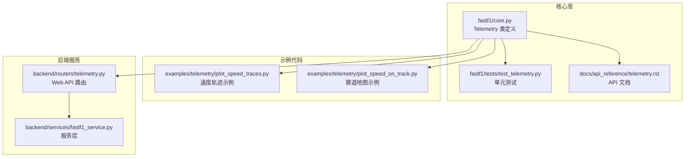

**图表来源**
- [fastf1/core.py:64-148](file://fastf1/core.py#L64-L148)
- [fastf1/tests/test_telemetry.py:1-401](file://fastf1/tests/test_telemetry.py#L1-L401)
- [docs/api_reference/telemetry.rst:1-13](file://docs/api_reference/telemetry.rst#L1-L13)

**章节来源**
- [fastf1/core.py:64-148](file://fastf1/core.py#L64-L148)
- [docs/api_reference/telemetry.rst:1-13](file://docs/api_reference/telemetry.rst#L1-L13)

## 核心组件

### Telemetry 类概述

Telemetry 类是 FastF1 中处理遥测数据的主要类，继承自 BaseDataFrame，专门用于处理多通道时间序列数据。该类支持以下主要功能：

- **多通道数据管理**：支持同时包含多个遥测通道的数据集
- **数据合并**：可以将不同来源的数据按时间轴合并
- **数据切片**：支持基于掩码、圈数和时间范围的切片操作
- **距离计算**：提供距离、相对距离和驾驶员信息的计算功能
- **元数据传播**：在数据操作过程中保持会话和驱动器信息

### 数据通道定义

Telemetry 类定义了以下标准遥测通道：

#### 马达数据通道
- **Speed** (float): 车辆速度 [km/h]
- **RPM** (float): 发动机转速
- **nGear** (int): 档位编号
- **Throttle** (float): 油门踏板压力 [0-100%]
- **Brake** (bool): 制动状态
- **DRS** (int): DRS 状态指示

#### 位置数据通道
- **X** (float): X 坐标 [1/10 米]
- **Y** (float): Y 坐标 [1/10 米]
- **Z** (float): Z 坐标 [1/10 米]
- **Status** (str): 车辆状态（OnTrack/OffTrack）

#### 时间相关通道
- **Time** (timedelta): 相对时间（以切片开始为基准）
- **SessionTime** (timedelta): 会话总时间
- **Date** (datetime): 完整的时间戳
- **Source** (str): 数据来源标识

**章节来源**
- [fastf1/core.py:73-135](file://fastf1/core.py#L73-L135)
- [fastf1/core.py:154-199](file://fastf1/core.py#L154-L199)

## 架构概览

Telemetry 类的整体架构设计体现了以下关键特性：

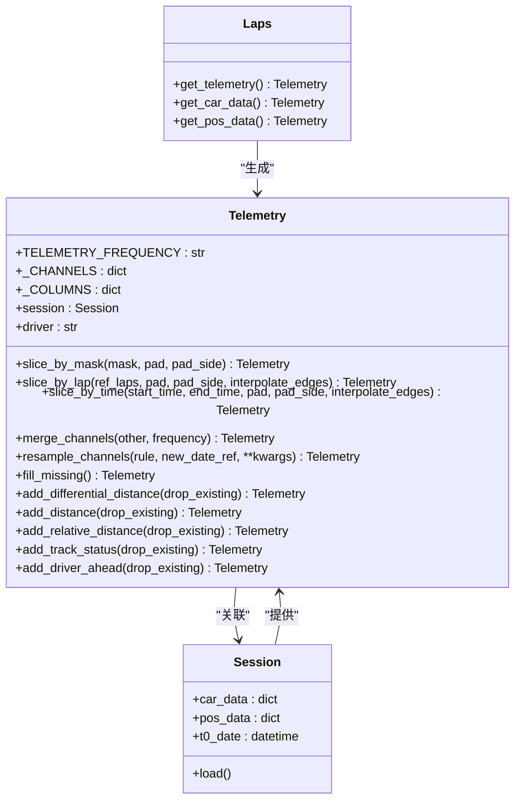

**图表来源**
- [fastf1/core.py:64-148](file://fastf1/core.py#L64-L148)
- [fastf1/core.py:1152-1310](file://fastf1/core.py#L1152-L1310)
- [fastf1/core.py:2730-2970](file://fastf1/core.py#L2730-L2970)

## 详细组件分析

### 数据切片方法

#### slice_by_mask 方法

slice_by_mask 方法允许用户使用布尔数组进行数据切片，支持可选的边界填充功能。

**方法签名与参数**：
- `mask`: 布尔数组，长度必须与数据长度相同
- `pad`: 边界填充样本数量，默认为 0
- `pad_side`: 填充方向，可选值：'both'、'before'、'after'

**实现逻辑**：
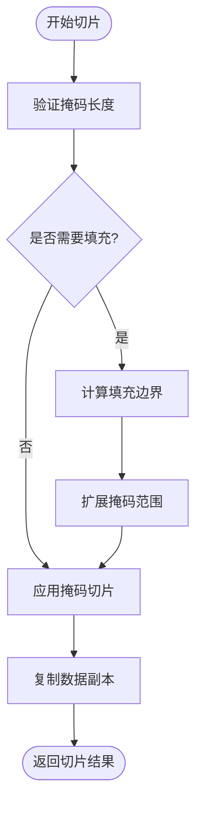

**图表来源**
- [fastf1/core.py:263-289](file://fastf1/core.py#L263-L289)

**章节来源**
- [fastf1/core.py:263-289](file://fastf1/core.py#L263-L289)

#### slice_by_lap 方法

slice_by_lap 方法根据指定的圈数或圈数集合进行数据切片，支持多圈数据的合并。

**方法签名与参数**：
- `ref_laps`: 参考圈数对象（Lap 或 Laps）
- `pad`: 边界填充样本数量，默认为 0
- `pad_side`: 填充方向，默认为 'both'
- `interpolate_edges`: 是否在边界处进行插值，默认为 False

**实现逻辑**：
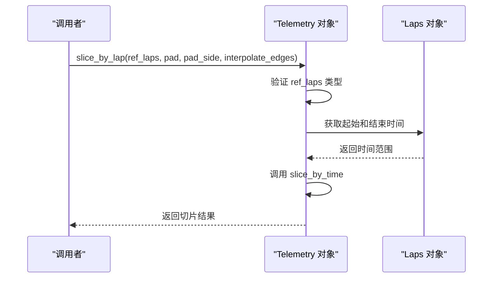

**图表来源**
- [fastf1/core.py:291-340](file://fastf1/core.py#L291-L340)

**章节来源**
- [fastf1/core.py:291-340](file://fastf1/core.py#L291-L340)

#### slice_by_time 方法

slice_by_time 方法根据时间范围进行精确的数据切片，这是最常用的数据筛选方式。

**方法签名与参数**：
- `start_time`: 开始时间（timedelta）
- `end_time`: 结束时间（timedelta）
- `pad`: 边界填充样本数量，默认为 0
- `pad_side`: 填充方向，默认为 'both'
- `interpolate_edges`: 是否在边界处进行插值，默认为 False

**实现逻辑**：
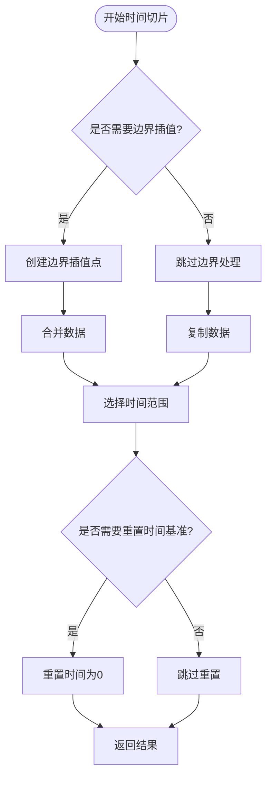

**图表来源**
- [fastf1/core.py:342-389](file://fastf1/core.py#L342-L389)

**章节来源**
- [fastf1/core.py:342-389](file://fastf1/core.py#L342-L389)

### 数据合并功能

#### merge_channels 方法

merge_channels 方法是 Telemetry 类最强大的功能之一，支持将不同来源的数据按时间轴合并。

**方法签名与参数**：
- `other`: 要合并的对象（Telemetry 或 DataFrame）
- `frequency`: 合并频率，默认为 None（使用类默认频率）

**频率设置选项**：
- `'original'`: 使用原始频率，不进行重采样
- `int`: 指定采样频率（Hz）

**实现逻辑**：
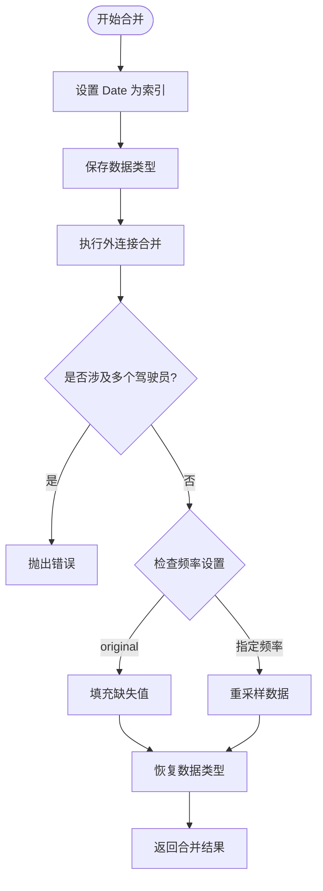

**图表来源**
- [fastf1/core.py:391-569](file://fastf1/core.py#L391-L569)

**章节来源**
- [fastf1/core.py:391-569](file://fastf1/core.py#L391-L569)

### 距离计算方法

#### add_differential_distance 方法

add_differential_distance 方法计算相邻样本之间的距离增量。

**数学原理**：
距离增量 = (Speed/3.6) × ΔTime

其中：
- Speed 以 km/h 为单位
- ΔTime 以秒为单位
- 结果以米为单位

**实现逻辑**：
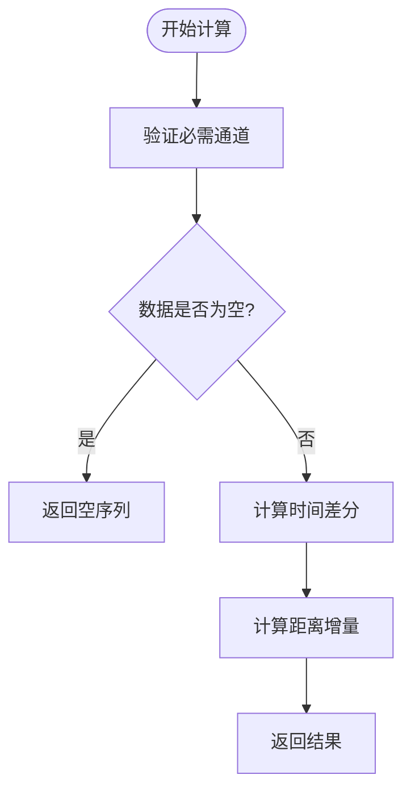

**图表来源**
- [fastf1/core.py:941-953](file://fastf1/core.py#L941-L953)

**章节来源**
- [fastf1/core.py:941-953](file://fastf1/core.py#L941-L953)

#### add_distance 方法

add_distance 方法计算从第一个样本开始累积的距离。

**数学原理**：
累积距离 = Σ(距离增量)

**实现逻辑**：
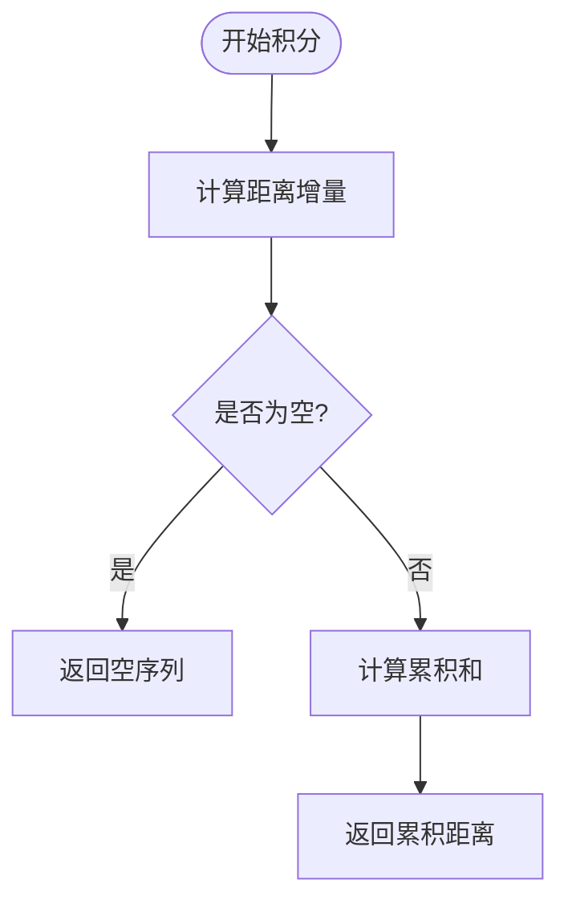

**图表来源**
- [fastf1/core.py:955-969](file://fastf1/core.py#L955-L969)

**章节来源**
- [fastf1/core.py:955-969](file://fastf1/core.py#L955-L969)

#### add_relative_distance 方法

add_relative_distance 方法计算相对距离（0.0 到 1.0 之间）。

**数学原理**：
相对距离 = 当前累积距离 / 最终累积距离

**实现逻辑**：
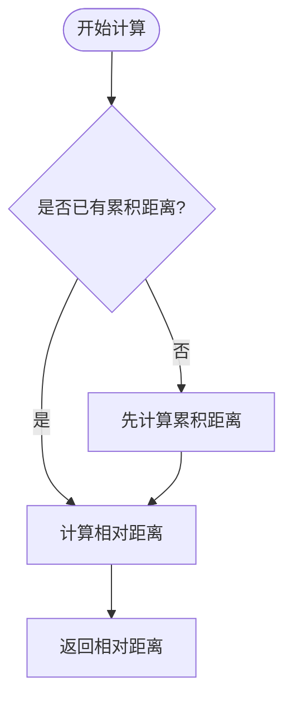

**图表来源**
- [fastf1/core.py:820-826](file://fastf1/core.py#L820-L826)

**章节来源**
- [fastf1/core.py:820-826](file://fastf1/core.py#L820-L826)

### 高级分析功能

#### add_driver_ahead 方法

add_driver_ahead 方法计算当前车辆前方的车辆信息和距离。

**实现复杂度**：
- 时间复杂度：O(n × m)，其中 n 是车辆数量，m 是时间点数量
- 空间复杂度：O(n × m)

**实现逻辑**：
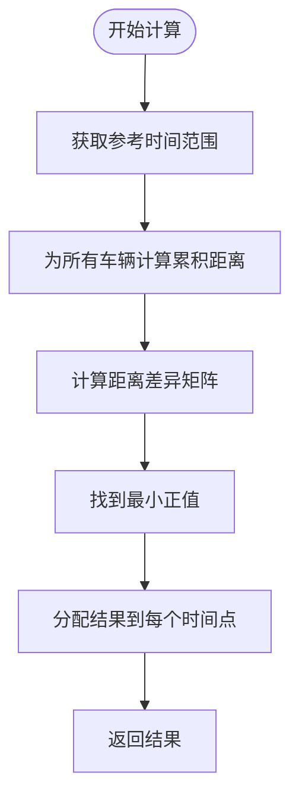

**图表来源**
- [fastf1/core.py:971-1149](file://fastf1/core.py#L971-L1149)

**章节来源**
- [fastf1/core.py:971-1149](file://fastf1/core.py#L971-L1149)

## 依赖关系分析

### 外部依赖

Telemetry 类依赖于以下外部库和模块：

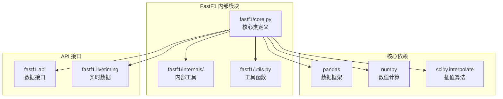

**图表来源**
- [fastf1/core.py:19-38](file://fastf1/core.py#L19-L38)

### 内部依赖关系

Telemetry 类与其他 FastF1 组件的依赖关系：

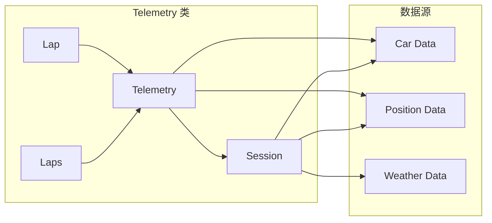

**图表来源**
- [fastf1/core.py:1152-1310](file://fastf1/core.py#L1152-L1310)
- [fastf1/core.py:2730-2970](file://fastf1/core.py#L2730-L2970)

**章节来源**
- [fastf1/core.py:1152-1310](file://fastf1/core.py#L1152-L1310)
- [fastf1/core.py:2730-2970](file://fastf1/core.py#L2730-L2970)

## 性能考虑

### 数据处理优化

1. **内存效率**：
   - 使用向量化操作而非循环
   - 合理的数据类型转换
   - 及时释放不需要的中间结果

2. **计算效率**：
   - 使用 NumPy 的高效数组操作
   - 避免不必要的数据复制
   - 合理使用缓存机制

3. **时间复杂度优化**：
   - 合并操作的时间复杂度为 O(n log n)
   - 距离计算的时间复杂度为 O(n)
   - 驾驶员前方计算的时间复杂度为 O(n × m)

### 内存使用模式

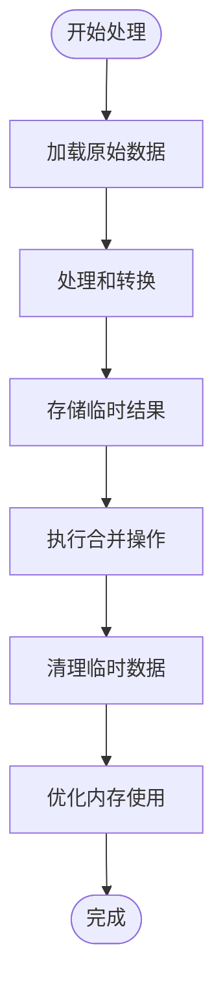

## 故障排除指南

### 常见问题及解决方案

#### 数据类型错误
**问题**：合并后的数据类型不正确
**解决方案**：使用 `restore data types` 功能恢复原始数据类型

#### 插值异常
**问题**：插值过程中出现 NaN 值
**解决方案**：检查数据质量，确保有足够的有效数据点

#### 时间同步问题
**问题**：不同来源的数据时间戳不匹配
**解决方案**：使用 `merge_channels` 方法自动进行时间同步

**章节来源**
- [fastf1/tests/test_telemetry.py:166-221](file://fastf1/tests/test_telemetry.py#L166-L221)

### 单元测试覆盖

测试套件涵盖了以下关键功能：

- 数据切片操作的正确性
- 数据合并的准确性
- 距离计算的数学正确性
- 元数据传播的完整性
- 错误处理和边界条件

**章节来源**
- [fastf1/tests/test_telemetry.py:104-163](file://fastf1/tests/test_telemetry.py#L104-L163)

## 结论

Telemetry 遥测数据类是 FastF1 库中功能最全面的组件之一，它提供了：

1. **完整的数据处理能力**：支持多通道、多来源的遥测数据处理
2. **灵活的数据切片功能**：支持基于掩码、圈数和时间的精确切片
3. **强大的数据合并机制**：能够智能地合并不同来源的数据
4. **丰富的分析工具**：提供距离计算、驾驶员分析等高级功能
5. **良好的性能表现**：通过向量化操作和优化算法确保高效的处理速度

该类的设计充分考虑了 F1 赛车数据的特点，为数据分析和可视化提供了坚实的基础。

## 附录

### 使用示例

#### 基本数据获取和处理

```python
# 获取会话数据
session = fastf1.get_session(2021, 'Spanish Grand Prix', 'Q')
session.load()

# 获取最快圈的数据
lap = session.laps.pick_fastest()
car_data = lap.get_car_data()
pos_data = lap.get_pos_data()

# 合并数据并添加距离信息
merged_data = car_data.merge_channels(pos_data)
merged_data = merged_data.add_distance()
```

#### 高级分析示例

```python
# 计算驾驶员前方信息
lap = session.laps.pick_drivers('VER').pick_fastest()
ver_lap = lap.get_car_data()
ver_lap = ver_lap.add_driver_ahead()

# 创建速度轨迹图
import matplotlib.pyplot as plt
plt.plot(ver_lap['Distance'], ver_lap['Speed'])
plt.xlabel('Distance (m)')
plt.ylabel('Speed (km/h)')
plt.title('Speed Trace')
plt.show()
```

**章节来源**
- [examples/telemetry/plot_speed_traces.py:17-52](file://examples/telemetry/plot_speed_traces.py#L17-L52)
- [examples/telemetry/plot_speed_on_track.py:24-83](file://examples/telemetry/plot_speed_on_track.py#L24-L83)