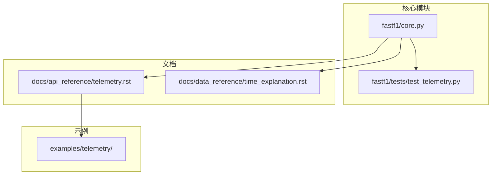
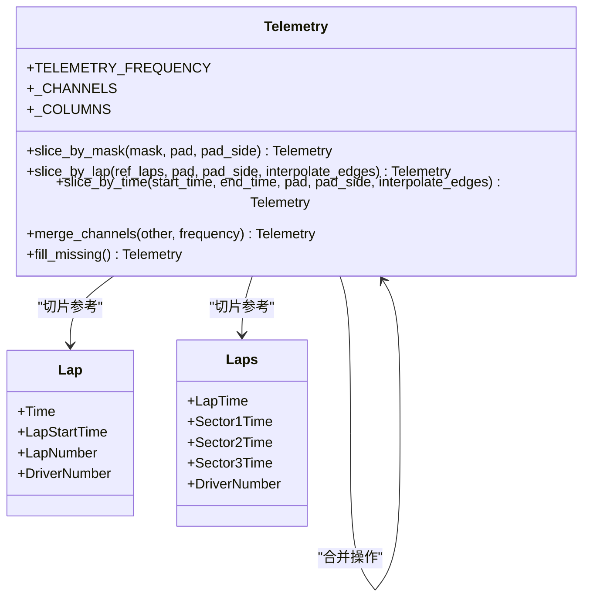
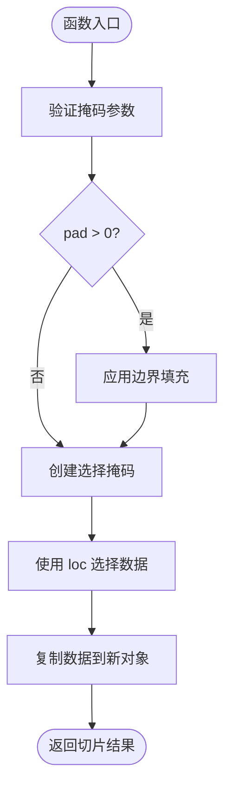
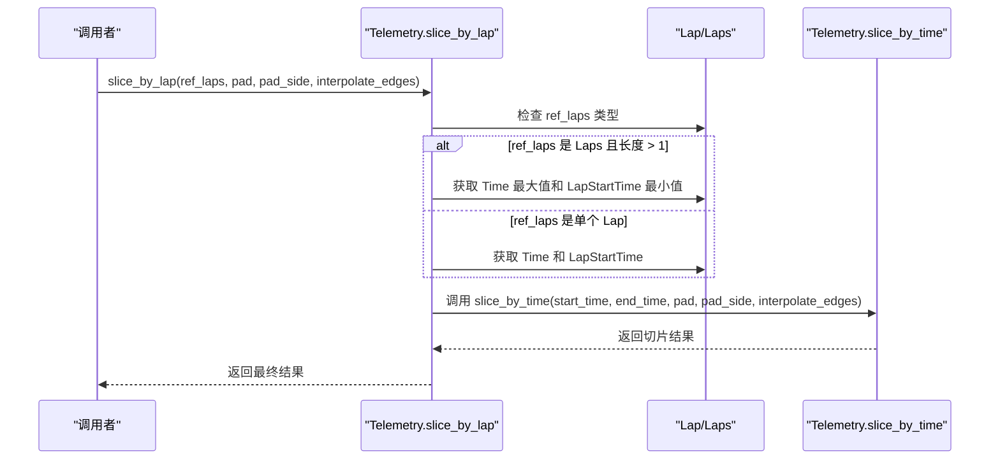
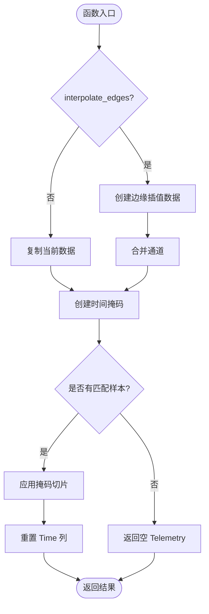
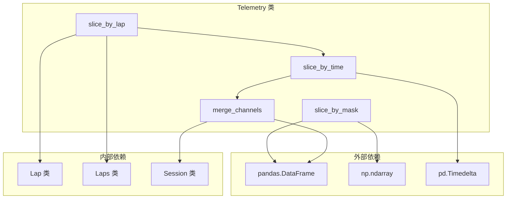

# 数据切片功能

<cite>
**本文引用的文件**
- [core.py](file://fastf1/core.py)
- [test_telemetry.py](file://fastf1/tests/test_telemetry.py)
- [time_explanation.rst](file://docs/data_reference/time_explanation.rst)
- [telemetry.rst](file://docs/api_reference/telemetry.rst)
</cite>

## 目录
1. [简介](#简介)
2. [项目结构](#项目结构)
3. [核心组件](#核心组件)
4. [架构概览](#架构概览)
5. [详细组件分析](#详细组件分析)
6. [依赖关系分析](#依赖关系分析)
7. [性能考虑](#性能考虑)
8. [故障排除指南](#故障排除指南)
9. [结论](#结论)

## 简介

本文档详细介绍了 FastF1 库中 Telemetry 类的数据切片功能。Telemetry 类是 FastF1 的核心组件之一，用于处理赛车遥测数据和位置数据。数据切片功能允许用户根据不同的标准从完整的遥测数据集中提取特定的时间段或圈次数据。

数据切片功能包含三种主要方法：
- `slice_by_mask`：基于布尔掩码进行切片
- `slice_by_lap`：基于圈次进行切片  
- `slice_by_time`：基于时间范围进行切片

这些方法提供了灵活的数据筛选能力，支持边界填充（pad）和边缘插值（interpolate_edges），并正确处理时间列（Time、SessionTime）的影响和重置机制。

## 项目结构

FastF1 项目的结构组织如下：



**图表来源**
- [core.py:64-1149](file://fastf1/core.py#L64-L1149)
- [test_telemetry.py:1-401](file://fastf1/tests/test_telemetry.py#L1-L401)

**章节来源**
- [core.py:64-1149](file://fastf1/core.py#L64-L1149)
- [test_telemetry.py:1-401](file://fastf1/tests/test_telemetry.py#L1-L401)

## 核心组件

Telemetry 类是数据切片功能的核心组件，位于 fastf1/core.py 文件中。该类继承自 BaseDataFrame，专门设计用于处理多通道时间序列遥测数据。

### 主要特性

1. **多通道支持**：可以包含多个遥测通道，如速度、转速、档位、油门、刹车、DRS 等
2. **时间相关列**：包含 Time、SessionTime、Date 三个时间相关列
3. **元数据传播**：支持会话（session）和车手（driver）信息的传播
4. **切片功能**：提供多种切片方法以适应不同的数据筛选需求

### 时间列说明

Telemetry 类包含三个重要的时间相关列：

- **Time**：相对当前数据集第一样本的时间（零点会随着切片而变化）
- **SessionTime**：相对于比赛会话开始的会话时间（零点固定）
- **Date**：UTC 日期时间戳（绝对时间参考）

**章节来源**
- [core.py:64-1149](file://fastf1/core.py#L64-L1149)
- [time_explanation.rst:12-35](file://docs/data_reference/time_explanation.rst#L12-L35)

## 架构概览

数据切片功能的架构设计体现了清晰的方法分层和职责分离：



**图表来源**
- [core.py:263-390](file://fastf1/core.py#L263-L390)
- [core.py:291-340](file://fastf1/core.py#L291-L340)

## 详细组件分析

### slice_by_mask 方法

slice_by_mask 是最基础的切片方法，通过布尔掩码数组来选择数据。

#### 方法签名和参数

```python
def slice_by_mask(
    self,
    mask: list | pd.Series | np.ndarray,
    pad: int = 0,
    pad_side: str = 'both'
) -> "Telemetry":
```

#### 参数说明

- **mask**：布尔数组，长度必须与数据集相同
- **pad**：边界填充的样本数量，默认为 0
- **pad_side**：填充位置，可选值为 'both'、'before'、'after'

#### 实现逻辑



**图表来源**
- [core.py:263-289](file://fastf1/core.py#L263-L289)

#### 边界填充机制

当启用边界填充时，系统会扩展原始掩码的选择范围：

- **pad_side = 'both'**：在前后都添加 pad 个样本
- **pad_side = 'before'**：仅在前面添加 pad 个样本  
- **pad_side = 'after'**：仅在后面添加 pad 个样本

**章节来源**
- [core.py:263-289](file://fastf1/core.py#L263-L289)
- [test_telemetry.py:125-142](file://fastf1/tests/test_telemetry.py#L125-L142)

### slice_by_lap 方法

slice_by_lap 基于指定的圈次或圈次集合进行切片，是最常用的功能。

#### 方法签名和参数

```python
def slice_by_lap(
    self,
    ref_laps: Union["Lap", "Laps"],
    pad: int = 0,
    pad_side: str = 'both',
    interpolate_edges: bool = False
) -> "Telemetry":
```

#### 参数说明

- **ref_laps**：Lap 或 Laps 对象，作为切片参考
- **pad**：边界填充样本数，默认 0
- **pad_side**：填充位置，默认 'both'
- **interpolate_edges**：是否进行边缘插值，默认 False

#### 实现逻辑



**图表来源**
- [core.py:291-340](file://fastf1/core.py#L291-L340)

#### 圈次处理规则

- **多圈次 Laps**：使用第一个和最后一个圈次的起止时间
- **单个 Lap**：使用该圈次的结束时间和开始时间
- **多车 Laps**：必须确保所有圈次属于同一车手

**章节来源**
- [core.py:291-340](file://fastf1/core.py#L291-L340)
- [test_telemetry.py:144-163](file://fastf1/tests/test_telemetry.py#L144-L163)

### slice_by_time 方法

slice_by_time 是最通用的切片方法，基于时间范围进行数据筛选。

#### 方法签名和参数

```python
def slice_by_time(
    self,
    start_time: pd.Timedelta,
    end_time: pd.Timedelta,
    pad: int = 0,
    pad_side: str = 'both',
    interpolate_edges: bool = False
) -> "Telemetry":
```

#### 参数说明

- **start_time**：切片开始时间（Timedelta）
- **end_time**：切片结束时间（Timedelta）
- **pad**：边界填充样本数，默认 0
- **pad_side**：填充位置，默认 'both'
- **interpolate_edges**：是否进行边缘插值，默认 False

#### 实现逻辑



**图表来源**
- [core.py:342-390](file://fastf1/core.py#L342-L390)

#### 边缘插值机制

当 `interpolate_edges` 为 True 时，系统会：
1. 创建包含目标时间窗口的临时 Telemetry 对象
2. 使用 `merge_channels` 方法与原数据合并
3. 在时间边界处插入插值样本
4. 保持 SessionTime 和 Date 的参考点不变

**章节来源**
- [core.py:342-390](file://fastf1/core.py#L342-L390)
- [test_telemetry.py:104-123](file://fastf1/tests/test_telemetry.py#L104-L123)

## 依赖关系分析

数据切片功能的依赖关系体现了模块间的协作：



**图表来源**
- [core.py:263-390](file://fastf1/core.py#L263-L390)
- [core.py:391-569](file://fastf1/core.py#L391-L569)

### 关键依赖关系

1. **pandas.DataFrame**：作为底层数据结构，提供切片和索引功能
2. **numpy.ndarray**：用于高效的布尔数组操作
3. **Lap/Laps 类**：提供圈次时间信息
4. **Session 类**：提供会话级别的元数据和时间参考

**章节来源**
- [core.py:263-390](file://fastf1/core.py#L263-L390)
- [core.py:391-569](file://fastf1/core.py#L391-L569)

## 性能考虑

数据切片功能在设计时充分考虑了性能优化：

### 内存效率

- **惰性求值**：切片操作返回新的 Telemetry 对象，避免修改原始数据
- **按需复制**：只有在需要时才进行数据复制
- **掩码优先**：使用布尔掩码进行高效的数据选择

### 计算复杂度

- **slice_by_mask**：O(n) 时间复杂度，n 为数据长度
- **slice_by_lap**：O(n) + O(k) 时间复杂度，k 为圈次数量
- **slice_by_time**：O(n) 时间复杂度，可能包含额外的边缘插值开销

### 内存优化策略

1. **分块处理**：对于大型数据集，建议分块进行切片操作
2. **就地修改**：在某些情况下可以考虑就地修改以节省内存
3. **数据类型优化**：合理选择数据类型以减少内存占用

## 故障排除指南

### 常见问题和解决方案

#### 1. 缺少 SessionTime 列

**问题**：执行切片操作时报错，提示缺少 SessionTime 列

**原因**：Telemetry 对象未包含 SessionTime 列

**解决方案**：
- 确保从官方 API 加载的数据包含完整的时间信息
- 检查数据源的有效性

#### 2. 多车手数据切片错误

**问题**：尝试对多车手数据进行切片时出现错误

**原因**：Laps 对象包含多个不同的车手编号

**解决方案**：
```python
# 正确的做法
driver_laps = laps.pick_drivers('VER')  # 仅选择一个车手
telemetry.slice_by_lap(driver_laps)
```

#### 3. 时间边界不匹配

**问题**：切片结果的时间边界与预期不符

**原因**：Time 列会根据切片结果重新计算零点

**解决方案**：
- 理解 Time、SessionTime、Date 三者的区别
- 使用 SessionTime 进行跨数据集比较
- 使用 Time 进行同一数据集内的相对比较

**章节来源**
- [test_telemetry.py:104-123](file://fastf1/tests/test_telemetry.py#L104-L123)
- [test_telemetry.py:144-163](file://fastf1/tests/test_telemetry.py#L144-L163)

### 边界条件处理

系统对各种边界条件进行了完善的处理：

1. **空数据集**：返回空的 Telemetry 对象
2. **超出范围的时间**：返回空结果而非异常
3. **无效的填充参数**：自动调整到有效范围内
4. **多车手混合**：严格检查并拒绝不兼容的数据组合

## 结论

FastF1 的 Telemetry 类数据切片功能提供了强大而灵活的数据筛选能力。通过三种主要的切片方法，用户可以根据不同的需求从完整的遥测数据集中提取精确的数据片段。

### 主要优势

1. **多维度切片**：支持基于掩码、圈次和时间范围的切片
2. **灵活的边界处理**：提供边界填充和边缘插值选项
3. **时间列管理**：智能处理 Time、SessionTime、Date 三者的关系
4. **性能优化**：高效的算法实现和内存管理

### 使用建议

1. **选择合适的切片方法**：根据数据特点选择最适合的切片方式
2. **合理设置参数**：根据分析需求调整 pad 和 interpolate_edges 参数
3. **理解时间概念**：正确理解和使用 Time、SessionTime、Date 的区别
4. **注意边界条件**：在处理边缘数据时特别小心

这些功能使得 FastF1 成为了 Formula 1 数据分析的强大工具，为赛车数据分析和可视化提供了坚实的基础。