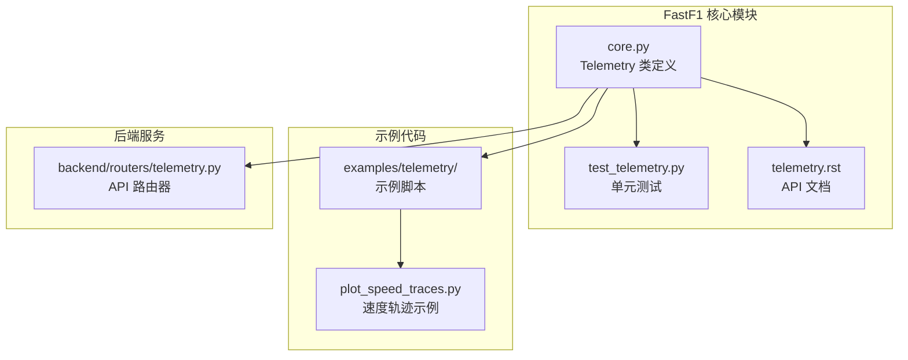
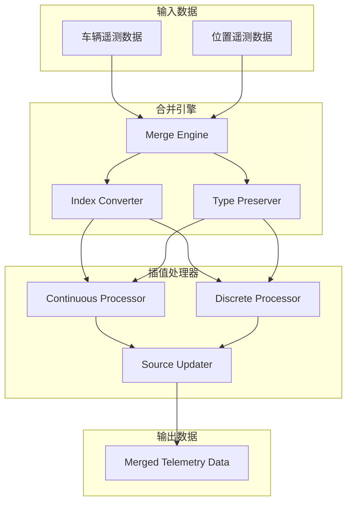
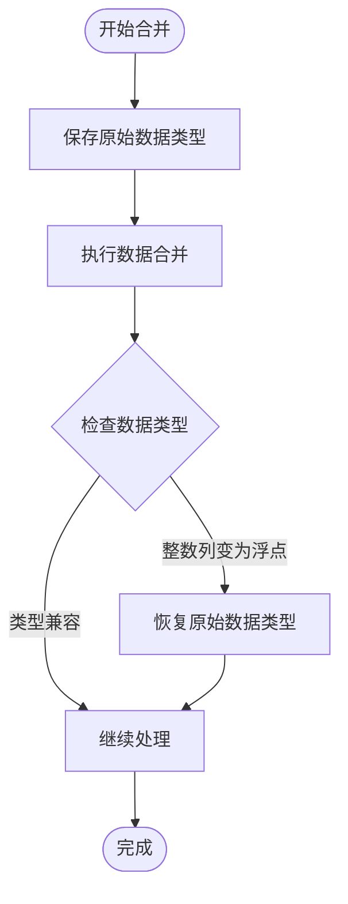
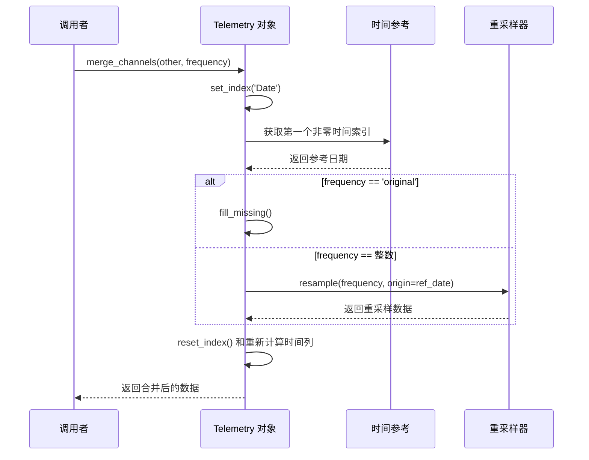
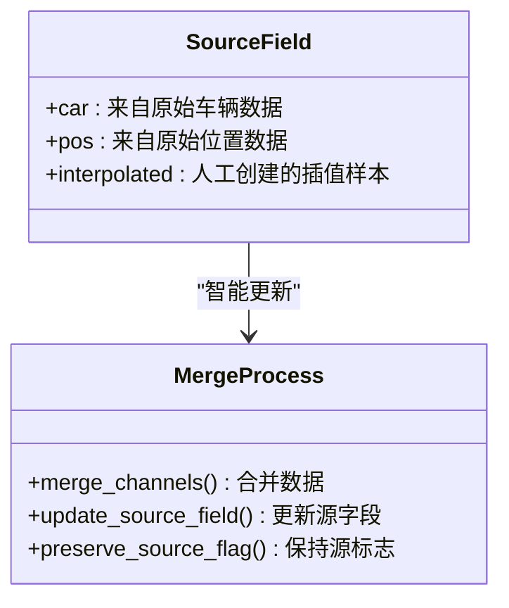
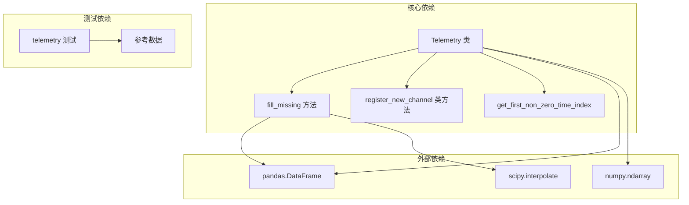

# 数据合并与插值

<cite>
**本文档引用的文件**
- [core.py](file://fastf1/core.py)
- [test_telemetry.py](file://fastf1/tests/test_telemetry.py)
- [telemetry.rst](file://docs/api_reference/telemetry.rst)
- [plot_speed_traces.py](file://examples/telemetry/plot_speed_traces.py)
</cite>

## 目录
1. [简介](#简介)
2. [项目结构](#项目结构)
3. [核心组件](#核心组件)
4. [架构概览](#架构概览)
5. [详细组件分析](#详细组件分析)
6. [依赖关系分析](#依赖关系分析)
7. [性能考虑](#性能考虑)
8. [故障排除指南](#故障排除指南)
9. [结论](#结论)

## 简介

本文档详细介绍了 FastF1 库中 Telemetry 类的数据合并与插值功能。重点解释了 `merge_channels` 方法的合并策略、频率设置选项（'original'、整数频率）和插值算法选择。文档涵盖了不同类型数据通道（连续型：Speed、RPM、Distance；离散型：nGear、DRS、Status）采用的不同插值方法，并详细说明了数据类型保持机制、时间基准对齐和 Source 字段的智能更新。

## 项目结构

FastF1 项目的 Telemetry 功能主要集中在核心模块中，相关文件组织如下：



**图表来源**
- [core.py:63-176](file://fastf1/core.py#L63-L176)
- [test_telemetry.py:1-401](file://fastf1/tests/test_telemetry.py#L1-L401)

**章节来源**
- [core.py:63-176](file://fastf1/core.py#L63-L176)
- [test_telemetry.py:1-401](file://fastf1/tests/test_telemetry.py#L1-L401)

## 核心组件

### Telemetry 类概述

Telemetry 类是 FastF1 库的核心数据结构，用于处理多通道时间序列遥测数据。该类继承自 BaseDataFrame，提供了丰富的遥测数据分析功能。

**关键特性：**
- 多通道时间序列数据管理
- 遥测数据合并与插值
- 时间基准对齐和转换
- 数据类型自动保持
- 源字段智能更新

**章节来源**
- [core.py:63-148](file://fastf1/core.py#L63-L148)

### 已知遥测通道配置

系统预定义了多种遥测通道及其插值方法：

| 通道名称 | 数据类型 | 插值方法 | 描述 |
|---------|---------|---------|------|
| Speed | 连续型 | index | 车辆速度 (km/h) |
| RPM | 连续型 | index | 发动机转速 |
| Throttle | 连续型 | index | 节气门开度 (%) |
| nGear | 离散型 | - | 变速箱档位 |
| Brake | 离散型 | - | 制动状态 |
| DRS | 离散型 | - | DRS 状态 |
| X, Y, Z | 连续型 | quadratic | 位置坐标 (1/10 m) |
| Status | 离散型 | - | 赛道状态 |
| Distance | 连续型 | quadratic | 行驶距离 |
| DriverAhead | 离散型 | - | 前车信息 |

**章节来源**
- [core.py:154-176](file://fastf1/core.py#L154-L176)

## 架构概览

Telemetry 类的数据合并与插值架构采用分层设计，支持灵活的时间基准对齐和数据类型处理：



**图表来源**
- [core.py:391-569](file://fastf1/core.py#L391-L569)

## 详细组件分析

### merge_channels 方法详解

`merge_channels` 是 Telemetry 类的核心方法，负责合并两个具有不同遥测通道的对象。

#### 方法签名与参数

```python
def merge_channels(
    self,
    other: Union["Telemetry", pd.DataFrame],
    frequency: int | Literal['original'] | None = None
):
```

**参数说明：**
- `other`: 要与当前对象合并的 Telemetry 或 DataFrame 对象
- `frequency`: 频率设置选项，默认为 None（使用类默认值）

#### 合并策略

合并过程包含以下关键步骤：

1. **索引转换**: 将两个对象的索引都设置为 'Date' 列
2. **数据类型保存**: 保存合并前的数据类型信息
3. **外连接合并**: 使用外连接合并两个数据集
4. **重复列处理**: 更新重复列的值
5. **频率处理**: 根据频率参数进行相应的处理

#### 频率设置选项

**'original' 频率模式**：
- 不进行重采样
- 保留所有时间戳
- 仅进行插值填补缺失值
- 推荐使用模式

**整数频率模式**：
- 指定采样频率（Hz）
- 重采样到指定频率
- 会产生大量插值值
- 可能影响整体精度

#### 插值算法选择

系统根据通道类型自动选择合适的插值方法：

**连续型通道插值**：
- 支持的方法：'nearest'、'zero'、'slinear'、'quadratic'、'cubic'、'barycentric'、'polynomial'
- 使用 pandas Series.interpolate 方法
- 对于某些方法使用 'extrapolate' 填充值

**离散型通道插值**：
- 使用前向填充（ffill）和后向填充（bfill）
- 通过两次 ffill 和一次 bfill 确保完全填充
- 适用于档位、DRS、制动等状态数据

**章节来源**
- [core.py:391-569](file://fastf1/core.py#L391-L569)
- [core.py:624-690](file://fastf1/core.py#L624-L690)

### 数据类型保持机制

系统实现了智能的数据类型保持机制，确保合并后的数据类型正确性：



**图表来源**
- [core.py:448-456](file://fastf1/core.py#L448-L456)
- [core.py:561-568](file://fastf1/core.py#L561-L568)

#### 类型转换规则

- 整数列在合并过程中可能变为浮点（NaN 值导致）
- 插值完成后尝试恢复原始整数类型
- 类型转换失败时发出警告

**章节来源**
- [core.py:448-456](file://fastf1/core.py#L448-L456)
- [core.py:561-568](file://fastf1/core.py#L561-L568)

### 时间基准对齐

系统提供了灵活的时间基准对齐功能：



**图表来源**
- [core.py:444-491](file://fastf1/core.py#L444-L491)
- [core.py:555-559](file://fastf1/core.py#L555-L559)

#### 时间列重新计算

合并完成后，系统会自动重新计算以下时间列：
- `SessionTime`: 自会话开始的时间
- `Time`: 自切片开始的时间
- `Date`: 完整的日期时间戳

**章节来源**
- [core.py:555-559](file://fastf1/core.py#L555-L559)

### Source 字段智能更新

Source 字段用于标识数据样本的来源，系统会在合并过程中智能更新这些标记：



**图表来源**
- [core.py:99-117](file://fastf1/core.py#L99-L117)

#### 源字段更新规则

- 原始样本保持其原有源标记
- 插值生成的样本标记为 'interpolated'
- 重采样过程中的新样本标记为 'interpolation'

**章节来源**
- [core.py:99-117](file://fastf1/core.py#L99-L117)
- [core.py:543-547](file://fastf1/core.py#L543-L547)

## 依赖关系分析

### 内部依赖关系

Telemetry 类的合并功能涉及多个内部组件的协作：



**图表来源**
- [core.py:624-723](file://fastf1/core.py#L624-L723)
- [test_telemetry.py:66-91](file://fastf1/tests/test_telemetry.py#L66-L91)

### 外部依赖

系统主要依赖以下外部库：

- **pandas**: 提供 DataFrame 操作和时间序列处理
- **numpy**: 提供数值计算支持
- **scipy**: 提供高级插值算法支持

**章节来源**
- [core.py:16-38](file://fastf1/core.py#L16-L38)
- [test_telemetry.py:1-12](file://fastf1/tests/test_telemetry.py#L1-L12)

## 性能考虑

### 插值算法性能

不同的插值方法具有不同的性能特征：

**连续型插值性能对比**：
- `quadratic` 和 `cubic`: 计算复杂度较高，适合平滑曲线
- `index`: 线性插值，性能最佳
- `nearest`: 最简单的插值方法，性能最优

**离散型插值性能**：
- 前向填充和后向填充：O(n) 复杂度，性能优异
- 适用于状态数据的快速处理

### 内存使用优化

- 数据类型保存机制避免不必要的内存浪费
- 智能类型恢复减少数据转换开销
- 外连接合并优化减少重复数据存储

## 故障排除指南

### 常见问题及解决方案

**问题1：合并后出现 NaN 值**
- 检查两个数据集的时间基准是否对齐
- 确认频率设置是否合适
- 验证通道类型配置是否正确

**问题2：数据类型丢失**
- 检查数据类型保存机制是否正常工作
- 确认插值后类型恢复逻辑
- 验证数据转换警告信息

**问题3：Source 字段异常**
- 检查源字段更新逻辑
- 验证重采样过程中的字段处理
- 确认插值操作的字段标记

**章节来源**
- [test_telemetry.py:165-221](file://fastf1/tests/test_telemetry.py#L165-L221)
- [core.py:561-568](file://fastf1/core.py#L561-L568)

### 单元测试验证

系统提供了全面的单元测试来验证合并功能的正确性：

- **元数据传播测试**: 确保合并后元数据正确传递
- **数据类型测试**: 验证合并后的数据类型保持
- **频率转换测试**: 测试不同频率设置下的行为
- **缺失值处理测试**: 验证插值算法的有效性

**章节来源**
- [test_telemetry.py:66-91](file://fastf1/tests/test_telemetry.py#L66-L91)
- [test_telemetry.py:165-221](file://fastf1/tests/test_telemetry.py#L165-L221)

## 结论

FastF1 的 Telemetry 类提供了强大而灵活的数据合并与插值功能。通过智能的频率处理、精确的插值算法选择和完善的类型保持机制，系统能够高效地处理复杂的遥测数据合并需求。

**主要优势**：
- 支持多种频率设置选项
- 自动选择合适的插值算法
- 保持数据类型完整性
- 智能的时间基准对齐
- 完善的错误处理和警告机制

**最佳实践建议**：
- 优先使用 'original' 频率模式
- 避免多次重采样操作
- 正确配置自定义通道
- 注意数据类型转换的影响