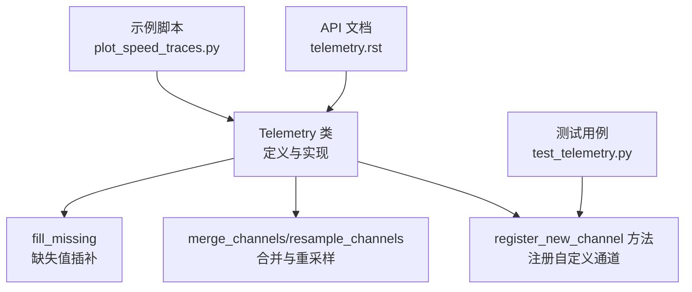
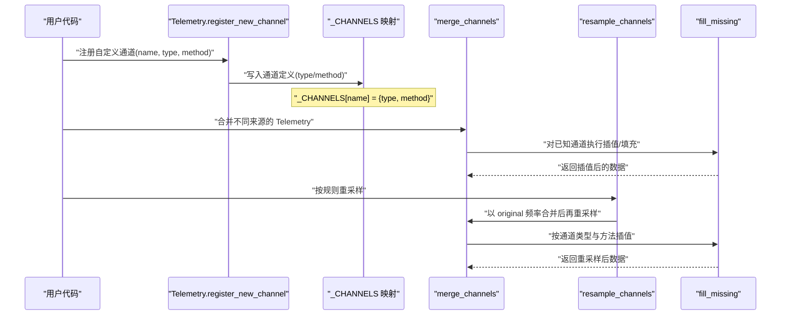
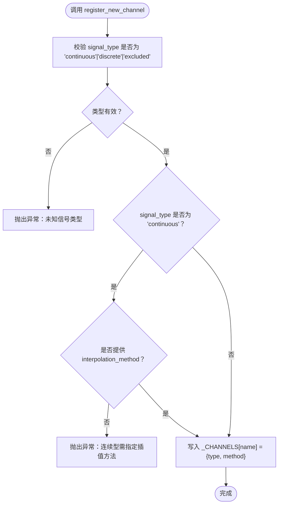
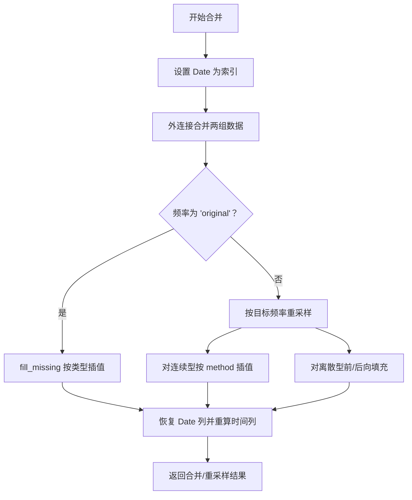
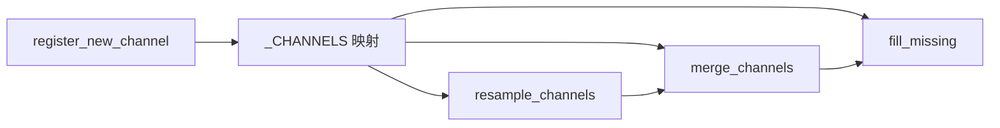

# 自定义通道注册

<cite>
**本文引用的文件**
- [core.py](file://fastf1/core.py)
- [test_telemetry.py](file://fastf1/tests/test_telemetry.py)
- [telemetry.rst](file://docs/api_reference/telemetry.rst)
- [plot_speed_traces.py](file://examples/telemetry/plot_speed_traces.py)
</cite>

## 目录
1. [简介](#简介)
2. [项目结构](#项目结构)
3. [核心组件](#核心组件)
4. [架构总览](#架构总览)
5. [详细组件分析](#详细组件分析)
6. [依赖关系分析](#依赖关系分析)
7. [性能考量](#性能考量)
8. [故障排查指南](#故障排查指南)
9. [结论](#结论)
10. [附录](#附录)

## 简介
本文件聚焦于 Telemetry 类的自定义通道注册能力，围绕 register_new_channel 方法展开，系统性阐述以下主题：
- 注册新通道的使用方式与参数约束
- 信号类型定义：连续型、离散型、排除型
- 插值方法配置与默认策略
- 数据类型映射与列类型声明
- 错误处理机制与边界条件
- 在数据分析中的实际应用：派生指标、自定义计算字段、第三方数据集成
- 与内置通道的兼容性及性能注意事项

## 项目结构
与自定义通道注册直接相关的代码位于 fastf1/core.py 中的 Telemetry 类，配套测试位于 fastf1/tests/test_telemetry.py，API 参考文档位于 docs/api_reference/telemetry.rst；示例位于 examples/telemetry/plot_speed_traces.py 展示了典型的数据分析流程。



**图表来源**
- [core.py:692-723](file://fastf1/core.py#L692-L723)
- [test_telemetry.py:223-241](file://fastf1/tests/test_telemetry.py#L223-L241)
- [telemetry.rst:1-13](file://docs/api_reference/telemetry.rst#L1-L13)
- [plot_speed_traces.py:1-53](file://examples/telemetry/plot_speed_traces.py#L1-L53)

**章节来源**
- [core.py:692-723](file://fastf1/core.py#L692-L723)
- [test_telemetry.py:223-241](file://fastf1/tests/test_telemetry.py#L223-L241)
- [telemetry.rst:1-13](file://docs/api_reference/telemetry.rst#L1-L13)
- [plot_speed_traces.py:1-53](file://examples/telemetry/plot_speed_traces.py#L1-L53)

## 核心组件
- Telemetry 类：多通道时间序列遥测数据容器，支持合并、重采样、插值等操作。
- register_new_channel：类方法，用于向 _CHANNELS 映射注册新的自定义通道及其插值策略。
- 内置通道映射 _CHANNELS：包含默认通道的类型与插值方法，决定合并/重采样时的处理逻辑。
- 合并与重采样：merge_channels/resample_channels 会依据 _CHANNELS 的类型与方法进行插值或前向填充。
- 缺失值处理：fill_missing 对已知通道执行插值或前向填充，并更新时间列与 Source 标记。

**章节来源**
- [core.py:154-176](file://fastf1/core.py#L154-L176)
- [core.py:692-723](file://fastf1/core.py#L692-L723)
- [core.py:420-619](file://fastf1/core.py#L420-L619)
- [core.py:624-690](file://fastf1/core.py#L624-L690)

## 架构总览
下图展示了自定义通道注册在 Telemetry 生命周期中的作用点，以及与合并/重采样的交互关系。



**图表来源**
- [core.py:692-723](file://fastf1/core.py#L692-L723)
- [core.py:420-619](file://fastf1/core.py#L420-L619)
- [core.py:624-690](file://fastf1/core.py#L624-L690)

## 详细组件分析

### register_new_channel 方法详解
- 功能：向 Telemetry._CHANNELS 注册新的通道定义，使其在合并/重采样时自动参与插值或前向填充。
- 参数：
  - name：通道名称（字符串）
  - signal_type：信号类型，必须为 'continuous'、'discrete' 或 'excluded'
  - interpolation_method：当 signal_type='continuous' 时必填，指定插值方法（参考 pandas.Series.interpolate 支持的方法）
- 行为与约束：
  - 不合法的 signal_type 将抛出异常
  - 当 signal_type='continuous' 且 interpolation_method 为空时抛出异常
  - 成功后将 name 映射到 {type: signal_type, method: interpolation_method}



**图表来源**
- [core.py:692-723](file://fastf1/core.py#L692-L723)

**章节来源**
- [core.py:692-723](file://fastf1/core.py#L692-L723)

### 信号类型与插值策略
- 连续型（continuous）
  - 特征：数值随时间连续变化，适合线性/样条等插值
  - 默认策略：部分内置通道采用 'index' 或 'quadratic' 插值
  - 使用场景：速度、转速、距离、加速度等
- 离散型（discrete）
  - 特征：状态/标志类变量，通常保持不变直到下一个采样点
  - 默认策略：前向填充（ffill）+ 后向填充（bfill），确保无 NaN
  - 使用场景：档位、刹车、DRS、车号等
- 排除型（excluded）
  - 特征：不参与重采样/插值，作为特殊处理列存在
  - 典型列：Source、Date、Time、SessionTime 等
  - 用途：索引或时间基准，或需要自定义处理的列

```mermaid
classDiagram
class Telemetry_CHANNELS {
"+X" : "continuous/quadratic"
"+Y" : "continuous/quadratic"
"+Z" : "continuous/quadratic"
"+Speed" : "continuous/index"
"+RPM" : "continuous/index"
"+Throttle" : "continuous/index"
"+nGear" : "discrete"
"+Brake" : "discrete"
"+DRS" : "discrete"
"+Source" : "excluded"
"+Date" : "excluded"
"+Time" : "excluded"
"+SessionTime" : "excluded"
}
```

**图表来源**
- [core.py:154-176](file://fastf1/core.py#L154-L176)

**章节来源**
- [core.py:154-176](file://fastf1/core.py#L154-L176)

### 数据类型映射与列类型声明
- 列类型映射（_COLUMNS）：定义各通道的 NumPy/Pandas 数据类型，用于初始化与类型恢复
- 常见类型：
  - 浮点数：Speed、RPM、Throttle、Distance、RelativeDistance、DistanceToDriverAhead
  - 整数：nGear、DriverAhead
  - 布尔：Brake
  - 字符串：Status、Source
  - 时间：Date（datetime64[ns]）、Time、SessionTime（timedelta64[ns]）
- 影响：在合并/重采样后尝试恢复原始类型，若失败则发出警告

**章节来源**
- [core.py:179-199](file://fastf1/core.py#L179-L199)
- [core.py:561-568](file://fastf1/core.py#L561-L568)

### 合并与重采样中的插值流程
- 合并（merge_channels）
  - 将两个对象按 Date 索引合并，保留各自时间戳
  - 若频率为 'original'：仅执行 fill_missing 插值
  - 若频率为整数 Hz：先按频率重采样，再插值
- 重采样（resample_channels）
  - 提供两种方式：基于规则（rule）或自定义日期序列（new_date_ref）
  - 实际通过 merge_channels 以 'original' 频率合并后再重采样，避免多次重采样导致精度损失



**图表来源**
- [core.py:444-569](file://fastf1/core.py#L444-L569)

**章节来源**
- [core.py:420-619](file://fastf1/core.py#L420-L619)

### 缺失值处理（fill_missing）
- 遍历 _CHANNELS 中存在的列
- 连续型：根据 method 选择插值策略（如 nearest、zero、slinear、quadratic、cubic、barycentric、polynomial、pad、backfill、ffill、bfill 或带方向限制的插值）
- 离散型：两次 ffill + 一次 bfill，确保既有合并产生的 NaN 也被填充
- 更新 Source 列为 'interpolation'，并重新计算 SessionTime 与 Time

**章节来源**
- [core.py:624-690](file://fastf1/core.py#L624-L690)

### 错误处理机制
- 注册阶段：
  - 非法 signal_type：抛出异常
  - 连续型未提供插值方法：抛出异常
- 合并/重采样阶段：
  - 无法找到有效时间索引：抛出异常（无法重采样）
  - 多个驾驶员混合：抛出异常（不允许合并多车数据）
  - 类型恢复失败：记录警告（保留原列类型）

**章节来源**
- [core.py:716-720](file://fastf1/core.py#L716-L720)
- [core.py:470-478](file://fastf1/core.py#L470-L478)
- [core.py:565-567](file://fastf1/core.py#L565-L567)

### 实际应用示例与最佳实践
- 添加派生指标
  - 示例：在示例脚本中对速度轨迹进行对比分析前，先为每条赛道添加 Distance 列，便于横向比较
  - 实践：使用 add_distance 或 add_relative_distance 计算累计/相对距离
- 自定义计算字段
  - 场景：第三方传感器数据（如加速度、温度）接入遥测
  - 步骤：register_new_channel 注册新通道，指定 signal_type 与 interpolation_method，随后在数据中加入该列
- 第三方数据集成
  - 场景：外部数据源与官方遥测在时间维度对齐
  - 步骤：将第三方数据转换为 Telemetry 对象，统一 Date 索引后通过 merge_channels 与 fill_missing 完成插值
- 兼容性与性能
  - 兼容性：自定义通道遵循与内置通道相同的插值与填充策略，保证合并/重采样一致性
  - 性能：优先使用 'original' 频率合并，避免重复重采样；连续型插值建议谨慎选择方法，避免过拟合

**章节来源**
- [plot_speed_traces.py:28-33](file://examples/telemetry/plot_speed_traces.py#L28-L33)
- [test_telemetry.py:223-241](file://fastf1/tests/test_telemetry.py#L223-L241)

## 依赖关系分析
- register_new_channel 依赖 _CHANNELS 映射与 Telemetry 的合并/重采样逻辑
- merge_channels 与 resample_channels 依赖 _CHANNELS 的类型与方法
- fill_missing 依赖 _CHANNELS 的类型与方法，并依赖 Pandas 的插值与填充接口



**图表来源**
- [core.py:692-723](file://fastf1/core.py#L692-L723)
- [core.py:420-619](file://fastf1/core.py#L420-L619)
- [core.py:624-690](file://fastf1/core.py#L624-L690)

**章节来源**
- [core.py:420-619](file://fastf1/core.py#L420-L619)
- [core.py:624-690](file://fastf1/core.py#L624-L690)
- [core.py:692-723](file://fastf1/core.py#L692-L723)

## 性能考量
- 避免重复重采样：始终基于原始数据进行重采样，减少误差累积
- 插值方法选择：连续型插值方法过多可能导致过拟合或计算开销增加，应结合数据特性选择合适方法
- 类型恢复：合并后尝试恢复类型，失败时发出警告，必要时手动修正类型以提升性能与内存占用
- 并行与缓存：在批量处理多个通道时，可考虑分批注册与处理，减少中间对象的创建

## 故障排查指南
- 注册时报错“未知信号类型”
  - 检查 signal_type 是否为 'continuous'、'discrete' 或 'excluded'
- 注册时报错“连续型需指定插值方法”
  - 为 interpolation_method 提供合法值（参考 pandas.Series.interpolate 支持的方法）
- 合并时报错“无法找到有效时间索引”
  - 确保数据包含有效的 Date/Time 列，并至少有一个非零时间样本
- 合并时报错“不能合并多个驾驶员”
  - 确保合并对象来自同一驾驶员
- 类型恢复失败
  - 观察警告信息，必要时手动转换列类型或检查数据质量

**章节来源**
- [core.py:716-720](file://fastf1/core.py#L716-L720)
- [core.py:470-478](file://fastf1/core.py#L470-L478)
- [core.py:565-567](file://fastf1/core.py#L565-L567)

## 结论
通过 register_new_channel，用户可以安全地扩展 Telemetry 的通道体系，使其与内置通道共享一致的插值与填充策略。正确选择信号类型与插值方法，有助于在合并与重采样过程中获得更准确、更稳定的分析结果。配合示例与测试用例，可在实际项目中快速落地自定义通道的注册与应用。

## 附录
- API 参考：Telemetry 类与相关方法的官方文档入口
- 示例：展示在实际分析中如何利用自定义通道与内置派生指标进行可视化与对比

**章节来源**
- [telemetry.rst:1-13](file://docs/api_reference/telemetry.rst#L1-L13)
- [plot_speed_traces.py:1-53](file://examples/telemetry/plot_speed_traces.py#L1-L53)