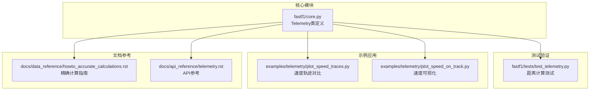
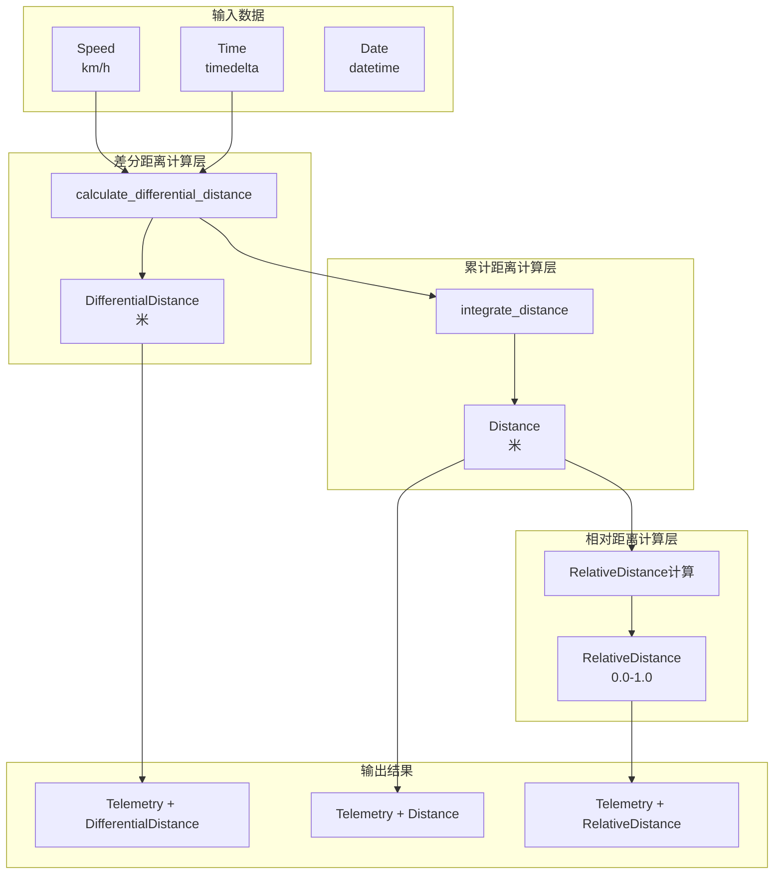
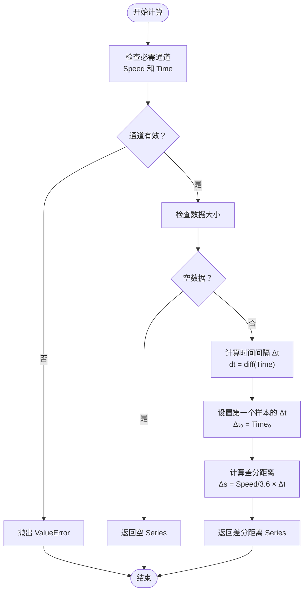
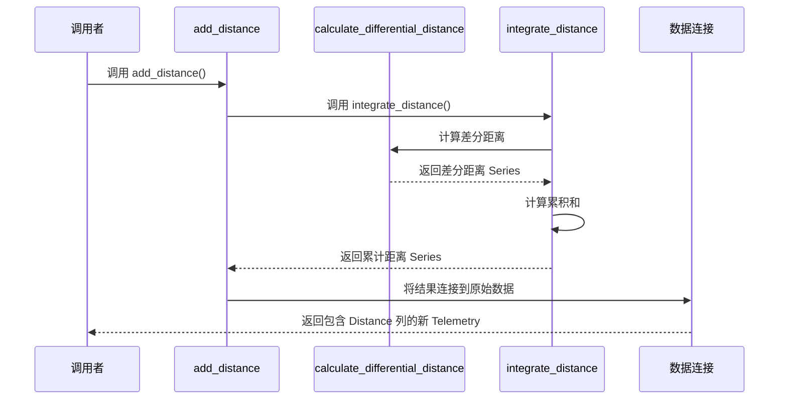
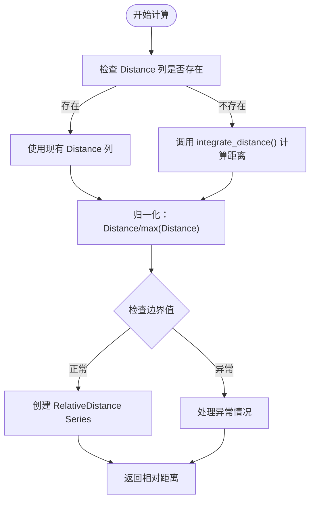
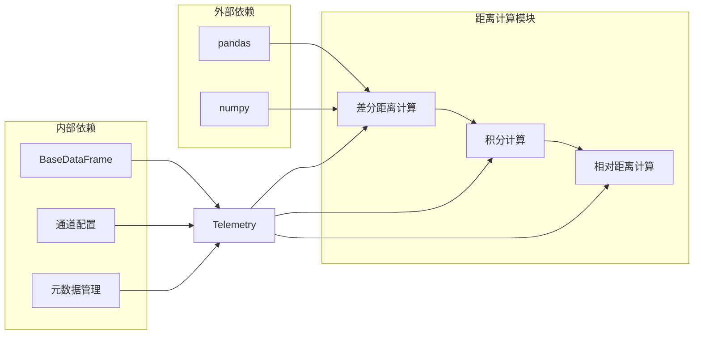
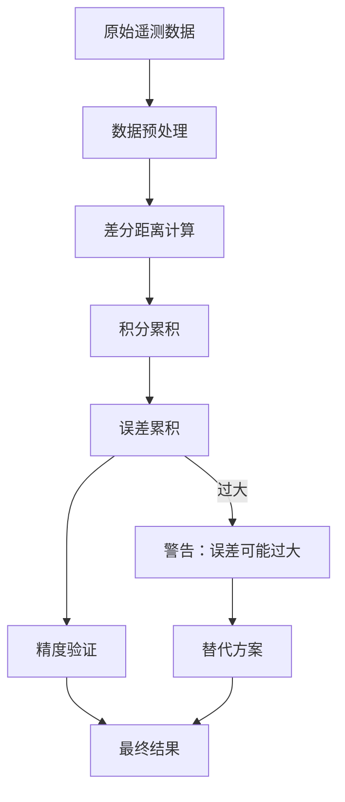

# 距离计算方法

<cite>
**本文档引用的文件**
- [fastf1/core.py](file://fastf1/core.py)
- [fastf1/tests/test_telemetry.py](file://fastf1/tests/test_telemetry.py)
- [examples/telemetry/plot_speed_traces.py](file://examples/telemetry/plot_speed_traces.py)
- [examples/telemetry/plot_speed_on_track.py](file://examples/telemetry/plot_speed_on_track.py)
- [docs/data_reference/howto_accurate_calculations.rst](file://docs/data_reference/howto_accurate_calculations.rst)
- [docs/api_reference/telemetry.rst](file://docs/api_reference/telemetry.rst)
</cite>

## 目录
1. [简介](#简介)
2. [项目结构](#项目结构)
3. [核心组件](#核心组件)
4. [架构概览](#架构概览)
5. [详细组件分析](#详细组件分析)
6. [依赖关系分析](#依赖关系分析)
7. [性能考虑](#性能考虑)
8. [故障排除指南](#故障排除指南)
9. [结论](#结论)
10. [附录](#附录)

## 简介

本文档深入解析 FastF1 库中 Telemetry 类的距离计算功能，重点涵盖三个核心方法：`add_differential_distance`（差分距离计算）、`add_distance`（累计距离计算）和 `add_relative_distance`（相对距离计算）。我们将详细阐述这些方法的数学原理、实现细节以及底层计算方法 `calculate_differential_distance`、`integrate_distance` 和 `calculate_relative_distance` 的算法逻辑。

距离计算在 F1 数据分析中具有重要意义，它能够帮助分析师理解赛车在单圈或整个比赛中的行驶轨迹、速度变化与位置关系。本文将提供最佳实践指导，包括距离单位换算、积分误差累积控制以及单圈数据处理策略，并给出实际应用场景和代码示例路径。

## 项目结构

FastF1 项目的 Telemetry 距离计算功能主要集中在核心模块中，同时通过测试用例和示例代码验证其正确性和实用性。



**图表来源**
- [fastf1/core.py:64-1149](file://fastf1/core.py#L64-L1149)
- [fastf1/tests/test_telemetry.py:1-401](file://fastf1/tests/test_telemetry.py#L1-L401)

**章节来源**
- [fastf1/core.py:64-1149](file://fastf1/core.py#L64-L1149)
- [fastf1/tests/test_telemetry.py:1-401](file://fastf1/tests/test_telemetry.py#L1-L401)

## 核心组件

### Telemetry 类概述

Telemetry 类是 FastF1 中多通道时间序列遥测数据的核心容器，支持多种遥测通道的合并、切片和计算扩展。该类继承自 BaseDataFrame，提供了丰富的数据分析功能。

关键特性包括：
- 多遥测通道支持（车数据、位置数据）
- 遥测数据的合并与插值
- 时间切片和重采样功能
- 计算扩展方法（距离、相对距离等）

**章节来源**
- [fastf1/core.py:64-149](file://fastf1/core.py#L64-L149)

### 距离计算相关通道

Telemetry 类预定义了以下距离相关的遥测通道：

| 通道名称 | 数据类型 | 插值方法 | 描述 |
|---------|---------|---------|------|
| Distance | float64 | quadratic | 自第一个样本以来行驶的总距离（米） |
| RelativeDistance | float64 | quadratic | 相对距离（0.0 到 1.0） |
| DifferentialDistance | float64 | quadratic | 相邻样本间的距离（米） |

**章节来源**
- [fastf1/core.py:154-176](file://fastf1/core.py#L154-L176)
- [fastf1/core.py:194-196](file://fastf1/core.py#L194-L196)

## 架构概览

Telemetry 类的距离计算功能采用分层架构设计，从底层的差分距离计算到上层的累计距离和相对距离计算形成了完整的数据处理链路。



**图表来源**
- [fastf1/core.py:738-826](file://fastf1/core.py#L738-L826)
- [fastf1/core.py:941-969](file://fastf1/core.py#L941-L969)

## 详细组件分析

### add_differential_distance 方法

`add_differential_distance` 方法负责计算相邻遥测样本之间的行驶距离，是所有距离计算的基础。

#### 数学原理

差分距离的计算基于以下公式：
```
Δs = v × Δt
```

其中：
- Δs = 差分距离（米）
- v = 当前时刻速度（km/h）
- Δt = 时间间隔（秒）

需要注意的是，速度单位从 km/h 转换为 m/s 需要除以 3.6。

#### 实现细节



**图表来源**
- [fastf1/core.py:941-953](file://fastf1/core.py#L941-L953)

#### 错误处理

该方法包含严格的输入验证：
- 必需通道检查：确保存在 'Speed' 和 'Time' 通道
- 空数据处理：避免对空数据进行计算
- 异常处理：当输入不满足要求时抛出明确的错误信息

**章节来源**
- [fastf1/core.py:738-765](file://fastf1/core.py#L738-L765)
- [fastf1/core.py:941-953](file://fastf1/core.py#L941-L953)

### add_distance 方法

`add_distance` 方法通过积分差分距离来计算自第一个样本以来的累计行驶距离。

#### 算法逻辑

累计距离的计算采用累积求和的方式：
```
S(t) = ∫₀ᵗ v(τ)dτ ≈ Σᵢ₌₁ⁿ Δsᵢ
```

其中：
- S(t) = 时间 t 的累计距离
- v(τ) = 时刻 τ 的瞬时速度
- Δsᵢ = 第 i 个样本的差分距离

#### 实现特点



**图表来源**
- [fastf1/core.py:767-794](file://fastf1/core.py#L767-L794)
- [fastf1/core.py:955-969](file://fastf1/core.py#L955-L969)

#### 性能考虑

- **积分误差累积**：由于数值积分的特性，长时间跨度的数据会出现误差累积
- **适用范围限制**：建议仅用于单圈或少数几圈的数据
- **内存效率**：使用向量化操作提高计算效率

**章节来源**
- [fastf1/core.py:767-794](file://fastf1/core.py#L767-L794)
- [fastf1/core.py:955-969](file://fastf1/core.py#L955-L969)

### add_relative_distance 方法

`add_relative_distance` 方法计算相对距离，将累计距离归一化到 0.0 到 1.0 的范围内。

#### 计算原理

相对距离的计算公式：
```
r(t) = S(t) / S(T)
```

其中：
- r(t) = 相对距离
- S(t) = 时间 t 的累计距离
- S(T) = 整个数据段的最大累计距离

#### 实现策略



**图表来源**
- [fastf1/core.py:796-826](file://fastf1/core.py#L796-L826)

#### 边界条件处理

- **最小值约束**：相对距离的最小值为 0.0（起始点）
- **最大值约束**：相对距离的最大值为 1.0（终点）
- **空数据处理**：对空数据返回适当的默认值

**章节来源**
- [fastf1/core.py:796-826](file://fastf1/core.py#L796-L826)

### 底层计算方法详解

#### calculate_differential_distance 方法

这是距离计算的核心底层方法，负责将速度和时间数据转换为物理距离。

**输入要求**：
- 必须包含 'Speed' 和 'Time' 两个通道
- 'Speed' 通道必须为数值型（km/h）
- 'Time' 通道必须为时间增量（timedelta）

**输出特征**：
- 单位：米（m）
- 数据类型：pandas Series
- 长度：与输入数据相同

**精度考虑**：
- 使用向量化操作提高计算效率
- 精确处理第一个样本的时间间隔
- 支持空数据的安全处理

**章节来源**
- [fastf1/core.py:941-953](file://fastf1/core.py#L941-L953)

#### integrate_distance 方法

该方法通过累积求和的方式计算累计距离，是 add_distance 方法的底层实现。

**算法步骤**：
1. 调用 `calculate_differential_distance()` 获取差分距离
2. 对差分距离进行累积求和
3. 返回累计距离 Series

**数学表达**：
```
S(n) = Σᵢ₌₁ⁿ Δsᵢ
```

**注意事项**：
- 积分误差会随数据长度线性累积
- 建议仅用于短时间跨度的数据
- 对于长距离分析，应考虑使用更精确的方法

**章节来源**
- [fastf1/core.py:955-969](file://fastf1/core.py#L955-L969)

#### calculate_relative_distance 方法

虽然 Telemetry 类中没有直接名为 `calculate_relative_distance` 的方法，但相对距离的计算逻辑体现在 `add_relative_distance` 方法中。

**计算流程**：
1. 检查是否已存在 'Distance' 列
2. 如果不存在，则调用 `integrate_distance()` 计算距离
3. 将距离值除以其最大值进行归一化
4. 返回相对距离 Series

**质量保证**：
- 确保相对距离在 [0, 1] 区间内
- 处理除零异常的情况
- 维护数据的完整性

**章节来源**
- [fastf1/core.py:820-825](file://fastf1/core.py#L820-L825)

## 依赖关系分析

Telemetry 类的距离计算功能具有清晰的依赖关系，形成了从底层到上层的完整处理链。



**图表来源**
- [fastf1/core.py:64-200](file://fastf1/core.py#L64-L200)

### 内部耦合度分析

- **高内聚性**：距离计算相关的所有方法都集中在 Telemetry 类中
- **低耦合性**：各计算方法相互独立，便于测试和维护
- **接口一致性**：所有距离计算方法遵循相同的参数约定和返回格式

### 外部依赖管理

- **pandas 依赖**：大量使用 pandas DataFrame 和 Series 功能
- **numpy 依赖**：用于数值计算和数组操作
- **类型注解**：提供完整的类型信息，便于静态分析

**章节来源**
- [fastf1/core.py:64-200](file://fastf1/core.py#L64-L200)

## 性能考虑

### 计算复杂度

距离计算方法的时间复杂度均为 O(n)，其中 n 是数据点的数量。空间复杂度同样为 O(n)，主要用于存储中间结果。

### 优化策略

1. **向量化操作**：充分利用 pandas 和 numpy 的向量化特性
2. **内存管理**：合理使用数据类型，减少内存占用
3. **批处理**：对于大数据集，考虑分批处理策略

### 精度与误差控制



**图表来源**
- [fastf1/core.py:955-969](file://fastf1/core.py#L955-L969)

## 故障排除指南

### 常见问题及解决方案

#### 1. 缺少必需通道

**症状**：调用距离计算方法时抛出 ValueError

**原因**：缺少 'Speed' 或 'Time' 通道

**解决方法**：
```python
# 确保数据包含必需通道
required_channels = ['Speed', 'Time']
missing_channels = [ch for ch in required_channels if ch not in telemetry.columns]
if missing_channels:
    raise ValueError(f"缺少必需通道: {missing_channels}")
```

#### 2. 空数据处理

**症状**：返回空的 Series 或 NaN 值

**原因**：输入数据为空或无效

**解决方法**：
```python
# 检查数据有效性
if len(telemetry) == 0:
    return telemetry  # 返回原始数据
```

#### 3. 积分误差过大

**症状**：累计距离计算结果与预期不符

**原因**：长时间跨度导致的积分误差累积

**解决方法**：
- 仅对单圈或少数几圈数据使用距离计算
- 考虑使用更高频率的数据源
- 实施误差监控机制

**章节来源**
- [fastf1/core.py:946-953](file://fastf1/core.py#L946-L953)
- [fastf1/core.py:774-776](file://fastf1/core.py#L774-L776)

## 结论

FastF1 的 Telemetry 类提供了完整的距离计算功能，包括差分距离、累计距离和相对距离的计算。这些方法基于坚实的数学原理，通过高效的向量化实现，在保证精度的同时提供了良好的性能表现。

关键优势：
- **数学严谨性**：基于物理定律的准确计算
- **性能优化**：充分利用 pandas 和 numpy 的向量化特性
- **错误处理**：完善的输入验证和异常处理机制
- **灵活性**：支持多种数据处理场景和需求

最佳实践建议：
1. 严格遵守积分误差限制，仅对短时间跨度数据使用距离计算
2. 在进行大规模数据分析时，考虑使用专门的地理信息系统工具
3. 建立数据质量监控机制，及时发现和纠正潜在问题
4. 充分利用测试用例验证计算结果的准确性

## 附录

### 实际应用场景

#### 1. 速度轨迹对比分析

通过添加距离列，可以将不同赛车的速度轨迹在同一坐标系中进行对比分析。

**参考示例**：
- [examples/telemetry/plot_speed_traces.py](file://examples/telemetry/plot_speed_traces.py)

#### 2. 赛道速度可视化

结合位置数据和速度数据，可以在赛道地图上可视化速度分布。

**参考示例**：
- [examples/telemetry/plot_speed_on_track.py](file://examples/telemetry/plot_speed_on_track.py)

#### 3. 数据验证和质量控制

利用距离计算结果验证遥测数据的完整性和准确性。

**参考测试**：
- [fastf1/tests/test_telemetry.py](file://fastf1/tests/test_telemetry.py)

### 相关文档

- **精确计算指南**：[docs/data_reference/howto_accurate_calculations.rst](file://docs/data_reference/howto_accurate_calculations.rst)
- **API 参考**：[docs/api_reference/telemetry.rst](file://docs/api_reference/telemetry.rst)