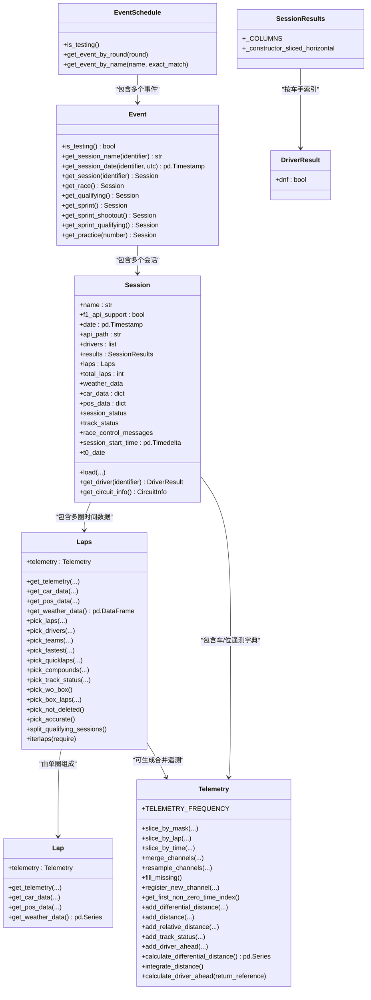
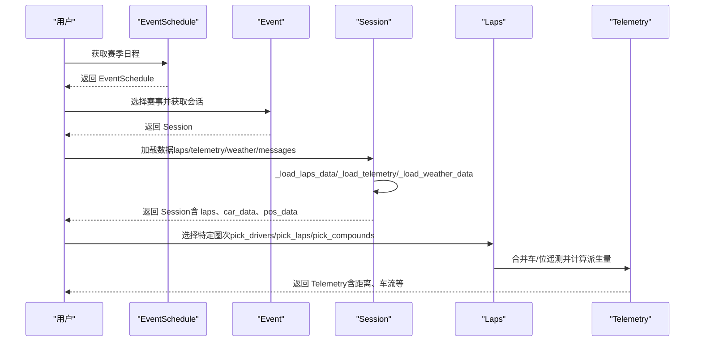
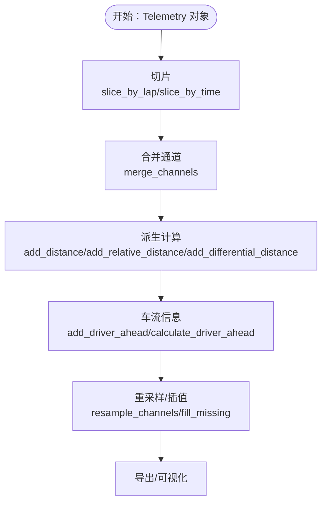
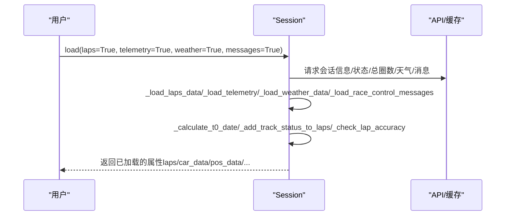
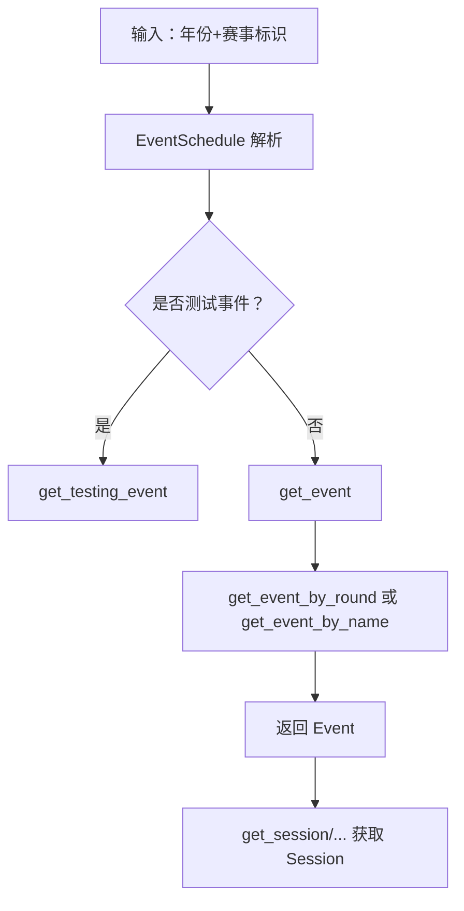
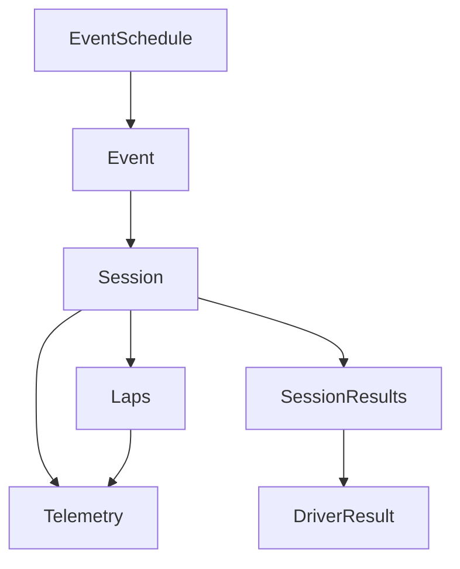

# 数据模型

<cite>
**本文引用的文件**
- [fastf1/core.py](file://fastf1/core.py)
- [fastf1/events.py](file://fastf1/events.py)
</cite>

## 目录
1. [简介](#简介)
2. [项目结构](#项目结构)
3. [核心组件](#核心组件)
4. [架构概览](#架构概览)
5. [详细组件分析](#详细组件分析)
6. [依赖分析](#依赖分析)
7. [性能考虑](#性能考虑)
8. [故障排除指南](#故障排除指南)
9. [结论](#结论)
10. [附录](#附录)

## 简介
本文件为 Fast-F1 数据模型的全面 API 文档，聚焦于以下核心数据类：Session（会话）、Telemetry（遥测）、Event（赛事）、Driver（车手）。文档详细说明这些类的结构、功能与相互关系，并重点阐述：

- Telemetry 的马达数据处理（Speed、RPM、nGear、Throttle、Brake、DRS）、速度分析（Distance、RelativeDistance、DifferentialDistance）、换挡检测与车流信息（DriverAhead、DistanceToDriverAhead）等能力。
- Session 的会话管理、数据加载（laps、telemetry、weather、messages）、状态控制（session_start_time、t0_date）等方法。
- Event 的赛事信息管理（EventSchedule、get_session）、日期处理、地点信息等属性。
- Driver（通过 SessionResults/DriverResult）的车手信息、统计数据、历史记录等数据结构。

同时提供使用示例的代码片段路径与具体实现细节，帮助读者快速上手并深入理解数据模型。

## 项目结构
本项目的数据模型主要集中在 fastf1/core.py 中，事件与日程管理集中在 fastf1/events.py 中。核心类之间的关系如下图所示：

图表来源
- [fastf1/core.py:1152-1356](file://fastf1/core.py#L1152-L1356)
- [fastf1/core.py:2730-2907](file://fastf1/core.py#L2730-L2907)
- [fastf1/core.py:3487-3661](file://fastf1/core.py#L3487-L3661)
- [fastf1/core.py:64-199](file://fastf1/core.py#L64-L199)
- [fastf1/core.py:3664-3841](file://fastf1/core.py#L3664-L3841)
- [fastf1/events.py:832-1011](file://fastf1/events.py#L832-L1011)

章节来源
- [fastf1/core.py:64-199](file://fastf1/core.py#L64-L199)
- [fastf1/core.py:1152-1356](file://fastf1/core.py#L1152-L1356)
- [fastf1/core.py:2730-2907](file://fastf1/core.py#L2730-L2907)
- [fastf1/core.py:3487-3661](file://fastf1/core.py#L3487-L3661)
- [fastf1/core.py:3664-3841](file://fastf1/core.py#L3664-L3841)
- [fastf1/events.py:832-1011](file://fastf1/events.py#L832-L1011)

## 核心组件
本节概述四个核心数据类的关键职责与常用接口。

- Telemetry（遥测）
  - 多通道时间序列数据容器，支持合并、插值、重采样与派生计算（距离、相对距离、车流信息等）。
  - 关键通道：Speed、RPM、nGear、Throttle、Brake、DRS、X/Y/Z、Status、Date/Time/SessionTime、Distance/RelativeDistance/DifferentialDistance、DriverAhead/DistanceToDriverAhead。
  - 常用方法：slice_by_mask/slice_by_lap/slice_by_time、merge_channels/resample_channels、fill_missing、add_distance/add_relative_distance/add_differential_distance、add_driver_ahead、calculate_driver_ahead 等。

- Session（会话）
  - 会话级数据入口，负责加载与整合 lap、telemetry、weather、messages 等数据。
  - 关键属性：drivers、results、laps、total_laps、weather_data、car_data、pos_data、session_status、track_status、race_control_messages、session_start_time、t0_date。
  - 关键方法：load(...)、get_driver(...)、get_circuit_info()、_load_telemetry/_load_weather_data/_load_race_control_messages 等。

- Event（赛事）
  - 单个赛事（周末或测试）对象，封装会话名称映射、日期解析、会话检索等。
  - 关键方法：get_session_name、get_session_date、get_session、get_race/get_qualifying/get_sprint 等。

- Driver（车手）
  - 通过 Session.results（SessionResults）与单车手条目（DriverResult）体现车手信息与结果。
  - 关键列：DriverNumber、Abbreviation、FullName、TeamName、Position、Q1/Q2/Q3、Time、Status、Points、Laps 等；dnf 属性用于判断未完赛。

章节来源
- [fastf1/core.py:64-199](file://fastf1/core.py#L64-L199)
- [fastf1/core.py:1152-1356](file://fastf1/core.py#L1152-L1356)
- [fastf1/core.py:2730-2907](file://fastf1/core.py#L2730-L2907)
- [fastf1/core.py:3487-3661](file://fastf1/core.py#L3487-L3661)
- [fastf1/core.py:3664-3841](file://fastf1/core.py#L3664-L3841)
- [fastf1/events.py:832-1011](file://fastf1/events.py#L832-L1011)

## 架构概览
下图展示数据模型在运行时的典型交互流程：从 EventSchedule 获取 Event，再获取 Session，随后加载数据并访问 Laps/Telemetry/Lap 等对象进行分析与可视化。

图表来源
- [fastf1/events.py:285-342](file://fastf1/events.py#L285-L342)
- [fastf1/events.py:951-983](file://fastf1/events.py#L951-L983)
- [fastf1/core.py:1358-1444](file://fastf1/core.py#L1358-L1444)
- [fastf1/core.py:2577-2650](file://fastf1/core.py#L2577-L2650)
- [fastf1/core.py:2862-2907](file://fastf1/core.py#L2862-L2907)

## 详细组件分析

### Telemetry 组件分析
Telemetry 是多通道时间序列的核心容器，支持多种切片、合并与派生计算。

- 数据通道与类型
  - 连续信号：Speed、RPM、Throttle、Distance、RelativeDistance、DifferentialDistance、DistanceToDriverAhead（插值方式不同）
  - 离散信号：nGear、Brake、DRS、DriverAhead（前向填充等）
  - 特殊字段：Date/Time/SessionTime、Source、Status、X/Y/Z 等
- 关键方法
  - 切片：slice_by_mask、slice_by_lap、slice_by_time
  - 合并与重采样：merge_channels、resample_channels、fill_missing
  - 派生计算：add_distance、add_relative_distance、add_differential_distance、add_driver_ahead、add_track_status
  - 注册新通道：register_new_channel
- 马达数据与速度分析
  - 计算差分距离与累积距离：calculate_differential_distance、integrate_distance
  - 车流信息：calculate_driver_ahead（基于多车积分距离定位“前方车手”）
- 时间基准
  - 使用 Date 作为索引，计算 Time（自 t0_date 的偏移）与 SessionTime（自会话开始）

图表来源
- [fastf1/core.py:263-390](file://fastf1/core.py#L263-L390)
- [fastf1/core.py:391-569](file://fastf1/core.py#L391-L569)
- [fastf1/core.py:624-690](file://fastf1/core.py#L624-L690)
- [fastf1/core.py:738-940](file://fastf1/core.py#L738-L940)
- [fastf1/core.py:941-1149](file://fastf1/core.py#L941-L1149)

章节来源
- [fastf1/core.py:64-199](file://fastf1/core.py#L64-L199)
- [fastf1/core.py:263-390](file://fastf1/core.py#L263-L390)
- [fastf1/core.py:391-569](file://fastf1/core.py#L391-L569)
- [fastf1/core.py:624-690](file://fastf1/core.py#L624-L690)
- [fastf1/core.py:738-940](file://fastf1/core.py#L738-L940)
- [fastf1/core.py:941-1149](file://fastf1/core.py#L941-L1149)

### Session 组件分析
Session 是会话级数据的统一入口，负责加载与整合各类数据，并提供便捷访问器。

- 关键属性
  - drivers、results、laps、total_laps、weather_data、car_data、pos_data、session_status、track_status、race_control_messages、session_start_time、t0_date
- 关键方法
  - load(...)：统一加载 laps、telemetry、weather、messages；内部调用 _load_laps_data/_load_telemetry/_load_weather_data/_load_race_control_messages 等
  - _load_telemetry：将原始车/位数据转换为 Telemetry 并计算 t0_date、LapStartDate
  - _calculate_t0_date：基于 Date 与 Time 计算会话起始时间戳
  - get_driver(...)：按缩写或号码获取车手结果
  - get_circuit_info()：获取赛道附加信息（如弯角、灯光等）
- 结果与统计
  - _calculate_quali_like_session_results/_calculate_race_like_session_results：根据 lap 数据推导排位/正赛结果
  - _add_track_status_to_laps：为每圈添加赛道状态
  - _check_lap_accuracy：对 lap 完整性进行验证

图表来源
- [fastf1/core.py:1358-1444](file://fastf1/core.py#L1358-L1444)
- [fastf1/core.py:1454-1667](file://fastf1/core.py#L1454-L1667)
- [fastf1/core.py:2577-2650](file://fastf1/core.py#L2577-L2650)
- [fastf1/core.py:2694-2727](file://fastf1/core.py#L2694-L2727)

章节来源
- [fastf1/core.py:1152-1356](file://fastf1/core.py#L1152-L1356)
- [fastf1/core.py:1358-1444](file://fastf1/core.py#L1358-L1444)
- [fastf1/core.py:1454-1667](file://fastf1/core.py#L1454-L1667)
- [fastf1/core.py:2577-2650](file://fastf1/core.py#L2577-L2650)
- [fastf1/core.py:2694-2727](file://fastf1/core.py#L2694-L2727)

### Event 组件分析
Event 表示单个赛事（周末或测试），提供会话名称解析、日期查询与会话实例化。

- 关键方法
  - get_session_name：根据数字/简称/全称解析会话名
  - get_session_date：返回指定会话的 UTC 或本地时间
  - get_session：返回 Session 实例
  - get_race/get_qualifying/get_sprint/get_sprint_shootout/get_sprint_qualifying/get_practice：便捷获取特定会话
- EventSchedule
  - 提供 get_event_by_round/get_event_by_name 等方法，支持模糊匹配与严格匹配
  - 支持筛选测试事件、获取剩余赛事等

图表来源
- [fastf1/events.py:285-342](file://fastf1/events.py#L285-L342)
- [fastf1/events.py:175-243](file://fastf1/events.py#L175-L243)
- [fastf1/events.py:832-1011](file://fastf1/events.py#L832-L1011)

章节来源
- [fastf1/events.py:50-138](file://fastf1/events.py#L50-L138)
- [fastf1/events.py:175-243](file://fastf1/events.py#L175-L243)
- [fastf1/events.py:285-342](file://fastf1/events.py#L285-L342)
- [fastf1/events.py:832-1011](file://fastf1/events.py#L832-L1011)

### Driver 组件分析
Driver 信息通过 SessionResults（DataFrame）与 DriverResult（Series）呈现。

- SessionResults
  - 包含车手编号、简称、全名、所属车队、头像链接、国家代码、排位/正赛结果、Q1/Q2/Q3、总时间、状态、积分、圈数等列
  - 默认按车手编号索引并按位置排序
- DriverResult
  - 单车手条目，提供 dnf 属性判断未完赛状态
- 访问方式
  - Session.get_driver(identifier)：按缩写或号码获取车手结果
  - Session.results：获取全部车手结果

章节来源
- [fastf1/core.py:3664-3841](file://fastf1/core.py#L3664-L3841)

## 依赖分析
- 组件耦合
  - Session 强依赖 Event（通过 EventSchedule 获取 Event，再获取 Session）
  - Session 与 Laps/Lap/Telemetry 形成紧密耦合：Laps 与 Lap 通过 Session 访问 car_data/pos_data；Telemetry 依赖 Session 的 t0_date、track_status 等
  - Driver 信息来自 Session.results，依赖 Session 的结果计算逻辑
- 外部依赖
  - API 接口：_load_laps_data/_load_telemetry/_load_weather_data/_load_race_control_messages 等
  - 时间与日期工具：to_timedelta、to_datetime 等
  - pandas/numpy：数据结构与数值计算

图表来源
- [fastf1/events.py:832-1011](file://fastf1/events.py#L832-L1011)
- [fastf1/core.py:1152-1356](file://fastf1/core.py#L1152-L1356)
- [fastf1/core.py:2730-2907](file://fastf1/core.py#L2730-L2907)
- [fastf1/core.py:3664-3841](file://fastf1/core.py#L3664-L3841)

章节来源
- [fastf1/events.py:832-1011](file://fastf1/events.py#L832-L1011)
- [fastf1/core.py:1152-1356](file://fastf1/core.py#L1152-L1356)
- [fastf1/core.py:2730-2907](file://fastf1/core.py#L2730-L2907)
- [fastf1/core.py:3664-3841](file://fastf1/core.py#L3664-L3841)

## 性能考虑
- 合并与重采样
  - merge_channels 默认使用原始频率（不重采样），以避免精度损失；若强制指定频率，将进行重采样与插值，可能引入误差
  - 建议优先使用原始频率进行合并，必要时再进行 resample_channels
- 插值策略
  - 连续信号采用线性/样条等插值；离散信号采用前向/后向填充
  - fill_missing 会恢复列类型，注意未知通道不会被插值
- 距离与车流计算
  - integrate_distance 与 calculate_driver_ahead 基于积分，长时间跨度会累积误差；建议仅对单圈或少量圈次使用
- 数据加载
  - Session.load 可按需加载，避免不必要的网络请求与内存占用

## 故障排除指南
- 数据未加载错误
  - 访问属性前需先调用 Session.load；否则会抛出 DataNotLoadedError
- 会话不可用
  - 某些会话不支持官方 API，此时会提示无法加载 lap/telemetry/weather/message 数据
- 赛道状态缺失
  - 若未加载 race control messages，Deleted 列不可用；若 track_status 缺失，相关计算会警告
- 车号/缩写错误
  - get_driver 传入无效标识会报错；请确认使用正确的车手缩写或号码

章节来源
- [fastf1/core.py:1227-1233](file://fastf1/core.py#L1227-L1233)
- [fastf1/core.py:1431-1437](file://fastf1/core.py#L1431-L1437)
- [fastf1/core.py:1808-1861](file://fastf1/core.py#L1808-L1861)
- [fastf1/core.py:2651-2667](file://fastf1/core.py#L2651-L2667)

## 结论
Fast-F1 的数据模型围绕 Session、Telemetry、Event、Driver 四大核心类构建，形成从赛事到会话、从时间到空间、从统计到可视化的完整数据链路。Telemetry 提供强大的时间序列处理与派生计算能力；Session 负责数据加载与整合；Event/EventSchedule 提供赛事与日程管理；Driver 信息通过 SessionResults/DriverResult 体现。遵循本文档的使用模式与注意事项，可高效地进行数据分析与可视化。

## 附录
- 使用示例（代码片段路径）
  - 获取会话并加载数据：[fastf1/events.py:50-138](file://fastf1/events.py#L50-L138)、[fastf1/core.py:1358-1444](file://fastf1/core.py#L1358-L1444)
  - 访问车手结果：[fastf1/core.py:2651-2667](file://fastf1/core.py#L2651-L2667)
  - 合并与切片遥测：[fastf1/core.py:2862-2907](file://fastf1/core.py#L2862-L2907)、[fastf1/core.py:3523-3566](file://fastf1/core.py#L3523-L3566)
  - 距离与车流计算：[fastf1/core.py:941-1149](file://fastf1/core.py#L941-L1149)
  - 赛事日程与会话检索：[fastf1/events.py:285-342](file://fastf1/events.py#L285-L342)、[fastf1/events.py:951-983](file://fastf1/events.py#L951-L983)