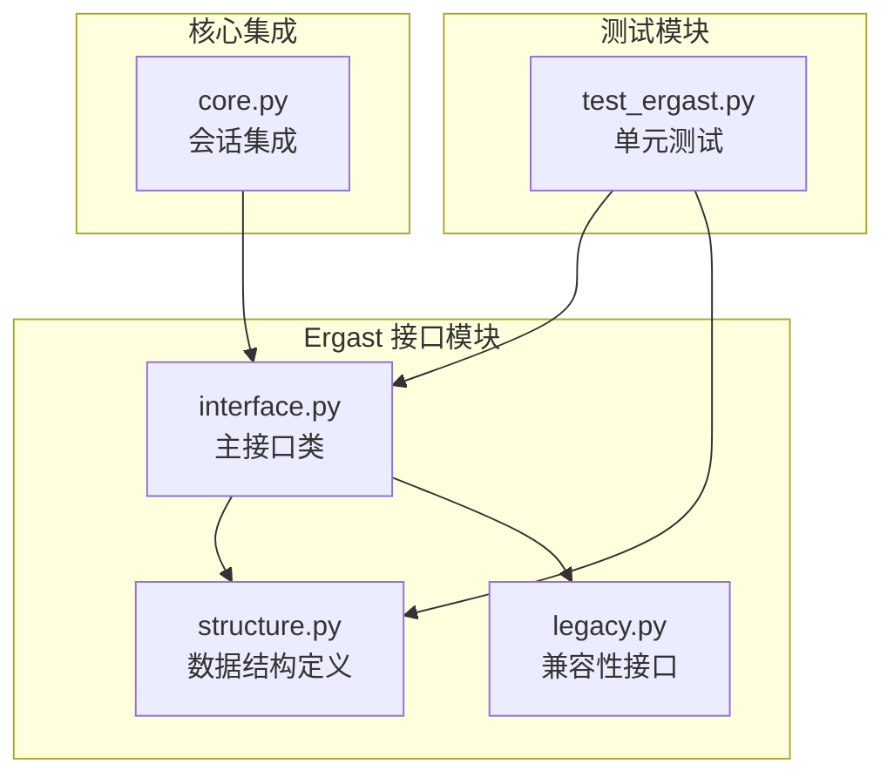
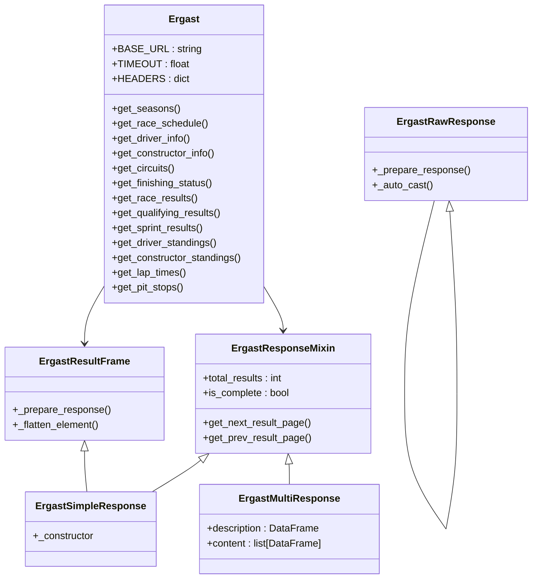
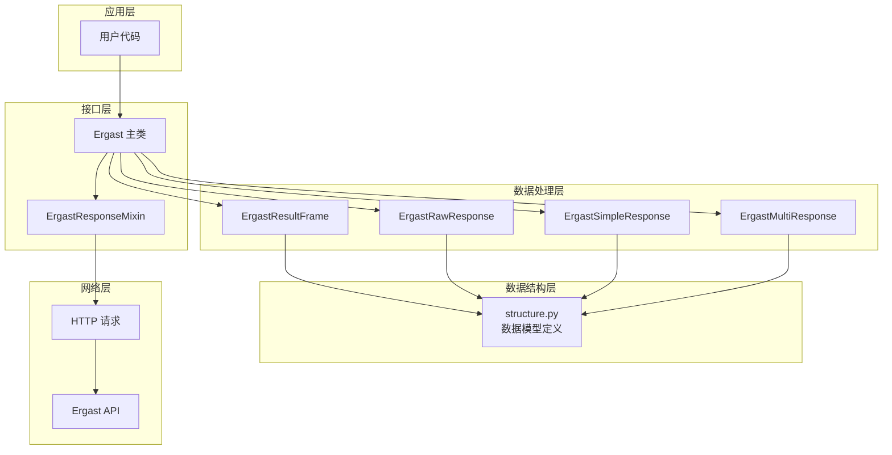
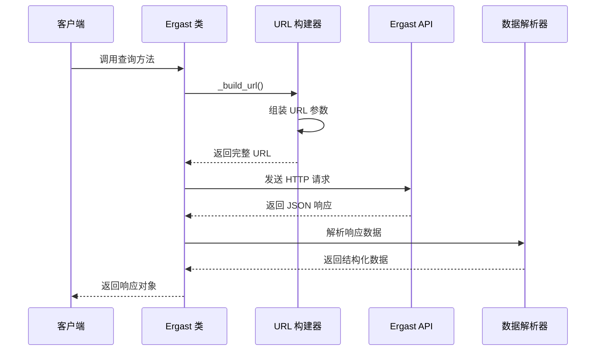
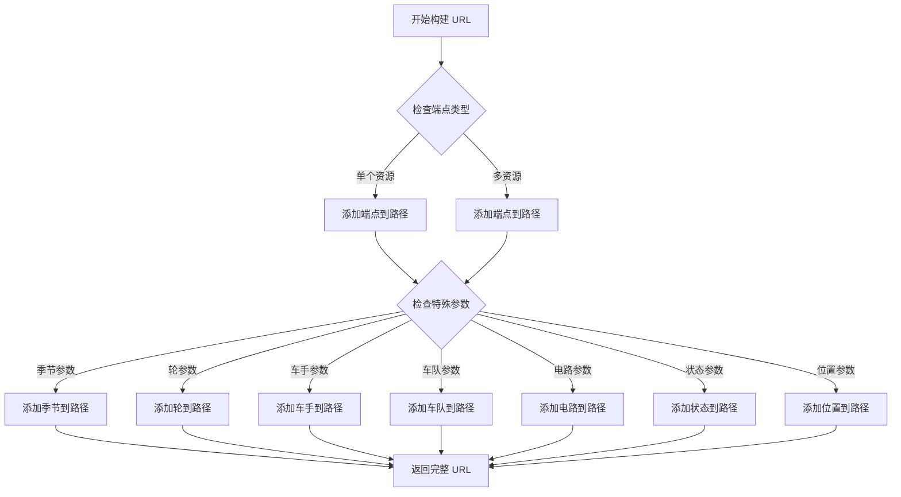
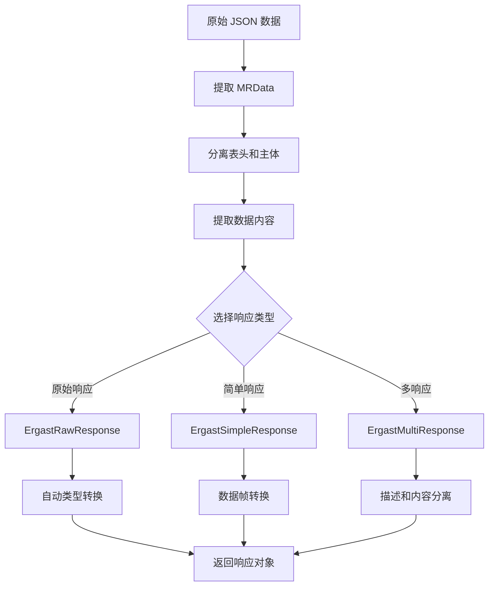
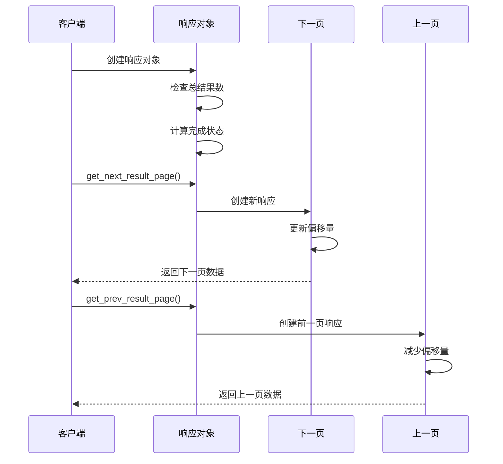
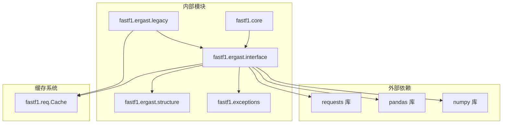

# Ergast 历史数据接口

<cite>
**本文档引用的文件**
- [fastf1/ergast/interface.py](file://fastf1/ergast/interface.py)
- [fastf1/ergast/structure.py](file://fastf1/ergast/structure.py)
- [fastf1/ergast/legacy.py](file://fastf1/ergast/legacy.py)
- [fastf1/tests/test_ergast.py](file://fastf1/tests/test_ergast.py)
- [fastf1/core.py](file://fastf1/core.py)
</cite>

## 目录
1. [简介](#简介)
2. [项目结构](#项目结构)
3. [核心组件](#核心组件)
4. [架构概览](#架构概览)
5. [详细组件分析](#详细组件分析)
6. [依赖关系分析](#依赖关系分析)
7. [性能考虑](#性能考虑)
8. [故障排除指南](#故障排除指南)
9. [结论](#结论)

## 简介

Ergast 历史数据接口是 FastF1 项目中用于访问 Formula 1 历史数据的核心模块。该接口提供了对 Ergast API 的完整封装，支持多种数据类型的查询和处理，包括车手信息、比赛结果、车队排名、圈速数据等。

本接口采用面向对象的设计模式，通过统一的 API 界面提供灵活的数据访问能力，同时保持与 FastF1 核心数据模型的无缝集成。

## 项目结构

FastF1 项目中的 Ergast 接口主要分布在以下文件中：

**图表来源**
- [fastf1/ergast/interface.py:1-800](file://fastf1/ergast/interface.py#L1-800)
- [fastf1/ergast/structure.py:1-653](file://fastf1/ergast/structure.py#L1-653)
- [fastf1/ergast/legacy.py:1-49](file://fastf1/ergast/legacy.py#L1-49)

**章节来源**
- [fastf1/ergast/interface.py:1-800](file://fastf1/ergast/interface.py#L1-800)
- [fastf1/ergast/structure.py:1-653](file://fastf1/ergast/structure.py#L1-653)
- [fastf1/ergast/legacy.py:1-49](file://fastf1/ergast/legacy.py#L1-49)

## 核心组件

### 主要类结构

Ergast 接口由多个核心类组成，每个类负责特定的功能：

**图表来源**
- [fastf1/ergast/interface.py:401-1433](file://fastf1/ergast/interface.py#L401-1433)

### 数据类型支持

接口支持以下主要数据类型：

| 数据类型 | 对应方法 | 描述 |
|---------|----------|------|
| 赛季信息 | `get_seasons()` | 获取所有可用的赛季列表 |
| 比赛日程 | `get_race_schedule()` | 获取指定赛季的比赛安排 |
| 车手信息 | `get_driver_info()` | 获取车手基本信息 |
| 车队信息 | `get_constructor_info()` | 获取车队基本信息 |
| 赛道信息 | `get_circuits()` | 获取赛道信息 |
| 完赛状态 | `get_finishing_status()` | 获取比赛完赛状态代码 |
| 比赛结果 | `get_race_results()` | 获取比赛最终结果 |
| 排位赛结果 | `get_qualifying_results()` | 获取排位赛结果 |
| 冲刺赛结果 | `get_sprint_results()` | 获取冲刺赛结果 |
| 车手积分榜 | `get_driver_standings()` | 获取车手积分榜 |
| 车队积分榜 | `get_constructor_standings()` | 获取车队积分榜 |
| 圈速数据 | `get_lap_times()` | 获取圈速时间数据 |
| 进站数据 | `get_pit_stops()` | 获取进站维修数据 |

**章节来源**
- [fastf1/ergast/interface.py:618-1433](file://fastf1/ergast/interface.py#L618-1433)

## 架构概览

Ergast 接口采用分层架构设计，确保了良好的可扩展性和维护性：

**图表来源**
- [fastf1/ergast/interface.py:401-800](file://fastf1/ergast/interface.py#L401-800)
- [fastf1/ergast/structure.py:551-653](file://fastf1/ergast/structure.py#L551-653)

### 查询机制

Ergast 接口的查询机制基于 URL 构建和参数传递：

**图表来源**
- [fastf1/ergast/interface.py:431-532](file://fastf1/ergast/interface.py#L431-532)

**章节来源**
- [fastf1/ergast/interface.py:431-532](file://fastf1/ergast/interface.py#L431-532)

## 详细组件分析

### URL 构建系统

URL 构建系统是 Ergast 接口的核心组件，负责将查询参数转换为标准的 Ergast API URL：

**图表来源**
- [fastf1/ergast/interface.py:431-512](file://fastf1/ergast/interface.py#L431-512)

#### 支持的查询参数

接口支持以下查询参数：

| 参数名称 | 类型 | 描述 | 默认值 |
|---------|------|------|--------|
| `season` | `Literal['current'] | int` | 赛季年份或 'current' | `None` |
| `round` | `Literal['last'] | int` | 轮次编号或 'last' | `None` |
| `circuit` | `str` | 电路标识符 | `None` |
| `constructor` | `str` | 车队标识符 | `None` |
| `driver` | `str` | 车手标识符 | `None` |
| `grid_position` | `int` | 发车位置 | `None` |
| `results_position` | `int` | 比赛名次 | `None` |
| `fastest_rank` | `int` | 最快圈速排名 | `None` |
| `status` | `str` | 完赛状态 | `None` |
| `lap_number` | `int` | 圈数 | `None` |
| `stop_number` | `int` | 进站次数 | `None` |
| `standings_position` | `int` | 积分榜位置 | `None` |

**章节来源**
- [fastf1/ergast/interface.py:432-445](file://fastf1/ergast/interface.py#L432-445)

### 数据转换系统

数据转换系统负责将 Ergast API 返回的原始 JSON 数据转换为 FastF1 友好的格式：

**图表来源**
- [fastf1/ergast/interface.py:534-592](file://fastf1/ergast/interface.py#L534-592)

#### 数据类型转换

系统支持以下数据类型的自动转换：

| 原始类型 | 目标类型 | 转换函数 | 示例 |
|---------|---------|---------|------|
| `str` | `int` | `save_int()` | "2025" → 2025 |
| `str` | `float` | `save_float()` | "205.5" → 205.5 |
| `str` | `datetime` | `date_from_ergast()` | "2025-03-16" → datetime |
| `str` | `time` | `time_from_ergast()` | "14:30:25.123" → time |
| `str` | `timedelta` | `timedelta_from_ergast()` | "1:42:06.304" → timedelta |

**章节来源**
- [fastf1/ergast/structure.py:128-168](file://fastf1/ergast/structure.py#L128-168)

### 分页处理机制

分页处理机制确保了大量数据的高效传输和处理：

**图表来源**
- [fastf1/ergast/interface.py:80-124](file://fastf1/ergast/interface.py#L80-124)

**章节来源**
- [fastf1/ergast/interface.py:80-124](file://fastf1/ergast/interface.py#L80-124)

## 依赖关系分析

Ergast 接口与其他 FastF1 组件的依赖关系如下：

**图表来源**
- [fastf1/ergast/interface.py:1-20](file://fastf1/ergast/interface.py#L1-20)
- [fastf1/core.py:20-30](file://fastf1/core.py#L20-30)

### 核心依赖关系

| 依赖模块 | 用途 | 版本要求 |
|---------|------|----------|
| `requests` | HTTP 请求处理 | >= 2.25.0 |
| `pandas` | 数据框架操作 | >= 1.3.0 |
| `numpy` | 数值计算 | >= 1.21.0 |
| `fastf1.req.Cache` | 缓存管理 | 内置缓存系统 |
| `fastf1.exceptions` | 错误处理 | 内置异常类 |

**章节来源**
- [fastf1/ergast/interface.py:1-20](file://fastf1/ergast/interface.py#L1-20)
- [fastf1/core.py:20-30](file://fastf1/core.py#L20-30)

## 性能考虑

### 缓存策略

Ergast 接口实现了智能缓存机制，以提高重复查询的性能：

- **默认缓存时间**：60 秒
- **缓存键生成**：基于完整 URL 和请求参数
- **缓存失效**：自动处理过期和手动清理
- **内存优化**：限制缓存大小，避免内存泄漏

### 批量查询优化

对于大量数据的查询，建议采用以下策略：

1. **合理设置 limit 参数**：控制每次查询的数据量
2. **使用分页机制**：避免一次性加载过多数据
3. **选择合适的数据类型**：原始响应 vs DataFrame 响应
4. **启用自动类型转换**：在需要时进行数据类型转换

### 并发处理

接口支持并发查询，但需要注意：

- **API 限制**：遵守 Ergast API 的速率限制
- **内存管理**：合理管理大数据集的内存使用
- **错误处理**：妥善处理并发查询中的异常情况

## 故障排除指南

### 常见错误类型

| 错误类型 | 触发原因 | 解决方案 |
|---------|---------|----------|
| `ErgastJsonError` | JSON 解析失败 | 检查网络连接，重试请求 |
| `ErgastInvalidRequestError` | HTTP 请求失败 | 验证 URL 格式，检查参数有效性 |
| `ValueError` | 分页边界错误 | 检查偏移量和限制参数 |
| `TypeError` | 数据类型不匹配 | 确认输入参数类型 |

### 调试技巧

1. **启用详细日志**：使用 `logging` 模块查看请求详情
2. **验证 URL 构建**：检查 `_build_url()` 方法的输出
3. **测试数据转换**：验证 `structure.py` 中的转换函数
4. **检查缓存状态**：确认缓存是否正确存储和检索

**章节来源**
- [fastf1/ergast/interface.py:515-531](file://fastf1/ergast/interface.py#L515-531)

### 单元测试覆盖

接口包含全面的单元测试，涵盖以下方面：

- URL 构建逻辑验证
- 数据类型转换功能测试
- 分页机制正确性
- 错误处理行为
- 响应格式验证

**章节来源**
- [fastf1/tests/test_ergast.py:337-755](file://fastf1/tests/test_ergast.py#L337-755)

## 结论

Ergast 历史数据接口为 FastF1 提供了强大而灵活的历史数据访问能力。通过清晰的架构设计、完善的错误处理机制和高效的性能优化，该接口能够满足各种数据查询需求。

主要优势包括：

1. **完整的 API 覆盖**：支持所有主要的 Ergast API 功能
2. **灵活的数据处理**：支持多种响应格式和数据类型
3. **智能缓存机制**：提高查询性能和用户体验
4. **强大的错误处理**：提供详细的错误信息和恢复机制
5. **全面的测试覆盖**：确保代码质量和稳定性

该接口为 FastF1 的数据分析和可视化功能奠定了坚实的基础，是 Formula 1 数据分析生态系统中不可或缺的重要组件。