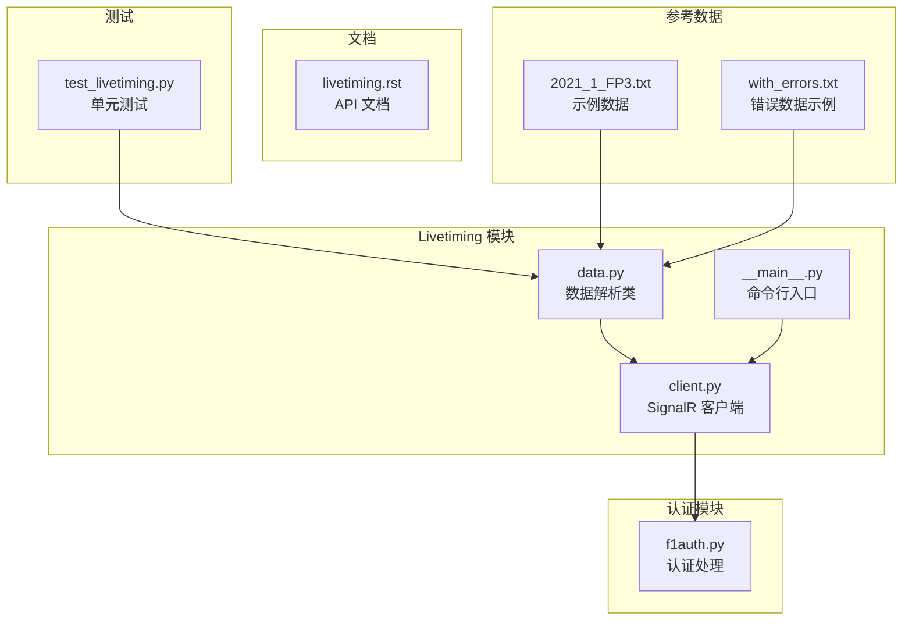
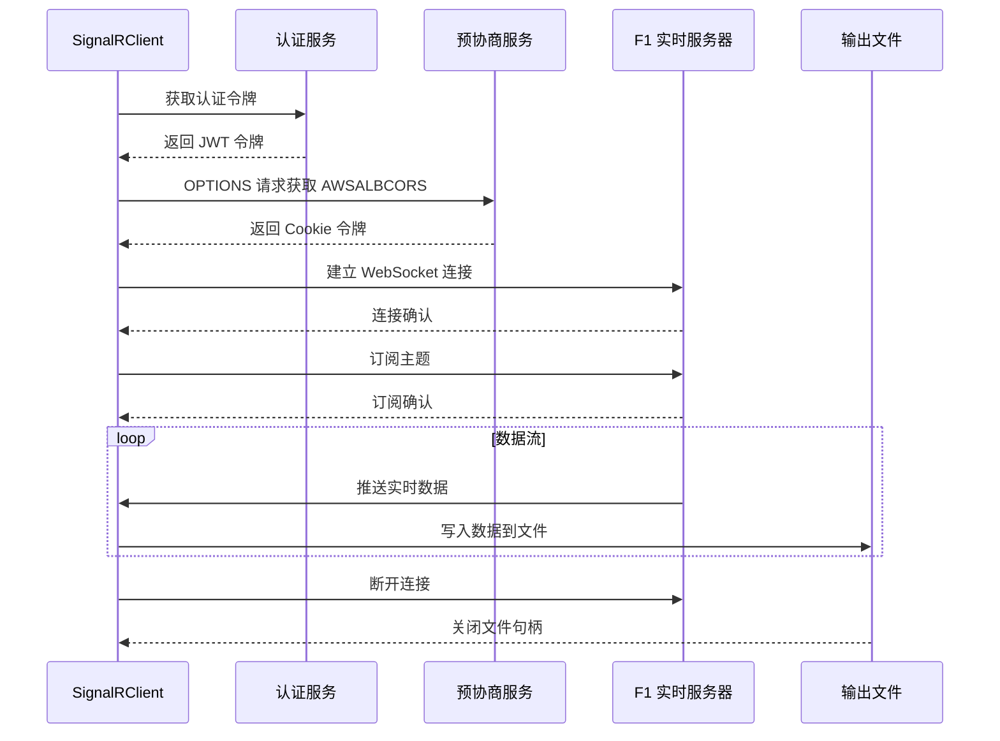
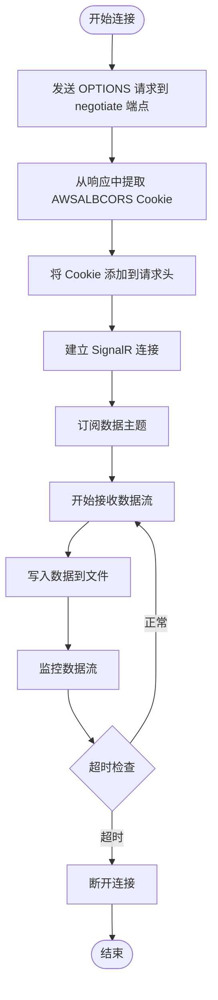
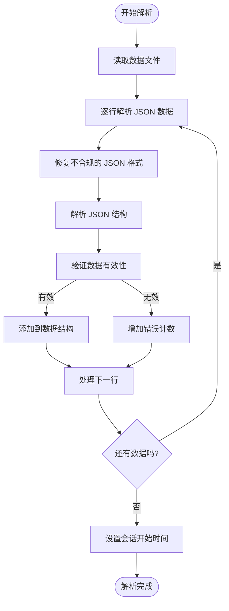
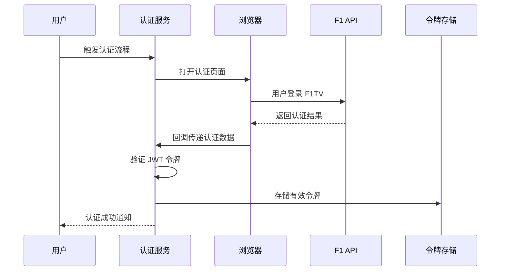
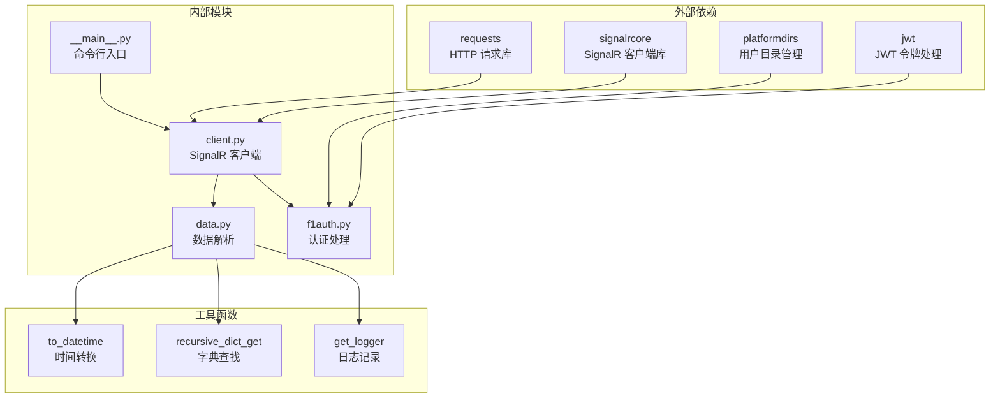

# Livetiming 实时数据接口

<cite>
**本文档引用的文件**
- [client.py](file://fastf1/livetiming/client.py)
- [data.py](file://fastf1/livetiming/data.py)
- [__main__.py](file://fastf1/livetiming/__main__.py)
- [f1auth.py](file://fastf1/internals/f1auth.py)
- [livetiming.rst](file://docs/api_reference/livetiming.rst)
- [test_livetiming.py](file://fastf1/tests/test_livetiming.py)
- [2021_1_FP3.txt](file://fastf1/testing/reference_data/livedata/2021_1_FP3.txt)
- [with_errors.txt](file://fastf1/testing/reference_data/livedata/with_errors.txt)
</cite>

## 目录
1. [简介](#简介)
2. [项目结构](#项目结构)
3. [核心组件](#核心组件)
4. [架构概览](#架构概览)
5. [详细组件分析](#详细组件分析)
6. [依赖关系分析](#依赖关系分析)
7. [性能考虑](#性能考虑)
8. [故障排除指南](#故障排除指南)
9. [结论](#结论)

## 简介

Livetiming 实时数据接口是 FastF1 库中用于获取 F1 实时数据的核心模块。该系统基于 SignalR 协议，能够实时接收和保存 F1 赛事期间的实时数据流。该接口支持多种数据类型，包括位置数据、赛车数据、天气信息、会话状态等，并提供了完整的数据解析和加载功能。

## 项目结构

Livetiming 模块位于 `fastf1/livetiming/` 目录下，包含以下核心文件：



**图表来源**
- [client.py:1-232](file://fastf1/livetiming/client.py#L1-L232)
- [data.py:1-255](file://fastf1/livetiming/data.py#L1-L255)
- [__main__.py:1-65](file://fastf1/livetiming/__main__.py#L1-L65)

**章节来源**
- [client.py:1-232](file://fastf1/livetiming/client.py#L1-L232)
- [data.py:1-255](file://fastf1/livetiming/data.py#L1-L255)
- [__main__.py:1-65](file://fastf1/livetiming/__main__.py#L1-L65)

## 核心组件

Livetiming 系统由三个主要组件构成：

### 1. SignalRClient 类
这是系统的核心组件，负责与 F1 实时数据服务器建立连接并管理数据流。

### 2. LiveTimingData 类
负责解析和管理从 SignalR 流中保存的数据文件。

### 3. 认证系统
通过 JWT 令牌验证确保用户具有访问实时数据的权限。

**章节来源**
- [client.py:47-232](file://fastf1/livetiming/client.py#L47-L232)
- [data.py:29-255](file://fastf1/livetiming/data.py#L29-L255)
- [f1auth.py:135-175](file://fastf1/internals/f1auth.py#L135-L175)

## 架构概览

Livetiming 系统采用客户端-服务器架构，基于 SignalR 协议实现实时数据传输：



**图表来源**
- [client.py:158-193](file://fastf1/livetiming/client.py#L158-L193)
- [f1auth.py:135-175](file://fastf1/internals/f1auth.py#L135-L175)

## 详细组件分析

### SignalRClient 类分析

SignalRClient 是 Livetiming 系统的核心类，负责管理整个实时数据连接生命周期。

#### 主要特性

1. **连接管理**: 自动处理连接建立、维护和断开
2. **数据订阅**: 支持多种数据主题的订阅
3. **文件输出**: 将接收到的数据实时写入文件
4. **超时监控**: 自动检测数据流中断并退出
5. **错误处理**: 提供完善的异常处理机制

#### 连接配置参数

| 参数 | 类型 | 默认值 | 描述 |
|------|------|--------|------|
| filename | str | 必需 | 输出文件名 |
| filemode | str | 'w' | 文件写入模式 ('w' 或 'a') |
| debug | bool | False | 调试模式开关 |
| timeout | int | 60 | 超时时间（秒） |
| logger | Logger | None | 日志记录器实例 |
| no_auth | bool | False | 是否跳过认证 |

#### 数据主题订阅

SignalRClient 默认订阅以下主题：

```mermaid
graph LR
subgraph "实时数据主题"
A[Heartbeat<br/>心跳信号]
B[AudioStreams<br/>音频流]
C[DriverList<br/>车手列表]
D[ExtrapolatedClock<br/>推算时钟]
E[RaceControlMessages<br/>赛事控制消息]
F[SessionInfo<br/>会话信息]
G[SessionStatus<br/>会话状态]
H[TeamRadio<br/>车队无线电]
I[TimingAppData<br/>计时应用数据]
J[TimingStats<br/>计时统计]
K[TrackStatus<br/>赛道状态]
L[WeatherData<br/>天气数据]
M[Position.z<br/>位置数据]
N[CarData.z<br/>赛车数据]
O[ContentStreams<br/>内容流]
P[SessionData<br/>会话数据]
Q[TimingData<br/>计时数据]
R[TopThree<br/>前三名]
S[RcmSeries<br/>Rcm系列]
T[LapCount<br/>圈数统计]
end
```



**图表来源**
- [client.py:97-103](file://fastf1/livetiming/client.py#L97-L103)

#### AWSALBCORS 头部处理

系统通过预协商机制获取 AWSALBCORS Cookie 令牌：



**图表来源**
- [client.py:161-165](file://fastf1/livetiming/client.py#L161-L165)

**章节来源**
- [client.py:47-232](file://fastf1/livetiming/client.py#L47-L232)

### LiveTimingData 类分析

LiveTimingData 类负责解析和管理保存的实时数据文件。

#### 数据解析流程



**图表来源**
- [data.py:116-171](file://fastf1/livetiming/data.py#L116-L171)

#### 数据格式规范

每条数据记录采用三元组格式：
```
[类别, 消息体, 时间戳]
```

##### TimingData 数据格式
```json
{
  "Lines": {
    "10": {
      "Sectors": {
        "0": {
          "Segments": {
            "3": {
              "Status": 2048
            }
          }
        }
      }
    }
  }
}
```

##### Position 数据格式
```json
{
  "X": 123.45,
  "Y": 67.89,
  "Z": 0.0,
  "Status": "active"
}
```

##### CarData 数据格式
```json
{
  "Speed": 280.5,
  "RPM": 12000,
  "Throttle": 0.85,
  "Brake": false,
  "nGear": 4,
  "DRS": 0
}
```

**章节来源**
- [data.py:132-171](file://fastf1/livetiming/data.py#L132-L171)

### 认证系统分析

系统使用 JWT 令牌进行用户认证，要求有效的 F1TV 订阅。

#### 认证流程



**图表来源**
- [f1auth.py:70-92](file://fastf1/internals/f1auth.py#L70-L92)

#### 认证令牌结构

认证令牌包含以下关键信息：
- `SubscriptionStatus`: 订阅状态
- `SubscribedProduct`: 订阅产品类型  
- `exp`: 令牌过期时间
- `kid`: JWT 密钥标识符

**章节来源**
- [f1auth.py:135-175](file://fastf1/internals/f1auth.py#L135-L175)

## 依赖关系分析

Livetiming 系统的依赖关系如下：



**图表来源**
- [client.py:1-12](file://fastf1/livetiming/client.py#L1-L12)
- [data.py:9-13](file://fastf1/livetiming/data.py#L9-L13)
- [f1auth.py:13-16](file://fastf1/internals/f1auth.py#L13-L16)

**章节来源**
- [client.py:1-12](file://fastf1/livetiming/client.py#L1-L12)
- [data.py:9-13](file://fastf1/livetiming/data.py#L9-L13)
- [f1auth.py:13-16](file://fastf1/internals/f1auth.py#L13-L16)

## 性能考虑

### 连接优化

1. **自动重连**: 系统预留了自动重连机制的扩展点
2. **超时设置**: 可配置的超时机制防止资源泄漏
3. **内存管理**: 使用生成器模式处理大量数据文件

### 数据处理优化

1. **增量写入**: 实时将数据写入文件，避免内存占用
2. **错误容忍**: 对损坏的数据进行容错处理
3. **去重机制**: 自动识别和去除重复数据

### 缓存策略

系统支持缓存机制以提高数据加载性能：
- 缓存解析后的数据
- 支持强制刷新缓存
- 多文件数据的智能合并

## 故障排除指南

### 常见问题及解决方案

#### 1. 认证失败
**症状**: 连接被拒绝或返回空数据
**原因**: 无效的认证令牌或过期令牌
**解决方法**: 
- 运行 `fastf1.auth_status` 检查令牌状态
- 使用 `fastf1.clear_auth_token` 清除旧令牌
- 重新执行认证流程

#### 2. 连接超时
**症状**: 程序在指定时间内无数据就退出
**原因**: 网络问题或服务器端连接中断
**解决方法**:
- 增加 `--timeout` 参数值
- 检查网络连接稳定性
- 确认 F1TV 订阅状态

#### 3. 数据格式错误
**症状**: 解析过程中出现 JSON 错误
**原因**: 服务器返回的数据格式不规范
**解决方法**:
- 系统会自动跳过错误数据
- 检查 `errorcount` 属性了解错误数量
- 更新到最新版本的 FastF1

#### 4. 权限不足
**症状**: 访问被拒绝
**原因**: 未登录有效的 F1TV 账户
**解决方法**:
- 确保拥有 F1TV Access/Pro/Premium 订阅
- 在支持的环境中运行程序
- 避免在托管环境（如 Google Colab）中使用

**章节来源**
- [livetiming.rst:10-18](file://docs/api_reference/livetiming.rst#L10-L18)
- [test_livetiming.py:7-11](file://fastf1/tests/test_livetiming.py#L7-L11)

## 结论

Livetiming 实时数据接口是一个功能完整、设计良好的实时数据获取系统。它提供了：

1. **可靠的连接管理**: 基于 SignalR 协议的稳定连接
2. **完整的数据覆盖**: 支持多种实时数据类型的获取
3. **强大的数据处理**: 智能的数据解析和错误处理
4. **灵活的使用方式**: 支持编程接口和命令行两种使用方式
5. **完善的认证机制**: 基于 JWT 的安全认证系统

该系统特别适合需要获取 F1 赛事实时数据的研究人员、开发者和数据分析人员使用。通过合理的配置和使用，可以高效地获取和处理大量的实时数据。