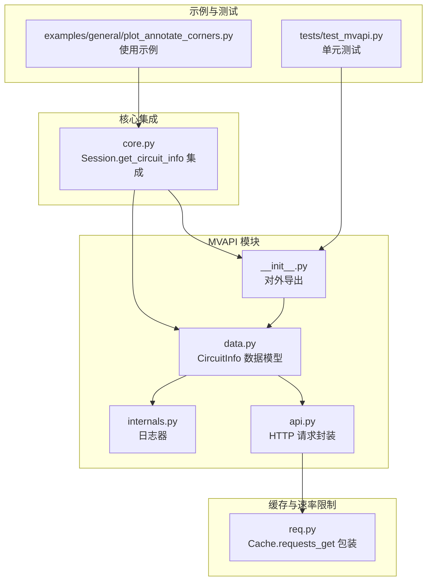
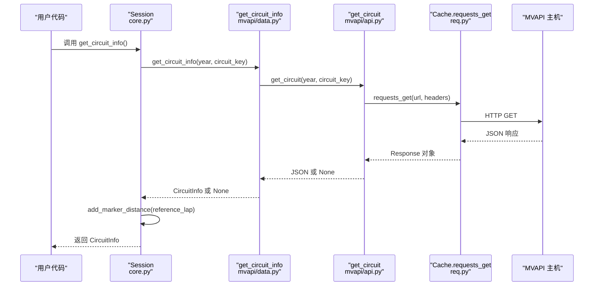
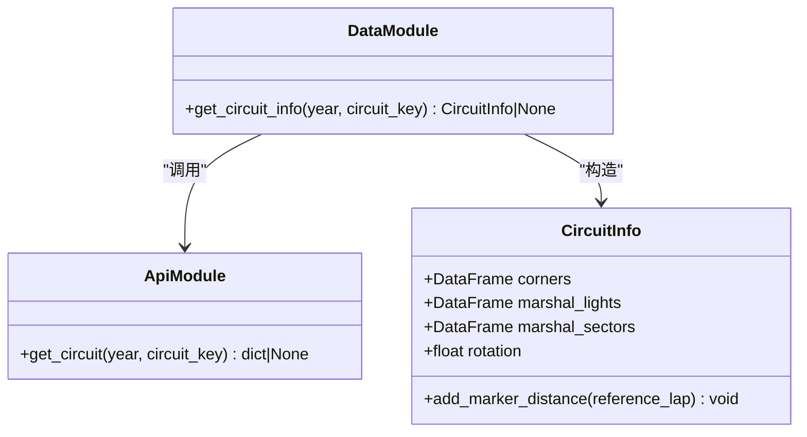
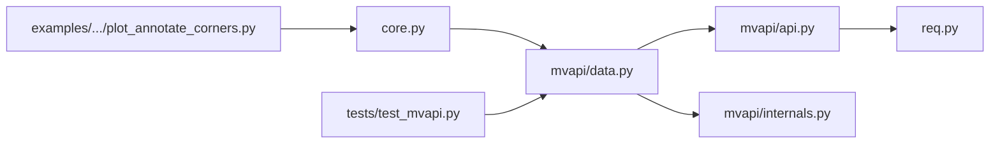

# MVAPI 多维数据接口

<cite>
**本文引用的文件**
- [fastf1/mvapi/__init__.py](file://fastf1/mvapi/__init__.py)
- [fastf1/mvapi/api.py](file://fastf1/mvapi/api.py)
- [fastf1/mvapi/data.py](file://fastf1/mvapi/data.py)
- [fastf1/mvapi/internals.py](file://fastf1/mvapi/internals.py)
- [fastf1/core.py](file://fastf1/core.py)
- [fastf1/req.py](file://fastf1/req.py)
- [fastf1/livetiming/data.py](file://fastf1/livetiming/data.py)
- [fastf1/tests/test_mvapi.py](file://fastf1/tests/test_mvapi.py)
- [examples/general/plot_annotate_corners.py](file://examples/general/plot_annotate_corners.py)
- [docs/api_reference/cache_and_rate_limits.rst](file://docs/api_reference/cache_and_rate_limits.rst)
- [docs/api_reference/livetiming.rst](file://docs/api_reference/livetiming.rst)
- [fastf1/testing/reference_data/2020_05_FP2/mvapi_circuits.raw](file://fastf1/testing/reference_data/2020_05_FP2/mvapi_circuits.raw)
</cite>

## 目录
1. [简介](#简介)
2. [项目结构](#项目结构)
3. [核心组件](#核心组件)
4. [架构总览](#架构总览)
5. [详细组件分析](#详细组件分析)
6. [依赖关系分析](#依赖关系分析)
7. [性能考量](#性能考量)
8. [故障排查指南](#故障排查指南)
9. [结论](#结论)
10. [附录](#附录)

## 简介
本文件面向 MVAPI（MultiViewer API）多维数据接口的使用者与维护者，系统性地阐述：
- 数据获取机制：从 MVAPI 获取赛道信息与标记点数据的流程与缓存策略
- API 密钥管理与请求限制：当前实现未暴露密钥参数；速率限制通过统一缓存层实现软/硬限流
- 多维数据类型与结构：位置数据、遥测数据与其他高级数据类型的来源与关系
- API 调用方法、参数配置与响应处理：函数签名、返回值与错误处理
- 与 Livetiming 数据的关系与数据补充作用：MVAPI 提供静态几何与标记，Livetiming 提供动态实时数据

## 项目结构
MVAPI 模块位于 fastf1/mvapi，核心文件包括：
- 接口封装：api.py（HTTP 请求与 URL 组装）
- 数据模型与转换：data.py（CircuitInfo 数据类与解析逻辑）
- 内部日志：internals.py（专用 logger）
- 对外导出：__init__.py（导出 get_circuit_info）
- 集成入口：core.py（Session.get_circuit_info 集成）
- 缓存与速率限制：req.py（统一缓存与请求包装）
- 示例与测试：examples 与 tests

**图表来源**
- [fastf1/mvapi/api.py:14-31](file://fastf1/mvapi/api.py#L14-L31)
- [fastf1/mvapi/data.py:120-162](file://fastf1/mvapi/data.py#L120-L162)
- [fastf1/mvapi/internals.py:4-4](file://fastf1/mvapi/internals.py#L4-L4)
- [fastf1/mvapi/__init__.py:1-5](file://fastf1/mvapi/__init__.py#L1-L5)
- [fastf1/core.py:2669-2692](file://fastf1/core.py#L2669-L2692)
- [fastf1/req.py:259-282](file://fastf1/req.py#L259-L282)
- [examples/general/plot_annotate_corners.py:17-23](file://examples/general/plot_annotate_corners.py#L17-L23)
- [fastf1/tests/test_mvapi.py:15-26](file://fastf1/tests/test_mvapi.py#L15-L26)

**章节来源**
- [fastf1/mvapi/__init__.py:1-5](file://fastf1/mvapi/__init__.py#L1-L5)
- [fastf1/mvapi/api.py:9-11](file://fastf1/mvapi/api.py#L9-L11)
- [fastf1/mvapi/data.py:12-57](file://fastf1/mvapi/data.py#L12-L57)
- [fastf1/mvapi/internals.py:1-5](file://fastf1/mvapi/internals.py#L1-L5)
- [fastf1/core.py:2669-2692](file://fastf1/core.py#L2669-L2692)
- [fastf1/req.py:259-282](file://fastf1/req.py#L259-L282)
- [examples/general/plot_annotate_corners.py:17-23](file://examples/general/plot_annotate_corners.py#L17-L23)
- [fastf1/tests/test_mvapi.py:15-26](file://fastf1/tests/test_mvapi.py#L15-L26)

## 核心组件
- 接口封装（api.py）
  - 协议与主机常量、User-Agent 请求头
  - URL 构造函数与 get_circuit 年度+关键键查询
  - 返回状态码非 200 时的日志与 None 返回；JSON 解析异常兜底
- 数据模型（data.py）
  - CircuitInfo 数据类：包含角点、警戒灯、警戒区、旋转角度
  - get_circuit_info：调用 get_circuit 并将原始数据映射为 DataFrame 列表
  - add_marker_distance：基于参考圈遥测计算标记点距离（Distance 列）
- 日志（internals.py）
  - 专用 mvapi logger，用于调试与警告
- 对外导出（__init__.py）
  - 导出 get_circuit_info 以便直接从 fastf1.mvapi 使用
- 集成入口（core.py）
  - Session.get_circuit_info：读取会话信息中的 circuit key，调用 get_circuit_info，并基于最快圈计算标记距离
- 缓存与速率限制（req.py）
  - Cache.requests_get：统一缓存包装，支持 CI 模式、过期控制、stale-if-error
  - 速率限制：软限流（延迟）与硬限流（抛出 RateLimitExceededError）

**章节来源**
- [fastf1/mvapi/api.py:9-31](file://fastf1/mvapi/api.py#L9-L31)
- [fastf1/mvapi/data.py:12-162](file://fastf1/mvapi/data.py#L12-L162)
- [fastf1/mvapi/internals.py:4-4](file://fastf1/mvapi/internals.py#L4-L4)
- [fastf1/mvapi/__init__.py:1-5](file://fastf1/mvapi/__init__.py#L1-L5)
- [fastf1/core.py:2669-2692](file://fastf1/core.py#L2669-L2692)
- [fastf1/req.py:259-282](file://fastf1/req.py#L259-L282)

## 架构总览
MVAPI 的数据流从 Session.get_circuit_info 开始，经由 get_circuit_info 调用 MVAPI 接口，再由 data 层解析为 CircuitInfo 对象，最后通过 add_marker_distance 基于遥测数据补充距离信息。

**图表来源**
- [fastf1/core.py:2669-2692](file://fastf1/core.py#L2669-L2692)
- [fastf1/mvapi/data.py:120-162](file://fastf1/mvapi/data.py#L120-L162)
- [fastf1/mvapi/api.py:18-31](file://fastf1/mvapi/api.py#L18-L31)
- [fastf1/req.py:259-282](file://fastf1/req.py#L259-L282)

## 详细组件分析

### 接口封装（api.py）
- 功能要点
  - 组合协议、主机与路径生成完整 URL
  - 使用 Cache.requests_get 发起请求并携带 User-Agent
  - 状态码非 200 记录调试日志并返回 None
  - JSON 解析失败返回 None
- 参数与返回
  - year: int（年份）
  - circuit_key: int（F1 赛事定义的唯一键）
  - 返回：dict | None
- 错误处理
  - 非 200 状态码：记录状态码与内容摘要
  - JSON 解析异常：捕获并返回 None
- 速率限制
  - 通过 Cache.requests_get 的缓存与限流策略间接生效

**章节来源**
- [fastf1/mvapi/api.py:14-31](file://fastf1/mvapi/api.py#L14-L31)
- [fastf1/req.py:259-282](file://fastf1/req.py#L259-L282)

### 数据模型与转换（data.py）
- CircuitInfo 数据类
  - 字段：corners、marshal_lights、marshal_sectors（DataFrame）、rotation（float）
  - DataFrame 列：X、Y（float）、Number（int）、Letter（str）、Angle（float）、Distance（float，初始 NaN）
- get_circuit_info
  - 输入：year、circuit_key
  - 步骤：调用 get_circuit → 解析 corners/marshalLights/marshalSectors → 构造 DataFrame → 返回 CircuitInfo
- add_marker_distance
  - 输入：reference_lap（Lap）
  - 步骤：获取原始频率遥测（仅位置源）、对每个标记点寻找最小平方误差对应的遥测索引 → 填充 Distance 列
  - 异常：无遥测或空遥测时记录警告并提前返回

**图表来源**
- [fastf1/mvapi/data.py:12-162](file://fastf1/mvapi/data.py#L12-L162)
- [fastf1/mvapi/api.py:18-31](file://fastf1/mvapi/api.py#L18-L31)

**章节来源**
- [fastf1/mvapi/data.py:12-162](file://fastf1/mvapi/data.py#L12-L162)

### 集成入口（core.py）
- Session.get_circuit_info
  - 从会话信息中提取 circuit key（含 Mugello 特殊映射）
  - 调用 get_circuit_info 获取 CircuitInfo
  - 基于 pick_fastest 圈计算标记距离
  - 返回 CircuitInfo

**章节来源**
- [fastf1/core.py:2669-2692](file://fastf1/core.py#L2669-L2692)

### 日志与内部实现（internals.py）
- 专用 logger 名称：mvapi
- 用于记录调试信息与警告（如无法生成标记距离）

**章节来源**
- [fastf1/mvapi/internals.py:4-4](file://fastf1/mvapi/internals.py#L4-L4)

### 示例与测试（示例与测试文件）
- 示例：绘制裁角标注图，展示如何获取 CircuitInfo 并应用旋转角度与标记
- 测试：验证 get_circuit_info 的列类型、无遥测时的警告、无效 key 的日志行为

**章节来源**
- [examples/general/plot_annotate_corners.py:17-23](file://examples/general/plot_annotate_corners.py#L17-L23)
- [fastf1/tests/test_mvapi.py:15-26](file://fastf1/tests/test_mvapi.py#L15-L26)
- [fastf1/tests/test_mvapi.py:29-37](file://fastf1/tests/test_mvapi.py#L29-L37)
- [fastf1/tests/test_mvapi.py:40-42](file://fastf1/tests/test_mvapi.py#L40-L42)

## 依赖关系分析
- 组件耦合
  - data.py 依赖 api.py 的 get_circuit 与 internals 的 _logger
  - core.py 依赖 data.py 的 get_circuit_info
  - api.py 依赖 req.py 的 Cache.requests_get
- 外部依赖
  - requests（通过 Cache.requests_get 封装）
  - pandas/numpy（DataFrame/数组操作）
  - fastf1.core.exceptions（DataNotLoadedError）

**图表来源**
- [fastf1/core.py:2669-2692](file://fastf1/core.py#L2669-L2692)
- [fastf1/mvapi/data.py:120-162](file://fastf1/mvapi/data.py#L120-L162)
- [fastf1/mvapi/api.py:18-31](file://fastf1/mvapi/api.py#L18-L31)
- [fastf1/req.py:259-282](file://fastf1/req.py#L259-L282)
- [fastf1/mvapi/internals.py:4-4](file://fastf1/mvapi/internals.py#L4-L4)
- [examples/general/plot_annotate_corners.py:17-23](file://examples/general/plot_annotate_corners.py#L17-L23)
- [fastf1/tests/test_mvapi.py:15-26](file://fastf1/tests/test_mvapi.py#L15-L26)

**章节来源**
- [fastf1/core.py:2669-2692](file://fastf1/core.py#L2669-L2692)
- [fastf1/mvapi/data.py:120-162](file://fastf1/mvapi/data.py#L120-L162)
- [fastf1/mvapi/api.py:18-31](file://fastf1/mvapi/api.py#L18-L31)
- [fastf1/req.py:259-282](file://fastf1/req.py#L259-L282)

## 性能考量
- 缓存与速率限制
  - 默认启用缓存，减少重复请求，显著提升加载速度
  - 缓存过期与 stale-if-error 策略保证在异常情况下仍可返回旧数据
  - 在 CI 模式下优先命中缓存，避免网络波动影响测试稳定性
- 运行时开销
  - add_marker_distance 使用向量化 numpy 操作，时间复杂度与遥测点数线性相关
  - 建议仅在需要标注时调用，避免不必要的计算

**章节来源**
- [docs/api_reference/cache_and_rate_limits.rst:1-42](file://docs/api_reference/cache_and_rate_limits.rst#L1-L42)
- [fastf1/req.py:259-282](file://fastf1/req.py#L259-L282)
- [fastf1/mvapi/data.py:65-117](file://fastf1/mvapi/data.py#L65-L117)

## 故障排查指南
- 无法加载电路信息
  - 现象：返回 None，日志出现“Failed to load circuit info”
  - 可能原因：无效的 circuit_key 或网络/解析错误
  - 处理：检查 year 与 circuit_key 是否正确；确认网络可达；查看缓存状态
- 无法生成标记距离
  - 现象：日志出现“Failed to generate marker distance information: telemetry data has not been loaded”或空遥测
  - 可能原因：未加载遥测或遥测为空
  - 处理：确保 session.load() 已加载遥测；或在不需要标注时忽略该警告
- 速率限制
  - 表现：软限流导致延迟；硬限流抛出 RateLimitExceededError
  - 处理：启用缓存；降低请求频率；必要时等待冷却

**章节来源**
- [fastf1/tests/test_mvapi.py:29-37](file://fastf1/tests/test_mvapi.py#L29-L37)
- [fastf1/tests/test_mvapi.py:40-42](file://fastf1/tests/test_mvapi.py#L40-L42)
- [docs/api_reference/cache_and_rate_limits.rst:18-24](file://docs/api_reference/cache_and_rate_limits.rst#L18-L24)

## 结论
MVAPI 多维数据接口通过简洁的 API 封装与稳健的数据转换，为可视化与标注提供了高质量的静态几何与标记数据。结合统一的缓存与速率限制机制，能够在保证性能的同时稳定运行。与 Livetiming 的互补关系在于：MVAPI 提供静态的轨道标记与旋转信息，Livetiming 提供动态的实时数据，二者协同可实现更丰富的分析与展示。

## 附录

### API 定义与调用示例
- 函数定义与参数
  - get_circuit(year: int, circuit_key: int) -> dict | None
  - get_circuit_info(year: int, circuit_key: int) -> CircuitInfo | None
- 典型调用路径
  - Session.get_circuit_info() → get_circuit_info() → get_circuit() → Cache.requests_get()

**章节来源**
- [fastf1/mvapi/api.py:18-31](file://fastf1/mvapi/api.py#L18-L31)
- [fastf1/mvapi/data.py:120-162](file://fastf1/mvapi/data.py#L120-L162)
- [fastf1/core.py:2669-2692](file://fastf1/core.py#L2669-L2692)

### 数据类型与结构说明
- CircuitInfo 字段
  - corners/marshal_lights/marshal_sectors：DataFrame，列 X、Y（位置）、Number（编号）、Letter（字母）、Angle（角度）、Distance（距离，初始 NaN）
  - rotation：float，用于将坐标系旋转到官方地图方向
- add_marker_distance
  - 基于参考圈遥测（Source='pos'）与标记点坐标计算最佳匹配索引，填充 Distance 列

**章节来源**
- [fastf1/mvapi/data.py:12-117](file://fastf1/mvapi/data.py#L12-L117)

### 与 Livetiming 的关系与数据补充
- MVAPI：静态几何与标记（角点、警戒灯、警戒区、旋转角度）
- Livetiming：动态实时数据（状态、消息等），可与 MVAPI 的静态标记结合用于可视化标注
- 注意事项：Livetiming 数据需与 API 数据同步，且建议使用独立缓存目录以避免混淆

**章节来源**
- [docs/api_reference/livetiming.rst:65-110](file://docs/api_reference/livetiming.rst#L65-L110)
- [fastf1/livetiming/data.py:29-254](file://fastf1/livetiming/data.py#L29-L254)