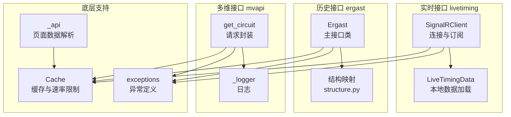
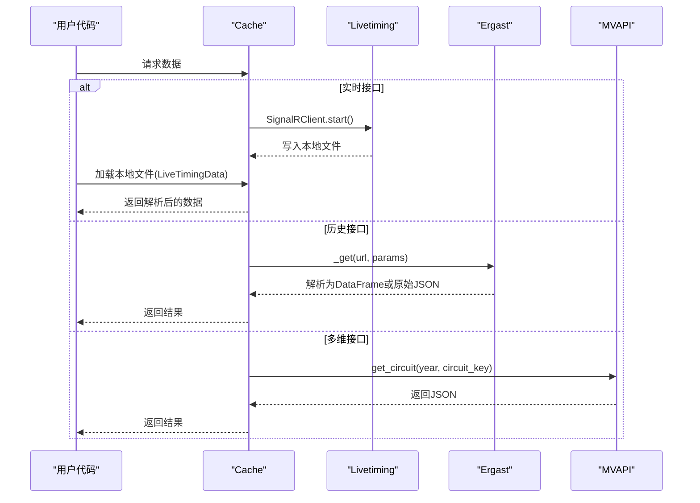
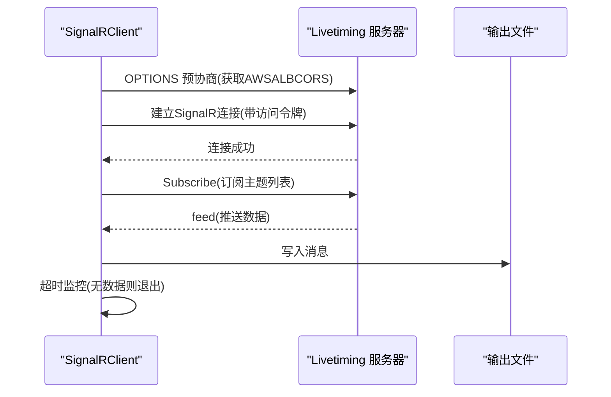
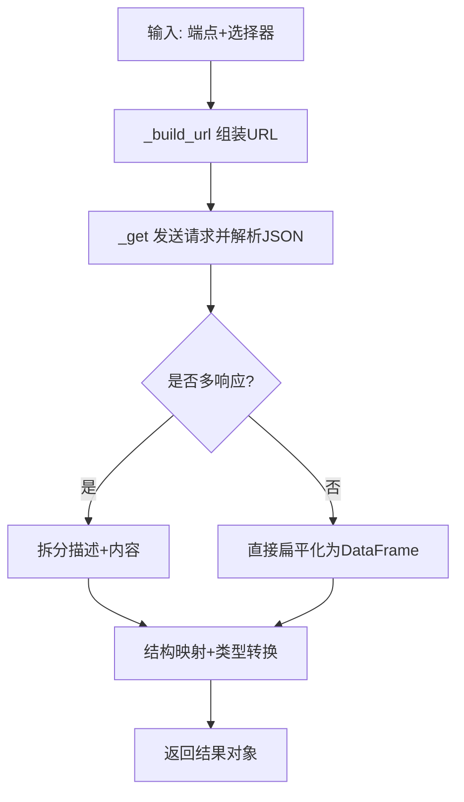
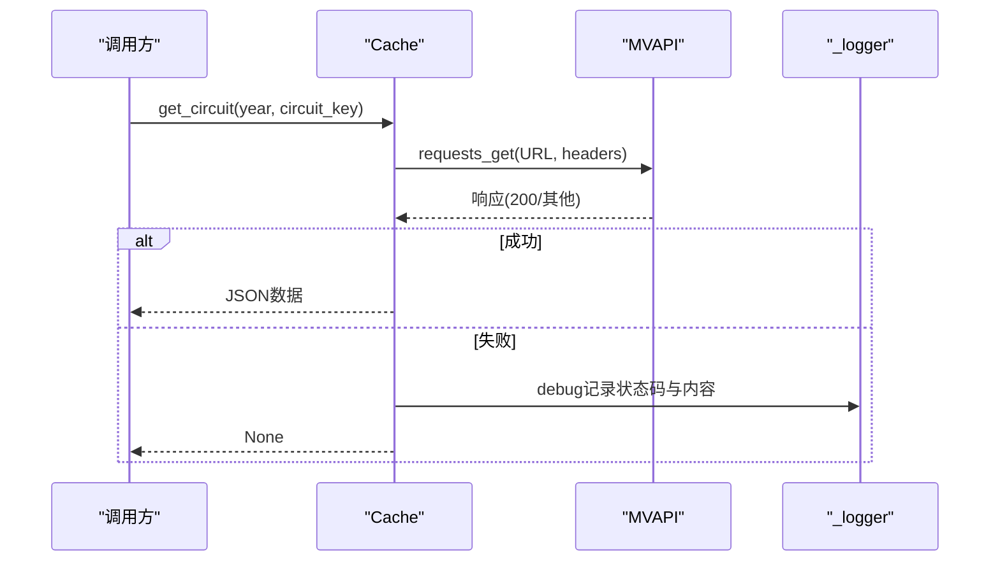
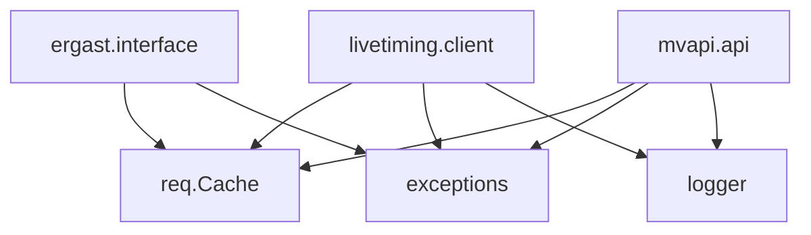

# 数据获取接口

<cite>
**本文档引用的文件**
- [fastf1/livetiming/client.py](file://fastf1/livetiming/client.py)
- [fastf1/livetiming/data.py](file://fastf1/livetiming/data.py)
- [fastf1/ergast/interface.py](file://fastf1/ergast/interface.py)
- [fastf1/ergast/structure.py](file://fastf1/ergast/structure.py)
- [fastf1/mvapi/api.py](file://fastf1/mvapi/api.py)
- [fastf1/mvapi/internals.py](file://fastf1/mvapi/internals.py)
- [fastf1/_api.py](file://fastf1/_api.py)
- [fastf1/api.py](file://fastf1/api.py)
- [fastf1/req.py](file://fastf1/req.py)
- [fastf1/exceptions.py](file://fastf1/exceptions.py)
- [docs/api_reference/livetiming.rst](file://docs/api_reference/livetiming.rst)
- [docs/api_reference/jolpica.rst](file://docs/api_reference/jolpica.rst)
- [fastf1/tests/test_livetiming.py](file://fastf1/tests/test_livetiming.py)
- [fastf1/tests/test_ergast.py](file://fastf1/tests/test_ergast.py)
- [fastf1/tests/test_mvapi.py](file://fastf1/tests/test_mvapi.py)
</cite>

## 目录
1. [简介](#简介)
2. [项目结构](#项目结构)
3. [核心组件](#核心组件)
4. [架构概览](#架构概览)
5. [详细组件分析](#详细组件分析)
6. [依赖关系分析](#依赖关系分析)
7. [性能考虑](#性能考虑)
8. [故障排除指南](#故障排除指南)
9. [结论](#结论)
10. [附录](#附录)

## 简介
本文件为 Fast-F1 项目的数据获取接口提供详细的技术文档，涵盖以下三大接口：
- Livetiming 实时数据接口：用于连接 Formula 1 Livetiming 服务器，订阅实时数据流，保存到本地文件并在会后进行解析。
- Ergast/Jolpica 历史数据接口：用于访问历史赛事数据，支持多种查询参数与结果类型（原始 JSON、Pandas DataFrame）。
- MVAPI 多维数据接口：用于获取赛道信息等多维数据，包含基础的请求封装与日志记录。

文档重点说明各接口的连接建立、数据订阅、实时更新机制；历史数据访问的查询参数与数据格式；多维数据获取的调用方式与注意事项；以及缓存、速率限制、错误处理与重试策略。

## 项目结构
Fast-F1 的数据接口主要分布在以下模块中：
- fastf1.livetiming：实时数据客户端与本地数据对象
- fastf1.ergast：历史数据接口与数据结构定义
- fastf1.mvapi：多维数据接口
- fastf1._api 与 fastf1.api：底层 API 请求与页面数据解析
- fastf1.req：缓存与速率限制实现
- fastf1.exceptions：异常定义
- docs/api_reference：官方 API 参考文档

**图表来源**
- [fastf1/livetiming/client.py:47-232](file://fastf1/livetiming/client.py#L47-L232)
- [fastf1/livetiming/data.py:29-255](file://fastf1/livetiming/data.py#L29-L255)
- [fastf1/ergast/interface.py:401-800](file://fastf1/ergast/interface.py#L401-L800)
- [fastf1/ergast/structure.py:1-653](file://fastf1/ergast/structure.py#L1-L653)
- [fastf1/mvapi/api.py:1-32](file://fastf1/mvapi/api.py#L1-L32)
- [fastf1/mvapi/internals.py:1-5](file://fastf1/mvapi/internals.py#L1-L5)
- [fastf1/_api.py:1-800](file://fastf1/_api.py#L1-L800)
- [fastf1/req.py:132-695](file://fastf1/req.py#L132-L695)
- [fastf1/exceptions.py:1-104](file://fastf1/exceptions.py#L1-L104)

**章节来源**
- [fastf1/livetiming/client.py:1-232](file://fastf1/livetiming/client.py#L1-L232)
- [fastf1/livetiming/data.py:1-255](file://fastf1/livetiming/data.py#L1-L255)
- [fastf1/ergast/interface.py:1-800](file://fastf1/ergast/interface.py#L1-L800)
- [fastf1/ergast/structure.py:1-653](file://fastf1/ergast/structure.py#L1-L653)
- [fastf1/mvapi/api.py:1-32](file://fastf1/mvapi/api.py#L1-L32)
- [fastf1/mvapi/internals.py:1-5](file://fastf1/mvapi/internals.py#L1-L5)
- [fastf1/_api.py:1-800](file://fastf1/_api.py#L1-L800)
- [fastf1/req.py:132-695](file://fastf1/req.py#L132-L695)
- [fastf1/exceptions.py:1-104](file://fastf1/exceptions.py#L1-L104)

## 核心组件
- Livetiming 实时接口
  - SignalRClient：通过 SignalR 协议连接 Formula 1 Livetiming 服务器，订阅多个主题（如 TimingData、WeatherData 等），并将消息写入本地文件。
  - LiveTimingData：从本地录制文件加载数据，按类别组织，并在首次访问时自动加载。
- Ergast/Jolpica 历史接口
  - Ergast：主接口类，提供构建 URL、发起请求、解析响应、分页等功能；支持返回原始 JSON 或 Pandas DataFrame。
  - 结构映射：通过结构定义对嵌套 JSON 进行扁平化、重命名与类型转换。
- MVAPI 多维接口
  - get_circuit：向 MultiViewer API 发起请求，返回指定年份与赛道键值的电路数据。
- 底层支持
  - Cache：统一的缓存与速率限制实现，支持阶段式缓存与离线模式。
  - 异常体系：定义了数据加载、JSON 解析、速率限制等异常类型。

**章节来源**
- [fastf1/livetiming/client.py:47-232](file://fastf1/livetiming/client.py#L47-L232)
- [fastf1/livetiming/data.py:29-255](file://fastf1/livetiming/data.py#L29-L255)
- [fastf1/ergast/interface.py:401-800](file://fastf1/ergast/interface.py#L401-L800)
- [fastf1/ergast/structure.py:1-653](file://fastf1/ergast/structure.py#L1-L653)
- [fastf1/mvapi/api.py:1-32](file://fastf1/mvapi/api.py#L1-L32)
- [fastf1/req.py:132-695](file://fastf1/req.py#L132-L695)
- [fastf1/exceptions.py:1-104](file://fastf1/exceptions.py#L1-L104)

## 架构概览
下图展示了三大接口的调用链路与依赖关系：

**图表来源**
- [fastf1/req.py:260-332](file://fastf1/req.py#L260-L332)
- [fastf1/livetiming/client.py:213-232](file://fastf1/livetiming/client.py#L213-L232)
- [fastf1/livetiming/data.py:71-115](file://fastf1/livetiming/data.py#L71-L115)
- [fastf1/ergast/interface.py:514-532](file://fastf1/ergast/interface.py#L514-L532)
- [fastf1/mvapi/api.py:18-31](file://fastf1/mvapi/api.py#L18-L31)

## 详细组件分析

### Livetiming 实时数据接口
- 连接建立
  - 使用 SignalR Core 客户端连接到 Livetiming 服务器，先进行预协商以获取 AWSALBCORS Cookie，再配置访问令牌工厂与自定义头部。
  - 支持可选的 no_auth 模式（可能仅返回空或部分数据）。
- 数据订阅
  - 订阅多个主题，包括 TimingData、WeatherData、SessionStatus、DriverList 等。
  - 通过回调函数接收消息并写入文件，同时记录最后接收时间戳。
- 实时更新机制
  - 启动后持续监听消息；若超过设定的超时时间未收到数据则主动退出。
  - 文件写入采用追加或覆盖模式，支持多文件合并加载。
- 错误处理与超时
  - 超时检测基于最后消息时间；异常写入文件时记录日志。
  - 提供调试模式（已弃用）与提取工具用于处理调试模式下的原始数据。

**图表来源**
- [fastf1/livetiming/client.py:161-193](file://fastf1/livetiming/client.py#L161-L193)
- [fastf1/livetiming/client.py:194-208](file://fastf1/livetiming/client.py#L194-L208)
- [fastf1/livetiming/client.py:126-149](file://fastf1/livetiming/client.py#L126-L149)

**章节来源**
- [fastf1/livetiming/client.py:47-232](file://fastf1/livetiming/client.py#L47-L232)
- [docs/api_reference/livetiming.rst:1-200](file://docs/api_reference/livetiming.rst#L1-L200)
- [fastf1/tests/test_livetiming.py:1-43](file://fastf1/tests/test_livetiming.py#L1-L43)

### Ergast/Jolpica 历史数据接口
- 接口概述
  - Ergast 主接口类提供多种端点方法（如 get_seasons、get_race_schedule、get_driver_info 等），支持过滤参数与分页。
  - 支持两种返回类型：原始 JSON 列表（ErgastRawResponse）与 Pandas DataFrame（ErgastSimpleResponse/MultiResponse）。
- 查询参数与 URL 构建
  - 通过 _build_url 将端点与选择器组合生成最终 URL；支持 season、round、driver、constructor、circuit、status、standings_position 等参数。
  - 特殊端点（如 drivers、constructors、circuits、status、driverStandings、constructorStandings、laps、pitstops）具有特殊的路径扩展规则。
- 数据解析与类型转换
  - _get 方法负责发送请求并解析 JSON；对非 200 响应抛出异常。
  - _build_result 将响应拆分为描述与内容（多响应场景），并根据结构映射进行扁平化与类型转换。
  - 结构映射（structure.py）定义了键名重命名、类型转换（日期、时间、时长、整数、浮点）与子结构递归处理。
- 分页与结果信息
  - ErgastResponseMixin 提供 total_results、is_complete、get_next_result_page、get_prev_result_page 等分页能力。
  - 通过 response_headers 中的 limit、offset、total 控制分页行为。

**图表来源**
- [fastf1/ergast/interface.py:432-532](file://fastf1/ergast/interface.py#L432-L532)
- [fastf1/ergast/interface.py:534-592](file://fastf1/ergast/interface.py#L534-L592)
- [fastf1/ergast/structure.py:174-265](file://fastf1/ergast/structure.py#L174-L265)

**章节来源**
- [fastf1/ergast/interface.py:401-800](file://fastf1/ergast/interface.py#L401-L800)
- [fastf1/ergast/structure.py:1-653](file://fastf1/ergast/structure.py#L1-L653)
- [docs/api_reference/jolpica.rst:1-340](file://docs/api_reference/jolpica.rst#L1-L340)
- [fastf1/tests/test_ergast.py:335-755](file://fastf1/tests/test_ergast.py#L335-L755)

### MVAPI 多维数据接口
- 接口概述
  - 提供 get_circuit 方法，向 MultiViewer API 请求指定年份与赛道键值的电路数据。
  - 使用 Cache.requests_get 进行缓存与速率限制控制。
- API 密钥与鉴权
  - 当前实现未显式使用 API 密钥；请求头包含 User-Agent。
- 请求限制
  - 通过 Cache 类统一应用速率限制策略（最小间隔与每小时请求数限制）。
- 错误处理
  - 对非 200 响应记录调试日志并返回 None；JSON 解析失败也返回 None。

**图表来源**
- [fastf1/mvapi/api.py:18-31](file://fastf1/mvapi/api.py#L18-L31)
- [fastf1/mvapi/internals.py:1-5](file://fastf1/mvapi/internals.py#L1-L5)
- [fastf1/req.py:260-332](file://fastf1/req.py#L260-L332)

**章节来源**
- [fastf1/mvapi/api.py:1-32](file://fastf1/mvapi/api.py#L1-L32)
- [fastf1/mvapi/internals.py:1-5](file://fastf1/mvapi/internals.py#L1-L5)
- [fastf1/req.py:132-695](file://fastf1/req.py#L132-L695)
- [fastf1/tests/test_mvapi.py:1-43](file://fastf1/tests/test_mvapi.py#L1-L43)

### 底层 API 请求与页面数据解析
- 页面数据解析
  - _api.py 提供 timing_data、car_data、position_data 等函数，将 Livetiming 流式数据解析为结构化的 DataFrame。
  - 支持从 LiveTimingData 或直接从 API 获取数据；当 API 返回空时抛出 SessionNotAvailableError。
- 缓存与速率限制
  - Cache.requests_get 包装 requests，启用阶段式缓存与速率限制；支持离线模式与 CI 模式。
  - 速率限制策略针对不同域名（如 ergast.com）与通用 API 设置不同的硬/软限制。
- 错误处理
  - 对于无法解析的 JSON 或无效请求抛出相应异常；对于实时数据解析中的不一致情况发出警告但尽量返回可用数据。

**章节来源**
- [fastf1/_api.py:106-800](file://fastf1/_api.py#L106-L800)
- [fastf1/api.py:1-34](file://fastf1/api.py#L1-L34)
- [fastf1/req.py:132-695](file://fastf1/req.py#L132-L695)
- [fastf1/exceptions.py:1-104](file://fastf1/exceptions.py#L1-L104)

## 依赖关系分析
- 组件耦合
  - Livetiming 与 Cache：实时接口通过 Cache.requests_get 进行缓存控制（尽管实时数据通常不缓存）。
  - Ergast 与 Cache：历史接口通过 Cache.requests_get 与阶段式缓存提升性能。
  - MVAPI 与 Cache：多维接口同样受 Cache 控制。
- 外部依赖
  - Livetiming：SignalR Core 客户端、AWSALBCORS 预协商。
  - Ergast：Jolpica-F1 API（原 Ergast）。
  - MVAPI：MultiViewer API。
- 循环依赖
  - 未发现循环导入；模块间通过函数调用与对象传递解耦。

**图表来源**
- [fastf1/livetiming/client.py:1-232](file://fastf1/livetiming/client.py#L1-L232)
- [fastf1/ergast/interface.py:1-800](file://fastf1/ergast/interface.py#L1-L800)
- [fastf1/mvapi/api.py:1-32](file://fastf1/mvapi/api.py#L1-L32)
- [fastf1/req.py:132-695](file://fastf1/req.py#L132-L695)
- [fastf1/exceptions.py:1-104](file://fastf1/exceptions.py#L1-L104)

**章节来源**
- [fastf1/req.py:132-695](file://fastf1/req.py#L132-L695)
- [fastf1/exceptions.py:1-104](file://fastf1/exceptions.py#L1-L104)

## 性能考虑
- 缓存策略
  - 默认启用缓存，建议始终开启以减少重复请求与解析开销。
  - 支持阶段式缓存（原始请求与解析结果），并提供清理与离线模式。
- 速率限制
  - 针对 ergast.com 设定每小时调用上限；通用 API 也有相应限制。
  - 通过最小请求间隔与固定窗口内调用次数限制避免触发硬限制。
- 数据解析
  - Livetiming 数据解析包含大量字符串处理与时间对齐逻辑，建议在会后批量处理并启用缓存。
  - Ergast 的结构映射与自动类型转换提升了易用性，但也会增加解析成本。

[本节为通用指导，无需特定文件引用]

## 故障排除指南
- Livetiming
  - 连接失败：检查网络与认证（需 F1TV 订阅）；确认预协商获取 AWSALBCORS Cookie。
  - 超时退出：调整 timeout 参数；确保录制时间覆盖完整会话。
  - 本地数据加载：确认文件格式正确；多文件加载时注意顺序与重叠去重。
- Ergast
  - 无效请求：检查端点与参数组合；某些组合会被服务器拒绝。
  - JSON 解析错误：服务器返回损坏响应时会删除缓存项并抛出异常。
  - 分页问题：使用 is_complete 与 total_results 判断完整性；使用 get_next_result_page/get_prev_result_page。
- MVAPI
  - 非 200 响应：检查年份与赛道键值；查看日志中的状态码与内容。
  - JSON 解析失败：返回 None，建议重试或检查网络。
- 通用
  - 缓存问题：清理缓存或禁用临时缓存；在 CI 模式下仅复用过期缓存。
  - 速率限制：避免并发过高请求；合理设置延迟与限速策略。

**章节来源**
- [fastf1/livetiming/client.py:194-208](file://fastf1/livetiming/client.py#L194-L208)
- [fastf1/ergast/interface.py:514-532](file://fastf1/ergast/interface.py#L514-L532)
- [fastf1/mvapi/api.py:24-31](file://fastf1/mvapi/api.py#L24-L31)
- [fastf1/req.py:350-470](file://fastf1/req.py#L350-L470)
- [fastf1/exceptions.py:45-86](file://fastf1/exceptions.py#L45-L86)

## 结论
Fast-F1 的数据获取接口围绕三大核心模块构建：Livetiming 提供实时数据录制与解析；Ergast/Jolpica 提供历史数据的灵活查询与结构化输出；MVAPI 提供多维数据的补充。通过统一的缓存与速率限制机制，这些接口在保证合规的前提下提供了高效、稳定的访问体验。建议在实际使用中结合缓存策略、合理的请求频率与完善的错误处理，以获得最佳性能与稳定性。

[本节为总结性内容，无需特定文件引用]

## 附录
- 使用场景与适用范围
  - Livetiming：适用于需要实时数据录制与会后分析的场景；需有效期内的 F1TV 订阅。
  - Ergast/Jolpica：适用于历史数据查询与分析；支持多种端点与灵活的过滤参数。
  - MVAPI：适用于需要额外多维数据（如赛道信息）的场景。
- 具体代码示例路径
  - Livetiming 录制与加载：[docs/api_reference/livetiming.rst:27-111](file://docs/api_reference/livetiming.rst#L27-L111)
  - Ergast 简单响应与分页：[docs/api_reference/jolpica.rst:105-313](file://docs/api_reference/jolpica.rst#L105-L313)
  - MVAPI 获取电路信息：[fastf1/tests/test_mvapi.py:15-27](file://fastf1/tests/test_mvapi.py#L15-L27)

[本节为参考索引，无需特定文件引用]