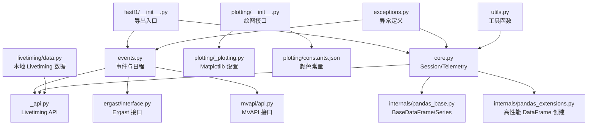
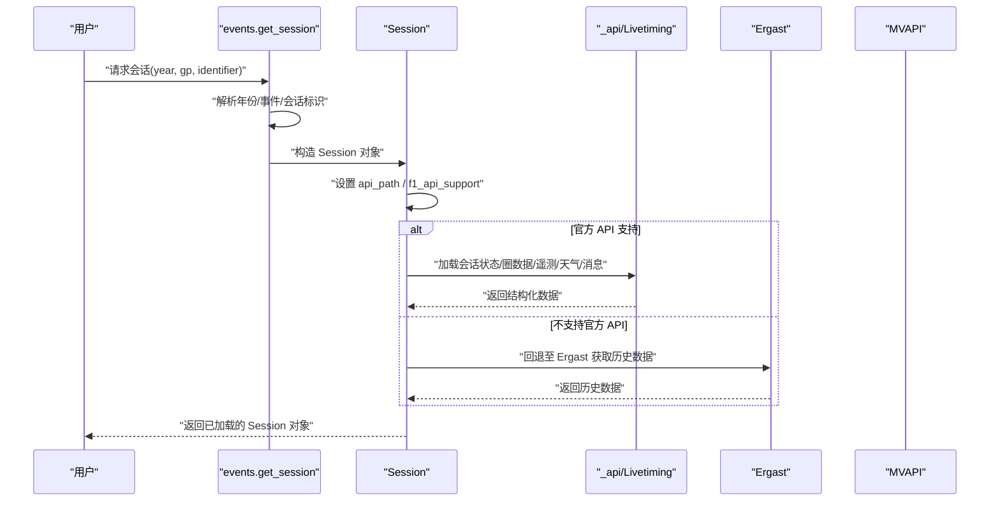
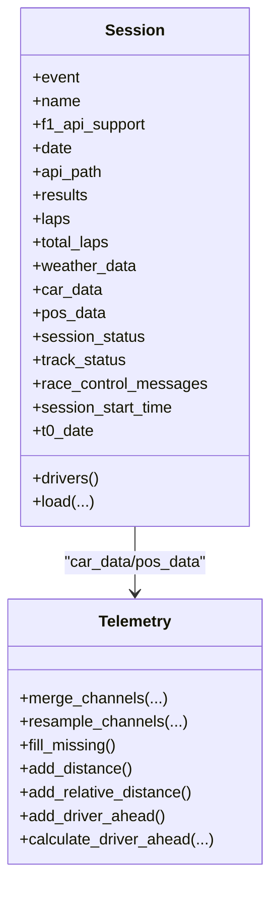
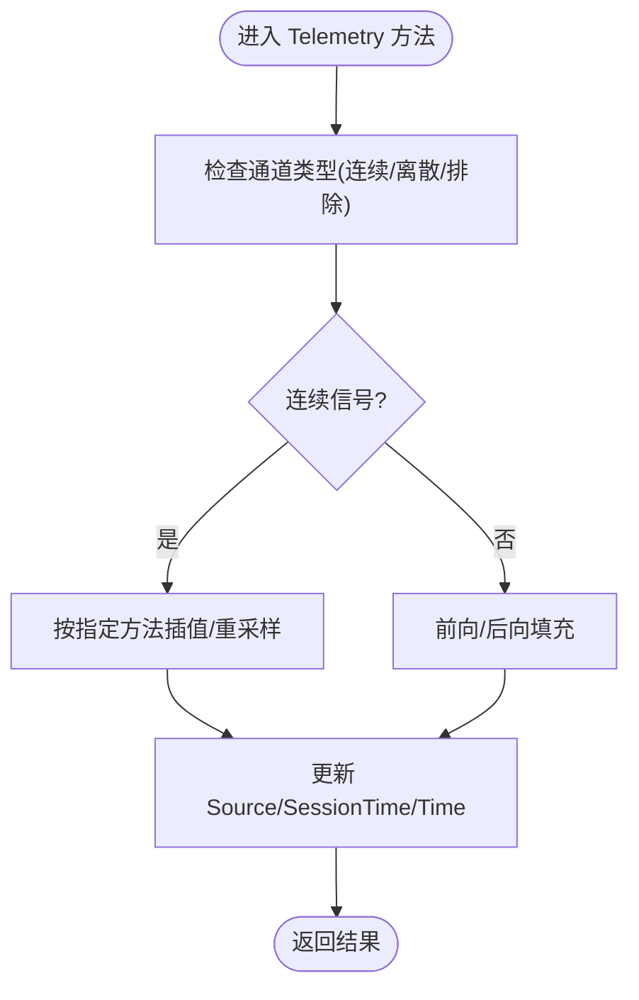
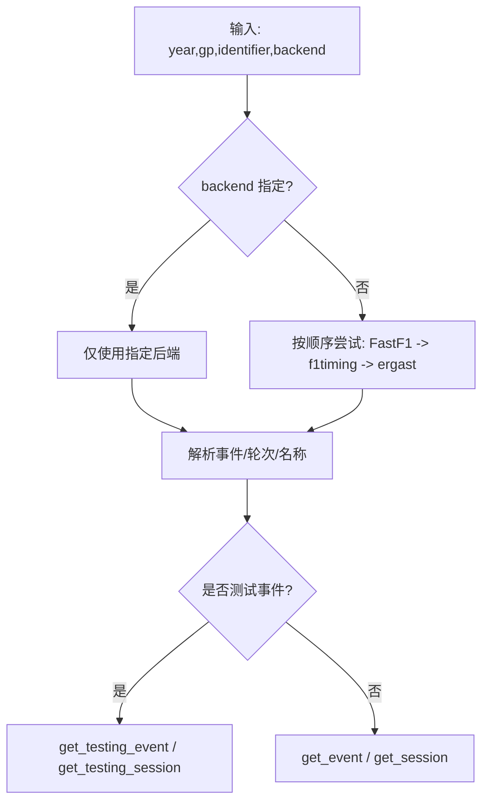
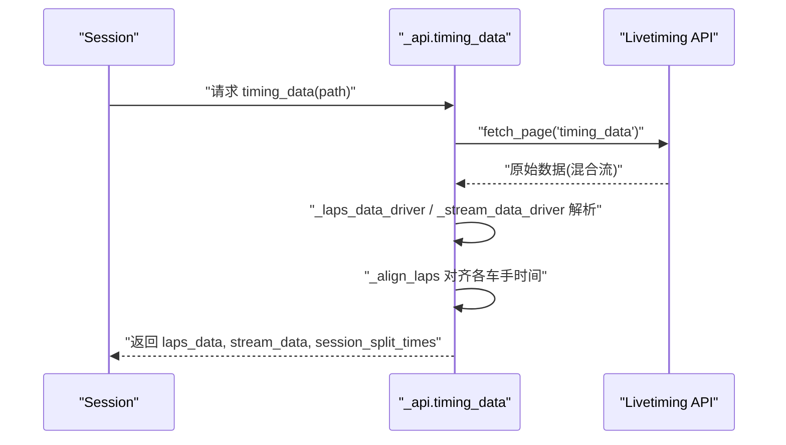
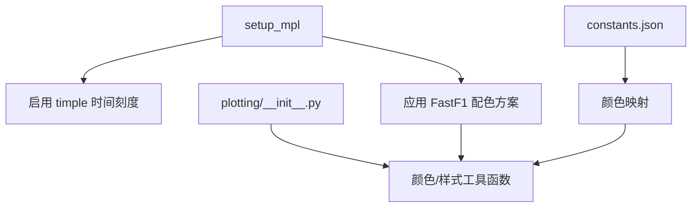
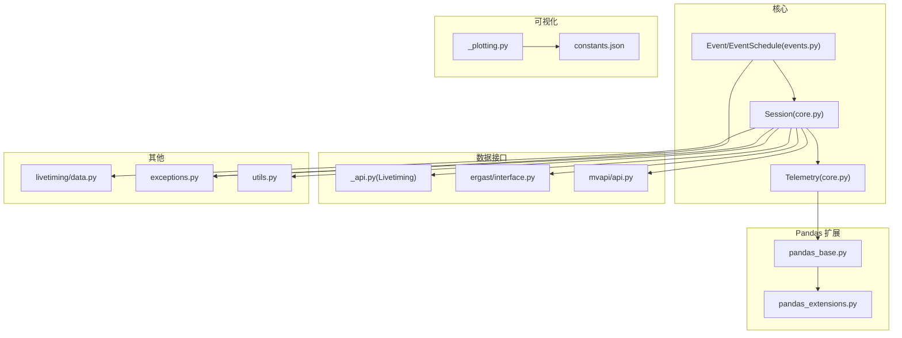

# 核心库 API

<cite>
**本文引用的文件**
- [fastf1/__init__.py](file://fastf1/__init__.py)
- [fastf1/core.py](file://fastf1/core.py)
- [fastf1/events.py](file://fastf1/events.py)
- [fastf1/api.py](file://fastf1/api.py)
- [fastf1/_api.py](file://fastf1/_api.py)
- [fastf1/plotting/__init__.py](file://fastf1/plotting/__init__.py)
- [fastf1/plotting/_plotting.py](file://fastf1/plotting/_plotting.py)
- [fastf1/plotting/constants.json](file://fastf1/plotting/constants.json)
- [fastf1/internals/pandas_base.py](file://fastf1/internals/pandas_base.py)
- [fastf1/internals/pandas_extensions.py](file://fastf1/internals/pandas_extensions.py)
- [fastf1/ergast/interface.py](file://fastf1/ergast/interface.py)
- [fastf1/mvapi/api.py](file://fastf1/mvapi/api.py)
- [fastf1/livetiming/data.py](file://fastf1/livetiming/data.py)
- [fastf1/exceptions.py](file://fastf1/exceptions.py)
- [fastf1/utils.py](file://fastf1/utils.py)
</cite>

## 目录
1. [简介](#简介)
2. [项目结构](#项目结构)
3. [核心组件](#核心组件)
4. [架构总览](#架构总览)
5. [详细组件分析](#详细组件分析)
6. [依赖关系分析](#依赖关系分析)
7. [性能考虑](#性能考虑)
8. [故障排查指南](#故障排查指南)
9. [结论](#结论)
10. [附录](#附录)

## 简介
本文件为 Fast-F1 核心库的全面 API 文档，聚焦于核心数据模型（Session、Telemetry、Event、Driver 等）、事件管理与后端选择机制、数据获取接口（Livetiming API、Ergast 接口、MVAPI 接口）、与 Pandas 的深度集成、可视化支持（Matplotlib 集成与 F1 颜色体系），并提供参数、返回值、异常处理说明与性能优化建议。

## 项目结构
Fast-F1 采用模块化设计，核心模块包括：
- 数据模型与加载：core.py 中的 Session、Telemetry 等
- 事件与日程：events.py 提供 get_session、get_event、get_event_schedule 等
- 数据接口：livetiming API（_api.py）、Ergast 接口（ergast/interface.py）、MVAPI 接口（mvapi/api.py）
- 可视化：plotting 子包提供颜色映射、Matplotlib 设置等
- Pandas 扩展：internals 提供 BaseDataFrame/BaseSeries 与高性能 DataFrame 创建
- 工具与异常：utils、exceptions

图表来源
- [fastf1/__init__.py:17-26](file://fastf1/__init__.py#L17-L26)
- [fastf1/events.py:50-139](file://fastf1/events.py#L50-L139)
- [fastf1/core.py:64-148](file://fastf1/core.py#L64-L148)
- [fastf1/_api.py:24-56](file://fastf1/_api.py#L24-L56)
- [fastf1/ergast/interface.py:401-617](file://fastf1/ergast/interface.py#L401-L617)
- [fastf1/mvapi/api.py:18-32](file://fastf1/mvapi/api.py#L18-L32)
- [fastf1/plotting/__init__.py:1-48](file://fastf1/plotting/__init__.py#L1-L48)
- [fastf1/plotting/_plotting.py:29-106](file://fastf1/plotting/_plotting.py#L29-L106)
- [fastf1/plotting/constants.json:1-768](file://fastf1/plotting/constants.json#L1-L768)
- [fastf1/internals/pandas_base.py:29-140](file://fastf1/internals/pandas_base.py#L29-L140)
- [fastf1/internals/pandas_extensions.py:34-120](file://fastf1/internals/pandas_extensions.py#L34-L120)
- [fastf1/livetiming/data.py:29-200](file://fastf1/livetiming/data.py#L29-L200)
- [fastf1/exceptions.py:40-104](file://fastf1/exceptions.py#L40-L104)
- [fastf1/utils.py:16-200](file://fastf1/utils.py#L16-L200)

章节来源
- [fastf1/__init__.py:17-26](file://fastf1/__init__.py#L17-L26)
- [fastf1/events.py:50-139](file://fastf1/events.py#L50-L139)
- [fastf1/core.py:64-148](file://fastf1/core.py#L64-L148)

## 核心组件
本节概述核心数据模型与关键类的职责与常用方法。

- Session
  - 会话对象，封装事件、日期、API 路径、会话类型等元信息；通过 load 加载各类数据（圈数据、遥测、天气、消息等）。
  - 关键属性：drivers、results、laps、total_laps、weather_data、car_data、pos_data、session_status、track_status、race_control_messages、session_start_time、t0_date。
  - 关键方法：load(...)、_load_* 各种内部加载器。
- Telemetry
  - 多通道时间序列遥测数据容器，支持合并、重采样、缺失值填充、距离计算、相对位置等扩展功能。
  - 关键方法：slice_by_mask、slice_by_lap、slice_by_time、merge_channels、resample_channels、fill_missing、add_distance、add_relative_distance、add_driver_ahead、calculate_driver_ahead 等。
- EventSchedule
  - 按赛季组织的事件日程表，支持模糊匹配、测试赛过滤、按轮次/名称检索。
- Event
  - 单个赛事对象，提供会话日期、格式、是否支持官方 API 等信息。
- Driver/Results
  - 结果与车手信息，由 Session.results 提供。

章节来源
- [fastf1/core.py:1152-1445](file://fastf1/core.py#L1152-L1445)
- [fastf1/core.py:64-148](file://fastf1/core.py#L64-L148)
- [fastf1/events.py:640-800](file://fastf1/events.py#L640-L800)

## 架构总览
Fast-F1 的数据流从“事件与日程”开始，通过后端选择（默认优先 FastF1 后端，回退至 f1timing/ergast）拉取数据，再经由 Session.load 统一整合，最终输出到 Telemetry、Laps、Results 等对象中。可视化层通过 plotting 子包对接 Matplotlib 并应用 F1 颜色体系。

图表来源
- [fastf1/events.py:50-139](file://fastf1/events.py#L50-L139)
- [fastf1/core.py:1358-1445](file://fastf1/core.py#L1358-L1445)
- [fastf1/_api.py:185-248](file://fastf1/_api.py#L185-L248)
- [fastf1/ergast/interface.py:514-592](file://fastf1/ergast/interface.py#L514-L592)

## 详细组件分析

### Session 类
- 职责
  - 封装单场会话的所有元信息与数据访问入口
  - 提供统一的数据加载流程，自动处理官方 API 与 Ergast 的差异
- 关键点
  - 属性懒加载：未加载时访问属性抛出 DataNotLoadedError
  - 会话类型区分：race-like 与 quali-like 的不同处理逻辑
  - 数据整合：lap/timing、tyre info、pit stop、session status、track status、weather、race control messages
- 常用方法
  - load(laps=True, telemetry=True, weather=True, messages=True, livedata=None)
  - _load_session_info/_load_laps_data/_load_telemetry/_load_weather_data/_load_race_control_messages 等

图表来源
- [fastf1/core.py:1152-1445](file://fastf1/core.py#L1152-L1445)
- [fastf1/core.py:64-148](file://fastf1/core.py#L64-L148)

章节来源
- [fastf1/core.py:1152-1445](file://fastf1/core.py#L1152-L1445)

### Telemetry 类
- 职责
  - 表示多通道时间序列遥测数据，支持跨通道合并、重采样、缺失值插值、距离计算等
- 关键点
  - 内置通道类型与插值策略（连续/离散/排除）
  - 支持基于 Lap/Time 的切片
  - 与 Session 的 t0_date、SessionTime 等时间基准保持一致
- 常用方法
  - slice_by_mask/slice_by_lap/slice_by_time
  - merge_channels/resample_channels/fill_missing
  - add_distance/add_relative_distance/add_driver_ahead/calculate_driver_ahead

图表来源
- [fastf1/core.py:391-569](file://fastf1/core.py#L391-L569)
- [fastf1/core.py:624-690](file://fastf1/core.py#L624-L690)

章节来源
- [fastf1/core.py:64-148](file://fastf1/core.py#L64-L148)
- [fastf1/core.py:391-569](file://fastf1/core.py#L391-L569)
- [fastf1/core.py:624-690](file://fastf1/core.py#L624-L690)

### 事件管理系统与后端选择
- get_session/year/gp/identifier/backend/exact_match
  - 支持模糊匹配与精确匹配；默认优先 FastF1 后端，不支持时回退至 f1timing/ergast
  - 测试会话使用 get_testing_session/get_testing_event
- get_event_schedule/include_testing/backend
  - 组织按年份的事件日程，支持过滤测试赛
- 后端实现
  - FastF1 后端：_get_schedule_ff1
  - F1 官方 API：_get_schedule_from_f1_timing
  - Ergast：_get_schedule_from_ergast

图表来源
- [fastf1/events.py:50-139](file://fastf1/events.py#L50-L139)
- [fastf1/events.py:285-342](file://fastf1/events.py#L285-L342)
- [fastf1/events.py:404-460](file://fastf1/events.py#L404-L460)
- [fastf1/events.py:462-546](file://fastf1/events.py#L462-L546)
- [fastf1/events.py:549-637](file://fastf1/events.py#L549-L637)

章节来源
- [fastf1/events.py:50-139](file://fastf1/events.py#L50-L139)
- [fastf1/events.py:285-342](file://fastf1/events.py#L285-L342)

### 数据获取接口

#### Livetiming API（_api.py）
- 作用
  - 从 F1 官方 Livetiming API 拉取实时/历史数据，包括 timing_data、timing_app_data、car_data、position、weather、track_status、session_status、race_control_messages、lap_count、driver_info 等
- 关键流程
  - timing_data/_extended_timing_data：解析混合流数据，对齐各车手圈次起止时间，生成 laps_data 与 stream_data，并返回 session_split_times
  - _align_laps：基于“领先者差距”对齐不同车手的 lap 时间
- 错误处理
  - SessionNotAvailableError：会话无数据
  - soft_exceptions 包裹部分加载过程，失败时降级返回

图表来源
- [fastf1/_api.py:106-182](file://fastf1/_api.py#L106-L182)
- [fastf1/_api.py:185-248](file://fastf1/_api.py#L185-L248)
- [fastf1/_api.py:251-350](file://fastf1/_api.py#L251-L350)
- [fastf1/_api.py:360-771](file://fastf1/_api.py#L360-L771)

章节来源
- [fastf1/_api.py:106-182](file://fastf1/_api.py#L106-L182)
- [fastf1/_api.py:185-248](file://fastf1/_api.py#L185-L248)

#### Ergast 接口（ergast/interface.py）
- 作用
  - 提供历史数据查询能力，如赛季、分站赛、车手、车队、排位、冲刺赛、正赛结果等
- 特性
  - ErgastResponseMixin：分页支持（total_results、is_complete、get_next_result_page、get_prev_result_page）
  - ErgastResultFrame/ErgastRawResponse/ErgastSimpleResponse/ErgastMultiResponse：多种响应类型与自动类型转换
  - _build_url/_get/_build_result：统一构建 URL、请求与拆分响应
- 使用
  - 通过 Ergast 实例调用对应 endpoint 方法（如 get_race_schedule、get_driver_info、get_race_results 等）

章节来源
- [fastf1/ergast/interface.py:40-120](file://fastf1/ergast/interface.py#L40-L120)
- [fastf1/ergast/interface.py:401-617](file://fastf1/ergast/interface.py#L401-L617)

#### MVAPI 接口（mvapi/api.py）
- 作用
  - 从 MultiViewer API 获取赛道信息（如 get_circuit），用于补充地理与布局数据
- 返回
  - 成功返回 JSON 字典，否则返回 None

章节来源
- [fastf1/mvapi/api.py:18-32](file://fastf1/mvapi/api.py#L18-L32)

### 与 Pandas 的集成
- BaseDataFrame/BaseSeries
  - 自定义 DataFrame/Series 基类，确保切片返回同类型对象，支持默认列强制与类型转换
- 高性能 DataFrame 创建
  - create_df_fast：在满足条件时跳过部分 pandas 内部步骤以提升性能，失败时回退

章节来源
- [fastf1/internals/pandas_base.py:29-140](file://fastf1/internals/pandas_base.py#L29-L140)
- [fastf1/internals/pandas_extensions.py:34-120](file://fastf1/internals/pandas_extensions.py#L34-L120)

### 可视化支持（Matplotlib 与 F1 颜色）
- setup_mpl
  - 可选设置，启用 timedelta 刻度支持（timple）与 FastF1 配色方案
- 颜色常量
  - constants.json：按年份维护复合材料与车队颜色映射
- 导出接口
  - plotting/__init__.py 暴露颜色与样式相关函数（如 get_driver_color、get_team_color、set_default_colormap 等）

图表来源
- [fastf1/plotting/_plotting.py:29-106](file://fastf1/plotting/_plotting.py#L29-L106)
- [fastf1/plotting/constants.json:1-768](file://fastf1/plotting/constants.json#L1-L768)
- [fastf1/plotting/__init__.py:1-48](file://fastf1/plotting/__init__.py#L1-L48)

章节来源
- [fastf1/plotting/_plotting.py:29-106](file://fastf1/plotting/_plotting.py#L29-L106)
- [fastf1/plotting/constants.json:1-768](file://fastf1/plotting/constants.json#L1-L768)
- [fastf1/plotting/__init__.py:1-48](file://fastf1/plotting/__init__.py#L1-L48)

### 工具与实用函数
- utils
  - delta_time：沿距离轴计算两圈的差值（已标记为弃用，结果准确性有限）
  - to_timedelta/to_datetime：快速字符串转时间类型
  - recursive_dict_get：递归字典取值
- livetiming/data
  - LiveTimingData：从本地文件加载 Livetiming 数据，支持去重与时间对齐

章节来源
- [fastf1/utils.py:16-200](file://fastf1/utils.py#L16-L200)
- [fastf1/livetiming/data.py:29-200](file://fastf1/livetiming/data.py#L29-L200)

## 依赖关系分析

图表来源
- [fastf1/core.py:1152-1445](file://fastf1/core.py#L1152-L1445)
- [fastf1/events.py:640-800](file://fastf1/events.py#L640-L800)
- [fastf1/_api.py:24-56](file://fastf1/_api.py#L24-L56)
- [fastf1/ergast/interface.py:401-617](file://fastf1/ergast/interface.py#L401-L617)
- [fastf1/mvapi/api.py:18-32](file://fastf1/mvapi/api.py#L18-L32)
- [fastf1/plotting/_plotting.py:29-106](file://fastf1/plotting/_plotting.py#L29-L106)
- [fastf1/plotting/constants.json:1-768](file://fastf1/plotting/constants.json#L1-L768)
- [fastf1/internals/pandas_base.py:29-140](file://fastf1/internals/pandas_base.py#L29-L140)
- [fastf1/internals/pandas_extensions.py:34-120](file://fastf1/internals/pandas_extensions.py#L34-L120)
- [fastf1/livetiming/data.py:29-200](file://fastf1/livetiming/data.py#L29-L200)
- [fastf1/exceptions.py:40-104](file://fastf1/exceptions.py#L40-L104)
- [fastf1/utils.py:16-200](file://fastf1/utils.py#L16-L200)

章节来源
- [fastf1/core.py:1152-1445](file://fastf1/core.py#L1152-L1445)
- [fastf1/events.py:640-800](file://fastf1/events.py#L640-L800)

## 性能考虑
- 遥测重采样
  - 默认保留原始采样频率，避免人为插值导致精度损失；仅在必要时指定整数频率进行重采样
- DataFrame 创建
  - 在满足条件时使用 create_df_fast 跳过部分 pandas 内部步骤；失败自动回退
- 缺失值处理
  - 连续信号使用插值，离散信号使用前/后向填充；注意 dtype 一致性与警告提示
- 事件日程与模糊匹配
  - 使用国家/地点/名称/官方名称进行模糊匹配，短名称需≥4 字符；必要时开启精确匹配
- 可视化
  - setup_mpl 启用 timple 以改善 timedelta 刻度显示；合理设置颜色方案与字体参数

章节来源
- [fastf1/core.py:391-569](file://fastf1/core.py#L391-L569)
- [fastf1/internals/pandas_extensions.py:34-120](file://fastf1/internals/pandas_extensions.py#L34-L120)
- [fastf1/events.py:758-777](file://fastf1/events.py#L758-L777)
- [fastf1/plotting/_plotting.py:29-106](file://fastf1/plotting/_plotting.py#L29-L106)

## 故障排查指南
- 异常类型
  - DataNotLoadedError：访问尚未加载的数据
  - NoLapDataError：API 返回可用数据为空
  - FuzzyMatchError：模糊匹配置信度过低或名称过短
  - RateLimitExceededError：超过硬性速率限制
- 常见问题
  - 会话无数据：检查 f1_api_support 与 backend 选择；确认会话是否刚结束或尚未开始
  - 遥测时间对齐异常：确认是否正确传入 SessionTime 与 t0_date；避免跨会话拼接
  - Ergast 解析错误：检查 JSON 解析与服务器响应码
- 建议
  - 使用 soft_exceptions 包裹非关键路径，保证主流程稳定性
  - 对于历史数据，优先使用 Ergast；对于实时数据，优先使用官方 API

章节来源
- [fastf1/exceptions.py:40-104](file://fastf1/exceptions.py#L40-L104)
- [fastf1/_api.py:185-248](file://fastf1/_api.py#L185-L248)
- [fastf1/ergast/interface.py:514-592](file://fastf1/ergast/interface.py#L514-L592)

## 结论
Fast-F1 通过清晰的模块划分与稳健的错误处理，提供了从事件日程到会话数据、从 Livetiming/Ergast/MVAPI 到 Pandas/可视化的一体化体验。遵循本文的参数说明、异常处理与性能建议，可高效构建高质量的 Formula 1 数据分析与可视化应用。

## 附录
- 快速上手示例（路径参考）
  - 获取会话并加载数据：[fastf1/events.py:50-139](file://fastf1/events.py#L50-L139)
  - 加载遥测并绘制速度轨迹：[fastf1/core.py:1358-1445](file://fastf1/core.py#L1358-L1445)
  - 使用 Ergast 查询分站赛日程：[fastf1/ergast/interface.py:682-747](file://fastf1/ergast/interface.py#L682-L747)
  - 设置 Matplotlib 与 F1 颜色：[fastf1/plotting/_plotting.py:29-106](file://fastf1/plotting/_plotting.py#L29-L106)
  - 访问颜色映射常量：[fastf1/plotting/constants.json:1-768](file://fastf1/plotting/constants.json#L1-L768)