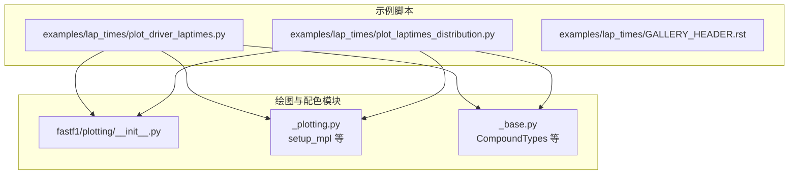
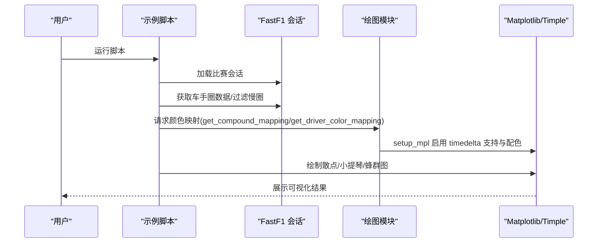
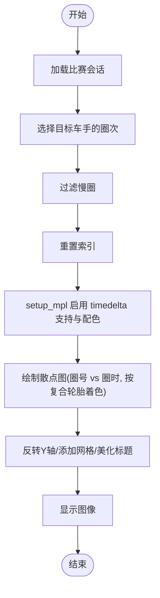
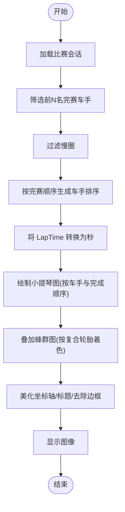
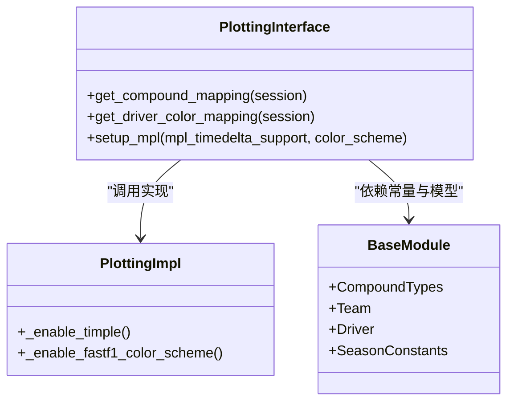
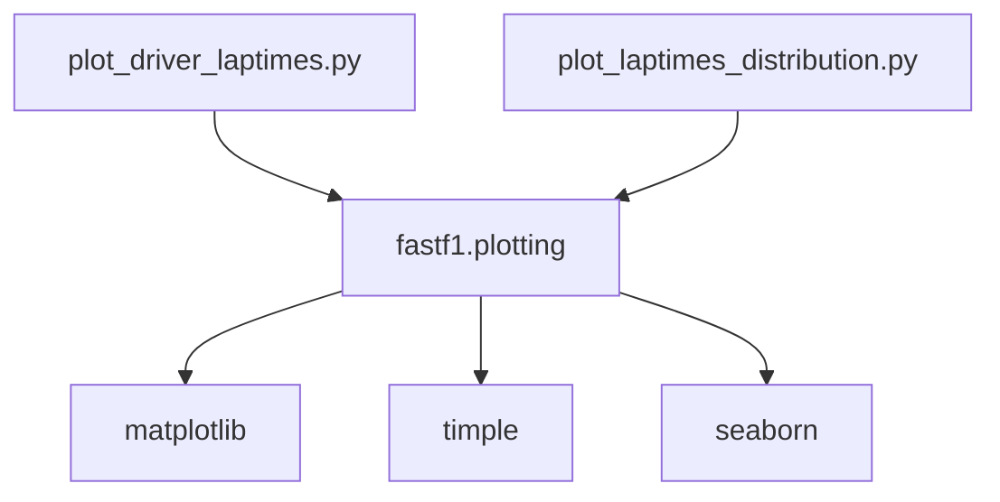

# 圈时分析示例

<cite>
**本文引用的文件**
- [examples/lap_times/plot_driver_laptimes.py](file://examples/lap_times/plot_driver_laptimes.py)
- [examples/lap_times/plot_laptimes_distribution.py](file://examples/lap_times/plot_laptimes_distribution.py)
- [fastf1/plotting/__init__.py](file://fastf1/plotting/__init__.py)
- [fastf1/plotting/_plotting.py](file://fastf1/plotting/_plotting.py)
- [fastf1/plotting/_base.py](file://fastf1/plotting/_base.py)
- [fastf1/__init__.py](file://fastf1/__init__.py)
- [examples/lap_times/GALLERY_HEADER.rst](file://examples/lap_times/GALLERY_HEADER.rst)
</cite>

## 目录
1. [简介](#简介)
2. [项目结构](#项目结构)
3. [核心组件](#核心组件)
4. [架构总览](#架构总览)
5. [详细组件分析](#详细组件分析)
6. [依赖分析](#依赖分析)
7. [性能考虑](#性能考虑)
8. [故障排查指南](#故障排查指南)
9. [结论](#结论)
10. [附录](#附录)

## 简介
本教程围绕 Fast-F1 的圈时（lap time）分析示例展开，系统讲解如何使用官方示例脚本进行车手圈时数据的可视化与统计分析。重点覆盖以下主题：
- 个人最佳圈时对比：通过散点图展示单个车手在比赛中的圈时变化，按复合轮胎类型着色，识别进站窗口与用胎策略对圈时的影响。
- 圈时分布统计：通过小提琴图与蜂群图组合展示多名车手的圈时分布，结合完成顺序排序，直观比较不同车手的稳定性与一致性。
- 整体性能评估：基于分布统计与时间序列趋势，总结车手驾驶风格差异与赛车性能特点。

教程将逐段解析示例脚本的实现思路与分析逻辑，并提供数据处理技巧、统计方法与可视化建议，帮助读者从圈时数据中提炼可操作的洞察。

## 项目结构
与圈时分析直接相关的示例位于 examples/lap_times 目录，包含两个核心脚本：
- plot_driver_laptimes.py：单车手圈时时间序列散点图，按复合轮胎类型上色。
- plot_laptimes_distribution.py：多车手圈时分布可视化，结合完成顺序排序与复合轮胎颜色映射。

绘图与配色由 fastf1.plotting 模块提供支持，包括：
- setup_mpl：启用 Matplotlib 对 timedelta 的支持与 FastF1 配色方案。
- get_compound_mapping / get_driver_color_mapping：获取复合轮胎与车手的颜色映射。
- 基础常量与模型：定义复合轮胎类型枚举、团队与车手数据结构等。

**图表来源**
- [examples/lap_times/plot_driver_laptimes.py:1-66](file://examples/lap_times/plot_driver_laptimes.py#L1-L66)
- [examples/lap_times/plot_laptimes_distribution.py:1-81](file://examples/lap_times/plot_laptimes_distribution.py#L1-L81)
- [fastf1/plotting/__init__.py:1-48](file://fastf1/plotting/__init__.py#L1-L48)
- [fastf1/plotting/_plotting.py:1-106](file://fastf1/plotting/_plotting.py#L1-L106)
- [fastf1/plotting/_base.py:1-148](file://fastf1/plotting/_base.py#L1-L148)

**章节来源**
- [examples/lap_times/GALLERY_HEADER.rst:1-3](file://examples/lap_times/GALLERY_HEADER.rst#L1-L3)

## 核心组件
- 示例脚本
  - 单车手圈时散点图：以圈号为横轴、圈时为纵轴，按复合轮胎类型上色，过滤慢圈以避免轴域失真，反转 Y 轴以符合时间递减的直觉。
  - 多车手圈时分布：先筛选正赛前 N 名车手，过滤慢圈，再以完成顺序排序绘制小提琴图与蜂群图，复合轮胎颜色映射到蜂群点。
- 绘图与配色支持
  - setup_mpl：启用 timedelta 支持与 FastF1 深色配色；内部通过外部包 timple 实现 tick 转换器与格式化器。
  - get_compound_mapping / get_driver_color_mapping：返回复合轮胎与车手的颜色映射字典，用于 Seaborn 的 hue 与 palette 参数。
  - CompoundTypes：定义复合轮胎类型枚举，确保颜色映射与可视化的一致性。

**章节来源**
- [examples/lap_times/plot_driver_laptimes.py:1-66](file://examples/lap_times/plot_driver_laptimes.py#L1-L66)
- [examples/lap_times/plot_laptimes_distribution.py:1-81](file://examples/lap_times/plot_laptimes_distribution.py#L1-L81)
- [fastf1/plotting/__init__.py:1-48](file://fastf1/plotting/__init__.py#L1-L48)
- [fastf1/plotting/_plotting.py:1-106](file://fastf1/plotting/_plotting.py#L1-L106)
- [fastf1/plotting/_base.py:1-148](file://fastf1/plotting/_base.py#L1-L148)

## 架构总览
下图展示了从会话加载到可视化输出的关键流程，以及各模块之间的依赖关系。

**图表来源**
- [examples/lap_times/plot_driver_laptimes.py:14-66](file://examples/lap_times/plot_driver_laptimes.py#L14-L66)
- [examples/lap_times/plot_laptimes_distribution.py:13-81](file://examples/lap_times/plot_laptimes_distribution.py#L13-L81)
- [fastf1/plotting/_plotting.py:29-106](file://fastf1/plotting/_plotting.py#L29-L106)

## 详细组件分析

### 组件 A：单车手圈时散点图（plot_driver_laptimes.py）
- 数据准备
  - 加载指定年份、分站与会话类型的比赛数据。
  - 选择特定车手的全部圈次，并过滤“慢圈”（如黄旗、虚拟安全车期间、进站等），以避免轴域被极端值拉伸。
  - 使用 reset_index 重置索引，便于后续绘图。
- 可视化实现
  - 使用 Seaborn 的散点图，横轴为圈号，纵轴为圈时（timedelta），按复合轮胎类型上色。
  - 反转 Y 轴以符合时间越短越优的直观理解。
  - 应用 FastF1 配色方案与网格线增强可读性。
- 分析要点
  - 观察圈时随比赛进程的变化趋势，识别进站窗口前后或更换复合轮胎后的性能波动。
  - 结合复合轮胎类型，判断用胎策略对圈时的影响。

**图表来源**
- [examples/lap_times/plot_driver_laptimes.py:14-66](file://examples/lap_times/plot_driver_laptimes.py#L14-L66)
- [fastf1/plotting/_plotting.py:29-106](file://fastf1/plotting/_plotting.py#L29-L106)

**章节来源**
- [examples/lap_times/plot_driver_laptimes.py:1-66](file://examples/lap_times/plot_driver_laptimes.py#L1-L66)

### 组件 B：多车手圈时分布可视化（plot_laptimes_distribution.py）
- 数据准备
  - 仅选取正赛前若干名完赛车手，过滤慢圈，构建统一的数据框。
  - 按最终完赛排名获取车手三字缩写，形成绘图顺序。
- 可视化实现
  - 小提琴图：展示每个车手的圈时密度分布，设置面积归一化，突出分布形状。
  - 蜂群图：叠加实际圈时点，按复合轮胎类型上色，便于观察异常值与离群点。
  - 时间单位转换：由于 Seaborn 对 timedelta 支持有限，需将 LapTime 转换为秒。
- 分析要点
  - 小提琴图反映稳定性：分布越窄代表圈时越稳定；分布偏斜可能指示策略或状态波动。
  - 蜂群图辅助识别异常快/慢圈，定位进站时机或轮胎衰减影响。

**图表来源**
- [examples/lap_times/plot_laptimes_distribution.py:13-81](file://examples/lap_times/plot_laptimes_distribution.py#L13-L81)
- [fastf1/plotting/_plotting.py:29-106](file://fastf1/plotting/_plotting.py#L29-L106)

**章节来源**
- [examples/lap_times/plot_laptimes_distribution.py:1-81](file://examples/lap_times/plot_laptimes_distribution.py#L1-L81)

### 组件 C：绘图与配色支持（fastf1/plotting）
- setup_mpl
  - 启用 timedelta 支持：通过外部包 timple 注册转换器、格式化器与定位器，使 Matplotlib 能正确渲染 timedelta 类型的时间刻度。
  - 启用 FastF1 配色：设置深色背景、浅色文字与线条颜色、字体参数与颜色循环，统一示例图像风格。
- 颜色映射
  - get_compound_mapping：返回复合轮胎类型到颜色的映射，用于区分 SOFT/MEDIUM/HARD 等。
  - get_driver_color_mapping：返回车手到颜色的映射，用于按车手分组的可视化。
- 基础常量与模型
  - CompoundTypes：定义复合轮胎类型枚举，保证颜色映射与可视化一致。
  - 团队与车手数据结构：为颜色映射与图例提供基础数据。

**图表来源**
- [fastf1/plotting/__init__.py:1-48](file://fastf1/plotting/__init__.py#L1-L48)
- [fastf1/plotting/_plotting.py:29-106](file://fastf1/plotting/_plotting.py#L29-L106)
- [fastf1/plotting/_base.py:18-148](file://fastf1/plotting/_base.py#L18-L148)

**章节来源**
- [fastf1/plotting/__init__.py:1-48](file://fastf1/plotting/__init__.py#L1-L48)
- [fastf1/plotting/_plotting.py:1-106](file://fastf1/plotting/_plotting.py#L1-L106)
- [fastf1/plotting/_base.py:1-148](file://fastf1/plotting/_base.py#L1-L148)

## 依赖分析
- 示例脚本依赖关系
  - plot_driver_laptimes.py 与 plot_laptimes_distribution.py 均依赖 fastf1.plotting 提供的颜色映射与绘图设置。
  - 两者均通过 setup_mpl 启用 timedelta 支持，确保能正确绘制 timedelta 类型的圈时。
- 外部依赖
  - timple：为 Matplotlib 提供 timedelta 的转换器与格式化器，是启用 mpl_timedelta_support 的关键。
  - seaborn：用于高级统计图形（小提琴图、蜂群图、散点图）。
  - matplotlib：底层绘图引擎，配合 timple 与 FastF1 配色方案。

**图表来源**
- [examples/lap_times/plot_driver_laptimes.py:14-16](file://examples/lap_times/plot_driver_laptimes.py#L14-L16)
- [examples/lap_times/plot_laptimes_distribution.py:13-15](file://examples/lap_times/plot_laptimes_distribution.py#L13-L15)
- [fastf1/plotting/_plotting.py:4-16](file://fastf1/plotting/_plotting.py#L4-L16)

**章节来源**
- [examples/lap_times/plot_driver_laptimes.py:14-16](file://examples/lap_times/plot_driver_laptimes.py#L14-L16)
- [examples/lap_times/plot_laptimes_distribution.py:13-15](file://examples/lap_times/plot_laptimes_distribution.py#L13-L15)
- [fastf1/plotting/_plotting.py:4-16](file://fastf1/plotting/_plotting.py#L4-L16)

## 性能考虑
- 数据过滤
  - 在绘制前过滤慢圈可显著提升可视化稳定性与可读性，避免极端值拉伸轴域。
- 时间单位转换
  - 小提琴图与蜂群图对 timedelta 支持有限，建议在绘图前将时间转换为秒，减少不必要的类型转换开销。
- 颜色映射缓存
  - 若多次复用相同会话的颜色映射，可缓存 get_compound_mapping 与 get_driver_color_mapping 的结果，降低重复计算成本。
- 图像尺寸与分辨率
  - 合理设置图像尺寸与 DPI，平衡清晰度与导出速度。

## 故障排查指南
- 无法显示 timedelta 刻度
  - 确认已调用 setup_mpl 并启用 mpl_timedelta_support；若未安装 timple，将无法正确格式化时间刻度。
- 颜色映射不生效
  - 检查是否传入正确的会话对象给颜色映射函数；确认复合轮胎名称与映射键一致。
- 图像背景与文字颜色不匹配
  - 确认已启用 FastF1 配色方案；检查是否在绘图前调用了 setup_mpl。
- 速度过慢或内存占用高
  - 确保在绘图前过滤慢圈；避免在大数据集上重复转换时间单位；必要时分批绘制或采样。

**章节来源**
- [fastf1/plotting/_plotting.py:29-106](file://fastf1/plotting/_plotting.py#L29-L106)

## 结论
通过这两个示例脚本，可以高效地完成单车手与多车手的圈时分析与可视化。结合颜色映射与统计图形，能够快速识别用胎策略、进站时机与驾驶风格差异。建议在实际分析中：
- 先过滤慢圈，再进行可视化；
- 使用完成顺序排序，增强对比效果；
- 将 timedelta 转换为秒后再绘制，确保兼容性；
- 结合分布图与时间序列图，综合评估稳定性与趋势。

## 附录
- 快速上手步骤
  - 安装依赖：确保已安装 fastf1、matplotlib、seaborn、timple（可选但推荐）。
  - 运行示例：直接执行示例脚本，观察可视化输出。
  - 自定义分析：替换会话参数与车手列表，扩展到其他比赛与车手组合。
- 相关入口
  - 会话入口：通过 fastf1.events.get_session 获取指定年份、分站与会话类型的比赛数据。

**章节来源**
- [fastf1/__init__.py:17-24](file://fastf1/__init__.py#L17-L24)