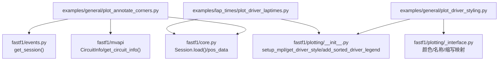
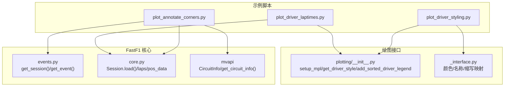
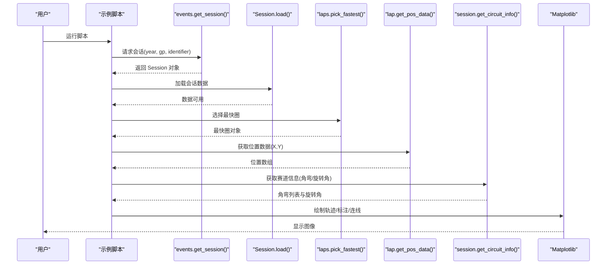
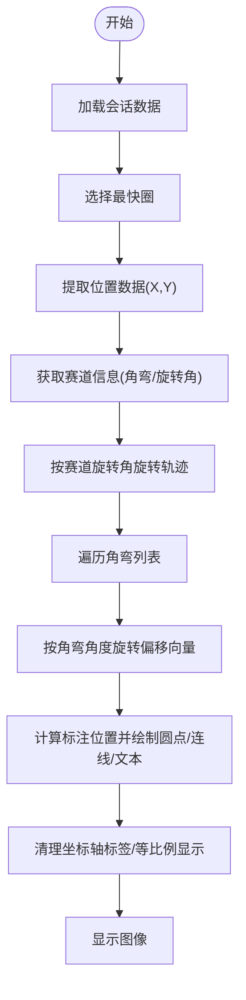
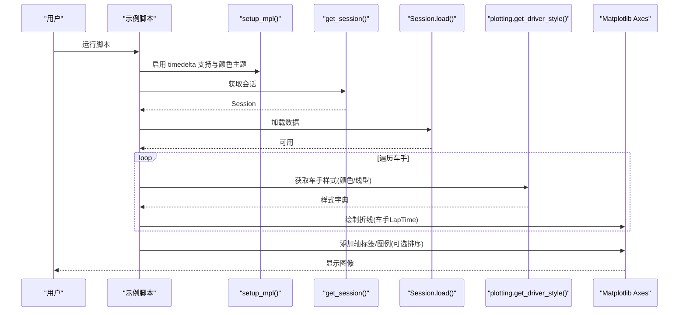
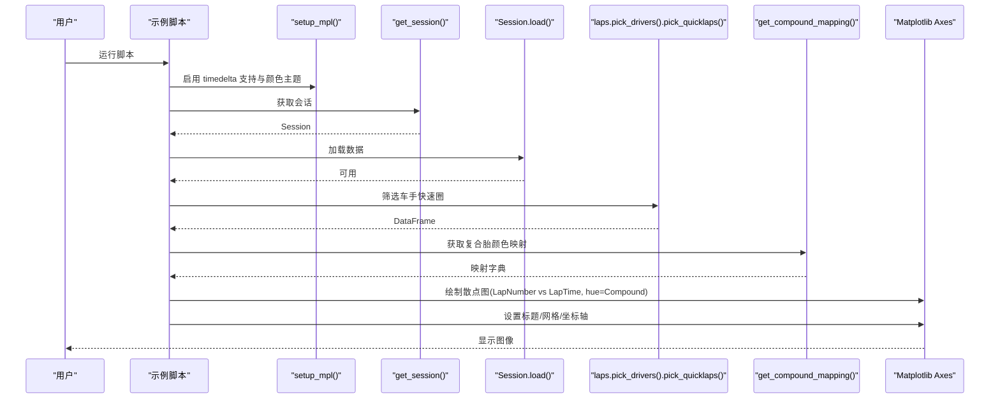
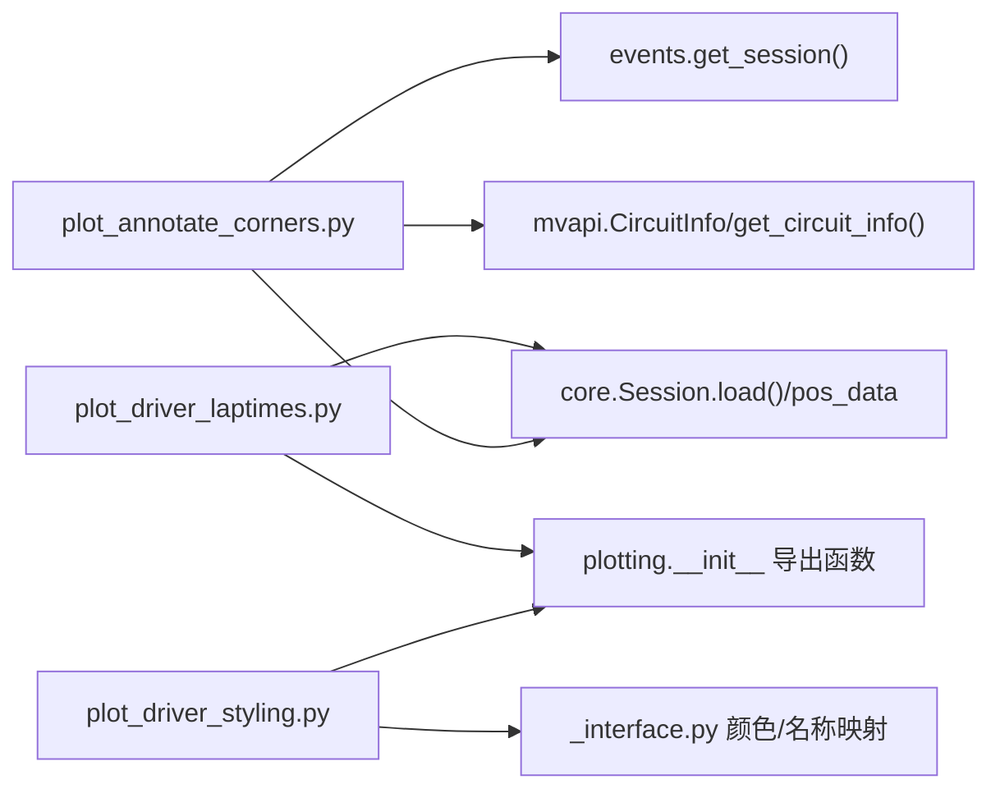

# 基础示例

<cite>
**本文引用的文件**   
- [plot_annotate_corners.py](file://examples/general/plot_annotate_corners.py)
- [plot_driver_styling.py](file://examples/general/plot_driver_styling.py)
- [plot_driver_laptimes.py](file://examples/lap_times/plot_driver_laptimes.py)
- [__init__.py](file://fastf1/__init__.py)
- [events.py](file://fastf1/events.py)
- [core.py](file://fastf1/core.py)
- [plotting/__init__.py](file://fastf1/plotting/__init__.py)
- [_interface.py](file://fastf1/plotting/_interface.py)
- [basics.rst](file://docs/getting_started/basics.rst)
- [plotting_data.rst](file://docs/api_reference/plotting_data.rst)
- [loading_data.rst](file://docs/api_reference/loading_data.rst)
</cite>

## 目录
1. [简介](#简介)
2. [项目结构](#项目结构)
3. [核心组件](#核心组件)
4. [架构总览](#架构总览)
5. [详细组件分析](#详细组件分析)
6. [依赖分析](#依赖分析)
7. [性能考虑](#性能考虑)
8. [故障排查指南](#故障排查指南)
9. [结论](#结论)
10. [附录](#附录)

## 简介
本教程面向初学者，基于 Fast-F1 的两个基础示例，系统讲解如何获取赛事与车手数据、绘制基础可视化图表，并掌握绘图样式与颜色映射等常用功能。你将学会：
- 如何加载会话（练习赛、排位赛、正赛）与事件日程
- 如何筛选并可视化单圈位置数据与车手最快圈
- 如何使用 FastF1 的绘图工具函数进行风格化与排序图例
- 如何结合 Matplotlib 与 Seaborn 绘制带复合胎色编码的散点图

## 项目结构
本节聚焦与“基础示例”直接相关的文件与模块，帮助你快速定位入口与关键实现。

**图表来源**
- [plot_annotate_corners.py:17-23](file://examples/general/plot_annotate_corners.py#L17-L23)
- [events.py:50-139](file://fastf1/events.py#L50-L139)
- [core.py:1358-1445](file://fastf1/core.py#L1358-L1445)
- [plotting/__init__.py:1-48](file://fastf1/plotting/__init__.py#L1-L48)
- [_interface.py:166-200](file://fastf1/plotting/_interface.py#L166-L200)

**章节来源**
- [plot_annotate_corners.py:1-113](file://examples/general/plot_annotate_corners.py#L1-L113)
- [plot_driver_styling.py:1-108](file://examples/general/plot_driver_styling.py#L1-L108)
- [plot_driver_laptimes.py:1-66](file://examples/lap_times/plot_driver_laptimes.py#L1-L66)
- [events.py:50-139](file://fastf1/events.py#L50-L139)
- [core.py:1358-1445](file://fastf1/core.py#L1358-L1445)
- [plotting/__init__.py:1-48](file://fastf1/plotting/__init__.py#L1-L48)
- [_interface.py:166-200](file://fastf1/plotting/_interface.py#L166-L200)

## 核心组件
- 会话加载与数据获取
  - 使用会话加载函数获取指定年份、分站与会话类型的数据；随后调用加载方法以拉取完整数据集（含圈次、遥测、天气、消息等）。
- 位置数据与赛道信息
  - 通过单圈位置数据绘制赛道地图，并结合赛道信息中的角弯角度与坐标进行旋转对齐与标注。
- 驾驶员样式与图例排序
  - 使用绘图接口提供的样式函数自动获取车手颜色与线型；支持按最快圈或平均圈时间排序图例。
- 复合胎色编码与散点图
  - 将复合胎类型映射到颜色，配合 Matplotlib/Seaborn 绘制散点图，直观展示单圈时间随圈数变化。

**章节来源**
- [basics.rst:11-340](file://docs/getting_started/basics.rst#L11-L340)
- [loading_data.rst:9-25](file://docs/api_reference/loading_data.rst#L9-L25)
- [plotting_data.rst:19-125](file://docs/api_reference/plotting_data.rst#L19-L125)

## 架构总览
下图展示了从示例脚本到核心模块与绘图接口的整体调用链路。

**图表来源**
- [plot_annotate_corners.py:17-23](file://examples/general/plot_annotate_corners.py#L17-L23)
- [plot_driver_styling.py:15-15](file://examples/general/plot_driver_styling.py#L15-L15)
- [plot_driver_laptimes.py:16-16](file://examples/lap_times/plot_driver_laptimes.py#L16-L16)
- [events.py:50-139](file://fastf1/events.py#L50-L139)
- [core.py:1358-1445](file://fastf1/core.py#L1358-L1445)
- [plotting/__init__.py:1-48](file://fastf1/plotting/__init__.py#L1-L48)
- [_interface.py:166-200](file://fastf1/plotting/_interface.py#L166-L200)

## 详细组件分析

### 示例一：绘制带角弯标注的赛道图（plot_annotate_corners.py）
该示例演示了如何：
- 加载一个会话并获取其最快圈的单圈位置数据
- 获取赛道信息（包含角弯编号、方向角、坐标等）
- 对位置数据与角弯标注进行旋转对齐
- 绘制赛道轨迹、角弯圆点与文本标注

**图表来源**
- [plot_annotate_corners.py:17-23](file://examples/general/plot_annotate_corners.py#L17-L23)
- [events.py:50-139](file://fastf1/events.py#L50-L139)
- [core.py:1358-1445](file://fastf1/core.py#L1358-L1445)

**图表来源**
- [plot_annotate_corners.py:36-112](file://examples/general/plot_annotate_corners.py#L36-L112)

**章节来源**
- [plot_annotate_corners.py:1-113](file://examples/general/plot_annotate_corners.py#L1-L113)
- [events.py:50-139](file://fastf1/events.py#L50-L139)
- [core.py:1358-1445](file://fastf1/core.py#L1358-L1445)

### 示例二：车手样式与排序图例（plot_driver_styling.py）
该示例演示了如何：
- 启用 Matplotlib 扩展支持与 FastF1 颜色主题
- 加载一场正赛会话，筛选若干车手的快速圈
- 使用样式函数自动获取车手颜色与线型，并绘制折线图
- 使用排序函数生成按时间排序的图例

**图表来源**
- [plot_driver_styling.py:15-67](file://examples/general/plot_driver_styling.py#L15-L67)
- [plotting/__init__.py:1-48](file://fastf1/plotting/__init__.py#L1-L48)
- [_interface.py:166-200](file://fastf1/plotting/_interface.py#L166-L200)

**章节来源**
- [plot_driver_styling.py:1-108](file://examples/general/plot_driver_styling.py#L1-L108)
- [plotting_data.rst:62-125](file://docs/api_reference/plotting_data.rst#L62-L125)

### 示例三：带复合胎色编码的车手单圈时间散点图（plot_driver_laptimes.py）
该示例演示了如何：
- 启用 Matplotlib 扩展支持与 FastF1 颜色主题
- 加载一场正赛会话，筛选某位车手的快速圈
- 使用复合胎映射颜色，绘制圈数-单圈时间散点图，并美化坐标轴与网格

**图表来源**
- [plot_driver_laptimes.py:16-65](file://examples/lap_times/plot_driver_laptimes.py#L16-L65)
- [plotting/__init__.py:1-48](file://fastf1/plotting/__init__.py#L1-L48)

**章节来源**
- [plot_driver_laptimes.py:1-66](file://examples/lap_times/plot_driver_laptimes.py#L1-L66)
- [plotting_data.rst:62-125](file://docs/api_reference/plotting_data.rst#L62-L125)

## 依赖分析
- 示例与核心模块的耦合
  - 示例一依赖会话加载与位置数据，以及赛道信息模块；示例二与示例三依赖绘图接口模块。
- 绘图接口的内部依赖
  - 颜色/名称/缩写映射由接口层统一管理，避免在示例中重复实现。
- 外部库集成
  - 示例二与示例三同时使用 Matplotlib 与 Seaborn，需先启用扩展支持。

**图表来源**
- [plot_annotate_corners.py:17-23](file://examples/general/plot_annotate_corners.py#L17-L23)
- [plot_driver_styling.py:15-15](file://examples/general/plot_driver_styling.py#L15-L15)
- [plot_driver_laptimes.py:16-16](file://examples/lap_times/plot_driver_laptimes.py#L16-L16)
- [plotting/__init__.py:1-48](file://fastf1/plotting/__init__.py#L1-L48)
- [_interface.py:166-200](file://fastf1/plotting/_interface.py#L166-L200)

**章节来源**
- [plot_annotate_corners.py:1-113](file://examples/general/plot_annotate_corners.py#L1-L113)
- [plot_driver_styling.py:1-108](file://examples/general/plot_driver_styling.py#L1-L108)
- [plot_driver_laptimes.py:1-66](file://examples/lap_times/plot_driver_laptimes.py#L1-L66)
- [plotting/__init__.py:1-48](file://fastf1/plotting/__init__.py#L1-L48)
- [_interface.py:166-200](file://fastf1/plotting/_interface.py#L166-L200)

## 性能考虑
- 数据加载策略
  - 默认加载所有可用数据，包含圈次、遥测、天气与消息；如仅需部分数据，可在加载时按需开启/关闭对应开关以减少网络与处理开销。
- 缓存与速率限制
  - 建议启用内置缓存以避免重复请求；在高并发或频繁测试场景下注意速率限制配置。
- 可视化优化
  - 在绘制大量点或复杂轨迹时，优先使用矢量化操作与批量绘制；必要时降低标记大小或采样点密度。

[本节为通用建议，不直接分析具体文件]

## 故障排查指南
- 未加载数据即访问属性
  - 若直接访问某些属性而未先调用加载方法，将抛出数据未加载异常。请在访问前调用会话加载方法。
- 会话标识符无效
  - 年份、分站或会话标识符不正确会导致无法匹配到会话。可使用精确匹配或更明确的名称输入。
- Matplotlib 时间类型支持缺失
  - 当绘制包含时间增量的数据时，需先启用扩展支持，否则会出现显示异常。
- 图例顺序不符合预期
  - 使用排序图例函数可自动按时间排序；若仍异常，请检查数据筛选逻辑与轴范围。

**章节来源**
- [core.py:1227-1233](file://fastf1/core.py#L1227-L1233)
- [events.py:120-136](file://fastf1/events.py#L120-L136)
- [plotting_data.rst:14-16](file://docs/api_reference/plotting_data.rst#L14-L16)

## 结论
通过这两个基础示例，你可以掌握 FastF1 的核心工作流：加载会话、筛选数据、绘制轨迹与样式化图表。建议在实践中逐步替换示例中的年份、分站与车手，探索不同会话类型与可视化组合，从而加深对数据结构与绘图接口的理解。

[本节为总结性内容，不直接分析具体文件]

## 附录

### 常见参数与自定义选项
- 会话加载
  - 年份、分站（名称或轮次）、会话标识（简称或全称）、后端选择、精确匹配等。
- 样式与颜色
  - 颜色主题（默认/官方）、颜色映射（车手/车队）、复合胎颜色映射、图例排序。
- 可视化增强
  - 坐标轴标签、网格、标题、图例位置与排序、标记大小与透明度等。

**章节来源**
- [loading_data.rst:9-25](file://docs/api_reference/loading_data.rst#L9-L25)
- [plotting_data.rst:19-125](file://docs/api_reference/plotting_data.rst#L19-L125)
- [basics.rst:11-340](file://docs/getting_started/basics.rst#L11-L340)

### 练习题目
- 替换示例中的年份与分站，观察不同会话的角弯标注与轨迹差异。
- 在样式示例中增加更多车手，尝试自定义线型与透明度，验证排序图例效果。
- 在散点图示例中切换颜色主题，对比默认与官方配色的可读性差异。
- 尝试筛选慢圈与快速圈，比较两者在折线图与散点图中的表现。

[本节为练习建议，不直接分析具体文件]