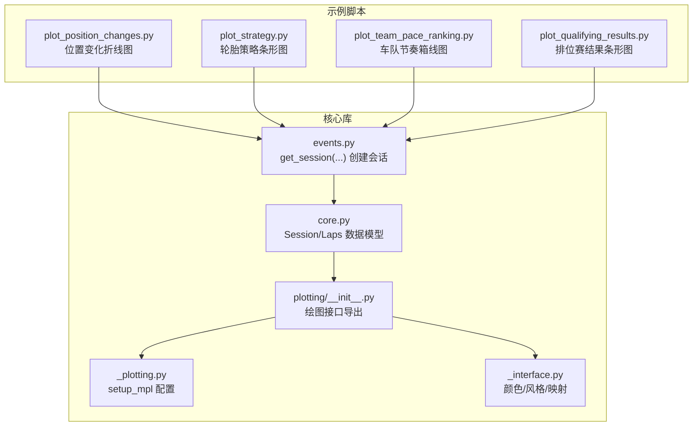
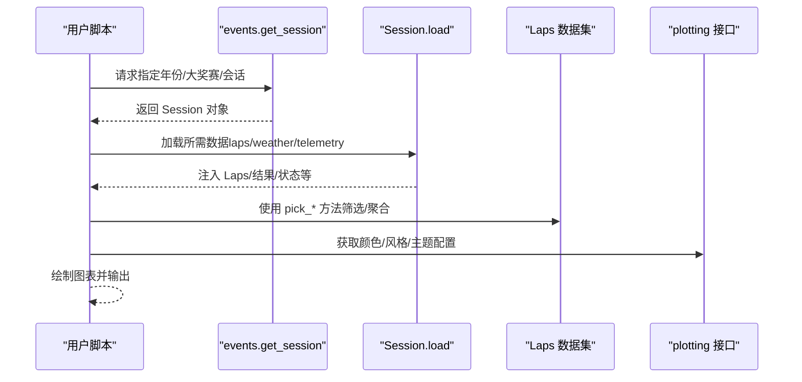
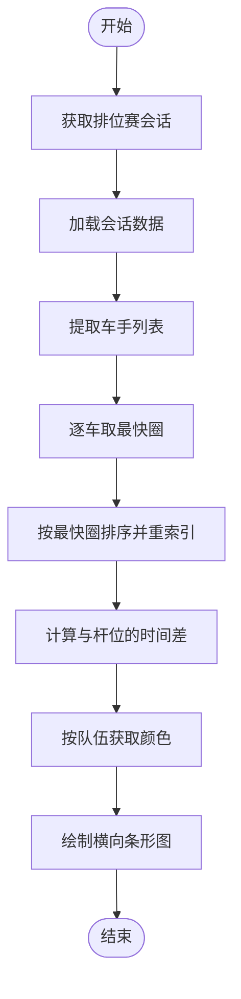
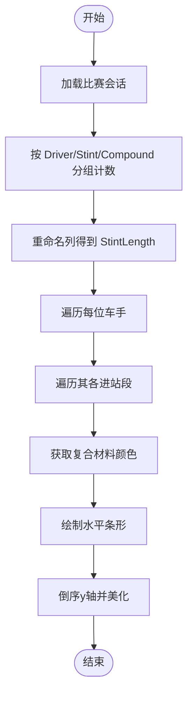
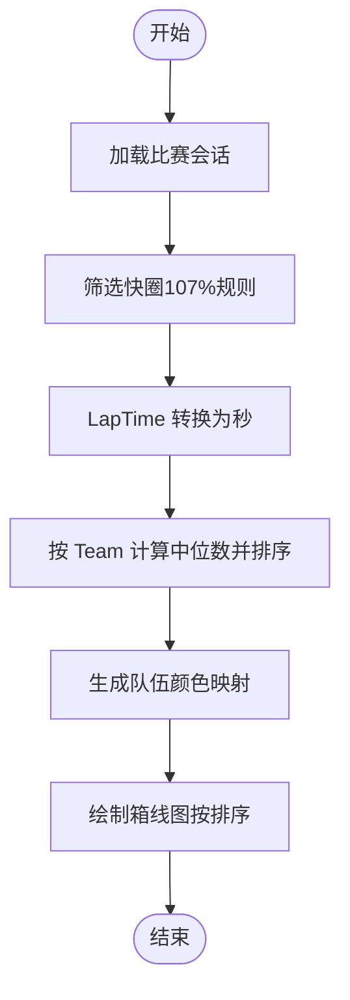
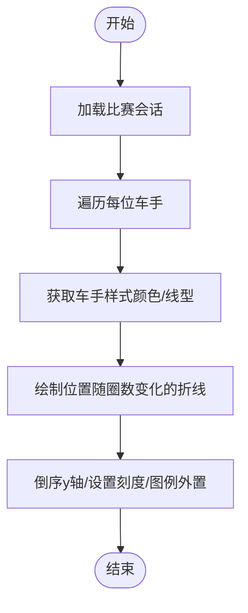
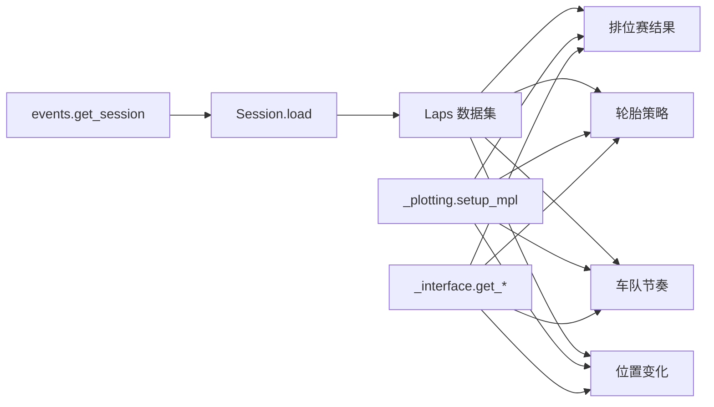

# 比赛结果与策略示例

<cite>
**本文引用的文件**
- [examples/results_strategy/plot_position_changes.py](file://examples/results_strategy/plot_position_changes.py)
- [examples/results_strategy/plot_strategy.py](file://examples/results_strategy/plot_strategy.py)
- [examples/results_strategy/plot_team_pace_ranking.py](file://examples/results_strategy/plot_team_pace_ranking.py)
- [examples/results_strategy/plot_qualifying_results.py](file://examples/results_strategy/plot_qualifying_results.py)
- [fastf1/events.py](file://fastf1/events.py)
- [fastf1/core.py](file://fastf1/core.py)
- [fastf1/plotting/__init__.py](file://fastf1/plotting/__init__.py)
- [fastf1/plotting/_plotting.py](file://fastf1/plotting/_plotting.py)
- [fastf1/plotting/_interface.py](file://fastf1/plotting/_interface.py)
</cite>

## 目录
1. [引言](#引言)
2. [项目结构](#项目结构)
3. [核心组件](#核心组件)
4. [架构总览](#架构总览)
5. [详细组件分析](#详细组件分析)
6. [依赖分析](#依赖分析)
7. [性能考虑](#性能考虑)
8. [故障排查指南](#故障排查指南)
9. [结论](#结论)
10. [附录](#附录)

## 引言
本教程围绕 Fast-F1 的“比赛结果与策略”示例，系统讲解如何从数据获取、处理、分析到可视化，完成对排位赛结果、比赛策略（轮胎使用）、车手位置变化以及车队节奏的综合分析。重点解析以下四个示例脚本：
- 排位赛结果可视化
- 比赛轮胎策略可视化
- 车队节奏箱线图排名
- 比赛位置变化折线图

同时，结合 Fast-F1 的核心对象模型（会话 Session、圈速 Laps）与绘图接口（颜色映射、风格生成），帮助读者建立可复用的数据分析流水线，并掌握从数据中提取“起步策略、进站时机、轮胎选择、节奏差异”等关键洞察的方法论。

## 项目结构
本次示例位于 examples/results_strategy 目录，每个脚本独立演示一种分析视角；底层能力由 fastf1.events、fastf1.core 与 fastf1.plotting 提供支撑。

图表来源
- [examples/results_strategy/plot_position_changes.py:1-56](file://examples/results_strategy/plot_position_changes.py#L1-L56)
- [examples/results_strategy/plot_strategy.py:1-91](file://examples/results_strategy/plot_strategy.py#L1-L91)
- [examples/results_strategy/plot_team_pace_ranking.py:1-69](file://examples/results_strategy/plot_team_pace_ranking.py#L1-L69)
- [examples/results_strategy/plot_qualifying_results.py:1-97](file://examples/results_strategy/plot_qualifying_results.py#L1-L97)
- [fastf1/events.py:50-138](file://fastf1/events.py#L50-L138)
- [fastf1/core.py:1152-1445](file://fastf1/core.py#L1152-L1445)
- [fastf1/plotting/__init__.py:1-48](file://fastf1/plotting/__init__.py#L1-L48)
- [fastf1/plotting/_plotting.py:29-106](file://fastf1/plotting/_plotting.py#L29-L106)
- [fastf1/plotting/_interface.py:1-200](file://fastf1/plotting/_interface.py#L1-L200)

章节来源
- [examples/results_strategy/plot_position_changes.py:1-56](file://examples/results_strategy/plot_position_changes.py#L1-L56)
- [examples/results_strategy/plot_strategy.py:1-91](file://examples/results_strategy/plot_strategy.py#L1-L91)
- [examples/results_strategy/plot_team_pace_ranking.py:1-69](file://examples/results_strategy/plot_team_pace_ranking.py#L1-L69)
- [examples/results_strategy/plot_qualifying_results.py:1-97](file://examples/results_strategy/plot_qualifying_results.py#L1-L97)
- [fastf1/events.py:50-138](file://fastf1/events.py#L50-L138)

## 核心组件
- 会话对象 Session：封装事件、会话类型、驱动列表、圈速数据、天气、遥测等；通过 load 加载所需数据。
- 圈速对象 Laps：提供 pick_* 系列方法（按车手、车队、最快圈、复合材料、进/出站区间等）进行筛选与统计。
- 绘图接口 plotting：提供颜色映射（get_compound_color、get_team_color、get_driver_style）、主题配置（setup_mpl）等。

章节来源
- [fastf1/core.py:1152-1445](file://fastf1/core.py#L1152-L1445)
- [fastf1/core.py:2730-3484](file://fastf1/core.py#L2730-L3484)
- [fastf1/plotting/__init__.py:1-48](file://fastf1/plotting/__init__.py#L1-L48)
- [fastf1/plotting/_plotting.py:29-106](file://fastf1/plotting/_plotting.py#L29-L106)
- [fastf1/plotting/_interface.py:166-200](file://fastf1/plotting/_interface.py#L166-L200)

## 架构总览
下图展示了从“获取会话”到“加载数据”再到“绘图”的端到端流程，以及各示例脚本在该流程中的职责分工。

图表来源
- [fastf1/events.py:50-138](file://fastf1/events.py#L50-L138)
- [fastf1/core.py:1358-1445](file://fastf1/core.py#L1358-L1445)
- [fastf1/plotting/_plotting.py:29-106](file://fastf1/plotting/_plotting.py#L29-L106)
- [fastf1/plotting/_interface.py:166-200](file://fastf1/plotting/_interface.py#L166-L200)

## 详细组件分析

### 示例一：排位赛结果可视化（plot_qualifying_results.py）
- 数据获取与准备
  - 通过 get_session 获取指定年份与大奖赛的排位赛会话，调用 load 加载数据。
  - 获取所有车手集合，逐个取其最快单圈组成“最快圈集合”，并按时间排序重索引。
  - 计算每圈时间与杆位圈时间之差，形成“时间差列”，便于横向对比。
- 可视化与配色
  - 使用 get_team_color 为每个条形分配队伍颜色，确保视觉一致性。
  - 启用 timedelta 支持以正确显示时间刻度。
- 分析要点
  - 通过“时间差”直观反映车手差距；结合队伍颜色快速识别领先者与追赶者。
  - 可用于评估排位策略（发车位选择、单双区切换、起步节奏）。

图表来源
- [examples/results_strategy/plot_qualifying_results.py:21-97](file://examples/results_strategy/plot_qualifying_results.py#L21-L97)
- [fastf1/plotting/_interface.py:166-200](file://fastf1/plotting/_interface.py#L166-L200)
- [fastf1/plotting/_plotting.py:29-106](file://fastf1/plotting/_plotting.py#L29-L106)

章节来源
- [examples/results_strategy/plot_qualifying_results.py:1-97](file://examples/results_strategy/plot_qualifying_results.py#L1-L97)

### 示例二：比赛轮胎策略可视化（plot_strategy.py）
- 数据获取与分组
  - 获取 race 会话并加载；基于 Laps 分组统计每个车手的“车号-策略号-复合材料”组合的圈数，得到“进站段长度”。
- 可视化与布局
  - 使用 get_compound_color 为不同复合材料着色，绘制水平条形图，横轴为圈号，纵轴为车手，清晰展示换胎节奏。
  - 倒序 y 轴使排名靠前的车手位于上方，提升可读性。
- 分析要点
  - 通过“复合材料+进站段长度”识别“软胎冲刺、中性保底、硬胎长距离”等策略；结合车手位置变化可推断“起步/追击/防守”时机。

图表来源
- [examples/results_strategy/plot_strategy.py:17-91](file://examples/results_strategy/plot_strategy.py#L17-L91)
- [fastf1/plotting/_interface.py:166-200](file://fastf1/plotting/_interface.py#L166-L200)

章节来源
- [examples/results_strategy/plot_strategy.py:1-91](file://examples/results_strategy/plot_strategy.py#L1-L91)

### 示例三：车队节奏箱线图排名（plot_team_pace_ranking.py）
- 数据准备
  - 加载 race 会话，使用 pick_quicklaps 获取“快圈”（默认阈值为 107% 最快圈），避免异常或受干扰的计时。
  - 将 LapTime 从 timedelta 转换为秒，适配 seaborn 的数值型输入。
- 统计与排序
  - 按 Team 计算中位数，得到从最快到最慢的车队顺序。
  - 为每支车队生成颜色映射，保证图表色彩一致。
- 可视化
  - 使用 seaborn 的箱线图，设置透明边缘与白框，突出团队节奏分布与离散程度。
- 分析要点
  - 中位数体现“稳定节奏”，箱体宽度反映“一致性”；可用于评估车队整体策略稳定性与轮胎管理效率。

图表来源
- [examples/results_strategy/plot_team_pace_ranking.py:21-69](file://examples/results_strategy/plot_team_pace_ranking.py#L21-L69)
- [fastf1/core.py:3238-3254](file://fastf1/core.py#L3238-L3254)
- [fastf1/plotting/_interface.py:166-200](file://fastf1/plotting/_interface.py#L166-L200)

章节来源
- [examples/results_strategy/plot_team_pace_ranking.py:1-69](file://examples/results_strategy/plot_team_pace_ranking.py#L1-L69)

### 示例四：比赛位置变化折线图（plot_position_changes.py）
- 数据准备
  - 加载 race 会话，遍历 drivers，按 Driver 提取对应圈集合。
  - 使用 get_driver_style 获取颜色与线型样式，确保多车叠加时易于区分。
- 可视化
  - 以 LapNumber 为横轴、Position 为纵轴绘制折线；倒序 y 轴使第一名位于顶部。
  - 设置自定义刻度与标签，避免图拥挤导致阅读困难。
- 分析要点
  - 通过位置曲线识别“起步发卡、进站掉队、防守超越、冲刺阶段”等关键节点；结合策略图可定位“进站时机是否合理”。

图表来源
- [examples/results_strategy/plot_position_changes.py:19-56](file://examples/results_strategy/plot_position_changes.py#L19-L56)
- [fastf1/plotting/_interface.py:489-530](file://fastf1/plotting/_interface.py#L489-L530)
- [fastf1/plotting/_plotting.py:29-106](file://fastf1/plotting/_plotting.py#L29-L106)

章节来源
- [examples/results_strategy/plot_position_changes.py:1-56](file://examples/results_strategy/plot_position_changes.py#L1-L56)

## 依赖分析
- 会话与数据加载
  - get_session 作为入口，返回 Session；Session.load 决定加载哪些数据（laps/weather/telemetry/messages）。
  - Laps 提供丰富的筛选与聚合能力，是策略与节奏分析的核心数据容器。
- 绘图依赖
  - setup_mpl 提供 timedelta 刻度支持与主题配色；get_compound_color/get_team_color/get_driver_style 提供统一的视觉语言。
- 示例脚本之间的共同点
  - 均以 get_session + load 为起点；
  - 均使用 Laps 的 pick_* 系列方法进行数据筛选；
  - 均通过 plotting 接口获取颜色与风格，保证跨示例的一致性。

图表来源
- [fastf1/events.py:50-138](file://fastf1/events.py#L50-L138)
- [fastf1/core.py:1358-1445](file://fastf1/core.py#L1358-L1445)
- [fastf1/plotting/_plotting.py:29-106](file://fastf1/plotting/_plotting.py#L29-L106)
- [fastf1/plotting/_interface.py:166-200](file://fastf1/plotting/_interface.py#L166-L200)

章节来源
- [fastf1/events.py:50-138](file://fastf1/events.py#L50-L138)
- [fastf1/core.py:1358-1445](file://fastf1/core.py#L1358-L1445)
- [fastf1/plotting/_plotting.py:29-106](file://fastf1/plotting/_plotting.py#L29-L106)
- [fastf1/plotting/_interface.py:166-200](file://fastf1/plotting/_interface.py#L166-L200)

## 性能考虑
- 数据加载粒度控制
  - Session.load 默认加载全部数据，但在仅需策略分析时，可关闭不需要的子数据（如 telemetry、weather）以减少 IO 与内存占用。
- 数据筛选前置
  - 在 Laps 上尽早使用 pick_* 系列方法缩小数据规模，降低后续绘图与统计开销。
- 绘图参数优化
  - 图例外置、简化网格与边框、避免过度样式叠加，有助于在大量线条时保持渲染性能。
- 缓存与重用
  - plotting 的颜色与映射在同会话内可重复使用，避免重复查询；建议在批量脚本中复用已生成的映射表。

## 故障排查指南
- 未加载数据即访问属性
  - 若直接访问 Session.drivers、Session.laps 等属性而未先调用 load，将触发“数据未加载”异常。请确保在使用前调用 load。
- 会话标识不匹配
  - get_session 的年份、大奖赛名称/轮次、会话标识需与真实日程一致；若模糊匹配失败，检查拼写或启用精确匹配。
- timedelta 刻度显示异常
  - 绘图前未启用 setup_mpl 的 timedelta 支持，可能导致时间刻度格式错误。请在绘图前调用 setup_mpl 并传入相应参数。
- 复合材料/颜色映射缺失
  - 若使用了未知复合材料名称，颜色映射函数会抛出异常。请核对复合材料名称大小写与拼写，或使用内置映射函数确认可用值。

章节来源
- [fastf1/core.py:1227-1233](file://fastf1/core.py#L1227-L1233)
- [fastf1/events.py:120-136](file://fastf1/events.py#L120-L136)
- [fastf1/plotting/_plotting.py:29-106](file://fastf1/plotting/_plotting.py#L29-L106)
- [fastf1/plotting/_interface.py:166-200](file://fastf1/plotting/_interface.py#L166-L200)

## 结论
通过四个示例脚本，我们构建了从“排位结果—比赛策略—车队节奏—位置变化”的完整分析闭环。借助 Session/Laps 的数据模型与 plotting 的统一配色体系，可以高效地抽取“起步策略、进站时机、轮胎选择、节奏差异”等关键洞察，并将其转化为直观、一致的可视化报告。建议在实际项目中将这些流程模块化，形成可复用的分析模板，以应对不同赛事与场景的快速迭代需求。

## 附录
- 实战案例研究步骤（模板）
  - 明确目标：确定要回答的问题（如“谁在第10圈超越了谁？”“谁的轮胎策略最稳健？”）。
  - 数据准备：选择会话（排位/正赛），调用 load，必要时使用 pick_* 精简数据。
  - 关键指标：计算“最快圈时间差”“中位数节奏”“进站段长度”等。
  - 可视化：选择合适图表（条形/箱线/折线），统一颜色与主题。
  - 解释与建议：结合策略图与位置图解释关键节点，给出可操作建议。
- 分析报告模板（可选）
  - 摘要：核心发现与结论
  - 方法：数据来源、筛选条件、指标定义
  - 结果：图表与解读
  - 讨论：策略合理性、风险与机会
  - 建议：针对车手/车队的改进建议