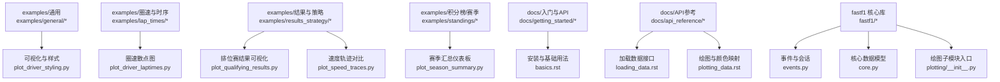
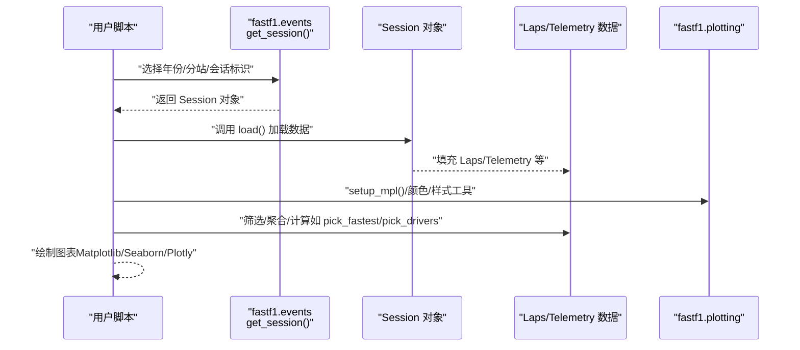
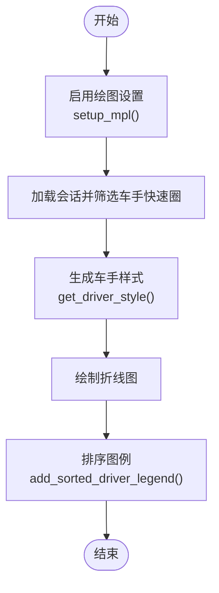
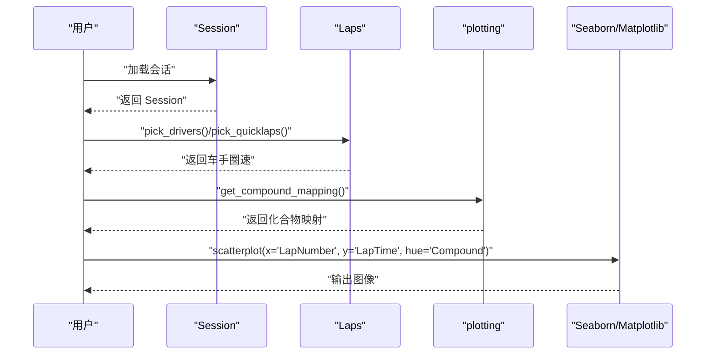
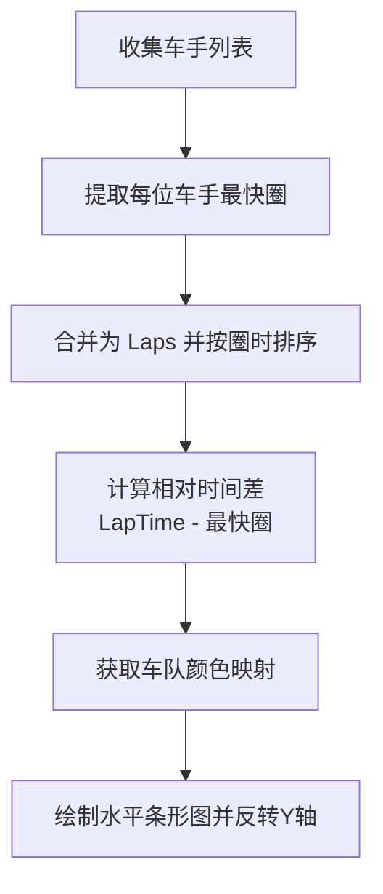
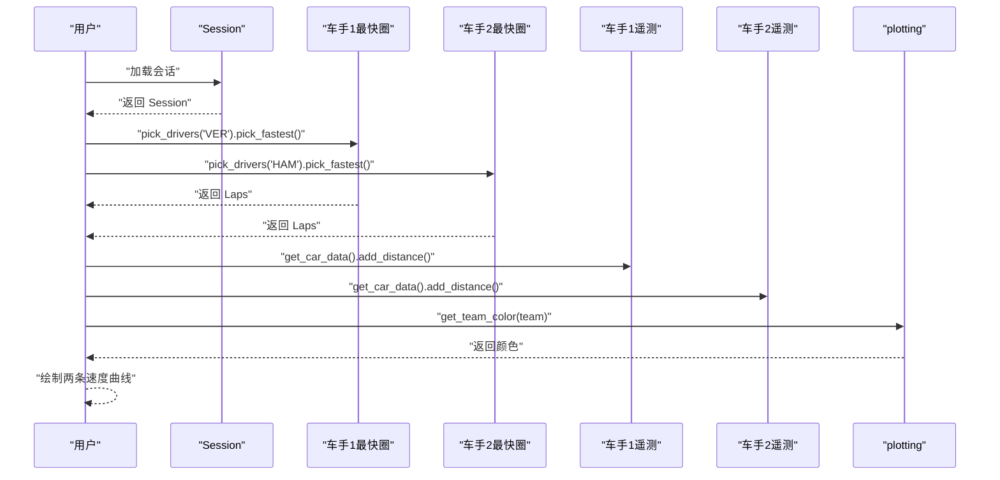
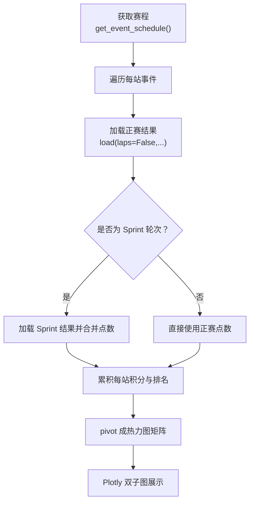

# 示例和教程

<cite>
**本文引用的文件**
- [README.md](file://README.md)
- [examples/GALLERY_HEADER.rst](file://examples/GALLERY_HEADER.rst)
- [examples/general/plot_driver_styling.py](file://examples/general/plot_driver_styling.py)
- [examples/lap_times/plot_driver_laptimes.py](file://examples/lap_times/plot_driver_laptimes.py)
- [examples/results_strategy/plot_qualifying_results.py](file://examples/results_strategy/plot_qualifying_results.py)
- [examples/telemetry/plot_speed_traces.py](file://examples/telemetry/plot_speed_traces.py)
- [examples/standings/plot_season_summary.py](file://examples/standings/plot_season_summary.py)
- [docs/getting_started/basics.rst](file://docs/getting_started/basics.rst)
- [docs/getting_started/installation.rst](file://docs/getting_started/installation.rst)
- [docs/api_reference/loading_data.rst](file://docs/api_reference/loading_data.rst)
- [docs/api_reference/plotting_data.rst](file://docs/api_reference/plotting_data.rst)
- [fastf1/__init__.py](file://fastf1/__init__.py)
- [fastf1/events.py](file://fastf1/events.py)
- [fastf1/core.py](file://fastf1/core.py)
- [fastf1/plotting/__init__.py](file://fastf1/plotting/__init__.py)
- [fastf1/tests/test_example_plots.py](file://fastf1/tests/test_example_plots.py)
</cite>

## 目录
1. [简介](#简介)
2. [项目结构](#项目结构)
3. [核心组件](#核心组件)
4. [架构总览](#架构总览)
5. [详细组件分析](#详细组件分析)
6. [依赖关系分析](#依赖关系分析)
7. [性能考虑](#性能考虑)
8. [故障排查指南](#故障排查指南)
9. [结论](#结论)
10. [附录](#附录)

## 简介
本教程面向希望系统掌握 Fast-F1 的用户，提供从入门到进阶的完整示例与实践路径。内容覆盖：
- 基础示例：数据获取、基本分析、可视化
- 高级示例：复杂分析、自定义扩展、性能优化
- 实战案例：完整项目实现与最佳实践
- 逐步教程：由浅入深的学习路径
- 常见问题与调试技巧
- 示例之间的关联与组合使用
- 练习与挑战任务

## 项目结构
Fast-F1 以“围绕 Pandas 数据结构”的理念组织，核心对象包括事件（Event）、会话（Session）、圈速（Laps）与遥测（Telemetry）。示例按主题分类存放于 examples 目录，文档位于 docs 目录，核心库在 fastf1 包中。

图表来源
- [examples/general/plot_driver_styling.py:1-108](file://examples/general/plot_driver_styling.py#L1-L108)
- [examples/lap_times/plot_driver_laptimes.py:1-66](file://examples/lap_times/plot_driver_laptimes.py#L1-L66)
- [examples/results_strategy/plot_qualifying_results.py:1-97](file://examples/results_strategy/plot_qualifying_results.py#L1-L97)
- [examples/telemetry/plot_speed_traces.py:1-53](file://examples/telemetry/plot_speed_traces.py#L1-L53)
- [examples/standings/plot_season_summary.py:1-170](file://examples/standings/plot_season_summary.py#L1-L170)
- [docs/getting_started/basics.rst:1-340](file://docs/getting_started/basics.rst#L1-L340)
- [docs/api_reference/loading_data.rst:1-25](file://docs/api_reference/loading_data.rst#L1-L25)
- [docs/api_reference/plotting_data.rst:1-125](file://docs/api_reference/plotting_data.rst#L1-L125)
- [fastf1/events.py:50-139](file://fastf1/events.py#L50-L139)
- [fastf1/core.py:64-200](file://fastf1/core.py#L64-L200)
- [fastf1/plotting/__init__.py:1-48](file://fastf1/plotting/__init__.py#L1-L48)

章节来源
- [README.md:1-75](file://README.md#L1-L75)
- [examples/GALLERY_HEADER.rst:1-4](file://examples/GALLERY_HEADER.rst#L1-L4)

## 核心组件
- 事件与会话加载：通过 get_session、get_event、get_event_schedule 等函数加载数据；随后调用 Session.load() 获取完整数据。
- 数据模型：Laps（圈速）、Telemetry（遥测）、SessionResults（结果）等均基于 Pandas 扩展，便于筛选、排序与统计。
- 可视化：plotting 子模块提供颜色映射、样式生成、图例排序等工具，并与 Matplotlib/Seaborn/Plotly 紧密集成。

章节来源
- [docs/getting_started/basics.rst:11-340](file://docs/getting_started/basics.rst#L11-L340)
- [docs/api_reference/loading_data.rst:9-25](file://docs/api_reference/loading_data.rst#L9-L25)
- [fastf1/events.py:50-139](file://fastf1/events.py#L50-L139)
- [fastf1/core.py:64-200](file://fastf1/core.py#L64-L200)
- [fastf1/plotting/__init__.py:1-48](file://fastf1/plotting/__init__.py#L1-L48)

## 架构总览
下图展示了从“加载事件/会话”到“数据处理与可视化”的典型流程，以及示例与核心库的对应关系。

图表来源
- [fastf1/events.py:50-139](file://fastf1/events.py#L50-L139)
- [fastf1/core.py:64-200](file://fastf1/core.py#L64-L200)
- [fastf1/plotting/__init__.py:1-48](file://fastf1/plotting/__init__.py#L1-L48)
- [examples/general/plot_driver_styling.py:13-108](file://examples/general/plot_driver_styling.py#L13-L108)
- [examples/lap_times/plot_driver_laptimes.py:14-66](file://examples/lap_times/plot_driver_laptimes.py#L14-L66)
- [examples/results_strategy/plot_qualifying_results.py:17-97](file://examples/results_strategy/plot_qualifying_results.py#L17-L97)
- [examples/telemetry/plot_speed_traces.py:13-53](file://examples/telemetry/plot_speed_traces.py#L13-L53)
- [examples/standings/plot_season_summary.py:16-170](file://examples/standings/plot_season_summary.py#L16-L170)

## 详细组件分析

### 基础示例一：驱动器特定样式与图例排序
- 目标：演示如何为不同车手生成统一风格的线条样式，并对图例进行排序。
- 关键步骤：
  - 启用 Matplotlib 时间增量支持与颜色方案
  - 加载比赛会话并筛选目标车手的快速圈
  - 使用 get_driver_style 与 add_sorted_driver_legend
- 适用场景：对比多位车手的圈速趋势，提升可读性与一致性。

图表来源
- [examples/general/plot_driver_styling.py:13-108](file://examples/general/plot_driver_styling.py#L13-L108)
- [fastf1/plotting/__init__.py:1-48](file://fastf1/plotting/__init__.py#L1-L48)

章节来源
- [examples/general/plot_driver_styling.py:1-108](file://examples/general/plot_driver_styling.py#L1-L108)
- [docs/api_reference/plotting_data.rst:56-125](file://docs/api_reference/plotting_data.rst#L56-L125)

### 基础示例二：车手圈速散点图（含化合物颜色）
- 目标：以圈号为横轴、圈时为纵轴，按轮胎化合物着色。
- 关键步骤：
  - 启用绘图设置
  - 加载会话并筛选单个车手的快速圈
  - 使用 get_compound_mapping 与 Seaborn 散点图
- 适用场景：观察车手在不同轮胎策略下的圈时变化。

图表来源
- [examples/lap_times/plot_driver_laptimes.py:14-66](file://examples/lap_times/plot_driver_laptimes.py#L14-L66)
- [fastf1/plotting/__init__.py:1-48](file://fastf1/plotting/__init__.py#L1-L48)

章节来源
- [examples/lap_times/plot_driver_laptimes.py:1-66](file://examples/lap_times/plot_driver_laptimes.py#L1-L66)
- [docs/api_reference/plotting_data.rst:19-53](file://docs/api_reference/plotting_data.rst#L19-L53)

### 基础示例三：排位赛结果条形图（时间差）
- 目标：展示各车手最快圈时间差，按车队颜色着色。
- 关键步骤：
  - 收集所有车手最快圈，排序并重索引
  - 计算相对时间差 LapTimeDelta
  - 使用 get_team_color 为条形图上色
- 适用场景：直观比较排位赛差距与车手分布。

图表来源
- [examples/results_strategy/plot_qualifying_results.py:25-97](file://examples/results_strategy/plot_qualifying_results.py#L25-L97)
- [fastf1/plotting/__init__.py:1-48](file://fastf1/plotting/__init__.py#L1-L48)

章节来源
- [examples/results_strategy/plot_qualifying_results.py:1-97](file://examples/results_strategy/plot_qualifying_results.py#L1-L97)

### 基础示例四：速度轨迹叠加对比
- 目标：对比两位车手最快圈的速度轨迹。
- 关键步骤：
  - 选择两圈并获取遥测数据
  - 为遥测添加距离列以便横向对比
  - 使用 get_team_color 为线条着色
- 适用场景：分析不同车手在弯道/直道的动态差异。

图表来源
- [examples/telemetry/plot_speed_traces.py:17-53](file://examples/telemetry/plot_speed_traces.py#L17-L53)
- [fastf1/plotting/__init__.py:1-48](file://fastf1/plotting/__init__.py#L1-L48)

章节来源
- [examples/telemetry/plot_speed_traces.py:1-53](file://examples/telemetry/plot_speed_traces.py#L1-L53)

### 基础示例五：赛季汇总热力图（交互式）
- 目标：构建 2024 赛季的积分与排名热力图仪表板。
- 关键步骤：
  - 获取全年赛程并逐站加载结果
  - 处理冲刺赛（Sprint）点数
  - pivot 表格形成“车手×轮次”的积分矩阵
  - 使用 Plotly 绘制双子图（轮次热力图 + 总积分）
- 适用场景：交互式查看车手每站表现与总积分走势。

图表来源
- [examples/standings/plot_season_summary.py:16-170](file://examples/standings/plot_season_summary.py#L16-L170)

章节来源
- [examples/standings/plot_season_summary.py:1-170](file://examples/standings/plot_season_summary.py#L1-L170)

### 进阶示例：自定义样式与颜色映射
- 自定义样式：通过 get_driver_style 指定颜色、线型、粗细与透明度，实现“一号车手/二号车手”差异化视觉。
- 颜色映射：使用 set_default_colormap 切换官方或 FastF1 主色；get_compound_mapping 用于轮胎颜色。
- 适用场景：品牌化报告、统一图表风格、增强可读性。

章节来源
- [examples/general/plot_driver_styling.py:70-108](file://examples/general/plot_driver_styling.py#L70-L108)
- [docs/api_reference/plotting_data.rst:19-53](file://docs/api_reference/plotting_data.rst#L19-L53)

### 进阶示例：复杂分析与性能优化
- 分析思路：先筛选快速圈，再按车手/车队/轮胎等维度聚合；使用 add_distance 对齐遥测时间轴；结合 delta_time 计算相对时间差。
- 性能优化：合理使用 load() 参数仅加载必要数据；利用缓存减少重复请求；避免不必要的全局筛选。
- 适用场景：深入对比策略、定位刹车点与出弯时机差异。

章节来源
- [fastf1/tests/test_example_plots.py:54-77](file://fastf1/tests/test_example_plots.py#L54-L77)
- [docs/getting_started/basics.rst:213-340](file://docs/getting_started/basics.rst#L213-L340)

### 实战案例：完整项目实现与最佳实践
- 典型流程：赛程获取 → 单站加载 → 结果/圈速/遥测 → 可视化 → 交互式仪表板
- 最佳实践：
  - 明确数据粒度：仅加载所需字段，降低内存占用
  - 统一颜色体系：固定 colormap，确保跨图表一致性
  - 图表可读性：轴标签、网格、标题、图例排序
  - 错误处理：对模糊匹配、缺失数据进行容错

章节来源
- [examples/standings/plot_season_summary.py:16-170](file://examples/standings/plot_season_summary.py#L16-L170)
- [docs/api_reference/loading_data.rst:9-25](file://docs/api_reference/loading_data.rst#L9-L25)

## 依赖关系分析
- 事件与会话层：events.get_session 等函数负责解析输入并返回 Session 对象。
- 核心数据层：Session 内部持有 Laps/Telemetry 等扩展 DataFrame，提供便捷方法（如 pick_fastest、add_distance）。
- 可视化层：plotting 提供颜色映射与样式工具，与 Matplotlib/Seaborn/Plotly 协作。

图表来源
- [fastf1/events.py:50-139](file://fastf1/events.py#L50-L139)
- [fastf1/core.py:64-200](file://fastf1/core.py#L64-L200)
- [fastf1/plotting/__init__.py:1-48](file://fastf1/plotting/__init__.py#L1-L48)

章节来源
- [fastf1/events.py:50-139](file://fastf1/events.py#L50-L139)
- [fastf1/core.py:64-200](file://fastf1/core.py#L64-L200)
- [fastf1/plotting/__init__.py:1-48](file://fastf1/plotting/__init__.py#L1-L48)

## 性能考虑
- 数据加载：优先使用 get_event_schedule 获取全量日程，再按需加载单站；调用 Session.load() 时传入仅需要的数据类型参数，避免下载遥测/天气/消息等。
- 缓存：启用内置缓存可显著减少重复请求；建议在本地开发环境中长期保留缓存。
- 可视化：对大数据集采用采样或聚合；在 Matplotlib 中关闭不必要的网格与阴影；Plotly 交互式图表注意控制数据大小与渲染层级。

## 故障排查指南
- 安装与环境
  - Python 版本要求与安装方式参见安装文档。
  - 在 Pyodide/JupyterLite 等 WASM 环境中使用需额外步骤，详见安装文档说明。
- 数据获取
  - 若 get_session 报错，检查年份、分站名称或缩写是否正确；必要时开启 exact_match 或使用国家/地点匹配。
  - 对历史数据（早于 2018）默认回退至 Ergast 后端。
- 可视化
  - 绘制带时间增量的图形前务必调用 setup_mpl，否则会出现显示异常。
  - 团队颜色/车手颜色不一致时，确认 colormap 设置与 get_team_color/get_driver_style 的使用。
- 测试与回归
  - 参考测试用例中的最小示例，逐步比对输出差异，定位问题范围。

章节来源
- [docs/getting_started/installation.rst:1-27](file://docs/getting_started/installation.rst#L1-L27)
- [docs/getting_started/basics.rst:11-150](file://docs/getting_started/basics.rst#L11-L150)
- [fastf1/tests/test_example_plots.py:1-92](file://fastf1/tests/test_example_plots.py#L1-L92)

## 结论
通过本教程，您应能够：
- 熟练使用事件/会话加载与数据筛选
- 掌握基础与高级可视化技巧
- 构建交互式仪表板与策略分析
- 在实践中优化性能与提升可读性

建议后续深入阅读 API 文档与核心源码，结合真实数据进行迭代练习。

## 附录

### 逐步教程：从零到一
- 第一步：安装与环境准备
  - 参考安装文档完成安装与环境配置。
- 第二步：加载数据
  - 使用 get_session/get_event/get_event_schedule 获取目标数据。
- 第三步：筛选与聚合
  - 使用 pick_fastest/pick_drivers/pick_quicklaps 等方法筛选数据。
- 第四步：可视化
  - 选择合适的图表类型与颜色映射，生成报告级图像。
- 第五步：交互式仪表板
  - 使用 Plotly 构建多子图与悬停信息，提升探索体验。

章节来源
- [docs/getting_started/installation.rst:1-27](file://docs/getting_started/installation.rst#L1-L27)
- [docs/getting_started/basics.rst:11-340](file://docs/getting_started/basics.rst#L11-L340)
- [examples/standings/plot_season_summary.py:16-170](file://examples/standings/plot_season_summary.py#L16-L170)

### 练习与挑战任务
- 基础练习
  - 选择最近一次大奖赛，绘制前五车手的排位赛最快圈对比图。
  - 将同一场比赛的两位车手最快圈速度轨迹叠加，标注刹车点。
- 进阶挑战
  - 构建一个“车手生命周期”仪表板：包含每站排名、积分、最快圈时、平均速度等指标。
  - 设计一个“轮胎策略分析”模块：按 Compound 统计每站使用频率与平均圈时。
- 性能优化挑战
  - 在不改变结果的前提下，最小化数据加载体积与运行时间；验证缓存命中率。