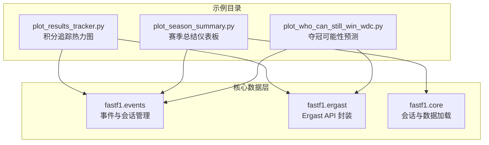
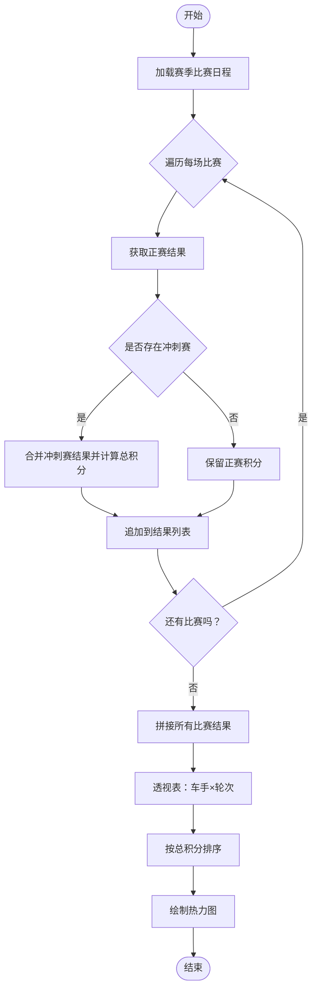
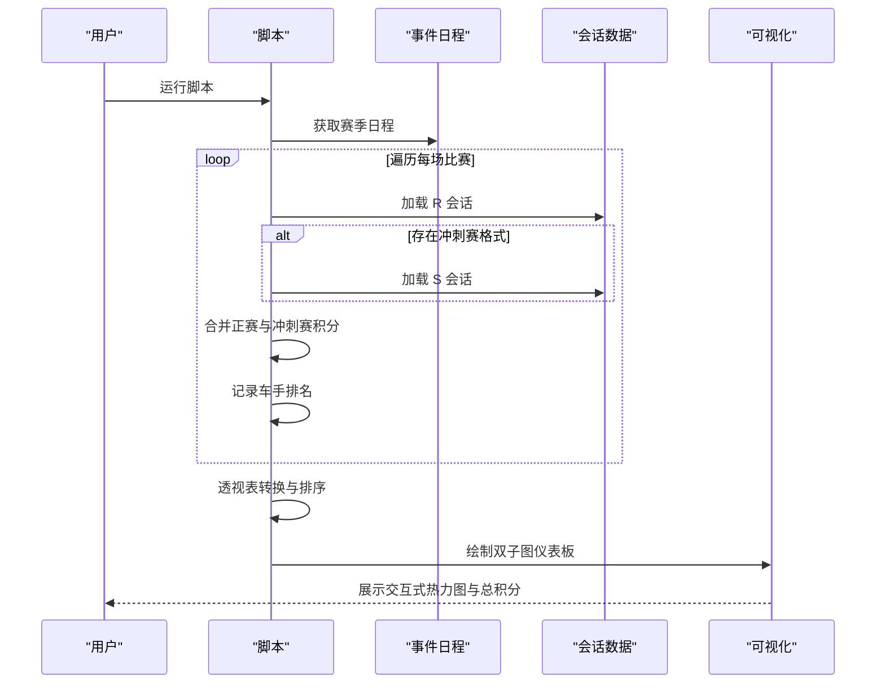
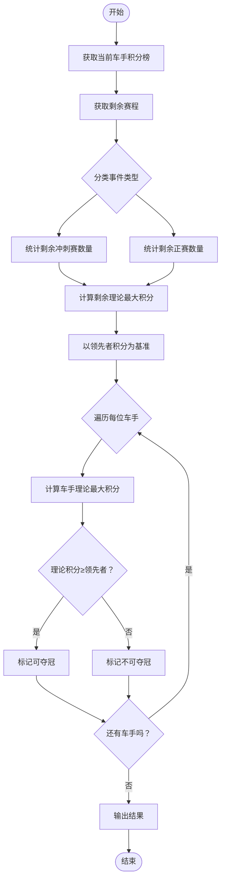
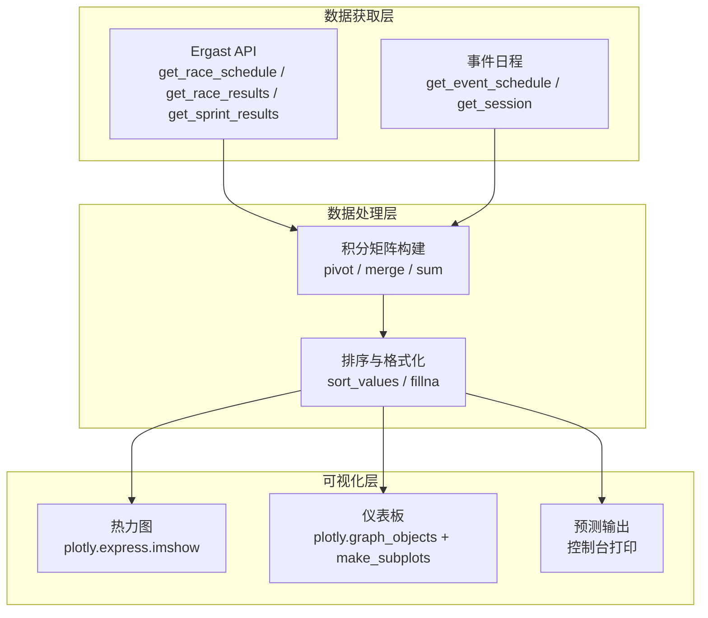
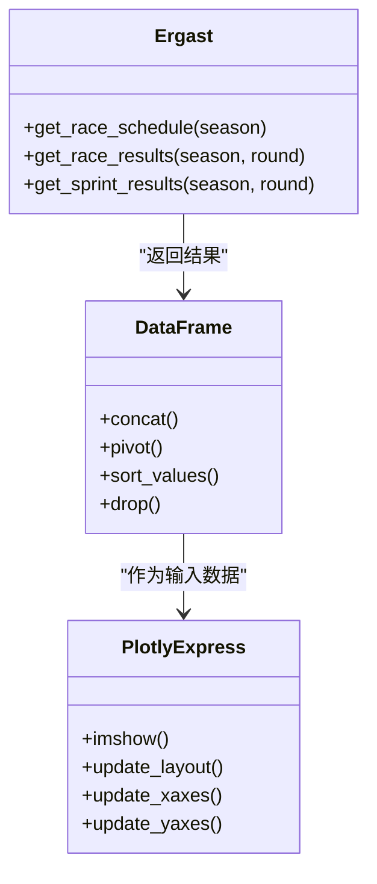
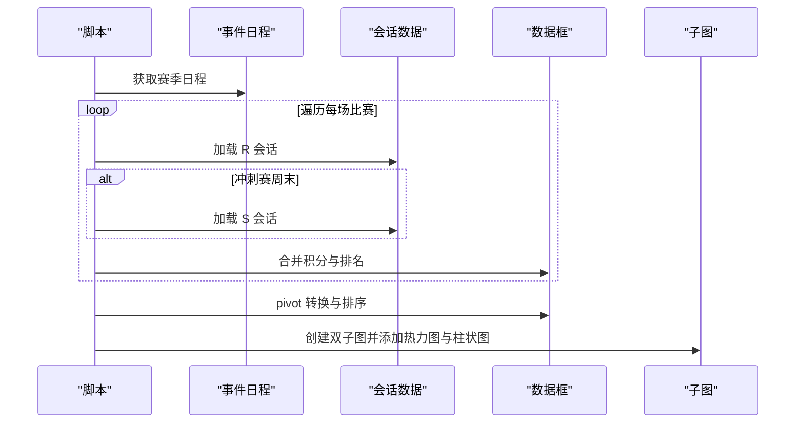
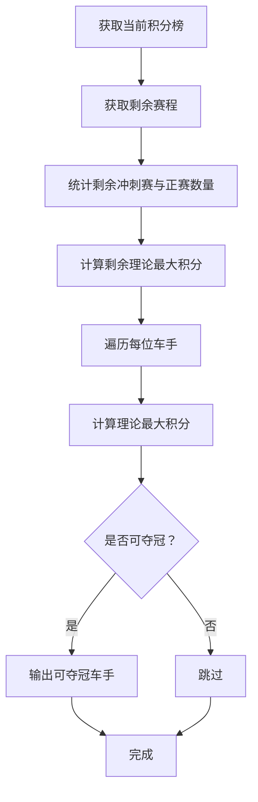
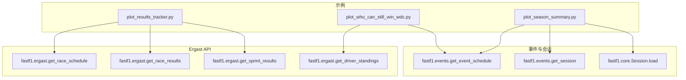

# 积分榜分析示例

<cite>
**本文档引用的文件**
- [plot_results_tracker.py](file://examples/standings/plot_results_tracker.py)
- [plot_season_summary.py](file://examples/standings/plot_season_summary.py)
- [plot_who_can_still_win_wdc.py](file://examples/standings/plot_who_can_still_win_wdc.py)
- [events.py](file://fastf1/events.py)
- [interface.py](file://fastf1/ergast/interface.py)
- [core.py](file://fastf1/core.py)
</cite>

## 目录
1. [简介](#简介)
2. [项目结构](#项目结构)
3. [核心组件](#核心组件)
4. [架构概览](#架构概览)
5. [详细组件分析](#详细组件分析)
6. [依赖关系分析](#依赖关系分析)
7. [性能考虑](#性能考虑)
8. [故障排除指南](#故障排除指南)
9. [结论](#结论)

## 简介

本教程专注于 Fast-F1 库中积分榜分析示例的深入解析，涵盖车手与车队赛季积分变化的跟踪与分析。通过三个核心示例文件：积分追踪图（plot_results_tracker.py）、赛季总结报告（plot_season_summary.py）以及夺冠可能性预测（plot_who_can_still_win_wdc.py），我们将系统讲解如何：

- 动态跟踪积分变化并生成可视化图表
- 分析赛季趋势与车手表现
- 预测车手夺冠可能性
- 实现数据更新机制与实时分析最佳实践
- 掌握高级积分榜分析技巧与专业洞察方法

## 项目结构

Fast-F1 的积分榜分析示例位于 examples/standings 目录下，每个示例文件都独立演示了不同的分析维度与可视化方式。核心数据源来自 fastf1.events 与 fastf1.ergast 模块，它们提供了事件日程、会话数据以及 Ergast API 的封装。

**图表来源**
- [plot_results_tracker.py:1-93](file://examples/standings/plot_results_tracker.py#L1-L93)
- [plot_season_summary.py:1-170](file://examples/standings/plot_season_summary.py#L1-L170)
- [plot_who_can_still_win_wdc.py:1-88](file://examples/standings/plot_who_can_still_win_wdc.py#L1-L88)
- [events.py:285-342](file://fastf1/events.py#L285-L342)
- [interface.py:682-747](file://fastf1/ergast/interface.py#L682-L747)
- [core.py:1422-1445](file://fastf1/core.py#L1422-L1445)

**章节来源**
- [plot_results_tracker.py:1-93](file://examples/standings/plot_results_tracker.py#L1-L93)
- [plot_season_summary.py:1-170](file://examples/standings/plot_season_summary.py#L1-L170)
- [plot_who_can_still_win_wdc.py:1-88](file://examples/standings/plot_who_can_still_win_wdc.py#L1-L88)
- [events.py:285-342](file://fastf1/events.py#L285-L342)
- [interface.py:682-747](file://fastf1/ergast/interface.py#L682-L747)
- [core.py:1422-1445](file://fastf1/core.py#L1422-L1445)

## 核心组件

本节将深入分析三个示例文件的实现原理与关键组件，解释其数据流、处理逻辑与可视化策略。

### 组件一：积分追踪热力图（plot_results_tracker.py）

该组件通过 Ergast API 获取指定赛季的每场比赛结果，整合常规赛与冲刺赛的积分，构建车手按轮次的积分矩阵，并以热力图形式展示。

- 数据获取与整合
  - 使用 Ergast.get_race_schedule 获取赛季比赛列表
  - 对每场比赛调用 get_race_results 获取正赛结果
  - 若存在冲刺赛，调用 get_sprint_results 并与正赛结果合并，计算总积分
- 数据重塑与排序
  - 使用 pivot 将结果转换为“车手-轮次”的宽表
  - 按总积分降序排列，便于观察领先者
- 可视化配置
  - 使用 plotly.express.imshow 绘制热力图
  - 自定义颜色映射、轴标签与布局样式

**图表来源**
- [plot_results_tracker.py:16-46](file://examples/standings/plot_results_tracker.py#L16-L46)
- [plot_results_tracker.py:47-60](file://examples/standings/plot_results_tracker.py#L47-L60)
- [plot_results_tracker.py:64-92](file://examples/standings/plot_results_tracker.py#L64-L92)

**章节来源**
- [plot_results_tracker.py:1-93](file://examples/standings/plot_results_tracker.py#L1-L93)
- [interface.py:682-747](file://fastf1/ergast/interface.py#L682-L747)

### 组件二：赛季总结仪表板（plot_season_summary.py）

该组件构建交互式仪表板，同时显示每轮比赛的积分热力图与最终总积分柱状图，支持悬停信息展示车手在各站的排名。

- 数据采集流程
  - 使用 get_event_schedule 获取赛季日程
  - 遍历每场比赛，加载 R（正赛）会话与可选的 S（冲刺排位赛）会话
  - 合并正赛与冲刺赛积分，记录车手在该站的排名
- 数据格式化
  - 构建包含事件名、轮次、车手缩写、积分与排名的数据框
  - 使用 pivot 将数据转换为“车手×轮次”的积分矩阵
  - 计算每名车手的总积分并按升序排列
- 可视化设计
  - 创建双子图布局：左侧为轮次积分热力图，右侧为总积分柱状图
  - 设置自定义悬停模板，展示车手、比赛名称、积分与排名
  - 统一颜色映射与数值范围，确保两幅图的一致性

**图表来源**
- [plot_season_summary.py:17-76](file://examples/standings/plot_season_summary.py#L17-L76)
- [plot_season_summary.py:82-96](file://examples/standings/plot_season_summary.py#L82-L96)
- [plot_season_summary.py:112-169](file://examples/standings/plot_season_summary.py#L112-L169)

**章节来源**
- [plot_season_summary.py:1-170](file://examples/standings/plot_season_summary.py#L1-L170)
- [events.py:285-342](file://fastf1/events.py#L285-L342)
- [core.py:1422-1445](file://fastf1/core.py#L1422-L1445)

### 组件三：夺冠可能性预测（plot_who_can_still_win_wdc.py）

该组件基于当前车手积分榜与剩余赛程，计算理论最大积分，判断哪些车手仍有可能赢得车手总冠军（WDC）。

- 当前积分榜获取
  - 使用 Ergast.get_driver_standings 获取指定轮次的车手积分榜
- 剩余赛程理论积分计算
  - 通过 get_event_schedule 获取剩余轮次
  - 区分“冲刺排位赛周末”与“传统周末”，统计剩余冲刺赛与正赛数量
  - 基于积分规则计算剩余理论最大积分（冲刺赛周末：赢取冲刺赛+正赛；传统周末：仅正赛）
- 车手夺冠可能性判定
  - 以当前领先者积分为基准，假设其不再获得积分
  - 对每位车手假设其赢取剩余所有比赛，计算其理论最大积分
  - 与领先者比较，输出可夺冠的车手列表

**图表来源**
- [plot_who_can_still_win_wdc.py:28-31](file://examples/standings/plot_who_can_still_win_wdc.py#L28-L31)
- [plot_who_can_still_win_wdc.py:38-52](file://examples/standings/plot_who_can_still_win_wdc.py#L38-L52)
- [plot_who_can_still_win_wdc.py:62-74](file://examples/standings/plot_who_can_still_win_wdc.py#L62-L74)

**章节来源**
- [plot_who_can_still_win_wdc.py:1-88](file://examples/standings/plot_who_can_still_win_wdc.py#L1-L88)
- [interface.py:682-747](file://fastf1/ergast/interface.py#L682-L747)

## 架构概览

下面的架构图展示了三个示例如何协同工作，从数据获取到可视化呈现的完整流程。

**图表来源**
- [plot_results_tracker.py:16-60](file://examples/standings/plot_results_tracker.py#L16-L60)
- [plot_season_summary.py:22-96](file://examples/standings/plot_season_summary.py#L22-L96)
- [plot_who_can_still_win_wdc.py:28-52](file://examples/standings/plot_who_can_still_win_wdc.py#L28-L52)

## 详细组件分析

### 组件A：积分追踪热力图（plot_results_tracker.py）

该组件实现了完整的积分追踪流程，从数据获取到热力图渲染，适合用于观察车手在整个赛季中的积分变化轨迹。

- 关键实现点
  - 使用 Ergast.get_race_schedule 获取赛季日程，随后对每场比赛调用 get_race_results 获取正赛结果
  - 若比赛采用冲刺赛周末格式，则额外调用 get_sprint_results，并将正赛与冲刺赛积分相加
  - 使用 pivot 将数据重塑为“车手-轮次”的矩阵，并按总积分排序
  - 通过 plotly.express.imshow 绘制热力图，设置颜色映射与布局参数

**图表来源**
- [plot_results_tracker.py:16-60](file://examples/standings/plot_results_tracker.py#L16-L60)
- [plot_results_tracker.py:64-92](file://examples/standings/plot_results_tracker.py#L64-L92)
- [interface.py:682-747](file://fastf1/ergast/interface.py#L682-L747)

**章节来源**
- [plot_results_tracker.py:1-93](file://examples/standings/plot_results_tracker.py#L1-L93)
- [interface.py:682-747](file://fastf1/ergast/interface.py#L682-L747)

### 组件B：赛季总结仪表板（plot_season_summary.py）

该组件提供了更丰富的交互式可视化，包含轮次积分热力图与总积分柱状图，适合用于制作赛季总结报告。

- 关键实现点
  - 使用 get_event_schedule 获取赛季日程，遍历每场比赛
  - 加载 R 会话与可选的 S 会话，合并正赛与冲刺赛积分
  - 构建包含事件名、轮次、车手缩写、积分与排名的数据框
  - 使用 pivot 将数据转换为“车手×轮次”的积分矩阵，并计算总积分
  - 通过 plotly.graph_objects 与 make_subplots 创建双子图布局，设置悬停模板与颜色映射

**图表来源**
- [plot_season_summary.py:17-96](file://examples/standings/plot_season_summary.py#L17-L96)
- [plot_season_summary.py:112-169](file://examples/standings/plot_season_summary.py#L112-L169)

**章节来源**
- [plot_season_summary.py:1-170](file://examples/standings/plot_season_summary.py#L1-L170)
- [events.py:285-342](file://fastf1/events.py#L285-L342)
- [core.py:1422-1445](file://fastf1/core.py#L1422-L1445)

### 组件C：夺冠可能性预测（plot_who_can_still_win_wdc.py）

该组件通过理论最大积分计算，预测在剩余赛程中仍有机会赢得 WDC 的车手名单。

- 关键实现点
  - 使用 get_drivers_standings 获取当前积分榜
  - 通过 get_event_schedule 获取剩余轮次，区分事件类型并统计数量
  - 基于积分规则计算剩余理论最大积分
  - 对每位车手假设赢取剩余所有比赛，与领先者积分比较，输出可夺冠车手列表

**图表来源**
- [plot_who_can_still_win_wdc.py:28-31](file://examples/standings/plot_who_can_still_win_wdc.py#L28-L31)
- [plot_who_can_still_win_wdc.py:38-52](file://examples/standings/plot_who_can_still_win_wdc.py#L38-L52)
- [plot_who_can_still_win_wdc.py:62-74](file://examples/standings/plot_who_can_still_win_wdc.py#L62-L74)

**章节来源**
- [plot_who_can_still_win_wdc.py:1-88](file://examples/standings/plot_who_can_still_win_wdc.py#L1-L88)
- [interface.py:682-747](file://fastf1/ergast/interface.py#L682-L747)

## 依赖关系分析

三个示例文件与 Fast-F1 核心模块之间存在明确的依赖关系，数据流从事件日程与会话管理，到 Ergast API 封装，再到可视化呈现。

**图表来源**
- [plot_results_tracker.py:16-46](file://examples/standings/plot_results_tracker.py#L16-L46)
- [plot_season_summary.py:17-76](file://examples/standings/plot_season_summary.py#L17-L76)
- [plot_who_can_still_win_wdc.py:28-52](file://examples/standings/plot_who_can_still_win_wdc.py#L28-L52)
- [events.py:285-342](file://fastf1/events.py#L285-L342)
- [core.py:1422-1445](file://fastf1/core.py#L1422-L1445)
- [interface.py:682-747](file://fastf1/ergast/interface.py#L682-L747)

**章节来源**
- [plot_results_tracker.py:1-93](file://examples/standings/plot_results_tracker.py#L1-L93)
- [plot_season_summary.py:1-170](file://examples/standings/plot_season_summary.py#L1-L170)
- [plot_who_can_still_win_wdc.py:1-88](file://examples/standings/plot_who_can_still_win_wdc.py#L1-L88)
- [events.py:285-342](file://fastf1/events.py#L285-L342)
- [core.py:1422-1445](file://fastf1/core.py#L1422-L1445)
- [interface.py:682-747](file://fastf1/ergast/interface.py#L682-L747)

## 性能考虑

- 数据加载优化
  - 使用 fastf1.events.get_event_schedule 获取日程时，可通过 include_testing 参数过滤测试场次，减少不必要的数据加载
  - 在 plot_season_summary.py 中，使用 Session.load(laps=False, telemetry=False, weather=False, messages=False) 仅加载必要数据，避免冗余请求
- 缓存机制
  - 利用 FastF1 的内置缓存功能，避免重复下载相同数据，显著提升加载速度
- 可视化性能
  - 在热力图中合理设置 zmin/zmax，减少颜色映射的计算开销
  - 使用 pivot 等向量化操作替代循环，提高数据处理效率

## 故障排除指南

- 事件匹配问题
  - 使用 get_event_schedule 时，若需要精确匹配，可启用 exact_match 参数，避免模糊匹配导致的错误事件选择
- 会话数据不可用
  - 某些会话可能不支持特定 API，导致数据加载失败。应检查 Session.load 的返回状态，并根据警告信息调整加载选项
- Ergast 请求限制
  - 避免频繁请求同一接口，合理使用缓存与批处理策略，防止触发速率限制

**章节来源**
- [events.py:827-829](file://fastf1/events.py#L827-L829)
- [core.py:1422-1445](file://fastf1/core.py#L1422-L1445)

## 结论

通过本教程，我们系统地解析了 Fast-F1 积分榜分析示例的实现原理与最佳实践。三个示例分别展示了积分追踪、赛季总结与夺冠预测的完整流程，结合事件日程管理、会话数据加载与 Ergast API 封装，能够高效地完成复杂的积分变化可视化与分析任务。建议在实际应用中结合缓存机制与性能优化策略，以实现更稳定、高效的实时分析体验。