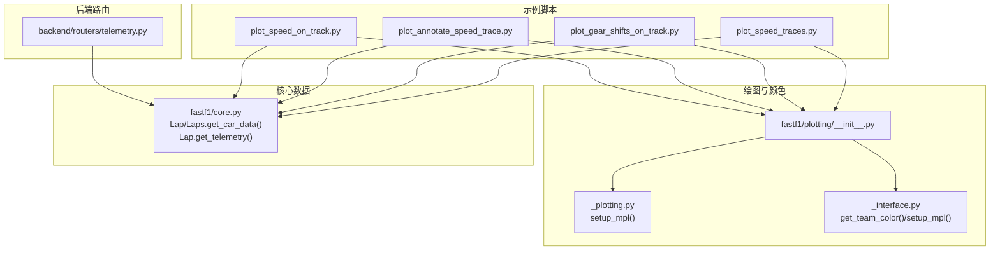
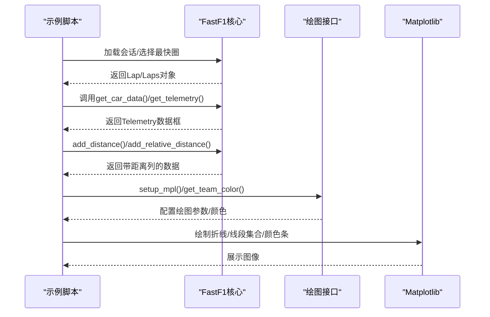
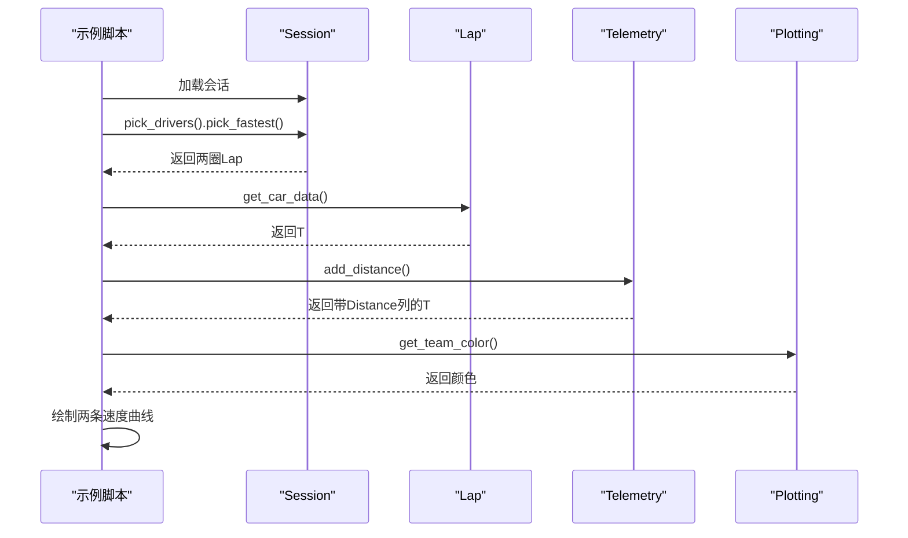
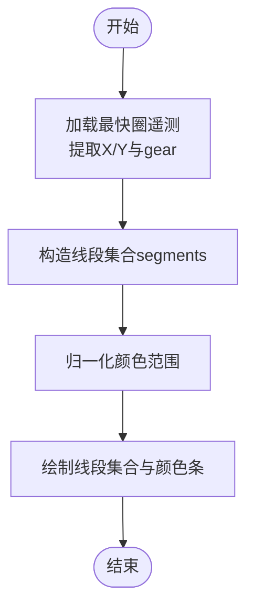
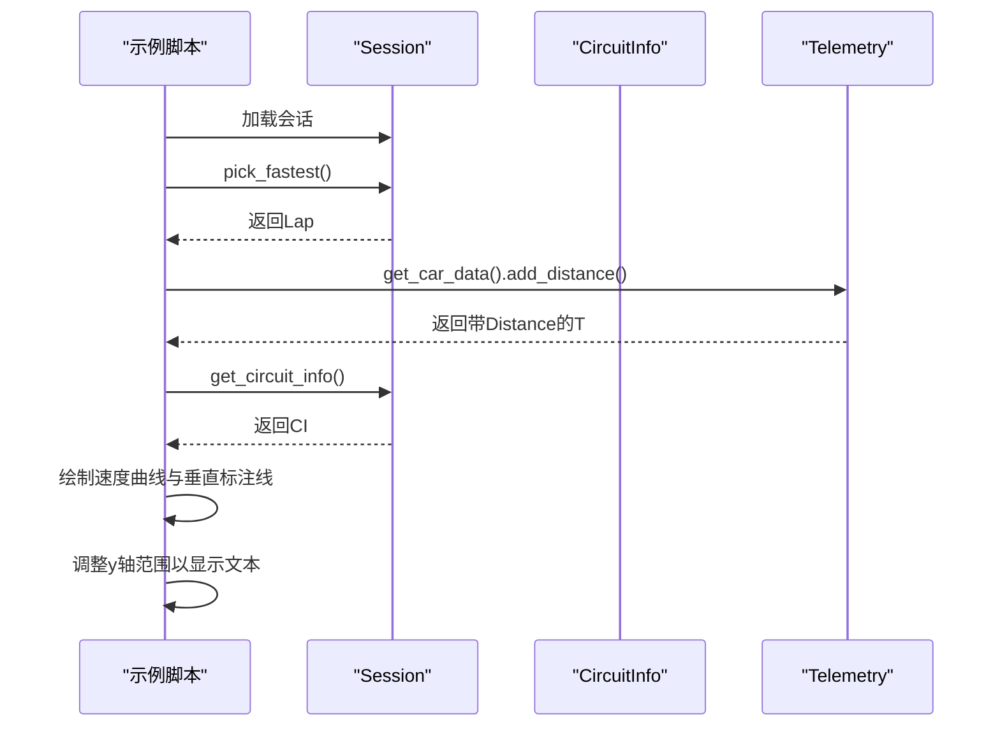
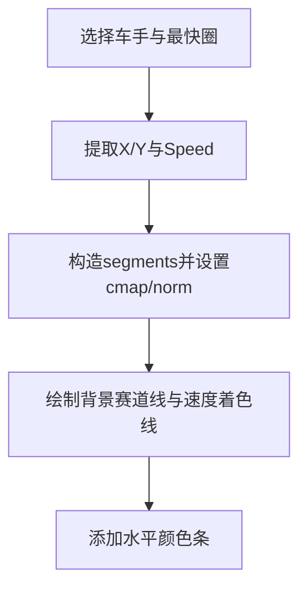
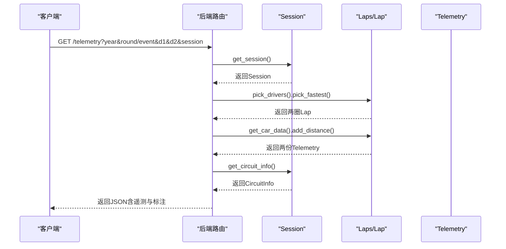
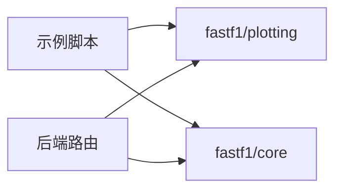

# 遥测数据分析示例

<cite>
**本文引用的文件**
- [examples/telemetry/plot_speed_traces.py](file://examples/telemetry/plot_speed_traces.py)
- [examples/telemetry/plot_gear_shifts_on_track.py](file://examples/telemetry/plot_gear_shifts_on_track.py)
- [examples/telemetry/plot_annotate_speed_trace.py](file://examples/telemetry/plot_annotate_speed_trace.py)
- [examples/telemetry/plot_speed_on_track.py](file://examples/telemetry/plot_speed_on_track.py)
- [fastf1/plotting/__init__.py](file://fastf1/plotting/__init__.py)
- [fastf1/plotting/_plotting.py](file://fastf1/plotting/_plotting.py)
- [fastf1/plotting/_interface.py](file://fastf1/plotting/_interface.py)
- [fastf1/core.py](file://fastf1/core.py)
- [backend/routers/telemetry.py](file://backend/routers/telemetry.py)
- [docs/getting_started/basics.rst](file://docs/getting_started/basics.rst)
</cite>

## 目录
1. [简介](#简介)
2. [项目结构](#项目结构)
3. [核心组件](#核心组件)
4. [架构总览](#架构总览)
5. [详细组件分析](#详细组件分析)
6. [依赖分析](#依赖分析)
7. [性能考虑](#性能考虑)
8. [故障排查指南](#故障排查指南)
9. [结论](#结论)
10. [附录](#附录)

## 简介
本教程围绕 Fast-F1 的遥测数据分析展开，系统讲解如何对车手遥测数据进行深度分析与可视化，包括：
- 速度轨迹对比与标注
- 换挡时机与齿轮使用在赛道上的可视化
- 赛道地图上的速度着色与颜色条
- 遥测数据的预处理、清洗与性能优化
- 实战案例与结果解读，以及常见问题的解决方案

教程以官方示例代码为依据，结合核心库的数据结构与接口，帮助读者从入门到进阶掌握遥测分析。

## 项目结构
遥测分析相关的核心示例位于 examples/telemetry 目录，配套的绘图工具与颜色方案由 fastf1/plotting 提供，底层数据结构与方法由 fastf1/core 提供，后端路由可作为服务化参考。

图表来源
- [examples/telemetry/plot_speed_traces.py:1-53](file://examples/telemetry/plot_speed_traces.py#L1-L53)
- [examples/telemetry/plot_gear_shifts_on_track.py:1-71](file://examples/telemetry/plot_gear_shifts_on_track.py#L1-L71)
- [examples/telemetry/plot_annotate_speed_trace.py:1-69](file://examples/telemetry/plot_annotate_speed_trace.py#L1-L69)
- [examples/telemetry/plot_speed_on_track.py:1-84](file://examples/telemetry/plot_speed_on_track.py#L1-L84)
- [fastf1/plotting/__init__.py:1-48](file://fastf1/plotting/__init__.py#L1-L48)
- [fastf1/plotting/_plotting.py:1-106](file://fastf1/plotting/_plotting.py#L1-L106)
- [fastf1/plotting/_interface.py:1-800](file://fastf1/plotting/_interface.py#L1-L800)
- [fastf1/core.py:3500-3699](file://fastf1/core.py#L3500-L3699)
- [backend/routers/telemetry.py:11-78](file://backend/routers/telemetry.py#L11-L78)

章节来源
- [examples/telemetry/plot_speed_traces.py:1-53](file://examples/telemetry/plot_speed_traces.py#L1-L53)
- [examples/telemetry/plot_gear_shifts_on_track.py:1-71](file://examples/telemetry/plot_gear_shifts_on_track.py#L1-L71)
- [examples/telemetry/plot_annotate_speed_trace.py:1-69](file://examples/telemetry/plot_annotate_speed_trace.py#L1-L69)
- [examples/telemetry/plot_speed_on_track.py:1-84](file://examples/telemetry/plot_speed_on_track.py#L1-L84)
- [fastf1/plotting/__init__.py:1-48](file://fastf1/plotting/__init__.py#L1-L48)
- [fastf1/plotting/_plotting.py:1-106](file://fastf1/plotting/_plotting.py#L1-L106)
- [fastf1/plotting/_interface.py:1-800](file://fastf1/plotting/_interface.py#L1-L800)
- [fastf1/core.py:3500-3699](file://fastf1/core.py#L3500-L3699)
- [backend/routers/telemetry.py:11-78](file://backend/routers/telemetry.py#L11-L78)

## 核心组件
- 会话与数据加载：通过会话对象加载事件与数据，支持缓存与按需下载。
- 遥测数据获取：Lap/Laps 提供 get_car_data() 与 get_telemetry()，后者合并位置与车辆数据并计算距离等派生通道。
- 距离列生成：add_distance() 对单圈或少量连续圈进行积分，生成“距离”列，便于横向比较。
- 绘图与颜色：setup_mpl() 启用时间刻度支持与主题配色；get_team_color() 获取车队颜色，用于线条与标注。
- 后端路由：提供遥测数据的聚合与返回，包含数据质量检查与标注信息。

章节来源
- [docs/getting_started/basics.rst:11-340](file://docs/getting_started/basics.rst#L11-L340)
- [fastf1/core.py:3500-3699](file://fastf1/core.py#L3500-L3699)
- [fastf1/core.py:767-826](file://fastf1/core.py#L767-L826)
- [fastf1/plotting/_plotting.py:29-106](file://fastf1/plotting/_plotting.py#L29-L106)
- [fastf1/plotting/_interface.py:279-315](file://fastf1/plotting/_interface.py#L279-L315)
- [backend/routers/telemetry.py:11-78](file://backend/routers/telemetry.py#L11-L78)

## 架构总览
下图展示从示例脚本到核心数据与绘图接口的整体调用链路。

图表来源
- [examples/telemetry/plot_speed_traces.py:17-52](file://examples/telemetry/plot_speed_traces.py#L17-L52)
- [examples/telemetry/plot_gear_shifts_on_track.py:17-70](file://examples/telemetry/plot_gear_shifts_on_track.py#L17-L70)
- [examples/telemetry/plot_annotate_speed_trace.py:18-68](file://examples/telemetry/plot_annotate_speed_trace.py#L18-L68)
- [examples/telemetry/plot_speed_on_track.py:26-83](file://examples/telemetry/plot_speed_on_track.py#L26-L83)
- [fastf1/core.py:3500-3699](file://fastf1/core.py#L3500-L3699)
- [fastf1/plotting/_plotting.py:29-106](file://fastf1/plotting/_plotting.py#L29-L106)
- [fastf1/plotting/_interface.py:279-315](file://fastf1/plotting/_interface.py#L279-L315)

## 详细组件分析

### 示例一：速度轨迹叠加对比（plot_speed_traces.py）
- 目标：对比两位车手的最快圈速度轨迹，使用车队颜色绘制。
- 关键步骤：
  - 加载会话并选择两位车手的最快圈。
  - 获取车辆遥测数据并添加“距离”列，确保横向可比。
  - 使用 get_team_color() 获取颜色，绘制两条速度曲线。
  - 设置标题、标签与图例，展示比赛名称与年份。
- 数据流与可视化要点：
  - add_distance() 保证不同圈长的轨迹在同一横轴上对齐。
  - get_team_color() 基于会话自动匹配车队颜色，提升可读性。
- 性能与稳定性：
  - 仅对单圈或少量连续圈使用 add_distance()，避免积分误差累积。

图表来源
- [examples/telemetry/plot_speed_traces.py:17-52](file://examples/telemetry/plot_speed_traces.py#L17-L52)
- [fastf1/core.py:3568-3587](file://fastf1/core.py#L3568-L3587)
- [fastf1/core.py:767-794](file://fastf1/core.py#L767-L794)
- [fastf1/plotting/_interface.py:279-315](file://fastf1/plotting/_interface.py#L279-L315)

章节来源
- [examples/telemetry/plot_speed_traces.py:17-52](file://examples/telemetry/plot_speed_traces.py#L17-L52)
- [fastf1/core.py:3568-3587](file://fastf1/core.py#L3568-L3587)
- [fastf1/core.py:767-794](file://fastf1/core.py#L767-L794)
- [fastf1/plotting/_interface.py:279-315](file://fastf1/plotting/_interface.py#L279-L315)

### 示例二：齿轮使用在赛道上的可视化（plot_gear_shifts_on_track.py）
- 目标：将齿轮号映射到赛道路径上，形成连续的颜色分段线。
- 关键步骤：
  - 加载最快圈遥测，提取 X/Y 坐标与齿轮列。
  - 将相邻点组合为线段集合，设置分段颜色映射与归一化范围。
  - 绘制等比例坐标系，隐藏坐标轴刻度，添加颜色条标注齿轮值。
- 可视化技巧：
  - 使用 LineCollection 与自定义 colormap，实现平滑的齿轮过渡。
  - 归一化至整数齿轮范围，颜色条刻度居中显示齿轮编号。
- 数据准备：
  - gear 列来自遥测的 nGear，需转换为浮点类型以适配颜色映射。

图表来源
- [examples/telemetry/plot_gear_shifts_on_track.py:17-70](file://examples/telemetry/plot_gear_shifts_on_track.py#L17-L70)

章节来源
- [examples/telemetry/plot_gear_shifts_on_track.py:17-70](file://examples/telemetry/plot_gear_shifts_on_track.py#L17-L70)

### 示例三：带弯角标注的速度轨迹（plot_annotate_speed_trace.py）
- 目标：在速度轨迹上标注弯角位置与编号，辅助分析刹车与过弯策略。
- 关键步骤：
  - 获取最快圈车辆数据与“距离”列。
  - 通过 session.get_circuit_info() 获取弯角信息（含距离）。
  - 绘制速度曲线，并在每个弯角处绘制垂直虚线与编号文本。
  - 手动调整 y 轴范围以容纳文本标签。
- 实用提示：
  - 当弯角密集时，文本可能重叠，需要进一步优化布局或筛选关键弯角。

图表来源
- [examples/telemetry/plot_annotate_speed_trace.py:18-68](file://examples/telemetry/plot_annotate_speed_trace.py#L18-L68)

章节来源
- [examples/telemetry/plot_annotate_speed_trace.py:18-68](file://examples/telemetry/plot_annotate_speed_trace.py#L18-L68)

### 示例四：赛道地图上的速度着色（plot_speed_on_track.py）
- 目标：在赛道轮廓上按速度着色，直观反映不同弯角与直道的速度差异。
- 关键步骤：
  - 选择目标车手与最快圈，提取 X/Y 与 Speed。
  - 构造线段集合并设置颜色映射与归一化。
  - 绘制黑色背景赛道线与彩色速度线，添加水平颜色条。
- 最佳实践：
  - 使用 off 轴与合适的尺寸，提升视觉效果。
  - 速度最小/最大值用于颜色条的归一化，确保一致性。

图表来源
- [examples/telemetry/plot_speed_on_track.py:26-83](file://examples/telemetry/plot_speed_on_track.py#L26-L83)

章节来源
- [examples/telemetry/plot_speed_on_track.py:26-83](file://examples/telemetry/plot_speed_on_track.py#L26-L83)

### 遥测数据预处理与清洗
- 距离列生成：
  - add_distance() 基于数值积分生成“距离”列，适合单圈或少量连续圈。
  - 若已有该列且需要保留原值，可使用 drop_existing=False 控制行为。
- 相对距离与微分距离：
  - add_relative_distance() 将距离标准化到 [0,1] 区间，便于统一尺度。
  - add_differential_distance() 计算相邻采样间的微分距离，辅助里程统计。
- 遥测频率与插值：
  - get_telemetry() 在合并位置与车辆数据时进行重采样，默认频率由内部常量控制。
  - 可通过 frequency 参数覆盖默认频率，平衡精度与性能。

章节来源
- [fastf1/core.py:738-765](file://fastf1/core.py#L738-L765)
- [fastf1/core.py:767-826](file://fastf1/core.py#L767-L826)
- [fastf1/core.py:3523-3566](file://fastf1/core.py#L3523-L3566)

### 可视化最佳实践
- 颜色与主题：
  - setup_mpl() 启用时间刻度支持与 FastF1 主题配色，提升图表一致性。
  - get_team_color() 自动匹配车队颜色，减少手动配置。
- 线段与颜色映射：
  - 使用 LineCollection 与 colormap/norm 实现连续渐变。
  - 归一化范围应覆盖有效数据范围，颜色条刻度居中显示整数标签。
- 文本与标注：
  - 手动调整坐标轴范围以容纳额外文本。
  - 对密集标注场景，考虑筛选关键标注或采用交互式标注。

章节来源
- [fastf1/plotting/_plotting.py:29-106](file://fastf1/plotting/_plotting.py#L29-L106)
- [fastf1/plotting/_interface.py:279-315](file://fastf1/plotting/_interface.py#L279-L315)
- [examples/telemetry/plot_gear_shifts_on_track.py:40-67](file://examples/telemetry/plot_gear_shifts_on_track.py#L40-L67)
- [examples/telemetry/plot_annotate_speed_trace.py:45-66](file://examples/telemetry/plot_annotate_speed_trace.py#L45-L66)

### 后端路由集成（可选）
- 功能概述：
  - 路由根据年份、轮次/事件、车手与会话类型获取两车最快圈遥测。
  - 计算总距离与弯角标注，进行数据质量检查（如遥测截断）。
  - 返回车手信息、颜色、最快圈时间差与遥测数据字典。
- 实战价值：
  - 可作为 Web 服务的遥测分析接口，前端渲染多车对比与标注。

图表来源
- [backend/routers/telemetry.py:11-78](file://backend/routers/telemetry.py#L11-L78)

章节来源
- [backend/routers/telemetry.py:11-78](file://backend/routers/telemetry.py#L11-L78)

## 依赖分析
- 示例脚本依赖：
  - fastf1/plotting：setup_mpl()、get_team_color()。
  - fastf1/core：Lap/Laps.get_car_data()/get_telemetry()、Telemetry.add_distance()/add_relative_distance()。
- 后端路由依赖：
  - fastf1/core：Session/Lap/Laps、Telemetry。
  - fastf1/plotting：get_driver_color()（可选回退）。

图表来源
- [examples/telemetry/plot_speed_traces.py:10-15](file://examples/telemetry/plot_speed_traces.py#L10-L15)
- [examples/telemetry/plot_gear_shifts_on_track.py:14-14](file://examples/telemetry/plot_gear_shifts_on_track.py#L14-L14)
- [examples/telemetry/plot_annotate_speed_trace.py:10-15](file://examples/telemetry/plot_annotate_speed_trace.py#L10-L15)
- [examples/telemetry/plot_speed_on_track.py:11-11](file://examples/telemetry/plot_speed_on_track.py#L11-L11)
- [fastf1/core.py:3500-3699](file://fastf1/core.py#L3500-L3699)
- [fastf1/plotting/_interface.py:279-315](file://fastf1/plotting/_interface.py#L279-L315)
- [backend/routers/telemetry.py:24-28](file://backend/routers/telemetry.py#L24-L28)

章节来源
- [examples/telemetry/plot_speed_traces.py:10-15](file://examples/telemetry/plot_speed_traces.py#L10-L15)
- [examples/telemetry/plot_gear_shifts_on_track.py:14-14](file://examples/telemetry/plot_gear_shifts_on_track.py#L14-L14)
- [examples/telemetry/plot_annotate_speed_trace.py:10-15](file://examples/telemetry/plot_annotate_speed_trace.py#L10-L15)
- [examples/telemetry/plot_speed_on_track.py:11-11](file://examples/telemetry/plot_speed_on_track.py#L11-L11)
- [fastf1/core.py:3500-3699](file://fastf1/core.py#L3500-L3699)
- [fastf1/plotting/_interface.py:279-315](file://fastf1/plotting/_interface.py#L279-L315)
- [backend/routers/telemetry.py:24-28](file://backend/routers/telemetry.py#L24-L28)

## 性能考虑
- 数据加载与缓存：
  - 使用 Session.load() 并启用内置缓存，避免重复下载与解析。
- 遥测频率与重采样：
  - 默认频率已针对实时数据优化；若仅做粗略分析，可通过频率参数降低采样率以节省内存与计算。
- 积分与距离列：
  - add_distance() 适用于单圈或少量连续圈；对大量圈数进行积分会累积误差，建议分批处理。
- 可视化优化：
  - 使用 LineCollection 处理大量线段，避免逐点绘制。
  - 归一化与 colormap 缓存，减少重复计算。

## 故障排查指南
- 遥测数据为空或截断：
  - 后端路由中包含数据质量检查，若某车遥测末尾距离显著低于总距离，会返回提示信息，通常由 F1 API 数据包丢失导致。
- 颜色获取异常：
  - get_driver_color() 回退到默认颜色，确保图表仍可正常显示。
- 弯角标注重叠：
  - 当弯角密集时，文本可能重叠。建议筛选关键弯角或调整字体大小与布局。
- 速度着色不连续：
  - 确保 X/Y 与 Speed 数组长度一致，且未被过滤掉中间点；检查归一化范围是否覆盖全部有效值。

章节来源
- [backend/routers/telemetry.py:36-44](file://backend/routers/telemetry.py#L36-L44)
- [examples/telemetry/plot_annotate_speed_trace.py:52-58](file://examples/telemetry/plot_annotate_speed_trace.py#L52-L58)
- [examples/telemetry/plot_speed_on_track.py:64-66](file://examples/telemetry/plot_speed_on_track.py#L64-L66)

## 结论
通过以上示例与核心组件的配合，可以高效完成遥测数据的速度轨迹对比、齿轮使用可视化与赛道标注等分析任务。建议在实践中遵循数据预处理与可视化最佳实践，结合后端路由实现服务化部署，以支撑更复杂的分析与展示需求。

## 附录
- 快速上手与数据对象说明可参考入门文档中的会话与数据加载部分，有助于理解示例脚本的上下文与数据来源。

章节来源
- [docs/getting_started/basics.rst:11-340](file://docs/getting_started/basics.rst#L11-L340)