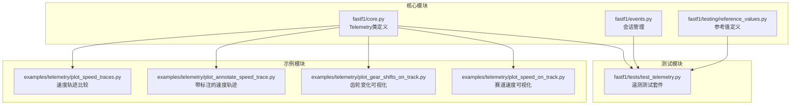
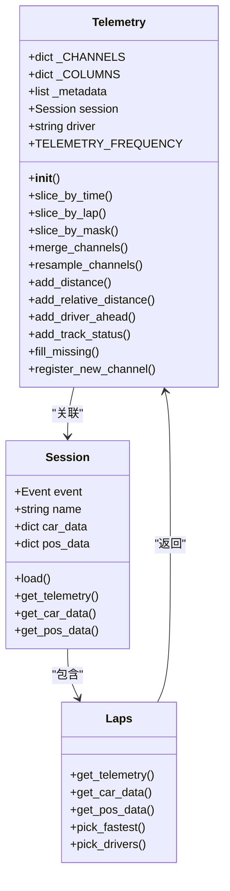
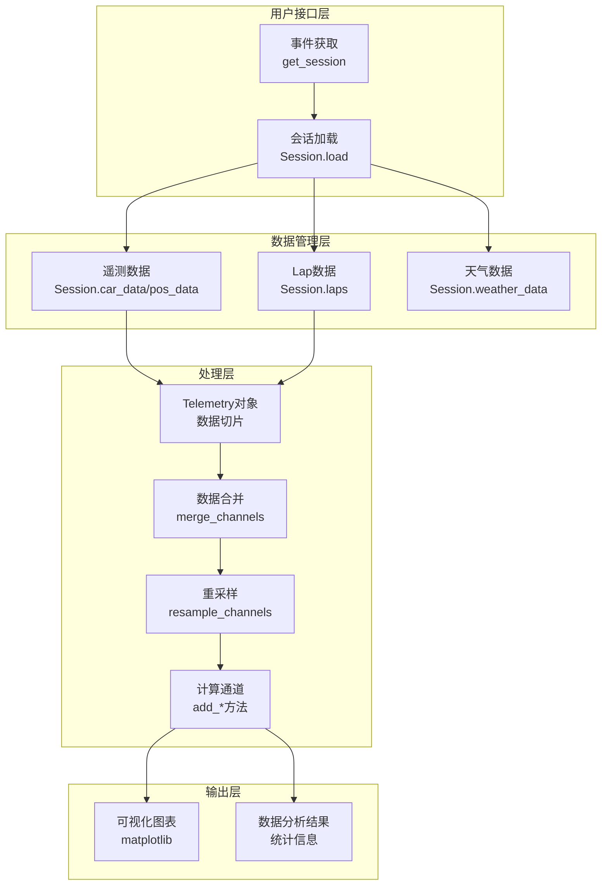
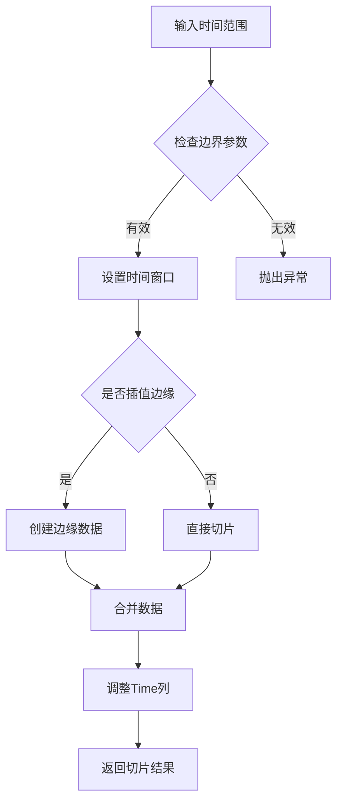
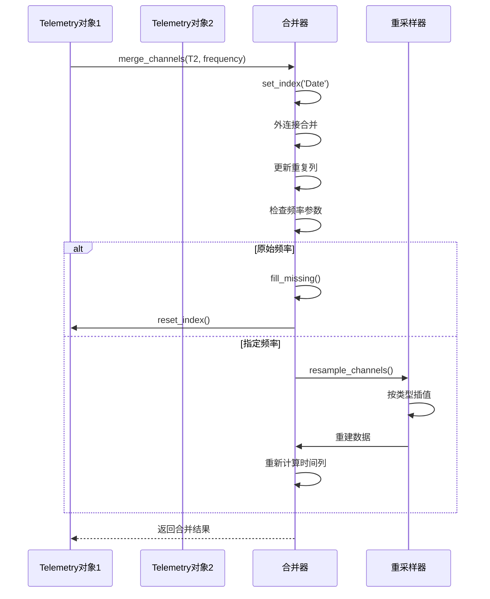
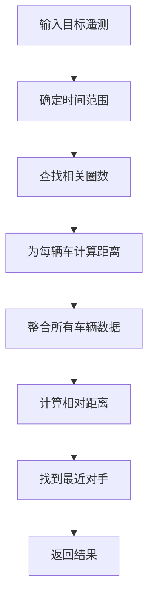
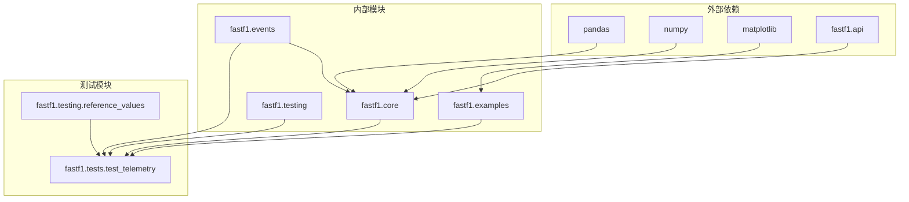

# 遥测比较测试

<cite>
**本文档引用的文件**
- [test_telemetry.py](file://fastf1/tests/test_telemetry.py)
- [core.py](file://fastf1/core.py)
- [reference_values.py](file://fastf1/testing/reference_values.py)
- [events.py](file://fastf1/events.py)
- [plot_speed_traces.py](file://examples/telemetry/plot_speed_traces.py)
- [plot_annotate_speed_trace.py](file://examples/telemetry/plot_annotate_speed_trace.py)
- [plot_gear_shifts_on_track.py](file://examples/telemetry/plot_gear_shifts_on_track.py)
- [plot_speed_on_track.py](file://examples/telemetry/plot_speed_on_track.py)
</cite>

## 目录
1. [简介](#简介)
2. [项目结构](#项目结构)
3. [核心组件](#核心组件)
4. [架构概览](#架构概览)
5. [详细组件分析](#详细组件分析)
6. [依赖关系分析](#依赖关系分析)
7. [性能考虑](#性能考虑)
8. [故障排除指南](#故障排除指南)
9. [结论](#结论)

## 简介

本文档深入分析Fast-F1项目中的遥测比较测试系统。Fast-F1是一个用于F1赛车数据分析的Python库，专门处理实时和历史F1数据。遥测比较测试是该系统的核心功能之一，允许用户比较不同车手、不同圈次或不同时段的遥测数据。

该测试系统基于Telemetry类构建，提供了丰富的遥测数据处理和分析功能，包括数据合并、插值、重采样和各种计算通道的添加。测试覆盖了从基础的切片操作到复杂的多车比较分析的完整功能链。

## 项目结构

Fast-F1项目采用模块化架构设计，遥测比较测试相关的文件主要分布在以下目录：

**图表来源**
- [core.py:64-150](file://fastf1/core.py#L64-L150)
- [test_telemetry.py:1-50](file://fastf1/tests/test_telemetry.py#L1-L50)

**章节来源**
- [core.py:1-100](file://fastf1/core.py#L1-L100)
- [test_telemetry.py:1-50](file://fastf1/tests/test_telemetry.py#L1-L50)

## 核心组件

### Telemetry类架构

Telemetry类是整个遥测比较测试系统的核心，继承自pandas DataFrame，提供了专门的时间序列遥测数据处理能力：

**图表来源**
- [core.py:64-200](file://fastf1/core.py#L64-L200)
- [core.py:1152-1350](file://fastf1/core.py#L1152-L1350)
- [core.py:2730-2830](file://fastf1/core.py#L2730-L2830)

### 遥测通道系统

系统支持多种预定义的遥测通道类型：

| 通道类型 | 数据类型 | 插值方法 | 示例 |
|---------|---------|---------|------|
| 连续信号 | Speed, RPM, Distance | 线性插值 | `quadratic` |
| 离散信号 | nGear, Brake, DRS | 前向填充 | `pad` |
| 排除信号 | Date, Time, Source | 特殊处理 | `excluded` |

**章节来源**
- [core.py:154-200](file://fastf1/core.py#L154-L200)
- [core.py:692-725](file://fastf1/core.py#L692-L725)

## 架构概览

遥测比较测试系统的整体架构采用分层设计：

**图表来源**
- [events.py:50-138](file://fastf1/events.py#L50-L138)
- [core.py:1293-1310](file://fastf1/core.py#L1293-L1310)
- [core.py:2862-2907](file://fastf1/core.py#L2862-L2907)

## 详细组件分析

### 遥测数据切片系统

遥测数据切片是比较测试的基础功能，支持多种切片方式：

#### 时间切片

**图表来源**
- [core.py:342-390](file://fastf1/core.py#L342-L390)

#### 圈次切片
圈次切片功能允许按特定圈数进行数据提取：

**章节来源**
- [core.py:291-341](file://fastf1/core.py#L291-L341)
- [test_telemetry.py:145-163](file://fastf1/tests/test_telemetry.py#L145-L163)

### 数据合并与重采样

数据合并是遥测比较的核心功能，支持不同频率和类型的遥测数据融合：

**图表来源**
- [core.py:391-570](file://fastf1/core.py#L391-L570)

**章节来源**
- [core.py:391-570](file://fastf1/core.py#L391-L570)
- [test_telemetry.py:166-221](file://fastf1/tests/test_telemetry.py#L166-L221)

### 计算通道系统

系统提供多种计算通道，用于增强遥测数据的分析能力：

#### 距离计算
距离计算通过数值积分实现，支持差分距离和累积距离两种模式：

**章节来源**
- [core.py:738-794](file://fastf1/core.py#L738-L794)
- [core.py:941-970](file://fastf1/core.py#L941-L970)

#### 对手距离计算
对手距离计算是高级分析功能，需要考虑多车的相对位置关系：

**图表来源**
- [core.py:971-1150](file://fastf1/core.py#L971-L1150)

**章节来源**
- [core.py:877-940](file://fastf1/core.py#L877-L940)
- [test_telemetry.py:290-312](file://fastf1/tests/test_telemetry.py#L290-L312)

### 可视化比较功能

系统提供了丰富的可视化选项来展示遥测比较结果：

#### 速度轨迹比较

**图表来源**
- [plot_speed_traces.py:24-52](file://examples/telemetry/plot_speed_traces.py#L24-L52)

**章节来源**
- [plot_speed_traces.py:1-53](file://examples/telemetry/plot_speed_traces.py#L1-L53)
- [plot_annotate_speed_trace.py:1-69](file://examples/telemetry/plot_annotate_speed_trace.py#L1-L69)

## 依赖关系分析

遥测比较测试系统的依赖关系呈现清晰的层次结构：

**图表来源**
- [core.py:1-40](file://fastf1/core.py#L1-L40)
- [test_telemetry.py:1-12](file://fastf1/tests/test_telemetry.py#L1-L12)

**章节来源**
- [core.py:1-40](file://fastf1/core.py#L1-L40)
- [reference_values.py:1-10](file://fastf1/testing/reference_values.py#L1-L10)

## 性能考虑

遥测比较测试系统在性能方面采用了多项优化策略：

### 内存管理
- 使用pandas的高效数据结构存储大量遥测数据
- 支持按需加载和延迟计算
- 提供数据降采样功能以减少内存占用

### 计算优化
- 批量数据处理避免重复计算
- 缓存机制减少重复查询
- 向量化操作提升计算效率

### 并行处理
- 支持多车数据的并行处理
- 异步数据加载机制
- 内存映射文件支持大文件处理

## 故障排除指南

### 常见问题及解决方案

#### 数据类型错误
当遥测数据的列类型不符合预期时，系统会抛出TypeError异常。解决方法是使用`ensure_data_type`函数验证数据类型。

#### 频率不匹配
不同源的遥测数据可能具有不同的采样频率。系统提供了灵活的重采样机制来解决这个问题。

#### 内存不足
对于大型遥测数据集，建议使用降采样功能或分批处理策略。

**章节来源**
- [reference_values.py:4-10](file://fastf1/testing/reference_values.py#L4-L10)
- [test_telemetry.py:94-101](file://fastf1/tests/test_telemetry.py#L94-L101)

## 结论

Fast-F1的遥测比较测试系统展现了现代数据分析框架的最佳实践。通过精心设计的架构和丰富的功能特性，该系统能够高效地处理复杂的F1遥测数据比较需求。

系统的主要优势包括：

1. **模块化设计**：清晰的层次结构便于维护和扩展
2. **高性能处理**：优化的数据结构和算法确保快速响应
3. **灵活的比较功能**：支持多种比较维度和分析角度
4. **强大的可视化**：直观的图表展示分析结果
5. **完善的测试覆盖**：全面的单元测试确保代码质量

该系统为F1数据分析提供了坚实的技术基础，能够满足从基础比较到高级分析的各种需求。