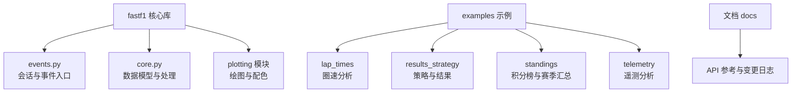
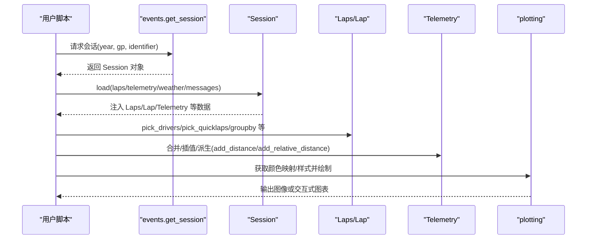
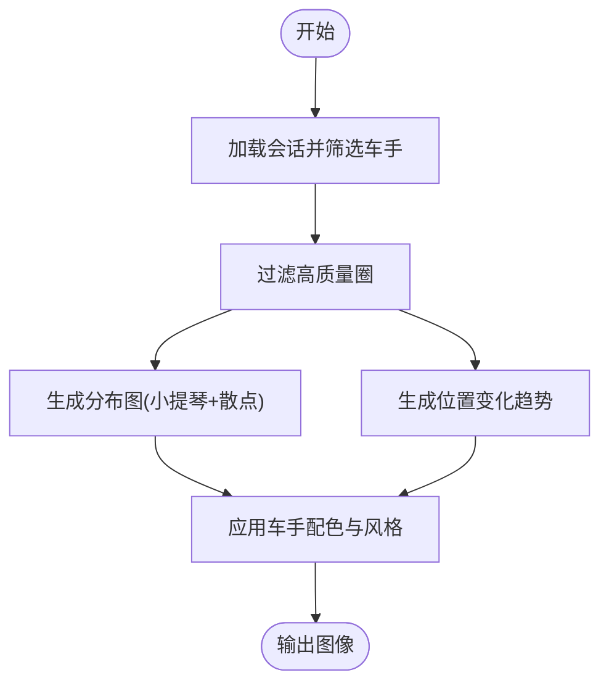
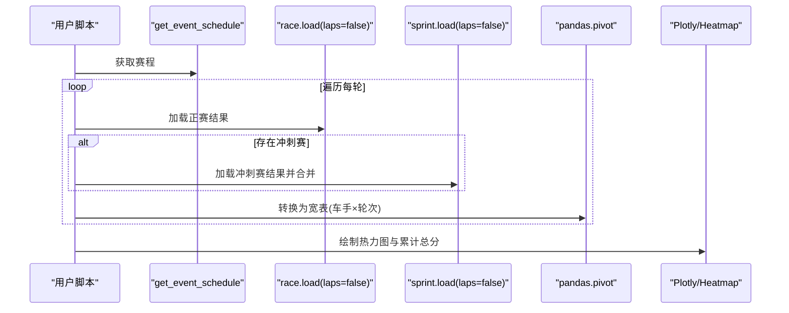
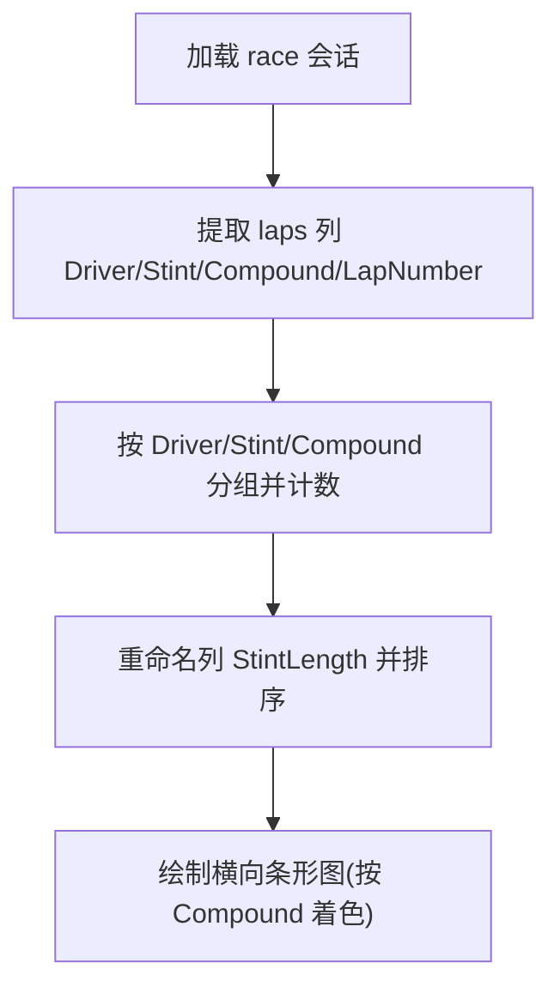
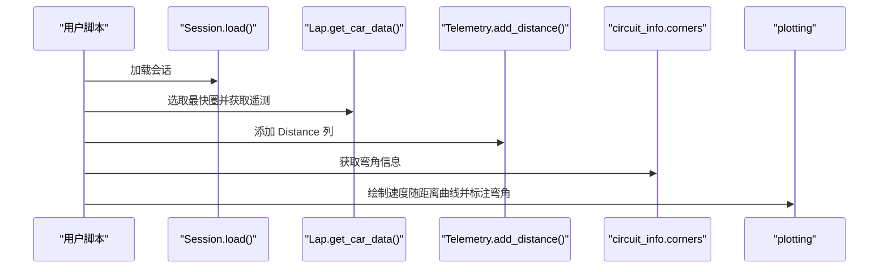
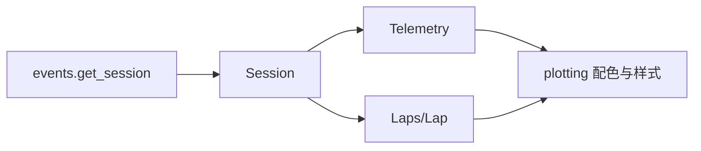

# 高级教程

<cite>
**本文引用的文件**
- [README.md](file://README.md)
- [fastf1/__init__.py](file://fastf1/__init__.py)
- [fastf1/core.py](file://fastf1/core.py)
- [fastf1/events.py](file://fastf1/events.py)
- [examples/lap_times/plot_driver_laptimes.py](file://examples/lap_times/plot_driver_laptimes.py)
- [examples/lap_times/plot_laptimes_distribution.py](file://examples/lap_times/plot_laptimes_distribution.py)
- [examples/results_strategy/plot_strategy.py](file://examples/results_strategy/plot_strategy.py)
- [examples/results_strategy/plot_position_changes.py](file://examples/results_strategy/plot_position_changes.py)
- [examples/results_strategy/plot_team_pace_ranking.py](file://examples/results_strategy/plot_team_pace_ranking.py)
- [examples/standings/plot_season_summary.py](file://examples/standings/plot_season_summary.py)
- [examples/standings/plot_results_tracker.py](file://examples/standings/plot_results_tracker.py)
- [examples/telemetry/plot_speed_traces.py](file://examples/telemetry/plot_speed_traces.py)
- [examples/telemetry/plot_annotate_speed_trace.py](file://examples/telemetry/plot_annotate_speed_trace.py)
</cite>

## 目录
1. [引言](#引言)
2. [项目结构](#项目结构)
3. [核心组件](#核心组件)
4. [架构总览](#架构总览)
5. [详细组件分析](#详细组件分析)
6. [依赖关系分析](#依赖关系分析)
7. [性能考量](#性能考量)
8. [故障排除指南](#故障排除指南)
9. [结论](#结论)
10. [附录](#附录)

## 引言
本高级教程面向有经验的 Fast-F1 用户，聚焦于复杂分析场景的实现与工程化落地：多车手对比分析、跨赛季数据整合、自定义分析工具开发。教程将结合多个示例，系统讲解如何组合与扩展功能，提供性能优化、大数据处理与内存管理策略，并给出可复用的项目案例与调试排障方法，帮助读者在真实业务中构建稳定高效的分析解决方案。

## 项目结构
Fast-F1 采用“核心库 + 示例 + 文档”的清晰分层：
- 核心库位于 fastf1 包，提供会话加载、数据模型（如 Session/Laps/Lap/Telemetry）、绘图接口与缓存机制等
- examples 目录包含按主题划分的示例脚本，覆盖圈速、策略、积分榜、遥测等典型分析
- 文档目录 docs 提供 API 参考、变更日志与使用说明

**图表来源**
- [fastf1/events.py:50-139](file://fastf1/events.py#L50-L139)
- [fastf1/core.py:64-200](file://fastf1/core.py#L64-L200)

**章节来源**
- [README.md:1-75](file://README.md#L1-L75)
- [fastf1/__init__.py:17-26](file://fastf1/__init__.py#L17-L26)

## 核心组件
- 会话与事件入口：通过 get_session 等函数创建 Session 对象，再调用 load 加载所需数据（圈速、遥测、天气、消息等）
- 数据模型：Laps/Lap/Telemetry 等对象以扩展的 Pandas DataFrame 形式承载，提供丰富的筛选、合并、插值与派生计算能力
- 绘图与配色：plotting 模块提供颜色映射、样式设置与时间类型支持，便于快速可视化
- 缓存与请求：内置缓存机制减少重复请求，提高脚本执行效率

**章节来源**
- [fastf1/events.py:50-139](file://fastf1/events.py#L50-L139)
- [fastf1/core.py:64-200](file://fastf1/core.py#L64-L200)
- [fastf1/__init__.py:17-26](file://fastf1/__init__.py#L17-L26)

## 架构总览
下图展示了从会话创建到数据加载与可视化的端到端流程，以及 Telemetry 的合并与插值处理路径。

**图表来源**
- [fastf1/events.py:50-139](file://fastf1/events.py#L50-L139)
- [fastf1/core.py:391-569](file://fastf1/core.py#L391-L569)
- [examples/lap_times/plot_driver_laptimes.py:22-47](file://examples/lap_times/plot_driver_laptimes.py#L22-L47)
- [examples/telemetry/plot_speed_traces.py:24-43](file://examples/telemetry/plot_speed_traces.py#L24-L43)

## 详细组件分析

### 多车手对比分析（圈速分布与位置变化）
目标：对多名车手在同一场比赛中的圈速分布、位置变化进行对比分析与可视化。

- 基础流程
  - 使用 get_session 创建会话并加载数据
  - 通过 pick_drivers/pick_quicklaps 过滤出目标车手与高质量圈
  - 使用 seaborn/matplotlib 绘制分布图与位置趋势线
- 关键点
  - 圈速分布：将 timedelta 转换为秒，使用小提琴图与散点叠加展示分布与异常值
  - 位置变化：按圈数绘制每名车手的位置序列，使用风格映射区分车手
- 实战要点
  - 先筛选点位车手，再统一排序，确保不同图层一致
  - 使用 plotting.get_driver_color_mapping/get_driver_style 获取统一配色与风格

**图表来源**
- [examples/lap_times/plot_laptimes_distribution.py:25-70](file://examples/lap_times/plot_laptimes_distribution.py#L25-L70)
- [examples/results_strategy/plot_position_changes.py:29-39](file://examples/results_strategy/plot_position_changes.py#L29-L39)

**章节来源**
- [examples/lap_times/plot_laptimes_distribution.py:1-81](file://examples/lap_times/plot_laptimes_distribution.py#L1-L81)
- [examples/results_strategy/plot_position_changes.py:1-56](file://examples/results_strategy/plot_position_changes.py#L1-L56)

### 跨赛季数据整合（赛季摘要与结果追踪）
目标：整合多个赛季的数据，生成交互式热力图与累计积分排行，支持按轮次/车手维度查看。

- 基础流程
  - 获取赛程 schedule，遍历每轮比赛加载结果
  - 合并正赛与冲刺赛（若存在）的积分，形成“车手-轮次”矩阵
  - 使用 pivot 将长表转宽表，生成热力图与累计总分排序
- 关键点
  - 仅加载结果数据，避免遥测/天气等大体量数据
  - 使用 Plotly 或 Matplotlib/Seaborn 绘制交互式热力图
- 实战要点
  - 对缺失值进行填充或标注，保证视觉一致性
  - 通过 hover 文本附加更多信息（如排名）

**图表来源**
- [examples/standings/plot_season_summary.py:17-91](file://examples/standings/plot_season_summary.py#L17-L91)
- [examples/standings/plot_results_tracker.py:16-60](file://examples/standings/plot_results_tracker.py#L16-L60)

**章节来源**
- [examples/standings/plot_season_summary.py:1-170](file://examples/standings/plot_season_summary.py#L1-L170)
- [examples/standings/plot_results_tracker.py:1-93](file://examples/standings/plot_results_tracker.py#L1-L93)

### 自定义分析工具开发（策略可视化与团队节奏）
目标：基于 Laps 分组统计各车手的进站策略与团队节奏对比。

- 基础流程
  - 加载 race 会话，按 Driver/Stint/Compound 分组统计进站长度
  - 生成横向条形图，标注复合轮胎颜色，按节奏排序团队
- 关键点
  - 使用 groupby + count 计算进站长度
  - 通过 get_compound_color/get_team_color 获取统一配色
- 实战要点
  - 对团队进行中位数排序，确保节奏对比直观
  - 控制网格与边框颜色，提升可读性

**图表来源**
- [examples/results_strategy/plot_strategy.py:37-70](file://examples/results_strategy/plot_strategy.py#L37-L70)
- [examples/results_strategy/plot_team_pace_ranking.py:34-41](file://examples/results_strategy/plot_team_pace_ranking.py#L34-L41)

**章节来源**
- [examples/results_strategy/plot_strategy.py:1-91](file://examples/results_strategy/plot_strategy.py#L1-L91)
- [examples/results_strategy/plot_team_pace_ranking.py:1-69](file://examples/results_strategy/plot_team_pace_ranking.py#L1-L69)

### 遥测深度分析（速度轨迹与弯角标注）
目标：对单圈或多圈遥测进行距离归一化与叠加对比，结合赛道信息进行弯角标注。

- 基础流程
  - 选择目标车手最快圈，获取遥测并添加 Distance 列
  - 使用 add_distance 将速度随距离展开，便于跨圈对比
  - 结合 circuit_info.corners 在图上标注弯角
- 关键点
  - add_distance 与 merge_channels 支持多通道合并与插值
  - 通过 get_team_color 获取统一配色
- 实战要点
  - 注意时间戳对齐与边缘插值，确保起点/终点精确
  - 文本标注需考虑重叠问题，必要时调整布局

**图表来源**
- [examples/telemetry/plot_speed_traces.py:24-43](file://examples/telemetry/plot_speed_traces.py#L24-L43)
- [examples/telemetry/plot_annotate_speed_trace.py:25-58](file://examples/telemetry/plot_annotate_speed_trace.py#L25-L58)
- [fastf1/core.py:391-569](file://fastf1/core.py#L391-L569)

**章节来源**
- [examples/telemetry/plot_speed_traces.py:1-53](file://examples/telemetry/plot_speed_traces.py#L1-L53)
- [examples/telemetry/plot_annotate_speed_trace.py:1-69](file://examples/telemetry/plot_annotate_speed_trace.py#L1-L69)
- [fastf1/core.py:391-569](file://fastf1/core.py#L391-L569)

## 依赖关系分析
- 低耦合设计：events.py 提供会话入口，core.py 提供数据模型，plotting 提供可视化辅助，三者职责清晰
- 扩展点丰富：Telemetry 支持注册新通道与自定义插值方法；Session.load 支持按需加载，降低内存占用
- 可视化生态：Matplotlib/Seaborn/Plotly 并存，满足静态图与交互图需求

**图表来源**
- [fastf1/events.py:50-139](file://fastf1/events.py#L50-L139)
- [fastf1/core.py:64-200](file://fastf1/core.py#L64-L200)

**章节来源**
- [fastf1/events.py:50-139](file://fastf1/events.py#L50-L139)
- [fastf1/core.py:64-200](file://fastf1/core.py#L64-L200)

## 性能考量
- 按需加载
  - 使用 Session.load(laps=False, telemetry=False, weather=False, messages=False) 仅加载结果数据，显著降低内存与网络开销
- 缓存与重用
  - 利用内置缓存机制，避免重复请求；合理组织数据结构，减少重复计算
- 插值与采样
  - 合理使用 merge_channels 与 resample_channels，避免多次重采样导致精度损失
- 内存管理
  - 对大 DataFrame 进行分块处理或延迟计算；及时释放中间变量，防止内存泄漏
- 可视化优化
  - 对高密度散点图使用透明度与抖动；对热力图控制分辨率与颜色映射范围

[本节为通用指导，无需特定文件来源]

## 故障排除指南
- 会话标识错误
  - 现象：找不到匹配的会话或标识无效
  - 排查：确认年份、大奖赛名称/轮次与会话标识是否正确；必要时启用模糊匹配
- 数据未加载
  - 现象：Laps/Telemetry 为空
  - 排查：检查 load 参数是否遗漏；确认后端可用性与网络状态
- 插值异常
  - 现象：合并/重采样后出现 NaN 或类型不匹配
  - 排查：检查通道类型与插值方法；必要时注册自定义通道
- 可视化显示异常
  - 现象：时间轴显示异常或颜色映射不一致
  - 排查：确保已调用 plotting.setup_mpl；核对颜色映射函数参数

**章节来源**
- [fastf1/events.py:120-136](file://fastf1/events.py#L120-L136)
- [fastf1/core.py:420-470](file://fastf1/core.py#L420-L470)

## 结论
通过将多车手对比、跨赛季整合与遥测深度分析相结合，Fast-F1 能够支撑从入门到高级的全栈分析需求。建议在工程实践中遵循“按需加载—缓存复用—插值谨慎—可视化优化”的原则，配合统一的颜色与风格体系，构建可维护、高性能且可扩展的分析平台。

[本节为总结性内容，无需特定文件来源]

## 附录

### 实战案例：构建“车手-轮次-积分”分析仪表盘
- 目标：按轮次展示车手积分热力图，并叠加累计总分排序
- 步骤
  - 获取赛程与每轮结果，合并冲刺赛积分
  - pivot 宽表并按总分降序排序
  - 使用 Plotly 绘制双子图：轮次热力图 + 总分直方图
- 参考示例
  - [examples/standings/plot_season_summary.py:17-91](file://examples/standings/plot_season_summary.py#L17-L91)
  - [examples/standings/plot_results_tracker.py:16-60](file://examples/standings/plot_results_tracker.py#L16-L60)

**章节来源**
- [examples/standings/plot_season_summary.py:1-170](file://examples/standings/plot_season_summary.py#L1-L170)
- [examples/standings/plot_results_tracker.py:1-93](file://examples/standings/plot_results_tracker.py#L1-L93)

### 高级练习任务
- 多车手遥测对比：在相同距离刻度下叠加多圈速度曲线，标注刹车与加档点
  - 参考：[examples/telemetry/plot_speed_traces.py:24-43](file://examples/telemetry/plot_speed_traces.py#L24-L43)
- 策略与进站时机：结合 TimingAppData 与 PitStop 事件，分析进站窗口与轮胎策略
  - 参考：[examples/results_strategy/plot_strategy.py:37-70](file://examples/results_strategy/plot_strategy.py#L37-L70)
- 赛季趋势分析：按季度统计车手积分与排名变化，识别领先者与追赶者
  - 参考：[examples/standings/plot_season_summary.py:17-91](file://examples/standings/plot_season_summary.py#L17-L91)

**章节来源**
- [examples/telemetry/plot_speed_traces.py:1-53](file://examples/telemetry/plot_speed_traces.py#L1-L53)
- [examples/results_strategy/plot_strategy.py:1-91](file://examples/results_strategy/plot_strategy.py#L1-L91)
- [examples/standings/plot_season_summary.py:1-170](file://examples/standings/plot_season_summary.py#L1-L170)