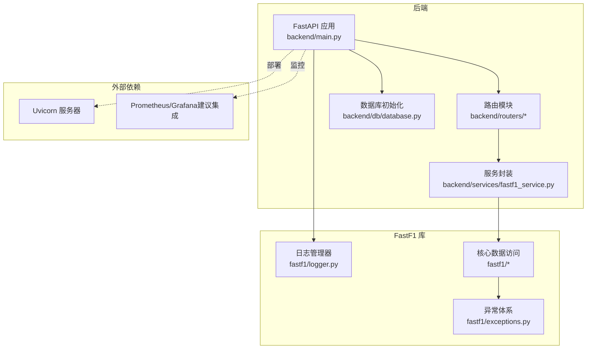
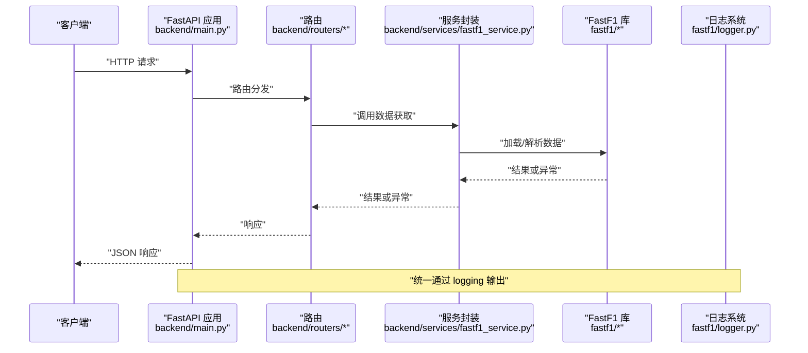
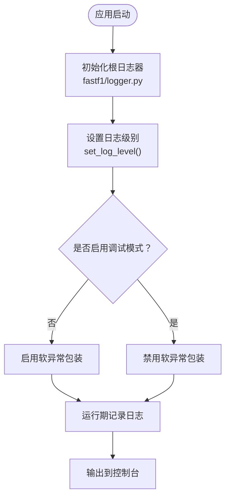
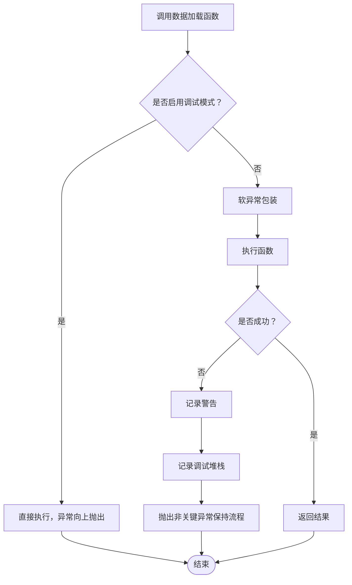
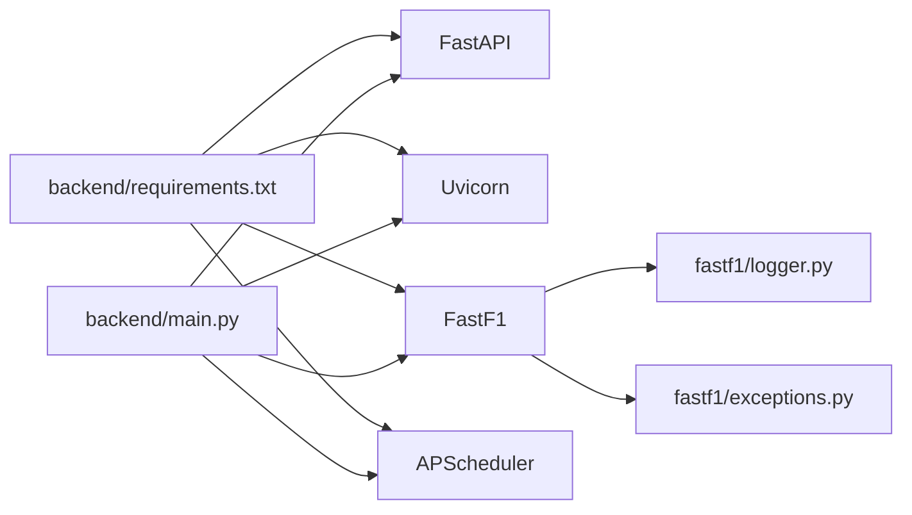

# 监控和日志

<cite>
**本文引用的文件**
- [fastf1/logger.py](file://fastf1/logger.py)
- [fastf1/exceptions.py](file://fastf1/exceptions.py)
- [docs/api_reference/logging.rst](file://docs/api_reference/logging.rst)
- [docs/contributing/contributing.rst](file://docs/contributing/contributing.rst)
- [backend/main.py](file://backend/main.py)
- [backend/start.sh](file://backend/start.sh)
- [backend/requirements.txt](file://backend/requirements.txt)
- [backend/routers/events.py](file://backend/routers/events.py)
- [backend/routers/telemetry.py](file://backend/routers/telemetry.py)
- [backend/routers/laptimes.py](file://backend/routers/laptimes.py)
- [backend/services/fastf1_service.py](file://backend/services/fastf1_service.py)
</cite>

## 目录
1. [简介](#简介)
2. [项目结构](#项目结构)
3. [核心组件](#核心组件)
4. [架构总览](#架构总览)
5. [详细组件分析](#详细组件分析)
6. [依赖关系分析](#依赖关系分析)
7. [性能考量](#性能考量)
8. [故障排查指南](#故障排查指南)
9. [结论](#结论)
10. [附录](#附录)

## 简介
本文件面向 Fast-F1 项目的监控与日志配置，覆盖以下主题：
- 日志系统配置与使用：日志级别、格式与输出目标
- 性能监控指标：API 响应时间、内存使用、并发连接数
- 错误追踪与异常处理：异常捕获、错误报告与调试信息
- 监控工具集成：Prometheus、Grafana 或其他平台的对接建议
- 日志轮转与存储策略：避免日志无限增长
- 告警配置与通知机制：及时发现系统异常

## 项目结构
后端采用 FastAPI 提供 REST 接口，前端小程序通过接口消费数据；FastF1 库负责数据获取与缓存。日志系统位于 fastf1 包内，后端通过标准 Python logging 记录运行期信息。

图表来源
- [backend/main.py:1-157](file://backend/main.py#L1-L157)
- [backend/services/fastf1_service.py:1-64](file://backend/services/fastf1_service.py#L1-L64)
- [fastf1/logger.py:1-125](file://fastf1/logger.py#L1-L125)
- [fastf1/exceptions.py:1-104](file://fastf1/exceptions.py#L1-L104)

章节来源
- [backend/main.py:1-157](file://backend/main.py#L1-L157)
- [backend/start.sh:1-25](file://backend/start.sh#L1-L25)
- [backend/requirements.txt:1-15](file://backend/requirements.txt#L1-L15)

## 核心组件
- 日志系统
  - 基于 Python 标准库 logging，根日志器命名空间为 fastf1，子日志器用于各模块
  - 默认控制台输出，格式包含模块名、级别与消息
  - 支持通过 set_log_level 动态调整日志级别
  - 支持调试模式（FASTF1_DEBUG=1），禁用“软异常”包装，便于开发调试
- 异常体系
  - 普通异常在数据加载路径被“软异常”装饰器捕获并转为警告
  - 关键异常（如速率限制）继承自 FastF1CriticalError，强制抛出
- 后端监控与缓存
  - 启动时启用本地缓存目录，提升数据加载性能
  - 内置进程级会话缓存，减少重复加载
  - 路由层实现内存缓存（TTL）与错误包装

章节来源
- [fastf1/logger.py:9-125](file://fastf1/logger.py#L9-L125)
- [fastf1/exceptions.py:4-104](file://fastf1/exceptions.py#L4-L104)
- [backend/main.py:14-16](file://backend/main.py#L14-L16)
- [backend/services/fastf1_service.py:11-22](file://backend/services/fastf1_service.py#L11-L22)
- [docs/api_reference/logging.rst:1-43](file://docs/api_reference/logging.rst#L1-L43)
- [docs/contributing/contributing.rst:333-384](file://docs/contributing/contributing.rst#L333-L384)

## 架构总览
后端应用启动时完成数据库初始化、定时任务调度与缓存预热；路由层负责对外提供接口，内部通过服务封装调用 FastF1 库进行数据获取与处理。日志系统贯穿应用与库层，统一输出到控制台。

图表来源
- [backend/main.py:117-157](file://backend/main.py#L117-L157)
- [backend/routers/telemetry.py:11-79](file://backend/routers/telemetry.py#L11-L79)
- [backend/services/fastf1_service.py:14-21](file://backend/services/fastf1_service.py#L14-L21)
- [fastf1/logger.py:29-31](file://fastf1/logger.py#L29-L31)

## 详细组件分析

### 日志系统配置与使用
- 日志级别
  - 默认显示 INFO 及以上级别
  - 可通过 set_log_level 设置为 WARNING/ERROR/CRITICAL 等
- 日志格式
  - 控制台格式包含模块名、级别与消息
- 输出目标
  - 默认输出到标准错误流（控制台）
- 调试模式
  - 设置环境变量 FASTF1_DEBUG=1 启用调试模式，禁用“软异常”包装
- 使用方式
  - 在模块顶部导入 get_logger 并创建子日志器
  - 使用不同级别（critical/error/warning/info/debug）输出信息

图表来源
- [fastf1/logger.py:21-31](file://fastf1/logger.py#L21-L31)
- [fastf1/logger.py:57-61](file://fastf1/logger.py#L57-L61)
- [docs/api_reference/logging.rst:9-28](file://docs/api_reference/logging.rst#L9-L28)

章节来源
- [fastf1/logger.py:9-125](file://fastf1/logger.py#L9-L125)
- [docs/api_reference/logging.rst:1-43](file://docs/api_reference/logging.rst#L1-L43)
- [docs/contributing/contributing.rst:333-384](file://docs/contributing/contributing.rst#L333-L384)

### 异常处理与错误追踪
- 软异常装饰器
  - 对数据加载函数进行包装，捕获未处理异常并记录警告与调试堆栈
  - 关键异常（FastF1CriticalError）不被捕获，直接抛出
- 调试模式下的异常行为
  - 禁用软异常包装，异常直接向上抛出，便于断点调试
- 路由层错误包装
  - 所有路由 try/catch 将异常转换为 err(...) 响应，避免服务崩溃

图表来源
- [fastf1/logger.py:86-125](file://fastf1/logger.py#L86-L125)
- [fastf1/exceptions.py:75-86](file://fastf1/exceptions.py#L75-L86)
- [backend/routers/telemetry.py:77-79](file://backend/routers/telemetry.py#L77-L79)

章节来源
- [fastf1/logger.py:86-125](file://fastf1/logger.py#L86-L125)
- [fastf1/exceptions.py:4-104](file://fastf1/exceptions.py#L4-L104)
- [docs/contributing/contributing.rst:408-431](file://docs/contributing/contributing.rst#L408-L431)
- [backend/routers/telemetry.py:77-79](file://backend/routers/telemetry.py#L77-L79)

### 性能监控指标
- API 响应时间
  - 当前代码未内置统一的响应时间统计中间件
  - 建议在网关或反向代理层（如 Nginx/Traefik）采集请求耗时
  - 或在 Uvicorn 层通过自定义中间件记录每个路由的耗时
- 内存使用率
  - 进程级会话缓存（_session_cache）减少重复加载，但未暴露内存指标
  - 建议通过操作系统监控（如 cAdvisor/Prometheus Node Exporter）采集进程内存
- 并发连接数
  - 未内置并发连接计数
  - 建议通过服务器/网关指标采集并发请求数

章节来源
- [backend/services/fastf1_service.py:11-22](file://backend/services/fastf1_service.py#L11-L22)
- [backend/routers/events.py:12-20](file://backend/routers/events.py#L12-L20)

### 监控工具集成（建议）
- Prometheus
  - 通过自定义中间件或 Uvicorn 统计指标（请求总数、耗时、错误码）
  - 导出指标供 Prometheus 抓取
- Grafana
  - 基于 Prometheus 数据源构建仪表盘（响应时间、错误率、内存、并发）
- 日志聚合
  - 将控制台日志重定向到文件或 stdout，配合 Fluent Bit/Fluentd/Vector 收集
  - 使用 ELK/EFK 或 Loki 进行日志检索与告警

（本节为概念性建议，不直接对应具体源码）

## 依赖关系分析
- 后端应用依赖 FastAPI、Uvicorn、FastF1、APScheduler 等
- 日志系统依赖 Python 标准库 logging
- 异常体系为 FastF1 库内部定义，供上层路由与服务使用

图表来源
- [backend/requirements.txt:1-15](file://backend/requirements.txt#L1-L15)
- [backend/main.py:1-11](file://backend/main.py#L1-L11)
- [fastf1/logger.py:1-7](file://fastf1/logger.py#L1-L7)
- [fastf1/exceptions.py:1-2](file://fastf1/exceptions.py#L1-L2)

章节来源
- [backend/requirements.txt:1-15](file://backend/requirements.txt#L1-L15)
- [backend/main.py:1-11](file://backend/main.py#L1-L11)

## 性能考量
- 缓存策略
  - 启动时启用本地缓存目录，提升 FastF1 数据加载速度
  - 服务层实现进程级会话缓存，避免重复 load
  - 路由层实现内存缓存（TTL），降低重复计算与网络请求
- 预热机制
  - 启动后异步预热常用会话与 API 结果，缩短首次请求延迟
- 建议优化
  - 引入统一的响应时间统计中间件
  - 对热点数据增加持久化缓存（Redis/Memcached）
  - 监控内存占用，必要时限制缓存大小

章节来源
- [backend/main.py:14-16](file://backend/main.py#L14-L16)
- [backend/main.py:55-115](file://backend/main.py#L55-L115)
- [backend/services/fastf1_service.py:11-22](file://backend/services/fastf1_service.py#L11-L22)
- [backend/routers/events.py:12-20](file://backend/routers/events.py#L12-L20)

## 故障排查指南
- 启用调试模式
  - 设置环境变量 FASTF1_DEBUG=1，禁用软异常包装，异常直接抛出
- 查看日志
  - 默认输出到控制台，可通过 set_log_level 调整级别
  - 使用 warning/info/debug 级别区分问题严重程度
- 常见问题定位
  - 数据加载失败：检查软异常装饰器是否捕获异常并记录警告
  - 关键异常：确认是否为 FastF1CriticalError 子类，需直接处理
  - 路由错误：查看 err(...) 返回体，定位上游异常

章节来源
- [fastf1/logger.py:57-61](file://fastf1/logger.py#L57-L61)
- [fastf1/logger.py:71-84](file://fastf1/logger.py#L71-L84)
- [fastf1/logger.py:86-125](file://fastf1/logger.py#L86-L125)
- [fastf1/exceptions.py:75-86](file://fastf1/exceptions.py#L75-L86)
- [backend/routers/telemetry.py:77-79](file://backend/routers/telemetry.py#L77-L79)

## 结论
- 日志系统基于标准库，配置简单、可控，支持动态调整级别与调试模式
- 异常体系清晰，普通异常“软异常”包装保证稳定性，关键异常强制抛出
- 性能方面已具备本地缓存与预热机制，建议补充统一指标采集与监控告警
- 建议引入 Prometheus/Grafana 与日志聚合方案，完善可观测性闭环

## 附录

### 日志配置清单
- 日志级别：INFO（默认），可通过 set_log_level 调整
- 日志格式：模块名、级别、消息
- 输出目标：控制台（标准错误）
- 调试模式：FASTF1_DEBUG=1 禁用软异常包装

章节来源
- [docs/api_reference/logging.rst:9-28](file://docs/api_reference/logging.rst#L9-L28)
- [fastf1/logger.py:21-31](file://fastf1/logger.py#L21-L31)
- [fastf1/logger.py:57-61](file://fastf1/logger.py#L57-L61)

### 启动与部署要点
- 启动脚本会加载 .env 环境变量并启动 Uvicorn
- 启动时创建 cache 目录并启用 FastF1 本地缓存

章节来源
- [backend/start.sh:16-24](file://backend/start.sh#L16-L24)
- [backend/main.py:14-16](file://backend/main.py#L14-L16)